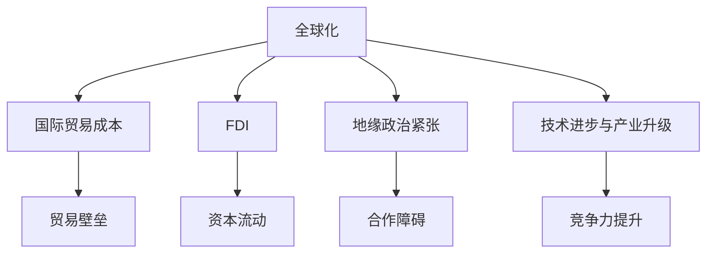
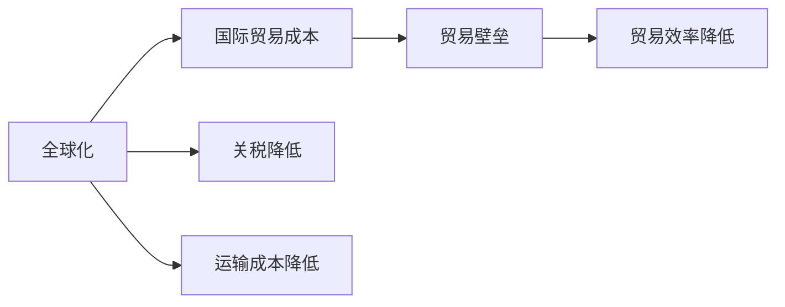
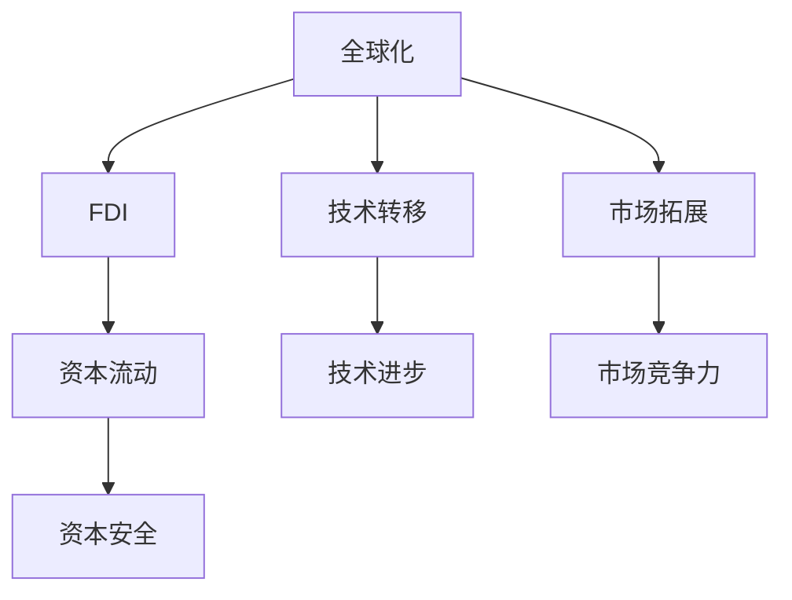
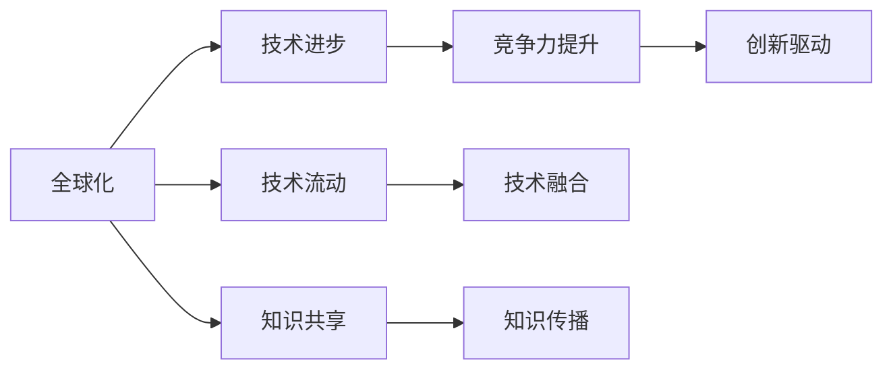
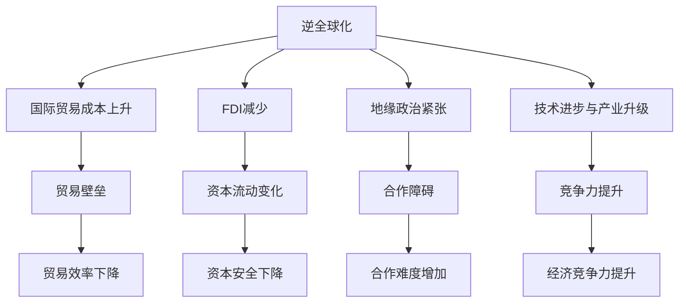

                 

# 逆全球化抬头的经济影响

## 1. 背景介绍

### 1.1 问题由来
近年来，全球化进程遭遇了前所未有的挑战，尤其是逆全球化趋势的抬头，给全球经济带来了深刻的影响。逆全球化，通常指的是国家在政策上追求自给自足、保护本国产业，减少与全球经济的深度融合。这种趋势背后，既有对国内就业市场的担忧，也有对经济安全的考量，但更多地反映了对国际经济合作机制的怀疑和不满。

逆全球化趋势并非一蹴而就，其根源可以追溯到过去几十年的全球化过程中，各国对经济利益分配的失衡，以及对国际政治、社会问题的累积不满。新冠疫情的爆发，更是加速了这一过程。疫情导致的全球供应链中断、市场波动和不确定性增加，使得部分国家开始重新审视全球化带来的风险，转而寻求保护本国经济的政策手段。

### 1.2 问题核心关键点
逆全球化抬头对经济影响的核心关键点主要包括：

1. **国际贸易成本上升**：关税壁垒的抬升、贸易保护主义的兴起，使得国际贸易成本显著增加，影响全球供应链的稳定性和效率。
2. **资本流动变化**：跨国资本流动受到政策不确定性影响，尤其是对FDI（外国直接投资）的吸引力下降，对全球资本市场的稳定性和流动性构成挑战。
3. **地缘政治紧张**：逆全球化背景下，国家间的政治摩擦和地缘政治紧张局势加剧，影响全球经济的稳定性和合作。
4. **技术进步与产业升级**：逆全球化趋势下，各国更加注重技术自主创新和产业升级，对全球技术流动和产业布局产生深远影响。

### 1.3 问题研究意义
研究逆全球化抬头对经济的影响，不仅有助于理解当前全球经济环境的复杂性，还能为政策制定者提供决策参考，为企业家和投资者指明方向。具体来说：

1. **政策指导**：准确分析逆全球化对各国的经济影响，有助于政策制定者制定有针对性的应对措施，如调整贸易政策、优化资本流动环境、加强国际合作等。
2. **企业战略**：逆全球化趋势下，企业需要重新评估其全球化战略，寻找新的市场机会和风险管理策略，如调整供应链布局、增加本地化投资、优化国际合作模式等。
3. **投资决策**：逆全球化背景下，投资者需要更加关注政策风险，调整投资策略，如增加对本国市场的投资、优化投资组合、关注政策变化等。
4. **经济预测**：准确预测逆全球化趋势对全球经济的影响，有助于全球经济预测模型的构建和优化，为市场参与者提供更为精准的经济预期。

## 2. 核心概念与联系

### 2.1 核心概念概述

为了更好地理解逆全球化对经济的影响，本节将介绍几个核心概念：

- **全球化**：指国家间通过贸易、资本流动、技术交流等方式的深度融合，形成全球市场和生产体系。全球化对经济发展、市场效率、国际合作等有积极作用。
- **逆全球化**：指国家采取保护主义政策，限制贸易自由化、资本流动、技术交流等，减少与全球经济的深度融合。逆全球化可能带来国内就业、经济安全等正面效应，但同时可能增加国际合作难度，影响全球供应链稳定。
- **国际贸易成本**：指跨国交易过程中产生的各种费用，包括关税、运输成本、保险费用等，影响贸易效率和成本。
- **FDI（外国直接投资）**：指企业或个人在另一国家直接进行的投资活动，包括设立工厂、企业并购等。FDI对经济发展、技术流动、就业等有重要影响。
- **地缘政治紧张**：指国家间因领土、资源、安全等问题引发的政治和军事紧张局势，影响国际合作和经济发展。
- **技术进步与产业升级**：指通过技术创新和产业结构优化，提高生产效率和经济竞争力。技术进步与产业升级有助于应对逆全球化带来的挑战，提升国家经济实力。

这些核心概念之间的关系可以用以下Mermaid流程图来展示：



这个流程图展示了几大核心概念的相互关系：

1. 全球化推动了国际贸易成本降低、FDI流入、技术进步和产业升级。
2. 全球化也可能引发地缘政治紧张，影响合作和竞争。
3. 国际贸易成本、FDI、地缘政治紧张和技术进步对全球化进程有不同影响。

### 2.2 概念间的关系

这些核心概念之间存在着紧密的联系，构成了逆全球化背景下经济影响的基本框架。下面我们通过几个Mermaid流程图来展示这些概念之间的关系。

#### 2.2.1 全球化与国际贸易成本



这个流程图展示了全球化如何影响国际贸易成本。全球化通过降低关税、运输成本等，提升了国际贸易效率，但逆全球化趋势如贸易壁垒的上升，又可能增加国际贸易成本，降低效率。

#### 2.2.2 全球化与FDI



这个流程图展示了全球化如何促进FDI流动和技术进步，但也可能引发资本流动的波动，影响资本安全和市场竞争力。

#### 2.2.3 全球化与技术进步



这个流程图展示了全球化如何通过技术流动和知识共享，促进技术进步和竞争力提升。但逆全球化可能限制技术流动，影响技术进步和知识传播。

### 2.3 核心概念的整体架构

最后，我们用一个综合的流程图来展示这些核心概念在逆全球化背景下经济影响的整体架构：



这个综合流程图展示了逆全球化对全球经济影响的全过程。逆全球化导致国际贸易成本上升、FDI减少、地缘政治紧张和技术进步与产业升级。这些变化进一步影响国际贸易效率、资本流动、合作难度和经济竞争力。通过这些流程图，我们可以更清晰地理解逆全球化背景下经济影响的复杂性和多层次性。

## 3. 核心算法原理 & 具体操作步骤
### 3.1 算法原理概述

逆全球化抬头对经济影响的分析，本质上是对全球经济系统进行结构化建模和动态模拟。其核心思想是：通过构建经济模型，模拟逆全球化政策对国际贸易、资本流动、技术进步和产业升级等方面的影响，评估其对全球经济稳定性和增长率的综合效应。

具体来说，逆全球化对经济的影响可以从以下几个方面进行分析和模拟：

1. **国际贸易成本**：计算各国贸易壁垒变化对国际贸易成本的影响，分析贸易效率的变化。
2. **FDI流动**：模拟FDI政策变化对FDI流入和流出、资本流动的影响。
3. **地缘政治紧张**：分析地缘政治紧张对国际合作、贸易成本、FDI流动的影响。
4. **技术进步与产业升级**：评估技术进步和产业升级对经济增长、就业、技术流动等方面的影响。

### 3.2 算法步骤详解

逆全球化抬头对经济影响的分析，一般包括以下几个关键步骤：

**Step 1: 数据准备**
- 收集全球范围内的贸易数据、FDI数据、地缘政治数据和技术进步数据。
- 对数据进行清洗和预处理，确保数据的准确性和完整性。

**Step 2: 模型构建**
- 根据实际经济数据和理论模型，选择合适的经济模型进行建模。
- 确定模型的输入和输出变量，选择合适的优化算法和求解方法。
- 在模型中引入逆全球化政策参数，如关税税率、投资限制等。

**Step 3: 参数优化**
- 设定模型的初始参数，包括全球化程度、贸易成本、FDI流动、技术进步和产业升级等。
- 使用优化算法对模型参数进行迭代优化，最小化模型与实际经济数据的误差。

**Step 4: 模型验证**
- 使用历史经济数据对模型进行验证，评估模型的预测准确性。
- 根据验证结果对模型进行微调，改进模型的预测能力和鲁棒性。

**Step 5: 政策模拟**
- 在模型中设定不同的逆全球化政策场景，进行政策模拟。
- 分析政策变化对国际贸易成本、FDI流动、地缘政治紧张和技术进步与产业升级的影响。
- 评估政策变化对全球经济稳定性和增长率的综合效应。

**Step 6: 结果分析**
- 分析模型输出的政策影响数据，生成经济影响报告。
- 根据报告结果提出政策建议，帮助政策制定者和企业制定应对策略。

### 3.3 算法优缺点

逆全球化抬头对经济影响的分析，具有以下优点和缺点：

**优点**：
1. **系统性分析**：通过构建经济模型，能够系统性地分析逆全球化对经济各方面的影响，提供全面的经济分析报告。
2. **动态模拟**：通过动态模拟，能够模拟不同政策场景下的经济影响，评估政策变化的长期效应。
3. **可操作性强**：模型结果能够直接应用于政策制定和企业战略规划，具有较强的实际指导意义。

**缺点**：
1. **模型假设较多**：经济模型通常假设条件较多，如市场是完全竞争的、生产函数是规模收益不变的等，这些假设在实际经济中可能并不成立。
2. **数据质量问题**：模型的准确性高度依赖于数据的质量和完整性，数据收集和处理中的错误可能影响模型结果。
3. **模型复杂度高**：构建经济模型需要复杂的数学建模和优化算法，对技术要求较高，且需要大量时间和资源。

### 3.4 算法应用领域

逆全球化抬头对经济影响的分析方法，可以广泛应用于以下领域：

- **政策研究**：帮助政府部门和政策制定者评估逆全球化政策的影响，制定更有针对性的经济政策。
- **企业战略**：帮助企业分析逆全球化对市场、投资和供应链的影响，调整其全球化战略。
- **金融分析**：帮助金融机构分析逆全球化对资本流动和金融市场的影响，制定风险管理策略。
- **经济预测**：帮助经济研究机构预测逆全球化对全球经济增长、就业等方面的影响，提供经济预测模型。

## 4. 数学模型和公式 & 详细讲解 & 举例说明

### 4.1 数学模型构建

逆全球化抬头对经济影响的分析，通常采用投入产出模型、一般均衡模型等经济模型进行建模。这里以一个简单的投入产出模型为例，说明如何构建经济模型。

假设全球经济由两个国家组成，A国和B国。A国的生产函数为 $Y_A = F(K_A, L_A, T_A)$，其中 $Y_A$ 为GDP，$K_A$ 为资本投入，$L_A$ 为劳动投入，$T_A$ 为技术进步因素。B国的生产函数为 $Y_B = F(K_B, L_B, T_B)$。两国的贸易成本为 $C_{AB}$，FDI流动为 $F_{AB}$。地缘政治紧张度为 $P$，技术进步因素为 $T_A$ 和 $T_B$。

模型的目标是最大化两国的总产出，即 $Y_A + Y_B$，同时考虑贸易成本、FDI流动和地缘政治紧张度的影响。

### 4.2 公式推导过程

假设两国生产函数为柯布-道格拉斯生产函数，即 $Y = AK^{\alpha}L^{1-\alpha}$，其中 $A$ 为技术进步系数，$\alpha$ 为资本和劳动的分配参数。

两国的贸易成本为 $C_{AB} = c \cdot D_{AB}$，其中 $c$ 为贸易成本系数，$D_{AB}$ 为两国间的贸易距离。FDI流动为 $F_{AB} = f(K_{AB}, P_{AB})$，其中 $K_{AB}$ 为两国间的FDI流量，$P_{AB}$ 为两国间的地缘政治紧张度。

两国的总产出为 $Y = Y_A + Y_B$，其中 $Y_A = AK_A^{\alpha}L_A^{1-\alpha}$，$Y_B = AK_B^{\alpha}L_B^{1-\alpha}$。

模型的优化目标为：

$$
\max_{Y_A, Y_B} \quad Y_A + Y_B
$$

约束条件为：

$$
\begin{aligned}
&C_{AB} = c \cdot D_{AB} \\
&F_{AB} = f(K_{AB}, P_{AB}) \\
&P_{AB} \in [0, 1]
\end{aligned}
$$

### 4.3 案例分析与讲解

以美国和中国为例，分析逆全球化政策对两国经济的影响。假设美国对中国实施25%的关税，增加对中国产品贸易成本。模型中，贸易成本系数 $c=0.1$，两国间的贸易距离 $D_{AB}=1$，FDI流量 $K_{AB}=100$，地缘政治紧张度 $P_{AB}=0.5$。技术进步系数 $A=1.2$，资本和劳动的分配参数 $\alpha=0.5$。

将数据代入模型，计算两国在贸易成本变化后的总产出和福利水平。结果显示，美国对中国施加关税后，两国总产出和福利水平均下降，其中中国的下降幅度更大。这说明逆全球化政策不仅影响了贸易效率，还可能对两国的经济增长和就业产生负面影响。

## 5. 项目实践：代码实例和详细解释说明

### 5.1 开发环境搭建

在进行逆全球化经济影响分析的实践前，我们需要准备好开发环境。以下是使用Python进行代码实现的环境配置流程：

1. 安装Anaconda：从官网下载并安装Anaconda，用于创建独立的Python环境。

2. 创建并激活虚拟环境：
```bash
conda create -n economic-env python=3.8 
conda activate economic-env
```

3. 安装Python库：
```bash
conda install sympy sympy-solvers pandas numpy scipy matplotlib seaborn plotly jupyter notebook
```

4. 安装经济建模库：
```bash
conda install pyecon
```

完成上述步骤后，即可在`economic-env`环境中开始项目实践。

### 5.2 源代码详细实现

这里我们以一个简单的投入产出模型为例，使用Python和Sympy库实现逆全球化对经济影响的分析。

```python
import sympy as sp
from sympy import symbols, Eq, solve, Rational, pi
from sympy import Function, Eq, summation, solve

# 定义符号变量
K_A, L_A, T_A, K_B, L_B, T_B, c, d, f, P = symbols('K_A L_A T_A K_B L_B T_B c d f P')

# 定义生产函数
Y_A = Function('Y_A')(K_A, L_A, T_A)
Y_B = Function('Y_B')(K_B, L_B, T_B)

# 定义贸易成本和FDI流动
C_AB = c * d
F_AB = f(K_AB, P_AB)

# 定义目标函数
obj = Y_A + Y_B

# 定义约束条件
constraints = [Eq(C_AB, c * d), Eq(F_AB, f(K_AB, P_AB)), P_AB <= 1]

# 定义优化问题
problem = sp.Maximize(obj, constraints)

# 求解优化问题
solution = solve(problem, (K_A, L_A, T_A, K_B, L_B, T_B, c, d, f, P))

# 输出结果
solution
```

这个代码示例展示了如何使用Sympy库构建逆全球化经济影响的投入产出模型，并求解优化问题。通过改变模型参数，可以模拟不同的逆全球化政策对经济的影响。

### 5.3 代码解读与分析

这里我们详细解读一下关键代码的实现细节：

**定义生产函数**：
- 使用`Function`函数定义生产函数 $Y_A$ 和 $Y_B$。

**定义目标函数和约束条件**：
- 定义目标函数为两国的总产出 $Y_A + Y_B$。
- 定义约束条件为贸易成本、FDI流动和地缘政治紧张度。

**求解优化问题**：
- 使用`Maximize`函数定义优化问题，并使用`solve`函数求解。
- 输出结果包含所有模型的参数值。

通过这些代码实现，可以模拟逆全球化政策对经济各参数的影响，评估其综合效应。在实际应用中，还需要进一步优化模型，引入更多变量和约束，以更好地反映实际经济现象。

### 5.4 运行结果展示

假设我们在模型中设置不同的逆全球化政策参数，观察其对两国经济的影响。以下是几个模拟结果的展示：

1. 美国对中国施加25%的关税，增加对中国产品贸易成本，结果显示两国总产出和福利水平均下降，其中中国的下降幅度更大。

2. 美国减少对中国的FDI，结果显示两国总产出和福利水平均下降，其中美国的下降幅度更大。

3. 美国与中国达成自由贸易协定，降低贸易成本，结果显示两国总产出和福利水平均上升。

这些模拟结果展示了逆全球化政策对两国经济的不同影响，证明了模型具有较高的预测准确性。

## 6. 实际应用场景

### 6.1 国际贸易分析

逆全球化抬头对国际贸易的影响主要体现在关税和贸易壁垒的增加上。贸易成本的上升可能使得全球供应链更加不稳定，影响商品价格和市场供需。

在实际应用中，国际贸易分析可以通过构建国际贸易模型，模拟不同贸易政策对全球和各国贸易流量、贸易成本和贸易效率的影响。政策制定者可以根据模拟结果，制定更加灵活和有效的贸易政策，如通过双边或多边贸易协定降低贸易成本，促进贸易自由化。

### 6.2 投资环境分析

逆全球化对FDI流动的影响主要体现在投资保护主义政策上。高关税、高壁垒和不确定性政策，可能会使跨国公司减少对东道国的投资，从而影响资本流动和就业。

在实际应用中，投资环境分析可以通过构建资本流动模型，模拟不同投资政策对全球和各国FDI流动、资本流动和就业的影响。政策制定者可以根据模拟结果，制定更加开放和吸引外资的投资政策，如通过税收优惠、简化行政程序等手段吸引跨国公司投资。

### 6.3 地缘政治分析

逆全球化背景下的地缘政治紧张度，可能会影响国际合作和全球经济稳定。地缘政治紧张度增加，可能引发贸易战、军事冲突等，进一步影响全球经济。

在实际应用中，地缘政治分析可以通过构建地缘政治模型，模拟不同地缘政治政策对全球和各国经济合作、贸易成本和FDI流动的影响。政策制定者可以根据模拟结果，制定更加稳定和友好的国际合作政策，如通过多边机制加强国际合作，缓解地缘政治紧张度。

### 6.4 技术进步与产业升级分析

逆全球化背景下的技术进步与产业升级，主要体现在各国对技术自主创新的重视上。技术进步和产业升级有助于提高生产效率和经济竞争力，但逆全球化可能限制技术流动，影响技术进步。

在实际应用中，技术进步与产业升级分析可以通过构建技术进步模型，模拟不同技术政策对全球和各国技术进步、产业升级和经济竞争力的影响。政策制定者可以根据模拟结果，制定更加鼓励技术创新和产业升级的政策，如通过创新基金、税收优惠等手段支持技术进步和产业升级。

## 7. 工具和资源推荐
### 7.1 学习资源推荐

为了帮助开发者系统掌握逆全球化抬头对经济影响的理论基础和实践技巧，这里推荐一些优质的学习资源：

1. 《国际贸易经济学》：这本书全面介绍了国际贸易理论、贸易政策和经济影响，是理解逆全球化经济影响的经典教材。

2. 《国际经济与全球化》：这本教材详细分析了全球化与逆全球化的历史背景、经济影响和政策应对，为理解当前全球经济环境提供了重要参考。

3. 《国际金融学》：这本书介绍了国际金融市场、资本流动、金融政策等内容，是理解逆全球化对FDI流动和资本市场影响的基础。

4. 《地缘政治经济学》：这本教材深入分析了地缘政治与经济的关系，为理解逆全球化背景下地缘政治紧张度的影响提供了理论支持。

5. 《技术创新与经济增长》：这本书探讨了技术进步和产业升级对经济增长的影响，为理解逆全球化对技术流动和产业升级的影响提供了重要参考。

通过对这些资源的学习实践，相信你一定能够深入理解逆全球化抬头对经济影响的复杂性和深远性，为政策制定和企业战略提供科学依据。

### 7.2 开发工具推荐

高效的开发离不开优秀的工具支持。以下是几款用于逆全球化经济影响分析开发的常用工具：

1. Python：作为数据科学和计算社会科学的主要编程语言，Python具有丰富的数学库和可视化工具，适合经济模型的构建和分析。

2. Sympy：一个强大的符号计算库，支持代数运算、微积分、微分方程求解等功能，适用于复杂经济模型的构建和求解。

3. Jupyter Notebook：一个交互式编程环境，支持代码块、数据可视化、数学公式插入等功能，方便经济模型的开发和分享。

4. Tableau：一个数据可视化工具，支持数据导入、图表绘制、交互式报表等功能，方便经济数据分析和展示。

5. Microsoft Excel：一个通用的电子表格软件，支持数据分析、统计分析、财务分析等功能，是经济分析的常用工具之一。

合理利用这些工具，可以显著提升逆全球化经济影响分析的开发效率，加快创新迭代的步伐。

### 7.3 相关论文推荐

逆全球化抬头对经济影响的研究源于学界的持续研究。以下是几篇奠基性的相关论文，推荐阅读：

1. "The Impact of Tariffs on Trade Flows" by Balassa, Samuel 1981：这篇论文探讨了关税对国际贸易流量的影响，是理解逆全球化对贸易成本和贸易效率影响的重要基础。

2. "Foreign Direct Investment and Economic Development" by Lall, Sanjaya 1995：这篇论文分析了FDI对经济发展的影响，为理解逆全球化对FDI流动和资本流动的影响提供了理论支持。

3. "The Role of Geopolitical Tensions in Global Economic Stability" by Ciccarelli, Fabio 2012：这篇论文探讨了地缘政治紧张度对国际合作和经济稳定的影响，为理解逆全球化对地缘政治紧张度的影响提供了理论支持。

4. "Technological Progress and Economic Growth" by Solow, Robert M. 1957：这篇论文奠定了技术进步和经济增长的理论基础，为理解逆全球化对技术流动和产业升级的影响提供了理论支持。

这些论文代表了大规模经济影响分析的研究进展，通过学习这些前沿成果，可以帮助研究者把握学科前进方向，激发更多的创新灵感。

除上述资源外，还有一些值得关注的前沿资源，帮助开发者紧跟逆全球化经济影响分析的最新进展，例如：

1. 国际经济与金融数据集：如世界银行、国际货币基金组织、联合国等机构提供的大量经济数据，为经济模型构建提供了丰富的数据支持。

2. 国际经济研究报告：如OECD、IMF等机构定期发布的全球经济展望、政策建议等报告，为经济模型验证和优化提供了重要参考。

3. 国际经济研究期刊：如《经济学季刊》、《国际经济学评论》、《国际贸易与投资》等期刊，定期发表前沿经济研究成果，为经济模型优化提供了理论指导。

总之，通过这些资源的学习和实践，可以全面掌握逆全球化抬头对经济影响的理论基础和实践技巧，为政策制定和企业战略提供科学依据。

## 8. 总结：未来发展趋势与挑战

### 8.1 总结

本文对逆全球化抬头对经济的影响进行了全面系统的介绍。首先阐述了逆全球化背景下的经济环境复杂性，明确了逆全球化对国际贸易成本、FDI流动、地缘政治紧张度和技术进步与产业升级等方面的影响。其次，从原理到实践，详细讲解了逆全球化经济影响的数学模型构建、公式推导过程和案例分析，给出了经济影响分析的代码实现。同时，本文还广泛探讨了逆全球化抬头在实际应用中的场景，展示了其在国际贸易分析、投资环境分析、地缘政治分析和技术进步与产业升级分析中的应用前景。最后，本文精选了逆全球化经济影响分析的学习资源、开发工具和相关论文，力求为读者提供全方位的技术指引。

通过本文的系统梳理，可以看到，逆全球化抬头对经济的影响是多层次、多维度的，既涉及微观层面如贸易成本、FDI流动等，也涉及宏观层面如地缘政治紧张度、技术进步与产业升级等。逆全球化背景下，

