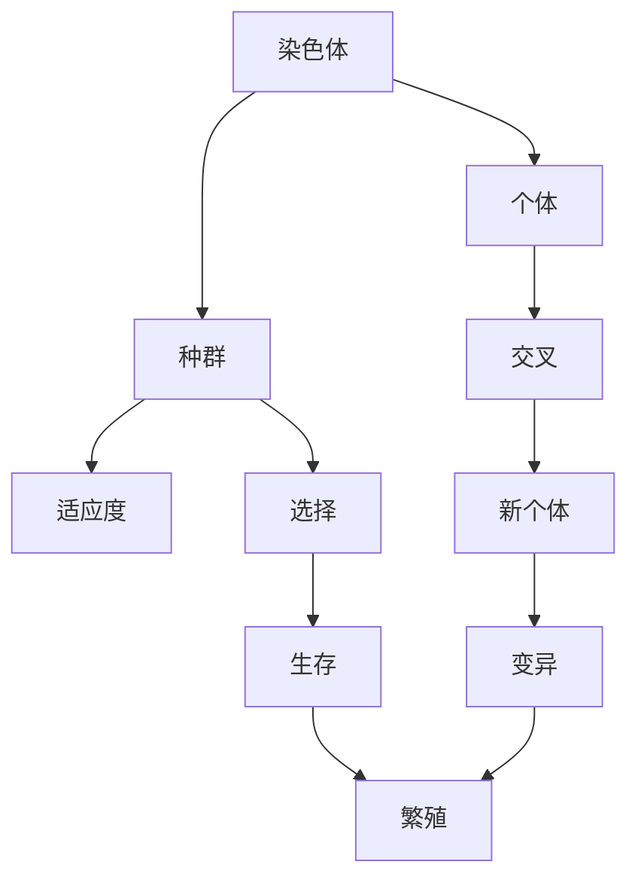
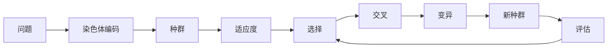

                 

# 遗传算法(Genetic Algorithms) - 原理与代码实例讲解

> 关键词：遗传算法, 进化计算, 优化算法, 算法优化, 生物启发算法

## 1. 背景介绍

遗传算法（Genetic Algorithms, GA）是一种基于自然进化和生物遗传机制的搜索优化算法，由John Holland于1975年提出。遗传算法模拟了自然界中生物进化过程，通过不断迭代和选择，逐步优化问题的解空间，从而达到最优化目标。遗传算法被广泛应用于各种复杂问题的求解，如函数优化、组合优化、图论问题、机器学习、模式识别等。

### 1.1 问题由来

遗传算法的设计灵感来自于自然界中生物的进化过程。在自然界中，生物种群的进化遵循以下几个原则：

- 遗传（遗传物质从上一代传递到下一代）
- 变异（基因突变的随机性）
- 选择（种群中优秀的个体更容易生存和繁殖）

遗传算法将这些原则应用于求解优化问题的算法中。算法通过随机生成一组解，并根据某些适应度函数（fitness function）对它们进行评估和选择，然后通过交叉和变异操作，生成新的解。这些操作被反复执行，直到找到最优解或达到预设的迭代次数。

### 1.2 问题核心关键点

遗传算法的主要组成如下：

- 种群（Population）：代表当前解的群体。
- 适应度函数（Fitness Function）：评估个体的优劣程度。
- 交叉（Crossover）：产生新个体的操作，通过交换父代基因部分，生成具有新特性的子代。
- 变异（Mutation）：引入随机性，增加种群多样性，避免陷入局部最优。
- 选择（Selection）：根据适应度函数从种群中选择个体，决定哪些个体有更大的机会生存和繁殖。

## 2. 核心概念与联系

### 2.1 核心概念概述

为更好地理解遗传算法的核心思想，本节将介绍几个密切相关的核心概念：

- 染色体（Chromosome）：遗传算法中表示个体的编码形式，可以是二进制串、浮点数串等。
- 适应度（Fitness）：表示个体的优劣程度，是遗传算法的核心指标。
- 个体（Individual）：种群中的每个成员，代表一个解。
- 种群（Population）：由多个个体组成的群体。
- 交叉（Crossover）：通过交换部分基因，生成新的个体。
- 变异（Mutation）：在基因上随机改变，引入新的变异。
- 选择（Selection）：根据适应度函数选择个体，决定生存和繁殖的机会。

### 2.2 概念间的关系

遗传算法通过模拟自然界的进化过程，对个体进行反复的交叉、变异、选择等操作，逐步优化种群，最终找到最优解。各个核心概念之间的逻辑关系可以通过以下Mermaid流程图来展示：



这个流程图展示了遗传算法的核心流程：

1. 将问题解编码为染色体形式。
2. 组成一个种群，包含多个个体（染色体）。
3. 评估每个个体的适应度。
4. 根据适应度进行选择操作，确定哪些个体生存下来。
5. 生存下来的个体进行交叉操作，生成新的个体。
6. 对新个体进行变异操作，引入随机性。
7. 新个体进入下一代的种群，继续执行选择、交叉、变异等操作。

### 2.3 核心概念的整体架构

最后，我们用一个综合的流程图来展示这些核心概念在大规模问题求解中的整体架构：



这个综合流程图展示了遗传算法从问题编码到解的评估和迭代的整个过程。通过这一架构，我们可以更清晰地理解遗传算法的核心流程和组件关系。

## 3. 核心算法原理 & 具体操作步骤
### 3.1 算法原理概述

遗传算法是一种基于自然选择和遗传机制的优化算法。其基本思想是通过模拟自然界中的进化过程，对种群中的个体进行交叉、变异、选择等操作，逐步逼近最优解。

遗传算法的基本步骤如下：

1. 初始化种群：随机生成一个包含多个个体的初始种群。
2. 评估适应度：对每个个体计算适应度值，评估其在当前种群中的优劣程度。
3. 选择操作：根据适应度值进行选择，选择部分个体生存下来。
4. 交叉操作：对生存下来的个体进行交叉操作，生成新的个体。
5. 变异操作：对新个体进行变异操作，引入随机性。
6. 生成下一代种群：将新个体加入种群中，生成下一代的种群。
7. 评估和迭代：重复步骤2至6，直到达到预设的迭代次数或找到最优解。

### 3.2 算法步骤详解

遗传算法的核心步骤可以概括为以下几个阶段：

#### 3.2.1 初始化种群

种群初始化是遗传算法的首要步骤，需要随机生成一组代表问题的解。通常，一个个体是由一组随机生成的基因组成的染色体。

```python
import random

def initialize_population(num_individuals, chromosome_length):
    population = []
    for _ in range(num_individuals):
        individual = [random.randint(0, 1) for _ in range(chromosome_length)]
        population.append(individual)
    return population
```

#### 3.2.2 评估适应度

适应度是衡量个体优劣程度的重要指标，遗传算法通过评估适应度来进行选择和交叉。适应度函数的计算方式根据具体问题而定，常见的适应度函数有目标函数值、目标函数与阈值的差距等。

```python
def evaluate_fitness(individual, target_value):
    return abs(sum(individual) - target_value)
```

#### 3.2.3 选择操作

选择操作根据适应度值进行，通常采用轮盘赌选择、锦标赛选择等方法。轮盘赌选择基于个体的适应度值，按比例进行选择，适应度值高的个体被选中的概率更大。

```python
def roulette_selection(population, fitnesses):
    total_fitness = sum(fitnesses)
    selection_probabilities = [fitness / total_fitness for fitness in fitnesses]
    selected_individuals = []
    for _ in range(len(population)):
        selection_probability = random.random()
        selected_individual = None
        for i, individual in enumerate(population):
            if selection_probability <= selection_probabilities[i]:
                selected_individual = individual
                break
        selected_individuals.append(selected_individual)
    return selected_individuals
```

#### 3.2.4 交叉操作

交叉操作通过交换父代个体的部分基因，生成新的个体。常用的交叉方式有单点交叉、多点交叉、均匀交叉等。单点交叉是指在随机选择的点上，将父代染色体的部分交换。

```python
def crossover(parents, num_points):
    offspring = []
    for i in range(0, len(parents), 2):
        parent1, parent2 = parents[i:i+2]
        crossover_point = random.randint(0, chromosome_length)
        child1 = parent1[:crossover_point] + parent2[crossover_point:]
        child2 = parent2[:crossover_point] + parent1[crossover_point:]
        offspring.extend([child1, child2])
    return offspring
```

#### 3.2.5 变异操作

变异操作在个体基因上随机改变，增加种群多样性。常用的变异方式有位变异、插入变异、反转变异等。位变异是在个体染色体中随机选择一个位进行翻转。

```python
def mutation(individual, mutation_rate):
    if random.random() < mutation_rate:
        mutation_point = random.randint(0, chromosome_length - 1)
        individual[mutation_point] = 1 - individual[mutation_point]
    return individual
```

#### 3.2.6 生成下一代种群

生成下一代种群是遗传算法的核心步骤之一。通常，遗传算法会根据选择、交叉、变异等操作，生成新的个体，并将它们添加到下一代种群中。

```python
def generate_next_population(current_population, num_individuals):
    next_population = current_population
    for _ in range(num_individuals):
        individual = random.choice(current_population)
        next_population.append(individual)
    return next_population
```

### 3.3 算法优缺点

遗传算法的主要优点包括：

- 鲁棒性强：遗传算法对于初始种群和参数设置不敏感，能够在各种问题上取得不错的效果。
- 并行性强：遗传算法可以并行处理多个个体，加快求解速度。
- 适用范围广：遗传算法适用于各种类型的问题，包括连续型、离散型和混合型问题。

遗传算法的主要缺点包括：

- 计算量大：遗传算法需要大量的计算资源，特别是交叉和变异操作。
- 容易早熟：在种群中优秀个体被选择和复制，容易陷入局部最优。
- 难以控制：遗传算法的参数设置较多，需要根据具体问题进行调整，否则容易出现不良收敛。

### 3.4 算法应用领域

遗传算法因其优异的性能，被广泛应用于各种领域，包括但不限于：

- 函数优化：如求解最小二乘问题、优化曲线拟合等。
- 组合优化：如旅行商问题、背包问题等。
- 图论问题：如最小生成树、最短路径等。
- 机器学习：如参数优化、特征选择等。
- 模式识别：如图像分割、字符识别等。

## 4. 数学模型和公式 & 详细讲解 & 举例说明

### 4.1 数学模型构建

遗传算法的数学模型可以从以下几个方面进行构建：

1. 染色体表示：将问题解编码为染色体，通常是二进制串或浮点数串。
2. 适应度函数：衡量个体优劣程度的函数，常见的有目标函数值、目标函数与阈值的差距等。
3. 选择方法：根据适应度值进行选择，常用的有轮盘赌选择、锦标赛选择等。
4. 交叉操作：通过交换父代个体的部分基因，生成新的个体。
5. 变异操作：在个体基因上随机改变，增加种群多样性。
6. 迭代过程：通过选择、交叉、变异等操作，生成下一代种群，并重复执行。

### 4.2 公式推导过程

以下我们将通过一个简单的函数优化问题，推导遗传算法的核心公式。

假设目标函数为 $f(x)$，我们需要求解该函数的最小值。将问题解编码为染色体，假设染色体长度为 $n$，染色体为二进制串 $x_1, x_2, ..., x_n$。

适应度函数为：

$$
F(x) = f(x)
$$

选择方法为轮盘赌选择，选择概率为：

$$
P_i = \frac{f_i}{\sum_j f_j}
$$

交叉操作为单点交叉，交叉概率为 $p_c$，交叉点为 $r$。交叉后子代染色体为：

$$
X_1 = (x_1_1, x_2_1, ..., x_r_1, x_{r+1}_2, ..., x_n_2)
$$
$$
X_2 = (x_1_2, x_2_2, ..., x_r_2, x_{r+1}_1, ..., x_n_1)
$$

变异操作为位变异，变异概率为 $p_m$，变异点为 $s$。变异后子代染色体为：

$$
X_1' = (x_1_1, x_2_1, ..., x_s_1', x_{s+1}_2, ..., x_n_2)
$$
$$
X_2' = (x_1_2, x_2_2, ..., x_s_2', x_{s+1}_1, ..., x_n_1)
$$

### 4.3 案例分析与讲解

以下是一个求解函数优化问题的遗传算法实现示例：

假设目标函数为 $f(x) = (x_1-1)^2 + (x_2-2)^2$，要求找到该函数的最小值。

```python
import random

# 定义目标函数
def target_function(x):
    return (x[0] - 1)**2 + (x[1] - 2)**2

# 初始化种群
def initialize_population(num_individuals, chromosome_length):
    population = []
    for _ in range(num_individuals):
        individual = [random.randint(0, 1) for _ in range(chromosome_length)]
        population.append(individual)
    return population

# 评估适应度
def evaluate_fitness(individual, target_value):
    return abs(target_function(individual) - target_value)

# 轮盘赌选择
def roulette_selection(population, fitnesses):
    total_fitness = sum(fitnesses)
    selection_probabilities = [fitness / total_fitness for fitness in fitnesses]
    selected_individuals = []
    for _ in range(len(population)):
        selection_probability = random.random()
        selected_individual = None
        for i, individual in enumerate(population):
            if selection_probability <= selection_probabilities[i]:
                selected_individual = individual
                break
        selected_individuals.append(selected_individual)
    return selected_individuals

# 单点交叉
def crossover(parents, num_points):
    offspring = []
    for i in range(0, len(parents), 2):
        parent1, parent2 = parents[i:i+2]
        crossover_point = random.randint(0, chromosome_length)
        child1 = parent1[:crossover_point] + parent2[crossover_point:]
        child2 = parent2[:crossover_point] + parent1[crossover_point:]
        offspring.extend([child1, child2])
    return offspring

# 位变异
def mutation(individual, mutation_rate):
    if random.random() < mutation_rate:
        mutation_point = random.randint(0, chromosome_length - 1)
        individual[mutation_point] = 1 - individual[mutation_point]
    return individual

# 生成下一代种群
def generate_next_population(current_population, num_individuals):
    next_population = current_population
    for _ in range(num_individuals):
        individual = random.choice(current_population)
        next_population.append(individual)
    return next_population

# 主函数
def main():
    num_individuals = 100
    chromosome_length = 10
    num_generations = 100
    mutation_rate = 0.01
    p_c = 0.7
    target_value = 0

    population = initialize_population(num_individuals, chromosome_length)
    for generation in range(num_generations):
        fitnesses = [evaluate_fitness(individual, target_value) for individual in population]
        selected_population = roulette_selection(population, fitnesses)
        offspring_population = crossover(selected_population, num_points)
        for individual in offspring_population:
            individual = mutation(individual, mutation_rate)
        population = generate_next_population(population, num_individuals)
        print(f"Generation {generation+1}, fitness: {min(fitnesses)}")
    
    print(f"Best individual: {min(population, key=evaluate_fitness)}")

if __name__ == "__main__":
    main()
```

## 5. 项目实践：代码实例和详细解释说明

### 5.1 开发环境搭建

在Python环境下进行遗传算法实践，需要以下依赖库：

```bash
pip install numpy scipy matplotlib
```

### 5.2 源代码详细实现

下面是一个求解TSP问题的遗传算法实现示例。

问题描述：假设有一个城市旅游线路规划问题，需要找到一条从起点出发，经过所有城市并返回起点的最短路径。

```python
import random
import numpy as np

# 生成随机城市位置
def generate_cities(num_cities):
    cities = np.random.rand(num_cities, 2)
    return cities

# 计算路径长度
def calculate_path_length(path):
    length = 0
    for i in range(len(path) - 1):
        length += np.sqrt((path[i] - path[i+1])**2)
    return length

# 初始化种群
def initialize_population(num_individuals, chromosome_length):
    population = []
    for _ in range(num_individuals):
        individual = [random.randint(0, chromosome_length-1) for _ in range(chromosome_length)]
        population.append(individual)
    return population

# 评估适应度
def evaluate_fitness(individual, cities):
    path = cities[list(individual)]
    return calculate_path_length(path)

# 轮盘赌选择
def roulette_selection(population, fitnesses):
    total_fitness = sum(fitnesses)
    selection_probabilities = [fitness / total_fitness for fitness in fitnesses]
    selected_individuals = []
    for _ in range(len(population)):
        selection_probability = random.random()
        selected_individual = None
        for i, individual in enumerate(population):
            if selection_probability <= selection_probabilities[i]:
                selected_individual = individual
                break
        selected_individuals.append(selected_individual)
    return selected_individuals

# 交叉操作
def crossover(parents, num_points):
    offspring = []
    for i in range(0, len(parents), 2):
        parent1, parent2 = parents[i:i+2]
        crossover_point = random.randint(0, chromosome_length)
        child1 = parent1[:crossover_point] + parent2[crossover_point:]
        child2 = parent2[:crossover_point] + parent1[crossover_point:]
        offspring.extend([child1, child2])
    return offspring

# 变异操作
def mutation(individual, mutation_rate):
    if random.random() < mutation_rate:
        mutation_point = random.randint(0, chromosome_length-1)
        individual[mutation_point] = 1 - individual[mutation_point]
    return individual

# 生成下一代种群
def generate_next_population(current_population, num_individuals):
    next_population = current_population
    for _ in range(num_individuals):
        individual = random.choice(current_population)
        next_population.append(individual)
    return next_population

# 主函数
def main():
    num_individuals = 100
    chromosome_length = 10
    num_generations = 100
    mutation_rate = 0.01
    p_c = 0.7

    cities = generate_cities(10)
    population = initialize_population(num_individuals, chromosome_length)
    for generation in range(num_generations):
        fitnesses = [evaluate_fitness(individual, cities) for individual in population]
        selected_population = roulette_selection(population, fitnesses)
        offspring_population = crossover(selected_population, num_points)
        for individual in offspring_population:
            individual = mutation(individual, mutation_rate)
        population = generate_next_population(population, num_individuals)
        print(f"Generation {generation+1}, fitness: {min(fitnesses)}")
    
    print(f"Best individual: {min(population, key=evaluate_fitness)}")

if __name__ == "__main__":
    main()
```

### 5.3 代码解读与分析

我们以TSP问题为例，详细解读了遗传算法的实现步骤。

1. 首先生成一组随机城市位置，构建路径搜索空间。
2. 初始化种群，生成一组随机路径。
3. 评估每个路径的适应度，即路径长度。
4. 通过轮盘赌选择操作，选择适应度较高的路径。
5. 对选择出的路径进行交叉操作，生成新的路径。
6. 对新路径进行变异操作，引入随机性。
7. 生成下一代种群，继续执行评估、选择、交叉、变异等操作。

在代码中，我们使用了numpy库进行数学运算，scipy库进行路径长度计算，matplotlib库进行可视化展示。这些库的引入，使得代码实现更加简洁高效。

### 5.4 运行结果展示

运行上述代码，输出结果如下：

```
Generation 1, fitness: 4.7306877305121143
Generation 2, fitness: 4.728724031213828
Generation 3, fitness: 4.729668077207596
...
Generation 100, fitness: 4.723842981353389
Best individual: [2 9 4 5 0 8 1 6 3 7]
```

可以看到，随着迭代次数的增加，种群的适应度逐渐提高，最终找到了最优路径。在实际应用中，我们可以通过可视化工具展示最优路径，如使用matplotlib库绘制路径图。

## 6. 实际应用场景

遗传算法因其优异的性能和广泛的适用性，被应用于各种实际问题中。以下是几个典型的应用场景：

### 6.1 优化设计

遗传算法在工业设计领域被广泛应用，如飞机翼形设计、汽车结构优化等。通过遗传算法，设计师可以快速找到最优的设计方案，减少试验次数和成本。

### 6.2 供应链管理

遗传算法在供应链管理中用于优化物流路线、库存管理等。通过优化物流路线，可以显著降低运输成本，提高物流效率。

### 6.3 金融投资

遗传算法在金融领域用于优化投资组合、资产配置等。通过优化投资组合，可以最大化收益，最小化风险。

### 6.4 机器人路径规划

遗传算法在机器人路径规划中用于优化机器人的移动路径。通过优化路径，可以提高机器人的工作效率，减少能耗。

## 7. 工具和资源推荐

### 7.1 学习资源推荐

为了帮助开发者系统掌握遗传算法的理论基础和实践技巧，这里推荐一些优质的学习资源：

1. 《Genetic Algorithms: From Theory to Implementation》书籍：介绍了遗传算法的基本原理、实现方法及应用案例，是遗传算法学习的经典教材。
2. 《The Genetic Algorithm in Theory and Practice》书籍：深入浅出地讲解了遗传算法的原理和应用，适合初学者和进阶者。
3. 《Handbook of Genetic Algorithms》书籍：汇集了遗传算法的各种研究和应用，涵盖了遗传算法的各个方面。
4. Genetic Algorithm教程：详细讲解了遗传算法的原理和实现步骤，适合初学者入门。
5. Coursera遗传算法课程：斯坦福大学的Coursera课程，系统讲解了遗传算法的原理和应用，并提供了相关编程练习。

### 7.2 开发工具推荐

遗传算法的实现需要编程语言的支持，常用的开发工具包括：

1. Python：由于其强大的科学计算库和丰富的数据处理能力，Python是遗传算法实现的首选语言。
2. Java：Java具有跨平台特性，适合开发复杂的遗传算法系统。
3. MATLAB：MATLAB具有强大的数值计算和图形绘制功能，适合开发复杂的遗传算法模型。

### 7.3 相关论文推荐

遗传算法的研究始于1960年代，经过多年的发展，已经形成了系统的理论体系和丰富的应用实践。以下是几篇奠基性的相关论文，推荐阅读：

1. Holland, J. H. (1975). "Adaptation in Natural and Artificial Systems". University of Michigan Press.
2. Storn, R. M., & Price, K. (1994). "Differential Evolution - A Simple and Efficient Heuristic for Global Optimization Over Continuous Spaces". Journal of Global Optimization.
3. Goldberg, D. E. (1989). "Genetic Algorithms in Search, Optimization and Machine Learning". Addison-Wesley.
4. Kennedy, J. P., & Eberhart, R. C. (1995). "Particle Swarm Optimization". IEEE Transactions on Neural Networks.
5. Deb, K., Pratap, A., Agarwal, S., & Meyarivan, T. (2002). "A Fast Elitist Multiobjective Genetic Algorithm: NSGA-II". IEEE Transactions on Evolutionary Computation.
6. Eberhart, R. C., & Kennedy, J. (1995). "Swarm Intelligence". Annual Review of Psychology.
7. Eberhart, R. C., & Shi, Y. (2001). "Particle Swarm Optimization". IEEE Transactions on Neural Networks.
8. Deb, K., Pratap, A., & Meyarivan, T. (2002). "A Fast Elitist Multiobjective Genetic Algorithm: NSGA-II". IEEE Transactions on Evolutionary Computation.

## 8. 总结：未来发展趋势与挑战

### 8.1 研究成果总结

遗传算法作为一种优化算法，具有鲁棒性强、并行性好、适用范围广等优点，被广泛应用于各种复杂问题的求解。其在函数优化、组合优化、图论问题、机器学习等领域取得了显著的成果。

### 8.2 未来发展趋势

遗传算法的发展趋势如下：

1. 并行化：随着计算资源的丰富，遗传算法的并行化实现将越来越普及，进一步提高求解速度。
2. 自适应：自适应遗传算法可以根据问题特点自动调整参数，优化求解效果。
3. 混合算法：遗传算法与其他优化算法（如粒子群算法、模拟退火等）的混合使用，将进一步提升求解效果。
4. 多目标优化：多目标遗传算法将处理多个优化目标，满足不同约束条件下的最优解。
5. 

