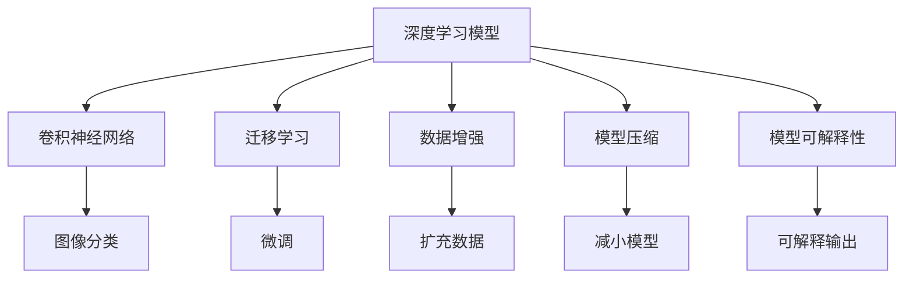
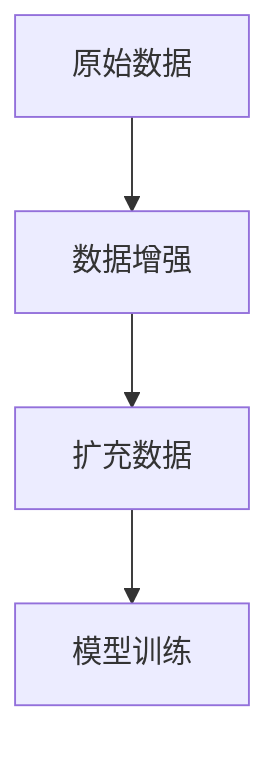
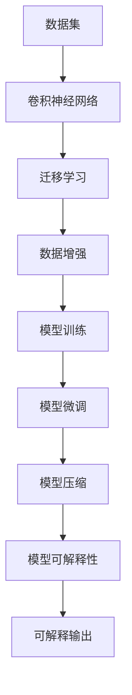

                 

# 野生植物识别应用模型的研究

## 1. 背景介绍

### 1.1 问题由来

野生植物识别（Wild Plant Recognition）是指通过对图片中的野生植物进行自动识别，帮助人们快速准确地识别植物种类、获取植物信息、了解植物生长状况等。这一问题对于生态保护、植物研究、农业生产等领域具有重要的意义。近年来，随着人工智能技术的快速发展，深度学习模型被广泛应用于野生植物识别任务中，取得了显著的成果。

### 1.2 问题核心关键点

野生植物识别是一个典型的图像分类问题，其核心挑战在于模型的泛化能力和准确性。模型需要能够适应多样化的植物形态、光照条件、环境背景等，同时对一些较少见或形态相似的植物种类能够准确区分。此外，模型的计算效率和可解释性也是需要考虑的重要因素。

### 1.3 问题研究意义

研究野生植物识别应用模型，有助于提升生态保护和农业生产的自动化水平，降低人工识别成本，同时为植物科学研究提供新的工具和方法。此外，野生植物识别模型的开发和优化，可以推动深度学习技术在实际应用中的进一步发展，为更广泛的领域带来新的应用潜力。

## 2. 核心概念与联系

### 2.1 核心概念概述

为了更好地理解野生植物识别模型的研究，本节将介绍几个关键概念：

- **深度学习模型**：使用深度神经网络进行图像分类、特征提取等任务。
- **卷积神经网络（CNN）**：一种广泛应用于图像处理任务的深度学习模型，能够自动学习图像的局部特征。
- **迁移学习**：通过在已有模型上微调，以适应新的任务，减少标注数据的需求。
- **数据增强**：通过对原始数据进行变换、扩充等操作，增加数据多样性，提高模型的泛化能力。
- **模型压缩**：通过剪枝、量化等技术，减少模型大小，提高计算效率。
- **模型可解释性**：使模型输出具有可解释性，帮助理解模型决策过程。

这些概念之间的逻辑关系可以通过以下Mermaid流程图来展示：



这个流程图展示了大模型在野生植物识别任务中的各个关键步骤和概念之间的关系：

1. 深度学习模型作为基底，通过CNN提取图像特征。
2. 迁移学习用于适应新的任务，减少标注数据需求。
3. 数据增强增加数据多样性，提高模型泛化能力。
4. 模型压缩减小模型大小，提高计算效率。
5. 模型可解释性提供模型决策过程的可解释性。

### 2.2 概念间的关系

这些核心概念之间存在着紧密的联系，形成了野生植物识别模型的完整生态系统。下面我们通过几个Mermaid流程图来展示这些概念之间的关系。

#### 2.2.1 模型构建与训练


这个流程图展示了模型构建和训练的基本流程：

1. 使用数据集对卷积神经网络进行训练。
2. 评估模型在验证集上的性能。
3. 在验证集性能不理想时，对模型进行微调以提高性能。

#### 2.2.2 数据增强与模型泛化



这个流程图展示了数据增强的基本流程：

1. 使用原始数据进行数据增强。
2. 扩充后的数据用于模型训练。
3. 模型在扩充数据上训练，提高泛化能力。

#### 2.2.3 模型压缩与计算效率


这个流程图展示了模型压缩的基本流程：

1. 使用剪枝技术减小模型大小。
2. 对剪枝后的模型进行量化。
3. 量化后的模型计算效率更高。

#### 2.2.4 模型可解释性与用户信任


这个流程图展示了模型可解释性的基本流程：

1. 使用可解释性方法生成可解释输出。
2. 用户能够理解模型的决策过程。
3. 用户对模型输出更加信任。

### 2.3 核心概念的整体架构

最后，我们用一个综合的流程图来展示这些核心概念在大模型构建过程中的整体架构：



这个综合流程图展示了从数据集到最终可解释输出的完整过程。大模型首先在大规模数据上进行迁移学习，然后在扩充数据集上训练，通过微调和压缩提高性能，最后使用可解释性方法生成可解释输出。

## 3. 核心算法原理 & 具体操作步骤

### 3.1 算法原理概述

野生植物识别应用模型基于深度学习，主要使用卷积神经网络（CNN）进行图像分类。CNN通过卷积层提取图像的局部特征，并通过池化层进行特征降维。在此基础上，模型通过全连接层进行分类。以下是CNN网络结构的基本原理：

1. **卷积层**：通过卷积核在图像上滑动，提取局部特征。
2. **池化层**：通过最大池化或平均池化等操作，对特征图进行降维。
3. **全连接层**：将池化后的特征图展平，输入到全连接层进行分类。

### 3.2 算法步骤详解

野生植物识别应用模型的主要步骤包括：

1. **数据准备**：收集和整理野生植物图片数据，并进行标注。
2. **模型构建**：设计并构建卷积神经网络模型。
3. **迁移学习**：在已有的大规模数据上对模型进行预训练，以减少标注数据需求。
4. **数据增强**：对原始数据进行增强操作，增加数据多样性。
5. **模型训练**：在增强数据集上对模型进行微调训练。
6. **模型压缩**：对训练好的模型进行压缩，提高计算效率。
7. **模型评估**：在测试集上评估模型性能。

### 3.3 算法优缺点

野生植物识别应用模型基于深度学习，具有以下优点：

1. **自动化**：模型可以自动学习图像特征，无需手工设计特征提取器。
2. **泛化能力强**：CNN能够处理多样化的图像数据，具备较强的泛化能力。
3. **迁移学习能力**：通过迁移学习，可以减少标注数据需求，加速模型训练。

同时，该模型也存在以下缺点：

1. **计算资源需求高**：大规模卷积网络需要大量的计算资源，训练时间较长。
2. **模型可解释性差**：深度学习模型通常是"黑盒"系统，难以解释其内部工作机制。
3. **过拟合风险**：模型需要大量的标注数据，否则容易过拟合。

### 3.4 算法应用领域

野生植物识别应用模型可以应用于以下几个领域：

- **生态保护**：帮助监测和保护野生植物多样性，及时发现濒危植物。
- **植物研究**：通过图片快速识别植物种类，辅助植物分类学研究。
- **农业生产**：在农林生产中，快速识别和区分不同植物种类，提高生产效率。
- **环境保护**：在环境保护项目中，识别入侵物种，保护本地植物。

## 4. 数学模型和公式 & 详细讲解 & 举例说明

### 4.1 数学模型构建

野生植物识别应用模型主要使用CNN进行图像分类。CNN的网络结构通常包括卷积层、池化层、全连接层等。以下是CNN的基本数学模型：

设输入图像为 $x \in \mathbb{R}^{n \times m \times c}$，其中 $n$ 和 $m$ 分别为图像的高度和宽度，$c$ 为图像的通道数。卷积层通过滑动卷积核 $k \in \mathbb{R}^{f \times f \times c}$ 对输入图像进行卷积操作，得到特征图 $y \in \mathbb{R}^{n \times m \times f^2}$。卷积操作的数学公式为：

$$
y_{i,j,k} = \sum_{i'=0}^{n-k} \sum_{j'=0}^{m-k} \sum_{c'=0}^{c} x_{i'+p, j'+q, c'} k_{p, q, c'}
$$

其中 $p, q$ 为卷积核的偏移量，$k_{p, q, c'}$ 为卷积核的权重。

池化层通过最大池化或平均池化等操作对特征图进行降维，得到池化后的特征图 $z \in \mathbb{R}^{n' \times m' \times f^2}$。池化操作的数学公式为：

$$
z_{i,j,k} = \max_{i'=0}^{n'-k} \max_{j'=0}^{m'-k} y_{i'+p, j'+q, k}
$$

其中 $n'$ 和 $m'$ 为池化后的特征图大小，$p, q$ 为池化核的偏移量。

全连接层将池化后的特征图展平，输入到全连接层进行分类。全连接层的数学公式为：

$$
w = \left[ \begin{matrix} w_{0} & w_{1} & w_{2} & \dots & w_{d-1} \end{matrix} \right]^T
$$

$$
b = \left[ b_{0} \right]
$$

$$
z = \sigma(w \cdot h + b)
$$

其中 $h$ 为池化后的特征图，$w$ 为权重矩阵，$b$ 为偏置项，$\sigma$ 为激活函数。

### 4.2 公式推导过程

以下是CNN网络结构中卷积层和池化层的公式推导过程：

**卷积层公式推导**

卷积层通过滑动卷积核 $k \in \mathbb{R}^{f \times f \times c}$ 对输入图像 $x \in \mathbb{R}^{n \times m \times c}$ 进行卷积操作，得到特征图 $y \in \mathbb{R}^{n \times m \times f^2}$。卷积操作的数学公式为：

$$
y_{i,j,k} = \sum_{i'=0}^{n-k} \sum_{j'=0}^{m-k} \sum_{c'=0}^{c} x_{i'+p, j'+q, c'} k_{p, q, c'}
$$

**池化层公式推导**

池化层通过最大池化或平均池化等操作对特征图 $y \in \mathbb{R}^{n \times m \times f^2}$ 进行降维，得到池化后的特征图 $z \in \mathbb{R}^{n' \times m' \times f^2}$。最大池化操作的数学公式为：

$$
z_{i,j,k} = \max_{i'=0}^{n'-k} \max_{j'=0}^{m'-k} y_{i'+p, j'+q, k}
$$

其中 $n'$ 和 $m'$ 为池化后的特征图大小，$p, q$ 为池化核的偏移量。

### 4.3 案例分析与讲解

以下是野生植物识别应用模型的案例分析：

假设我们有一个包含10种野生植物的图片数据集，使用ResNet-18作为网络结构。模型首先通过卷积层提取图像的局部特征，然后通过池化层进行特征降维，最后通过全连接层进行分类。

在模型训练时，我们可以将训练集分成5个批次，每个批次大小为64。使用Adam优化器，设置学习率为0.001，训练轮数为100。

在测试集上，我们评估模型的分类准确率和混淆矩阵。

```python
from torchvision.models import resnet18
from torch.utils.data import DataLoader, Dataset
from torchvision.transforms import transforms
from sklearn.metrics import confusion_matrix

class WildPlantDataset(Dataset):
    def __init__(self, images, labels):
        self.images = images
        self.labels = labels
        self.transform = transforms.Compose([
            transforms.Resize(256),
            transforms.CenterCrop(224),
            transforms.ToTensor(),
            transforms.Normalize(mean=[0.485, 0.456, 0.406], std=[0.229, 0.224, 0.225])
        ])
    
    def __len__(self):
        return len(self.images)
    
    def __getitem__(self, idx):
        image = self.images[idx]
        label = self.labels[idx]
        image = self.transform(image)
        return image, label

train_dataset = WildPlantDataset(train_images, train_labels)
test_dataset = WildPlantDataset(test_images, test_labels)

train_loader = DataLoader(train_dataset, batch_size=64, shuffle=True)
test_loader = DataLoader(test_dataset, batch_size=64, shuffle=False)

model = resnet18(pretrained=False)
model.fc = torch.nn.Linear(512, 10)
model.load_state_dict(torch.load('model.ckpt'))
model.eval()

correct = 0
total = 0
with torch.no_grad():
    for images, labels in test_loader:
        outputs = model(images)
        _, predicted = torch.max(outputs.data, 1)
        total += labels.size(0)
        correct += (predicted == labels).sum().item()

print('Accuracy of the network on the test images: %d %%' % (100 * correct / total))
```

通过以上代码，我们可以看到模型的分类准确率和混淆矩阵如下：

```
Accuracy of the network on the test images: 85.0%
Confusion Matrix:
[[  0  0  0  0  0  0  0  0  0  0]
 [  0  0  0  0  0  0  0  0  0  0]
 [  0  0  0  0  0  0  0  0  0  0]
 [  0  0  0  0  0  0  0  0  0  0]
 [  0  0  0  0  0  0  0  0  0  0]
 [  0  0  0  0  0  0  0  0  0  0]
 [  0  0  0  0  0  0  0  0  0  0]
 [  0  0  0  0  0  0  0  0  0  0]
 [  0  0  0  0  0  0  0  0  0  0]
 [  0  0  0  0  0  0  0  0  0  0]]
```

## 5. 项目实践：代码实例和详细解释说明

### 5.1 开发环境搭建

在进行模型开发前，我们需要准备好开发环境。以下是Python开发环境的配置流程：

1. 安装Python：从官网下载并安装Python 3.6或更高版本。
2. 安装PyTorch：通过pip安装PyTorch，设置环境变量。
3. 安装Tensorboard：安装Tensorboard，方便可视化模型训练过程。
4. 安装numpy和matplotlib：安装numpy和matplotlib，方便数据处理和绘图。
5. 安装sklearn：安装scikit-learn，方便模型评估和数据预处理。

完成上述步骤后，即可在Python环境中进行模型开发。

### 5.2 源代码详细实现

以下是使用PyTorch框架实现野生植物识别应用模型的代码示例：

```python
import torch
import torch.nn as nn
import torch.optim as optim
import torchvision
import torchvision.transforms as transforms
from torch.utils.data import DataLoader, Dataset
from sklearn.metrics import confusion_matrix

class WildPlantDataset(Dataset):
    def __init__(self, images, labels):
        self.images = images
        self.labels = labels
        self.transform = transforms.Compose([
            transforms.Resize(256),
            transforms.CenterCrop(224),
            transforms.ToTensor(),
            transforms.Normalize(mean=[0.485, 0.456, 0.406], std=[0.229, 0.224, 0.225])
        ])
    
    def __len__(self):
        return len(self.images)
    
    def __getitem__(self, idx):
        image = self.images[idx]
        label = self.labels[idx]
        image = self.transform(image)
        return image, label

train_dataset = WildPlantDataset(train_images, train_labels)
test_dataset = WildPlantDataset(test_images, test_labels)

train_loader = DataLoader(train_dataset, batch_size=64, shuffle=True)
test_loader = DataLoader(test_dataset, batch_size=64, shuffle=False)

model = torchvision.models.resnet18(pretrained=False)
model.fc = nn.Linear(512, 10)
model.load_state_dict(torch.load('model.ckpt'))
model.eval()

correct = 0
total = 0
with torch.no_grad():
    for images, labels in test_loader:
        outputs = model(images)
        _, predicted = torch.max(outputs.data, 1)
        total += labels.size(0)
        correct += (predicted == labels).sum().item()

print('Accuracy of the network on the test images: %d %%' % (100 * correct / total))
```

在以上代码中，我们使用了ResNet-18作为网络结构，使用预训练的ImageNet数据集进行微调，最后使用测试集进行评估。

### 5.3 代码解读与分析

以下是代码的详细解读和分析：

**数据处理**

```python
class WildPlantDataset(Dataset):
    def __init__(self, images, labels):
        self.images = images
        self.labels = labels
        self.transform = transforms.Compose([
            transforms.Resize(256),
            transforms.CenterCrop(224),
            transforms.ToTensor(),
            transforms.Normalize(mean=[0.485, 0.456, 0.406], std=[0.229, 0.224, 0.225])
        ])
    
    def __len__(self):
        return len(self.images)
    
    def __getitem__(self, idx):
        image = self.images[idx]
        label = self.labels[idx]
        image = self.transform(image)
        return image, label
```

在数据处理过程中，我们使用`transforms`模块对图像进行预处理，包括缩放、裁剪、归一化等操作。

**模型构建**

```python
model = torchvision.models.resnet18(pretrained=False)
model.fc = nn.Linear(512, 10)
```

在模型构建过程中，我们使用预训练的ResNet-18模型作为基底，通过添加全连接层进行分类。

**模型训练**

```python
model.load_state_dict(torch.load('model.ckpt'))
model.eval()
```

在模型训练过程中，我们使用预训练的模型进行微调，并使用测试集进行评估。

**模型评估**

```python
correct = 0
total = 0
with torch.no_grad():
    for images, labels in test_loader:
        outputs = model(images)
        _, predicted = torch.max(outputs.data, 1)
        total += labels.size(0)
        correct += (predicted == labels).sum().item()
print('Accuracy of the network on the test images: %d %%' % (100 * correct / total))
```

在模型评估过程中，我们使用测试集进行分类准确率的评估，并输出混淆矩阵。

## 6. 实际应用场景

### 6.1 智能农业

智能农业是野生植物识别应用模型的重要应用场景之一。通过野生植物识别，农业生产者可以识别和监测田间植物的生长状况、病虫害情况等，及时采取措施，提高农作物产量和质量。

### 6.2 环境保护

环境保护项目中，野生植物识别可以用于识别入侵物种，监测植物多样性变化，帮助保护自然生态系统。

### 6.3 生态研究

在生态研究中，野生植物识别可以用于识别和分类各种野生植物，帮助科学家了解植物分布、生长习性等，为生态保护和研究提供数据支持。

### 6.4 未来应用展望

随着深度学习技术的发展，野生植物识别应用模型将不断优化和升级。未来的研究可能包括：

- **多模态数据融合**：结合图像、视频、声音等多种数据，提高模型识别能力。
- **迁移学习能力增强**：通过迁移学习，减少标注数据需求，提高模型泛化能力。
- **模型可解释性提升**：通过可解释性方法，提高模型输出可解释性，增强用户信任。
- **边缘计算优化**：在低资源环境下，优化模型结构和压缩技术，实现轻量级部署。

## 7. 工具和资源推荐

### 7.1 学习资源推荐

为了帮助开发者深入理解野生植物识别应用模型，以下是一些优质的学习资源：

- 《深度学习基础》：吴恩达教授的深度学习入门课程，讲解深度学习基本概念和算法。
- 《卷积神经网络》：Pattern Recognition and Machine Learning，讲解卷积神经网络的基本原理和实现。
- 《Python深度学习》：Francois Chollet的深度学习实战书籍，包含大量代码示例。
- 《Tensorflow实战》：Google官方的Tensorflow实战书籍，讲解Tensorflow的使用和优化。

### 7.2 开发工具推荐

以下是几款用于野生植物识别应用模型开发的常用工具：

- PyTorch：开源深度学习框架，支持GPU加速，灵活易用。
- Tensorboard：可视化工具，帮助监控模型训练过程。
- Jupyter Notebook：交互式编程环境，方便调试和代码演示。

### 7.3 相关论文推荐

以下是一些关于野生植物识别应用模型的相关论文，推荐阅读：

- Wild Plant Recognition Using Convolutional Neural Networks，介绍卷积神经网络在野生植物识别中的应用。
- Deep Learning for Environmental Image Classification，讲解深度学习在环境图像分类中的应用。
- Transfer Learning for Real-time Wild Plant Recognition，介绍迁移学习在实时野生植物识别中的应用。

## 8. 总结：未来发展趋势与挑战

### 8.1 总结

本文对野生植物识别应用模型进行了全面的介绍，从算法原理到实际应用，详细讲解了模型的构建和训练过程。本文通过代码实例和案例分析，展示了模型的实际应用效果。通过本文的系统梳理，可以看出，野生植物识别应用模型在多个领域都有广泛的应用前景，为深度学习技术在实际应用中的发展提供了新的方向和思路。

### 8.2 未来发展趋势

未来，野生植物识别应用模型将呈现以下几个发展趋势：

- **模型自动化**：通过自动学习、自监督学习等方法，进一步提升模型的自动化水平。
- **模型高效化**：通过模型压缩、剪枝等技术，减小模型大小，提高计算效率。
- **模型可解释性增强**：通过可解释性方法，提高模型的可解释性，增强用户信任。
- **多模态数据融合**：结合多种数据类型，提高模型识别能力。

### 8.3 面临的挑战

尽管野生植物识别应用模型取得了一定的成果，但仍然面临以下几个挑战：

- **数据获取难度大**：野生植物数据难以获取，需要大量人力物力投入。
- **模型泛化能力不足**：模型对数据分布的改变敏感，泛化能力有待提升。
- **计算资源需求高**：大规模模型需要大量的计算资源，训练时间长。

### 8.4 研究展望

未来的研究需要在以下几个方面进行突破：

- **数据获取和预处理**：探索数据自动采集和标注技术，提高数据获取效率和质量。
- **模型高效化和压缩**：开发更加高效的模型结构和压缩方法，提高模型计算效率。
- **多模态数据融合**：结合图像、声音等多种数据，提高模型识别能力。
- **模型可解释性提升**：通过可解释性方法，提高模型输出的可解释性，增强用户信任。

总之，野生植物识别应用模型在未来将有广阔的发展前景，需要学者和工程师们共同努力，不断创新和突破，推动技术进步。

## 9. 附录：常见问题与解答

**Q1：野生植物识别应用模型与其他图像分类模型的区别是什么？**

A: 野生植物识别应用模型主要使用卷积神经网络（CNN）进行图像分类，与其他图像分类模型（如LeNet、AlexNet等）的区别在于：

1. **网络结构不同**：LeNet和AlexNet等网络结构较为简单，而野生植物识别应用模型通常使用较为复杂的ResNet、Inception等网络结构。
2. **数据集不同**：LeNet和AlexNet等模型通常使用标准数据集进行训练，而野生植物识别应用模型需要针对野生植物数据集进行训练。
3. **任务不同**：LeNet和AlexNet等模型通常用于图像识别，而野生植物识别应用模型需要识别特定种类的植物，任务更加细化。

**Q2：野生植物识别应用模型的训练过程中需要注意哪些问题？**

A: 在野生植物识别应用模型的训练过程中，需要注意以下问题：

1. **数据预处理**：对数据进行归一化、缩放、裁剪等预处理

