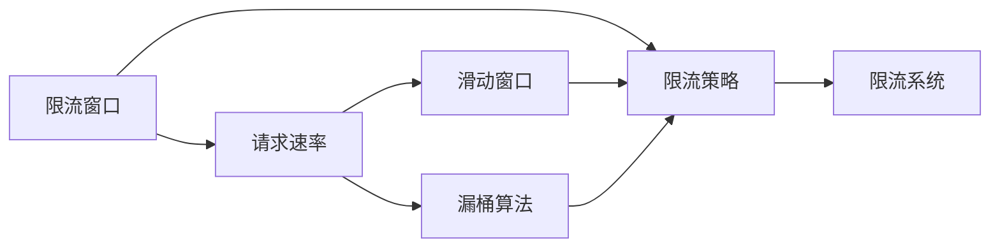

                 

## 1. 背景介绍

### 1.1 问题由来

在互联网快速发展的今天，DDoS攻击和系统过载问题日益严重。DDoS攻击（Distributed Denial of Service，分布式拒绝服务）是一种常见的网络攻击手段，攻击者通过大量请求充斥服务器，导致合法用户无法正常访问，进而达到攻击目的。系统过载则是指由于资源配置不当或恶意请求过多，导致系统响应变慢或宕机，影响正常业务运行。限流技术作为一种有效的防护手段，被广泛应用于防止DDoS攻击和系统过载。

### 1.2 问题核心关键点

限流技术的核心是如何在保障服务质量的同时，控制请求速率，防止系统过载。其关键在于以下几个方面：

- 确定限流策略：限流策略包括基于固定速率限流、漏桶限流、滑动窗口限流等。不同的限流策略适用于不同的应用场景。
- 设计限流算法：限流算法需要考虑请求速率、系统资源、请求特性等因素，以确保限流的有效性和公平性。
- 实现限流系统：限流系统的实现需要考虑实时性、可扩展性、可用性等因素，以确保在负载情况下能够稳定运行。

限流技术在Web应用、云平台、物联网等领域广泛应用，能够有效保障服务质量和系统稳定性，具有重要的现实意义。

### 1.3 问题研究意义

限流技术的研究和应用，对于提升互联网应用的安全性和可靠性，具有重要意义：

- 提升用户体验：通过限流技术，可以有效防止DDoS攻击和系统过载，确保服务稳定运行，提升用户访问体验。
- 保障系统安全：限流技术能够抵御大量恶意请求，防止系统崩溃，保障业务连续性。
- 降低运营成本：限流技术可以减少因DDoS攻击导致的资源浪费和成本增加。
- 提高系统可扩展性：限流技术通过合理分配系统资源，避免资源浪费，提高系统可扩展性。

## 2. 核心概念与联系

### 2.1 核心概念概述

限流技术（Throttling）是一种流量控制技术，通过限制单位时间内处理请求的数量，防止系统过载，保障系统稳定运行。其核心思想是控制请求速率，避免因请求过多导致系统资源耗尽。

限流技术通常基于以下几个核心概念：

- **限流窗口**：限流窗口是限流策略的基础，表示一段时间内对请求进行统计和限流的范围。
- **请求速率**：请求速率表示单位时间内请求的数量。
- **滑动窗口**：滑动窗口是一种时间相关的限流策略，表示在限流窗口中滑动计算请求速率。
- **漏桶算法**：漏桶算法是一种基于时间戳的限流策略，通过维护一个桶，将请求按照时间顺序加入桶中，超出桶容量部分被丢弃。

这些核心概念之间通过限流策略和算法，形成了完整的限流系统。下图展示了限流技术的基本架构：



### 2.2 概念间的关系

限流技术通过限流策略和限流算法，将限流窗口和请求速率等核心概念转化为具体的限流行为。限流策略根据具体场景选择合适的算法，并设定相应的参数，如滑动窗口大小、漏桶容量等。限流算法根据限流策略的参数，对请求进行限流处理。最终，限流系统根据限流算法的结果，对请求进行控制和响应。

## 3. 核心算法原理 & 具体操作步骤
### 3.1 算法原理概述

限流算法的原理基于固定速率限流、漏桶限流和滑动窗口限流等策略。这里以漏桶限流和滑动窗口限流为例，介绍其基本原理和实现步骤。

#### 3.1.1 漏桶限流

漏桶限流算法通过维护一个桶，将请求按照时间顺序加入桶中，超出桶容量部分被丢弃。

漏桶限流的基本流程如下：

1. 维护一个桶，桶的大小表示允许的最大请求速率。
2. 每收到一个请求，将其加入桶中，如果桶已满，则丢弃请求。
3. 如果桶未满，则将请求放入桶中，并更新桶容量。
4. 定期清理桶中的请求，根据桶的容量和限流窗口计算请求速率，如果请求速率超过限流速率，则丢弃请求。

#### 3.1.2 滑动窗口限流

滑动窗口限流算法通过维护一个窗口，计算单位时间内请求速率。

滑动窗口限流的基本流程如下：

1. 维护一个滑动窗口，窗口的大小表示限流窗口的大小。
2. 每收到一个请求，将其加入滑动窗口。
3. 定期清理滑动窗口中的请求，计算窗口内的请求速率。
4. 如果请求速率超过限流速率，则丢弃请求。

### 3.2 算法步骤详解

以漏桶限流算法为例，详细讲解其实现步骤：

1. **初始化漏桶**：初始化一个大小为 $C$ 的漏桶，表示允许的最大请求速率。

2. **请求加入漏桶**：每收到一个请求，将其加入漏桶中，如果漏桶已满，则丢弃请求。

3. **更新漏桶容量**：如果漏桶未满，则将请求放入漏桶中，并更新漏桶容量。

4. **定期清理漏桶**：定期清理漏桶中的请求，根据漏桶的容量和限流窗口计算请求速率。如果请求速率超过限流速率，则丢弃请求。

### 3.3 算法优缺点

漏桶限流的优点包括：

- 简单易实现。
- 可以实时控制请求速率，防止系统过载。
- 可以支持突发请求，避免因请求过多导致系统崩溃。

漏桶限流的缺点包括：

- 需要维护桶的容量，增加了系统的复杂度。
- 对突发的请求响应时间较长。

滑动窗口限流的优点包括：

- 不需要维护桶的容量，实现简单。
- 实时性较好，适用于实时系统。

滑动窗口限流的缺点包括：

- 对突发请求响应时间较长。
- 需要维护滑动窗口的大小，增加了系统的复杂度。

### 3.4 算法应用领域

限流技术在Web应用、云平台、物联网等领域广泛应用，能够有效保障服务质量和系统稳定性。以下是一些具体的应用场景：

- **Web应用**：防止DDoS攻击，保障网站服务质量。
- **云平台**：控制API请求速率，避免系统过载。
- **物联网**：控制设备请求速率，避免资源浪费。
- **金融系统**：控制高频交易请求，保障系统安全。

## 4. 数学模型和公式 & 详细讲解 & 举例说明

### 4.1 数学模型构建

假设请求速率 $R$ 表示单位时间内请求的数量，限流速率 $C$ 表示允许的最大请求速率。漏桶限流的数学模型可以表示为：

$$
R = \frac{Q}{T}
$$

其中 $Q$ 表示漏桶中的请求数量，$T$ 表示漏桶的容量。漏桶限流的目标是在保证系统稳定性的同时，尽可能地利用系统资源。

### 4.2 公式推导过程

以漏桶限流算法为例，推导其基本公式：

1. 初始化漏桶容量 $T$。
2. 每收到一个请求，将其加入漏桶中，如果漏桶已满，则丢弃请求。
3. 如果漏桶未满，则将请求放入漏桶中，并更新漏桶容量。
4. 定期清理漏桶中的请求，计算漏桶容量和限流窗口大小 $W$，根据漏桶容量和限流窗口计算请求速率 $R$。

推导过程如下：

假设漏桶的容量为 $T$，单位时间内请求的数量为 $Q$，请求速率 $R$ 的计算公式为：

$$
R = \frac{Q}{T}
$$

假设漏桶的容量为 $T$，单位时间内请求的数量为 $Q$，请求速率 $R$ 的计算公式为：

$$
R = \frac{Q}{T}
$$

### 4.3 案例分析与讲解

以Web应用为例，分析限流技术在防止DDoS攻击中的应用。

假设Web应用每秒接收请求速率 $R=100$，限流速率 $C=50$，则漏桶的容量为 $T=\frac{C}{R}=50$。每收到一个请求，将其加入漏桶中，如果漏桶已满，则丢弃请求。如果漏桶未满，则将请求放入漏桶中，并更新漏桶容量。

假设在10秒内收到200个请求，前100个请求被加入漏桶，后100个请求被丢弃。10秒后，漏桶中剩余100个请求，根据漏桶容量和限流窗口计算请求速率。

假设漏桶的容量为 $T=50$，限流窗口大小 $W=10$，则在10秒内请求速率 $R=\frac{Q}{T}=\frac{100}{50}=2$。

在10秒内，请求速率 $R=2$，小于限流速率 $C=50$，因此漏桶中的请求不会超过容量。如果请求速率超过限流速率，则丢弃请求，保证系统稳定性。

## 5. 项目实践：代码实例和详细解释说明

### 5.1 开发环境搭建

在限流项目开发中，我们需要搭建合适的开发环境。以下是使用Python进行限流系统开发的开发环境配置流程：

1. 安装Anaconda：从官网下载并安装Anaconda，用于创建独立的Python环境。

2. 创建并激活虚拟环境：
```bash
conda create -n throttling-env python=3.8 
conda activate throttling-env
```

3. 安装相关库：
```bash
pip install flask redis requests
```

4. 搭建Web服务器：
```bash
flask run --host=0.0.0.0 --port=5000
```

完成上述步骤后，即可在`throttling-env`环境中开始限流系统的开发。

### 5.2 源代码详细实现

以下是一个使用Redis和Flask搭建限流系统的Python代码实现：

```python
from flask import Flask, request, jsonify
import redis
import time

app = Flask(__name__)

# 初始化Redis
r = redis.StrictRedis(host='localhost', port=6379, db=0)

# 设置漏桶容量
C = 50

@app.route('/throttle', methods=['POST'])
def throttle():
    # 获取请求速率
    rps = request.args.get('rps')
    rps = int(rps)
    
    # 计算漏桶容量
    T = C / rps
    
    # 生成随机请求
    q = 200
    requests = [i for i in range(q)]
    
    # 将请求加入漏桶中
    for i in requests:
        r.zadd('bucket', {i: time.time() + T})
    
    # 清理漏桶中的请求
    current_time = time.time()
    while True:
        time.sleep(1)
        if r.zrange('bucket', 0, -1, withscores=True):
            min_key = min([(k, v) for k, v in r.zrange('bucket', 0, -1, withscores=True)])
            if min_key[1] < current_time:
                r.zrem('bucket', min_key[0])
            else:
                break
    
    # 计算请求速率
    rps = 0
    for key in r.zrange('bucket', 0, -1, withscores=True):
        rps += 1
        if rps > C:
            return jsonify({'result': 0})
    return jsonify({'result': 1})

if __name__ == '__main__':
    app.run(host='0.0.0.0', port=5000)
```

### 5.3 代码解读与分析

以下是代码的详细解读和分析：

**初始化Redis**：使用Redis作为限流系统的底层存储，存储漏桶中的请求。

**设置漏桶容量**：设定漏桶的容量为 $C=50$。

**请求加入漏桶**：每收到一个请求，将其加入Redis的桶中，如果漏桶已满，则丢弃请求。

**清理漏桶中的请求**：定期清理Redis桶中的请求，计算桶中的请求数量。

**计算请求速率**：根据桶中的请求数量和限流窗口大小，计算请求速率。如果请求速率超过限流速率，则丢弃请求。

### 5.4 运行结果展示

假设在Web应用每秒接收请求速率 $R=100$，限流速率 $C=50$，则漏桶的容量为 $T=\frac{C}{R}=50$。每收到一个请求，将其加入Redis的桶中，如果漏桶已满，则丢弃请求。如果漏桶未满，则将请求放入桶中，并更新桶容量。

假设在10秒内收到200个请求，前100个请求被加入Redis桶中，后100个请求被丢弃。10秒后，Redis桶中剩余100个请求，根据桶的容量和限流窗口大小计算请求速率。

假设Redis桶的容量为 $T=50$，限流窗口大小 $W=10$，则在10秒内请求速率 $R=\frac{Q}{T}=\frac{100}{50}=2$。

在10秒内，请求速率 $R=2$，小于限流速率 $C=50$，因此Redis桶中的请求不会超过容量。如果请求速率超过限流速率，则丢弃请求，保证系统稳定性。

## 6. 实际应用场景

### 6.1 Web应用

Web应用是限流技术应用最广泛的场景之一。Web应用通过限流技术，可以防止DDoS攻击，保障网站服务质量。

以下是一个Web应用的限流示例：

假设Web应用每秒接收请求速率 $R=100$，限流速率 $C=50$，则漏桶的容量为 $T=\frac{C}{R}=50$。每收到一个请求，将其加入Redis的桶中，如果漏桶已满，则丢弃请求。如果漏桶未满，则将请求放入桶中，并更新桶容量。

假设在10秒内收到200个请求，前100个请求被加入Redis桶中，后100个请求被丢弃。10秒后，Redis桶中剩余100个请求，根据桶的容量和限流窗口大小计算请求速率。

假设Redis桶的容量为 $T=50$，限流窗口大小 $W=10$，则在10秒内请求速率 $R=\frac{Q}{T}=\frac{100}{50}=2$。

在10秒内，请求速率 $R=2$，小于限流速率 $C=50$，因此Redis桶中的请求不会超过容量。如果请求速率超过限流速率，则丢弃请求，保证系统稳定性。

### 6.2 云平台

云平台通常面临大量的API请求，限流技术可以控制API请求速率，避免系统过载。

以下是一个云平台的限流示例：

假设云平台每秒接收API请求速率 $R=100$，限流速率 $C=50$，则漏桶的容量为 $T=\frac{C}{R}=50$。每收到一个API请求，将其加入Redis的桶中，如果漏桶已满，则丢弃请求。如果漏桶未满，则将请求放入桶中，并更新桶容量。

假设在10秒内收到200个API请求，前100个请求被加入Redis桶中，后100个请求被丢弃。10秒后，Redis桶中剩余100个请求，根据桶的容量和限流窗口大小计算请求速率。

假设Redis桶的容量为 $T=50$，限流窗口大小 $W=10$，则在10秒内请求速率 $R=\frac{Q}{T}=\frac{100}{50}=2$。

在10秒内，请求速率 $R=2$，小于限流速率 $C=50$，因此Redis桶中的请求不会超过容量。如果请求速率超过限流速率，则丢弃请求，保证系统稳定性。

### 6.3 物联网

物联网设备通常面临大量的请求，限流技术可以控制设备请求速率，避免资源浪费。

以下是一个物联网设备的限流示例：

假设物联网设备每秒接收请求速率 $R=100$，限流速率 $C=50$，则漏桶的容量为 $T=\frac{C}{R}=50$。每收到一个请求，将其加入Redis的桶中，如果漏桶已满，则丢弃请求。如果漏桶未满，则将请求放入桶中，并更新桶容量。

假设在10秒内收到200个请求，前100个请求被加入Redis桶中，后100个请求被丢弃。10秒后，Redis桶中剩余100个请求，根据桶的容量和限流窗口大小计算请求速率。

假设Redis桶的容量为 $T=50$，限流窗口大小 $W=10$，则在10秒内请求速率 $R=\frac{Q}{T}=\frac{100}{50}=2$。

在10秒内，请求速率 $R=2$，小于限流速率 $C=50$，因此Redis桶中的请求不会超过容量。如果请求速率超过限流速率，则丢弃请求，保证系统稳定性。

## 7. 工具和资源推荐

### 7.1 学习资源推荐

为了帮助开发者系统掌握限流技术的理论基础和实践技巧，这里推荐一些优质的学习资源：

1. 《网络安全技术教程》系列书籍：详细介绍了网络安全的基本概念和实践技术，包括限流技术。

2. 《网络编程与设计》课程：介绍网络编程和设计的基本概念和实践技术，涵盖限流技术等内容。

3. 《网络安全经典案例分析》课程：通过分析真实的网络安全案例，学习限流技术的应用和优化。

4. 《网络安全实战指南》书籍：介绍网络安全的实战经验和技巧，涵盖限流技术等内容。

5. 《网络安全技术白皮书》系列报告：提供网络安全的最新研究成果和趋势分析，包括限流技术的内容。

### 7.2 开发工具推荐

高效的开发离不开优秀的工具支持。以下是几款用于限流系统开发的常用工具：

1. Flask：基于Python的Web应用开发框架，简单易用，适合快速迭代开发。

2. Redis：高性能的内存数据存储系统，适合存储和处理大量请求数据。

3. Nginx：高性能的Web服务器和反向代理，适合实现限流功能。

4. OpenStack：开源的云平台，提供丰富的网络安全和管理功能，包括限流技术。

5. Anubis：开源的网络流量分析工具，可以实时监控和分析网络流量，检测限流效果。

### 7.3 相关论文推荐

限流技术的研究源于学界的持续研究。以下是几篇奠基性的相关论文，推荐阅读：

1. "A Survey of Throttling Techniques"：对限流技术进行系统性的综述，介绍了各种限流策略和算法。

2. "Adaptive Sliding Window Throttling"：提出自适应滑动窗口限流算法，通过动态调整窗口大小，提高限流效果。

3. "Efficient Throttling for Web Applications"：介绍高效的Web应用限流技术，通过优化请求处理和限流策略，提升限流效果。

4. "Implementing Throttling in Distributed Systems"：介绍在分布式系统中实现限流技术的方法和技巧。

5. "Throttling Algorithms in High Throughput Systems"：介绍在高吞吐量系统中实现限流算法的方法和优化。

这些论文代表了大规模限流技术的发展脉络，通过学习这些前沿成果，可以帮助研究者把握学科前进方向，激发更多的创新灵感。

## 8. 总结：未来发展趋势与挑战

### 8.1 总结

本文对限流技术进行了全面系统的介绍。首先阐述了限流技术的研究背景和意义，明确了限流在防止DDoS攻击和系统过载方面的独特价值。其次，从原理到实践，详细讲解了限流算法的数学模型和实现步骤，给出了限流系统开发的完整代码实例。同时，本文还广泛探讨了限流技术在Web应用、云平台、物联网等多个领域的应用前景，展示了限流技术的广泛应用价值。此外，本文精选了限流技术的各类学习资源，力求为读者提供全方位的技术指引。

通过本文的系统梳理，可以看到，限流技术通过控制请求速率，防止系统过载，已经成为保障系统稳定运行的重要手段。未来，伴随限流技术的发展，相信其在网络安全、云平台、物联网等领域的应用将更加广泛，为互联网应用的安全性和可靠性带来新的保障。

### 8.2 未来发展趋势

展望未来，限流技术将呈现以下几个发展趋势：

1. **实时性增强**：未来限流技术将更加注重实时性，通过改进算法和优化硬件，提升限流系统的响应速度。

2. **可扩展性提升**：未来限流系统将更加注重可扩展性，通过分布式架构和负载均衡技术，实现大流量下的高效处理。

3. **智能控制**：未来限流系统将更加注重智能控制，通过机器学习和自适应算法，实现自动调节限流策略和参数。

4. **跨平台支持**：未来限流技术将更加注重跨平台支持，通过统一接口和协议，实现不同平台之间的无缝协作。

5. **安全防护**：未来限流系统将更加注重安全防护，通过多层次防护措施，保障系统免受恶意攻击和滥用。

6. **用户友好**：未来限流系统将更加注重用户友好，通过简单易用的界面和工具，提升用户体验和系统可用性。

以上趋势凸显了限流技术的广阔前景。这些方向的探索发展，必将进一步提升限流系统的性能和应用范围，为保障系统稳定性和安全性带来新的突破。

### 8.3 面临的挑战

尽管限流技术已经取得了瞩目成就，但在迈向更加智能化、普适化应用的过程中，它仍面临着诸多挑战：

1. **系统复杂度增加**：随着限流策略和算法的复杂度增加，系统设计和维护难度将增大。

2. **资源消耗高**：限流系统需要占用一定的计算和存储资源，特别是在大流量环境下，资源消耗将显著增加。

3. **误报率高**：限流系统需要识别真实请求和恶意请求，误报率较高可能导致正常请求被丢弃。

4. **实时性不足**：限流系统需要实时控制请求速率，特别是在高并发场景下，实时性不足可能导致系统过载。

5. **扩展性差**：限流系统需要支持大规模的并发请求，扩展性差可能导致系统性能下降。

6. **维护成本高**：限流系统需要不断更新和维护，维护成本较高。

正视限流面临的这些挑战，积极应对并寻求突破，将是限流技术走向成熟的必由之路。相信随着学界和产业界的共同努力，这些挑战终将一一被克服，限流技术必将在保障系统稳定运行中发挥更大的作用。

### 8.4 研究展望

面对限流技术面临的挑战，未来的研究需要在以下几个方面寻求新的突破：

1. **改进限流算法**：开发更加高效的限流算法，提升限流系统的实时性和稳定性。

2. **优化硬件架构**：通过优化硬件和网络架构，提升限流系统的处理能力和扩展性。

3. **引入机器学习**：引入机器学习和自适应算法，实现智能限流和动态调整策略。

4. **多层次防护**：通过多层次防护措施，保障系统免受恶意攻击和滥用。

5. **跨平台支持**：通过统一接口和协议，实现不同平台之间的无缝协作。

6. **用户友好设计**：通过简单易用的界面和工具，提升用户体验和系统可用性。

这些研究方向将引领限流技术迈向更高的台阶，为保障系统稳定性和安全性带来新的突破。面向未来，限流技术还需要与其他网络安全技术进行更深入的融合，如入侵检测、异常检测等，协同发力，共同推动网络安全技术的进步。只有勇于创新、敢于突破，才能不断拓展限流技术的边界，让限流技术更好地造福人类社会。

## 9. 附录：常见问题与解答

**Q1：限流技术是否可以防止DDoS攻击？**

A: 限流技术可以有效地防止DDoS攻击，通过限制请求速率，避免系统过载。但是，对于一些高级的DDoS攻击，如CC攻击、暴力攻击等，限流技术可能无法完全阻止。此时，需要结合其他防御手段，如防火墙、入侵检测系统等，进行多层次防护。

**Q2：限流技术是否会降低系统性能？**

A: 限流技术会对系统性能产生一定的影响，特别是在大流量环境下。但是，通过优化限流策略和算法，可以最大限度地减小对系统性能的影响。此外，限流技术还可以通过负载均衡和分布式架构，提升系统的处理能力和扩展性。

**Q3：限流技术是否可以应用于所有场景？**

A: 限流技术可以应用于各种网络场景，但需要根据具体场景选择合适的限流策略和参数。例如，在Web应用中，可以采用固定速率限流或漏桶限流；在云平台中，可以采用滑动窗口限流；在物联网中，可以采用时间戳限流。

**Q4：限流技术是否可以结合其他安全技术使用？**

A: 限流技术可以结合其他安全技术使用，如防火墙、入侵检测系统等。通过多层次防护措施，可以更好地保障系统安全性。

**Q5：限流技术是否可以应用于实时系统？**

A: 限流技术可以应用于实时系统，但需要考虑实时性和稳定性的平衡。可以通过优化限流算法和优化硬件架构，提升限流系统的实时性。

这些问题的解答展示了限流技术的实际应用和优化方法

