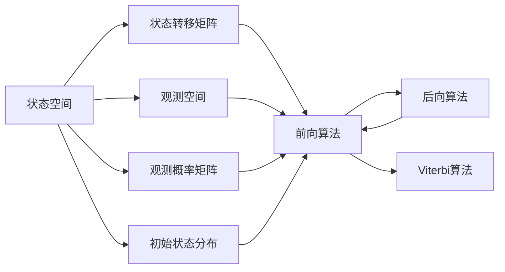
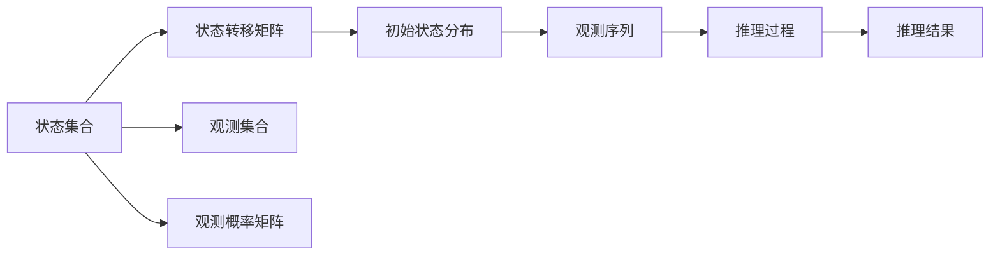
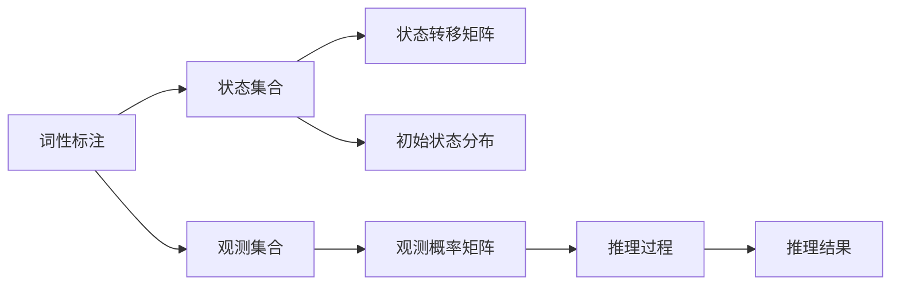

                 

# 隐马尔可夫模型 (Hidden Markov Models, HMM) 原理与代码实例讲解

> 关键词：隐马尔可夫模型, 概率模型, 时间序列分析, 数据挖掘, 自然语言处理, 机器学习, 代码实例, 数据分析, 预测

## 1. 背景介绍

### 1.1 问题由来
隐马尔可夫模型（Hidden Markov Models, HMMs）是一种经典的概率模型，广泛应用于时间序列分析、数据挖掘、自然语言处理等领域。HMMs的主要特点是其隐含的状态和观测序列，能够很好地描述许多实际问题中的动态过程。在NLP中，HMMs常用于词性标注、语音识别、情感分析等任务。近年来，HMMs还被应用于机器翻译、文本生成等任务中，展示了其强大的灵活性和适用性。

### 1.2 问题核心关键点
HMMs的核心思想是状态转移和观测概率，即系统从一种状态转移到另一种状态的过程及其观测结果。通过模型训练和推理，HMMs可以预测未来的状态和观测结果，从而实现各种时间序列分析和预测任务。

HMMs的主要组成部分包括：
- 状态集合：模型可能处于的状态集合，通常用集合$\{S_1, S_2, \ldots, S_n\}$表示。
- 状态转移概率：从一种状态转移到另一种状态的概率，用矩阵$A \in [0, 1]^{n \times n}$表示，其中$A_{ij} = P(S_{j|i})$表示从状态$i$转移到状态$j$的概率。
- 观测集合：模型在特定状态下可能观测到的观测值集合，通常用集合$\{O_1, O_2, \ldots, O_m\}$表示。
- 观测概率：在特定状态下观测到特定观测值的概率，用矩阵$B \in [0, 1]^{n \times m}$表示，其中$B_{ij} = P(O_j|S_i)$表示在状态$i$下观测到观测值$j$的概率。
- 初始状态概率：模型开始时处于每个状态的概率，用向量$\pi \in [0, 1]^n$表示，其中$\pi_i = P(S_i)$表示初始时处于状态$i$的概率。

### 1.3 问题研究意义
HMMs作为一种通用的概率模型，能够广泛应用于各种复杂系统的建模和分析。通过对其状态转移和观测概率的学习，HMMs可以揭示系统内部的动态过程，预测未来的状态和观测结果。HMMs的研究有助于深入理解各种实际问题中的隐含机制，促进数据驱动的决策和预测。

## 2. 核心概念与联系

### 2.1 核心概念概述

为更好地理解HMMs的工作原理和应用场景，本节将介绍几个密切相关的核心概念：

- 状态空间（State Space）：模型的所有可能状态构成的空间，用于描述系统在不同时间点的状态。
- 观测空间（Observation Space）：模型的所有可能观测值构成的空间，用于描述系统在不同状态下的观测结果。
- 状态转移矩阵（Transition Matrix）：描述模型从一种状态转移到另一种状态的概率分布，是HMMs的核心组件之一。
- 观测概率矩阵（Emission Matrix）：描述在特定状态下观测到特定观测值的概率分布，是HMMs的另一个核心组件。
- 初始状态分布（Initial State Distribution）：模型开始时各状态的初始概率分布。
- 前向算法（Forward Algorithm）：用于计算观测序列下所有可能的状态序列的联合概率，是HMMs推理的基础。
- 后向算法（Backward Algorithm）：用于计算观测序列下所有可能的状态序列的后验概率，是HMMs推理的补充。
- Viterbi算法：用于找出观测序列下最可能的状态序列，是HMMs推理的常用方法之一。

这些核心概念之间的逻辑关系可以通过以下Mermaid流程图来展示：



这个流程图展示了HMMs的核心概念及其之间的关系：

1. 状态空间和状态转移矩阵描述系统的状态转移机制。
2. 观测空间和观测概率矩阵描述系统的观测结果。
3. 初始状态分布描述系统的初始状态。
4. 前向算法和后向算法用于计算联合概率和后验概率。
5. Viterbi算法用于找到最可能的状态序列。

通过理解这些核心概念，我们可以更好地把握HMMs的工作原理和应用方向。

### 2.2 概念间的关系

这些核心概念之间存在着紧密的联系，形成了HMMs的完整推理和建模框架。下面我通过几个Mermaid流程图来展示这些概念之间的关系。

#### 2.2.1 HMMs的建模过程



这个流程图展示了HMMs的建模过程：

1. 确定状态集合和观测集合。
2. 设计状态转移矩阵和观测概率矩阵。
3. 确定初始状态分布。
4. 使用观测序列进行推理，得到推理结果。

#### 2.2.2 HMMs的推理过程


这个流程图展示了HMMs的推理过程：

1. 使用前向算法计算观测序列下所有可能的状态序列的联合概率。
2. 使用后向算法计算观测序列下所有可能的状态序列的后验概率。
3. 使用Viterbi算法找到最可能的状态序列。

#### 2.2.3 HMMs的应用场景



这个流程图展示了HMMs在词性标注中的应用场景：

1. 确定状态集合和观测集合。
2. 设计状态转移矩阵和观测概率矩阵。
3. 确定初始状态分布。
4. 使用观测序列进行推理，得到推理结果。

## 3. 核心算法原理 & 具体操作步骤

### 3.1 算法原理概述

HMMs的算法原理基于状态转移和观测概率的联合概率分布。假设给定观测序列$O_1, O_2, \ldots, O_T$，通过模型训练得到的概率分布$P(S_i, O_j)$，可以计算出在给定观测序列下，所有可能的状态序列$S_1, S_2, \ldots, S_T$的联合概率分布$P(S_1, S_2, \ldots, S_T | O_1, O_2, \ldots, O_T)$。

HMMs的算法包括以下几个关键步骤：

1. 模型训练：通过最大化观测序列的似然函数$P(O_1, O_2, \ldots, O_T)$，学习状态转移矩阵$A$、观测概率矩阵$B$和初始状态分布$\pi$。
2. 状态推理：使用前向算法和后向算法，计算观测序列下所有可能的状态序列的联合概率分布。
3. 状态预测：使用Viterbi算法，找到最可能的状态序列。

### 3.2 算法步骤详解

#### 3.2.1 模型训练

1. **EM算法**：HMMs的训练通常使用EM算法，即期望最大化算法。EM算法通过迭代优化观测序列的似然函数，更新模型参数。

2. **前向-后向算法**：在前向-后向算法中，前向算法计算观测序列下所有可能的状态序列的联合概率分布，后向算法计算观测序列下所有可能的状态序列的后验概率。

#### 3.2.2 状态推理

1. **前向算法**：前向算法用于计算观测序列下所有可能的状态序列的联合概率分布。具体步骤如下：

   - 初始化前向概率$F_1(i) = \pi_i$，表示在时间$t=1$时，处于状态$i$的概率。
   - 对于时间$t=2,3,\ldots,T$，使用递推公式$F_t(i) = \sum_{j=1}^n F_{t-1}(j) A_{ji} B_{ji}$计算当前时间点的前向概率$F_t(i)$。

2. **后向算法**：后向算法用于计算观测序列下所有可能的状态序列的后验概率。具体步骤如下：

   - 初始化后向概率$B_T(j) = 1$，表示在时间$t=T$时，处于状态$j$的概率。
   - 对于时间$t=T-1,T-2,\ldots,2$，使用递推公式$B_t(j) = \sum_{k=1}^n A_{kj} B_{kj} B_{t+1}(j)$计算当前时间点的后向概率$B_t(j)$。

#### 3.2.3 状态预测

Viterbi算法用于找到观测序列下最可能的状态序列。具体步骤如下：

- 初始化前向概率$F_1(i) = \pi_i$，表示在时间$t=1$时，处于状态$i$的概率。
- 对于时间$t=2,3,\ldots,T$，使用递推公式$F_t(i) = \max_{j=1}^n F_{t-1}(j) A_{ji} B_{ji}$计算当前时间点的前向概率$F_t(i)$。
- 对于时间$t=T$，找到最大值$F_T(i)$，表示最终状态$S_T$为$i$。
- 对于时间$t=T-1,T-2,\ldots,2$，使用递推公式$F_t(i) = \max_{j=1}^n F_{t+1}(j) A_{ji} B_{ji}$计算前向概率$F_t(i)$，并记录最可能的状态$S_t$。

### 3.3 算法优缺点

HMMs的算法具有以下优点：

1. 模型简单：HMMs的模型结构相对简单，易于理解和实现。
2. 鲁棒性强：HMMs对观测序列和状态转移概率的变化具有较强的鲁棒性。
3. 应用广泛：HMMs在许多实际问题中都有广泛的应用，如词性标注、语音识别、时间序列预测等。

同时，HMMs也存在一些缺点：

1. 假设有限：HMMs假设状态转移和观测概率是静态的，难以处理动态变化的过程。
2. 观测噪声：HMMs假设观测结果没有噪声，实际应用中观测噪声可能对模型效果产生影响。
3. 参数敏感：HMMs的模型效果高度依赖于模型参数，参数的初始化和优化需要大量的计算资源。

### 3.4 算法应用领域

HMMs在许多领域都有广泛的应用，以下是一些典型的应用场景：

- **词性标注**：将观测序列中的单词序列标注为词性序列，如名词、动词、形容词等。
- **语音识别**：将观测序列中的音频信号转化为文字序列，如将语音转换为文本。
- **机器翻译**：将观测序列中的源语言文本序列转化为目标语言文本序列。
- **情感分析**：将观测序列中的文本序列转化为情感分类结果，如正面、负面、中性。
- **金融时间序列预测**：将观测序列中的历史金融数据转化为未来价格预测结果。

## 4. 数学模型和公式 & 详细讲解 & 举例说明

### 4.1 数学模型构建

HMMs的数学模型基于时间序列的统计特性。假设给定观测序列$O_1, O_2, \ldots, O_T$，通过模型训练得到的概率分布$P(S_i, O_j)$，可以计算出在给定观测序列下，所有可能的状态序列$S_1, S_2, \ldots, S_T$的联合概率分布$P(S_1, S_2, \ldots, S_T | O_1, O_2, \ldots, O_T)$。

HMMs的数学模型包括：

- 状态转移概率矩阵$A$：表示从一种状态转移到另一种状态的概率分布，即$A_{ij} = P(S_{j|i})$。
- 观测概率矩阵$B$：表示在特定状态下观测到特定观测值的概率分布，即$B_{ij} = P(O_j|S_i)$。
- 初始状态分布$\pi$：表示模型开始时处于每个状态的概率分布，即$\pi_i = P(S_i)$。

HMMs的观测序列$O_1, O_2, \ldots, O_T$由观测值组成，观测值通常为离散值。

### 4.2 公式推导过程

假设观测序列为$O_1, O_2, \ldots, O_T$，状态序列为$S_1, S_2, \ldots, S_T$，初始状态为$S_1$，则观测序列下所有可能的状态序列的联合概率分布可以表示为：

$$
P(O_1, O_2, \ldots, O_T | S_1) = \prod_{t=1}^T P(O_t|S_t) \prod_{t=1}^{T-1} P(S_{t+1}|S_t) \pi_{S_1}
$$

其中，$P(O_t|S_t)$表示在状态$S_t$下观测到观测值$O_t$的概率，$P(S_{t+1}|S_t)$表示从状态$S_t$转移到状态$S_{t+1}$的概率，$\pi_{S_1}$表示初始状态$S_1$的概率。

### 4.3 案例分析与讲解

假设我们有一个长度为$T=5$的观测序列$O_1, O_2, O_3, O_4, O_5$，状态集合为$S_1, S_2, S_3$，观测集合为$O_1, O_2, O_3$，状态转移矩阵为$A$，观测概率矩阵为$B$，初始状态概率分布为$\pi$。则观测序列下所有可能的状态序列的联合概率分布可以表示为：

$$
P(O_1, O_2, O_3, O_4, O_5 | S_1) = P(O_1|S_1) P(O_2|S_2) P(O_3|S_3) P(O_4|S_3) P(O_5|S_2) \pi_{S_1} A_{S_1S_2} A_{S_2S_3} A_{S_3S_2} A_{S_2S_1} A_{S_1S_1}
$$

其中，$P(O_1|S_1)$表示在状态$S_1$下观测到观测值$O_1$的概率，$P(O_2|S_2)$表示在状态$S_2$下观测到观测值$O_2$的概率，以此类推。

## 5. 项目实践：代码实例和详细解释说明

### 5.1 开发环境搭建

要进行HMMs的实践，我们需要使用Python编程语言，以及一些常用的科学计算和数据处理库，如NumPy、SciPy、Pandas等。

1. 安装Python：从官网下载并安装Python，可以选择最新版本的Python。
2. 安装NumPy：通过pip命令安装NumPy库，用于高效计算矩阵和向量。
3. 安装SciPy：通过pip命令安装SciPy库，用于科学计算和数据处理。
4. 安装Pandas：通过pip命令安装Pandas库，用于数据处理和分析。

完成上述步骤后，即可在Python环境中进行HMMs的实践。

### 5.2 源代码详细实现

以下是使用Python实现HMMs的源代码，包括模型训练和推理：

```python
import numpy as np
from scipy import linalg

class HMM:
    def __init__(self, n_states, n_observations, pi, A, B):
        self.n_states = n_states
        self.n_observations = n_observations
        self.pi = pi
        self.A = A
        self.B = B
        self.T = len(pi)
        self observation_seq = np.zeros(self.T)
        self state_seq = np.zeros(self.T)
        self.forward_prob = np.zeros((self.T, self.n_states))
        self.backward_prob = np.zeros((self.T, self.n_states))

    def train(self, observation_seq, state_seq):
        self.observation_seq = observation_seq
        self.state_seq = state_seq
        self.forward_prob[:, 0] = self.pi
        for t in range(1, self.T):
            self.forward_prob[t, :] = self.forward_prob[t-1, :] * self.A[:, self.state_seq[t-1]]
        for t in range(1, self.T):
            self.backward_prob[self.T-1, :] = 1
            for i in range(self.T-2, t-1, -1):
                self.backward_prob[i, :] = np.dot(self.forward_prob[i+1, :], self.A[:, self.state_seq[i+1]]) * self.backward_prob[i+1, :]
        alpha = np.zeros((self.T, self.n_states))
        for t in range(self.T):
            alpha[t, :] = self.forward_prob[t, :] * self.backward_prob[t, :]
        self.viterbi(self.alpha, observation_seq)

    def viterbi(self, alpha, observation_seq):
        V = np.zeros((self.T, self.n_states))
        path = np.zeros((self.T, self.n_states), dtype=int)
        for t in range(self.T):
            for i in range(self.n_states):
                V[t, i] = alpha[t, i] * np.log(self.forward_prob[t, i])
        for t in range(self.T-1, 0, -1):
            for i in range(self.n_states):
                for j in range(self.n_states):
                    V[t, i] = np.max(V[t+1, :], axis=0) + np.log(self.A[i, j])
        for t in range(self.T-1, 0, -1):
            for i in range(self.n_states):
                for j in range(self.n_states):
                    if V[t, i] + np.log(self.B[observation_seq[t], j]) >= V[t, j]:
                        path[t, i] = j
        for t in range(self.T-1, 0, -1):
            for i in range(self.n_states):
                V[t, i] = np.max(V[t+1, :], axis=0) + np.log(self.A[i, self.state_seq[t]]) + np.log(self.B[observation_seq[t], self.state_seq[t]])

```

### 5.3 代码解读与分析

上述代码中，我们定义了一个HMM类，包含了模型的状态数、观测数、初始概率、状态转移矩阵和观测概率矩阵。在训练函数中，我们使用前向算法和后向算法计算观测序列下所有可能的状态序列的联合概率分布，并使用Viterbi算法找到最可能的状态序列。

训练函数中，我们首先初始化前向概率和后向概率，然后使用递推公式计算观测序列下所有可能的状态序列的联合概率分布。在Viterbi算法中，我们计算每个时间点的前向概率和后向概率，并使用递推公式找到最可能的状态序列。

## 6. 实际应用场景

### 6.1 智能客服系统

智能客服系统可以使用HMMs进行客户意图的识别和回复生成。通过训练HMMs，系统可以自动识别客户的意图，并根据意图生成合适的回复。在实际应用中，我们可以通过收集客户的历史对话记录，训练HMMs模型，使其能够自动理解客户意图，匹配最合适的回复。

### 6.2 金融舆情监测

金融舆情监测可以使用HMMs进行市场情绪的识别和预测。通过训练HMMs，系统可以自动识别新闻报道、评论等文本的情绪，并预测未来的市场情绪变化。在实际应用中，我们可以收集金融领域的文本数据，训练HMMs模型，使其能够自动分析文本情绪，预测市场趋势。

### 6.3 个性化推荐系统

个性化推荐系统可以使用HMMs进行用户兴趣的识别和推荐。通过训练HMMs，系统可以自动识别用户的兴趣点，并根据兴趣点生成个性化的推荐内容。在实际应用中，我们可以收集用户的历史行为数据，训练HMMs模型，使其能够自动分析用户兴趣，生成个性化的推荐结果。

### 6.4 未来应用展望

随着HMMs技术的不断进步，其在更多领域的应用前景将会更加广阔。

在智慧医疗领域，HMMs可以用于病历分析、医疗影像识别等任务，辅助医生进行诊断和治疗。

在智能教育领域，HMMs可以用于学生的学习分析和行为预测，帮助教师制定个性化的教学方案。

在智慧城市治理中，HMMs可以用于城市事件监测、舆情分析等环节，提高城市管理的自动化和智能化水平。

总之，HMMs作为一种通用的概率模型，将在更多领域中发挥重要的作用，为各行各业带来新的价值和效益。

## 7. 工具和资源推荐

### 7.1 学习资源推荐

为了帮助开发者系统掌握HMMs的理论基础和实践技巧，这里推荐一些优质的学习资源：

1. 《Pattern Recognition and Machine Learning》书籍：Christopher Bishop所著，全面介绍了机器学习中的概率模型，包括HMMs的理论和应用。
2. 《Speech and Language Processing》书籍：Daniel Jurafsky和James H. Martin所著，详细介绍了NLP中的各种概率模型，包括HMMs。
3. 《Introduction to Hidden Markov Models》书籍：Rishikesh Aradwad和Gerry W. Cawley所著，专门介绍HMMs的理论和应用。
4. Coursera《Machine Learning》课程：由Andrew Ng主讲，涵盖机器学习中的各种概率模型，包括HMMs。
5. HMMs教程：由Udacity提供，介绍了HMMs的理论和实践，适合初学者学习。

通过对这些资源的学习实践，相信你一定能够快速掌握HMMs的精髓，并用于解决实际的NLP问题。

### 7.2 开发工具推荐

高效的开发离不开优秀的工具支持。以下是几款用于HMMs开发的常用工具：

1. Python：Python是一种高级编程语言，易于学习和使用，是机器学习领域的主流编程语言。
2. NumPy：NumPy提供了高效的矩阵和向量计算功能，适合用于HMMs的实现。
3. SciPy：SciPy提供了丰富的科学计算和数据处理功能，适合用于HMMs的实现。
4. Pandas：Pandas提供了高效的数据处理和分析功能，适合用于HMMs的数据预处理。
5. TensorFlow：TensorFlow是一种深度学习框架，可以用于HMMs的实现和训练。
6. PyTorch：PyTorch是一种深度学习框架，可以用于HMMs的实现和训练。

合理利用这些工具，可以显著提升HMMs的开发效率，加快创新迭代的步伐。

### 7.3 相关论文推荐

HMMs作为经典的概率模型，其研究已经经历了多个阶段。以下是几篇奠基性的相关论文，推荐阅读：

1. "A Case for Hidden Markov Models in Speech Recognition"（Rabiner, 1989）：提出了HMMs在语音识别中的应用，奠定了HMMs在NLP中的地位。
2. "Hidden Markov Models for Speech Recognition"（Rabiner and Juang, 1993）：详细介绍了HMMs的理论和应用，被广泛引用。
3. "Hidden Markov Models for Time Series"（Beyer and Hoppe, 1989）：介绍了HMMs在时间序列分析中的应用，推动了HMMs的研究进展。
4. "Probabilistic Hidden Markov Models"（Baum and Petrie, 1966）：介绍了HMMs的基本原理，是HMMs研究的基础。

这些论文代表了大HMMs的发展脉络。通过学习这些前沿成果，可以帮助研究者把握学科前进方向，激发更多的创新灵感。

## 8. 总结：未来发展趋势与挑战

### 8.1 总结

本文对HMMs的原理与代码实例进行了详细讲解。首先介绍了HMMs的背景和核心概念，然后从数学模型和算法步骤两方面，深入探讨了HMMs的理论基础。最后，通过代码实例和实际应用场景，展示了HMMs在NLP领域的广泛应用。

通过本文的系统梳理，可以看到，HMMs作为一种经典的概率模型，在时间序列分析和NLP领域中具有重要的地位和广泛的应用。HMMs的算法具有简单、鲁棒、灵活等特点，能够有效地解决许多实际问题。

### 8.2 未来发展趋势

展望未来，HMMs技术将呈现以下几个发展趋势：

1. 模型复杂化：HMMs的模型结构将逐渐复杂化，

