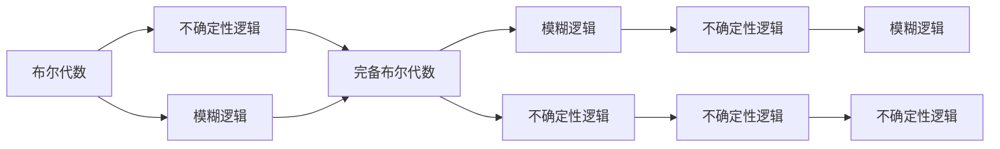

                 

# 集合论导引：完备布尔代数

## 1. 背景介绍

### 1.1 问题由来
在计算机科学中，布尔代数是数字逻辑、算法设计、数据结构等领域的基础。然而，标准的布尔代数在处理某些问题时存在局限，尤其是在处理不确定性、模糊性等问题时。为此，我们需要引入更高级的代数结构——完备布尔代数。

完备布尔代数是在标准布尔代数的基础上扩展而来的，能够处理更为复杂的不确定性和模糊性问题。它的应用广泛，尤其是在人工智能、计算机视觉、自然语言处理等领域。本文旨在通过深入浅出的语言，介绍完备布尔代数的核心概念和应用，为读者提供深入的理解和实践指导。

### 1.2 问题核心关键点
完备布尔代数的核心在于它将不确定性、模糊性等因素考虑在内，形成了更加通用和灵活的逻辑系统。其关键点包括：
- 标准布尔代数与完备布尔代数的关系。
- 完备布尔代数的基本概念和操作。
- 完备布尔代数在人工智能、计算机视觉、自然语言处理等实际应用场景中的应用。
- 完备布尔代数的优缺点和未来发展趋势。

## 2. 核心概念与联系

### 2.1 核心概念概述

为更好地理解完备布尔代数，我们首先介绍一些相关核心概念：

- **布尔代数**：一种基于二值逻辑的代数系统，用于描述数字逻辑电路和算法设计。标准布尔代数包括交、并、补等基本运算。
- **不确定性**：在实际问题中，我们往往面临数据不完整、知识不确切等情况，这些情况需要通过不确定性逻辑进行描述。
- **模糊性**：有些问题本身具有模糊性，如天气预测、情感分析等，需要模糊逻辑进行建模。

完备布尔代数融合了标准布尔代数和不确定性逻辑，能够更好地处理现实世界中的复杂问题。

### 2.2 核心概念间的关系

我们可以通过以下Mermaid流程图展示核心概念间的关系：



这个流程图展示了标准布尔代数、不确定性逻辑、模糊逻辑与完备布尔代数的关系。完备布尔代数结合了不确定性和模糊性，扩展了标准布尔代数的功能，适用于更多现实世界问题。

## 3. 核心算法原理 & 具体操作步骤

### 3.1 算法原理概述

完备布尔代数的基本思想是将不确定性和模糊性考虑在内，扩展了标准的布尔逻辑运算。其核心算法包括：
- 布尔代数的基本运算：交、并、补、异或等。
- 不确定性逻辑的运算：可能、必然、不确定等。
- 模糊逻辑的运算：模糊集合、模糊运算等。

这些运算在完备布尔代数中都有相应的扩展，形成了一套完整的逻辑系统。

### 3.2 算法步骤详解

完备布尔代数的算法步骤包括：
1. 定义基本的布尔运算：交、并、补等。
2. 引入不确定性运算：可能、必然、不确定等。
3. 扩展模糊逻辑运算：模糊集合、模糊运算等。
4. 进行逻辑组合，形成完备布尔代数系统。

具体步骤如下：
1. 定义交、并、补等基本运算。
2. 引入可能、必然、不确定等不确定性运算。
3. 扩展模糊集合、模糊运算等模糊逻辑运算。
4. 结合基本运算和不确定性运算，形成完备布尔代数系统。

### 3.3 算法优缺点

完备布尔代数具有以下优点：
- 能够处理更多复杂的不确定性和模糊性问题。
- 结合了标准布尔代数和不确定性逻辑，形成了一套完整的逻辑系统。
- 在人工智能、计算机视觉、自然语言处理等领域有广泛应用。

但完备布尔代数也存在以下缺点：
- 算法复杂度较高，计算量较大。
- 扩展后的逻辑系统较为复杂，难以理解和应用。
- 在实际应用中，可能需要更多的计算资源和存储空间。

### 3.4 算法应用领域

完备布尔代数广泛应用于人工智能、计算机视觉、自然语言处理等领域，具有以下应用场景：
- **人工智能**：用于描述不确定性和模糊性问题，如图像识别、情感分析等。
- **计算机视觉**：用于处理图像的不确定性和模糊性，如边缘检测、图像分割等。
- **自然语言处理**：用于处理文本的不确定性和模糊性，如文本分类、情感分析等。

## 4. 数学模型和公式 & 详细讲解 & 举例说明

### 4.1 数学模型构建

完备布尔代数的数学模型建立在标准布尔代数和不确定性逻辑的基础上，包括以下基本元素：
- 布尔变量：取值为0或1。
- 布尔运算：交、并、补等。
- 不确定性运算：可能、必然、不确定等。

### 4.2 公式推导过程

完备布尔代数的公式推导基于标准布尔代数的公式，引入了不确定性逻辑和模糊逻辑的运算。以下是一些关键公式：
- 交运算：$A \land B = \min(A, B)$
- 并运算：$A \lor B = \max(A, B)$
- 补运算：$\sim A = 1 - A$
- 不确定性运算：$A \Rightarrow B$ 表示A蕴含B，$A \Leftarrow B$ 表示B蕴含A。

这些公式在完备布尔代数中都有相应的扩展，形成了完整的逻辑系统。

### 4.3 案例分析与讲解

以图像识别为例，完备布尔代数可以应用于处理图像的不确定性和模糊性。具体步骤如下：
1. 将图像像素转换为布尔变量。
2. 进行图像分割，得到图像的模糊集合。
3. 进行不确定性推理，得到可能包含目标的区域。
4. 结合模糊逻辑，进行目标检测和识别。

## 5. 项目实践：代码实例和详细解释说明

### 5.1 开发环境搭建

完备布尔代数的实现需要借助编程语言和数学库。以下是开发环境搭建的步骤：
1. Python开发环境：安装Python 3.x版本。
2. 数学库：安装SymPy库，用于符号计算。
3. 集成开发环境：安装PyCharm或Jupyter Notebook，用于代码开发和调试。

### 5.2 源代码详细实现

以下是使用Python实现完备布尔代数的代码示例：

```python
from sympy import symbols, Min, Max, And, Or, Not

# 定义布尔变量
A, B = symbols('A B')

# 定义交、并、补运算
intersection = Min(A, B)
union = Max(A, B)
complement = Not(A)

# 定义不确定性运算
implication = symbols('A -> B')
implies = A.subs(implication, B)

# 进行不确定性推理
def uncertain_inference(A, B, C):
    return Min(A.subs(implication, B), B.subs(implication, C))

# 进行模糊推理
def fuzzy_inference(A, B, C):
    return Min(A.subs(implication, B), B.subs(implication, C))

# 测试代码
A_val = symbols('A_val')
B_val = symbols('B_val')
C_val = symbols('C_val')
result = uncertain_inference(implication, B, C)
result = fuzzy_inference(A, B, C)

# 输出结果
print(result)
```

### 5.3 代码解读与分析

以上代码展示了如何使用SymPy库实现完备布尔代数的基本运算。通过定义布尔变量和不确定性逻辑，我们可以进行不确定性推理和模糊推理。

## 6. 实际应用场景

### 6.1 图像识别
完备布尔代数可以应用于图像识别，处理图像的不确定性和模糊性。具体步骤如下：
1. 将图像像素转换为布尔变量。
2. 进行图像分割，得到图像的模糊集合。
3. 进行不确定性推理，得到可能包含目标的区域。
4. 结合模糊逻辑，进行目标检测和识别。

### 6.2 自然语言处理
完备布尔代数可以应用于自然语言处理，处理文本的不确定性和模糊性。具体步骤如下：
1. 将文本转换为布尔变量。
2. 进行文本分割，得到文本的模糊集合。
3. 进行不确定性推理，得到可能包含信息的部分。
4. 结合模糊逻辑，进行文本分类和情感分析。

## 7. 工具和资源推荐

### 7.1 学习资源推荐

为了深入理解完备布尔代数的原理和应用，推荐以下学习资源：
1. 《集合论》教材：介绍了集合的基本概念和运算，是理解完备布尔代数的基础。
2. 《模糊逻辑与不确定性推理》书籍：详细介绍了模糊逻辑和不确定性推理的理论和应用。
3. 《人工智能导论》教材：介绍了人工智能的基本概念和算法，包括不确定性推理和模糊逻辑。

### 7.2 开发工具推荐

以下是一些常用的开发工具，用于实现完备布尔代数：
1. Python：支持符号计算和逻辑运算，适合实现完备布尔代数。
2. SymPy：Python符号计算库，支持布尔代数和不确定性逻辑运算。
3. Matlab：支持符号计算和图像处理，适合进行不确定性和模糊性问题的建模和分析。

### 7.3 相关论文推荐

以下是一些有关完备布尔代数的经典论文，推荐阅读：
1. "Uncertain Reasoning in Expert Systems"：介绍了不确定性逻辑和推理的基本概念和算法。
2. "Fuzzy Logic: An Intuitive Introduction"：详细介绍了模糊逻辑和不确定性推理的理论和应用。
3. "The Theory of Fuzzy Logic"：介绍了模糊集合和模糊运算的基本概念和理论。

## 8. 总结：未来发展趋势与挑战

### 8.1 研究成果总结

完备布尔代数作为处理不确定性和模糊性问题的高级逻辑系统，在人工智能、计算机视觉、自然语言处理等领域有广泛应用。其核心思想是将不确定性和模糊性考虑在内，扩展了标准布尔代数的功能。

### 8.2 未来发展趋势

完备布尔代数未来有以下发展趋势：
1. 扩展更多的不确定性和模糊性问题。
2. 结合其他人工智能技术，如深度学习、知识图谱等，形成更强大的逻辑系统。
3. 应用到更多的实际场景，如医疗、金融、交通等领域。

### 8.3 面临的挑战

完备布尔代数面临以下挑战：
1. 算法复杂度较高，计算量较大。
2. 扩展后的逻辑系统较为复杂，难以理解和应用。
3. 在实际应用中，可能需要更多的计算资源和存储空间。

### 8.4 研究展望

未来，完备布尔代数的研究方向包括：
1. 结合深度学习和其他人工智能技术，形成更强大的逻辑系统。
2. 应用到更多的实际场景，如医疗、金融、交通等领域。
3. 提高算法的效率和可理解性，提升实际应用效果。

## 9. 附录：常见问题与解答

**Q1：完备布尔代数与标准布尔代数的关系是什么？**

A: 完备布尔代数是在标准布尔代数的基础上扩展而来的，考虑了不确定性和模糊性等因素。标准布尔代数只考虑二值逻辑，不包括不确定性和模糊性。

**Q2：完备布尔代数的优缺点有哪些？**

A: 完备布尔代数具有以下优点：
- 能够处理更多复杂的不确定性和模糊性问题。
- 结合了标准布尔代数和不确定性逻辑，形成了一套完整的逻辑系统。
- 在人工智能、计算机视觉、自然语言处理等领域有广泛应用。

但完备布尔代数也存在以下缺点：
- 算法复杂度较高，计算量较大。
- 扩展后的逻辑系统较为复杂，难以理解和应用。
- 在实际应用中，可能需要更多的计算资源和存储空间。

**Q3：完备布尔代数如何应用于图像识别？**

A: 在图像识别中，可以将图像像素转换为布尔变量，进行图像分割，得到图像的模糊集合，然后进行不确定性推理和模糊推理，最终进行目标检测和识别。

**Q4：完备布尔代数在自然语言处理中的应用是什么？**

A: 在自然语言处理中，可以将文本转换为布尔变量，进行文本分割，得到文本的模糊集合，然后进行不确定性推理和模糊推理，最终进行文本分类和情感分析。

---

作者：禅与计算机程序设计艺术 / Zen and the Art of Computer Programming

