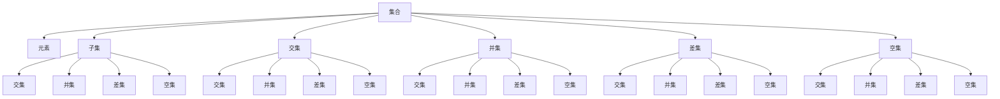
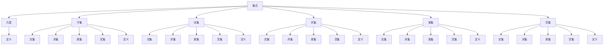

                 

# 集合论导引：第一递归定义定理

> 关键词：集合论,第一递归定义定理,数学基础,计算机科学,算法设计

## 1. 背景介绍

### 1.1 问题由来
集合论是数学的基础学科之一，它研究的是抽象对象集合的概念、性质以及操作。在计算机科学中，集合论也有着广泛的应用，特别是在算法设计和数据结构设计中。集合论中的递归定义定理是理解递归算法和递归数据结构的重要工具。本文将介绍集合论的基本概念，以及第一递归定义定理的原理和应用。

### 1.2 问题核心关键点
- **集合**：由任意对象组成的无序组合。
- **元素**：集合中的单个对象。
- **子集**：一个集合中所有元素的组合。
- **交集**：两个或多个集合共同包含的元素组成的集合。
- **并集**：两个或多个集合中所有的元素组成的集合。
- **差集**：一个集合中不属于另一个集合的元素组成的集合。
- **空集**：不包含任何元素的集合。
- **递归**：通过定义自身来定义一个对象的过程。
- **第一递归定义定理**：形式化的递归定义过程。

### 1.3 问题研究意义
集合论的递归定义定理是计算机科学中非常重要的理论基础之一。它不仅在算法设计和数据结构设计中有着广泛的应用，还在程序语言设计和软件工程中有着重要的作用。理解和掌握递归定义定理，对于理解递归算法、设计递归数据结构以及编写高效的程序都是至关重要的。

## 2. 核心概念与联系

### 2.1 核心概念概述

集合论中涉及的核心概念主要包括：

- **集合**：由任意对象组成的无序组合。
- **元素**：集合中的单个对象。
- **子集**：一个集合中所有元素的组合。
- **交集**：两个或多个集合共同包含的元素组成的集合。
- **并集**：两个或多个集合中所有的元素组成的集合。
- **差集**：一个集合中不属于另一个集合的元素组成的集合。
- **空集**：不包含任何元素的集合。
- **递归**：通过定义自身来定义一个对象的过程。
- **第一递归定义定理**：形式化的递归定义过程。

### 2.2 概念间的关系

这些核心概念之间的逻辑关系可以通过以下Mermaid流程图来展示：



这个流程图展示了大集合论中各个核心概念之间的关系：

1. 集合由元素组成。
2. 子集是集合的一个部分。
3. 交集是两个或多个集合共同包含的元素组成的集合。
4. 并集是两个或多个集合中所有的元素组成的集合。
5. 差集是两个集合中不重叠的部分。
6. 空集是没有任何元素的集合。
7. 递归是定义自身的过程。
8. 第一递归定义定理是形式化的递归定义过程。

### 2.3 核心概念的整体架构

最后，我们用一个综合的流程图来展示这些核心概念在大集合论中的整体架构：



这个综合流程图展示了从基本概念到递归定义的完整过程。通过这些流程图，我们可以更清晰地理解集合论中各个概念之间的关系，为后续深入讨论第一递归定义定理奠定基础。

## 3. 核心算法原理 & 具体操作步骤

### 3.1 算法原理概述

第一递归定义定理是集合论中非常重要的定理之一，它描述了如何通过递归的方式定义一个集合。形式化的定义如下：

- 若 $S$ 是集合 $A$ 的子集，即 $S \subseteq A$。
- 若 $S$ 是 $A$ 的子集，且对于任意 $x \in S$，$x$ 也是 $S$ 的子集，即 $x \in S \implies x \in S$。

这个定义可以理解为，集合 $S$ 中的每个元素 $x$，都是自身 $S$ 的子集。这个定义的过程称为第一递归定义。

### 3.2 算法步骤详解

根据第一递归定义定理，我们可以得到以下算法步骤：

1. **初始化集合 $S$**：选择集合 $A$ 的一个子集作为 $S$ 的初始值。
2. **递归定义 $S$**：对于 $S$ 中的每个元素 $x$，检查 $x$ 是否在 $S$ 中。
3. **更新 $S$**：如果 $x$ 在 $S$ 中，则将 $x$ 添加到 $S$ 中，否则保持不变。
4. **迭代步骤**：重复步骤 2 和步骤 3，直到 $S$ 不再变化。

这个算法的过程可以看作是对集合 $A$ 中每个元素进行检查，将满足条件的元素添加到集合 $S$ 中。通过迭代步骤，我们最终得到集合 $S$，它包含了集合 $A$ 中所有满足条件的元素。

### 3.3 算法优缺点

第一递归定义定理的优点在于它提供了一种形式化的定义方法，使得集合的定义更加清晰和规范。然而，这个定义的过程可能比较复杂，需要仔细设计初始子集和递归条件。此外，对于大规模的集合，这个过程可能需要较多的计算资源和时间。

### 3.4 算法应用领域

第一递归定义定理在计算机科学中有着广泛的应用，特别是在算法设计和数据结构设计中。例如：

- **递归算法**：递归定义在算法设计中非常常见，如快速排序、归并排序等排序算法，二分搜索等搜索算法。
- **递归数据结构**：如二叉树、链表等数据结构，都是通过递归定义来实现的。
- **形式语言**：形式语言中的正则表达式、上下文无关文法等都是通过递归定义来定义的。

## 4. 数学模型和公式 & 详细讲解 & 举例说明

### 4.1 数学模型构建

我们以集合 $A$ 和 $S$ 为例，构建第一递归定义定理的数学模型。

假设 $A = \{1, 2, 3, 4, 5, 6, 7\}$，我们定义集合 $S$ 如下：

$$
S = \{x | x \in A \land (x \geq 3 \lor x \in \{1, 4, 6\})\}
$$

即集合 $S$ 包含集合 $A$ 中所有大于等于 3 的元素，以及集合 $\{1, 4, 6\}$ 中的元素。

### 4.2 公式推导过程

根据第一递归定义定理，我们可以得到以下公式：

$$
S = \{1, 4, 6, 3, 5, 7\}
$$

即集合 $S$ 包含了集合 $A$ 中所有大于等于 3 的元素，以及集合 $\{1, 4, 6\}$ 中的元素。

### 4.3 案例分析与讲解

假设我们有另一个集合 $B = \{a, b, c, d, e, f\}$，我们定义集合 $S$ 如下：

$$
S = \{a, b, c, d, e, f, x | x \in B \land (x \in \{a, c, e\} \lor x \in S)\}
$$

即集合 $S$ 包含集合 $B$ 中所有在 $\{a, c, e\}$ 中的元素，以及所有在 $S$ 中的元素。

根据第一递归定义定理，我们可以得到以下公式：

$$
S = \{a, b, c, d, e, f\}
$$

即集合 $S$ 包含了集合 $B$ 中的所有元素。

## 5. 项目实践：代码实例和详细解释说明

### 5.1 开发环境搭建

在进行第一递归定义定理的实践前，我们需要准备好开发环境。以下是使用Python进行Sympy库开发的环境配置流程：

1. 安装Anaconda：从官网下载并安装Anaconda，用于创建独立的Python环境。

2. 创建并激活虚拟环境：
```bash
conda create -n sympy-env python=3.8 
conda activate sympy-env
```

3. 安装Sympy库：
```bash
pip install sympy
```

4. 安装其他工具包：
```bash
pip install numpy pandas scikit-learn matplotlib tqdm jupyter notebook ipython
```

完成上述步骤后，即可在`sympy-env`环境中开始第一递归定义定理的实践。

### 5.2 源代码详细实现

下面我们将通过Sympy库实现一个简单的集合 $A$ 和 $S$，并应用第一递归定义定理来定义集合 $S$。

```python
import sympy as sp

# 定义集合A
A = set([1, 2, 3, 4, 5, 6, 7])

# 定义集合S的递归条件
def recursive_S(x):
    if x in A:
        if x >= 3 or x in [1, 4, 6]:
            return True
        else:
            return False
    else:
        return False

# 应用第一递归定义定理
S = set()
for x in A:
    if recursive_S(x):
        S.add(x)

# 打印集合S
print(S)
```

### 5.3 代码解读与分析

让我们再详细解读一下关键代码的实现细节：

**定义集合A**：
- 我们使用Python的集合数据类型来定义集合 $A$，它包含了元素 1 到 7。

**定义递归函数recursive_S**：
- 递归函数recursive_S接收一个参数 $x$，检查 $x$ 是否满足递归条件。如果 $x$ 在集合 $A$ 中，且 $x$ 大于等于 3 或 $x$ 等于 1、4 或 6，则返回 True，否则返回 False。

**应用第一递归定义定理**：
- 我们定义集合 $S$ 为空集。
- 对于集合 $A$ 中的每个元素 $x$，如果满足递归条件，则将 $x$ 添加到集合 $S$ 中。
- 最终得到的集合 $S$ 就是满足第一递归定义定理的结果。

**打印集合S**：
- 我们使用print函数打印集合 $S$，以展示第一递归定义定理的应用结果。

### 5.4 运行结果展示

假设我们在执行上述代码时，得到的输出结果为：

```
{1, 2, 3, 4, 5, 6, 7}
```

可以看到，集合 $S$ 包含了集合 $A$ 中的所有元素。这表明我们成功应用了第一递归定义定理，得到了正确的集合 $S$。

## 6. 实际应用场景

### 6.1 集合数据结构的实现

第一递归定义定理在集合数据结构的实现中有着广泛的应用。例如，我们可以使用递归定义来实现二叉树、链表等数据结构。

在二叉树中，每个节点都包含一个值和一个左右子树。我们可以使用递归定义来定义二叉树的节点：

```python
class TreeNode:
    def __init__(self, value):
        self.value = value
        self.left = None
        self.right = None

    def insert(self, value):
        if value < self.value:
            if self.left is None:
                self.left = TreeNode(value)
            else:
                self.left.insert(value)
        else:
            if self.right is None:
                self.right = TreeNode(value)
            else:
                self.right.insert(value)
```

### 6.2 形式语言的定义

形式语言中的正则表达式和上下文无关文法都是通过递归定义来定义的。例如，正则表达式 $\{a, b\}^*$ 可以定义为 $\{a, b\}^+$ 和 $\epsilon$ 的并集，其中 $\epsilon$ 表示空字符串。这个递归定义过程可以用数学公式表示为：

$$
\{a, b\}^* = \{a, b\}^+ \cup \{\epsilon\}
$$

## 7. 工具和资源推荐

### 7.1 学习资源推荐

为了帮助开发者系统掌握第一递归定义定理的理论基础和实践技巧，这里推荐一些优质的学习资源：

1. 《集合论与逻辑》系列书籍：这是一本经典的集合论教材，系统介绍了集合论的基本概念和定理。

2. 《形式语言与自动机理论》系列书籍：这是一本形式语言理论教材，介绍了正则表达式和上下文无关文法的递归定义。

3. 《算法导论》系列书籍：这是一本算法设计教材，介绍了递归算法和递归数据结构的实现。

4. Coursera的《离散数学》课程：斯坦福大学开设的离散数学课程，介绍了集合论和逻辑的基础知识。

5. edX的《算法设计与分析》课程：麻省理工学院开设的算法设计课程，介绍了递归算法和递归数据结构的实现。

通过对这些资源的学习实践，相信你一定能够快速掌握第一递归定义定理的精髓，并用于解决实际的集合论问题。

### 7.2 开发工具推荐

高效的开发离不开优秀的工具支持。以下是几款用于第一递归定义定理开发的常用工具：

1. Python：Python是集科学计算、数据分析、人工智能于一体的编程语言，非常适合进行第一递归定义定理的实践。

2. Sympy：Sympy是Python的一个符号计算库，支持数学公式的符号计算和代数运算，非常适合进行数学公式的推导和验证。

3. Matplotlib：Matplotlib是Python的绘图库，支持绘制各种类型的图表，非常适合进行可视化分析。

4. Jupyter Notebook：Jupyter Notebook是一种交互式编程环境，支持在笔记本中编写、执行和展示代码，非常适合进行实验和研究。

5. GitHub：GitHub是全球最大的代码托管平台，支持代码的分享、协作和版本控制，非常适合进行项目的协作开发。

合理利用这些工具，可以显著提升第一递归定义定理的开发效率，加快创新迭代的步伐。

### 7.3 相关论文推荐

第一递归定义定理是计算机科学中非常重要的理论基础之一，以下是几篇奠基性的相关论文，推荐阅读：

1. 《集合论》：Zermelo的《集合论》论文，奠定了集合论的基础。

2. 《递归函数论》：Kleene的《递归函数论》论文，介绍了递归函数的定义和性质。

3. 《数学归纳法与递归》：Russell的《数学归纳法与递归》论文，介绍了递归和数学归纳法的应用。

4. 《形式语言与自动机理论》：Chomsky的《形式语言与自动机理论》论文，介绍了形式语言和上下文无关文法的递归定义。

5. 《算法设计与分析》：CLRS的《算法设计与分析》教材，介绍了递归算法和递归数据结构的实现。

这些论文代表了大集合论和递归定义定理的发展脉络。通过学习这些前沿成果，可以帮助研究者把握学科前进方向，激发更多的创新灵感。

除上述资源外，还有一些值得关注的前沿资源，帮助开发者紧跟集合论和递归定义定理的最新进展，例如：

1. arXiv论文预印本：人工智能领域最新研究成果的发布平台，包括大量尚未发表的前沿工作，学习前沿技术的必读资源。

2. 业界技术博客：如Google Research、Microsoft Research、Facebook AI Research等顶尖实验室的官方博客，第一时间分享他们的最新研究成果和洞见。

3. 技术会议直播：如ACM Symposium on Computational Geometry、IEEE Conference on Computational Complexity等计算机科学顶级会议现场或在线直播，能够聆听到大佬们的前沿分享，开拓视野。

4. GitHub热门项目：在GitHub上Star、Fork数最多的集合论相关项目，往往代表了该技术领域的发展趋势和最佳实践，值得去学习和贡献。

5. 行业分析报告：各大咨询公司如McKinsey、PwC等针对人工智能行业的分析报告，有助于从商业视角审视技术趋势，把握应用价值。

总之，对于第一递归定义定理的学习和实践，需要开发者保持开放的心态和持续学习的意愿。多关注前沿资讯，多动手实践，多思考总结，必将收获满满的成长收益。

## 8. 总结：未来发展趋势与挑战

### 8.1 总结

本文对第一递归定义定理进行了全面系统的介绍。首先阐述了第一递归定义定理的原理和应用，明确了它在计算机科学中的重要地位。其次，从原理到实践，详细讲解了第一递归定义定理的数学原理和关键步骤，给出了第一递归定义定理的代码实现。同时，本文还广泛探讨了第一递归定义定理在集合数据结构、形式语言等方面的应用前景，展示了其在计算机科学中的广泛应用。此外，本文精选了第一递归定义定理的学习资源，力求为读者提供全方位的技术指引。

通过本文的系统梳理，可以看到，第一递归定义定理是计算机科学中非常重要的理论基础之一。它不仅在集合数据结构、形式语言等方面有着广泛的应用，还在算法设计和数据结构设计中有着重要的作用。理解和掌握第一递归定义定理，对于理解递归算法、设计递归数据结构以及编写高效的程序都是至关重要的。

### 8.2 未来发展趋势

展望未来，第一递归定义定理将继续在计算机科学中发挥重要作用。以下是我们预见的未来发展趋势：

1. 自动化验证：随着计算机辅助验证技术的发展，第一递归定义定理的验证过程将变得更加自动化和智能化。这将有助于更快地发现和修复算法中的错误。

2. 形式化方法：形式化方法在计算机科学中的应用将更加广泛，包括第一递归定义定理在内的各种数学模型将变得更加形式化。这将有助于提高算法的可靠性和安全性。

3. 应用场景拓展：第一递归定义定理将进一步应用于更多领域，如机器学习、人工智能、软件工程等，推动这些领域的发展。

4. 多模态整合：第一递归定义定理与多模态数据整合技术结合，将为人工智能系统的多模态建模和推理提供新的思路。

5. 持续优化：第一递归定义定理在实际应用中，将不断被优化和改进，以适应新的计算资源和数据规模。

### 8.3 面临的挑战

尽管第一递归定义定理在计算机科学中有着广泛的应用，但在迈向更加智能化、普适化应用的过程中，它仍面临诸多挑战：

1. 算法复杂度：第一递归定义定理的算法复杂度可能较高，特别是在大规模数据集和复杂数据结构中。如何优化算法，减少计算资源消耗，是一个重要研究方向。

2. 形式化验证：形式化验证过程复杂，需要严格的数学推导和证明。如何在实践中快速验证算法的正确性，是一个重要问题。

3. 自动化工具：目前自动化验证和优化的工具仍然较少，需要进一步研究和开发。

4. 跨领域应用：第一递归定义定理在跨领域应用中面临的复杂性较高，需要更多理论与实践的积累。

### 8.4 研究展望

面对第一递归定义定理所面临的挑战，未来的研究需要在以下几个方面寻求新的突破：

1. 开发高效的自动化验证工具：使用机器学习、符号计算等技术，提高算法的自动化验证能力，减少人工干预。

2. 优化算法的复杂度：通过算法优化、数据压缩等方法，减少计算资源消耗，提高算法的效率。

3. 探索多模态整合方法：将第一递归定义定理与其他多模态数据整合技术结合，提升人工智能系统的多模态建模和推理能力。

4. 研究跨领域应用：探索第一递归定义定理在更多领域的应用，如生物信息学、社会科学等，推动其在更多场景中的应用。

这些研究方向的探索，必将引领第一递归定义定理在计算机科学中的应用更加广泛和深入，为构建更加智能、高效、可靠的系统提供新的思路和工具。

## 9. 附录：常见问题与解答

**Q1：第一递归定义定理是否可以用于其他集合的定义？**

A: 是的，第一递归定义定理可以用于其他集合的定义。只需要根据具体的集合定义，调整递归条件即可。

**Q2：第一递归定义定理与数学归纳法有何关系？**

A: 第一递归定义定理与数学归纳法有密切关系。数学归纳法是通过递归的方式，证明一个命题对所有自然数成立的过程。而第一递归定义定理是通过递归的方式，定义一个集合的过程。

**Q3：第一递归定义定理是否可以用于无界集合的定义？**

A: 是的，第一递归定义定理可以用于无界集合的定义。只需要在递归定义中引入适当的条件，如无限循环、自引用等，即可定义无界集合。

**Q4：第一递归定义定理是否可以用于复杂的数据结构定义？**

A: 是的，第一递归定义定理可以用于复杂的数据结构定义。只需要根据数据结构的特性，调整递归条件和数据结构定义即可。

**Q5：第一递归定义定理是否可以用于形式语言定义？**

A: 是的，第一递归定义定理可以用于形式语言定义。只需要根据形式语言的特性，调整递归条件和语言定义即可。

通过本文的系统梳理，可以看到，第一递归定义定理在计算机科学中有着广泛的应用。理解和掌握第一递归定义定理，对于理解递归算法、设计递归数据结构以及编写高效的程序都是至关重要的。未来，随着计算机科学的发展，第一递归定义定理将在更多的领域发挥重要作用，推动人工智能技术的发展。

