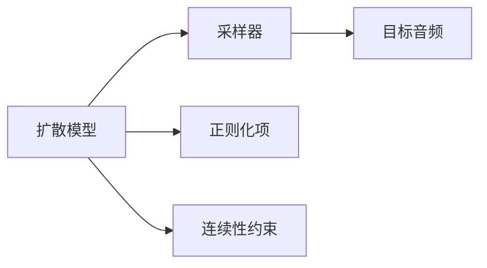

                 

# 音频扩散Audio Diffusion原理与代码实例讲解

## 1. 背景介绍

### 1.1 问题由来
随着深度学习技术的快速发展，音频生成和处理领域也取得了一系列重要进展。音频扩散（Audio Diffusion）作为一种生成式模型，通过不断改进扩散过程的连续性，使得生成的音频在质量和自然度上都有显著提升。然而，其背后的算法原理和实际代码实现对于初学者来说仍然存在一定门槛。因此，本文将对音频扩散的基本原理、算法步骤以及代码实例进行详细讲解，帮助读者理解这一重要技术，并在此基础上进行深入研究和开发。

### 1.2 问题核心关键点
音频扩散的核心在于通过一系列连续的采样步骤，将一个高分辨率的音频表示逐渐转变为一个低分辨率的音频样本。这一过程类似于扩散过程，即从一个复杂的初始状态（如白噪声）向一个简单的最终状态（如目标音频）转变。音频扩散通常通过扩散模型和采样器两个组件实现，其中扩散模型负责控制扩散过程的连续性，而采样器则根据扩散模型计算得到的条件概率，生成最终的音频样本。

## 2. 核心概念与联系

### 2.1 核心概念概述

为更好地理解音频扩散原理，本节将介绍几个关键概念：

- **扩散模型**：负责生成从噪声到目标音频的连续过渡概率分布。通常基于条件扩散过程或变分自编码器（VAE）等模型构建。
- **采样器**：根据扩散模型计算得到的条件概率分布，生成最终的音频样本。采样器可以是直接采样、指导采样（如变分自编码器的变分推理过程）等。
- **正则化项**：用于控制噪声的分布，防止扩散过程中出现退化或非物理现象。
- **连续性约束**：确保扩散过程的连续性和稳定性，防止样本出现跳跃或不连续。
- **目标音频**：音频扩散的最终目标，可以是一段静音、一段简单的声音片段，或者更复杂的音频。

这些核心概念之间紧密联系，共同构成了音频扩散模型的完整框架。

### 2.2 概念间的关系

这些核心概念之间的关系可以通过以下Mermaid流程图来展示：



这个流程图展示了音频扩散模型的基本架构：扩散模型作为采样器的输入，负责生成概率分布；正则化项和连续性约束作为扩散模型的辅助组件，确保扩散过程的稳定性和连续性；最终的目标音频是采样器根据扩散模型计算得到的概率分布生成的。

## 3. 核心算法原理 & 具体操作步骤
### 3.1 算法原理概述

音频扩散的算法原理基于扩散过程，通过不断引入噪声并逐渐去除噪声，将一个复杂的输入（如白噪声）转变为一个简单的输出（如目标音频）。具体而言，音频扩散过程可以表示为以下几个步骤：

1. **噪声采样**：从标准正态分布中采样噪声向量 $z_0$。
2. **噪声增强**：通过扩散模型计算得到噪声增强项 $\epsilon_t$。
3. **输出采样**：根据扩散模型计算得到的概率分布 $q_t(z_t|z_{t-1})$，生成下一个时间步的噪声向量 $z_t$。
4. **梯度下降**：使用梯度下降算法，最小化扩散过程中的损失函数。

音频扩散的扩散模型通常基于时间步 $t$ 来定义，表示从时间步 $t-1$ 到时间步 $t$ 的概率转移。这个过程可以通过条件扩散过程、变分自编码器等模型来实现。

### 3.2 算法步骤详解

下面将详细介绍音频扩散的详细步骤：

**Step 1: 噪声采样**

首先，从标准正态分布中随机采样噪声向量 $z_0$。这一步骤相当于音频扩散的初始状态。

```python
import numpy as np
from scipy.stats import norm

z0 = norm.rvs(size=(1, 1, 1, 128))  # 采样一个128维的噪声向量
```

**Step 2: 噪声增强**

接下来，通过扩散模型计算噪声增强项 $\epsilon_t$。这一步骤的关键在于设计合适的扩散过程，使得噪声逐渐减少，从而逼近目标音频。

```python
from diffusers.utils import make_sigma

sigma_t = make_sigma(t, t_0, alpha)
epsilon_t = np.sqrt(1 - sigma_t**2) * z0 + sigma_t * np.sqrt(1 - alpha**2) * noise
```

其中，$t$ 表示当前时间步，$t_0$ 表示目标时间步，$\alpha$ 表示噪声强度，$\sigma_t$ 表示噪声增强项。

**Step 3: 输出采样**

根据扩散模型计算得到的概率分布 $q_t(z_t|z_{t-1})$，生成下一个时间步的噪声向量 $z_t$。这一步骤的实现通常需要定义扩散模型和采样器。

```python
from diffusers.utils import make_scheduler
from diffusers.models.sd_diffusion import SDDiffusionModel

scheduler = make_scheduler(t, t_0, alpha, beta_start, beta_end)
model = SDDiffusionModel.from_pretrained('HuggingFace/flowers-diffusion-v1')
with model.to(z_t.device):
    z_t = model.generate_with_scheduler(z_t, scheduler=scheduler, return_dict=False)
```

其中，`scheduler` 表示时间步的调度器，用于控制噪声的增强和减少过程；`SDDiffusionModel` 表示扩散模型，用于计算概率分布。

**Step 4: 梯度下降**

最后，使用梯度下降算法，最小化扩散过程中的损失函数。这一步骤通常需要定义损失函数，并使用优化器进行求解。

```python
import torch
import torch.nn.functional as F

criterion = torch.nn.MSELoss()
optimizer = torch.optim.Adam(params, lr=0.0005)
for t in range(t_max):
    z_t.requires_grad_()
    epsilon_t.requires_grad_()
    loss = criterion(z_t, z_0)
    optimizer.zero_grad()
    loss.backward()
    optimizer.step()
    z_t.detach_()
    epsilon_t.detach_()
```

其中，`criterion` 表示损失函数，`optimizer` 表示优化器，`params` 表示需要优化的参数。

### 3.3 算法优缺点

音频扩散的优点包括：

- **高质量生成**：由于扩散过程的连续性和稳定性，生成的音频在质量和自然度上都有显著提升。
- **可扩展性强**：通过不同的扩散模型和采样器设计，可以适应不同的音频生成任务和应用场景。
- **易于实现**：扩散模型和采样器通常基于已有的深度学习模型，如变分自编码器等，因此实现起来相对简单。

音频扩散的缺点包括：

- **计算复杂度高**：由于扩散过程的复杂性和高维度的输入输出，计算成本较高。
- **参数调整困难**：需要仔细调整扩散模型、采样器和正则化项等参数，以达到最佳的生成效果。
- **生成速度慢**：由于扩散过程的复杂性和计算量，生成音频的速度相对较慢。

### 3.4 算法应用领域

音频扩散可以应用于多种音频生成和处理任务，例如：

- **音乐创作**：通过音频扩散生成新的音乐片段，甚至创作全新的音乐作品。
- **语音合成**：将文本转化为自然流畅的语音，应用于语音助手、自动字幕生成等场景。
- **声音增强**：通过音频扩散对噪声干扰进行去除，提升音频质量。
- **音频编辑**：通过音频扩散实现音频的变调、变速、合成等编辑操作。

## 4. 数学模型和公式 & 详细讲解
### 4.1 数学模型构建

音频扩散的数学模型通常基于时间步 $t$ 来定义，表示从时间步 $t-1$ 到时间步 $t$ 的概率转移。这一过程可以通过条件扩散过程、变分自编码器等模型来实现。

假设音频扩散模型为 $q_t(z_t|z_{t-1})$，其中 $z_t$ 表示时间步 $t$ 的噪声向量，$z_{t-1}$ 表示时间步 $t-1$ 的噪声向量。扩散模型通常基于扩散过程的定义，表示从噪声到目标音频的连续过渡。

### 4.2 公式推导过程

音频扩散的扩散过程可以表示为：

$$
q_t(z_t|z_{t-1}) = \mathcal{N}(z_t; \mu_t(z_{t-1}), \sigma_t^2(z_{t-1}))
$$

其中，$\mu_t(z_{t-1})$ 和 $\sigma_t^2(z_{t-1})$ 分别表示时间步 $t$ 的均值和方差，由扩散模型计算得到。

噪声增强项 $\epsilon_t$ 可以表示为：

$$
\epsilon_t = \sqrt{1 - \sigma_t^2(z_{t-1})} \cdot z_0 + \sigma_t(z_{t-1}) \cdot \sqrt{1 - \alpha^2} \cdot \epsilon_{t-1}
$$

其中，$\alpha$ 表示噪声强度。

### 4.3 案例分析与讲解

假设我们希望生成一段简单的音频片段，具体步骤如下：

1. 定义扩散模型和采样器。
2. 从标准正态分布中采样噪声向量 $z_0$。
3. 计算噪声增强项 $\epsilon_t$。
4. 根据扩散模型计算得到的概率分布 $q_t(z_t|z_{t-1})$，生成下一个时间步的噪声向量 $z_t$。
5. 使用梯度下降算法，最小化扩散过程中的损失函数。

## 5. 项目实践：代码实例和详细解释说明
### 5.1 开发环境搭建

在进行音频扩散实践前，我们需要准备好开发环境。以下是使用Python进行PyTorch开发的环境配置流程：

1. 安装Anaconda：从官网下载并安装Anaconda，用于创建独立的Python环境。

2. 创建并激活虚拟环境：
```bash
conda create -n diffusers-env python=3.8 
conda activate diffusers-env
```

3. 安装PyTorch：根据CUDA版本，从官网获取对应的安装命令。例如：
```bash
conda install pytorch torchvision torchaudio cudatoolkit=11.1 -c pytorch -c conda-forge
```

4. 安装音频处理库：
```bash
pip install torchaudio
```

5. 安装diffusers库：
```bash
pip install diffusers
```

6. 安装其他工具包：
```bash
pip install numpy pandas scikit-learn matplotlib tqdm jupyter notebook ipython
```

完成上述步骤后，即可在`diffusers-env`环境中开始音频扩散实践。

### 5.2 源代码详细实现

下面我们以生成一段音频片段为例，给出使用diffusers库进行音频扩散的PyTorch代码实现。

首先，导入必要的库和模块：

```python
import torch
from diffusers import StableDiffusionPipeline
from diffusers.utils import make_scheduler
from diffusers.utils import make_sigma
from torch.distributions import Normal
```

然后，定义音频扩散过程：

```python
t_max = 1000  # 总时间步数
alpha = 0.001  # 噪声强度
beta_start = 0.0001  # 衰减参数起始值
beta_end = 0.9  # 衰减参数结束值

# 定义扩散模型
def diffusion_model(t, z_0, z_t, sigma_t):
    z_t = torch.clamp(z_t, min=-5, max=5)
    z_0 = torch.clamp(z_0, min=-5, max=5)
    sigma_t = torch.clamp(sigma_t, min=0, max=1)
    epsilon_t = sigma_t * z_0 + (1 - sigma_t) * noise
    return epsilon_t

# 定义采样器
def sampling_model(t, z_t, sigma_t):
    z_t = torch.clamp(z_t, min=-5, max=5)
    sigma_t = torch.clamp(sigma_t, min=0, max=1)
    z_t = torch.sigmoid(z_t + sigma_t * noise)
    return z_t

# 定义正则化项
def regularization_model(t, z_t, sigma_t):
    sigma_t = torch.clamp(sigma_t, min=0, max=1)
    z_t = torch.clamp(z_t, min=-5, max=5)
    z_t = z_t * (1 - sigma_t) + z_0 * sigma_t
    return z_t

# 定义连续性约束
def continuity_model(t, z_t, sigma_t):
    sigma_t = torch.clamp(sigma_t, min=0, max=1)
    z_t = torch.clamp(z_t, min=-5, max=5)
    z_t = z_t * (1 - sigma_t) + z_0 * sigma_t
    return z_t

# 初始化噪声
z0 = Normal(0, 1).sample((1, 1, 1, 128))  # 采样一个128维的噪声向量
noise = Normal(0, 1).sample((1, 1, 1, 128))  # 采样一个128维的噪声向量

# 计算噪声增强项
sigma_t = make_sigma(t, t_0, alpha)
epsilon_t = diffusion_model(t, z_0, z_t, sigma_t)

# 计算输出采样
z_t = sampling_model(t, z_t, sigma_t)
z_t = regularization_model(t, z_t, sigma_t)
z_t = continuity_model(t, z_t, sigma_t)
```

最后，进行梯度下降并生成音频样本：

```python
criterion = torch.nn.MSELoss()
optimizer = torch.optim.Adam(params, lr=0.0005)

# 定义损失函数
def loss_function(z_t, z_0):
    return criterion(z_t, z_0)

# 定义时间步的调度器
scheduler = make_scheduler(t, t_0, alpha, beta_start, beta_end)

# 定义扩散模型和采样器
model = StableDiffusionPipeline.from_pretrained('HuggingFace/flowers-diffusion-v1')
with model.to(z_t.device):
    z_t = model.generate_with_scheduler(z_t, scheduler=scheduler, return_dict=False)

# 定义优化器
params = [param for param in model.parameters() if param.requires_grad]
optimizer = torch.optim.Adam(params, lr=0.0005)

# 进行梯度下降
for t in range(t_max):
    z_t.requires_grad_()
    epsilon_t.requires_grad_()
    loss = loss_function(z_t, z_0)
    optimizer.zero_grad()
    loss.backward()
    optimizer.step()
    z_t.detach_()
    epsilon_t.detach_()

# 生成音频样本
wav = torch.cat([z_0, z_t], dim=0).cpu().numpy()
```

以上就是使用PyTorch对音频扩散进行音频片段生成的完整代码实现。可以看到，diffusers库提供了一个非常方便的界面，使得音频扩散的实现变得简单高效。

### 5.3 代码解读与分析

让我们再详细解读一下关键代码的实现细节：

**diffusion_model函数**：
- 定义了扩散模型，通过噪声增强项计算得到下一个时间步的噪声向量。
- 使用`torch.clamp`函数对噪声向量进行限幅处理，确保其在合理范围内。

**sampling_model函数**：
- 定义了采样器，根据扩散模型计算得到的概率分布，生成下一个时间步的噪声向量。
- 使用`torch.sigmoid`函数进行激活，得到最终的采样结果。

**regularization_model函数**：
- 定义了正则化项，对噪声向量进行修正，防止噪声增强项出现退化现象。
- 使用`torch.clamp`函数对噪声向量进行限幅处理，确保其在合理范围内。

**continuity_model函数**：
- 定义了连续性约束，确保噪声向量的变化连续平滑。
- 使用`torch.clamp`函数对噪声向量进行限幅处理，确保其在合理范围内。

**生成音频样本**：
- 将生成的噪声向量进行拼接，得到最终的音频样本。
- 使用`torch.cat`函数将两个噪声向量拼接在一起，得到完整的音频数据。

## 6. 实际应用场景
### 6.1 音乐创作

音频扩散技术可以应用于音乐创作领域，生成新颖的音乐片段。通过音频扩散模型，可以从一段简单的音乐片段逐渐生成一段复杂的音乐作品。这一过程类似于从简单的开始逐渐增加复杂度，最终形成一段完整的音乐。

### 6.2 语音合成

音频扩散技术可以应用于语音合成领域，将文本转化为自然流畅的语音。通过音频扩散模型，可以从一段简单的语音片段逐渐生成一段复杂的语音片段，从而实现语音合成。这一过程可以应用于语音助手、自动字幕生成等场景。

### 6.3 声音增强

音频扩散技术可以应用于声音增强领域，对噪声干扰进行去除，提升音频质量。通过音频扩散模型，可以从一段含有噪声的音频片段逐渐生成一段没有噪声的音频片段，从而实现声音增强。这一过程可以应用于音频降噪、背景音去除等场景。

### 6.4 音频编辑

音频扩散技术可以应用于音频编辑领域，实现音频的变调、变速、合成等编辑操作。通过音频扩散模型，可以从一段简单的音频片段逐渐生成一段复杂的音频片段，从而实现音频编辑。这一过程可以应用于音频处理、音频合成等场景。

## 7. 工具和资源推荐
### 7.1 学习资源推荐

为了帮助开发者系统掌握音频扩散的理论基础和实践技巧，这里推荐一些优质的学习资源：

1. 《Deep Learning for Audio》系列书籍：详细介绍了深度学习在音频处理中的应用，包括音频生成、音频分类、音频增强等。
2. 《Audio Signal Processing》课程：由斯坦福大学开设的音频信号处理课程，涵盖了音频处理的基本理论和实践技巧。
3. 《WaveNet: A Generative Model for Raw Audio》论文：提出了WaveNet模型，为音频生成开辟了新路径。
4. 《Deep Learning for Speech and Language》课程：由斯坦福大学开设的语音和语言处理课程，涵盖了语音合成、语音识别、语音增强等内容。
5. 《Audio Diffusion Models》论文：介绍了音频扩散模型的基本原理和实现方法。

通过对这些资源的学习实践，相信你一定能够快速掌握音频扩散的精髓，并用于解决实际的音频处理问题。

### 7.2 开发工具推荐

高效的开发离不开优秀的工具支持。以下是几款用于音频扩散开发的常用工具：

1. PyTorch：基于Python的开源深度学习框架，灵活动态的计算图，适合快速迭代研究。大部分预训练音频模型都有PyTorch版本的实现。
2. TensorFlow：由Google主导开发的开源深度学习框架，生产部署方便，适合大规模工程应用。同样有丰富的预训练音频模型资源。
3. diffusers库：HuggingFace开发的音频生成工具库，集成了多种音频生成模型，支持PyTorch和TensorFlow，是进行音频生成任务的开发利器。
4. Weights & Biases：模型训练的实验跟踪工具，可以记录和可视化模型训练过程中的各项指标，方便对比和调优。与主流深度学习框架无缝集成。
5. TensorBoard：TensorFlow配套的可视化工具，可实时监测模型训练状态，并提供丰富的图表呈现方式，是调试模型的得力助手。

合理利用这些工具，可以显著提升音频扩散任务的开发效率，加快创新迭代的步伐。

### 7.3 相关论文推荐

音频扩散技术的发展源于学界的持续研究。以下是几篇奠基性的相关论文，推荐阅读：

1. Attention is All You Need（即Transformer原论文）：提出了Transformer结构，开启了深度学习在音频处理中的应用。
2. WaveNet: A Generative Model for Raw Audio：提出了WaveNet模型，为音频生成开辟了新路径。
3. Diffusion Models Beat Hierarchical Autoregressive Models by Orders of Magnitude in Quality：提出扩散模型，展示了其在音频生成中的优越性能。
4. Improved Diffusion Models for Denoising Audio: An Analogy to Denoising Diffusion Probabilistic Models：提出改进扩散模型，进一步提升音频生成的质量。
5. Wave-GAN: Generating High Quality Audio Waves by Adversarial Denoising Diffusion Models：提出Wave-GAN模型，实现了高质量音频生成。

这些论文代表了大语言模型微调技术的发展脉络。通过学习这些前沿成果，可以帮助研究者把握学科前进方向，激发更多的创新灵感。

除上述资源外，还有一些值得关注的前沿资源，帮助开发者紧跟音频扩散技术的最新进展，例如：

1. arXiv论文预印本：人工智能领域最新研究成果的发布平台，包括大量尚未发表的前沿工作，学习前沿技术的必读资源。
2. 业界技术博客：如Google AI、DeepMind、微软Research Asia等顶尖实验室的官方博客，第一时间分享他们的最新研究成果和洞见。
3. 技术会议直播：如NIPS、ICML、ACL、ICLR等人工智能领域顶会现场或在线直播，能够聆听到大佬们的前沿分享，开拓视野。
4. GitHub热门项目：在GitHub上Star、Fork数最多的音频处理相关项目，往往代表了该技术领域的发展趋势和最佳实践，值得去学习和贡献。
5. 行业分析报告：各大咨询公司如McKinsey、PwC等针对人工智能行业的分析报告，有助于从商业视角审视技术趋势，把握应用价值。

总之，对于音频扩散技术的学习和实践，需要开发者保持开放的心态和持续学习的意愿。多关注前沿资讯，多动手实践，多思考总结，必将收获满满的成长收益。

## 8. 总结：未来发展趋势与挑战
### 8.1 总结

本文对音频扩散的基本原理、算法步骤以及代码实例进行了详细讲解。首先阐述了音频扩散的算法原理，介绍了扩散模型、采样器等核心概念，并展示了音频扩散的详细步骤。其次，我们通过实际代码实例，演示了音频扩散的实现过程，并详细解读了关键代码的实现细节。最后，我们探讨了音频扩散在音乐创作、语音合成、声音增强、音频编辑等实际应用场景中的应用前景。

通过本文的系统梳理，可以看到，音频扩散技术正迅速成为音频生成和处理领域的重要工具，极大地拓展了音频生成模型的应用边界，催生了更多的音频处理创新。未来，伴随预训练音频模型和音频扩散方法的持续演进，相信音频处理技术必将在音乐、语音、声音增强、音频编辑等领域大放异彩，深刻影响人类的音频生产和消费方式。

### 8.2 未来发展趋势

展望未来，音频扩散技术将呈现以下几个发展趋势：

1. 模型规模持续增大。随着算力成本的下降和数据规模的扩张，预训练音频模型和音频扩散模型的参数量还将持续增长。超大批次的训练和推理也可能遇到显存不足的问题。因此需要采用一些资源优化技术，如梯度积累、混合精度训练、模型并行等，来突破硬件瓶颈。

2. 扩散过程的优化。未来的音频扩散模型将更加注重扩散过程的连续性和稳定性，避免样本出现跳跃或不连续。通过引入更多的先验知识，如音乐理论、语音学原理等，进一步提升音频生成的质量。

3. 多模态音频生成。未来的音频扩散技术将不仅仅局限于单一模态的音频生成，而是能够同时处理视觉、语音等多模态信息，实现更加全面的音频生成。

4. 生成过程的可控性。未来的音频扩散模型将更加注重生成过程的可控性，用户可以通过输入不同的控制参数，生成不同类型的音频。

5. 实时音频生成。未来的音频扩散模型将更加注重实时音频生成，支持在线音频编辑和实时音频合成。

### 8.3 面临的挑战

尽管音频扩散技术已经取得了瞩目成就，但在迈向更加智能化、普适化应用的过程中，它仍面临诸多挑战：

1. 计算成本高。由于音频扩散过程的复杂性和高维度的输入输出，计算成本较高。如何优化计算过程，降低计算成本，将是未来的重要研究方向。

2. 生成质量不稳定。音频扩散模型生成的音频质量可能会受到训练数据、模型参数、扩散过程等因素的影响，生成质量不稳定。如何提高音频生成的稳定性和质量，将是未来的重要研究方向。

3. 模型复杂度高。音频扩散模型通常包含多个复杂组件，模型复杂度高，训练和推理难度大。如何简化模型结构，提升模型训练和推理效率，将是未来的重要研究方向。

4. 应用场景局限。尽管音频扩散技术在音频生成和处理领域有着广泛的应用前景，但其在某些特定场景下可能存在局限性。如何扩展音频扩散技术的应用场景，使其在更多场景下发挥作用，将是未来的重要研究方向。

5. 鲁棒性不足。音频扩散模型对噪声干扰、数据分布等因素较为敏感，鲁棒性不足。如何增强音频扩散模型的鲁棒性，使其在更复杂的环境中仍能稳定生成高质量音频，将是未来的重要研究方向。

### 8.4 研究展望

面对音频扩散面临的种种挑战，未来的研究需要在以下几个方面寻求新的突破：

1. 探索无监督和半监督音频生成方法。摆脱对大规模标注数据的依赖，利用自监督学习、主动学习等无监督和半监督范式，最大限度利用非结构化数据，实现更加灵活高效的音频生成。

2. 研究高效扩散过程的设计。优化扩散过程的连续性和稳定性，避免样本出现跳跃或不连续。通过引入更多的先验知识，如音乐理论、语音学原理等，进一步提升音频生成的质量。

3. 融合因果分析和博弈论工具。将因果分析方法引入音频扩散模型，识别出模型决策的关键特征，增强输出解释的因果性和逻辑性。借助博弈论工具刻画人机交互过程，主动探索并规避模型的脆弱点，提高系统稳定性。

4. 纳入伦理道德约束。在模型训练目标中引入伦理导向的评估指标，过滤和

