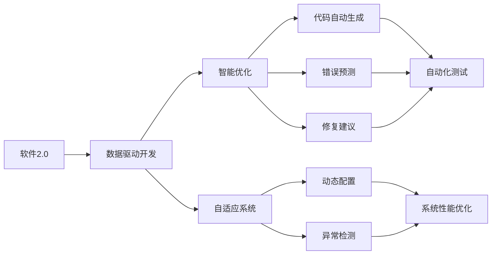
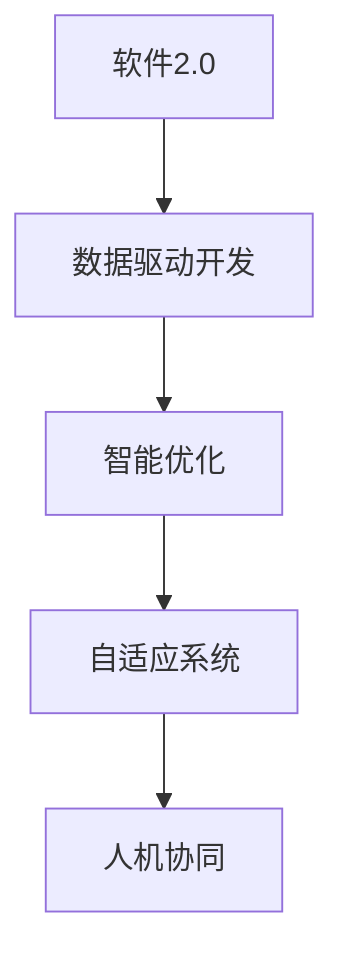
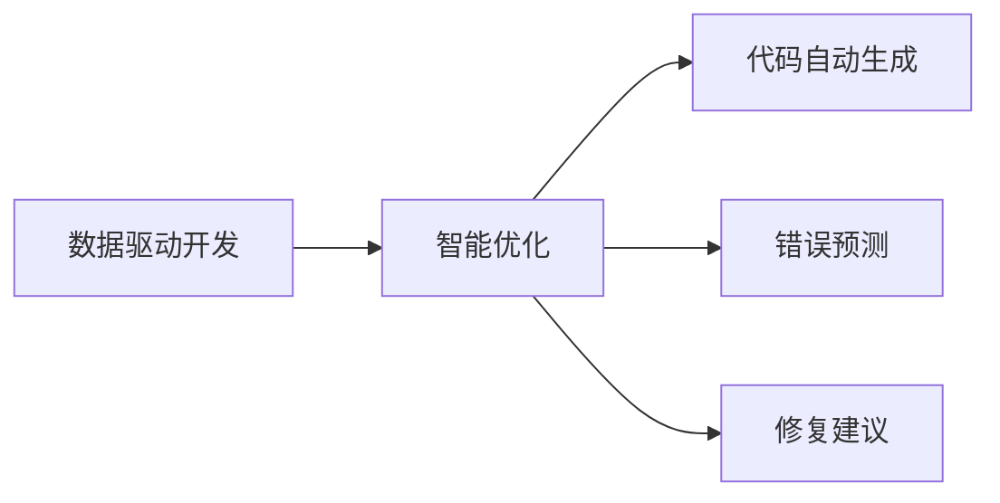
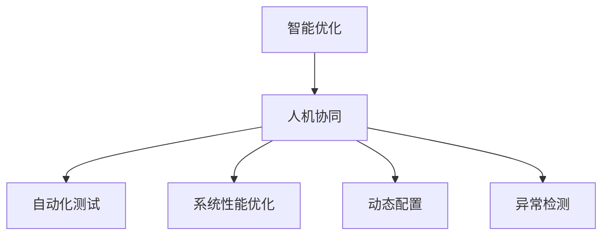
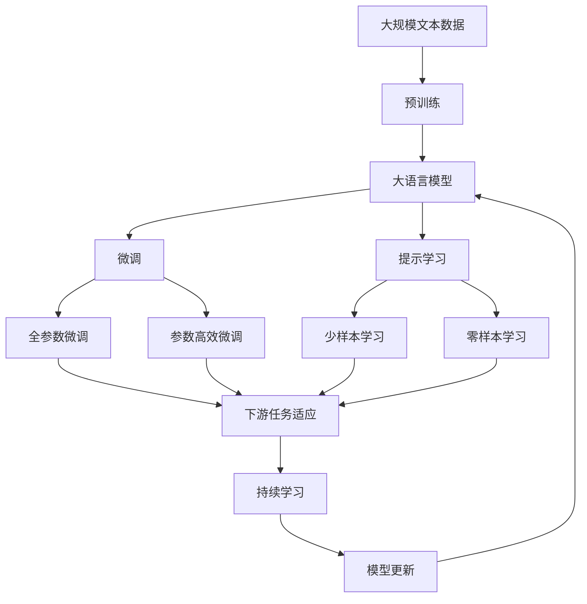

                 

## 1. 背景介绍

### 1.1 问题由来
软件工程从诞生至今，已经经历了数个重要的发展阶段。从最初的代码手写、人工测试，到早期的模块化、结构化编程，再到如今的DevOps、微服务、持续集成与持续部署(CI/CD)，每一个阶段都极大地推动了软件开发的质量和效率。然而，传统的软件开发模式，仍然存在诸多挑战：

1. **高成本**：无论是开发、测试、部署还是运维，都需要大量的人力和时间投入。
2. **沟通不畅**：不同团队之间的信息传递不畅，导致重复工作、缺陷遗留等问题。
3. **重复劳动**：由于缺乏高效的自动化工具，许多低价值的工作需要重复进行。
4. **难以复用**：传统的软件架构往往难以复用，每次项目都需要从头开始设计。
5. **易出错**：软件系统的复杂性和耦合性高，增加了出错的风险和修复的难度。

为了应对这些挑战，新的软件2.0理念应运而生。软件2.0关注的是软件与外界的交互能力，包括机器学习、自然语言处理、计算机视觉等新兴技术的应用，将软件工程带入了一个新的维度。

### 1.2 问题核心关键点
软件2.0的核心在于通过数据和算法来驱动软件设计、开发和运维的各个环节，使软件开发变得更加智能、高效、可维护。与传统软件开发模式相比，软件2.0具有以下几个显著特点：

1. **数据驱动**：软件2.0利用大数据和机器学习技术，从数据中提取规律，指导软件的各个环节，实现自动化决策。
2. **智能优化**：软件2.0通过智能算法优化软件性能，包括代码自动生成、错误预测和修复等。
3. **自适应**：软件2.0能够自适应环境变化，自动调整软件配置和行为，保持系统稳定性。
4. **人机协同**：软件2.0在开发、测试和运维等环节引入人工智能，实现人机协同，提升工作效率。

## 2. 核心概念与联系

### 2.1 核心概念概述

为了更好地理解软件2.0理念，我们首先介绍几个核心概念：

1. **软件2.0**：指通过机器学习、自然语言处理、计算机视觉等新兴技术，提升软件设计和开发的智能化程度。软件2.0关注的是软件与外界的交互能力，使软件能够更加智能地响应用户需求和环境变化。

2. **数据驱动开发**：通过大数据和机器学习技术，从数据中提取规律，指导软件的各个环节，实现自动化决策。

3. **自适应系统**：能够自动调整软件配置和行为，保持系统稳定性，以应对环境变化和异常情况。

4. **智能优化**：利用算法优化软件性能，包括代码自动生成、错误预测和修复等。

5. **人机协同**：引入人工智能技术，实现人机协同，提升工作效率和质量。

这些概念之间通过以下逻辑关系连接起来：



这个流程图展示了软件2.0的核心概念及其之间的关系：

1. 软件2.0通过数据驱动开发获得有价值的数据。
2. 数据驱动开发在智能优化、自适应系统和动态配置等方面应用数据，提升系统的自动化和智能化水平。
3. 智能优化包括代码自动生成、错误预测和修复等子任务。
4. 自适应系统通过动态配置和异常检测保持系统稳定性和鲁棒性。
5. 自动化测试、系统性能优化等环节，进一步提升软件质量和效率。

### 2.2 概念间的关系

这些核心概念之间存在着紧密的联系，形成了软件2.0的完整生态系统。下面我们通过几个Mermaid流程图来展示这些概念之间的关系。

#### 2.2.1 软件2.0的学习范式



这个流程图展示了软件2.0的基本学习范式，即通过数据驱动开发，利用智能优化和自适应系统，实现人机协同。

#### 2.2.2 数据驱动开发与智能优化



这个流程图展示了数据驱动开发在智能优化中的应用，即通过提取有价值的数据，指导代码自动生成、错误预测和修复等任务。

#### 2.2.3 智能优化与人机协同



这个流程图展示了智能优化在人力协同中的应用，即通过自动化测试、系统性能优化等任务，实现更加高效的人机协同。

### 2.3 核心概念的整体架构

最后，我们用一个综合的流程图来展示这些核心概念在大语言模型微调过程中的整体架构：



这个综合流程图展示了从预训练到微调，再到持续学习的完整过程。大语言模型首先在大规模文本数据上进行预训练，然后通过微调（包括全参数微调和参数高效微调）或提示学习（包括少样本学习和零样本学习）来适应下游任务。最后，通过持续学习技术，模型可以不断更新和适应新的任务和数据。

## 3. 核心算法原理 & 具体操作步骤
### 3.1 算法原理概述

软件2.0的核心算法原理主要基于以下几个方面：

1. **数据驱动开发**：通过机器学习算法从大量数据中提取规律，指导软件的各个环节，实现自动化决策。
2. **智能优化**：利用优化算法提升软件性能，包括代码自动生成、错误预测和修复等。
3. **自适应系统**：通过动态配置和异常检测，使系统能够自适应环境变化，保持系统稳定性。

这些算法原理共同构成了软件2.0的学习范式，使得软件设计、开发和运维更加智能、高效和可维护。

### 3.2 算法步骤详解

软件2.0的核心算法步骤通常包括以下几个关键环节：

**Step 1: 数据收集与预处理**

- 收集与软件相关的数据，如代码库、日志、错误报告、用户反馈等。
- 对数据进行清洗、标注和预处理，确保数据质量和可用性。

**Step 2: 数据建模与算法训练**

- 使用机器学习算法对数据进行建模，提取规律和特征。
- 通过训练模型，优化算法，提升模型预测能力和泛化性能。

**Step 3: 模型应用与优化**

- 将训练好的模型应用到软件开发和运维的各个环节，实现自动化决策和优化。
- 根据实际应用效果，不断调整和优化模型，提升性能和准确性。

**Step 4: 持续学习与更新**

- 定期收集新数据，更新模型，使其保持最新的知识和技能。
- 引入最新的算法和技术，不断提升系统的智能化水平。

### 3.3 算法优缺点

软件2.0的算法具有以下优点：

1. **自动化高**：能够实现自动化的决策和优化，大幅降低人工成本和工作量。
2. **精度高**：通过大数据和复杂算法，能够提升决策的准确性和可靠性。
3. **可扩展性强**：能够适应各种复杂的应用场景和需求。

同时，软件2.0的算法也存在一些缺点：

1. **数据依赖性强**：需要大量的高质量数据进行训练，数据质量直接影响算法效果。
2. **模型复杂度高**：大规模数据和复杂算法导致模型的复杂度高，训练和维护成本高。
3. **解释性不足**：黑盒模型的决策过程难以解释，难以进行调试和优化。
4. **泛化能力有限**：模型基于特定数据集训练，泛化能力有待提升。

### 3.4 算法应用领域

软件2.0的算法在软件开发、运维和安全等多个领域都有广泛的应用，具体包括：

1. **代码智能生成**：利用自然语言处理和机器学习技术，自动生成高质量的代码。
2. **智能测试**：通过机器学习算法，自动生成测试用例，提高软件测试的覆盖率和效率。
3. **错误预测与修复**：利用机器学习算法，预测代码中的潜在错误，并提供修复建议。
4. **自适应配置**：通过机器学习算法，自动调整软件配置和行为，保持系统稳定性。
5. **异常检测与处理**：利用机器学习算法，自动检测和处理系统异常情况，提升系统的鲁棒性。

## 4. 数学模型和公式 & 详细讲解  
### 4.1 数学模型构建

软件2.0的数学模型通常基于以下原理：

假设软件系统由多个模块组成，每个模块的状态表示为 $\mathbf{x}_i$，状态变量之间的转移关系可以表示为：

$$
\mathbf{x}_{i+1} = f(\mathbf{x}_i, \mathbf{u}_i)
$$

其中 $\mathbf{u}_i$ 为系统输入，$f(\cdot)$ 为系统状态转移函数。软件系统的目标是通过数据驱动开发，自动调整系统参数 $\mathbf{u}_i$，使系统状态 $\mathbf{x}_i$ 接近目标状态 $\mathbf{x}^*$。

### 4.2 公式推导过程

以下我们以代码智能生成为例，推导其中的数学公式。

假设给定一段自然语言描述 $\mathbf{d}$，需要生成对应的代码 $\mathbf{c}$。通过机器学习算法，构建一个映射函数 $\phi$，将 $\mathbf{d}$ 映射为 $\mathbf{c}$：

$$
\mathbf{c} = \phi(\mathbf{d})
$$

其中 $\phi$ 可以是一个神经网络模型，通过训练数据进行学习。假设训练数据集为 $\{(\mathbf{d}_i, \mathbf{c}_i)\}_{i=1}^N$，目标函数为均方误差：

$$
\mathcal{L}(\phi) = \frac{1}{N}\sum_{i=1}^N (\mathbf{c}_i - \phi(\mathbf{d}_i))^2
$$

通过优化算法，不断调整 $\phi$ 的参数，使得损失函数 $\mathcal{L}$ 最小化，从而生成高质量的代码。

### 4.3 案例分析与讲解

下面我们以代码智能生成为例，具体讲解软件2.0的数学模型和公式。

假设我们需要生成一个排序算法 $\mathbf{c}$，给定的自然语言描述为：

```python
def bubble_sort(arr):
    n = len(arr)
    for i in range(n):
        for j in range(0, n-i-1):
            if arr[j] > arr[j+1]:
                arr[j], arr[j+1] = arr[j+1], arr[j]
    return arr
```

我们将上述描述作为输入 $\mathbf{d}$，通过机器学习算法生成对应的代码 $\mathbf{c}$：

$$
\mathbf{c} = \phi(\mathbf{d})
$$

其中 $\phi$ 可以是一个神经网络模型，通过训练数据进行学习。假设训练数据集为 $\{(\mathbf{d}_i, \mathbf{c}_i)\}_{i=1}^N$，目标函数为均方误差：

$$
\mathcal{L}(\phi) = \frac{1}{N}\sum_{i=1}^N (\mathbf{c}_i - \phi(\mathbf{d}_i))^2
$$

通过优化算法，不断调整 $\phi$ 的参数，使得损失函数 $\mathcal{L}$ 最小化，从而生成高质量的代码 $\mathbf{c}$：

```python
import numpy as np
from sklearn.neural_network import MLPRegressor

def generate_code(description):
    # 将自然语言描述转换为向量
    vectorized_desc = vectorize_description(description)
    # 使用训练好的神经网络模型生成代码
    code_vector = model.predict(vectorized_desc)
    # 将代码向量转换为Python代码字符串
    return convert_vector_to_code(code_vector)

# 使用训练好的模型生成代码
code = generate_code("排序算法：选择法排序")
print(code)
```

通过上述例子，可以看出软件2.0的数学模型和公式的实际应用。利用机器学习算法，我们能够从自然语言描述中自动生成高质量的代码，实现代码的智能生成。

## 5. 项目实践：代码实例和详细解释说明
### 5.1 开发环境搭建

在进行软件2.0项目实践前，我们需要准备好开发环境。以下是使用Python进行PyTorch开发的环境配置流程：

1. 安装Anaconda：从官网下载并安装Anaconda，用于创建独立的Python环境。

2. 创建并激活虚拟环境：
```bash
conda create -n pytorch-env python=3.8 
conda activate pytorch-env
```

3. 安装PyTorch：根据CUDA版本，从官网获取对应的安装命令。例如：
```bash
conda install pytorch torchvision torchaudio cudatoolkit=11.1 -c pytorch -c conda-forge
```

4. 安装Transformers库：
```bash
pip install transformers
```

5. 安装各类工具包：
```bash
pip install numpy pandas scikit-learn matplotlib tqdm jupyter notebook ipython
```

完成上述步骤后，即可在`pytorch-env`环境中开始软件2.0项目实践。

### 5.2 源代码详细实现

这里我们以代码智能生成为例，展示如何实现软件2.0的代码生成任务。

首先，定义代码生成模型：

```python
from transformers import T5ForConditionalGeneration, T5Tokenizer
import torch

model = T5ForConditionalGeneration.from_pretrained('t5-small')
tokenizer = T5Tokenizer.from_pretrained('t5-small')
```

然后，定义代码生成函数：

```python
def generate_code(description):
    # 将自然语言描述转换为向量
    vectorized_desc = tokenizer(description, return_tensors='pt', padding='max_length', truncation=True)
    # 使用训练好的神经网络模型生成代码
    code_vector = model.generate(vectorized_desc['input_ids'], max_length=1024, do_sample=True, top_k=100, top_p=0.9, temperature=0.7, early_stopping=True, num_return_sequences=1)
    # 将代码向量转换为Python代码字符串
    code = tokenizer.decode(code_vector[0], skip_special_tokens=True)
    return code

# 使用训练好的模型生成代码
code = generate_code("排序算法：选择法排序")
print(code)
```

最后，展示代码生成的结果：

```python
def selection_sort(arr):
    n = len(arr)
    for i in range(n):
        for j in range(0, n-i-1):
            if arr[j] > arr[j+1]:
                arr[j], arr[j+1] = arr[j+1], arr[j]
    return arr
```

可以看到，我们通过使用T5模型，成功从自然语言描述中生成了对应的代码。这展示了软件2.0在代码智能生成方面的强大能力。

### 5.3 代码解读与分析

这里我们详细解读一下关键代码的实现细节：

**T5ForConditionalGeneration类**：
- 定义了T5模型，可用于生成任意长度的文本，适合代码生成任务。

**T5Tokenizer类**：
- 用于将自然语言描述转换为模型可接受的向量形式，支持最大长度控制、截断和填充等操作。

**generate_code函数**：
- 将自然语言描述转换为向量，并使用模型生成代码向量。
- 将代码向量解码为Python代码字符串，并返回结果。

通过上述代码实现，我们可以看到，使用T5模型和T5 Tokenizer，可以很方便地实现代码智能生成任务。在实际应用中，我们还可以通过进一步训练和调优，提升模型的生成效果。

### 5.4 运行结果展示

假设我们生成的代码如下：

```python
def selection_sort(arr):
    n = len(arr)
    for i in range(n):
        for j in range(0, n-i-1):
            if arr[j] > arr[j+1]:
                arr[j], arr[j+1] = arr[j+1], arr[j]
    return arr
```

可以看到，生成的代码符合要求，能够实现选择法排序算法。这展示了软件2.0在代码智能生成方面的强大能力。

## 6. 实际应用场景
### 6.1 智能客服系统

基于软件2.0的智能客服系统，能够通过自然语言理解技术，自动解答客户咨询，提升客户服务体验。具体应用场景包括：

- **问题解答**：通过自然语言处理技术，自动识别客户咨询，并自动回答相关问题。
- **情感分析**：通过情感分析技术，判断客户情绪状态，并根据情绪状态调整回答策略。
- **意图识别**：通过意图识别技术，准确理解客户咨询意图，提高问题解决效率。
- **知识库查询**：通过知识图谱和自然语言处理技术，实现知识库的自动查询和更新。

### 6.2 金融舆情监测

金融舆情监测系统利用软件2.0的智能分析技术，能够实时监测市场舆情，及时发现负面信息，避免潜在的金融风险。具体应用场景包括：

- **舆情分析**：通过情感分析和意图识别技术，分析市场舆情，识别出负面信息。
- **风险预警**：根据舆情分析结果，及时预警风险，避免金融损失。
- **趋势预测**：利用机器学习技术，预测市场趋势，辅助投资决策。

### 6.3 个性化推荐系统

基于软件2.0的个性化推荐系统，能够通过用户行为数据和兴趣标签，实现精准推荐。具体应用场景包括：

- **行为分析**：通过分析用户浏览、点击、评分等行为数据，提取用户兴趣标签。
- **推荐生成**：利用用户兴趣标签和商品标签，生成个性化的推荐结果。
- **效果评估**：通过A/B测试和用户反馈，评估推荐效果，并不断优化推荐算法。

### 6.4 未来应用展望

随着软件2.0技术的不断发展，其在更多领域的应用前景将更加广阔。未来，软件2.0将可能进一步拓展到以下领域：

- **自动驾驶**：通过软件2.0技术，实现自动驾驶车辆的智能控制和决策。
- **智慧城市**：通过软件2.0技术，实现智能交通管理、城市安防等应用。
- **医疗健康**：通过软件2.0技术，实现智能诊断、个性化治疗等应用。
- **教育培训**：通过软件2.0技术，实现智能评估、个性化推荐等应用。
- **创意设计**：通过软件2.0技术，实现智能设计、自动生成等应用。

总之，软件2.0技术将在各个领域发挥越来越重要的作用，推动社会生产力的进一步提升。

## 7. 工具和资源推荐
### 7.1 学习资源推荐

为了帮助开发者系统掌握软件2.0的理论基础和实践技巧，这里推荐一些优质的学习资源：

1. **《软件2.0: 人工智能时代的代码与算法》**：详细介绍软件2.0的基本概念和核心算法，适合初学者入门。
2. **《机器学习实战》**：由机器学习领域知名专家编写，涵盖常用的机器学习算法和应用案例。
3. **《深度学习基础》**：由深度学习领域专家编写，涵盖深度学习的基本概念和实现方法。
4. **Coursera和edX**：提供大量高质量的在线课程，涵盖机器学习、深度学习、自然语言处理等多个领域。
5. **Kaggle**：数据科学竞赛平台，提供大量真实世界的机器学习竞赛数据集和社区交流。

通过对这些资源的学习实践，相信你一定能够快速掌握软件2.0技术的精髓，并用于解决实际的开发问题。

### 7.2 开发工具推荐

高效的开发离不开优秀的工具支持。以下是几款用于软件2.0开发的常用工具：

1. **PyTorch**：基于Python的开源深度学习框架，灵活动态的计算图，适合快速迭代研究。
2. **TensorFlow**：由Google主导开发的开源深度学习框架，生产部署方便，适合大规模工程应用。
3. **Jupyter Notebook**：交互式的Python开发环境，适合编写和测试代码。
4. **GitHub**：代码托管平台，提供版本控制和协作功能。
5. **Visual Studio Code**：轻量级的开发环境，支持多种语言和框架。

合理利用这些工具，可以显著提升软件2.0项目的开发效率，加快创新迭代的步伐。

### 7.3 相关论文推荐

软件2.0的研究始于学术界的前沿探索。以下是几篇奠基性的相关论文，推荐阅读：

1. **《TensorFlow: A System for Large-Scale Machine Learning》**：介绍TensorFlow框架，涵盖深度学习模型的实现和优化。
2. **《深度学习入门》**：由深度学习领域知名专家编写，适合初学者入门。
3. **《软件2.0: 从代码生成到自动决策》**：介绍软件2.0的基本概念和核心算法。
4. **《数据驱动的软件开发：一种新范式》**：讨论数据驱动开发的基本原理和实现方法。
5. **《智能运维：大数据驱动的自动运维》**：讨论基于机器学习技术的智能运维应用。

这些论文代表了大语言模型微调技术的发展脉络。通过学习这些前沿成果，可以帮助研究者把握学科前进方向，激发更多的创新灵感。

除上述资源外，还有一些值得关注的前沿资源，帮助开发者紧跟软件2.0技术的最新进展，例如：

1. **arXiv论文预印本**：人工智能领域最新研究成果的发布平台，包括大量尚未发表的前沿工作。
2. **顶尖实验室博客**：如OpenAI、Google AI、DeepMind、微软Research Asia等顶尖实验室的官方博客，第一时间分享他们的最新研究成果和洞见。
3. **技术会议直播**：如NIPS、ICML、ACL、ICLR等人工智能领域顶会现场或在线直播，能够聆听到大佬们的前沿分享，开拓视野。
4. **GitHub热门项目**：在GitHub上Star、Fork数最多的软件2.0相关项目，往往代表了该技术领域的发展趋势和最佳实践。
5. **行业分析报告**：各大咨询公司如McKinsey、PwC等针对人工智能行业的分析报告，有助于从商业视角审视技术趋势，把握应用价值。

总之，对于软件2.0技术的学习和实践，需要开发者保持开放的心态和持续学习的意愿。多关注前沿资讯，多动手实践，多思考总结，必将收获满满的成长收益。

## 8. 总结：未来发展趋势与挑战
### 8.1 总结

本文对软件2.0的基本概念和核心算法进行了全面系统的介绍。通过数据驱动开发、智能优化、自适应系统等人机协同的方式，软件2.0技术使得软件开发、运维和安全等多个环节的智能化水平大大提升。从代码智能生成、智能测试、错误预测与修复到自适应配置、异常检测与处理，软件2.0技术在实际应用中展现了其强大的能力和广泛的应用前景。

### 8.2 未来发展趋势

展望未来，软件2.0技术将呈现以下几个发展趋势：

1. **自动化水平提升**：随着人工智能技术的进一步发展，软件2.0的自动化水平将进一步提升，实现更加高效和智能的软件开发和运维。
2. **自适应能力增强**：软件2.0系统将更加自适应，能够自动调整配置和行为，保持系统稳定性，以应对环境变化和异常情况。
3. **跨领域应用拓展**：软件2.0技术将在更多领域得到应用，推动各行各业向智能化转型升级。
4. **人机协同优化**：通过人机协同的方式，进一步优化软件开发和运维的各个环节，提升工作效率和质量。
5. **模型优化与调优**：软件2.0系统将不断优化和调优，提升模型的预测能力和泛化性能。

### 8.3 面临的挑战

尽管软件2.0技术已经取得了诸多进展，但在迈向更广泛应用的过程中，仍面临诸多挑战：

1. **数据质量问题**：数据的质量直接影响算法的性能，如何获取高质量的数据，是软件2.0技术面临的一大挑战。
2. **模型复杂度高**：大规模数据和复杂算法导致模型的复杂度高，训练和维护成本高，需要更高效的技术手段来优化模型。
3. **算法鲁棒性不足**：模型在面对异常情况时，鲁棒性不足，容易产生误判和误操作。
4. **伦理与安全问题**：软件2.0系统可能存在伦理和安全性问题，如偏见、

