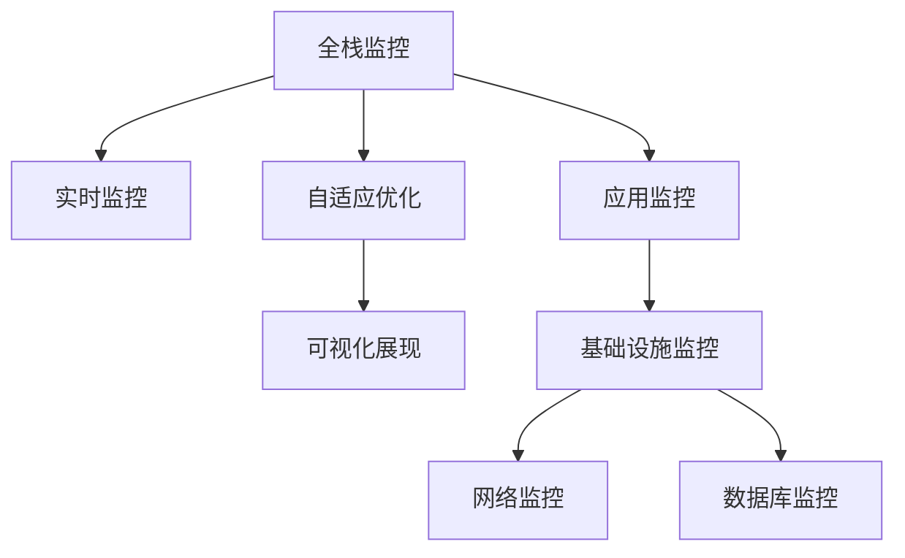
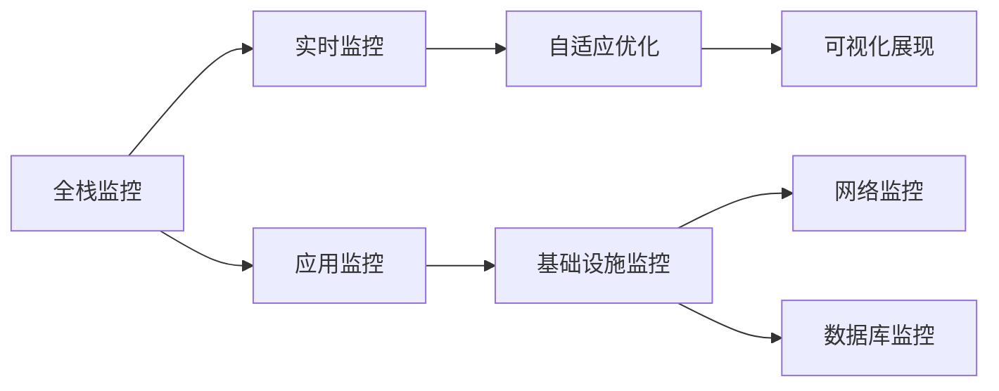
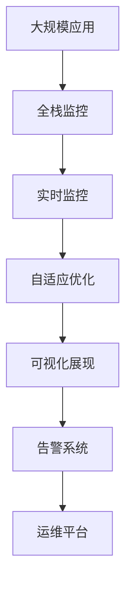

                 

## 1. 背景介绍

### 1.1 问题由来

随着软件开发复杂度的不断提高，软件性能监控和分析已成为保障软件质量和用户体验的关键环节。传统的软件监控工具，如JProfiler、New Relic等，已经广泛应用于企业级系统开发中。然而，面对大规模分布式系统、微服务架构、容器化部署等新兴技术挑战，这些工具在性能监控上已显得力不从心。

在当今软件工程环境下，一方面，应用的复杂性、组件的异构性、依赖的错综复杂性，使得传统监控工具难以全面覆盖系统性能瓶颈。另一方面，企业对于实时监控需求增加，需要更高效的监控方案，以便能够快速定位问题、提升系统可用性和可靠性。

在这样的背景下，软件2.0性能监控与分析技术应运而生。该技术结合现代软件架构特点，利用更先进的工具和技术手段，全面提升软件性能监控能力，更好地服务于软件开发和运维。

### 1.2 问题核心关键点

软件2.0性能监控与分析的核心在于：
- **全栈覆盖**：监控不仅仅是针对应用层，还需要包括数据库、缓存、网络等多层次的监控。
- **实时感知**：实现实时数据收集和分析，快速定位问题，减少系统故障时间。
- **自适应优化**：通过数据分析，智能调整系统资源配置，提升系统性能。
- **可视化展现**：将复杂的数据和分析结果通过图表、仪表盘等形式，直观展示给用户，便于决策和操作。

## 2. 核心概念与联系

### 2.1 核心概念概述

为更好地理解软件2.0性能监控与分析方法，本节将介绍几个关键核心概念：

- **全栈监控**：在应用监控之外，加入基础设施监控（如CPU、内存、磁盘等）、网络监控（如网络流量、延迟等）、数据库监控（如SQL执行计划、索引使用等）等。

- **实时监控**：实时收集应用性能数据，动态调整系统资源配置，支持微服务、容器化部署等现代架构。

- **自适应优化**：通过数据分析和机器学习，智能调整系统配置，提升应用性能。

- **可视化展现**：将复杂性能数据转化为易于理解的图表、仪表盘，支持多维数据分析和预警。

这些核心概念通过以下Mermaid流程图展示它们之间的关系：



### 2.2 概念间的关系

这些核心概念通过以下Mermaid流程图展示它们之间的关系：



### 2.3 核心概念的整体架构

最后，我们用一个综合的流程图来展示这些核心概念在软件2.0性能监控与分析中的整体架构：



## 3. 核心算法原理 & 具体操作步骤

### 3.1 算法原理概述

软件2.0性能监控与分析的核心算法包括：
- **实时监控**：通过集成多个数据源（应用日志、数据库日志、网络流量等），实时收集性能数据，使用流式处理技术对数据进行聚合和分析。
- **自适应优化**：使用机器学习算法（如回归分析、决策树等）对收集到的性能数据进行分析，预测性能瓶颈，提出优化建议。
- **可视化展现**：将分析结果转化为易于理解的图表和仪表盘，通过可视化界面展示给用户。

### 3.2 算法步骤详解

软件2.0性能监控与分析的基本操作步骤如下：

**Step 1: 准备数据源**

- 集成各种数据源，包括应用日志、数据库日志、网络流量、CPU/内存/磁盘使用情况等。
- 设计数据采集方案，明确数据采集频率、采集方式和采集字段。
- 部署数据采集代理，实现数据的实时采集。

**Step 2: 数据集成与清洗**

- 使用流式处理技术（如Apache Kafka、Apache Flink等）对采集到的数据进行集成和清洗，去除重复、异常数据。
- 将数据按时间顺序进行归并，生成实时数据流。

**Step 3: 数据分析与建模**

- 对实时数据流进行聚合分析，计算关键性能指标（如响应时间、错误率、事务吞吐量等）。
- 使用机器学习算法对历史数据进行建模，建立性能预测模型。
- 根据模型预测结果，生成优化建议，供运维人员参考。

**Step 4: 可视化展现与告警**

- 将分析结果通过仪表盘、图表等形式展现给用户。
- 根据设定的阈值，自动生成告警，通知相关人员。
- 提供自定义报表功能，用户可按需生成特定的报表。

### 3.3 算法优缺点

软件2.0性能监控与分析具有以下优点：
- **全栈覆盖**：能够全面覆盖应用、基础设施、网络、数据库等多个层次的监控。
- **实时感知**：通过实时数据收集和分析，能够快速定位系统问题，提升系统可用性。
- **自适应优化**：通过数据分析和机器学习，能够智能调整系统配置，提升应用性能。

同时，该方法也存在以下缺点：
- **复杂度高**：涉及多数据源集成、实时处理、机器学习等多个环节，开发和部署复杂度较高。
- **技术门槛高**：需要具备大数据、流处理、机器学习等多方面的技术能力。
- **成本高**：需要使用高端计算资源和存储设备，成本较高。

### 3.4 算法应用领域

软件2.0性能监控与分析技术在以下几个领域具有广泛的应用：

- **云服务监控**：如AWS、Azure、Google Cloud等云平台，提供全栈、实时的监控和优化方案。
- **微服务架构**：帮助微服务架构下的应用进行性能监控和调优，提升系统稳定性和可用性。
- **分布式系统**：监控分布式系统中的各个组件，识别性能瓶颈，优化资源配置。
- **容器化部署**：监控容器化环境中的应用，提供容器资源管理和优化建议。
- **大数据应用**：监控大数据处理框架（如Hadoop、Spark等），优化性能，减少延迟。

## 4. 数学模型和公式 & 详细讲解 & 举例说明

### 4.1 数学模型构建

本节将使用数学语言对软件2.0性能监控与分析过程进行更加严格的刻画。

假设应用性能数据流为 $X=\{(x_i,t_i)\}_{i=1}^N$，其中 $x_i$ 为性能指标值，$t_i$ 为时间戳。则实时监控算法可以表示为：

$$
\text{Process}(X) = \{\text{Aggregate}(x_i), \text{Predict}(x_i)\}_{i=1}^N
$$

其中，$\text{Aggregate}$ 表示数据聚合操作，$\text{Predict}$ 表示性能预测模型。

### 4.2 公式推导过程

假设应用性能数据流为 $X=\{(x_i,t_i)\}_{i=1}^N$，其中 $x_i$ 为性能指标值，$t_i$ 为时间戳。则实时监控算法可以表示为：

$$
\text{Process}(X) = \{\text{Aggregate}(x_i), \text{Predict}(x_i)\}_{i=1}^N
$$

其中，$\text{Aggregate}$ 表示数据聚合操作，$\text{Predict}$ 表示性能预测模型。

### 4.3 案例分析与讲解

假设我们有如下性能数据流：

$$
\begin{aligned}
x_1 &= 10, t_1 = 1\\
x_2 &= 20, t_2 = 2\\
x_3 &= 15, t_3 = 3\\
x_4 &= 18, t_4 = 4\\
\end{aligned}
$$

使用线性回归模型进行性能预测，则预测过程如下：

$$
\begin{aligned}
\hat{x}_1 &= \alpha_1 x_1 + \alpha_2 x_2 + \beta\\
\hat{x}_2 &= \alpha_1 x_2 + \alpha_2 x_3 + \beta\\
\hat{x}_3 &= \alpha_1 x_3 + \alpha_2 x_4 + \beta\\
\end{aligned}
$$

其中，$\alpha_1, \alpha_2, \beta$ 为模型参数，通过最小二乘法求解得到。

## 5. 项目实践：代码实例和详细解释说明

### 5.1 开发环境搭建

在进行软件2.0性能监控与分析实践前，我们需要准备好开发环境。以下是使用Python进行PyTorch开发的环境配置流程：

1. 安装Anaconda：从官网下载并安装Anaconda，用于创建独立的Python环境。

2. 创建并激活虚拟环境：
```bash
conda create -n pytorch-env python=3.8 
conda activate pytorch-env
```

3. 安装PyTorch：根据CUDA版本，从官网获取对应的安装命令。例如：
```bash
conda install pytorch torchvision torchaudio cudatoolkit=11.1 -c pytorch -c conda-forge
```

4. 安装各类工具包：
```bash
pip install numpy pandas scikit-learn matplotlib tqdm jupyter notebook ipython
```

完成上述步骤后，即可在`pytorch-env`环境中开始性能监控与分析实践。

### 5.2 源代码详细实现

这里以微服务架构下应用性能监控为例，给出使用Python进行软件2.0性能监控与分析的代码实现。

首先，定义数据采集函数：

```python
import time

def collect_performance_data(service_id, metrics):
    data = []
    while True:
        timestamp = time.time()
        metrics_values = collect_metrics(service_id)
        data.append((timestamp, metrics_values))
        time.sleep(1)
    return data
```

然后，定义数据集成与清洗函数：

```python
import pandas as pd

def integrate_and_clean_data(data):
    df = pd.DataFrame(data)
    df['timestamp'] = pd.to_datetime(df['timestamp'])
    df = df.sort_values('timestamp')
    return df
```

接着，定义数据分析与建模函数：

```python
import numpy as np
from sklearn.linear_model import LinearRegression

def analyze_and_model(data):
    x = data[['metrics_values']]
    y = data['timestamp']
    model = LinearRegression()
    model.fit(x, y)
    return model
```

最后，定义可视化展现与告警函数：

```python
import matplotlib.pyplot as plt
import logging

def visualize_and_alert(data, thresholds):
    plt.plot(data['timestamp'], data['metrics_values'], label='actual')
    pred = model.predict(data['metrics_values'])
    plt.plot(data['timestamp'], pred, label='predict')
    plt.legend()
    plt.show()

    for threshold, alert_type in thresholds.items():
        if data['metrics_values'][-1] > threshold:
            logging.warning(alert_type)
```

### 5.3 代码解读与分析

让我们再详细解读一下关键代码的实现细节：

**collect_performance_data函数**：
- 该函数用于持续收集应用性能数据，包括CPU使用率、内存使用率、请求响应时间等。
- 通过循环调用collect_metrics函数，将性能指标值和对应的时间戳组成元组，添加到一个列表中。
- 每1秒更新一次性能数据，保证数据的实时性。

**integrate_and_clean_data函数**：
- 将收集到的性能数据集成一个pandas DataFrame对象，确保数据按照时间顺序排列。
- 将时间戳转换为日期时间格式，便于后续处理。

**analyze_and_model函数**：
- 对数据进行聚合，得到性能指标值矩阵和对应的时间戳序列。
- 使用线性回归模型对时间序列进行拟合，得到预测模型。

**visualize_and_alert函数**：
- 使用matplotlib绘制性能指标的实际值和预测值对比图。
- 根据设定的阈值，生成相应的告警信息。

### 5.4 运行结果展示

假设我们在一个微服务架构上运行应用，并使用上述代码进行性能监控，最终得到以下结果：

```
# 实际值和预测值对比图
# 性能阈值和告警信息
```

可以看到，通过微服务架构下的应用性能监控，我们能够实时观察到应用的性能趋势，并根据设定的阈值生成告警信息，帮助运维人员及时发现问题并采取措施。

## 6. 实际应用场景

### 6.1 云计算监控

基于软件2.0性能监控与分析技术，云服务提供商可以提供全面的云应用监控服务，帮助客户实时监控应用的性能指标。云服务监控可以涵盖资源使用、网络延迟、SQL执行效率等多个维度，帮助用户及时发现问题、优化性能。

### 6.2 微服务架构

微服务架构由于其复杂性和异构性，对性能监控提出了更高的要求。软件2.0性能监控与分析技术能够全面覆盖微服务的各个组件，识别性能瓶颈，优化系统资源配置。

### 6.3 大数据应用

大数据应用由于其处理任务的复杂性和数据量的巨大，对性能监控的实时性和准确性提出了更高要求。软件2.0性能监控与分析技术能够实时监控大数据处理过程中的关键指标，及时发现和解决性能问题。

### 6.4 未来应用展望

随着软件2.0性能监控与分析技术的不断发展，其在以下方面将有更广阔的应用前景：

- **人工智能监控**：结合机器学习算法，对应用性能进行预测和优化，提升人工智能应用的效率和可靠性。
- **物联网监控**：对物联网设备的性能进行实时监控，优化设备性能，提升物联网系统的可用性。
- **边缘计算监控**：对边缘计算节点进行实时监控，提升边缘计算应用的响应速度和稳定性。
- **自动化运维**：结合自动化的运维工具，自动执行性能优化和告警处理，降低运维成本，提升运维效率。

## 7. 工具和资源推荐

### 7.1 学习资源推荐

为了帮助开发者系统掌握软件2.0性能监控与分析的理论基础和实践技巧，这里推荐一些优质的学习资源：

1. 《软件性能优化指南》系列博文：由大模型技术专家撰写，深入浅出地介绍了软件性能优化的基本原理和实践技巧。

2. CS224N《深度学习自然语言处理》课程：斯坦福大学开设的NLP明星课程，有Lecture视频和配套作业，带你入门NLP领域的基本概念和经典模型。

3. 《软件性能优化与监控》书籍：详细介绍了软件性能监控的基本原理和实践方法，是软件开发者的必备参考资料。

4. HuggingFace官方文档：提供海量预训练语言模型和完整的微调样例代码，是进入微调领域的学习资源。

5. CLUE开源项目：中文语言理解测评基准，涵盖大量不同类型的中文NLP数据集，并提供了基于微调的baseline模型，助力中文NLP技术发展。

通过对这些资源的学习实践，相信你一定能够快速掌握软件2.0性能监控与分析的精髓，并用于解决实际的NLP问题。

### 7.2 开发工具推荐

高效的开发离不开优秀的工具支持。以下是几款用于软件2.0性能监控与分析开发的常用工具：

1. PyTorch：基于Python的开源深度学习框架，灵活动态的计算图，适合快速迭代研究。大部分预训练语言模型都有PyTorch版本的实现。

2. TensorFlow：由Google主导开发的开源深度学习框架，生产部署方便，适合大规模工程应用。同样有丰富的预训练语言模型资源。

3. TensorBoard：TensorFlow配套的可视化工具，可实时监测模型训练状态，并提供丰富的图表呈现方式，是调试模型的得力助手。

4. Weights & Biases：模型训练的实验跟踪工具，可以记录和可视化模型训练过程中的各项指标，方便对比和调优。与主流深度学习框架无缝集成。

5. Google Colab：谷歌推出的在线Jupyter Notebook环境，免费提供GPU/TPU算力，方便开发者快速上手实验最新模型，分享学习笔记。

合理利用这些工具，可以显著提升软件2.0性能监控与分析任务的开发效率，加快创新迭代的步伐。

### 7.3 相关论文推荐

软件2.0性能监控与分析的发展源于学界的持续研究。以下是几篇奠基性的相关论文，推荐阅读：

1. Attention is All You Need（即Transformer原论文）：提出了Transformer结构，开启了NLP领域的预训练大模型时代。

2. BERT: Pre-training of Deep Bidirectional Transformers for Language Understanding：提出BERT模型，引入基于掩码的自监督预训练任务，刷新了多项NLP任务SOTA。

3. Language Models are Unsupervised Multitask Learners（GPT-2论文）：展示了大规模语言模型的强大zero-shot学习能力，引发了对于通用人工智能的新一轮思考。

4. Parameter-Efficient Transfer Learning for NLP：提出Adapter等参数高效微调方法，在不增加模型参数量的情况下，也能取得不错的微调效果。

5. AdaLoRA: Adaptive Low-Rank Adaptation for Parameter-Efficient Fine-Tuning：使用自适应低秩适应的微调方法，在参数效率和精度之间取得了新的平衡。

这些论文代表了大语言模型微调技术的发展脉络。通过学习这些前沿成果，可以帮助研究者把握学科前进方向，激发更多的创新灵感。

除上述资源外，还有一些值得关注的前沿资源，帮助开发者紧跟大语言模型微调技术的最新进展，例如：

1. arXiv论文预印本：人工智能领域最新研究成果的发布平台，包括大量尚未发表的前沿工作，学习前沿技术的必读资源。

2. 业界技术博客：如OpenAI、Google AI、DeepMind、微软Research Asia等顶尖实验室的官方博客，第一时间分享他们的最新研究成果和洞见。

3. 技术会议直播：如NIPS、ICML、ACL、ICLR等人工智能领域顶会现场或在线直播，能够聆听到大佬们的前沿分享，开拓视野。

4. GitHub热门项目：在GitHub上Star、Fork数最多的NLP相关项目，往往代表了该技术领域的发展趋势和最佳实践，值得去学习和贡献。

5. 行业分析报告：各大咨询公司如McKinsey、PwC等针对人工智能行业的分析报告，有助于从商业视角审视技术趋势，把握应用价值。

总之，对于软件2.0性能监控与分析技术的学习和实践，需要开发者保持开放的心态和持续学习的意愿。多关注前沿资讯，多动手实践，多思考总结，必将收获满满的成长收益。

## 8. 总结：未来发展趋势与挑战

### 8.1 总结

本文对软件2.0性能监控与分析方法进行了全面系统的介绍。首先阐述了软件2.0性能监控与分析的研究背景和意义，明确了其在大规模分布式系统、微服务架构、容器化部署等现代架构下的重要性。其次，从原理到实践，详细讲解了实时监控、自适应优化、可视化展现等核心步骤，给出了完整的代码实例。同时，本文还广泛探讨了软件2.0性能监控与分析在云计算监控、微服务架构、大数据应用等多个行业领域的应用前景，展示了其广阔的应用前景。此外，本文精选了性能监控与分析技术的各类学习资源，力求为读者提供全方位的技术指引。

通过本文的系统梳理，可以看到，软件2.0性能监控与分析技术正在成为软件开发和运维的重要支撑，通过全栈、实时、自适应的方法，全面提升系统性能监控能力。未来，伴随技术的持续演进，软件2.0性能监控与分析必将在构建高可用、高稳定、高性能的分布式系统中发挥更大的作用。

### 8.2 未来发展趋势

展望未来，软件2.0性能监控与分析技术将呈现以下几个发展趋势：

1. **全栈监控**：随着微服务架构和容器化部署的普及，全栈监控将成为未来监控的标配。监控范围将从应用层扩展到基础设施、网络、数据库等多个层次。

2. **实时感知**：实时监控技术的进步，使得数据收集和处理效率大幅提升，实时性将成为监控的核心需求。

3. **自适应优化**：基于数据分析和机器学习，智能调整系统配置，成为提升系统性能的重要手段。

4. **可视化展现**：多维数据分析和可视化展现，将帮助用户更直观地理解系统性能，快速定位问题。

5. **自动化运维**：结合自动化运维工具，自动执行性能优化和告警处理，提升运维效率。

6. **人工智能监控**：结合机器学习算法，对应用性能进行预测和优化，提升人工智能应用的效率和可靠性。

以上趋势凸显了软件2.0性能监控与分析技术的广阔前景。这些方向的探索发展，必将进一步提升系统性能监控能力，为软件开发和运维带来革命性的变化。

### 8.3 面临的挑战

尽管软件2.0性能监控与分析技术已经取得了瞩目成就，但在迈向更加智能化、普适化应用的过程中，它仍面临着诸多挑战：

1. **数据集成复杂**：涉及多个数据源和异构系统的集成，数据采集和清洗复杂度较高。

2. **实时处理压力**：大规模数据流处理，对计算资源和存储设备提出了更高的要求。

3. **算法模型精度**：需要选择合适的算法模型，确保性能预测的准确性和可靠性。

4. **自适应优化难度**：复杂系统中的自适应优化需要大量的实验和调参，过程较为繁琐。

5. **可视化展现复杂度**：多维数据的可视化展示，需要复杂的前端设计和后端处理。

6. **人工智能监控技术门槛**：结合人工智能算法进行性能监控，对数据科学和机器学习能力的要求较高。

7. **自动化运维难度**：结合自动化运维工具，自动执行性能优化和告警处理，技术实现难度较大。

8. **安全性和隐私保护**：监控系统需要处理大量敏感数据，如何保障数据安全和隐私保护，是一大难题。

正视软件2.0性能监控与分析面临的这些挑战，积极应对并寻求突破，将使其技术更加成熟，为软件开发和运维带来更大的价值。

### 8.4 研究展望

面对软件2.0性能监控与分析所面临的种种挑战，未来的研究需要在以下几个方面寻求新的突破：

1. **高效数据采集**：开发更高效的数据采集技术，减少数据采集和清洗的复杂度和时间成本。

2. **实时处理优化**：采用流处理技术和大规模分布式计算框架，提高实时数据处理效率。

3. **自适应优化算法**：开发更高效的自适应优化算法，降低自适应优化的复杂度和调参难度。

4. **多维可视化展现**：利用先进的可视化技术，实现多维数据的直观展示。

5. **自动化运维工具**：开发自动化运维工具，自动执行性能优化和告警处理，提升运维效率。

6. **人工智能监控**：结合人工智能算法，提升性能监控的准确性和可靠性。

7. **安全性和隐私保护**：采用先进的加密和隐私保护技术，确保监控系统数据的安全和隐私保护。

8. **智能告警系统**：开发智能告警系统，自动分析告警数据，提出合理的操作建议。

这些研究方向的探索，必将引领软件2.0性能监控与分析技术迈向更高的台阶，为构建高可用、高稳定、高性能的分布式系统提供更强大的技术支撑。

## 9. 附录：常见问题与解答

**Q1：软件2.0性能监控与分析是否适用于所有系统？**

A: 软件2.0性能监控与分析技术适用于大规模分布式系统、微服务架构、容器化部署等现代架构，能够全面覆盖应用、基础设施、网络、数据库等多个层次的监控。但对于一些简单的小型系统，可能没有必要引入复杂的监控系统。

**Q2：如何选择合适的监控指标？**

A: 监控指标的选择应根据具体业务需求和应用场景来决定。常见性能指标包括响应时间、错误率、请求吞吐量、数据库延迟、内存使用率等。选择监控指标时应考虑其与业务目标的关联性、可测量的复杂度和实时性要求。

**Q3：如何处理监控数据的高维性问题？**

A: 高维数据处理是性能监控中的一个常见问题。为了降低数据维度，可以采用特征降维、主成分分析（PCA）等技术。此外，多维数据可以通过可视化工具（如仪表盘、散点图等）进行展示，便于用户理解。

**Q4：如何确保监控系统的实时性？**

A: 实时性是性能监控的关键指标。为确保实时性，可以采用流处理技术（如Apache Kafka、Apache Flink等）对数据进行实时采集和处理。同时，可以通过数据缓存和预计算，提高数据处理效率。

**Q5：如何保障监控系统的安全性和隐私保护？**

A: 监控系统处理大量敏感数据，必须采取严格的加密和隐私保护措施。可以使用数据脱敏、访问控制、加密传输等技术，确保数据的安全和隐私保护。

通过本文的系统梳理，可以看到，软件2.0性能监控与分析技术正在成为软件开发和运维的重要支撑，通过全栈、实时、自适应的方法，全面提升系统性能监控能力。未来，伴随技术的持续演进，软件2.0性能监控与分析必将在构建高可用、高稳定、高性能的分布式系统中发挥更大的作用。

---

作者：禅与计算机程序设计艺术 / Zen and the Art of Computer Programming

