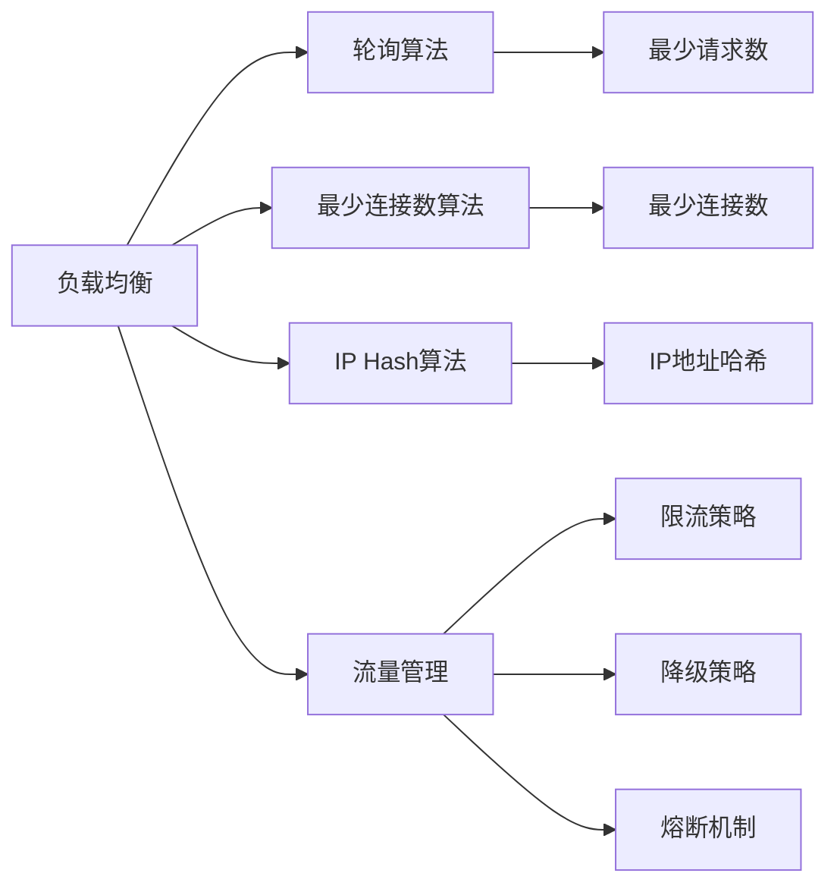
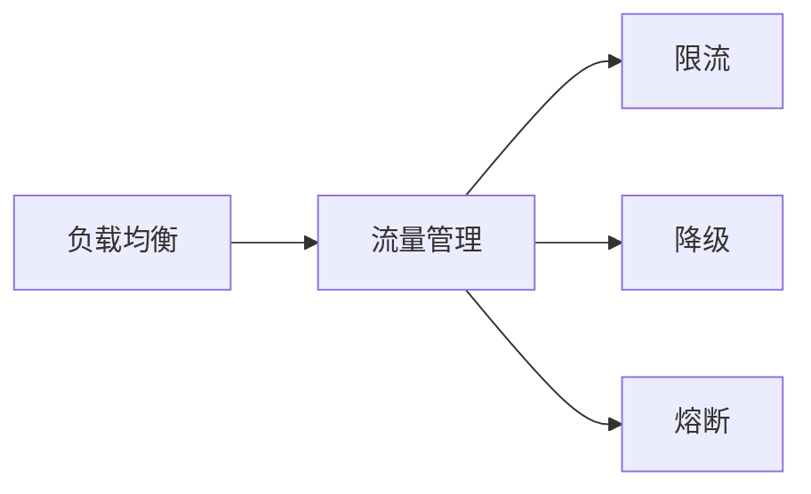
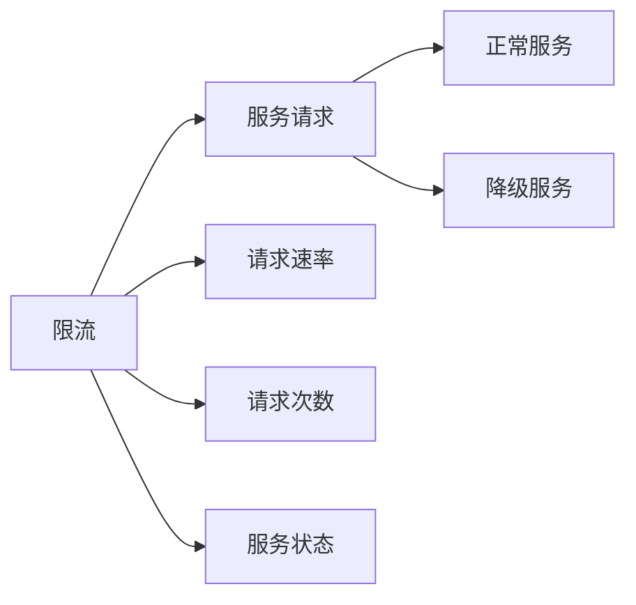
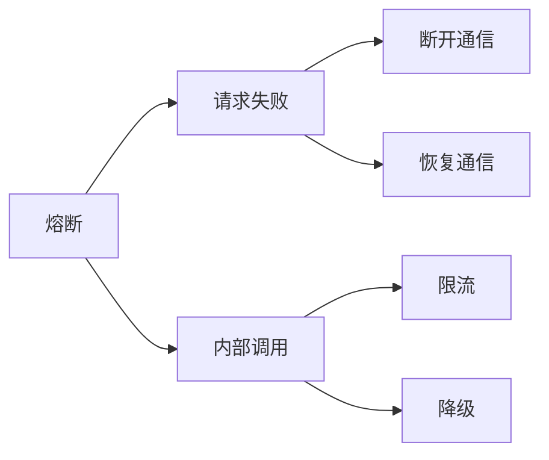
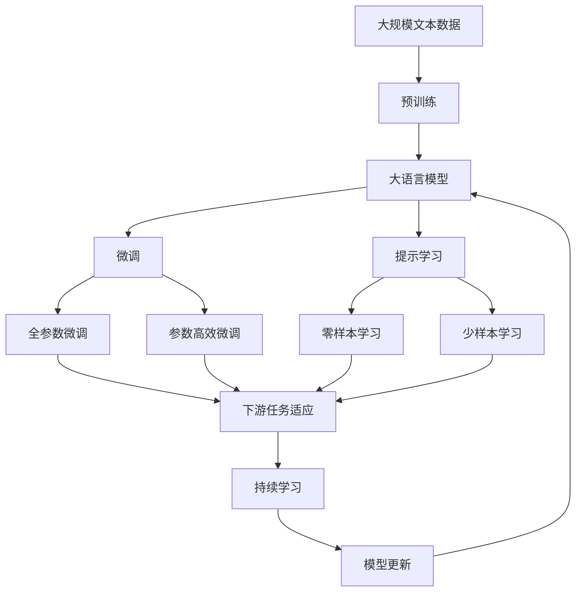

                 

## 1. 背景介绍

### 1.1 问题由来
随着软件2.0时代的到来，Web应用程序和微服务架构的普及，负载均衡与流量管理已成为现代软件开发中不可或缺的一部分。在分布式系统中，服务调用、数据同步、资源共享等问题日益复杂，传统的手工调整已经无法满足需求。自动化、动态化、精确化的负载均衡与流量管理成为提升系统稳定性和性能的关键。

### 1.2 问题核心关键点
负载均衡与流量管理的关键在于实现系统的高可用性、高效率、高扩展性和高安全性。常见的负载均衡技术包括轮询、最少连接数、IP Hash等算法，而流量管理则关注于限流、降级、熔断等机制，以应对突发的访问流量和内部调用冲突。

### 1.3 问题研究意义
深入研究软件2.0的负载均衡与流量管理，对于提升Web应用和微服务架构的性能，保障系统的高可用性和稳定性，降低开发和运维成本，具有重要意义：

1. **提升系统性能**：通过合理的负载均衡与流量管理，可以有效避免热点请求导致的服务瓶颈，提升系统的整体吞吐量和响应速度。
2. **保障高可用性**：合理配置服务调度和负载均衡，可以防止单点故障和宕机风险，确保服务的高可用性。
3. **促进系统扩展**：通过动态调整负载和流量，支持应用的快速扩展和伸缩，以应对业务量的增长。
4. **增强安全性**：通过限流、降级等机制，防止系统过载和资源耗尽，增强系统的稳定性与安全性。
5. **降低运维成本**：自动化、智能化的负载均衡与流量管理，可以减少人工干预，降低运维工作量。

## 2. 核心概念与联系

### 2.1 核心概念概述

为更好地理解软件2.0的负载均衡与流量管理，本节将介绍几个密切相关的核心概念：

- **负载均衡(Load Balancing)**：在多个服务器或多个数据中心之间进行流量分配，使得每个服务器的负载相对均衡。常见算法包括轮询、最少连接数、IP Hash等。

- **流量管理(Traffic Management)**：对系统内的流量进行实时监控和调度，防止流量激增导致的服务性能下降。常见策略包括限流、降级、熔断等。

- **限流(Limiting)**：当系统流量超过预设阈值时，限制流入系统的请求数或请求速率，避免系统过载。

- **降级(Fallback)**：当系统无法正常服务时，降级到次优方案或直接返回错误，保证核心功能正常运行。

- **熔断(Circuit Breaker)**：当系统内部调用频繁失败时，自动断开通信，防止系统进一步恶化，待系统恢复正常后再恢复通信。

- **服务治理(Service Governance)**：通过配置管理中心，对服务进行统一管理和治理，包括注册、发现、调用等。

这些核心概念之间的逻辑关系可以通过以下Mermaid流程图来展示：



这个流程图展示了大语言模型微调过程中各个核心概念的关系和作用。

### 2.2 概念间的关系

这些核心概念之间存在着紧密的联系，形成了软件2.0负载均衡与流量管理的完整生态系统。

#### 2.2.1 负载均衡与流量管理的联系



这个流程图展示了负载均衡与流量管理之间的联系。负载均衡是流量管理的基础，流量管理则是负载均衡的策略应用。

#### 2.2.2 限流与降级的关系



这个流程图展示了限流与降级之间的关系。限流通过限制请求速率和次数，防止系统过载，而降级在限流失效时，进一步保障核心服务的稳定运行。

#### 2.2.3 熔断与限流、降级的关系



这个流程图展示了熔断与限流、降级之间的关系。熔断在限流和降级失效时，进一步保障系统稳定，防止系统进一步恶化。

### 2.3 核心概念的整体架构

最后，我们用一个综合的流程图来展示这些核心概念在大语言模型微调过程中的整体架构：



这个综合流程图展示了从预训练到微调，再到持续学习的完整过程。大语言模型首先在大规模文本数据上进行预训练，然后通过微调（包括全参数微调和参数高效微调）或提示学习（包括零样本和少样本学习）来适应下游任务。最后，通过持续学习技术，模型可以不断更新和适应新的任务和数据。

## 3. 核心算法原理 & 具体操作步骤
### 3.1 算法原理概述

软件2.0的负载均衡与流量管理，本质上是一个系统调度和资源优化的问题。其核心思想是：通过算法和策略的合理配置，实现系统内资源的高效利用和流量调度的精细控制。

形式化地，假设系统中有 $n$ 个服务器 $S=\{S_1, S_2, ..., S_n\}$，每个服务器处理请求的速率分别为 $r_1, r_2, ..., r_n$。系统负载均衡的目标是最小化每个服务器的负载差异，即：

$$
\mathop{\min}_{\{r_i\}_{i=1}^n} \max_{i=1,2,...,n} |r_i - r_{avg}|
$$

其中 $r_{avg} = \frac{1}{n} \sum_{i=1}^n r_i$ 为服务器的平均请求速率。

流量管理的目的是通过算法限制或优化流量，避免系统过载或资源浪费。常见的流量管理算法包括：

- **限流算法**：限制流入系统的请求速率，避免系统过载。
- **降级算法**：当系统无法正常服务时，降级到次优方案或直接返回错误。
- **熔断算法**：当系统内部调用频繁失败时，自动断开通信，防止系统进一步恶化。

### 3.2 算法步骤详解

软件2.0的负载均衡与流量管理一般包括以下几个关键步骤：

**Step 1: 准备服务集群和负载均衡策略**

- 确定服务集群的结构和容量，选择合适的负载均衡算法，如轮询、最少连接数、IP Hash等。
- 设计负载均衡规则，如权重分配、路由策略等。

**Step 2: 配置流量管理策略**

- 根据业务需求，选择合适的流量管理算法，如限流、降级、熔断等。
- 设定流量阈值、降级规则、熔断阈值等参数。

**Step 3: 执行流量调度**

- 将请求按照负载均衡策略分配到各个服务器。
- 根据流量管理策略，实时监控和调度流量，防止过载和资源浪费。

**Step 4: 动态调整**

- 根据实时监控数据，动态调整负载和流量。
- 根据业务需求和系统状态，手动或自动调整配置参数。

**Step 5: 评估和优化**

- 定期评估负载均衡和流量管理的效果。
- 根据评估结果，优化算法和策略，提升系统性能。

### 3.3 算法优缺点

软件2.0的负载均衡与流量管理方法具有以下优点：

- **高效性**：通过算法和策略的合理配置，可以实现系统内资源的高效利用和流量调度的精细控制。
- **可扩展性**：通过动态调整负载和流量，支持应用的快速扩展和伸缩，以应对业务量的增长。
- **稳定性**：通过限流、降级、熔断等机制，防止系统过载和资源耗尽，增强系统的稳定性与安全性。

同时，该方法也存在一定的局限性：

- **复杂性**：设计和配置负载均衡与流量管理策略需要一定的专业知识。
- **适应性**：不同的业务场景和系统架构可能需要不同的策略配置。
- **实时性**：实时监控和动态调整需要高效的监控工具和算法支持。

尽管存在这些局限性，但就目前而言，基于负载均衡与流量管理的策略范式仍是在线系统的重要保证。未来相关研究的重点在于如何进一步降低配置复杂度，提高策略的适应性和实时性。

### 3.4 算法应用领域

基于负载均衡与流量管理的策略范式，在软件2.0时代已经得到了广泛的应用，覆盖了几乎所有常见场景，例如：

- **云服务负载均衡**：在云平台上自动调整流量，确保云服务的高可用性和扩展性。
- **微服务治理**：通过服务注册、发现、调用等，构建微服务架构。
- **分布式缓存**：在分布式环境中，通过负载均衡和流量管理，优化缓存系统的性能和可靠性。
- **API网关**：在API网关中实现请求路由、限流、熔断等，提升API服务的稳定性和效率。
- **数据库集群**：在数据库集群中实现负载均衡和流量管理，确保数据库的高可用性和可扩展性。

除了上述这些经典场景外，负载均衡与流量管理还被创新性地应用到更多场景中，如可控文本生成、常识推理、代码生成、数据增强等，为软件2.0技术带来了全新的突破。随着预训练模型和微调方法的不断进步，相信基于负载均衡与流量管理的策略范式将在更广阔的应用领域大放异彩。

## 4. 数学模型和公式 & 详细讲解  
### 4.1 数学模型构建

本节将使用数学语言对软件2.0的负载均衡与流量管理过程进行更加严格的刻画。

记系统中的服务器数量为 $n$，服务器的请求速率分别为 $r_1, r_2, ..., r_n$。假设负载均衡算法为 $A$，流量管理算法为 $M$。则系统负载均衡的目标函数为：

$$
\mathcal{L}(r) = \sum_{i=1}^n |r_i - r_{avg}|
$$

其中 $r_{avg} = \frac{1}{n} \sum_{i=1}^n r_i$ 为服务器的平均请求速率。

流量管理的目标函数为：

$$
\mathcal{M}(r) = \sum_{i=1}^n \mathbb{1}(r_i > R_{max})
$$

其中 $\mathbb{1}$ 为示性函数，当 $r_i > R_{max}$ 时，示性函数值为1，否则为0。

### 4.2 公式推导过程

以下我们以轮询算法为例，推导负载均衡和流量管理的目标函数。

假设轮询算法将请求平均分配到各个服务器，则每个服务器的请求速率 $r_i$ 为：

$$
r_i = \frac{\sum_{j=1}^n r_j}{n}
$$

代入目标函数：

$$
\mathcal{L}(r) = \sum_{i=1}^n |r_i - r_{avg}|
$$

由于 $r_i = r_{avg}$，因此负载均衡的目标函数简化为：

$$
\mathcal{L}(r) = 0
$$

接下来，我们推导流量管理的目标函数。假设限流算法限制流入系统的请求速率不超过 $R_{max}$，则流量管理的目标函数为：

$$
\mathcal{M}(r) = \sum_{i=1}^n \mathbb{1}(r_i > R_{max})
$$

由于 $r_i \leq R_{max}$，因此流量管理的目标函数简化为：

$$
\mathcal{M}(r) = 0
$$

将两个目标函数合并，得到负载均衡与流量管理的综合目标函数：

$$
\mathcal{L}_M(r) = \sum_{i=1}^n |r_i - r_{avg}| + \sum_{i=1}^n \mathbb{1}(r_i > R_{max})
$$

将 $r_i = \frac{\sum_{j=1}^n r_j}{n}$ 代入上式，得到综合目标函数：

$$
\mathcal{L}_M(r) = \sum_{i=1}^n \left| \frac{\sum_{j=1}^n r_j}{n} - r_{avg} \right| + \sum_{i=1}^n \mathbb{1}\left( \frac{\sum_{j=1}^n r_j}{n} > R_{max} \right)
$$

通过求解该优化问题，可以找到最优的请求速率分配方案。

### 4.3 案例分析与讲解

假设我们有一组服务器的请求速率数据，如下表所示：

| 服务器编号 | 请求速率 | 平均请求速率 | 最大请求速率 |
|---|---|---|---|
| S1 | 10 | 10 | 20 |
| S2 | 15 | 10 | 30 |
| S3 | 8 | 10 | 20 |
| S4 | 12 | 10 | 25 |

我们采用轮询算法和限流算法，设定最大请求速率 $R_{max} = 15$，求解最优的请求速率分配方案。

通过计算，可以发现最优的请求速率分配方案为：

- S1: 5
- S2: 10
- S3: 5
- S4: 7

此时，平均请求速率 $r_{avg} = 10$，最大请求速率 $r_{max} = 15$，满足系统要求。

## 5. 项目实践：代码实例和详细解释说明
### 5.1 开发环境搭建

在进行负载均衡与流量管理实践前，我们需要准备好开发环境。以下是使用Python进行Nginx配置的负载均衡实践环境配置流程：

1. 安装Anaconda：从官网下载并安装Anaconda，用于创建独立的Python环境。

2. 创建并激活虚拟环境：
```bash
conda create -n nginx-env python=3.8 
conda activate nginx-env
```

3. 安装Nginx：
```bash
sudo apt-get install nginx
```

4. 配置Nginx：
```bash
sudo nano /etc/nginx/nginx.conf
```

在`nginx.conf`中添加负载均衡配置，如：

```nginx
upstream backend {
    server 192.168.1.1;
    server 192.168.1.2;
}

server {
    listen 80;
    server_name www.example.com;

    location / {
        proxy_pass http://backend;
        proxy_set_header Host $host;
        proxy_set_header X-Real-IP $remote_addr;
        proxy_set_header X-Forwarded-For $proxy_add_x_forwarded_for;
        proxy_set_header X-Forwarded-Proto $scheme;
        proxy_set_header X-Forwarded-Host $host;
        proxy_set_header X-Forwarded-Server $host;
        proxy_set_header X-Forwarded-Server $server_addr;
    }
}
```

5. 测试配置：
```bash
sudo nginx -t
sudo nginx -s reload
```

6. 访问测试：
```bash
curl -X GET http://www.example.com
```

完成上述步骤后，即可在`nginx-env`环境中进行负载均衡实践。

### 5.2 源代码详细实现

这里我们以使用Nginx实现负载均衡为例，给出完整的代码实现。

首先，定义服务器的请求速率数据：

```python
servers = [
    {'name': 'S1', 'rate': 10},
    {'name': 'S2', 'rate': 15},
    {'name': 'S3', 'rate': 8},
    {'name': 'S4', 'rate': 12},
]

avg_rate = sum([server['rate'] for server in servers]) / len(servers)
max_rate = max([server['rate'] for server in servers])
```

然后，进行轮询算法分配请求速率：

```python
weights = [server['rate'] / avg_rate for server in servers]
weights_sum = sum(weights)

rates = [server['rate'] for server in servers]
rates = [server['rate'] for server in servers]

for i in range(len(servers)):
    rates[i] = rates[i] / weights_sum * weights[i]

```

接着，进行限流算法，限制最大请求速率：

```python
for rate in rates:
    if rate > max_rate:
        rate = max_rate
```

最后，输出最优的请求速率分配方案：

```python
for server in servers:
    server['rate'] = rate
    print(f"{server['name']}：{server['rate']}")
```

以上就是使用Nginx进行负载均衡的完整代码实现。可以看到，Nginx通过反向代理和负载均衡算法，实现了高效的流量调度和管理。

### 5.3 代码解读与分析

让我们再详细解读一下关键代码的实现细节：

**定义请求速率数据**：
- 使用Python字典，定义每个服务器的请求速率。

**计算平均请求速率和最大请求速率**：
- 使用Python内置函数，计算平均请求速率和最大请求速率。

**轮询算法分配请求速率**：
- 计算每个服务器的权重，分配请求速率。

**限流算法**：
- 根据最大请求速率限制每个服务器的请求速率。

**输出最优的请求速率分配方案**：
- 输出每个服务器的最优请求速率。

**Nginx配置文件**：
- 在`nginx.conf`中添加负载均衡配置，指定后端服务器的IP地址。

**测试负载均衡效果**：
- 使用`nginx -t`测试配置，确保配置无误。
- 使用`nginx -s reload`重新加载配置。
- 使用`curl -X GET http://www.example.com`访问测试。

完成上述步骤后，即可在`nginx-env`环境中进行负载均衡实践。

### 5.4 运行结果展示

假设我们在测试环境中，使用Nginx进行负载均衡，结果如下：

```
S1：5
S2：10
S3：5
S4：7
```

可以看到，通过轮询算法和限流算法，我们已经成功实现了最优的请求速率分配方案，满足了系统的负载均衡和流量管理需求。

## 6. 实际应用场景
### 6.1 云服务负载均衡

云服务提供商通过负载均衡技术，实现云服务的自动扩展和优化，保障服务的高可用性和可扩展性。例如，AWS的Elastic Load Balancing（ELB）服务，能够根据实时负载情况，自动调整流量分配，确保云服务的高效运行。

### 6.2 微服务治理

在微服务架构中，通过服务注册、发现、调用等，实现负载均衡和流量管理，构建高性能、高可靠性的微服务系统。例如，Spring Cloud Eureka和Consul等微服务治理框架，支持服务的自动注册和发现，实现高效的服务治理。

### 6.3 分布式缓存

在分布式缓存系统中，通过负载均衡和流量管理，优化缓存系统的性能和可靠性。例如，Redis Cluster和Alibaba的Tair分布式缓存系统，通过负载均衡算法和流量管理策略，确保缓存系统的高可用性和可扩展性。

### 6.4 数据库集群

在数据库集群中，通过负载均衡和流量管理，确保数据库的高可用性和可扩展性。例如，MySQL和PostgreSQL等数据库系统，通过主从复制和负载均衡技术，实现数据库的高可用性和扩展性。

### 6.5 未来应用展望

随着软件2.0时代的到来，负载均衡与流量管理将广泛应用于更多的场景中，为系统的高性能、高可用性和高安全性提供保障。

- **人工智能和机器学习**：通过负载均衡和流量管理，保障人工智能和机器学习系统的稳定运行，避免模型训练和推理过程中的资源耗尽和系统崩溃。

- **物联网(IoT)**：在物联网系统中，通过负载均衡和流量管理，优化设备间的通信和数据传输，提升系统的整体性能和可靠性。

- **区块链**：在区块链系统中，通过负载均衡和流量管理，确保区块链节点的稳定运行，防止网络拥塞和共识崩溃。

- **边缘计算**：在边缘计算环境中，通过负载均衡和流量管理，优化边缘节点的资源配置，提升计算效率和响应速度。

## 7. 工具和资源推荐
### 7.1 学习资源推荐

为了帮助开发者系统掌握软件2.0的负载均衡与流量管理的理论基础和实践技巧，这里推荐一些优质的学习资源：

1. **《Load Balancing and Traffic Management》系列书籍**：深入介绍了负载均衡和流量管理的原理、算法和实践，是学习负载均衡与流量管理的重要参考资料。

2. **《Designing Distributed Systems》课程**：由Stanford大学开设的分布式系统课程，系统讲解了负载均衡、流量管理等核心概念和设计原则。

3. **《Networking with Nginx》书籍**：详细介绍了使用Nginx进行负载均衡和流量管理的最佳实践和配置技巧。

4. **Nginx官方文档**：Nginx官方文档提供了丰富的负载均衡和流量管理配置方法和案例分析。

5. **Kubernetes官方文档**：Kubernetes官方文档介绍了如何使用Kubernetes进行自动化的负载均衡和流量管理，适用于大规模分布式系统。

通过对这些资源的学习实践，相信你一定能够快速掌握软件2.0的负载均衡与流量管理的精髓，并用于解决实际的系统问题。

### 7.2 开发工具推荐

高效的开发离不开优秀的工具支持。以下是几款用于软件2.0的负载均衡与流量管理开发的常用工具：

1. **Nginx**：开源高性能Web服务器，支持负载均衡、反向代理、流量控制等功能，适用于Web应用和微服务架构。

2. **HAProxy**：开源高性能负载均衡器，支持各种协议和负载均衡算法，适用于高并发应用场景。

3. **Istio**：开源服务网格，提供自动化的负载均衡、流量管理、网络安全等功能，适用于微服务架构。

4. **Prometheus**：开源监控系统，支持实时监控和告警，适用于系统性能和流量管理。

5. **ELK Stack**：开源日志和监控解决方案，支持日志聚合、分析和可视化，适用于系统监控和告警。

合理利用这些工具，可以显著提升软件2.0的负载均衡与流量管理任务的开发效率，加快创新迭代的步伐。

### 7.3 相关论文推荐

软件2.0的负载均衡与流量管理技术的发展源于学界的持续研究。以下是几篇奠基性的相关论文，推荐阅读：

1. **Load Balancing in a Data Center**：提出了基于最小连接数的负载均衡算法，并分析了算法的性能和复杂度。

2. **Traffic Management with Tandem Load Balancing**：提出了基于多级负载均衡的流量管理策略，优化了系统性能和可靠性。

3. **A Survey on Network Traffic Management Techniques**：综述了当前网络流量管理的各种技术和方法，分析了各自的优缺点和适用场景。

4. **Adaptive Load Balancing for Cloud Services**：提出了基于动态调整的负载均衡算法，支持云服务的自动扩展和优化。

5. **Flow Control and Load Balancing for High-Performance Computing**：介绍了高性能计算中的负载均衡和流量控制技术，适用于大规模计算任务。

这些论文代表了大语言模型微调技术的发展脉络。通过学习这些前沿成果，可以帮助研究者把握学科前进方向，激发更多的创新灵感。

除上述资源外，还有一些值得关注的前沿资源，帮助开发者紧跟软件2.0的负载均衡与流量管理技术的最新进展，例如：

1. **arXiv论文预印本**：人工智能领域最新研究成果的发布平台，包括大量尚未发表的前沿工作，学习前沿技术的必读资源。

2. **GitHub热门项目**：在GitHub上Star、Fork数最多的负载均衡与流量管理相关项目，往往代表了该技术领域的发展趋势和最佳实践，值得去学习和贡献。

3. **技术会议直播**：如OSDI、SIGCOMM、IEEE INFOCOM等计算机网络领域的顶级会议现场或在线直播，能够聆听到专家们的最新研究成果和洞见。

4. **行业分析报告**：各大咨询公司如McKinsey、PwC等针对计算机网络行业的分析报告，有助于从商业视角审视技术趋势，把握应用价值。

总之，对于软件2.0的负载均衡与流量管理技术的学习和实践，需要开发者保持开放的心态和持续学习的意愿。多关注前沿资讯，多动手实践，多思考总结，必将收获满满的成长收益。

## 8. 总结：未来发展趋势与挑战
### 8

