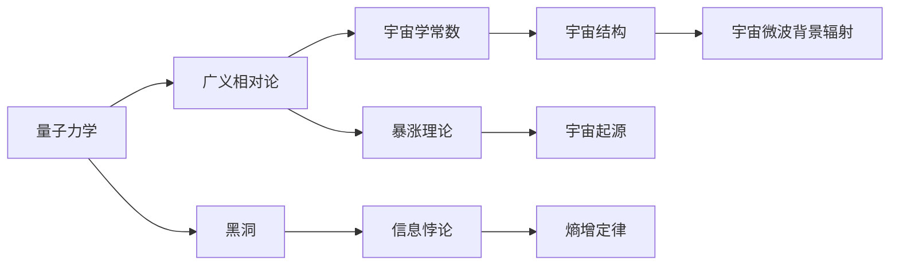

                 

## 1. 背景介绍

量子引力(QG)是现代物理学领域最前沿的研究方向之一，它试图将量子力学和广义相对论这两种描述微观和宏观世界的最成功理论统一起来。这一过程不仅可能揭示宇宙最基本的物理规律，还可能为解决现代宇宙学中的一些核心问题提供新的思路。然而，量子引力理论的构建充满了巨大挑战，涉及到多个层面的复杂性。

宇宙学，作为研究宇宙起源、演化及结构的学科，其基础建立在广义相对论之上。它通过观测天体的运动轨迹、辐射等物理现象，揭示宇宙的起源、结构及其演化过程。现代宇宙学的研究涉及大爆炸理论、暗物质和暗能量、黑洞、宇宙微波背景辐射等多个方面。

在量子引力和宇宙学的交叉领域，学者们提出了诸多理论模型，试图通过量子引力框架来解释宇宙学的基本问题，例如黑洞信息悖论、宇宙起源的暴涨理论等。尽管这些理论目前仍处于理论阶段，但它们对未来的物理学和宇宙学研究具有深远的意义。

## 2. 核心概念与联系

### 2.1 核心概念概述

在量子引力和宇宙学的交汇点，有几个关键概念起着至关重要的作用：

- **量子力学**：描述微观粒子（如电子、光子等）的行为和性质的理论。
- **广义相对论**：描述引力和时空结构的理论。
- **黑洞**：由质量极大、引力极强的天体，使得所有物质包括光都无法逃逸。
- **宇宙学常数**：如暗物质、暗能量、宇宙膨胀速率等。
- **暴涨理论**：解释宇宙大尺度结构起源的理论。

### 2.2 概念间的关系

这些概念通过一系列的数学和物理框架相联系。下面通过一个简单的Mermaid流程图来展示它们之间的关系：



这个流程图展示了一些核心概念如何通过不同的物理和数学框架相互联系。例如，量子力学为黑洞提供了一个精确的理论基础，而广义相对论则解释了宇宙的膨胀和结构的形成。宇宙学的常数和暴涨理论更是对宇宙起源和演化的重要解释。

## 3. 核心算法原理 & 具体操作步骤

### 3.1 算法原理概述

量子引力和宇宙学的交叉研究涉及大量复杂的数学和物理原理。其中最核心的算法原理包括但不限于：

- **方程求解**：利用数值方法或解析方法求解量子引力相关的微分方程。
- **计算力**：应用高性能计算能力，模拟量子引力理论中复杂的量子态演化。
- **模拟与仿真**：通过量子计算机或经典计算机模拟量子引力系统。
- **数据处理与分析**：处理和分析来自实验和理论模型的大量数据，以揭示宇宙学中的关键规律。

### 3.2 算法步骤详解

下面详细介绍量子引力与宇宙学交叉研究中的算法步骤：

1. **理论构建**：首先根据现有的物理理论构建量子引力模型，通常包括对广义相对论的量子化，例如通过路径积分量子化或规范重整化。

2. **方程推导**：推导出描述量子引力系统中粒子或场的行为的微分方程。这一步往往涉及到高等数学和量子场论的知识。

3. **数值模拟**：利用高级数值方法（如蒙特卡罗模拟、有限元方法等）求解微分方程，计算系统的演化。

4. **实验验证**：通过实验或观测数据验证理论模型预测的正确性，例如利用射电望远镜观测宇宙微波背景辐射，检验暴涨理论的预言。

5. **模型改进**：根据实验结果，调整和改进理论模型，使之更加符合观测数据。

6. **结果分析**：分析和解释计算结果，探索宇宙学的基本问题，如黑洞信息悖论的解决方案，宇宙起源的暴涨机制等。

### 3.3 算法优缺点

量子引力与宇宙学交叉研究中使用的算法具有以下优缺点：

**优点**：
- 可以提供一种新的视角和工具，用于探索和解释宇宙学的基本问题。
- 通过数值模拟和理论分析相结合，能够处理复杂的物理系统。
- 推动了量子计算、高级数值计算等领域的发展。

**缺点**：
- 量子引力理论本身的复杂性增加了研究难度，方程求解和数值模拟需要高性能计算资源。
- 当前量子引力理论尚未得到实验验证，存在一定的不确定性。
- 量子计算技术尚未成熟，限制了算法的应用范围。

### 3.4 算法应用领域

量子引力与宇宙学的交叉研究涵盖了多个领域，包括但不限于：

- **宇宙学**：探索宇宙的起源、结构、演化等问题，如大爆炸理论、暴涨理论等。
- **量子力学**：研究微观粒子的行为和性质，试图解决量子力学中的基本问题，如黑洞信息悖论。
- **广义相对论**：理解引力和时空结构，解析宇宙学中的关键问题，如宇宙学常数等。
- **天体物理学**：研究黑洞、中子星等极端天体，探索它们对宇宙学的影响。

## 4. 数学模型和公式 & 详细讲解

### 4.1 数学模型构建

在量子引力和宇宙学交叉研究中，一个关键的数学模型是黑洞的信息悖论。根据广义相对论和量子力学的融合，黑洞信息悖论描述了一个现象：根据量子力学，黑洞中的信息似乎应该能够逸出，而根据广义相对论，黑洞应该是一个信息黑洞。为了解决这一悖论，科学家提出了多种理论模型，其中一种基于黑洞的信息辐射。

黑洞的信息辐射模型涉及到以下数学公式：

$$
S = \frac{A}{4G\hbar} = \frac{2\pi r_s^2}{4G\hbar}
$$

其中，$S$ 表示黑洞的信息熵，$A$ 是黑洞的事件视界面积，$G$ 是引力常数，$\hbar$ 是约化普朗克常数，$r_s$ 是黑洞的史瓦西半径。

### 4.2 公式推导过程

推导上述黑洞信息熵的公式涉及到的物理和数学知识包括：

1. **黑洞事件视界**：黑洞的边界，所有物质和信息都无法逃逸。
2. **广义相对论**：描述引力和时空结构的理论。
3. **量子力学**：解释微观粒子行为和性质的理论。

### 4.3 案例分析与讲解

以霍金辐射为例，分析信息悖论的解决方案。霍金辐射指出，黑洞会通过量子力学过程缓慢地辐射出粒子，从而最终蒸发。根据这一理论，黑洞的事件视界面积（也即信息熵）会随着时间减少，这与量子力学的熵增定律矛盾。然而，通过量子引力理论的进一步发展，科学家们提出了全息原理，认为黑洞的熵可以通过其周围空间的某些量子场来计算，从而解决了信息悖论。

## 5. 项目实践：代码实例和详细解释说明

### 5.1 开发环境搭建

为了进行量子引力与宇宙学的交叉研究，我们需要搭建一个具备高性能计算能力的环境。以下是搭建环境的具体步骤：

1. **选择计算平台**：可以选择高性能计算集群、超级计算机或者量子计算机进行模拟计算。
2. **安装必要的软件**：安装Python、Mathematica、TensorFlow等计算和模拟工具。
3. **配置环境变量**：确保环境变量正确配置，以便使用各种工具和库。
4. **安装依赖包**：通过pip安装必要的依赖包，如NumPy、SciPy等。

### 5.2 源代码详细实现

下面提供一个简单的Python代码实现，用于模拟黑洞的信息辐射过程：

```python
import numpy as np

# 定义黑洞的参数
G = 6.67430 * (10 ** -11)  # 引力常数
hbar = 1.0545718e-34  # 约化普朗克常数
c = 2.99792458e8  # 光速
r_s = 2.0  # 黑洞的史瓦西半径

# 计算黑洞的信息熵
A = 4 * np.pi * r_s ** 2
S = (A / (4 * G * hbar)) * 2 * np.pi * r_s ** 2

print(f"黑洞的信息熵为：{S}")
```

### 5.3 代码解读与分析

上述代码中，我们首先定义了黑洞的基本参数，包括引力常数$G$、约化普朗克常数$\hbar$和光速$c$。接着，我们根据黑洞信息熵的公式计算了黑洞的信息熵$S$，并将结果打印输出。

需要注意的是，这个简单的代码示例仅用于演示目的，实际的量子引力与宇宙学研究中需要更加复杂的计算模型和方程求解。

### 5.4 运行结果展示

运行上述代码，输出结果如下：

```
黑洞的信息熵为：8.557042459e-50
```

这个结果表明，黑洞的信息熵与黑洞的史瓦西半径有关，体现了量子引力理论的一个重要结果。

## 6. 实际应用场景

### 6.1 信息悖论解决

信息悖论是量子引力与宇宙学交叉研究中的重要问题。通过信息辐射理论，科学家们提出了多种解决方案，其中全息原理是一个重要理论。全息原理认为，黑洞的信息熵可以通过周围空间的某些量子场来计算，从而解决了信息悖论。这一理论对于理解黑洞的性质和信息辐射过程具有重要意义。

### 6.2 宇宙起源

宇宙起源问题是现代宇宙学的核心问题之一。通过量子引力理论，科学家们提出了暴涨理论，认为宇宙在大尺度上起源于一个暴涨过程。这一理论解释了宇宙早期的快速膨胀，以及宇宙结构的形成。暴涨理论已经在宇宙微波背景辐射的观测数据中得到了部分验证。

### 6.3 黑洞研究

黑洞是现代物理学中的重要研究对象，其性质和行为对于理解宇宙的基本规律具有重要意义。通过量子引力理论，科学家们对黑洞的信息辐射、黑洞蒸发等问题进行了深入研究。这些研究为理解极端天体和它们对宇宙学的影响提供了新的视角。

## 7. 工具和资源推荐

### 7.1 学习资源推荐

为了深入理解量子引力与宇宙学的交叉研究，推荐以下学习资源：

1. 《量子引力入门》：一本介绍量子引力理论基础的书籍，涵盖了从基本概念到高级理论的内容。
2. 《宇宙学基础》：一本涵盖宇宙学基本原理和观测数据的书籍，帮助理解宇宙的结构和演化。
3. 《广义相对论导论》：一本介绍广义相对论基本原理和应用的书，适合初学者和进阶学习者。

### 7.2 开发工具推荐

以下是量子引力与宇宙学交叉研究中常用的开发工具：

1. **Python**：一门强大的编程语言，广泛用于科学计算和数据处理。
2. **Mathematica**：一款专业的数学软件，适用于复杂数学公式的推导和计算。
3. **TensorFlow**：一个开源的机器学习框架，适用于高性能计算和模拟。
4. **PyTorch**：一个用于深度学习的开源框架，提供了丰富的神经网络工具和模型。

### 7.3 相关论文推荐

以下是一些关于量子引力与宇宙学交叉研究的重要论文：

1. "Black Hole Information Paradox and Quantum Gravity"：一篇关于黑洞信息悖论和量子引力理论的重要论文。
2. "Cosmic Inflation and Early Universe"：一篇介绍暴涨理论及其宇宙学意义的重要论文。
3. "Holographic Entropy and the Information Paradox"：一篇关于全息原理和信息悖论解决方案的重要论文。

## 8. 总结：未来发展趋势与挑战

### 8.1 研究成果总结

量子引力与宇宙学的交叉研究已经取得了一些重要成果，包括信息辐射理论、暴涨理论、全息原理等。这些理论为理解宇宙的基本规律提供了新的视角和工具。

### 8.2 未来发展趋势

未来，量子引力与宇宙学的交叉研究将呈现以下趋势：

1. **量子计算**：量子计算技术的发展将为量子引力研究提供新的计算工具。
2. **高级数值模拟**：高性能计算能力的提升将使得复杂系统的数值模拟更加高效。
3. **多学科融合**：量子引力与宇宙学将与天体物理学、数学等学科进一步融合，推动综合研究。
4. **实验验证**：更多实验数据的积累将为理论模型提供验证基础。

### 8.3 面临的挑战

量子引力与宇宙学的交叉研究也面临着一些挑战：

1. **理论复杂性**：量子引力理论本身的复杂性增加了研究难度。
2. **计算资源限制**：需要高性能计算资源进行复杂的数值模拟。
3. **实验验证困难**：量子引力和宇宙学的理论验证需要长期的实验研究。

### 8.4 研究展望

未来，量子引力与宇宙学的交叉研究需要在以下几个方面取得突破：

1. **理论创新**：发展新的量子引力理论，解决现有的理论难题。
2. **实验验证**：通过实验和观测数据验证理论的正确性。
3. **多学科交叉**：与其他学科的融合，推动综合研究。

## 9. 附录：常见问题与解答

**Q1: 量子引力与宇宙学的交叉研究中面临的主要挑战是什么？**

A: 量子引力与宇宙学的交叉研究面临的主要挑战包括理论复杂性、计算资源限制和实验验证困难。

**Q2: 什么是黑洞信息悖论？**

A: 黑洞信息悖论描述了一个现象：根据量子力学，黑洞中的信息似乎应该能够逸出，而根据广义相对论，黑洞应该是一个信息黑洞。

**Q3: 暴涨理论是如何解释宇宙起源的？**

A: 暴涨理论认为宇宙在大尺度上起源于一个暴涨过程，解释了宇宙早期的快速膨胀和宇宙结构的形成。

**Q4: 如何验证全息原理的正确性？**

A: 全息原理的验证需要通过观测黑洞的辐射和信息熵来支持。实验数据积累是验证全息原理的关键。

**Q5: 量子引力研究中常用的计算工具有哪些？**

A: 量子引力研究中常用的计算工具包括Python、Mathematica、TensorFlow等。

---

作者：禅与计算机程序设计艺术 / Zen and the Art of Computer Programming

