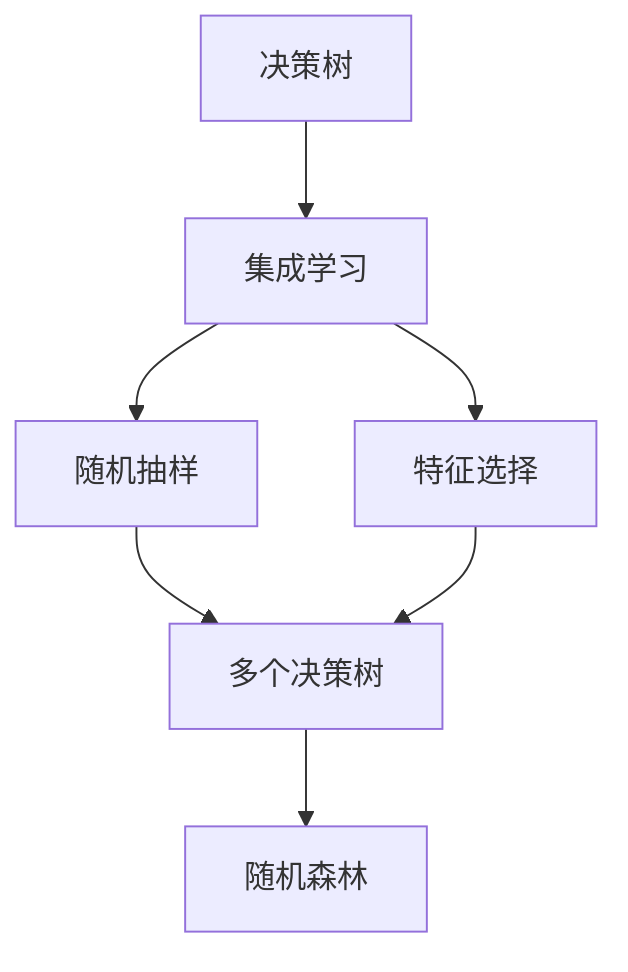

                 

# 随机森林 (Random Forest)

## 1. 背景介绍

### 1.1 问题由来
随机森林（Random Forest）是一种集成学习算法，通过组合多个决策树模型来解决分类和回归问题。它由李奥纳德·布雷瑞斯曼（Leonard Breiman）于2001年提出，广泛应用于数据挖掘、机器学习和统计分析等领域。在处理大规模数据集时，随机森林表现出色，因为它的算法复杂度较低，容易实现。

### 1.2 问题核心关键点
随机森林的核心思想是通过随机抽样和特征选择，构建多个决策树，并通过投票或平均值的方式集成这些决策树的预测结果。这种集成方法可以降低过拟合风险，提高模型的泛化能力和稳定性。

随机森林的主要优势包括：
1. **易实现**：算法简单，易于实现和理解。
2. **高效性**：处理大规模数据集时，速度较快，效率较高。
3. **泛化能力**：通过集成多个决策树，可以有效降低过拟合风险，提高泛化能力。
4. **可解释性**：每个决策树都是可解释的，可以帮助理解模型的决策过程。

### 1.3 问题研究意义
随机森林广泛应用于各种分类和回归任务，例如图像识别、金融预测、生物信息学等。它不仅能够提供准确的预测结果，还能够帮助分析数据中的潜在关系和模式。在数据科学和机器学习领域，随机森林成为一种不可或缺的工具，对于解决复杂问题具有重要意义。

## 2. 核心概念与联系

### 2.1 核心概念概述

为了更好地理解随机森林，我们需要介绍几个关键概念：

- **决策树（Decision Tree）**：一种树形结构的分类和回归模型，通过对数据集进行分裂，最终生成一系列的决策规则。
- **集成学习（Ensemble Learning）**：通过组合多个模型来解决单一模型可能存在的问题，如过拟合、泛化能力不足等。
- **随机抽样（Bootstrap Sampling）**：一种抽样技术，从原始数据集中随机抽取有放回的样本，生成多个数据子集。
- **特征选择（Feature Selection）**：从原始特征集合中选择一部分特征用于构建模型，提高模型的泛化能力和效率。

### 2.2 概念间的关系

这些核心概念之间的逻辑关系可以通过以下Mermaid流程图来展示：



这个流程图展示了几者之间的关系：

1. 决策树是集成学习的基础模型，通过组合多个决策树来构建随机森林。
2. 随机抽样是数据预处理的一部分，通过随机抽样生成多个数据子集。
3. 特征选择用于减少决策树的复杂度，提高泛化能力。
4. 随机森林是最终输出的模型，通过集成多个决策树的预测结果来提高模型的准确性和稳定性。

### 2.3 核心概念的整体架构

最后，我们用一个综合的流程图来展示这些核心概念在大数据处理中的整体架构：


这个综合流程图展示了从数据预处理到模型部署的完整过程。

## 3. 核心算法原理 & 具体操作步骤
### 3.1 算法原理概述

随机森林的核心算法原理基于决策树，通过集成学习来提高模型的准确性和稳定性。

算法流程包括：
1. **数据预处理**：对原始数据进行清洗、处理和标准化，生成用于训练的数据集。
2. **随机抽样**：从数据集中随机抽取有放回的样本，生成多个数据子集。
3. **特征选择**：从原始特征集合中选择一部分特征，用于构建决策树。
4. **决策树构建**：对每个数据子集构建决策树，使用特征选择技术来减少树的复杂度。
5. **模型集成**：通过投票或平均值的方式，集成多个决策树的预测结果，生成最终的随机森林模型。

### 3.2 算法步骤详解

具体来说，随机森林的构建步骤如下：

1. **数据预处理**：对原始数据进行清洗、处理和标准化，生成用于训练的数据集。

2. **随机抽样**：从数据集中随机抽取有放回的样本，生成多个数据子集。随机抽样过程如下：
   - 对于每个样本，生成一个介于0和1之间的随机数。
   - 如果随机数小于给定的采样比例（通常是0.5），则将该样本保留在样本集合中。
   - 重复上述过程，直到生成足够数量的数据子集。

3. **特征选择**：从原始特征集合中选择一部分特征，用于构建决策树。常用的特征选择方法包括信息增益、基尼指数、方差减少等。

4. **决策树构建**：对每个数据子集构建决策树，使用特征选择技术来减少树的复杂度。决策树的构建过程如下：
   - 选择最佳的特征进行分裂。
   - 根据特征值将数据分成多个子集。
   - 对每个子集递归地构建决策树。
   - 重复上述过程，直到满足停止条件（如叶子节点达到最大深度、样本数量达到最小值等）。

5. **模型集成**：通过投票或平均值的方式，集成多个决策树的预测结果，生成最终的随机森林模型。

### 3.3 算法优缺点

随机森林的主要优点包括：
1. **准确性高**：通过集成多个决策树，可以有效降低过拟合风险，提高泛化能力。
2. **鲁棒性好**：对噪声和异常值具有较好的鲁棒性。
3. **可解释性强**：每个决策树都是可解释的，可以帮助理解模型的决策过程。

然而，随机森林也存在一些缺点：
1. **计算复杂度高**：随机森林需要构建多个决策树，计算量较大。
2. **参数调优困难**：随机森林的参数较多，如树的数量、树的大小、特征选择方法等，需要经验和实验来调整。
3. **内存消耗大**：随机森林的内存消耗较大，需要较高的计算资源。

### 3.4 算法应用领域

随机森林广泛应用于各种分类和回归任务，例如：

- **金融预测**：预测股票价格、汇率变化等。
- **医疗诊断**：预测疾病发生率、治疗效果等。
- **图像识别**：识别图像中的对象、场景等。
- **文本分类**：分类文本中的情感、主题等。
- **推荐系统**：推荐用户可能感兴趣的产品、电影等。

此外，随机森林还可以用于特征工程、异常检测、数据降维等任务。

## 4. 数学模型和公式 & 详细讲解  
### 4.1 数学模型构建

随机森林的数学模型基于决策树，假设数据集为 $D=\{(x_i, y_i)\}_{i=1}^N$，其中 $x_i \in \mathcal{X}$ 为输入特征， $y_i \in \mathcal{Y}$ 为输出标签。随机森林的目标是最小化预测误差。

定义随机森林模型的预测结果为 $f_{\text{RF}}(x)$，预测误差为 $E_{\text{RF}}$，则随机森林的数学模型如下：

$$
E_{\text{RF}} = \frac{1}{N} \sum_{i=1}^N (y_i - f_{\text{RF}}(x_i))^2
$$

其中 $f_{\text{RF}}(x)$ 为随机森林模型的预测函数。

### 4.2 公式推导过程

随机森林的公式推导过程如下：

1. **数据预处理**：对原始数据进行清洗、处理和标准化，生成用于训练的数据集。
2. **随机抽样**：从数据集中随机抽取有放回的样本，生成多个数据子集。
3. **特征选择**：从原始特征集合中选择一部分特征，用于构建决策树。
4. **决策树构建**：对每个数据子集构建决策树，使用特征选择技术来减少树的复杂度。
5. **模型集成**：通过投票或平均值的方式，集成多个决策树的预测结果，生成最终的随机森林模型。

### 4.3 案例分析与讲解

以信用评分为例，随机森林的案例分析如下：

1. **数据预处理**：收集用户的个人信息、财务记录等数据，进行清洗、处理和标准化。
2. **随机抽样**：从用户数据集中随机抽取有放回的样本，生成多个数据子集。
3. **特征选择**：从用户的个人信息、财务记录等特征中，选择对信用评分有影响的部分特征。
4. **决策树构建**：对每个数据子集构建决策树，使用信息增益或基尼指数等特征选择技术来减少树的复杂度。
5. **模型集成**：通过投票或平均值的方式，集成多个决策树的预测结果，生成最终的随机森林模型，用于预测用户的信用评分。

## 5. 项目实践：代码实例和详细解释说明
### 5.1 开发环境搭建

在进行随机森林实践前，我们需要准备好开发环境。以下是使用Python进行Scikit-learn开发的环境配置流程：

1. 安装Anaconda：从官网下载并安装Anaconda，用于创建独立的Python环境。

2. 创建并激活虚拟环境：
```bash
conda create -n sklearn-env python=3.8 
conda activate sklearn-env
```

3. 安装Scikit-learn：
```bash
conda install scikit-learn
```

4. 安装各类工具包：
```bash
pip install numpy pandas scikit-learn matplotlib tqdm jupyter notebook ipython
```

完成上述步骤后，即可在`sklearn-env`环境中开始随机森林实践。

### 5.2 源代码详细实现

这里以随机森林模型在Iris数据集上的应用为例，给出Scikit-learn代码实现。

```python
from sklearn.ensemble import RandomForestClassifier
from sklearn.datasets import load_iris
from sklearn.model_selection import train_test_split
from sklearn.metrics import accuracy_score
from sklearn.model_selection import cross_val_score

# 加载Iris数据集
iris = load_iris()
X = iris.data
y = iris.target

# 划分训练集和测试集
X_train, X_test, y_train, y_test = train_test_split(X, y, test_size=0.3, random_state=42)

# 构建随机森林模型
model = RandomForestClassifier(n_estimators=100, max_depth=2, random_state=42)

# 训练模型
model.fit(X_train, y_train)

# 预测测试集
y_pred = model.predict(X_test)

# 计算准确率
acc = accuracy_score(y_test, y_pred)
print(f"Accuracy: {acc:.2f}")

# 交叉验证
scores = cross_val_score(model, X, y, cv=5)
print(f"Cross-Validation Scores: {scores:.2f}")
```

### 5.3 代码解读与分析

让我们再详细解读一下关键代码的实现细节：

**数据加载**：
- 使用Scikit-learn提供的`load_iris`函数加载Iris数据集，包括特征矩阵`X`和标签向量`y`。

**模型构建**：
- 使用`RandomForestClassifier`类构建随机森林模型。`n_estimators`参数指定树的数量，`max_depth`参数指定树的深度，`random_state`参数指定随机数种子，以保证实验结果的可复现性。

**模型训练**：
- 使用`fit`方法训练模型，输入训练集`X_train`和`y_train`。

**模型预测**：
- 使用`predict`方法预测测试集`X_test`的标签，生成预测向量`y_pred`。

**模型评估**：
- 使用`accuracy_score`函数计算模型在测试集上的准确率，输出`acc`。
- 使用`cross_val_score`函数进行交叉验证，输出交叉验证的平均分数`scores`。

**运行结果展示**：
- 输出模型的准确率`acc`。
- 输出交叉验证的平均分数`scores`。

可以看到，通过Scikit-learn库，构建随机森林模型非常简洁高效。

## 6. 实际应用场景
### 6.1 金融预测

在金融领域，随机森林被广泛应用于股票价格预测、信用评分、风险评估等任务。例如，可以通过收集历史交易数据、公司财务报表等数据，使用随机森林模型预测股票价格的变化趋势。

### 6.2 医疗诊断

在医疗领域，随机森林可以用于预测疾病发生率、治疗效果等。例如，可以通过收集病人的病历数据、基因数据等，使用随机森林模型预测病人的健康状况和疾病风险。

### 6.3 图像识别

在图像识别领域，随机森林可以用于分类图像中的对象、场景等。例如，可以使用随机森林模型对图像进行特征提取和分类，应用于图像搜索、图像标注等任务。

### 6.4 文本分类

在文本分类领域，随机森林可以用于分类文本中的情感、主题等。例如，可以使用随机森林模型对新闻文章进行情感分类，应用于舆情监测、情感分析等任务。

### 6.5 推荐系统

在推荐系统领域，随机森林可以用于推荐用户可能感兴趣的产品、电影等。例如，可以使用随机森林模型对用户的历史行为数据进行特征提取和分类，生成个性化的推荐结果。

### 6.6 未来应用展望

随着随机森林算法的不断优化和改进，其在更多领域的应用前景将更加广阔。未来，随机森林可能应用于以下领域：

- **智能交通**：预测交通流量、优化交通路线等。
- **智能制造**：预测设备故障、优化生产流程等。
- **智慧城市**：预测城市事件、优化城市资源等。

总之，随机森林的应用范围将进一步扩大，为各行各业带来更多的智能化解决方案。

## 7. 工具和资源推荐
### 7.1 学习资源推荐

为了帮助开发者系统掌握随机森林的理论基础和实践技巧，这里推荐一些优质的学习资源：

1. 《Python机器学习》（原书第2版）：由Sebastian Raschka和Vahid Mirjalili共同编写，涵盖了Python机器学习的基础知识和实践技巧。

2. Scikit-learn官方文档：Scikit-learn库的官方文档，提供了详细的随机森林算法介绍和实践指南。

3. 《机器学习实战》：由Peter Harrington编写，介绍了随机森林算法的基本原理和实现方法。

4. Kaggle机器学习竞赛：Kaggle平台上的机器学习竞赛，可以帮助开发者在实际应用中学习和实践随机森林算法。

5. Coursera机器学习课程：由Andrew Ng主讲，涵盖了机器学习的基本概念和实践技巧，包括随机森林算法。

通过对这些资源的学习实践，相信你一定能够快速掌握随机森林算法的精髓，并用于解决实际的机器学习问题。

### 7.2 开发工具推荐

高效的开发离不开优秀的工具支持。以下是几款用于随机森林开发的常用工具：

1. Scikit-learn：由Python社区开发的机器学习库，提供了丰富的随机森林实现。

2. TensorFlow：由Google主导开发的深度学习框架，支持随机森林等经典算法的实现。

3. PyTorch：由Facebook主导开发的深度学习框架，支持随机森林等经典算法的实现。

4. Weights & Biases：模型训练的实验跟踪工具，可以记录和可视化模型训练过程中的各项指标，方便对比和调优。

5. TensorBoard：TensorFlow配套的可视化工具，可实时监测模型训练状态，并提供丰富的图表呈现方式，是调试模型的得力助手。

6. Jupyter Notebook：Python的交互式开发环境，支持代码的实时运行和调试，方便开发者进行随机森林算法的学习和实践。

合理利用这些工具，可以显著提升随机森林算法的开发效率，加快创新迭代的步伐。

### 7.3 相关论文推荐

随机森林算法的研究源于学界的持续研究。以下是几篇奠基性的相关论文，推荐阅读：

1. "Random Forests"（Random Forest的算法介绍）：Leonard Breiman于2001年发表的论文，介绍了随机森林算法的基本原理和实现方法。

2. "Improving Random Forests: Parallel Breast Cancer Classification"（改进随机森林算法）：Leo Breiman、Gilad Yom-Tov和Zhihua Zhao于2006年发表的论文，提出了并行随机森林算法。

3. "Growing Random Forests"（随机森林的扩展）：Leonard Breiman于1996年发表的论文，介绍了随机森林算法的扩展和应用。

4. "Ensemble Methods for Statistical Learning"（集成学习算法）：Trevor Hastie、Robert Tibshirani和Jerome Friedman于2017年发表的书籍，涵盖了集成学习算法的基本原理和实践技巧。

5. "Random Forests in Survival Analysis"（随机森林在生存分析中的应用）：David Kohavi和George Ienca于1997年发表的论文，介绍了随机森林算法在生存分析中的应用。

这些论文代表了一部分随机森林算法的理论基础和实践技巧，通过学习这些前沿成果，可以帮助研究者把握学科前进方向，激发更多的创新灵感。

除上述资源外，还有一些值得关注的前沿资源，帮助开发者紧跟随机森林算法的最新进展，例如：

1. arXiv论文预印本：人工智能领域最新研究成果的发布平台，包括大量尚未发表的前沿工作，学习前沿技术的必读资源。

2. 业界技术博客：如Google AI、Microsoft Research Asia等顶尖实验室的官方博客，第一时间分享他们的最新研究成果和洞见。

3. 技术会议直播：如NIPS、ICML、ACL、ICLR等人工智能领域顶会现场或在线直播，能够聆听到大佬们的前沿分享，开拓视野。

4. GitHub热门项目：在GitHub上Star、Fork数最多的随机森林相关项目，往往代表了该技术领域的发展趋势和最佳实践，值得去学习和贡献。

5. 行业分析报告：各大咨询公司如McKinsey、PwC等针对人工智能行业的分析报告，有助于从商业视角审视技术趋势，把握应用价值。

总之，对于随机森林算法的学习和实践，需要开发者保持开放的心态和持续学习的意愿。多关注前沿资讯，多动手实践，多思考总结，必将收获满满的成长收益。

## 8. 总结：未来发展趋势与挑战
### 8.1 总结

本文对随机森林算法进行了全面系统的介绍。首先阐述了随机森林算法的背景和意义，明确了其在机器学习领域的重要地位。其次，从原理到实践，详细讲解了随机森林算法的数学原理和关键步骤，给出了随机森林任务开发的完整代码实例。同时，本文还广泛探讨了随机森林算法在金融预测、医疗诊断、图像识别、文本分类等多个行业领域的应用前景，展示了其巨大的应用潜力。此外，本文精选了随机森林算法的各类学习资源，力求为读者提供全方位的技术指引。

通过本文的系统梳理，可以看到，随机森林算法在机器学习领域具有重要的应用价值，能够有效解决各种分类和回归问题。其算法简单高效，易于实现和理解，具有较高的准确性和稳定性。未来，随着算法的不断优化和改进，随机森林算法将在更多领域得到应用，为各行各业带来更多的智能化解决方案。

### 8.2 未来发展趋势

展望未来，随机森林算法将呈现以下几个发展趋势：

1. **模型扩展**：未来将出现更多的随机森林算法变种，如随机梯度提升树（GBDT）、随机深度森林（RDF）等，进一步提升模型的准确性和效率。

2. **并行化**：未来的随机森林算法将更加注重并行化处理，利用多核CPU、GPU等硬件设备，提高计算效率。

3. **多模态融合**：未来的随机森林算法将更加注重多模态数据的融合，如文本、图像、语音等，提升模型的泛化能力和应用范围。

4. **自适应学习**：未来的随机森林算法将更加注重自适应学习，能够根据数据特征动态调整算法参数，提高模型的稳定性和适应性。

5. **解释性和可解释性**：未来的随机森林算法将更加注重模型的解释性和可解释性，帮助用户理解模型的决策过程。

以上趋势凸显了随机森林算法的广阔前景。这些方向的探索发展，必将进一步提升随机森林算法的性能和应用范围，为机器学习领域带来更多的创新突破。

### 8.3 面临的挑战

尽管随机森林算法已经取得了瞩目成就，但在迈向更加智能化、普适化应用的过程中，它仍面临着诸多挑战：

1. **计算复杂度高**：随机森林算法需要构建多个决策树，计算量较大，难以处理大规模数据集。

2. **参数调优困难**：随机森林算法的参数较多，如树的数量、树的大小、特征选择方法等，需要经验和实验来调整。

3. **模型泛化能力有限**：随机森林算法在处理异常数据和噪声数据时，泛化能力有限，容易出现过拟合现象。

4. **可解释性不足**：随机森林算法虽然是可解释的，但难以解释复杂的决策过程，需要结合其他技术手段，如可视化、特征重要性分析等，提高模型的可解释性。

5. **数据依赖性强**：随机森林算法对数据特征的依赖性较强，需要高质量的数据才能取得良好的效果。

6. **鲁棒性不足**：随机森林算法对异常值和噪声数据的鲁棒性不足，需要结合其他算法，如噪声鲁棒算法，提高模型的鲁棒性。

### 8.4 研究展望

面对随机森林算法面临的这些挑战，未来的研究需要在以下几个方面寻求新的突破：

1. **算法优化**：研究更加高效的随机森林算法变种，如随机梯度提升树（GBDT）、随机深度森林（RDF）等，进一步提升模型的准确性和效率。

2. **并行化处理**：研究并行化随机森林算法，利用多核CPU、GPU等硬件设备，提高计算效率。

3. **多模态融合**：研究多模态数据的融合技术，提升模型的泛化能力和应用范围。

4. **自适应学习**：研究自适应随机森林算法，能够根据数据特征动态调整算法参数，提高模型的稳定性和适应性。

5. **解释性和可解释性**：研究更加可解释的随机森林算法，帮助用户理解模型的决策过程。

6. **数据预处理**：研究数据预处理方法，如数据清洗、特征工程等，提高模型的稳定性和泛化能力。

这些研究方向的探索，必将引领随机森林算法走向更高的台阶，为机器学习领域带来更多的创新突破。

## 9. 附录：常见问题与解答

**Q1：随机森林算法的计算复杂度是多少？**

A: 随机森林算法的计算复杂度为 $O(Nd^m)$，其中 $N$ 为样本数， $d$ 为特征数， $m$ 为树的数量。

**Q2：随机森林算法的参数有哪些？**

A: 随机森林算法的参数包括树的数量、树的大小、特征选择方法等。

**Q3：随机森林算法如何避免过拟合？**

A: 随机森林算法通过集成多个决策树，可以有效降低过拟合风险。此外，还可以采用特征选择技术、正则化技术等，进一步提高模型的泛化能力。

**Q4：随机森林算法在金融预测中的应用有哪些？**

A: 随机森林算法在金融预测中的应用包括股票价格预测、信用评分、风险评估等。

**Q5：随机森林算法如何处理异常值？**

A: 随机森林算法对于异常值具有较好的鲁棒性，可以通过设置异常值的阈值来处理。

**Q6：随机森林算法在医疗诊断中的应用有哪些？**

A: 随机森林算法在医疗诊断中的应用包括疾病预测、治疗效果评估等。

**Q7：随机森林算法在图像识别中的应用有哪些？**

A: 随机森林算法在图像识别中的应用包括对象分类、场景分类等。

总之，随机森林算法在机器学习领域具有重要的应用价值，能够有效解决各种分类和回归问题。未来，随着算法的不断优化和改进，随机森林算法将在更多领域得到应用，为各行各业带来更多的智能化解决方案。

---

作者：禅与计算机程序设计艺术 / Zen and the Art of Computer Programming

