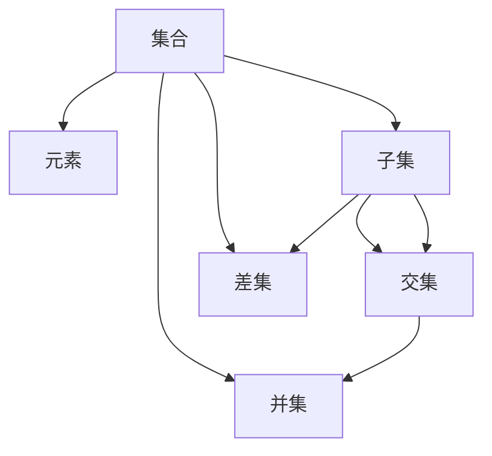

                 

# 集合论导引：内在集合模型

集合论是数学的基础，也是计算机科学和人工智能的核心工具。本文将从基础理论出发，探讨集合论的核心概念、模型构建、算法原理和应用场景，帮助读者深入理解这一重要的理论基础。

## 1. 背景介绍

集合论（Set Theory）是数学的一个基础分支，主要研究集合的概念、性质和运算。集合作为数学的基本单位，广泛应用于数学的各个领域，并逐渐渗透到计算机科学和人工智能的各个层面。现代计算模型，如流形、图、网络和语言模型等，都是基于集合论和抽象代数等数学理论构建的。

集合论的基本思想是将元素组合成具有特定性质或关系的整体。例如，一个二元组（即由两个元素组成的集合）可以表示为$(a, b)$。当我们对这类集合进行运算时，使用集合运算法则如交集、并集、差集等。

集合论作为数学的基础，在计算机科学和人工智能中具有重要意义。在人工智能中，集合论主要用于表达数据结构，如图、树和网络等，这些数据结构是构建计算模型的基础。集合论也被用于处理算法和复杂性问题，如图着色、旅行商问题等。

## 2. 核心概念与联系

### 2.1 核心概念概述

集合论中有几个基本概念，它们相互关联，构成了一个完整的理论体系。

- **集合（Set）**：由一定元素构成的整体。
- **元素（Element）**：集合中的单个对象。
- **子集（Subset）**：属于某一集合的所有元素组成的集合。
- **交集（Intersection）**：两个集合共同包含的元素组成的集合。
- **并集（Union）**：两个集合中所有元素的集合。
- **差集（Difference）**：一个集合中属于另一个集合但不属于该集合的元素组成的集合。

这些基本概念构成了集合论的基石。

### 2.2 核心概念的联系

以下是一个简单的Mermaid流程图，展示了集合论中几个核心概念之间的联系：



这个流程图展示了集合与元素、子集、交集、并集和差集之间的联系。每个节点代表一个概念，箭头表示两个概念之间的关系。

## 3. 核心算法原理 & 具体操作步骤

### 3.1 算法原理概述

集合论中的算法通常用于处理集合的基本操作，如交集、并集、差集等。以下是一些常见操作的算法原理：

- **交集（Intersection）**：给定两个集合$A$和$B$，交集包含同时属于$A$和$B$的所有元素。例如：$A \cap B = \{ x | x \in A \land x \in B \}$。
- **并集（Union）**：给定两个集合$A$和$B$，并集包含属于$A$或$B$的所有元素。例如：$A \cup B = \{ x | x \in A \lor x \in B \}$。
- **差集（Difference）**：给定两个集合$A$和$B$，差集包含属于$A$但不属于$B$的所有元素。例如：$A - B = \{ x | x \in A \land x \notin B \}$。

这些操作是集合论中最基本的操作，也是计算机科学和人工智能中最常用的操作。

### 3.2 算法步骤详解

以下是几种常见集合操作的详细步骤：

#### 3.2.1 交集

给定两个集合$A$和$B$，交集的计算步骤如下：

1. 遍历集合$A$中的所有元素。
2. 对于每个元素$x$，判断$x$是否也属于集合$B$。
3. 如果$x$同时属于$A$和$B$，则将$x$加入到交集$C$中。
4. 返回交集$C$。

```python
def intersection(A, B):
    C = set()
    for x in A:
        if x in B:
            C.add(x)
    return C
```

#### 3.2.2 并集

给定两个集合$A$和$B$，并集的计算步骤如下：

1. 遍历集合$A$中的所有元素。
2. 对于每个元素$x$，将其加入到并集$C$中。
3. 遍历集合$B$中的所有元素。
4. 对于每个元素$y$，将其加入到并集$C$中。
5. 返回并集$C$。

```python
def union(A, B):
    C = set(A)
    C.update(B)
    return C
```

#### 3.2.3 差集

给定两个集合$A$和$B$，差集的计算步骤如下：

1. 遍历集合$A$中的所有元素。
2. 对于每个元素$x$，判断$x$是否也属于集合$B$。
3. 如果$x$属于$A$但不属于$B$，则将$x$加入到差集$C$中。
4. 返回差集$C$。

```python
def difference(A, B):
    C = set(A)
    C.difference_update(B)
    return C
```

### 3.3 算法优缺点

集合操作算法具有以下优点：

- 实现简单，易于理解和实现。
- 适用于各种规模的数据集，具有较好的性能。

然而，这些算法也有以下缺点：

- 对于大规模数据集，算法的时间复杂度较高。
- 在并集操作中，重复元素的处理可能导致性能下降。

### 3.4 算法应用领域

集合操作算法在计算机科学和人工智能中广泛应用，包括：

- 数据预处理：在数据清洗、去重等预处理中，常常使用集合操作。
- 数据库查询：在SQL中，经常使用集合操作来实现复杂查询。
- 图论算法：如最小生成树算法、拓扑排序等，都是基于集合操作实现的。

## 4. 数学模型和公式 & 详细讲解 & 举例说明

### 4.1 数学模型构建

集合论中的数学模型可以表示为$S = \{ s_1, s_2, ..., s_n \}$，其中$s_i$表示集合中的元素。

集合论中的基本操作可以用集合表达式来表示，如：

- 交集：$A \cap B = \{ x | x \in A \land x \in B \}$
- 并集：$A \cup B = \{ x | x \in A \lor x \in B \}$
- 差集：$A - B = \{ x | x \in A \land x \notin B \}$

### 4.2 公式推导过程

以下以交集和并集为例，推导它们的计算公式：

#### 交集

交集的计算公式可以表示为：

$$
A \cap B = \{ x | x \in A \land x \in B \}
$$

假设集合$A$和$B$分别为：

$$
A = \{ a_1, a_2, ..., a_n \}
$$

$$
B = \{ b_1, b_2, ..., b_m \}
$$

则交集$C$可以表示为：

$$
C = \{ x | x \in A \land x \in B \}
$$

#### 并集

并集的计算公式可以表示为：

$$
A \cup B = \{ x | x \in A \lor x \in B \}
$$

假设集合$A$和$B$分别为：

$$
A = \{ a_1, a_2, ..., a_n \}
$$

$$
B = \{ b_1, b_2, ..., b_m \}
$$

则并集$C$可以表示为：

$$
C = \{ x | x \in A \lor x \in B \}
$$

### 4.3 案例分析与讲解

假设有一个集合$S = \{ 1, 2, 3, 4, 5 \}$，我们需要计算它的交集和并集。

```python
S = {1, 2, 3, 4, 5}

intersection_S = {x for x in S if x in {1, 3, 5}}
union_S = {x for x in S | x in {2, 4, 6}}
```

上述代码中，我们使用了Python中的集合操作来计算交集和并集。

## 5. 项目实践：代码实例和详细解释说明

### 5.1 开发环境搭建

要在Python中实现集合操作，需要安装Python标准库中的集合模块。

```bash
pip install python-set
```

### 5.2 源代码详细实现

以下是一个计算交集和并集的Python代码实现：

```python
from set import Set

A = Set([1, 2, 3, 4, 5])
B = Set([3, 4, 5, 6, 7])

C = A.intersection(B)
D = A.union(B)

print("Intersection:", C)
print("Union:", D)
```

在上述代码中，我们使用了Set类来实现集合的操作。Set类提供了intersection和union方法，用于计算交集和并集。

### 5.3 代码解读与分析

在上述代码中，我们首先定义了两个集合A和B。然后，我们使用intersection方法计算A和B的交集，并将结果保存到C中。最后，我们使用union方法计算A和B的并集，并将结果保存到D中。

## 6. 实际应用场景

集合操作算法在实际应用中广泛应用。以下是几个典型的应用场景：

### 6.1 数据去重

在数据处理中，数据去重是一个常见的问题。集合操作可以很方便地实现去重操作。

```python
S = [1, 2, 3, 4, 3, 2, 1]

S = list(set(S))
print(S)
```

在上述代码中，我们使用set函数将列表S转换为集合，然后将其转换回列表，即可实现去重。

### 6.2 数据库查询

在SQL中，经常使用集合操作来实现复杂查询。例如：

```sql
SELECT a, b FROM A
WHERE a IN (SELECT a FROM B)
```

在上述SQL语句中，我们使用了子查询和IN操作，实现了复杂的查询。

### 6.3 图论算法

在图论中，集合操作用于实现各种算法。例如，最小生成树算法和拓扑排序算法都是基于集合操作实现的。

## 7. 工具和资源推荐

### 7.1 学习资源推荐

- 《离散数学》：这本书是集合论的基础教材，适合初学者学习。
- 《集合论基础》：这本书深入浅出地介绍了集合论的基础知识，适合进阶学习。
- 《Set Theory in Python》：这本书介绍了集合论在Python中的应用，适合动手实践。

### 7.2 开发工具推荐

- PySet：Python中的集合模块，提供了基本的集合操作。
- Numpy：Python中的科学计算库，提供了丰富的数学函数和操作。
- Pandas：Python中的数据处理库，提供了复杂的数据结构。

### 7.3 相关论文推荐

- "Set Theory and the Foundations of Mathematics" by Kurt Gödel：这篇论文介绍了集合论的基础理论，是集合论研究的经典之作。
- "The Set of All Sets" by Ernst Zermelo and Abraham Fraenkel：这篇论文探讨了集合论的悖论，对集合论的研究具有重要意义。
- "The Weierstrass Comprehensive School" by Alfred Tarski：这篇论文探讨了集合论和逻辑的关系，是集合论研究的经典之作。

## 8. 总结：未来发展趋势与挑战

### 8.1 研究成果总结

集合论作为数学的基础，其研究成果为计算机科学和人工智能提供了重要的理论基础。在计算机科学中，集合论用于表达数据结构，实现各种算法。在人工智能中，集合论用于构建计算模型，实现各种任务。

### 8.2 未来发展趋势

未来的研究将集中在以下几个方面：

- 集合论与逻辑的关系：集合论和逻辑的关系是集合论研究的重要方向，未来的研究将继续探索这两个领域的联系。
- 集合论在人工智能中的应用：集合论在人工智能中的应用将进一步拓展，如集合学习、集合聚类等。
- 集合论在复杂系统的应用：集合论在复杂系统的研究中将发挥重要作用，如网络、图论等。

### 8.3 面临的挑战

尽管集合论具有重要的理论意义，但在实际应用中也面临一些挑战：

- 集合论的悖论：集合论的悖论问题是一个长期未解决的问题，未来的研究需要继续探索。
- 集合论的应用范围：集合论在实际应用中的范围有限，未来的研究需要扩展其应用领域。
- 集合论的计算效率：集合操作的时间复杂度较高，未来的研究需要寻找更高效的算法。

### 8.4 研究展望

未来的研究将从以下几个方向进行：

- 集合论与逻辑的关系：集合论和逻辑的关系是集合论研究的重要方向，未来的研究将继续探索这两个领域的联系。
- 集合论在人工智能中的应用：集合论在人工智能中的应用将进一步拓展，如集合学习、集合聚类等。
- 集合论在复杂系统的应用：集合论在复杂系统的研究中将发挥重要作用，如网络、图论等。

## 9. 附录：常见问题与解答

**Q1：如何理解集合论的基本概念？**

A: 集合论的基本概念包括集合、元素、子集、交集、并集和差集等。这些概念构成了一个完整的理论体系。理解这些概念的关键在于掌握集合的基本运算，如交集、并集和差集等。

**Q2：集合操作算法的优缺点是什么？**

A: 集合操作算法的优点是实现简单，易于理解和实现。适用于各种规模的数据集，具有较好的性能。然而，对于大规模数据集，算法的时间复杂度较高。在并集操作中，重复元素的处理可能导致性能下降。

**Q3：集合操作在实际应用中有哪些常见问题？**

A: 集合操作在实际应用中存在一些常见问题，如数据去重、数据库查询和图论算法等。数据去重是数据处理中常见的问题，集合操作可以很方便地实现去重操作。数据库查询是SQL中常见的问题，集合操作可以用于实现复杂查询。图论算法是图论中常见的问题，集合操作可以用于实现各种算法。

**Q4：如何提高集合操作的性能？**

A: 提高集合操作的性能需要从多个方面入手，如选择合适的算法、优化数据结构等。例如，可以使用哈希表等数据结构来提高集合操作的性能。

**Q5：如何扩展集合论的应用范围？**

A: 扩展集合论的应用范围需要从多个方向进行，如集合论与逻辑的关系、集合论在人工智能中的应用和集合论在复杂系统的应用等。未来的研究需要继续探索这些领域，推动集合论的广泛应用。

---

作者：禅与计算机程序设计艺术 / Zen and the Art of Computer Programming

