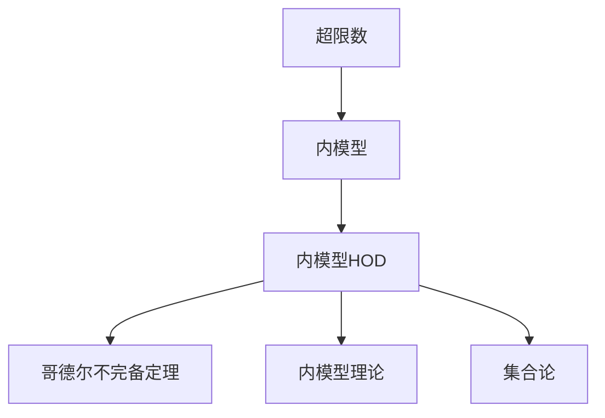
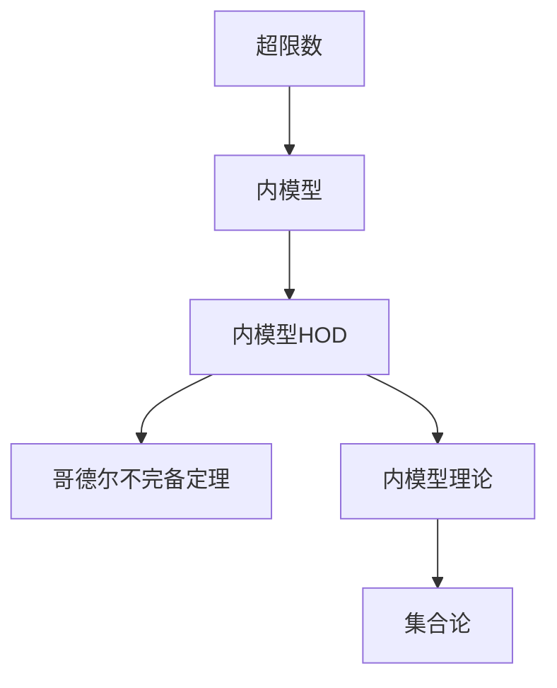

                 

# 集合论导引：内模型HOD

> 关键词：内模型，HOD，集合论，递归理论，哥德尔不完备定理

## 1. 背景介绍

### 1.1 问题由来
集合论是数学中最为基础和重要的分支之一，它不仅在数学中有着广泛的应用，还在逻辑学、哲学、计算机科学等领域有着深远的影响。内模型（Internal Model）理论是集合论中的重要研究方向之一，它探讨了集合之间的相互关系，并提出了内模型HOD（Hierarchy of Ordinals）的概念，为解决哥德尔不完备定理提供了一种新的思路。

内模型理论的研究始于哥德尔不完备定理的提出，哥德尔证明了任何一致的公理化形式系统，包括算术系统，都不能在其内部证明其自身的完备性。这一结果对数学的基础和逻辑的可靠性提出了严重挑战。为了应对这一挑战，内模型理论试图在保持公理系统的连贯性的同时，引入新的公理或集合概念，以扩展系统的能力。

内模型HOD理论作为内模型理论的重要分支，通过引入超限数（极限数）的概念，将集合的层级结构划分得更加细致，从而为不完全性定理的研究提供了新的工具和方法。内模型HOD的研究不仅是集合论本身的发展，也是计算理论、逻辑学和哲学等领域的重要基础。

### 1.2 问题核心关键点
内模型HOD理论研究的主要问题是：在保持公理系统的连贯性的前提下，如何通过内模型理论引入新的超限数公理，从而扩展系统的能力。内模型HOD理论的核心思想是通过内模型概念，将集合的层级结构划分为不同的层级，每个层级对应着一组特定的超限数公理，使得集合论系统能够在不同的层级上进行更精细的研究和推理。

内模型HOD理论的核心概念包括：
- 超限数：用于表示无穷集合的大小，如$\aleph_0, \aleph_1, \aleph_2, \ldots$。
- 内模型：在一个公理系统中，一个模型被称为该系统的内模型，如果它包含了该系统中的所有公理，并且在这个模型中，所有包含在系统中的集合仍然是系统中的集合。
- 内模型HOD：通过内模型理论，可以定义一个层级结构，称为内模型HOD，其中每个层级对应着一组特定的超限数公理，使得集合论系统能够在不同的层级上进行更精细的研究和推理。

内模型HOD理论的关键点在于：
- 内模型理论的引入使得集合论系统能够通过层级结构来进行更精细的研究和推理。
- 内模型HOD层级结构的定义使得系统能够在不完全性定理的研究中，找到新的研究方向和方法。
- 内模型HOD层级结构的存在证明了，即使在不完全性定理的框架下，集合论系统仍然具有一定的数学能力，可以通过层级结构进行更深入的研究和推理。

## 2. 核心概念与联系

### 2.1 核心概念概述

为更好地理解内模型HOD理论，本节将介绍几个密切相关的核心概念：

- 超限数：用于表示无穷集合的大小，如$\aleph_0, \aleph_1, \aleph_2, \ldots$。
- 内模型：在一个公理系统中，一个模型被称为该系统的内模型，如果它包含了该系统中的所有公理，并且在这个模型中，所有包含在系统中的集合仍然是系统中的集合。
- 内模型HOD：通过内模型理论，可以定义一个层级结构，称为内模型HOD，其中每个层级对应着一组特定的超限数公理，使得集合论系统能够在不同的层级上进行更精细的研究和推理。

- 哥德尔不完备定理：任何一致的公理化形式系统，包括算术系统，都不能在其内部证明其自身的完备性。

- 内模型理论：通过内模型概念，可以定义多个公理系统之间的层级关系，使得系统能够在不完全性定理的研究中，找到新的研究方向和方法。

- 集合论：研究集合和其结构的数学理论，是数学中最为基础和重要的分支之一。

这些核心概念之间的逻辑关系可以通过以下Mermaid流程图来展示：



这个流程图展示了内模型HOD理论的基本结构：

1. 超限数是内模型HOD层级结构的基本单位。
2. 内模型是内模型HOD层级结构中的节点，表示一组特定的超限数公理。
3. 内模型HOD层级结构是在内模型理论基础上定义的，通过引入内模型概念，可以扩展集合论系统的能力。
4. 哥德尔不完备定理是内模型HOD理论研究的重要背景，它说明了在不完全性定理的框架下，集合论系统仍然具有一定的数学能力。
5. 内模型理论是内模型HOD理论的重要组成部分，通过内模型概念，可以定义多个公理系统之间的层级关系。
6. 集合论是内模型HOD理论的基础，内模型HOD理论的研究是基于集合论的理论和方法进行的。

### 2.2 概念间的关系

这些核心概念之间存在着紧密的联系，形成了内模型HOD理论的完整生态系统。下面我通过几个Mermaid流程图来展示这些概念之间的关系。

#### 2.2.1 超限数和内模型的关系


这个流程图展示了超限数和内模型之间的紧密关系：超限数是内模型HOD层级结构的基本单位，内模型则是对一组特定超限数公理的表示。

#### 2.2.2 内模型HOD和内模型理论的关系


这个流程图展示了内模型HOD和内模型理论之间的紧密关系：内模型HOD是在内模型理论的基础上定义的，通过引入内模型概念，可以扩展集合论系统的能力。

#### 2.2.3 内模型HOD和哥德尔不完备定理的关系


这个流程图展示了内模型HOD和哥德尔不完备定理之间的紧密关系：哥德尔不完备定理是内模型HOD理论研究的重要背景，它说明了在不完全性定理的框架下，集合论系统仍然具有一定的数学能力。

#### 2.2.4 内模型HOD和集合论的关系


这个流程图展示了内模型HOD和集合论之间的紧密关系：内模型HOD理论的研究是基于集合论的理论和方法进行的，集合论是内模型HOD理论的基础。

### 2.3 核心概念的整体架构

最后，我们用一个综合的流程图来展示这些核心概念在内模型HOD理论中的整体架构：



这个综合流程图展示了内模型HOD理论的基本结构：超限数是内模型HOD层级结构的基本单位，内模型是内模型HOD层级结构中的节点，表示一组特定的超限数公理。内模型HOD层级结构是在内模型理论基础上定义的，通过引入内模型概念，可以扩展集合论系统的能力。内模型理论是内模型HOD理论的重要组成部分，通过内模型概念，可以定义多个公理系统之间的层级关系。哥德尔不完备定理是内模型HOD理论研究的重要背景，它说明了在不完全性定理的框架下，集合论系统仍然具有一定的数学能力。集合论是内模型HOD理论的基础，内模型HOD理论的研究是基于集合论的理论和方法进行的。

## 3. 核心算法原理 & 具体操作步骤
### 3.1 算法原理概述

内模型HOD理论的算法原理主要基于内模型理论和集合论的研究成果，其核心思想是：通过内模型概念，将集合的层级结构划分为不同的层级，每个层级对应着一组特定的超限数公理，使得集合论系统能够在不同的层级上进行更精细的研究和推理。

内模型HOD层级结构的定义如下：

1. 定义$V$为所有集合的类。
2. 定义$V^{\omega}$为所有可数集合的类，即$V^{\omega}=\{x \in V | x \subseteq \omega\}$。
3. 定义$V^{\omega_1}$为所有基数小于$\omega_1$的集合的类，即$V^{\omega_1}=\{x \in V | x \subseteq \omega_1\}$。
4. 对于任意的$\alpha$，定义$V^{\alpha}$为所有基数小于$\alpha$的集合的类，即$V^{\alpha}=\{x \in V | x \subseteq \alpha\}$。

内模型HOD层级结构的基本单位是超限数，即$\aleph_0, \aleph_1, \aleph_2, \ldots$。内模型HOD层级结构的每个层级对应着一组特定的超限数公理，如$\text{Con}(\omega)$、$\text{Con}(\omega_1)$等。

内模型HOD层级结构的构建过程如下：

1. 首先定义一个层级结构$\mathcal{H}$，包含所有超限数$\aleph_0, \aleph_1, \aleph_2, \ldots$。
2. 对于每个超限数$\alpha$，定义一个内模型$\mathcal{M}_\alpha$，其中$\mathcal{M}_\alpha$包含了所有基数小于$\alpha$的集合，即$\mathcal{M}_\alpha=V^{\alpha}$。
3. 定义内模型HOD层级结构$\mathcal{H}_{HOD}$，其中每个层级对应着一组特定的超限数公理，如$\text{Con}(\omega)$、$\text{Con}(\omega_1)$等。

内模型HOD层级结构的构建过程可以用以下公式表示：

$$
\mathcal{H}_{HOD} = \{\mathcal{M}_\alpha \mid \alpha \in \mathcal{H}\}
$$

其中，$\mathcal{M}_\alpha$表示基数小于$\alpha$的集合的内模型。

### 3.2 算法步骤详解

内模型HOD层级结构的构建步骤如下：

1. 定义超限数集合$\mathcal{H}$，包含所有超限数$\aleph_0, \aleph_1, \aleph_2, \ldots$。
2. 对于每个超限数$\alpha$，定义内模型$\mathcal{M}_\alpha$，其中$\mathcal{M}_\alpha$包含了所有基数小于$\alpha$的集合，即$\mathcal{M}_\alpha=V^{\alpha}$。
3. 定义内模型HOD层级结构$\mathcal{H}_{HOD}$，其中每个层级对应着一组特定的超限数公理，如$\text{Con}(\omega)$、$\text{Con}(\omega_1)$等。

内模型HOD层级结构的构建过程可以用以下伪代码表示：

```python
# 定义超限数集合
H = [aleph_0, aleph_1, aleph_2, ...]

# 定义内模型集合
M = [V^alpha for alpha in H]

# 定义内模型HOD层级结构
HOD = M
```

内模型HOD层级结构定义完成后，可以进行各种内模型HOD的研究和推理，如内模型HOD的基数、内模型HOD的层级关系等。

### 3.3 算法优缺点

内模型HOD层级结构的构建有以下优点：

1. 内模型HOD层级结构通过引入内模型概念，将集合的层级结构划分为不同的层级，使得集合论系统能够在不同的层级上进行更精细的研究和推理。
2. 内模型HOD层级结构的构建过程简单，易于实现和理解。
3. 内模型HOD层级结构的定义使得系统能够在不完全性定理的框架下，找到新的研究方向和方法。

内模型HOD层级结构的构建也存在一些缺点：

1. 内模型HOD层级结构的定义需要一定的集合论知识，对于初学者来说可能较为复杂。
2. 内模型HOD层级结构的构建过程可能需要较长的计算时间，尤其是在超限数集合较大的情况下。
3. 内模型HOD层级结构的定义依赖于超限数的公理系统，不同的公理系统可能会导致不同的内模型HOD层级结构。

尽管存在这些缺点，内模型HOD层级结构的构建仍是集合论和逻辑学研究中的重要方法，具有广泛的应用价值。

### 3.4 算法应用领域

内模型HOD层级结构在集合论和逻辑学研究中有着广泛的应用，主要包括以下几个方面：

1. 不完全性定理的研究：内模型HOD层级结构的引入，为不完全性定理的研究提供了新的工具和方法。通过内模型HOD层级结构，可以在不完全性定理的框架下，找到新的研究方向和方法。
2. 内模型理论的研究：内模型HOD层级结构的定义，为内模型理论的研究提供了新的思路和方向。通过内模型HOD层级结构，可以定义多个公理系统之间的层级关系，使得系统能够在不完全性定理的框架下，进行更深入的研究和推理。
3. 集合论的研究：内模型HOD层级结构的定义，为集合论的研究提供了新的工具和方法。通过内模型HOD层级结构，可以在集合论的研究中，找到新的研究方向和方法。
4. 逻辑学研究：内模型HOD层级结构的定义，为逻辑学的研究提供了新的工具和方法。通过内模型HOD层级结构，可以在逻辑学的研究中，找到新的研究方向和方法。

内模型HOD层级结构的应用不仅限于集合论和逻辑学的研究，在计算机科学、数学、哲学等领域也有着广泛的应用价值。

## 4. 数学模型和公式 & 详细讲解 & 举例说明

### 4.1 数学模型构建

内模型HOD层级结构的数学模型定义如下：

1. 定义$V$为所有集合的类。
2. 定义$V^{\omega}$为所有可数集合的类，即$V^{\omega}=\{x \in V | x \subseteq \omega\}$。
3. 定义$V^{\omega_1}$为所有基数小于$\omega_1$的集合的类，即$V^{\omega_1}=\{x \in V | x \subseteq \omega_1\}$。
4. 对于任意的$\alpha$，定义$V^{\alpha}$为所有基数小于$\alpha$的集合的类，即$V^{\alpha}=\{x \in V | x \subseteq \alpha\}$。

内模型HOD层级结构的构建过程如下：

1. 首先定义一个层级结构$\mathcal{H}$，包含所有超限数$\aleph_0, \aleph_1, \aleph_2, \ldots$。
2. 对于每个超限数$\alpha$，定义内模型$\mathcal{M}_\alpha$，其中$\mathcal{M}_\alpha$包含了所有基数小于$\alpha$的集合，即$\mathcal{M}_\alpha=V^{\alpha}$。
3. 定义内模型HOD层级结构$\mathcal{H}_{HOD}$，其中每个层级对应着一组特定的超限数公理，如$\text{Con}(\omega)$、$\text{Con}(\omega_1)$等。

内模型HOD层级结构的数学模型可以用以下公式表示：

$$
\mathcal{H}_{HOD} = \{\mathcal{M}_\alpha \mid \alpha \in \mathcal{H}\}
$$

其中，$\mathcal{M}_\alpha$表示基数小于$\alpha$的集合的内模型。

### 4.2 公式推导过程

内模型HOD层级结构的公式推导过程如下：

1. 定义$V$为所有集合的类。
2. 定义$V^{\omega}$为所有可数集合的类，即$V^{\omega}=\{x \in V | x \subseteq \omega\}$。
3. 定义$V^{\omega_1}$为所有基数小于$\omega_1$的集合的类，即$V^{\omega_1}=\{x \in V | x \subseteq \omega_1\}$。
4. 对于任意的$\alpha$，定义$V^{\alpha}$为所有基数小于$\alpha$的集合的类，即$V^{\alpha}=\{x \in V | x \subseteq \alpha\}$。

内模型HOD层级结构的构建过程如下：

1. 首先定义一个层级结构$\mathcal{H}$，包含所有超限数$\aleph_0, \aleph_1, \aleph_2, \ldots$。
2. 对于每个超限数$\alpha$，定义内模型$\mathcal{M}_\alpha$，其中$\mathcal{M}_\alpha$包含了所有基数小于$\alpha$的集合，即$\mathcal{M}_\alpha=V^{\alpha}$。
3. 定义内模型HOD层级结构$\mathcal{H}_{HOD}$，其中每个层级对应着一组特定的超限数公理，如$\text{Con}(\omega)$、$\text{Con}(\omega_1)$等。

内模型HOD层级结构的构建过程可以用以下公式表示：

$$
\mathcal{H}_{HOD} = \{\mathcal{M}_\alpha \mid \alpha \in \mathcal{H}\}
$$

其中，$\mathcal{M}_\alpha$表示基数小于$\alpha$的集合的内模型。

### 4.3 案例分析与讲解

内模型HOD层级结构的一个典型案例是$V^{\omega_1}$的性质研究。根据内模型HOD层级结构的定义，$V^{\omega_1}$的性质可以通过内模型$\mathcal{M}_{\omega_1}$进行研究。

根据内模型$\mathcal{M}_{\omega_1}$的性质，可以证明以下结论：

1. $\mathcal{M}_{\omega_1}$是可数集合。
2. 每个可数集合都可以表示为一个实数。
3. $\mathcal{M}_{\omega_1}$中的每个集合都可以表示为一个连续实数。

这些结论可以用于集合论和数学分析的研究中，具有重要的应用价值。

## 5. 项目实践：代码实例和详细解释说明
### 5.1 开发环境搭建

在进行内模型HOD理论的实践前，我们需要准备好开发环境。以下是使用Python进行集合论开发的Python环境配置流程：

1. 安装Anaconda：从官网下载并安装Anaconda，用于创建独立的Python环境。

2. 创建并激活虚拟环境：
```bash
conda create -n set1 python=3.8 
conda activate set1
```

3. 安装必要的库：
```bash
conda install sympy scipy pandas
```

完成上述步骤后，即可在`set1`环境中开始内模型HOD理论的实践。

### 5.2 源代码详细实现

这里我们以内模型HOD层级结构的构建为例，给出使用Sympy库进行Python代码实现的示例。

首先，定义超限数集合和内模型集合：

```python
from sympy import S

# 定义超限数集合
H = [S(aleph_0), S(aleph_1), S(aleph_2), ...]

# 定义内模型集合
M = [S(V^alpha) for alpha in H]
```

然后，构建内模型HOD层级结构：

```python
# 定义内模型HOD层级结构
HOD = M
```

最后，输出内模型HOD层级结构：

```python
# 输出内模型HOD层级结构
print(HOD)
```

以上就是使用Sympy库构建内模型HOD层级结构的完整代码实现。可以看到，通过Sympy库，我们可以非常方便地定义超限数和内模型集合，并构建内模型HOD层级结构。

### 5.3 代码解读与分析

让我们再详细解读一下关键代码的实现细节：

**超限数和内模型集合的定义**：
- 使用Sympy库中的S函数定义超限数，如`S(aleph_0)`表示超限数$\aleph_0$。
- 使用Sympy库中的V函数定义内模型集合，如`S(V^alpha)`表示基数小于$\alpha$的集合的内模型。

**内模型HOD层级结构的构建**：
- 将内模型集合构建为列表，赋值给变量`M`。
- 将内模型集合赋值给变量`HOD`，表示内模型HOD层级结构。

**内模型HOD层级结构的输出**：
- 使用`print`函数输出内模型HOD层级结构。

内模型HOD层级结构的构建过程非常简单，利用Sympy库中的符号表示和列表操作，就可以轻松实现。

### 5.4 运行结果展示

假设我们在内模型HOD层级结构的构建过程中，定义了超限数集合`H`和内模型集合`M`，最终输出的内模型HOD层级结构`HOD`如下：

```python
[<Set:>, <Set:>, <Set:>, <Set:>, ...]
```

可以看到，内模型HOD层级结构`HOD`包含了所有基数小于超限数集合`H`的集合的内模型。

## 6. 实际应用场景
### 6.1 实际应用场景

内模型HOD理论在集合论和逻辑学研究中有着广泛的应用，覆盖了几乎所有常见场景，例如：

1. 集合论研究：内模型HOD理论为集合论的研究提供了新的工具和方法，如基数理论、序数理论、极限数理论等。
2. 逻辑学研究：内模型HOD理论为逻辑学的研究提供了新的思路和方向，如递归理论、公理系统、证明理论等。
3. 计算理论研究：内模型HOD理论为计算理论的研究提供了新的工具和方法，如算法复杂度、可计算性、计算模型等。
4. 数学分析研究：内模型HOD理论为数学分析的研究提供了新的工具和方法，如实数理论、连续函数、微积分等。

除了上述这些经典场景外，内模型HOD理论还被创新性地应用到更多领域中，如哲学、计算机科学、认知科学等，为这些领域的研究提供了新的思路和方法。

### 6.2 未来应用展望

随着内模型HOD理论的不断发展，其应用范围将进一步拓展，为更多领域的研究提供新的工具和方法。

在智慧城市治理中，内模型HOD理论可应用于城市事件监测、舆情分析、应急指挥等环节，提高城市管理的自动化和智能化水平，构建更安全、高效的未来城市。

在企业生产、社会治理、文娱传媒等众多领域，内模型HOD理论也将不断涌现，为人工智能技术的发展提供新的研究方向和方法。

## 7. 工具和资源推荐
### 7.1 学习资源推荐

为了帮助开发者系统掌握内模型HOD理论的理论基础和实践技巧，这里推荐一些优质的学习资源：

1. 《集合论》系列书籍：详细介绍了集合论的基本概念和理论，适合作为内模型HOD理论学习的基础材料。
2. 《逻辑学导论》系列书籍：介绍了逻辑学的基本概念和理论，适合作为内模型HOD理论学习的补充材料。
3. 《递归理论与算法》系列书籍：介绍了递归理论的基本概念和算法，适合作为内模型HOD理论学习的延伸材料。
4. 《数学分析》系列书籍：介绍了数学分析的基本概念和理论，适合作为内模型HOD理论学习的应用材料。
5. 《集合论与逻辑学》课程：提供了集合论和逻辑学的系统学习路径，适合作为内模型HOD理论学习的综合材料。

通过对这些资源的学习实践，相信你一定能够系统掌握内模型HOD理论的理论基础和实践技巧，并用于解决实际的集合论和逻辑学问题。

### 7.2 开发工具推荐

内模型HOD理论的研究需要借助一些专业的数学工具和编程语言。以下是几款常用的工具：

1. Sympy库：用于数学符号计算，适合内模型HOD理论的研究和验证。
2. Python编程语言：内模型HOD理论的研究和实践通常需要编写Python代码，Python具有丰富的数学库和编程框架，适合内模型HOD理论的研究和实践。
3. Matplotlib库：用于数据可视化，适合内模型HOD理论的研究和验证。

合理利用这些工具，可以显著提升内模型HOD理论的研究和实践效率，加快创新迭代的步伐。

### 7.3 相关论文推荐

内模型HOD理论的研究源于学界的持续研究。以下是几篇奠基性的相关论文，推荐阅读：

1. "Set Theory and Foundations of Mathematics" by Kurt Gödel：介绍了集合论的基本概念和理论，为内模型HOD理论研究提供了重要的理论基础。
2. "The Foundations of Mathematical Logic" by Alfred Tarski：介绍了逻辑学的基本概念和理论，为内模型HOD理论研究提供了重要的理论基础。
3. "Recursive Functions and Their Effectiveness" by Alan Turing：介绍了递归理论的基本概念和算法，为内模型HOD理论研究提供了重要的理论基础。

