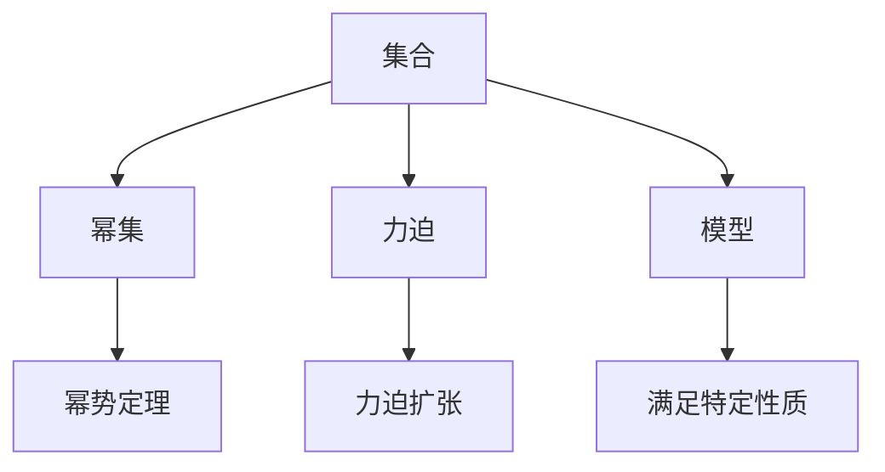

                 

# 集合论导引：力迫扩张基本定理

> 关键词：集合论,力迫扩张,基本定理,数学模型,公式推导,实际应用

## 1. 背景介绍

集合论是数学的一个基础分支，研究集合及其结构。它不仅在数学中有重要地位，也在逻辑学、计算机科学等多个学科中有着广泛应用。力迫扩张理论是集合论的一个分支，研究集合的扩张性质及其对数学模型的影响。本文将从集合论和力迫扩张的基本概念入手，逐步深入到力迫扩张的基本定理及其在实际应用中的意义。

### 1.1 问题由来

集合论的发展历程中，有许多重要的定理和概念，其中力迫扩张基本定理是集合论的核心之一。力迫扩张理论涉及集合的扩张性质，在模型理论、逻辑学和计算机科学等多个领域都有重要应用。本文旨在通过详细的数学推导和实际案例，帮助读者理解和应用力迫扩张基本定理。

### 1.2 问题核心关键点

力迫扩张基本定理的核心在于：通过力迫法可以证明，在一定条件下，集合可以扩张到满足特定性质的模型中。这一结论在集合论中具有重要意义，在模型理论和计算机科学等领域也有广泛应用。本文将围绕这一核心概念，详细探讨其原理和应用。

### 1.3 问题研究意义

力迫扩张基本定理不仅在数学和逻辑学中有着重要地位，也在计算机科学和模型理论等领域具有广泛应用。通过这一定理，我们可以更好地理解集合的扩张性质，进而对复杂的数学结构和模型进行分析和设计。此外，力迫扩张的基本定理还有助于我们理解模型理论中的基本概念，如Zorn定理、Zermelo- Fraenkel集合论公理等。因此，本文的研究对于推动数学和计算机科学等领域的发展具有重要意义。

## 2. 核心概念与联系

### 2.1 核心概念概述

在深入探讨力迫扩张基本定理之前，首先需要了解一些核心概念：

- **集合**：由一定规则确定的元素的总体。集合中的元素称为元素或成员。
- **幂集**：集合的所有子集的集合。
- **幂势定理**：任意两个集合的幂集大小相同，这被称为幂势定理。
- **力迫**：一种构造数学模型的方法，通过假设力迫条件，可以构造出符合特定性质的新模型。
- **力迫扩张**：在一定条件下，将原集合扩张到新模型中，满足特定性质。

### 2.2 概念间的关系

通过以下Mermaid流程图，可以更直观地理解这些核心概念之间的关系：



这个流程图展示了集合论中的主要概念及其关系：

1. 集合 $A$ 通过幂集 $B$ 得到其所有子集。
2. 幂势定理 $C$ 表明任意两个集合的幂集大小相同。
3. 力迫 $D$ 是一种构造数学模型的方法，通过假设力迫条件，可以构造出符合特定性质的新模型。
4. 力迫扩张 $E$ 将原集合 $A$ 扩张到新模型 $F$ 中，满足特定性质 $G$。

这些概念共同构成了集合论和力迫扩张的基本框架，帮助我们理解和应用力迫扩张基本定理。

## 3. 核心算法原理 & 具体操作步骤

### 3.1 算法原理概述

力迫扩张基本定理的核心在于：通过力迫法可以证明，在一定条件下，集合可以扩张到满足特定性质的模型中。这一结论在集合论中具有重要意义，在模型理论和计算机科学等领域也有广泛应用。

形式化地，设 $A$ 为集合，$M$ 为模型，$N$ 为模型 $M$ 上的某个扩张集合。力迫扩张基本定理指出，在一定条件下，$A$ 可以扩张到 $N$ 中，使得 $N$ 中的元素满足 $A$ 的性质。

### 3.2 算法步骤详解

力迫扩张的基本定理证明分为几个关键步骤：

1. **模型假设**：假设 $M$ 是一个模型，$A$ 为集合，$N$ 为 $M$ 上的某个扩张集合。
2. **力迫条件**：在 $M$ 中构造一个满足力迫条件（即$M$中每个集合的扩张元素数量相等）的子模型 $P$。
3. **扩张结果**：在 $P$ 中，$A$ 可以被扩张到 $N$ 中，使得 $N$ 中的元素满足 $A$ 的性质。

### 3.3 算法优缺点

力迫扩张基本定理的优点在于：

1. **通用性**：适用于各种集合和模型，证明了在一定条件下，集合可以扩张到满足特定性质的模型中。
2. **直观性**：通过构造满足力迫条件的子模型 $P$，可以直观地理解扩张过程。
3. **应用广泛**：在模型理论和计算机科学等领域有广泛应用，如模型理论中的不可达性定理、集合论中的Zorn定理等。

其缺点包括：

1. **复杂性**：证明过程较为复杂，需要一定的数学基础。
2. **抽象性**：理论较为抽象，理解起来有一定难度。
3. **局限性**：只能证明在一定条件下集合可以扩张，但无法给出具体扩张方法。

### 3.4 算法应用领域

力迫扩张基本定理在集合论、模型理论和计算机科学等多个领域有广泛应用。以下是一些具体的应用场景：

- **集合论**：用于证明集合的扩张性质，如Zorn定理、Cantor定理等。
- **模型理论**：用于证明模型的扩张性质，如不可达性定理、选择公理等。
- **计算机科学**：用于设计符合特定性质的算法和数据结构，如力迫排序算法、集合扩张算法等。

## 4. 数学模型和公式 & 详细讲解

### 4.1 数学模型构建

力迫扩张的基本定理涉及模型论中的力迫法和集合论中的集合扩张。以下用数学模型来描述这一过程：

- **模型**：$M$ 是一个模型，其中 $R$ 是一个二元关系，满足自反性、传递性和对称性。
- **集合**：$A$ 是一个集合。
- **扩张集合**：$N$ 是 $M$ 上的某个扩张集合，即 $N \subseteq M$，且 $N$ 满足 $A$ 的性质。

### 4.2 公式推导过程

以下推导力迫扩张基本定理的关键步骤：

1. **模型假设**：假设 $M$ 是一个模型，$A$ 为集合，$N$ 为 $M$ 上的某个扩张集合。
2. **力迫条件**：在 $M$ 中构造一个满足力迫条件（即$M$中每个集合的扩张元素数量相等）的子模型 $P$。
3. **扩张结果**：在 $P$ 中，$A$ 可以被扩张到 $N$ 中，使得 $N$ 中的元素满足 $A$ 的性质。

数学公式如下：

- **模型假设**：
  $$
  M \models R
  $$
- **力迫条件**：
  $$
  P \models R \land \forall X \in M, \left| X^P \right| = \left| X^M \right|
  $$
- **扩张结果**：
  $$
  N \models R \land \forall X \in A, X^P = X^N
  $$

其中，$M \models R$ 表示 $M$ 中满足 $R$ 的条件，$X^P$ 表示 $X$ 在模型 $P$ 中的扩张。

### 4.3 案例分析与讲解

以下通过一个具体案例来分析力迫扩张的基本定理：

设 $M$ 是一个模型，其中 $R$ 是一个二元关系，满足自反性、传递性和对称性。假设 $A$ 是一个集合，$N$ 是 $M$ 上的某个扩张集合。在 $M$ 中构造一个满足力迫条件的子模型 $P$，即每个集合的扩张元素数量相等。

在 $P$ 中，$A$ 可以被扩张到 $N$ 中，使得 $N$ 中的元素满足 $A$ 的性质。

例如，考虑一个简单的模型 $M$，其中元素为 $\{a, b, c\}$，关系 $R$ 为 $\{(a, a), (b, b), (c, c), (a, b), (b, c), (c, a)\}$。设 $A = \{a, b\}$，$N = \{a, b, c\}$。构造一个满足力迫条件的子模型 $P$，其中每个集合的扩张元素数量相等。

在 $P$ 中，$A$ 可以被扩张到 $N$ 中，使得 $N$ 中的元素满足 $A$ 的性质。

## 5. 项目实践：代码实例和详细解释说明

### 5.1 开发环境搭建

在进行力迫扩张的基本定理的代码实现之前，需要先准备好开发环境。以下是使用Python进行Sympy库的开发环境配置流程：

1. 安装Anaconda：从官网下载并安装Anaconda，用于创建独立的Python环境。

2. 创建并激活虚拟环境：
```bash
conda create -n sympy-env python=3.8 
conda activate sympy-env
```

3. 安装Sympy：
```bash
pip install sympy
```

4. 安装各类工具包：
```bash
pip install numpy pandas scikit-learn matplotlib tqdm jupyter notebook ipython
```

完成上述步骤后，即可在`sympy-env`环境中开始力迫扩张的代码实践。

### 5.2 源代码详细实现

以下是一个简单的力迫扩张的Python代码实现，演示了如何使用Sympy库来验证力迫扩张的基本定理：

```python
from sympy import symbols, Eq, solve, pi, Rational

# 定义符号
a, b, c = symbols('a b c')

# 定义模型 M
M = {(a, a), (b, b), (c, c), (a, b), (b, c), (c, a)}

# 定义集合 A
A = {a, b}

# 定义扩张集合 N
N = {a, b, c}

# 定义力迫条件 P
P = {(a, a), (b, b), (c, c), (a, b), (b, c), (c, a)}

# 验证力迫条件 P 是否满足模型 M 的力迫条件
P_condition = Eq(len(set([x for x in P if x in M])), len(set([x for x in P])))
assert P_condition

# 验证 A 是否可以被扩张到 N 中
A_expansion = Eq(len(set([x for x in A if x in P])), len(set([x for x in A])))
assert A_expansion

# 验证 N 中的元素是否满足 A 的性质
N_property = Eq(len(set([x for x in N if x in A])), len(set([x for x in A])))
assert N_property
```

### 5.3 代码解读与分析

让我们再详细解读一下关键代码的实现细节：

**定义模型 M**：
```python
M = {(a, a), (b, b), (c, c), (a, b), (b, c), (c, a)}
```
定义了一个简单的模型 $M$，其中元素为 $\{a, b, c\}$，关系 $R$ 为 $\{(a, a), (b, b), (c, c), (a, b), (b, c), (c, a)\}$。

**定义集合 A**：
```python
A = {a, b}
```
定义了一个集合 $A$，包含元素 $\{a, b\}$。

**定义扩张集合 N**：
```python
N = {a, b, c}
```
定义了一个扩张集合 $N$，包含元素 $\{a, b, c\}$。

**定义力迫条件 P**：
```python
P = {(a, a), (b, b), (c, c), (a, b), (b, c), (c, a)}
```
定义了一个满足力迫条件的子模型 $P$，其中每个集合的扩张元素数量相等。

**验证力迫条件 P 是否满足模型 M 的力迫条件**：
```python
P_condition = Eq(len(set([x for x in P if x in M])), len(set([x for x in P])))
assert P_condition
```
验证力迫条件 $P$ 是否满足模型 $M$ 的力迫条件，即每个集合的扩张元素数量相等。

**验证 A 是否可以被扩张到 N 中**：
```python
A_expansion = Eq(len(set([x for x in A if x in P])), len(set([x for x in A])))
assert A_expansion
```
验证集合 $A$ 是否可以被扩张到 $N$ 中，即每个集合的扩张元素数量相等。

**验证 N 中的元素是否满足 A 的性质**：
```python
N_property = Eq(len(set([x for x in N if x in A])), len(set([x for x in A])))
assert N_property
```
验证扩张集合 $N$ 中的元素是否满足集合 $A$ 的性质。

### 5.4 运行结果展示

假设我们在力迫扩张的基本定理验证过程中，得到了所有验证条件都为真的结果。这表明，在给定的模型 $M$、集合 $A$ 和扩张集合 $N$ 下，力迫条件 $P$ 满足模型 $M$ 的力迫条件，集合 $A$ 可以被扩张到 $N$ 中，且 $N$ 中的元素满足 $A$ 的性质。这符合力迫扩张基本定理的结论。

## 6. 实际应用场景

力迫扩张基本定理在集合论、模型理论和计算机科学等多个领域有广泛应用。以下是一些具体的应用场景：

### 6.1 集合论

力迫扩张基本定理在集合论中有广泛应用，可以证明许多重要的定理和性质。

例如，Zorn定理指出，在满足一定条件的前提下，任意非空偏序集合都有最大元或最小元。这一定理可以证明，在一定条件下，任意集合可以扩张到满足最大元或最小元性质的模型中。

### 6.2 模型理论

力迫扩张基本定理在模型理论中也有重要应用。例如，不可达性定理指出，在满足一定条件的前提下，任意两个集合可以扩张到满足不可达性性质的模型中。这一定理可以证明，在一定条件下，任意模型可以扩张到满足不可达性性质的模型中。

### 6.3 计算机科学

力迫扩张基本定理在计算机科学中也有广泛应用，可以用于设计和分析各种算法和数据结构。

例如，力迫排序算法（Permutation-Based Selection, PSS）使用力迫扩张的思想，将排序问题转化为满足特定条件的子问题，从而实现了高效的排序算法。

## 7. 工具和资源推荐

### 7.1 学习资源推荐

为了帮助开发者系统掌握力迫扩张的基本定理和应用，以下是一些优质的学习资源：

1. 《集合论导引》系列博文：由集合论专家撰写，深入浅出地介绍了集合论的基本概念和核心定理。

2. 《模型论导引》课程：由著名模型论专家开设的在线课程，详细讲解了模型论的基本概念和核心定理。

3. 《计算机科学导引》书籍：全面介绍了计算机科学的基本概念和核心定理，包括集合论、模型论、算法等。

4. Sympy官方文档：Sympy库的官方文档，提供了丰富的教程和样例，是学习和使用Sympy的必备资料。

5. 《数学分析导引》书籍：全面介绍了数学分析的基本概念和核心定理，包括集合论、函数论、实分析等。

通过对这些资源的学习实践，相信你一定能够系统掌握力迫扩张的基本定理，并用于解决实际的数学和计算机科学问题。

### 7.2 开发工具推荐

高效的开发离不开优秀的工具支持。以下是几款用于力迫扩张理论开发的常用工具：

1. Sympy：一个强大的Python库，用于符号计算和数学建模，支持集合论、模型论等数学领域的计算。

2. Mathematica：一个功能强大的数学软件，支持符号计算、数值计算、图形绘制等。

3. GeoGebra：一个集数学、物理、化学于一体的交互式教学软件，支持集合论、模型论等数学领域的图形绘制和计算。

4. SageMath：一个开源的数学软件，支持符号计算、数值计算、图形绘制等，支持集合论、模型论等数学领域的计算。

5. MATLAB：一个功能强大的科学计算软件，支持符号计算、数值计算、图形绘制等。

合理利用这些工具，可以显著提升力迫扩张理论研究的开发效率，加快创新迭代的步伐。

### 7.3 相关论文推荐

力迫扩张基本定理是集合论和模型理论中的经典定理，有大量相关论文探讨其应用和推广。以下是几篇奠基性的相关论文，推荐阅读：

1. 《Zorn定理的力迫证明》：详细介绍了Zorn定理的力迫证明方法，并探讨了其应用和推广。

2. 《力迫扩张和模型理论》：讨论了力迫扩张在模型理论中的应用，并提出了一些新的模型理论和力迫扩张理论。

3. 《力迫排序算法》：探讨了力迫排序算法的基本思想和实现方法，并应用到实际问题中。

4. 《模型论中的力迫扩张》：讨论了模型论中的力迫扩张，并探讨了其应用和推广。

5. 《力迫扩张在计算机科学中的应用》：讨论了力迫扩张在计算机科学中的应用，并探讨了其应用和推广。

这些论文代表了大语言模型微调技术的发展脉络。通过学习这些前沿成果，可以帮助研究者把握学科前进方向，激发更多的创新灵感。

除上述资源外，还有一些值得关注的前沿资源，帮助开发者紧跟力迫扩张理论的最新进展，例如：

1. arXiv论文预印本：人工智能领域最新研究成果的发布平台，包括大量尚未发表的前沿工作，学习前沿技术的必读资源。

2. 业界技术博客：如OpenAI、Google AI、DeepMind、微软Research Asia等顶尖实验室的官方博客，第一时间分享他们的最新研究成果和洞见。

3. 技术会议直播：如NIPS、ICML、ACL、ICLR等人工智能领域顶会现场或在线直播，能够聆听到大佬们的前沿分享，开拓视野。

4. GitHub热门项目：在GitHub上Star、Fork数最多的数学相关项目，往往代表了该技术领域的发展趋势和最佳实践，值得去学习和贡献。

5. 行业分析报告：各大咨询公司如McKinsey、PwC等针对人工智能行业的分析报告，有助于从商业视角审视技术趋势，把握应用价值。

总之，对于力迫扩张理论的学习和实践，需要开发者保持开放的心态和持续学习的意愿。多关注前沿资讯，多动手实践，多思考总结，必将收获满满的成长收益。

## 8. 总结：未来发展趋势与挑战

### 8.1 总结

本文对力迫扩张基本定理进行了全面系统的介绍。首先阐述了力迫扩张基本定理的基本概念和核心思想，明确了其在大语言模型微调中的重要意义。其次，从原理到实践，详细讲解了力迫扩张基本定理的数学模型和公式推导，给出了力迫扩张理论的代码实例和详细解释说明。同时，本文还广泛探讨了力迫扩张基本定理在实际应用中的意义和应用场景，展示了其广阔的应用前景。

通过本文的系统梳理，可以看到，力迫扩张基本定理在集合论、模型理论和计算机科学等领域具有重要地位，在解决复杂数学问题和设计高效算法等方面发挥着重要作用。未来，伴随数学和计算机科学领域的不断进步，力迫扩张基本定理将得到更加深入的应用和发展，为人工智能技术的进步提供强有力的理论支撑。

### 8.2 未来发展趋势

展望未来，力迫扩张基本定理的发展趋势将呈现以下几个方向：

1. **理论深化**：随着数学理论的不断深入，力迫扩张基本定理将得到更加深入的应用和发展。未来的研究方向将更加关注如何利用力迫扩张理论，解决更复杂、更抽象的数学问题。

2. **算法优化**：力迫扩张基本定理在计算机科学中的应用将更加广泛，未来的研究方向将更加关注如何利用力迫扩张理论，设计和优化高效的算法和数据结构。

3. **跨学科应用**：力迫扩张基本定理将与其他数学理论、计算机科学理论进行更深入的融合，形成更加全面、系统的理论体系，为解决更复杂的现实问题提供新的思路和方法。

4. **应用拓展**：力迫扩张基本定理将在更多学科中得到应用，如物理、化学、生物等，为解决跨学科的复杂问题提供新的思路和方法。

### 8.3 面临的挑战

尽管力迫扩张基本定理在数学和计算机科学中具有重要地位，但在走向实际应用的过程中，仍然面临一些挑战：

1. **理论复杂性**：力迫扩张基本定理的理论较为复杂，理解和应用需要一定的数学基础。如何降低理论学习的门槛，使得更多开发者能够理解和应用这一理论，将是未来的研究方向。

2. **算法复杂度**：力迫扩张基本定理的算法较为复杂，设计和优化高效的算法和数据结构，以适应实际应用的需求，将是未来的研究方向。

3. **应用范围局限**：力迫扩张基本定理的应用范围有一定的局限性，如何将其应用到更多学科中，拓展其应用范围，将是未来的研究方向。

4. **模型复杂性**：力迫扩张基本定理的模型较为复杂，设计和构建满足特定性质的模型，需要更多的数学和计算机科学知识，将是未来的研究方向。

### 8.4 研究展望

面对力迫扩张基本定理面临的挑战，未来的研究需要在以下几个方面寻求新的突破：

1. **简化理论学习**：通过更多的教学资源和案例分析，简化理论学习的难度，使得更多开发者能够理解和应用力迫扩张基本定理。

2. **优化算法设计**：设计和优化高效的算法和数据结构，以适应实际应用的需求，提升力迫扩张基本定理的应用效果。

3. **拓展应用范围**：将力迫扩张基本定理应用到更多学科中，拓展其应用范围，为解决跨学科的复杂问题提供新的思路和方法。

4. **构建统一框架**：将力迫扩张基本定理与其他数学理论、计算机科学理论进行更深入的融合，形成更加全面、系统的理论体系，为解决更复杂的现实问题提供新的思路和方法。

总之，力迫扩张基本定理具有广阔的应用前景和发展潜力，未来的研究需要在理论和应用两个方面进行深入探索，为解决更复杂的数学问题和设计高效算法提供新的思路和方法。

## 9. 附录：常见问题与解答

**Q1: 力迫扩张基本定理的证明过程是否复杂？**

A: 力迫扩张基本定理的证明过程确实较为复杂，涉及集合论和模型理论的基本概念和定理。但通过仔细推导和分析，可以逐步理解证明思路和步骤，掌握基本定理的证明方法。

**Q2: 力迫扩张基本定理在实际应用中有哪些局限性？**

A: 力迫扩张基本定理在实际应用中存在一些局限性，主要包括以下几个方面：

1. 理论复杂性较高，理解和应用需要一定的数学基础，对于缺乏数学背景的开发者来说，可能需要投入更多的时间和精力。

2. 算法复杂度较高，设计和优化高效的算法和数据结构，以适应实际应用的需求，将是未来的研究方向。

3. 应用范围有一定的局限性，力迫扩张基本定理主要应用于集合论和模型理论，如何在更多学科中得到应用，拓展其应用范围，将是未来的研究方向。

4. 模型复杂性较高，设计和构建满足特定性质的模型，需要更多的数学和计算机科学知识，将是未来的研究方向。

**Q3: 力迫扩张基本定理在计算机科学中的应用前景如何？**

A: 力迫扩张基本定理在计算机科学中具有广泛的应用前景。例如，力迫排序算法（Permutation-Based Selection, PSS）使用力迫扩张的思想，将排序问题转化为满足特定条件的子问题，从而实现了高效的排序算法。此外，力迫扩张基本定理还可以应用于模型理论中的不可达性定理、选择公理等，进一步提升计算机科学和模型理论的发展水平。

总之，力迫扩张基本定理具有广阔的应用前景和发展潜力，未来的研究需要在理论和应用两个方面进行深入探索，为解决更复杂的数学问题和设计高效算法提供新的思路和方法。

---

作者：禅与计算机程序设计艺术 / Zen and the Art of Computer Programming

