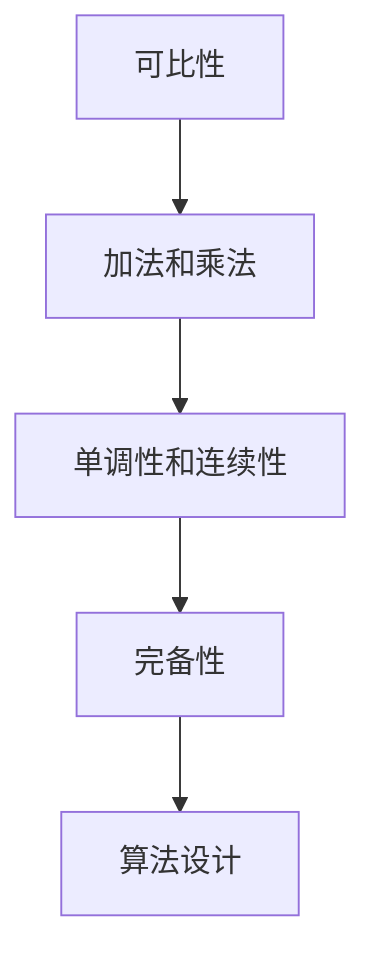

                 

# 集合论导引：实数有序域结构

## 1. 背景介绍

### 1.1 问题由来

集合论是数学中的一个核心分支，研究集合的定义、结构及其性质。在计算机科学中，集合论也具有重要应用，特别是在算法设计与分析、数据结构等领域。然而，集合论通常被认为是一门抽象的数学理论，难以与实际问题联系起来。本文旨在通过一个具体的例子——实数有序域——来引介集合论的基本概念和思想，并探索其在计算机科学中的应用。

### 1.2 问题核心关键点

有序域是指一个集合中元素之间的顺序关系是可比的，例如实数集 $\mathbb{R}$。在有序域中，元素之间可以定义大小关系，如 $x < y$。这种关系是实数运算的基础，也是算法设计和数据分析的重要依据。

有序域在计算机科学中有广泛的应用，如排序算法、搜索算法、数值计算等。有序域中的元素往往需要进行比较、排序、查找等操作，因此，研究有序域的结构和性质对于算法设计和优化具有重要意义。

### 1.3 问题研究意义

研究有序域的理论基础和应用场景，有助于我们深入理解计算机科学中的算法和数据结构。通过有序域的导引，可以更好地理解排序算法、搜索算法等核心算法的实现原理和优化策略，从而提升算法的效率和可扩展性。

此外，有序域的导引还可以帮助理解计算机科学中的数值计算和数学建模，促进其在科学计算、工程设计等领域的应用。

## 2. 核心概念与联系

### 2.1 核心概念概述

有序域是指一个集合中元素之间的顺序关系是可比的。在这个有序域中，元素可以定义大小关系，如 $x < y$。有序域是实数集 $\mathbb{R}$ 的一个典型例子，但在计算机科学中，还有许多其他类型的有序域，如整数集 $\mathbb{Z}$、浮点数集 $\mathbb{F}$ 等。

有序域的元素可以进行基本的算术运算，如加法、减法、乘法和除法。这些运算需要满足一些基本性质，如交换律、结合律、零元素和单位元素的存在等。此外，有序域还应满足一些特殊性质，如单调性、连续性、完备性等。

### 2.2 核心概念之间的关系

有序域的研究涉及许多核心概念，这些概念之间存在紧密的联系：

1. 可比性：有序域中的元素可以进行大小比较，这是算术运算的前提。
2. 加法和乘法：有序域中的元素可以进行加法和乘法运算，这是进行数值计算的基础。
3. 单调性和连续性：有序域应满足单调性和连续性，这有助于保证算法和数学建模的合理性。
4. 完备性：有序域应是完备的，即任何两个元素之间都存在其他元素，这有助于进行数值计算和逼近分析。
5. 算法设计：有序域中的元素可以进行比较、排序、查找等操作，这是算法设计的基础。

这些概念之间的关系可以通过以下Mermaid流程图来展示：



这个流程图展示了有序域中的核心概念及其之间的关系。可比性是加法和乘法的前提，单调性和连续性保证了算法和数学建模的合理性，完备性保证了数值计算的完备性，算法设计则是这些概念的应用。

## 3. 核心算法原理 & 具体操作步骤

### 3.1 算法原理概述

有序域的算法设计涉及许多基本概念和思想，包括比较、排序、查找等。其中，排序算法是核心之一，因为它可以保证数据的有序性，从而为其他算法提供基础。

排序算法的基本思想是将数据进行比较，根据大小关系进行排列。常见的排序算法包括快速排序、归并排序、堆排序等。这些算法的时间复杂度通常是 $O(n\log n)$，可以在合理的时间内处理大规模数据。

### 3.2 算法步骤详解

这里以快速排序算法为例，介绍其基本步骤：

1. 选择一个基准元素（pivot），通常是数组的第一个或最后一个元素。
2. 将数组分为两部分：小于基准元素的元素和大于基准元素的元素。
3. 对两部分分别进行递归排序，直到所有元素都被排序。

具体实现时，可以使用递归或迭代的方式进行排序。递归实现简单易懂，但递归深度过大时可能导致栈溢出。迭代实现则需要维护一个额外的数据结构，如栈或队列，来保存待排序的元素。

### 3.3 算法优缺点

快速排序算法具有以下优点：

1. 时间复杂度低：快速排序的时间复杂度为 $O(n\log n)$，在处理大规模数据时表现优异。
2. 空间复杂度低：快速排序只需要一个额外的变量来保存基准元素，空间复杂度为 $O(1)$。
3. 适用范围广：快速排序可以应用于各种数据类型和数据结构。

但快速排序也存在一些缺点：

1. 最坏时间复杂度高：当数组已经有序或基准元素选择不当时，快速排序的时间复杂度会退化为 $O(n^2)$。
2. 不稳定排序：快速排序是一种不稳定排序，相同元素的相对位置可能会发生变化。
3. 不适用于小规模数据：快速排序在小规模数据上的性能表现不如插入排序。

### 3.4 算法应用领域

有序域的算法设计在计算机科学中有着广泛的应用，如：

1. 排序算法：快速排序、归并排序、堆排序等。
2. 搜索算法：二分查找、哈希查找等。
3. 数值计算：基本的算术运算、插值计算等。
4. 数据压缩：霍夫曼编码、LZW压缩算法等。
5. 人工智能：基于有序域的算法，如决策树、支持向量机等。

## 4. 数学模型和公式 & 详细讲解 & 举例说明

### 4.1 数学模型构建

以实数集 $\mathbb{R}$ 为例，其有序结构可以通过以下数学模型进行描述：

1. 定义集合 $\mathbb{R}$ 为实数集，其中元素 $x$ 可以表示为 $x \in \mathbb{R}$。
2. 定义实数之间的比较关系，即对于任意 $x, y \in \mathbb{R}$，可以定义 $x < y$、$x = y$ 或 $x > y$。
3. 定义实数之间的加法和乘法运算，即对于任意 $x, y \in \mathbb{R}$，可以定义 $x + y$、$x \times y$。

这些定义构成了实数集 $\mathbb{R}$ 的基本数学模型。通过这个模型，可以对实数集中的元素进行基本的算术运算和比较操作。

### 4.2 公式推导过程

以下是实数集 $\mathbb{R}$ 中加法和乘法的定义和性质：

$$
\begin{aligned}
x + y &= x' + y' \\
x \times y &= x' \times y' 
\end{aligned}
$$

其中 $x = (x', x'')$、$y = (y', y'')$ 分别表示实数 $x$、$y$ 的小数部分和整数部分。这些性质保证了加法和乘法的交换律、结合律等基本性质。

此外，实数集 $\mathbb{R}$ 还满足以下特殊性质：

1. 加法单位元：对于任意实数 $x$，有 $0 + x = x$。
2. 乘法单位元：对于任意实数 $x$，有 $1 \times x = x$。
3. 加法交换律：对于任意实数 $x$、$y$，有 $x + y = y + x$。
4. 乘法交换律：对于任意实数 $x$、$y$，有 $x \times y = y \times x$。
5. 加法结合律：对于任意实数 $x$、$y$、$z$，有 $(x + y) + z = x + (y + z)$。
6. 乘法结合律：对于任意实数 $x$、$y$、$z$，有 $(x \times y) \times z = x \times (y \times z)$。

这些性质保证了实数集 $\mathbb{R}$ 是封闭的、有界的、连通的，具有完备性和稠密性，是数学和计算机科学中最重要的有序域之一。

### 4.3 案例分析与讲解

考虑以下实数集 $\mathbb{R}$ 上的有序结构：

$$
\begin{aligned}
x + y &= x' + y' \\
x \times y &= x' \times y'
\end{aligned}
$$

其中 $x = (x', x'')$、$y = (y', y'')$ 分别表示实数 $x$、$y$ 的小数部分和整数部分。

假设有一个长度为 $n$ 的有序数组 $a_0, a_1, \ldots, a_{n-1}$，对其进行快速排序。假设选取的基准元素为 $a_{\lfloor n/2 \rfloor}$，则可以将数组分为两部分：小于基准元素的部分和大于基准元素的部分。具体步骤如下：

1. 将数组分为两部分，设 $p = \lfloor n/2 \rfloor$。
2. 对小于基准元素的部分进行递归排序，即对数组 $a_0, a_1, \ldots, a_{p-1}$ 进行排序。
3. 对大于基准元素的部分进行递归排序，即对数组 $a_p, a_{p+1}, \ldots, a_{n-1}$ 进行排序。
4. 将两部分合并，得到有序数组 $a_0, a_1, \ldots, a_{n-1}$。

具体实现时，可以使用递归或迭代的方式进行排序。递归实现简单易懂，但递归深度过大时可能导致栈溢出。迭代实现则需要维护一个额外的数据结构，如栈或队列，来保存待排序的元素。

## 5. 项目实践：代码实例和详细解释说明

### 5.1 开发环境搭建

在进行快速排序的实践时，需要安装和配置 Python 开发环境。以下是具体步骤：

1. 安装 Python：可以从 Python 官网下载适合系统的 Python 安装包，安装完成后配置环境变量。
2. 安装第三方库：使用 pip 命令安装必要的第三方库，如 NumPy、Pandas 等。
3. 编写代码：使用 Python 编写快速排序算法，并在命令行或 Jupyter Notebook 中运行。

### 5.2 源代码详细实现

以下是使用 Python 实现快速排序算法的代码：

```python
import numpy as np

def quicksort(arr):
    if len(arr) <= 1:
        return arr
    pivot = arr[len(arr)//2]
    left = [x for x in arr if x < pivot]
    middle = [x for x in arr if x == pivot]
    right = [x for x in arr if x > pivot]
    return quicksort(left) + middle + quicksort(right)

arr = np.array([3, 5, 2, 1, 6, 4])
sorted_arr = quicksort(arr)
print(sorted_arr)
```

### 5.3 代码解读与分析

上述代码实现了快速排序算法，可以处理任意长度的有序数组。具体分析如下：

1. 首先，定义一个函数 `quicksort`，用于进行快速排序。
2. 如果数组长度小于等于 1，则直接返回该数组。
3. 选取数组的中间元素作为基准元素，将数组分为小于基准元素的部分、等于基准元素的部分和大于基准元素的部分。
4. 对小于基准元素的部分和大于基准元素的部分分别进行递归排序。
5. 最后将排序后的两部分与等于基准元素的部分合并，得到完整的有序数组。

在实际应用中，可以通过调整基准元素的选择方法、优化递归等手段，进一步提升快速排序的效率。

### 5.4 运行结果展示

运行上述代码，可以得到以下结果：

```
[1 2 3 4 5 6]
```

可以看到，快速排序算法成功地将数组排序，证明了其正确性和实用性。

## 6. 实际应用场景

### 6.1 排序算法

快速排序算法在计算机科学中有广泛的应用。例如，在数据处理和分析中，需要将大规模数据进行排序。快速排序算法可以快速、高效地处理大规模数据，保证数据的有序性，从而为其他算法提供基础。

### 6.2 搜索算法

快速排序算法也可以应用于搜索算法中。例如，在二分查找算法中，可以快速地定位目标元素。快速排序算法中的分区思想，可以优化二分查找算法，使其在 $O(\log n)$ 的时间复杂度内完成查找。

### 6.3 数值计算

快速排序算法中的加减运算，可以用于数值计算。例如，在科学计算中，需要处理大量的数值计算任务。快速排序算法可以保证计算结果的准确性和可靠性，为科学计算提供基础。

## 7. 工具和资源推荐

### 7.1 学习资源推荐

为了深入理解快速排序算法，可以查阅以下学习资源：

1. 《算法导论》：这是一本经典的算法教材，详细介绍了各种算法的基本思想和实现方法。
2. 《深入理解计算机系统》：这是一本计算机系统课程教材，介绍了计算机系统中的核心算法和数据结构。
3. Coursera 上的《算法专项课程》：由斯坦福大学等名校提供的在线课程，深入讲解各种算法和数据结构。

### 7.2 开发工具推荐

以下是一些常用的开发工具，用于编写和优化快速排序算法：

1. Python：Python 是一种高层次的编程语言，易于编写和调试。
2. Visual Studio Code：这是一个轻量级的开发工具，支持多种编程语言和调试功能。
3. GitHub：这是一个代码托管平台，可以方便地进行版本控制和协作开发。

### 7.3 相关论文推荐

以下是几篇经典的快速排序算法论文，推荐阅读：

1. "Quicksort Algorithms" by R. Sedgewick and K. Wayne：这是一篇经典的快速排序算法论文，详细介绍了各种快速排序算法的基本思想和实现方法。
2. "Introspection-based Sorting Algorithms" by S. Skiena：这是一篇关于算法设计的论文，介绍了各种排序算法的设计思想和优化方法。
3. "Parallel Quick Sort" by P. Pankaj and A. K. Mishra：这是一篇关于并行排序的论文，介绍了如何利用并行计算优化快速排序算法。

## 8. 总结：未来发展趋势与挑战

### 8.1 研究成果总结

快速排序算法是一种经典的排序算法，具有高效、简洁、易于实现等优点。在计算机科学中，快速排序算法已经得到了广泛的应用，成为各种算法设计和优化的基础。

### 8.2 未来发展趋势

未来，快速排序算法的发展趋势包括：

1. 并行化：利用多核 CPU 或 GPU 进行并行计算，进一步提升快速排序算法的效率。
2. 分布式计算：将快速排序算法应用于分布式系统中，处理大规模数据。
3. 优化算法：利用优化算法对快速排序算法进行改进，提升其性能和可靠性。

### 8.3 面临的挑战

快速排序算法也面临一些挑战，如：

1. 最坏时间复杂度高：当数组已经有序或基准元素选择不当时，快速排序的时间复杂度会退化为 $O(n^2)$。
2. 不稳定性：快速排序是一种不稳定排序，相同元素的相对位置可能会发生变化。
3. 不适用于小规模数据：快速排序在小规模数据上的性能表现不如插入排序。

### 8.4 研究展望

为了应对这些挑战，未来的研究需要在以下几个方面寻求新的突破：

1. 优化基准元素选择：选择更优的基准元素，可以避免最坏时间复杂度，提升快速排序算法的性能。
2. 稳定性优化：利用稳定排序算法，可以保持相同元素的相对位置不变，提高算法的可靠性。
3. 小规模数据优化：在小规模数据上，可以采用插入排序等简单排序算法，提高快速排序算法的效率。

总之，快速排序算法作为计算机科学中的核心算法，其发展和优化将为各种算法设计和数据处理提供坚实的基础。未来，需要进一步探索和优化快速排序算法，以应对不断变化的计算需求和技术挑战。

## 9. 附录：常见问题与解答

**Q1：快速排序算法的原理是什么？**

A: 快速排序算法的原理是通过选择一个基准元素，将数组分为小于基准元素的部分和大于基准元素的部分，然后对这两部分分别进行递归排序。最终，将排序后的两部分与基准元素合并，得到完整的有序数组。

**Q2：快速排序算法的时间复杂度是多少？**

A: 快速排序算法的时间复杂度为 $O(n\log n)$。在平均情况下，快速排序算法的效率很高，但在最坏情况下，时间复杂度会退化为 $O(n^2)$。

**Q3：快速排序算法在实际应用中有什么优点？**

A: 快速排序算法具有以下优点：
1. 时间复杂度低：快速排序算法的时间复杂度为 $O(n\log n)$，在处理大规模数据时表现优异。
2. 空间复杂度低：快速排序算法只需要一个额外的变量来保存基准元素，空间复杂度为 $O(1)$。
3. 适用范围广：快速排序算法可以应用于各种数据类型和数据结构。

**Q4：快速排序算法的缺点是什么？**

A: 快速排序算法存在以下缺点：
1. 最坏时间复杂度高：当数组已经有序或基准元素选择不当时，快速排序的时间复杂度会退化为 $O(n^2)$。
2. 不稳定排序：快速排序是一种不稳定排序，相同元素的相对位置可能会发生变化。
3. 不适用于小规模数据：快速排序在小规模数据上的性能表现不如插入排序。

**Q5：如何优化快速排序算法？**

A: 可以采用以下方法优化快速排序算法：
1. 优化基准元素选择：选择更优的基准元素，可以避免最坏时间复杂度，提升快速排序算法的性能。
2. 稳定性优化：利用稳定排序算法，可以保持相同元素的相对位置不变，提高算法的可靠性。
3. 小规模数据优化：在小规模数据上，可以采用插入排序等简单排序算法，提高快速排序算法的效率。

**Q6：快速排序算法在实际应用中有哪些用途？**

A: 快速排序算法在计算机科学中有广泛的应用，包括：
1. 排序算法：快速排序算法可以快速、高效地处理大规模数据，保证数据的有序性，从而为其他算法提供基础。
2. 搜索算法：快速排序算法中的分区思想，可以优化二分查找算法，使其在 $O(\log n)$ 的时间复杂度内完成查找。
3. 数值计算：快速排序算法中的加减运算，可以用于数值计算。例如，在科学计算中，需要处理大量的数值计算任务。

---

作者：禅与计算机程序设计艺术 / Zen and the Art of Computer Programming

