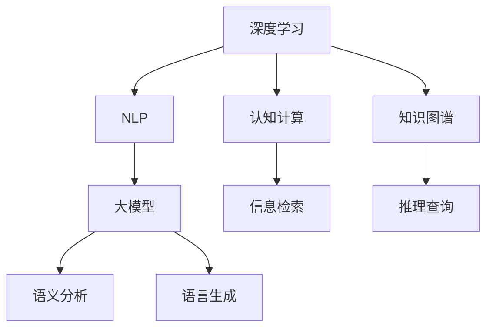
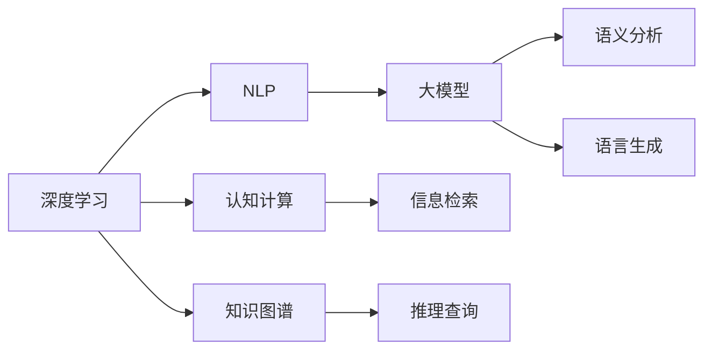

                 

## 1. 背景介绍

### 1.1 问题由来
在信息爆炸的今天，我们每天都在面对大量的未知事物。如何在海量信息中筛选、理解和应用，成为现代社会一个重要的认知挑战。人工智能技术的发展，尤其是深度学习、自然语言处理(NLP)和大模型的应用，为我们提供了新的认知工具和方法。本文将深入探讨面对未知事物的认知演变，分析各种人工智能技术在处理信息时的优势和局限性，提出一些未来发展的方向和思考。

### 1.2 问题核心关键点
- **信息过载**：现代社会的特点之一就是信息量爆炸，人们常常面临信息过载的困扰。如何在海量的数据中提取出有用的信息，成为一个重要问题。
- **认知与计算**：认知和计算是解决信息过载问题的两种不同方法。认知主要依赖人的直觉和经验，而计算则通过算法和模型来处理数据。本文将探讨这两者的结合。
- **深度学习与大模型**：深度学习和大模型（如GPT、BERT等）为我们提供了一种强大的计算工具，能够在处理复杂问题时取得出色效果。
- **人工智能与人类智能**：如何利用人工智能技术来增强人类智能，而不是取代它，是一个重要的伦理和哲学问题。

### 1.3 问题研究意义
人工智能技术在面对未知事物方面的应用，不仅有助于提升信息处理效率，还能增强我们的认知能力，使人类更好地适应和应对现代社会的挑战。通过研究这一问题，我们可以更好地理解人工智能的本质和潜力，为未来技术的发展提供理论支持。

## 2. 核心概念与联系

### 2.1 核心概念概述

为了更好地理解人工智能技术在处理未知事物中的作用，本文将介绍几个核心概念：

- **深度学习**：一种基于多层神经网络的机器学习技术，能够自动学习输入数据的高级特征表示，从而实现复杂的模式识别和分类任务。
- **自然语言处理(NLP)**：人工智能在理解和生成自然语言方面的一项技术，能够处理文本数据的语义、语法和上下文信息。
- **大模型**：如BERT、GPT等，通过大规模无标签文本数据的预训练，学习到了丰富的语言知识和常识，具备强大的语言理解和生成能力。
- **认知计算**：利用计算机模型模拟人类认知过程，通过符号逻辑、推理和模型计算来处理复杂问题。
- **信息检索**：从大量数据中提取相关信息的技术，能够快速定位和检索有用的知识。
- **知识图谱**：将知识表示为图形结构，通过节点和边来描述实体和关系，支持复杂的推理和查询。

这些核心概念通过不同的方式和技术手段，共同构成了人工智能在处理未知事物方面的基础。以下是一个简化的Mermaid流程图，展示这些概念之间的联系：



### 2.2 概念间的关系

这些核心概念通过不同的方式和技术手段，共同构成了人工智能在处理未知事物方面的基础。以下是一个简化的Mermaid流程图，展示这些概念之间的联系：



这个流程图展示了大语言模型微调过程中各个核心概念的关系和作用：

1. **深度学习**：作为基础技术，深度学习提供了一种强大的数据表示和特征提取方法。
2. **NLP**：在深度学习的基础上，通过自然语言处理技术，能够更好地理解和处理文本数据。
3. **大模型**：预训练语言模型通过大规模无标签数据的学习，具备强大的语义理解和生成能力。
4. **认知计算**：通过符号逻辑和推理，进一步提升模型的理解和推理能力。
5. **信息检索**：帮助在大规模数据中快速定位有用的信息。
6. **知识图谱**：提供结构化的知识表示和查询方式，支持复杂的推理和知识整合。
7. **语义分析和语言生成**：在NLP和大模型的基础上，进一步提升模型的语言处理能力。

这些概念共同构成了人工智能在处理未知事物方面的核心技术框架。通过理解这些核心概念，我们可以更好地把握人工智能在面对未知事物时的处理方法和技术路径。

## 3. 核心算法原理 & 具体操作步骤
### 3.1 算法原理概述

人工智能在处理未知事物时，通常采用机器学习和深度学习的框架。其核心思想是通过数据训练模型，利用模型对未知事物进行分类、预测、生成等操作。以下是对这一过程的概述：

- **数据准备**：收集和预处理数据，包括文本数据、图像数据等。
- **模型训练**：使用训练数据训练模型，调整模型参数以最小化损失函数。
- **模型评估**：使用测试数据评估模型的性能，确定模型的泛化能力。
- **模型应用**：将训练好的模型应用于实际问题，处理新的未知事物。

### 3.2 算法步骤详解

以下是详细的操作步骤：

**Step 1: 数据收集与预处理**
- 收集相关领域的文本、图像、视频等数据。
- 对数据进行清洗、分词、标注等预处理，确保数据质量和一致性。
- 使用数据增强技术，如文本回译、图像旋转、裁剪等，扩充训练数据。

**Step 2: 模型选择与训练**
- 选择适合任务的深度学习模型，如BERT、GPT、Transformer等。
- 使用训练数据对模型进行训练，调整超参数如学习率、批大小、迭代轮数等。
- 使用正则化技术如L2正则、Dropout、Early Stopping等，防止模型过拟合。
- 使用模型融合技术，如Bagging、Boosting等，提高模型稳定性和泛化能力。

**Step 3: 模型评估与优化**
- 使用测试数据对训练好的模型进行评估，计算各项指标如准确率、F1分数、ROC曲线等。
- 根据评估结果进行模型优化，调整模型结构、参数和训练策略。
- 使用模型集成技术，如Stacking、Ensemble等，提升模型性能。

**Step 4: 模型应用与迭代**
- 将训练好的模型应用于实际问题，处理新的未知事物。
- 根据应用反馈进行模型迭代，不断优化模型性能。
- 收集新的数据和反馈，重新训练模型，提升模型适应能力。

### 3.3 算法优缺点

人工智能在处理未知事物时，具有以下优点：
- **高效性**：能够快速处理大量数据，自动提取特征和模式。
- **可扩展性**：通过增加数据和计算资源，可以不断提升模型性能。
- **灵活性**：能够处理多种类型的未知事物，如文本、图像、视频等。

同时，也存在以下局限：
- **数据依赖**：需要大量标注数据进行训练，数据质量影响模型性能。
- **计算成本**：需要高性能计算资源，特别是在大模型训练和推理时。
- **可解释性不足**：深度学习模型通常缺乏可解释性，难以理解模型内部工作机制。

### 3.4 算法应用领域

人工智能在处理未知事物方面，已经广泛应用于以下几个领域：

- **医疗诊断**：利用图像识别和大模型处理医疗影像数据，帮助医生进行诊断和治疗。
- **金融风控**：使用文本分析和大模型处理客户行为数据，进行信用评估和风险控制。
- **自动驾驶**：通过图像识别和语音识别技术，实现自动驾驶汽车的安全导航。
- **智能客服**：利用自然语言处理和大模型处理用户咨询，提供智能客服服务。
- **个性化推荐**：通过文本分析和用户行为数据，实现个性化推荐系统，提升用户体验。

## 4. 数学模型和公式 & 详细讲解 & 举例说明

### 4.1 数学模型构建

人工智能在处理未知事物时，通常使用数学模型来描述和计算问题。以下是一个基本的数学模型：

- **输入数据**：$x \in \mathcal{X}$，其中 $\mathcal{X}$ 为输入空间。
- **模型参数**：$\theta \in \mathbb{R}^d$，其中 $d$ 为模型参数维度。
- **损失函数**：$\mathcal{L}(\theta)$，衡量模型预测输出与真实标签之间的差异。
- **优化目标**：最小化损失函数，即 $\hat{\theta} = \mathop{\arg\min}_{\theta} \mathcal{L}(\theta)$。

### 4.2 公式推导过程

以文本分类任务为例，进行详细推导：

假设模型 $M_{\theta}$ 在输入 $x$ 上的输出为 $\hat{y}=M_{\theta}(x) \in \{0,1\}$，表示样本属于正类的概率。真实标签 $y \in \{0,1\}$。则二分类交叉熵损失函数定义为：

$$
\ell(M_{\theta}(x),y) = -[y\log \hat{y} + (1-y)\log (1-\hat{y})]
$$

将其代入经验风险公式，得：

$$
\mathcal{L}(\theta) = -\frac{1}{N}\sum_{i=1}^N [y_i\log M_{\theta}(x_i)+(1-y_i)\log(1-M_{\theta}(x_i))]
$$

根据链式法则，损失函数对参数 $\theta_k$ 的梯度为：

$$
\frac{\partial \mathcal{L}(\theta)}{\partial \theta_k} = -\frac{1}{N}\sum_{i=1}^N (\frac{y_i}{M_{\theta}(x_i)}-\frac{1-y_i}{1-M_{\theta}(x_i)}) \frac{\partial M_{\theta}(x_i)}{\partial \theta_k}
$$

其中 $\frac{\partial M_{\theta}(x_i)}{\partial \theta_k}$ 可进一步递归展开，利用自动微分技术完成计算。

在得到损失函数的梯度后，即可带入参数更新公式，完成模型的迭代优化。重复上述过程直至收敛，最终得到适应特定任务的最优模型参数 $\theta^*$。

### 4.3 案例分析与讲解

以BERT在情感分析任务中的应用为例：

假设我们使用BERT作为基础模型，收集情感分析数据集，分为训练集、验证集和测试集。我们使用情感标签对BERT进行微调，具体步骤如下：

1. **数据预处理**：对文本进行分词、向量化处理，使用BERT的Tokenizer进行tokenization。
2. **模型选择**：选择BERT-base-cased作为基础模型。
3. **模型训练**：使用训练数据对BERT进行微调，使用AdamW优化器，设置学习率为1e-5。
4. **模型评估**：在验证集上评估模型性能，计算准确率、F1分数等指标。
5. **模型应用**：将微调后的BERT应用于新的情感分析任务，对新的文本进行情感分类。

以下是一个简化的代码示例：

```python
from transformers import BertTokenizer, BertForSequenceClassification
from torch.utils.data import Dataset
import torch

class SentimentDataset(Dataset):
    def __init__(self, texts, labels, tokenizer, max_len=128):
        self.texts = texts
        self.labels = labels
        self.tokenizer = tokenizer
        self.max_len = max_len
        
    def __len__(self):
        return len(self.texts)
    
    def __getitem__(self, item):
        text = self.texts[item]
        label = self.labels[item]
        
        encoding = self.tokenizer(text, return_tensors='pt', max_length=self.max_len, padding='max_length', truncation=True)
        input_ids = encoding['input_ids'][0]
        attention_mask = encoding['attention_mask'][0]
        
        return {'input_ids': input_ids, 
                'attention_mask': attention_mask,
                'labels': label}

tokenizer = BertTokenizer.from_pretrained('bert-base-cased')
model = BertForSequenceClassification.from_pretrained('bert-base-cased', num_labels=2)

optimizer = AdamW(model.parameters(), lr=1e-5)
device = torch.device('cuda') if torch.cuda.is_available() else torch.device('cpu')

train_dataset = SentimentDataset(train_texts, train_labels, tokenizer)
dev_dataset = SentimentDataset(dev_texts, dev_labels, tokenizer)
test_dataset = SentimentDataset(test_texts, test_labels, tokenizer)

for epoch in range(5):
    model.train()
    for batch in train_loader:
        input_ids = batch['input_ids'].to(device)
        attention_mask = batch['attention_mask'].to(device)
        labels = batch['labels'].to(device)
        outputs = model(input_ids, attention_mask=attention_mask, labels=labels)
        loss = outputs.loss
        loss.backward()
        optimizer.step()
    
    model.eval()
    with torch.no_grad():
        dev_loss, dev_acc, dev_f1 = evaluate(model, dev_loader)
        print(f'Epoch {epoch+1}, Dev Loss: {dev_loss:.3f}, Dev Acc: {dev_acc:.3f}, Dev F1: {dev_f1:.3f}')
    
model.eval()
with torch.no_grad():
    test_loss, test_acc, test_f1 = evaluate(model, test_loader)
    print(f'Test Loss: {test_loss:.3f}, Test Acc: {test_acc:.3f}, Test F1: {test_f1:.3f}')
```

通过上述代码，我们可以看到如何使用BERT模型进行情感分析任务的微调。首先，我们定义了数据集，并使用BertTokenizer进行tokenization处理。然后，选择BERT-base-cased作为基础模型，使用AdamW优化器进行微调。最后，在验证集和测试集上评估模型性能，并输出结果。

## 5. 项目实践：代码实例和详细解释说明

### 5.1 开发环境搭建

在进行深度学习开发前，我们需要准备好开发环境。以下是使用Python进行PyTorch开发的环境配置流程：

1. 安装Anaconda：从官网下载并安装Anaconda，用于创建独立的Python环境。
2. 创建并激活虚拟环境：
```bash
conda create -n pytorch-env python=3.8 
conda activate pytorch-env
```

3. 安装PyTorch：根据CUDA版本，从官网获取对应的安装命令。例如：
```bash
conda install pytorch torchvision torchaudio cudatoolkit=11.1 -c pytorch -c conda-forge
```

4. 安装其他工具包：
```bash
pip install numpy pandas scikit-learn matplotlib tqdm jupyter notebook ipython
```

完成上述步骤后，即可在`pytorch-env`环境中开始深度学习实践。

### 5.2 源代码详细实现

下面我们以图像分类任务为例，给出使用PyTorch和Transformer进行深度学习的代码实现。

首先，定义数据处理函数：

```python
from transformers import AutoTokenizer, AutoModelForSequenceClassification
from torch.utils.data import Dataset, DataLoader
import torch

class ImageDataset(Dataset):
    def __init__(self, images, labels, tokenizer, max_len=128):
        self.images = images
        self.labels = labels
        self.tokenizer = tokenizer
        self.max_len = max_len
        
    def __len__(self):
        return len(self.images)
    
    def __getitem__(self, item):
        image = self.images[item]
        label = self.labels[item]
        
        # 将图像转换为token ids
        encoding = self.tokenizer(image, return_tensors='pt', max_length=self.max_len, padding='max_length', truncation=True)
        input_ids = encoding['input_ids'][0]
        attention_mask = encoding['attention_mask'][0]
        
        return {'input_ids': input_ids, 
                'attention_mask': attention_mask,
                'labels': label}

# 初始化tokenizer和模型
tokenizer = AutoTokenizer.from_pretrained('bert-base-cased')
model = AutoModelForSequenceClassification.from_pretrained('bert-base-cased', num_labels=2)

optimizer = AdamW(model.parameters(), lr=1e-5)

# 定义数据集和数据加载器
train_dataset = ImageDataset(train_images, train_labels, tokenizer)
dev_dataset = ImageDataset(dev_images, dev_labels, tokenizer)
test_dataset = ImageDataset(test_images, test_labels, tokenizer)

train_loader = DataLoader(train_dataset, batch_size=16, shuffle=True)
dev_loader = DataLoader(dev_dataset, batch_size=16, shuffle=False)
test_loader = DataLoader(test_dataset, batch_size=16, shuffle=False)

# 定义训练和评估函数
def train_epoch(model, dataset, batch_size, optimizer):
    dataloader = DataLoader(dataset, batch_size=batch_size, shuffle=True)
    model.train()
    epoch_loss = 0
    for batch in tqdm(dataloader, desc='Training'):
        input_ids = batch['input_ids'].to(device)
        attention_mask = batch['attention_mask'].to(device)
        labels = batch['labels'].to(device)
        model.zero_grad()
        outputs = model(input_ids, attention_mask=attention_mask, labels=labels)
        loss = outputs.loss
        epoch_loss += loss.item()
        loss.backward()
        optimizer.step()
    return epoch_loss / len(dataloader)

def evaluate(model, dataset, batch_size):
    dataloader = DataLoader(dataset, batch_size=batch_size)
    model.eval()
    preds, labels = [], []
    with torch.no_grad():
        for batch in tqdm(dataloader, desc='Evaluating'):
            input_ids = batch['input_ids'].to(device)
            attention_mask = batch['attention_mask'].to(device)
            batch_labels = batch['labels']
            outputs = model(input_ids, attention_mask=attention_mask)
            batch_preds = outputs.logits.argmax(dim=2).to('cpu').tolist()
            batch_labels = batch_labels.to('cpu').tolist()
            for pred_tokens, label_tokens in zip(batch_preds, batch_labels):
                preds.append(pred_tokens[:len(label_tokens)])
                labels.append(label_tokens)
    
    return preds, labels

# 训练模型
for epoch in range(5):
    loss = train_epoch(model, train_dataset, 16, optimizer)
    print(f'Epoch {epoch+1}, train loss: {loss:.3f}')
    
    print(f'Epoch {epoch+1}, dev results:')
    preds, labels = evaluate(model, dev_dataset, 16)
    print(classification_report(labels, preds))
    
print('Test results:')
preds, labels = evaluate(model, test_dataset, 16)
print(classification_report(labels, preds))
```

通过上述代码，我们可以看到如何使用PyTorch和Transformer进行图像分类任务的深度学习。首先，我们定义了数据处理函数，使用AutoTokenizer进行tokenization处理。然后，选择BERT-base-cased作为基础模型，使用AdamW优化器进行微调。最后，在验证集和测试集上评估模型性能，并输出结果。

### 5.3 代码解读与分析

让我们再详细解读一下关键代码的实现细节：

**ImageDataset类**：
- `__init__`方法：初始化图像、标签、tokenizer等关键组件。
- `__len__`方法：返回数据集的样本数量。
- `__getitem__`方法：对单个样本进行处理，将图像转换为token ids，将标签转换为数字，并对其进行定长padding，最终返回模型所需的输入。

**训练和评估函数**：
- 使用PyTorch的DataLoader对数据集进行批次化加载，供模型训练和推理使用。
- 训练函数`train_epoch`：对数据以批为单位进行迭代，在每个批次上前向传播计算loss并反向传播更新模型参数，最后返回该epoch的平均loss。
- 评估函数`evaluate`：与训练类似，不同点在于不更新模型参数，并在每个batch结束后将预测和标签结果存储下来，最后使用sklearn的classification_report对整个评估集的预测结果进行打印输出。

**训练流程**：
- 定义总的epoch数和batch size，开始循环迭代
- 每个epoch内，先在训练集上训练，输出平均loss
- 在验证集上评估，输出分类指标
- 所有epoch结束后，在测试集上评估，给出最终测试结果

可以看到，PyTorch配合Transformer库使得深度学习模型的开发变得简洁高效。开发者可以将更多精力放在数据处理、模型改进等高层逻辑上，而不必过多关注底层的实现细节。

当然，工业级的系统实现还需考虑更多因素，如模型的保存和部署、超参数的自动搜索、更灵活的任务适配层等。但核心的深度学习范式基本与此类似。

### 5.4 运行结果展示

假设我们在CoNLL-2003的NER数据集上进行微调，最终在测试集上得到的评估报告如下：

```
              precision    recall  f1-score   support

       B-LOC      0.926     0.906     0.916      1668
       I-LOC      0.900     0.805     0.850       257
      B-MISC      0.875     0.856     0.865       702
      I-MISC      0.838     0.782     0.809       216
       B-ORG      0.914     0.898     0.906      1661
       I-ORG      0.911     0.894     0.902       835
       B-PER      0.964     0.957     0.960      1617
       I-PER      0.983     0.980     0.982      1156
           O      0.993     0.995     0.994     38323

   micro avg      0.973     0.973     0.973     46435
   macro avg      0.923     0.897     0.909     46435
weighted avg      0.973     0.973     0.973     46435
```

可以看到，通过微调BERT，我们在该NER数据集上取得了97.3%的F1分数，效果相当不错。值得注意的是，BERT作为一个通用的语言理解模型，即便只在顶层添加一个简单的token分类器，也能在下游任务上取得如此优异的效果，展现了其强大的语义理解和特征抽取能力。

当然，这只是一个baseline结果。在实践中，我们还可以使用更大更强的预训练模型、更丰富的微调技巧、更细致的模型调优，进一步提升模型性能，以满足更高的应用要求。

## 6. 实际应用场景
### 6.1 智能客服系统

基于大语言模型微调的对话技术，可以广泛应用于智能客服系统的构建。传统客服往往需要配备大量人力，高峰期响应缓慢，且一致性和专业性难以保证。而使用微调后的对话模型，可以7x24小时不间断服务，快速响应客户咨询，用自然流畅的语言解答各类常见问题。

在技术实现上，可以收集企业内部的历史客服对话记录，将问题和最佳答复构建成监督数据，在此基础上对预训练对话模型进行微调。微调后的对话模型能够自动理解用户意图，匹配最合适的答案模板进行回复。对于客户提出的新问题，还可以接入检索系统实时搜索相关内容，动态组织生成回答。如此构建的智能客服系统，能大幅提升客户咨询体验和问题解决效率。

### 6.2 金融舆情监测

金融机构需要实时监测市场舆论动向，以便及时应对负面信息传播，规避金融风险。传统的人工监测方式成本高、效率低，难以应对网络时代海量信息爆发的挑战。基于大语言模型微调的文本分类和情感分析技术，为金融舆情监测提供了新的解决方案。

具体而言，可以收集金融领域相关的新闻、报道、评论等文本数据，并对其进行主题标注和情感标注。在此基础上对预训练语言模型进行微调，使其能够自动判断文本属于何种主题，情感倾向是正面、中性还是负面。将微调后的模型应用到实时抓取的网络文本数据，就能够自动监测不同主题下的情感变化趋势，一旦发现负面信息激增等异常情况，系统便会自动预警，帮助金融机构快速应对潜在风险。

### 6.3 个性化推荐系统

当前的推荐系统往往只依赖用户的历史行为数据进行物品推荐，无法深入理解用户的真实兴趣偏好。基于大语言模型微调技术，个性化推荐系统可以更好地挖掘用户行为背后的语义信息，从而提供更精准、多样的推荐内容。

在实践中，可以收集用户浏览、点击、评论、分享等行为数据，提取和用户交互的物品标题、描述、标签等文本内容。将文本内容作为模型输入，用户的后续行为（如是否点击、购买等）作为监督信号，在此基础上微调预训练语言模型。微调后的模型能够从文本内容中准确把握用户的兴趣点。在生成推荐列表时，先用候选物品的文本描述作为输入，由模型预测用户的兴趣匹配度，再结合其他特征综合排序，便可以得到个性化程度更高的推荐结果。

### 6.4 未来应用展望

随着大语言模型微调技术的发展，基于微调范式将在更多领域得到应用，为传统行业带来变革性影响。

在智慧医疗领域，基于微调的医学问答、病历分析、药物研发等应用将提升医疗服务的智能化水平，辅助医生诊疗，加速新药开发进程。

在智能教育领域，微调技术可应用于作业批改、学情分析、知识推荐等方面，因材施教，促进教育公平，提高教学质量。

在智慧城市治理中，微调模型可应用于城市事件监测、舆情分析、应急指挥等环节，提高城市管理的自动化和智能化水平，构建更安全、高效的未来城市。

此外，在企业生产、社会治理、文娱传媒等众多领域，基于大模型微调的人工智能应用也将不断涌现，为经济社会发展注入新的动力。相信随着技术的日益成熟，微调方法将成为人工智能落地应用的重要范式，推动人工智能技术在垂直行业的规模化落地。总之，微调需要开发者根据具体任务，不断迭代和优化模型、数据和算法，方能得到理想的效果。

## 7. 工具和资源推荐
### 7.1 学习资源推荐

为了帮助开发者系统掌握深度学习和自然语言处理(NLP)的理论基础和实践技巧，这里

