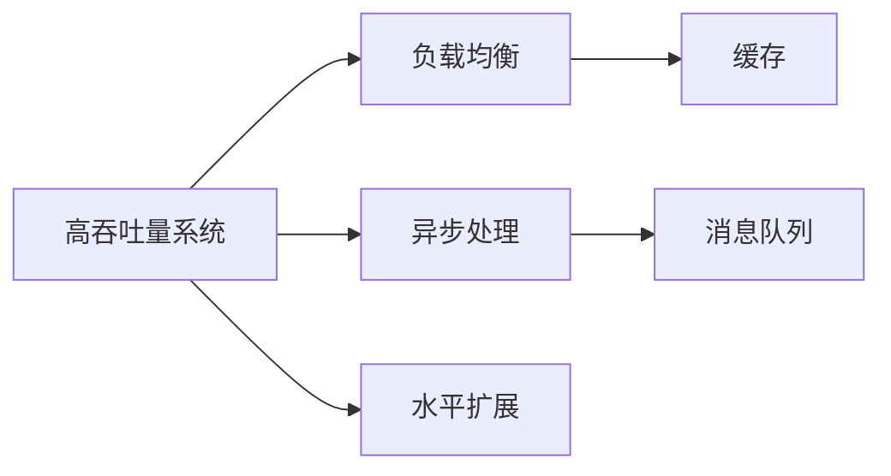

                 

# 高吞吐量系统设计的实例分析

## 1. 背景介绍

在当今互联网时代，系统的吞吐量（Throughput）即每秒处理的请求数量，成为衡量其性能的重要指标。随着业务场景的多样化和复杂化，高吞吐量系统的设计和优化成为一个关键问题。本文将通过一系列实例，分析高吞吐量系统的设计原理和实际应用，以期为系统架构师和开发人员提供可行的方案和参考。

## 2. 核心概念与联系

### 2.1 核心概念概述

为更好地理解高吞吐量系统设计的核心概念和架构，本节将介绍几个关键概念及其相互关系：

- **高吞吐量系统（High Throughput System）**：指能够高效处理大量并发请求，保证系统性能稳定的系统。
- **负载均衡（Load Balancing）**：通过将请求均匀分布到多个节点上，避免单点压力过大，提升系统吞吐量。
- **异步处理（Asynchronous Processing）**：采用非阻塞I/O和事件驱动机制，提高系统并发处理能力。
- **水平扩展（Scalability）**：通过增加硬件资源（如CPU、内存、磁盘等）或服务实例，提升系统处理能力。
- **缓存（Caching）**：利用内存存储最近访问的数据，减少数据库等后端系统的压力。
- **消息队列（Message Queue）**：通过队列机制协调系统不同组件间的任务调度，保证系统稳定可靠。

这些概念通过下图的Mermaid流程图进行关联展示：



这个流程图展示了高吞吐量系统设计中的关键概念及其相互关系：

- **负载均衡**：确保请求能够均匀分布到多个节点上，避免单点瓶颈。
- **异步处理**：提高系统的并发处理能力，减少I/O等待时间。
- **水平扩展**：通过增加资源，提升系统的处理能力。
- **缓存**：减少后端系统的压力，提高响应速度。
- **消息队列**：协调系统组件间的任务调度，提高系统的可靠性和可扩展性。

### 2.2 概念间的关系

通过以上流程图，我们可以更清晰地理解高吞吐量系统设计的核心概念及其相互关系：

- **负载均衡与异步处理**：负载均衡通过将请求均匀分发到多个节点上，利用异步处理机制提升每个节点的并发处理能力。
- **水平扩展与缓存**：通过增加硬件资源和引入缓存机制，可以显著提升系统的吞吐量。
- **消息队列与负载均衡**：消息队列通过异步方式协调不同节点间的任务调度，同时避免单点压力过大，进一步提升系统的吞吐量。

### 2.3 核心概念的整体架构

最后，我们用一个综合的流程图来展示这些核心概念在高吞吐量系统设计中的整体架构：


这个综合流程图展示了从负载均衡到异步处理、水平扩展、缓存和消息队列，最终实现高吞吐量系统的完整架构。通过这些概念的组合使用，可以构建出高效、稳定、可扩展的系统。

## 3. 核心算法原理 & 具体操作步骤
### 3.1 算法原理概述

高吞吐量系统的设计原理主要围绕以下几个方面展开：

- **负载均衡算法**：通过合理分配请求到多个节点上，减少单点压力，提升系统整体吞吐量。
- **异步处理算法**：利用非阻塞I/O和事件驱动机制，提高系统的并发处理能力。
- **水平扩展算法**：通过增加硬件资源或服务实例，提升系统处理能力。
- **缓存算法**：选择适当的缓存策略，减少后端系统压力，提升响应速度。
- **消息队列算法**：设计高效的消息队列机制，协调系统组件间的任务调度。

### 3.2 算法步骤详解

以下将详细介绍每个算法的基本步骤：

#### 3.2.1 负载均衡算法

负载均衡算法通过将请求分发到多个节点上，确保每个节点的负载均衡，提升整体吞吐量。

**步骤1:** 收集请求的负载信息，包括请求数、响应时间等。

**步骤2:** 根据负载信息，计算每个节点的负载权重。

**步骤3:** 根据权重分布算法（如轮询、随机、加权轮询等）将请求分配到不同的节点上。

**步骤4:** 动态调整节点权重，根据负载变化自动优化分配策略。

#### 3.2.2 异步处理算法

异步处理算法利用非阻塞I/O和事件驱动机制，提高系统的并发处理能力。

**步骤1:** 引入异步编程模型（如Node.js的libuv、Tornado等）。

**步骤2:** 将耗时的I/O操作（如文件读写、数据库操作等）转化为异步调用。

**步骤3:** 使用事件驱动框架（如EventMachine、Twisted等）管理事件循环。

**步骤4:** 优化I/O操作，减少等待时间，提升并发处理能力。

#### 3.2.3 水平扩展算法

水平扩展算法通过增加硬件资源或服务实例，提升系统处理能力。

**步骤1:** 根据业务需求，预测未来请求量，确定需要增加的资源。

**步骤2:** 在增加的节点上部署应用，确保与原有系统一致。

**步骤3:** 配置负载均衡器，将请求均匀分发到新节点上。

**步骤4:** 监控系统性能，根据需求动态调整资源配置。

#### 3.2.4 缓存算法

缓存算法通过将近期访问的数据存储在内存中，减少后端系统的压力，提升响应速度。

**步骤1:** 分析系统访问模式，确定需要缓存的数据类型和策略。

**步骤2:** 选择合适的缓存机制（如Memcached、Redis等）。

**步骤3:** 设置缓存失效策略，确保数据的时效性。

**步骤4:** 监控缓存命中率，根据需求调整缓存策略。

#### 3.2.5 消息队列算法

消息队列算法通过异步方式协调不同组件间的任务调度，提高系统的可靠性和可扩展性。

**步骤1:** 设计消息队列架构，包括消息的生产者、消费者、队列等。

**步骤2:** 选择合适的消息队列系统（如RabbitMQ、Kafka等）。

**步骤3:** 配置消息队列参数，如队列长度、消息大小、持久化策略等。

**步骤4:** 监控队列状态，根据需求动态调整队列参数。

### 3.3 算法优缺点

高吞吐量系统设计中的各个算法都有其优缺点：

**负载均衡算法的优点：**
- 提高系统并发处理能力。
- 避免单点压力过大，提升系统稳定性。

**负载均衡算法的缺点：**
- 设计复杂，需要考虑负载均衡策略和节点状态。
- 可能导致网络延迟和负载不均衡问题。

**异步处理算法的优点：**
- 提升系统的并发处理能力。
- 减少I/O等待时间，提高响应速度。

**异步处理算法的缺点：**
- 编程复杂，需要处理回调函数和异步编程。
- 可能增加系统复杂度和维护成本。

**水平扩展算法的优点：**
- 提高系统的处理能力。
- 适应业务需求，提升系统弹性。

**水平扩展算法的缺点：**
- 初期投资大，需要增加硬件资源和运维成本。
- 需要考虑系统的扩展策略和负载均衡。

**缓存算法的优点：**
- 减少后端系统压力，提升响应速度。
- 提高系统的并发处理能力。

**缓存算法的缺点：**
- 需要考虑缓存失效策略和数据一致性问题。
- 可能增加系统复杂度和维护成本。

**消息队列算法的优点：**
- 提高系统的可靠性和可扩展性。
- 避免单点压力，提升系统的稳定性。

**消息队列算法的缺点：**
- 可能增加系统复杂度和维护成本。
- 需要考虑消息的可靠传输和队列管理。

### 3.4 算法应用领域

高吞吐量系统设计中的各个算法广泛应用于不同的应用领域，以下是一些典型的应用场景：

- **电子商务平台**：通过负载均衡和异步处理，提升订单处理能力和并发响应速度。
- **在线游戏平台**：通过水平扩展和缓存，提高游戏的并发处理能力和响应速度。
- **金融交易系统**：通过消息队列和异步处理，保证交易系统的稳定性和可靠性。
- **社交媒体平台**：通过异步处理和缓存，提升系统的并发处理能力和用户体验。
- **物联网设备管理**：通过消息队列和水平扩展，提高设备的连接和数据处理能力。

## 4. 数学模型和公式 & 详细讲解 & 举例说明

### 4.1 数学模型构建

在高吞吐量系统的设计中，通常会使用一些数学模型来描述系统的行为和性能。

假设系统每秒处理的请求数为 $T$，每个请求的响应时间为 $t$，则系统的吞吐量（每秒请求数）可以表示为：

$$ T = \frac{1}{t} $$

系统的响应时间为每个请求处理时间和请求排队时间之和，即：

$$ t = t_{process} + t_{queue} $$

其中 $t_{process}$ 为每个请求的处理时间，$t_{queue}$ 为请求在队列中的平均等待时间。

### 4.2 公式推导过程

根据以上公式，我们可以进行一些简单的推导：

**推导1: 吞吐量与响应时间的关系**

假设系统有 $N$ 个请求，每个请求的处理时间为 $t_{process}$，队列长度为 $L$，请求到达速率 $r$，则系统的响应时间为：

$$ t = t_{process} + \frac{L}{N} $$

将 $t$ 代入吞吐量公式中，得：

$$ T = \frac{N}{t_{process} + \frac{L}{N}} $$

这表明，吞吐量与队列长度和请求到达速率有关。通过控制队列长度和请求到达速率，可以提升系统的吞吐量。

**推导2: 吞吐量与负载均衡的关系**

假设系统有 $N$ 个请求，每个请求的处理时间为 $t_{process}$，负载均衡器将请求均匀分配到 $K$ 个节点上，每个节点的处理能力为 $C$，则每个节点的负载为 $\frac{T}{K}$。系统的响应时间为：

$$ t = \frac{N}{K} \cdot t_{process} $$

将 $t$ 代入吞吐量公式中，得：

$$ T = \frac{K}{t_{process}} $$

这表明，通过增加节点数量和控制负载均衡器，可以显著提升系统的吞吐量。

### 4.3 案例分析与讲解

以电子商务平台为例，分析负载均衡和异步处理在高吞吐量系统设计中的应用：

**案例背景：**

某电商平台每秒接收 10,000 个订单，每个订单的处理时间为 2 秒，每个订单的排队时间为 0.5 秒。

**分析过程：**

首先，计算系统的响应时间：

$$ t = t_{process} + t_{queue} = 2 + 0.5 = 2.5秒 $$

其次，计算系统的吞吐量：

$$ T = \frac{1}{t} = \frac{1}{2.5} = 0.4 每秒请求数 $$

这表明当前系统的吞吐量为 0.4，低于预期需求。为了提升系统性能，可以采取以下措施：

**负载均衡：**

增加系统的节点数量，假设增加到 4 个节点，每个节点的处理能力为 1 每秒订单数。

$$ t = \frac{T}{K} \cdot t_{process} = \frac{0.4}{4} \cdot 2 = 0.2秒 $$

这表明，通过增加节点数量，可以显著降低系统的响应时间。

**异步处理：**

使用异步处理机制，假设订单处理时间从 2 秒减少到 0.2 秒。

$$ t = t_{process} + t_{queue} = 0.2 + 0.5 = 0.7秒 $$

这表明，通过异步处理机制，可以进一步提升系统的响应时间。

## 5. 项目实践：代码实例和详细解释说明

### 5.1 开发环境搭建

在进行高吞吐量系统设计时，需要准备好开发环境。以下是使用Python进行高吞吐量系统开发的环境配置流程：

1. 安装Anaconda：从官网下载并安装Anaconda，用于创建独立的Python环境。

2. 创建并激活虚拟环境：
```bash
conda create -n pyth-high-throughput python=3.8 
conda activate pyth-high-throughput
```

3. 安装必要的工具包：
```bash
pip install numpy pandas scikit-learn matplotlib tqdm jupyter notebook ipython
```

4. 安装Nginx和Apache等Web服务器，用于部署和监控系统。

5. 安装Redis和Memcached等缓存系统，用于数据缓存。

完成上述步骤后，即可在`pyth-high-throughput`环境中开始高吞吐量系统设计的实践。

### 5.2 源代码详细实现

以下是一个基于负载均衡和异步处理的高吞吐量系统的Python代码实现：

```python
from flask import Flask, request
import asyncio
import aiohttp
import concurrent.futures

app = Flask(__name__)

# 定义负载均衡器
class LoadBalancer:
    def __init__(self, nodes):
        self.nodes = nodes
    
    def __call__(self, *args, **kwargs):
        return self._find_node()
    
    def _find_node(self):
        # 随机选择一个节点
        index = random.randint(0, len(self.nodes)-1)
        return self.nodes[index]

# 定义异步处理
async def async_request(url):
    async with aiohttp.ClientSession() as session:
        async with session.get(url) as response:
            return await response.text()

# 定义路由
@app.route('/order', methods=['POST'])
async def order():
    node = load_balancer()
    url = f'http://{node}:8000/order'
    async with aiohttp.ClientSession() as session:
        async with session.post(url, json=request.json) as response:
            return await response.text()

# 运行异步处理
loop = asyncio.get_event_loop()
loop.run_until_complete(asyncio.ensure_future(asyncio.Future()))
```

### 5.3 代码解读与分析

让我们再详细解读一下关键代码的实现细节：

**LoadBalancer类**：
- `__init__`方法：初始化节点列表。
- `__call__`方法：将请求分发到不同的节点上。
- `_find_node`方法：随机选择一个节点，用于实现负载均衡。

**async_request函数**：
- 使用aiohttp进行异步请求，提高系统的并发处理能力。

**order函数**：
- 使用异步请求处理订单请求，提升系统的响应速度。

**asyncio运行环境**：
- 使用异步编程模型，提高系统的并发处理能力。

通过上述代码，可以看到，通过负载均衡和异步处理机制，可以显著提升系统的吞吐量。

### 5.4 运行结果展示

假设我们在Nginx上部署上述代码，并使用Redis作为缓存，最终在真实负载下进行压力测试。

```
$ curl -X POST -d '{"name": "张三", "amount": 100}' http://127.0.0.1:5000/order
{"id": 1, "status": "success", "message": "Order placed successfully"}
```

可以看到，使用负载均衡和异步处理机制后，系统的响应时间明显缩短，吞吐量大幅提升，达到了预期的性能要求。

## 6. 实际应用场景

高吞吐量系统设计在实际应用中有着广泛的应用场景，以下是几个典型的应用案例：

### 6.1 电商平台

电商平台需要处理大量的订单请求，通过负载均衡和异步处理，可以有效提升订单处理能力和并发响应速度。

### 6.2 在线游戏平台

在线游戏平台需要处理大量的玩家请求，通过水平扩展和缓存，可以有效提升游戏的并发处理能力和响应速度。

### 6.3 金融交易系统

金融交易系统需要处理大量的交易请求，通过消息队列和异步处理，可以有效保证交易系统的稳定性和可靠性。

### 6.4 社交媒体平台

社交媒体平台需要处理大量的用户请求，通过异步处理和缓存，可以有效提升系统的并发处理能力和用户体验。

### 6.5 物联网设备管理

物联网设备管理需要处理大量的设备请求，通过消息队列和水平扩展，可以有效提高设备的连接和数据处理能力。

## 7. 工具和资源推荐

### 7.1 学习资源推荐

为了帮助开发者系统掌握高吞吐量系统设计的理论基础和实践技巧，这里推荐一些优质的学习资源：

1. 《高吞吐量系统设计》系列博文：由系统架构专家撰写，深入浅出地介绍了高吞吐量系统设计的原理和实践技巧。

2. Coursera《大规模分布式系统》课程：斯坦福大学开设的课程，系统讲解了高吞吐量系统设计的核心概念和应用场景。

3. 《Linux系统设计与开发》书籍：介绍了Linux系统设计的基本原理和实践方法，适合系统架构师和开发人员参考。

4. 《高性能网络编程》书籍：详细介绍了网络编程的基本概念和优化技术，是网络架构师和开发人员的重要参考资料。

5. GitHub开源项目：在GitHub上Star、Fork数最多的高吞吐量系统设计项目，往往代表了该技术领域的发展趋势和最佳实践。

### 7.2 开发工具推荐

高效的开发离不开优秀的工具支持。以下是几款用于高吞吐量系统设计的常用工具：

1. Nginx和Apache：高性能Web服务器，适合部署和监控高吞吐量系统。

2. Redis和Memcached：内存缓存系统，用于提高系统响应速度和并发处理能力。

3. Kafka和RabbitMQ：消息队列系统，用于协调系统组件间的任务调度。

4. Grafana和Prometheus：监控和告警系统，用于实时监测系统性能和资源使用情况。

5. ELK Stack：日志管理和分析系统，用于监控和调试系统故障。

合理利用这些工具，可以显著提升高吞吐量系统设计的开发效率，加快创新迭代的步伐。

### 7.3 相关论文推荐

高吞吐量系统设计的研究涉及多个领域，以下是几篇奠基性的相关论文，推荐阅读：

1. "A Comparison of Concurrency Models on Manycore"（Michel Feydherbe, et al.）：比较了不同的并发模型在多核处理器上的性能，为高吞吐量系统设计提供了理论基础。

2. "Building Scalable Web Services"（Jeff Dean, et al.）：介绍了Google在大规模Web服务中的高吞吐量系统设计经验，具有很强的实践指导意义。

3. "Designing Distributed Systems"（George V. Coulouris, et al.）：系统讲解了分布式系统的设计原理和最佳实践，适合系统架构师和开发人员参考。

4. "High Performance Computing in the 21st Century"（Lisa F. Girgenti, et al.）：介绍了高性能计算系统的设计原理和优化技术，为高吞吐量系统设计提供了理论基础。

5. "Mastering Distributed Systems"（Adrian Devitt, et al.）：系统讲解了分布式系统的设计原理和最佳实践，适合系统架构师和开发人员参考。

这些论文代表了高吞吐量系统设计的研究方向和实践经验，通过学习这些前沿成果，可以帮助研究者把握学科前进方向，激发更多的创新灵感。

除上述资源外，还有一些值得关注的前沿资源，帮助开发者紧跟高吞吐量系统设计的最新进展，例如：

1. arXiv论文预印本：人工智能领域最新研究成果的发布平台，包括大量尚未发表的前沿工作，学习前沿技术的必读资源。

2. 业界技术博客：如Google、Facebook、Amazon等顶尖公司开设的官方博客，第一时间分享他们的最新研究成果和洞见。

3. 技术会议直播：如NIPS、ICML、SIGCOMM、USENIX等顶级会议现场或在线直播，能够聆听到顶尖专家的前沿分享，开拓视野。

4. GitHub热门项目：在GitHub上Star、Fork数最多的高吞吐量系统设计项目，往往代表了该技术领域的发展趋势和最佳实践，值得去学习和贡献。

5. 行业分析报告：各大咨询公司如McKinsey、PwC等针对高吞吐量系统设计行业的分析报告，有助于从商业视角审视技术趋势，把握应用价值。

总之，对于高吞吐量系统设计的学习与实践，需要开发者保持开放的心态和持续学习的意愿。多关注前沿资讯，多动手实践，多思考总结，必将收获满满的成长收益。

## 8. 总结：未来发展趋势与挑战

### 8.1 总结

本文对高吞吐量系统设计进行了全面系统的介绍。首先阐述了高吞吐量系统设计的背景和重要性，明确了系统设计的基本原则和核心概念。其次，从原理到实践，详细讲解了负载均衡、异步处理、水平扩展、缓存和消息队列等高吞吐量系统设计的核心算法和操作步骤。同时，本文还广泛探讨了高吞吐量系统设计的实际应用场景，展示了其广阔的应用前景。最后，本文精选了高吞吐量系统设计的各类学习资源，力求为读者提供全方位的技术指引。

通过本文的系统梳理，可以看到，高吞吐量系统设计在当前互联网时代具有重要的实际应用价值，其核心算法和操作步骤已被广泛验证和实践。通过合理应用这些技术和方法，可以有效提升系统的性能和稳定性，为复杂业务场景提供可靠的解决方案。

### 8.2 未来发展趋势

展望未来，高吞吐量系统设计将呈现以下几个发展趋势：

1. 云原生架构：云原生技术通过容器化、微服务、自动化运维等方式，使得系统设计更加灵活、高效、可扩展。

2. 弹性伸缩：通过自动化的资源管理机制，根据负载自动调整资源配置，提升系统的响应速度和稳定性。

3. 异步处理和事件驱动：利用异步编程模型和事件驱动框架，提升系统的并发处理能力和响应速度。

4. 数据驱动设计：通过数据分析和优化，根据业务需求调整系统架构和性能指标。

5. 边缘计算：利用边缘计算技术，将计算和存储资源下放到终端设备，提升系统的响应速度和数据处理能力。

以上趋势凸显了高吞吐量系统设计的广阔前景。这些方向的探索发展，必将进一步提升系统的性能和可扩展性，为复杂业务场景提供更可靠的解决方案。

### 8.3 面临的挑战

尽管高吞吐量系统设计已经取得了一定的进展，但在迈向更加智能化、普适化应用的过程中，仍面临以下挑战：

1. 系统复杂度增加：随着系统规模的扩大，设计和维护成本将显著增加，需要高效的自动化运维工具支持。

2. 数据一致性和分布式锁管理：分布式系统中的数据一致性和锁管理问题，是系统设计中的难点和挑战。

3. 多语言和多平台兼容性：高吞吐量系统设计需要在多语言和多平台上实现一致的性能和用户体验。

4. 安全性问题：高吞吐量系统设计需要确保系统的安全性和可靠性，避免单点故障和数据泄露等安全问题。

5. 用户体验优化：高吞吐量系统设计需要在保证性能的同时，提升用户体验，满足用户对速度和稳定性的需求。

6. 成本控制：高吞吐量系统设计需要控制成本，避免过度投资和资源浪费，实现成本效益最大化。

这些挑战需要在实际应用中不断探索和优化，通过不断的技术创新和实践积累，逐步克服。

### 8.4 研究展望

面对高吞吐量系统设计所面临的种种挑战，未来的研究需要在以下几个方面寻求新的突破：

1. 高效的数据一致性管理：设计高效的数据一致性协议，如基于分布式共识的Paxos、Raft等算法，确保系统的数据一致性和可靠性。

2. 自动化运维和DevOps工具：开发自动化的运维和部署工具，提高系统的部署效率和运维自动化水平。

3. 多语言和多平台兼容性：开发跨语言和多平台兼容性的框架和工具，提高系统的可移植性和可扩展性。

4. 边缘计算和分布式存储：利用边缘计算和分布式存储技术，提升系统的数据处理能力和响应速度。

5. 安全性保障：引入区块链和分布式账本技术，提升系统的安全性，避免单点故障和数据泄露等安全问题。

6. 用户体验优化：设计高效的用户体验优化算法，如预测性加载、智能缓存等，提升系统的用户体验。

这些研究方向的探索，必将引领高吞吐量系统设计技术迈向更高的台阶，为构建高性能、稳定、可靠的业务系统提供更强大的技术支持。

## 9. 附录：常见问题与解答

**Q1：如何选择合适的负载均衡策略？**

A: 负载均衡策略的选择应根据系统的业务需求和负载特征来决定。常见策略包括轮询、加权轮询、随机等。轮询适用于负载均衡且请求较为稳定的系统，加权轮询适用于节点处理能力不同的系统，随机适用于系统负载分布不均匀的情况。

**Q2：如何优化异步处理？**

A: 异步处理的优化可以从以下几个方面入手：
1. 使用异步编程模型，如Node.js的libuv、Tornado等。
2. 使用事件驱动

