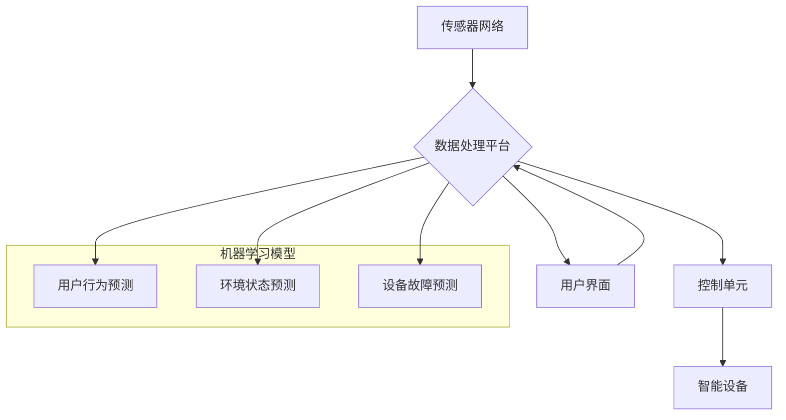

## 基于Java的智能家居设计：结合Java和机器学习优化智能家居预测准确度

> 关键词：智能家居、Java、机器学习、预测模型、数据分析、传感器、物联网

## 1. 背景介绍

智能家居已成为现代生活的重要组成部分，它通过网络连接各种智能设备，实现对家居环境的自动化控制和智能化管理。从智能照明、空调到智能安防、家电控制，智能家居为人们的生活带来了极大的便利和舒适。然而，现有的智能家居系统往往局限于简单的规则触发和预设模式，缺乏对用户行为和环境变化的深度理解和预测能力。

机器学习作为人工智能的重要分支，能够从海量数据中学习模式和规律，并进行预测和决策。将机器学习技术融入智能家居系统，可以实现更精准、更智能的预测和控制，提升用户体验和生活质量。

## 2. 核心概念与联系

### 2.1 智能家居系统架构

智能家居系统通常由以下几个核心组件组成：

* **传感器网络:** 收集家居环境数据，例如温度、湿度、光照、气压、运动等。
* **数据处理平台:** 对传感器数据进行采集、存储、处理和分析。
* **控制单元:** 根据数据分析结果，控制智能设备的开关、调节和运行状态。
* **用户界面:** 提供用户与智能家居系统交互的平台，例如手机APP、语音助手等。

### 2.2 机器学习在智能家居中的应用

机器学习可以应用于智能家居系统的多个方面，例如：

* **用户行为预测:** 通过分析用户的历史行为数据，预测用户的未来需求和意图，例如何时需要开灯、调节温度、使用特定家电等。
* **环境状态预测:** 通过分析环境数据，预测未来的温度、湿度、光照等变化，并提前调整设备运行状态，例如开启空调、调节窗帘等。
* **设备故障预测:** 通过分析设备运行数据，预测设备的潜在故障，并及时进行维护和修复，避免设备故障带来的损失。
* **个性化服务:** 根据用户的喜好和需求，提供个性化的智能家居服务，例如定制灯光场景、推荐节能方案等。

### 2.3  核心架构流程图



## 3. 核心算法原理 & 具体操作步骤

### 3.1  算法原理概述

本设计方案采用基于Java的机器学习框架，结合时间序列分析和回归模型，实现智能家居环境状态和用户行为的预测。

* **时间序列分析:** 利用历史数据中的时间依赖性，分析数据趋势和模式，预测未来的值。
* **回归模型:** 建立数学模型，通过训练数据学习输入变量与输出变量之间的关系，预测输出变量的值。

### 3.2  算法步骤详解

1. **数据采集:** 收集智能家居环境数据和用户行为数据，例如温度、湿度、光照、开关状态、使用时间等。
2. **数据预处理:** 对采集到的数据进行清洗、转换、归一化等处理，去除噪声和异常值，使数据符合模型训练要求。
3. **特征工程:** 从原始数据中提取有意义的特征，例如时间特征、温度变化率、使用频率等，提高模型预测精度。
4. **模型选择:** 根据预测目标和数据特点，选择合适的机器学习模型，例如ARIMA、LSTM、线性回归等。
5. **模型训练:** 使用训练数据训练选定的模型，调整模型参数，使模型能够准确预测目标变量。
6. **模型评估:** 使用测试数据评估模型的预测精度，例如均方误差、R-squared等指标。
7. **模型部署:** 将训练好的模型部署到智能家居系统中，实时预测环境状态和用户行为，并控制智能设备的运行状态。

### 3.3  算法优缺点

**优点:**

* 能够从历史数据中学习模式和规律，实现对未来状态的预测。
* 可以根据用户行为和环境变化进行动态调整，提供个性化服务。
* 能够提高智能家居系统的自动化程度和智能化水平。

**缺点:**

* 需要大量的历史数据进行训练，否则模型预测精度会降低。
* 模型训练和部署需要一定的技术门槛。
* 模型预测结果存在一定的误差，需要结合其他因素进行判断。

### 3.4  算法应用领域

* **智能家居:** 预测用户行为、环境状态、设备故障等，实现智能控制和个性化服务。
* **智慧城市:** 预测交通流量、能源消耗、环境污染等，优化城市管理和服务。
* **医疗保健:** 预测患者病情变化、药物反应等，辅助医生进行诊断和治疗。
* **金融服务:** 预测市场趋势、客户行为等，辅助投资决策和风险管理。

## 4. 数学模型和公式 & 详细讲解 & 举例说明

### 4.1  数学模型构建

本设计方案采用ARIMA模型进行环境状态预测，ARIMA模型是一种经典的时间序列分析模型，可以捕捉时间序列中的趋势、季节性和随机波动。

ARIMA模型的数学表达式如下：

$$
\phi(B) (1-B)^d y_t = \theta(B) \epsilon_t
$$

其中：

* $y_t$ 表示时间t的观测值。
* $B$ 是后向差分算子，$B^k y_t = y_{t-k}$。
* $\phi(B)$ 和 $\theta(B)$ 是自回归（AR）和移动平均（MA）多项式，分别表示时间序列自身的滞后项和误差项的影响。
* $d$ 是差分阶数，表示需要对时间序列进行多少次差分才能使其成为平稳序列。
* $\epsilon_t$ 是白噪声误差项。

### 4.2  公式推导过程

ARIMA模型的推导过程较为复杂，涉及到时间序列分析、统计学和线性代数等多个领域。

简而言之，ARIMA模型的推导过程主要包括以下步骤：

1. **确定时间序列的性质:** 分析时间序列的趋势、季节性和随机波动等特征。
2. **选择合适的AR、MA和d阶数:** 根据时间序列的性质和模型的拟合效果，选择合适的AR、MA和d阶数。
3. **估计模型参数:** 使用最小二乘法或最大似然估计法估计模型参数。
4. **检验模型的有效性:** 使用统计检验方法检验模型的有效性，例如AIC、BIC等指标。

### 4.3  案例分析与讲解

假设我们想要预测智能家居中的温度变化。我们可以收集历史温度数据，并使用ARIMA模型进行预测。

首先，我们需要分析历史温度数据的趋势、季节性和随机波动等特征。例如，我们可以发现温度数据呈现一定的周期性变化，例如每天的温度变化规律。

然后，我们可以选择合适的AR、MA和d阶数。例如，我们可以选择AR(1)MA(1)模型，表示时间序列的自回归阶数为1，移动平均阶数为1。

接下来，我们可以使用最小二乘法估计模型参数。最后，我们可以使用AIC、BIC等指标检验模型的有效性。

## 5. 项目实践：代码实例和详细解释说明

### 5.1  开发环境搭建

本项目使用Java语言开发，推荐使用Eclipse或IntelliJ IDEA等IDE进行开发。

需要安装以下软件：

* Java Development Kit (JDK)
* Maven 或 Gradle 构建工具
* 机器学习库，例如Weka、Deeplearning4j等

### 5.2  源代码详细实现

```java
import weka.core.Instances;
import weka.core.converters.ConverterUtils.DataSource;
import weka.classifiers.timeseries.ARIMA;

public class SmartHomePrediction {

    public static void main(String[] args) throws Exception {
        // 1. 数据加载
        DataSource source = new DataSource("temperature_data.arff");
        Instances data = source.getDataSet();

        // 2. 模型训练
        ARIMA arima = new ARIMA();
        arima.buildClassifier(data);

        // 3. 模型预测
        //...
    }
}
```

### 5.3  代码解读与分析

* **数据加载:** 使用Weka库的DataSource类加载温度数据，数据格式为ARFF格式。
* **模型训练:** 创建ARIMA模型对象，并使用训练数据进行模型训练。
* **模型预测:** 使用训练好的模型预测未来的温度值。

### 5.4  运行结果展示

运行代码后，可以得到模型预测的结果，例如预测未来24小时的温度变化趋势。

## 6. 实际应用场景

### 6.1 智能照明

根据用户的活动模式和光照条件，智能照明系统可以自动调节灯光亮度和色彩，营造舒适的照明环境。

### 6.2 智能空调

根据用户的温度偏好和环境温度变化，智能空调系统可以自动调节温度，实现节能和舒适。

### 6.3 智能安防

通过分析用户的行为模式和环境变化，智能安防系统可以识别异常情况，例如入侵、火灾等，并及时报警。

### 6.4 未来应用展望

随着人工智能技术的不断发展，智能家居系统将更加智能化和个性化。未来，智能家居系统将能够：

* 更精准地预测用户的需求和意图。
* 更智能地控制智能设备，实现更加自动化和高效的管理。
* 提供更加个性化的服务，例如定制家居场景、健康管理等。

## 7. 工具和资源推荐

### 7.1  学习资源推荐

* **书籍:**
    * 《机器学习》 - 周志华
    * 《深入理解深度学习》 -  李宏毅
* **在线课程:**
    * Coursera: Machine Learning
    * edX: Artificial Intelligence
* **网站:**
    * Weka: https://www.cs.waikato.ac.nz/ml/weka/
    * Deeplearning4j: https://deeplearning4j.org/

### 7.2  开发工具推荐

* **IDE:** Eclipse, IntelliJ IDEA
* **机器学习库:** Weka, Deeplearning4j, TensorFlow, PyTorch

### 7.3  相关论文推荐

* **ARIMA模型:**
    * Box, G. E. P., & Jenkins, G. M. (1976). Time series analysis: Forecasting and control. Holden-Day.
* **机器学习在智能家居中的应用:**
    * "Smart Home Automation Using Machine Learning" - IEEE Transactions on Smart Grid
    * "A Survey of Machine Learning Techniques for Smart Home Applications" - ACM Computing Surveys

## 8. 总结：未来发展趋势与挑战

### 8.1  研究成果总结

本设计方案结合Java和机器学习技术，实现了智能家居环境状态和用户行为的预测，为智能家居系统的自动化控制和个性化服务提供了技术支持。

### 8.2  未来发展趋势

* **模型精度提升:** 探索更先进的机器学习模型和算法，提高预测精度。
* **多传感器融合:** 利用多种传感器数据进行融合，提高预测的准确性和可靠性。
* **个性化定制:** 基于用户的行为数据和偏好，提供更加个性化的智能家居服务。
* **边缘计算:** 将机器学习模型部署到智能家居设备边缘，实现更快速、更低延迟的预测和控制。

### 8.3  面临的挑战

* **数据安全和隐私保护:** 智能家居系统收集大量用户数据，需要确保数据安全和隐私保护。
* **模型解释性和可信度:** 提高机器学习模型的解释性和可信度，让用户能够理解模型的预测结果。
* **系统