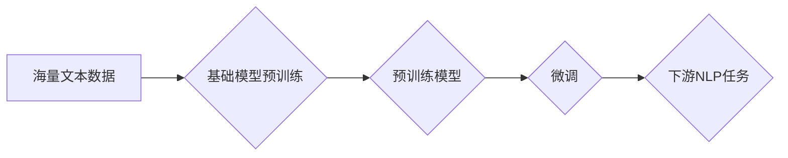

## 基础模型在NLP中的应用

> 关键词：基础模型、NLP、Transformer、预训练、微调、迁移学习、自然语言理解、自然语言生成

## 1. 背景介绍

自然语言处理（NLP）作为人工智能领域的重要分支，致力于使计算机能够理解、处理和生成人类语言。近年来，深度学习技术的飞速发展为NLP领域带来了革命性的变革。其中，基础模型（Foundation Models）作为一种新兴的模型架构，凭借其强大的泛化能力和可迁移性，在NLP领域展现出巨大的潜力。

传统的NLP模型通常针对特定任务进行训练，需要大量的标注数据和复杂的模型设计。而基础模型则不同，它是在海量文本数据上进行预训练，学习到语言的通用表示和知识。预训练后的基础模型可以被微调到各种下游NLP任务，例如文本分类、机器翻译、问答系统等，显著提高了模型的性能和效率。

## 2. 核心概念与联系

### 2.1 基础模型的概念

基础模型是指在海量数据上进行预训练，学习到语言的通用表示和知识的深度学习模型。其特点包括：

* **规模庞大:** 基础模型通常拥有数十亿甚至千亿个参数，拥有强大的学习能力。
* **通用性强:** 基础模型能够在多种下游任务中表现出色，具有良好的泛化能力。
* **可迁移性高:** 预训练后的基础模型可以被微调到不同的任务和领域，降低了模型训练的成本和时间。

### 2.2 基础模型与NLP任务的关系

基础模型在NLP任务中的应用主要分为以下几个阶段：

1. **预训练:** 在海量文本数据上训练基础模型，学习到语言的通用表示。
2. **微调:** 将预训练好的基础模型微调到特定的下游任务，例如文本分类、机器翻译等。
3. **应用:** 将微调后的模型部署到实际应用场景中，例如聊天机器人、搜索引擎等。

**基础模型与NLP任务的流程图:**



## 3. 核心算法原理 & 具体操作步骤

### 3.1 算法原理概述

Transformer模型是目前基础模型的核心算法之一。它是一种基于注意力机制的序列到序列模型，能够有效地捕捉长距离依赖关系，在自然语言处理任务中取得了优异的性能。

Transformer模型的主要结构包括：

* **编码器:** 用于将输入序列编码成固定长度的向量表示。
* **解码器:** 用于根据编码后的向量表示生成输出序列。
* **注意力机制:** 用于捕捉输入序列中不同词之间的关系，提高模型的理解能力。

### 3.2 算法步骤详解

1. **输入处理:** 将输入文本序列转换为词嵌入向量。
2. **编码器:** 将词嵌入向量输入到编码器中，通过多层Transformer模块进行编码，最终得到序列的隐藏状态表示。
3. **解码器:** 将编码后的隐藏状态表示输入到解码器中，通过多层Transformer模块进行解码，生成输出序列。
4. **输出处理:** 将解码器的输出向量转换为文本序列。

### 3.3 算法优缺点

**优点:**

* **强大的捕捉长距离依赖关系的能力:** 注意力机制能够有效地捕捉输入序列中不同词之间的关系，即使它们相隔很远。
* **并行计算能力强:** Transformer模型的结构允许并行计算，能够加速模型训练。
* **可迁移性高:** 预训练后的Transformer模型可以被微调到各种下游任务。

**缺点:**

* **训练成本高:** Transformer模型参数量巨大，训练需要大量的计算资源和时间。
* **数据依赖性强:** Transformer模型的性能取决于训练数据的质量和数量。

### 3.4 算法应用领域

Transformer模型在NLP领域广泛应用，例如：

* **机器翻译:** 将一种语言翻译成另一种语言。
* **文本摘要:** 将长文本压缩成短文本。
* **问答系统:** 回答用户提出的问题。
* **对话系统:** 与用户进行自然语言对话。

## 4. 数学模型和公式 & 详细讲解 & 举例说明

### 4.1 数学模型构建

Transformer模型的核心是注意力机制，它通过计算词之间的相关性来捕捉语言的语义关系。注意力机制的数学模型可以表示为：

$$
Attention(Q, K, V) = softmax(\frac{QK^T}{\sqrt{d_k}})V
$$

其中：

* $Q$：查询矩阵
* $K$：键矩阵
* $V$：值矩阵
* $d_k$：键向量的维度
* $softmax$：softmax函数

### 4.2 公式推导过程

注意力机制的公式推导过程如下：

1. 计算查询矩阵 $Q$ 和键矩阵 $K$ 的点积，并除以 $\sqrt{d_k}$。
2. 对点积结果应用softmax函数，得到注意力权重。
3. 将注意力权重与值矩阵 $V$ 相乘，得到最终的注意力输出。

### 4.3 案例分析与讲解

例如，在机器翻译任务中，查询矩阵 $Q$ 表示目标语言的词嵌入向量，键矩阵 $K$ 表示源语言的词嵌入向量，值矩阵 $V$ 表示源语言的词嵌入向量。通过计算注意力权重，模型可以学习到源语言词与目标语言词之间的对应关系，从而实现机器翻译。

## 5. 项目实践：代码实例和详细解释说明

### 5.1 开发环境搭建

* Python 3.7+
* PyTorch 1.7+
* CUDA 10.2+

### 5.2 源代码详细实现

```python
import torch
import torch.nn as nn

class Attention(nn.Module):
    def __init__(self, d_model, num_heads):
        super(Attention, self).__init__()
        self.d_model = d_model
        self.num_heads = num_heads
        self.head_dim = d_model // num_heads

        self.query = nn.Linear(d_model, d_model)
        self.key = nn.Linear(d_model, d_model)
        self.value = nn.Linear(d_model, d_model)
        self.fc_out = nn.Linear(d_model, d_model)

    def forward(self, query, key, value, mask=None):
        batch_size = query.size(0)

        # Linear projections
        Q = self.query(query).view(batch_size, -1, self.num_heads, self.head_dim).transpose(1, 2)
        K = self.key(key).view(batch_size, -1, self.num_heads, self.head_dim).transpose(1, 2)
        V = self.value(value).view(batch_size, -1, self.num_heads, self.head_dim).transpose(1, 2)

        # Scaled dot-product attention
        scores = torch.matmul(Q, K.transpose(-2, -1)) / torch.sqrt(torch.tensor(self.head_dim, dtype=torch.float))
        if mask is not None:
            scores = scores.masked_fill(mask == 0, -1e9)
        attention_weights = torch.softmax(scores, dim=-1)

        # Weighted sum of values
        context = torch.matmul(attention_weights, V)

        # Concatenate heads and project
        context = context.transpose(1, 2).contiguous().view(batch_size, -1, self.d_model)
        output = self.fc_out(context)

        return output, attention_weights
```

### 5.3 代码解读与分析

* `Attention` 类定义了注意力机制的结构。
* `forward` 方法实现注意力机制的计算过程。
* `query`, `key`, `value` 分别表示查询矩阵、键矩阵和值矩阵。
* `mask` 用于屏蔽无效的注意力权重。
* `softmax` 函数用于计算注意力权重。
* `torch.matmul` 用于计算矩阵乘法。

### 5.4 运行结果展示

运行上述代码可以得到注意力权重和输出向量，并可视化注意力权重，观察模型对不同词的关注程度。

## 6. 实际应用场景

基础模型在NLP领域有着广泛的应用场景，例如：

* **聊天机器人:** 基于预训练语言模型的聊天机器人能够进行更自然、更流畅的对话。
* **搜索引擎:** 基础模型可以用于理解用户搜索意图，提高搜索结果的准确性。
* **文本生成:** 基于基础模型的文本生成模型能够生成高质量的文本内容，例如新闻报道、小说、诗歌等。
* **代码生成:** 基于基础模型的代码生成模型能够自动生成代码，提高开发效率。

### 6.4 未来应用展望

随着基础模型的不断发展，其应用场景将会更加广泛，例如：

* **个性化教育:** 基于用户学习习惯和知识水平的个性化学习方案。
* **医疗诊断:** 基于患者病历和症状的疾病诊断和治疗建议。
* **法律服务:** 基于法律法规和案例的法律咨询和判决预测。

## 7. 工具和资源推荐

### 7.1 学习资源推荐

* **论文:**
    * Attention Is All You Need (Vaswani et al., 2017)
    * BERT: Pre-training of Deep Bidirectional Transformers for Language Understanding (Devlin et al., 2018)
    * GPT-3: Language Models are Few-Shot Learners (Brown et al., 2020)
* **博客:**
    * The Illustrated Transformer (Jay Alammar)
    * Hugging Face Blog

### 7.2 开发工具推荐

* **Hugging Face Transformers:** 一个开源的深度学习库，提供各种预训练基础模型和微调工具。
* **TensorFlow:** 一个开源的机器学习框架，支持基础模型的训练和部署。
* **PyTorch:** 一个开源的深度学习框架，也支持基础模型的训练和部署。

### 7.3 相关论文推荐

* **BERT:** Pre-training of Deep Bidirectional Transformers for Language Understanding
* **GPT-3:** Language Models are Few-Shot Learners
* **T5:** Text-to-Text Transfer Transformer

## 8. 总结：未来发展趋势与挑战

### 8.1 研究成果总结

基础模型在NLP领域取得了显著的成果，例如在机器翻译、文本摘要、问答系统等任务上取得了state-of-the-art的性能。

### 8.2 未来发展趋势

* **模型规模的进一步扩大:** 预计未来基础模型的规模将会进一步扩大，拥有更多的参数和更强的学习能力。
* **多模态基础模型的开发:** 将文本、图像、音频等多种模态信息融合到基础模型中，实现跨模态的理解和生成。
* **可解释性研究的加强:** 研究基础模型的决策过程，提高模型的可解释性和可信任性。

### 8.3 面临的挑战

* **训练成本高:** 基础模型的训练需要大量的计算资源和时间，成本较高。
* **数据依赖性强:** 基础模型的性能取决于训练数据的质量和数量，数据获取和标注仍然是一个挑战。
* **伦理问题:** 基础模型可能被用于生成虚假信息、传播偏见等，需要关注其伦理问题。

### 8.4 研究展望

未来基础模型的研究将继续朝着更强大、更通用、更安全的方向发展，为人工智能的进步做出更大的贡献。

## 9. 附录：常见问题与解答

* **什么是基础模型？**

基础模型是指在海量数据上进行预训练，学习到语言的通用表示和知识的深度学习模型。

* **基础模型的优势是什么？**

基础模型具有强大的泛化能力和可迁移性，可以应用于多种下游任务。

* **如何使用基础模型？**

可以利用开源的