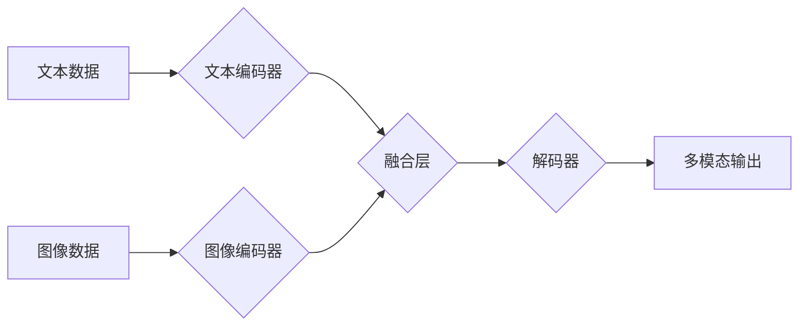

## 多模态大模型：技术原理与实战 方法论介绍

> 关键词：多模态大模型、Transformer、自监督学习、图像理解、自然语言处理、文本生成、跨模态交互

### 1. 背景介绍

近年来，人工智能领域取得了令人瞩目的进展，其中大模型的涌现尤为引人注目。大模型凭借其强大的学习能力和泛化能力，在自然语言处理、计算机视觉等领域取得了突破性成果。然而，传统的单模态大模型仅处理单一类型的数据，例如文本或图像，无法充分利用不同模态之间的丰富信息交互。

多模态大模型 (Multimodal Large Models) 应运而生，旨在融合不同模态数据（如文本、图像、音频、视频等）进行学习和推理。它能够跨越模态边界，理解和生成多样的信息表达，从而实现更智能、更自然的交互体验。

### 2. 核心概念与联系

多模态大模型的核心概念是将不同模态的数据融合在一起，学习它们的联合表示。

**2.1 多模态数据融合**

多模态数据融合是指将来自不同模态的数据进行有效整合，提取其潜在的关联性和互补性。常见的融合方法包括：

* **特征级融合:** 将不同模态的数据分别提取特征，然后将特征进行拼接或融合，形成联合特征向量。
* **表示级融合:** 将不同模态的数据分别映射到同一个语义空间，然后进行融合，形成联合表示。
* **决策级融合:** 将不同模态的数据分别进行独立的预测，然后将预测结果进行融合，形成最终的决策。

**2.2 Transformer 架构**

Transformer 架构是近年来深度学习领域取得突破性的进展，其自注意力机制能够有效捕捉序列数据之间的长距离依赖关系。Transformer 架构在多模态大模型中发挥着重要作用，它能够处理不同模态数据之间的复杂关系，并学习它们的联合表示。

**2.3 自监督学习**

自监督学习是一种无需人工标注数据就能进行训练的方法。在多模态大模型中，自监督学习可以利用大量的未标记数据进行预训练，学习不同模态之间的潜在关系。

**Mermaid 流程图**



### 3. 核心算法原理 & 具体操作步骤

**3.1 算法原理概述**

多模态大模型的训练目标是学习不同模态数据的联合表示，并能够根据联合表示进行预测或生成。常用的训练方法包括：

* **交叉熵损失函数:** 计算模型预测结果与真实标签之间的差异，并通过最小化损失函数来训练模型。
* **对比学习:** 通过学习不同模态数据的相似性和差异性，来训练模型学习有效的联合表示。

**3.2 算法步骤详解**

1. **数据预处理:** 将不同模态的数据进行预处理，例如文本数据进行分词和词嵌入，图像数据进行裁剪和增强。
2. **模态编码:** 使用不同的编码器对不同模态的数据进行编码，例如使用BERT对文本数据进行编码，使用ResNet对图像数据进行编码。
3. **融合层:** 将不同模态的编码结果进行融合，形成联合表示。
4. **解码器:** 使用解码器对联合表示进行解码，生成最终的输出。
5. **损失函数计算:** 计算模型预测结果与真实标签之间的差异，并使用梯度下降算法进行模型更新。

**3.3 算法优缺点**

* **优点:** 能够充分利用不同模态数据的互补性，学习更丰富的语义表示，从而提高模型的性能。
* **缺点:** 需要处理不同模态数据的复杂关系，训练过程更加复杂，需要更多的计算资源。

**3.4 算法应用领域**

* **图像字幕生成:** 将图像转换为文本描述。
* **视频问答:** 根据视频内容回答问题。
* **跨模态检索:** 根据文本查询找到相关的图像或视频。
* **机器人交互:** 帮助机器人理解和响应人类的多模态指令。

### 4. 数学模型和公式 & 详细讲解 & 举例说明

**4.1 数学模型构建**

多模态大模型的数学模型通常基于深度神经网络，例如Transformer架构。模型的目标是学习一个映射函数 f，将不同模态的数据映射到一个联合表示空间：

$$
\mathbf{z} = f(\mathbf{x}, \mathbf{y})
$$

其中，$\mathbf{x}$ 和 $\mathbf{y}$ 分别表示文本和图像数据，$\mathbf{z}$ 表示它们的联合表示。

**4.2 公式推导过程**

Transformer架构的核心是自注意力机制，它能够捕捉序列数据之间的长距离依赖关系。自注意力机制的计算公式如下：

$$
\mathbf{Attention}(\mathbf{Q}, \mathbf{K}, \mathbf{V}) = \frac{\exp(\mathbf{Q} \mathbf{K}^T / \sqrt{d_k})}{\sum_j \exp(\mathbf{Q} \mathbf{K}^T / \sqrt{d_k})} \mathbf{V}
$$

其中，$\mathbf{Q}$, $\mathbf{K}$, $\mathbf{V}$ 分别表示查询矩阵、键矩阵和值矩阵，$d_k$ 表示键向量的维度。

**4.3 案例分析与讲解**

例如，在图像字幕生成任务中，模型需要将图像编码为一个向量表示，然后使用文本编码器生成相应的字幕。

* 图像编码器可以是ResNet或其他图像识别模型，它将图像转换为一个特征向量。
* 文本编码器可以是BERT或其他语言模型，它将文本序列转换为一个词嵌入矩阵。
* 融合层可以将图像特征向量和文本词嵌入矩阵进行拼接或融合，形成联合表示。
* 解码器可以是GPT或其他文本生成模型，它根据联合表示生成字幕。

### 5. 项目实践：代码实例和详细解释说明

**5.1 开发环境搭建**

* Python 3.7+
* PyTorch 或 TensorFlow
* CUDA 和 cuDNN

**5.2 源代码详细实现**

```python
import torch
import torch.nn as nn

class MultimodalEncoder(nn.Module):
    def __init__(self, text_encoder, image_encoder):
        super(MultimodalEncoder, self).__init__()
        self.text_encoder = text_encoder
        self.image_encoder = image_encoder

    def forward(self, text, image):
        text_embedding = self.text_encoder(text)
        image_embedding = self.image_encoder(image)
        # 融合文本和图像嵌入
        fused_embedding = torch.cat((text_embedding, image_embedding), dim=1)
        return fused_embedding

# 实例化编码器
text_encoder = BERT(pretrained=True)
image_encoder = ResNet(pretrained=True)
multimodal_encoder = MultimodalEncoder(text_encoder, image_encoder)

# 输入文本和图像数据
text = torch.randn(1, 128)
image = torch.randn(1, 3, 224, 224)

# 获取联合表示
fused_embedding = multimodal_encoder(text, image)
```

**5.3 代码解读与分析**

* 该代码定义了一个多模态编码器，它包含一个文本编码器和一个图像编码器。
* 文本编码器和图像编码器分别对文本和图像数据进行编码，生成相应的嵌入向量。
* 融合层将文本和图像嵌入向量进行拼接，形成联合表示。

**5.4 运行结果展示**

运行该代码后，将得到一个联合表示向量，该向量包含了文本和图像的信息。

### 6. 实际应用场景

**6.1 图像字幕生成**

多模态大模型可以将图像转换为文本描述，例如将一张照片描述为“一只金毛犬在公园里玩耍”。

**6.2 视频问答**

多模态大模型可以根据视频内容回答问题，例如“视频中发生了什么？”、“视频中的人物是谁？”。

**6.3 跨模态检索**

多模态大模型可以根据文本查询找到相关的图像或视频，例如根据“猫”这个关键词搜索相关的猫图片。

**6.4 未来应用展望**

* **增强现实 (AR) 和虚拟现实 (VR):** 多模态大模型可以帮助AR和VR系统更好地理解用户意图，并提供更沉浸式的体验。
* **智能家居:** 多模态大模型可以帮助智能家居设备更好地理解用户的语音和手势指令，并提供更智能化的服务。
* **医疗诊断:** 多模态大模型可以帮助医生分析患者的医学影像和病历，提高诊断准确率。

### 7. 工具和资源推荐

**7.1 学习资源推荐**

* **论文:**
    * “BERT: Pre-training of Deep Bidirectional Transformers for Language Understanding”
    * “Vision Transformer”
    * “CLIP: Contrastive Language-Image Pre-training”
* **博客:**
    * https://blog.openai.com/
    * https://ai.googleblog.com/
* **课程:**
    * Stanford CS230: Convolutional Neural Networks for Visual Recognition
    * Deep Learning Specialization by Andrew Ng

**7.2 开发工具推荐**

* **PyTorch:** https://pytorch.org/
* **TensorFlow:** https://www.tensorflow.org/
* **Hugging Face Transformers:** https://huggingface.co/transformers/

**7.3 相关论文推荐**

* “DALL-E 2: Hierarchical Text-Conditional Image Generation with CLIP Latents”
* “Imagen: Text-to-Image Diffusion Models”
* “Flamingo: A Visual Language Model”

### 8. 总结：未来发展趋势与挑战

**8.1 研究成果总结**

近年来，多模态大模型取得了显著进展，在图像字幕生成、视频问答、跨模态检索等领域取得了突破性成果。

**8.2 未来发展趋势**

* **模型规模和能力的提升:** 未来，多模态大模型的规模和能力将进一步提升，能够处理更复杂的多模态数据，并完成更复杂的任务。
* **跨模态理解和推理的增强:** 未来，多模态大模型将更加注重跨模态理解和推理能力，能够更好地理解不同模态之间的关系，并进行更智能的决策。
* **个性化和可解释性:** 未来，多模态大模型将更加注重个性化和可解释性，能够根据用户的需求和偏好进行定制化服务，并提供更清晰的推理过程。

**8.3 面临的挑战**

* **数据获取和标注:** 多模态数据的获取和标注成本较高，这限制了多模态大模型的训练和发展。
* **模型训练和优化:** 多模态大模型的训练和优化更加复杂，需要更强大的计算资源和更有效的算法。
* **伦理和安全问题:** 多模态大模型的应用可能带来伦理和安全问题，例如数据隐私泄露、算法偏见等，需要引起足够的重视。

**8.4 研究展望**

未来，多模态大模型将继续朝着更智能、更通用、更安全的方向发展，并将在更多领域发挥重要作用。


### 9. 附录：常见问题与解答

**9.1 如何选择合适的多模态大模型？**

选择合适的多模态大模型需要根据具体的应用场景和需求进行考虑。例如，对于图像字幕生成任务，可以选择DALL-E 2或Imagen等文本到图像生成模型；对于视频问答任务，可以选择Flamingo等视觉语言模型。

**9.2 如何训练自己的多模态大模型？**

训练自己的多模态大模型需要准备大量的多模态数据，并使用合适的训练算法和模型架构。例如，可以使用BERT和ResNet作为编码器，并使用交叉熵损失函数进行训练。

**9.3 多模态大模型的伦理和安全