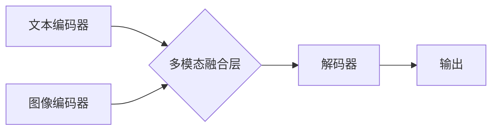

## 多模态大模型：技术原理与实战 跨模态多重组合技术

> 关键词：多模态大模型、跨模态学习、Transformer、视觉语言模型、文本图像生成、自然语言处理、计算机视觉

### 1. 背景介绍

近年来，人工智能领域取得了令人瞩目的进展，其中大模型在自然语言处理、计算机视觉等领域展现出强大的能力。然而，传统的单模态大模型仅处理单一类型数据（如文本或图像），难以捕捉现实世界中多模态信息的丰富性和复杂性。

多模态大模型 (Multimodal Large Models) 应运而生，旨在融合不同模态数据（如文本、图像、音频、视频等）进行学习和推理。这种跨模态学习能力赋予模型更深层的理解和感知能力，使其能够处理更复杂的任务，例如图像字幕生成、文本到图像合成、视频问答等。

### 2. 核心概念与联系

**2.1 核心概念**

* **多模态数据:** 指包含多种不同类型信息的集合，例如文本、图像、音频、视频等。
* **跨模态学习:** 指模型学习不同模态数据之间的关系和关联，从而理解和处理多模态信息。
* **多模态大模型:** 指能够处理多种模态数据的大规模深度学习模型。

**2.2 架构图**



**2.3 联系**

多模态大模型通常由三个主要部分组成：

* **模态编码器:** 负责将不同模态数据转换为模型可理解的特征表示。
* **多模态融合层:** 负责将不同模态的特征表示融合在一起，形成一个综合的表示。
* **解码器:** 负责根据融合后的特征表示生成最终的输出。

### 3. 核心算法原理 & 具体操作步骤

**3.1 算法原理概述**

多模态大模型的核心算法原理是基于深度学习，特别是 Transformer 架构。Transformer 模型通过自注意力机制能够捕捉序列数据之间的长距离依赖关系，适用于处理文本和图像等序列数据。

**3.2 算法步骤详解**

1. **数据预处理:** 将多模态数据进行预处理，例如文本分词、图像裁剪、音频降噪等。
2. **模态编码:** 使用不同的编码器对每个模态数据进行编码，例如使用 BERT 对文本进行编码，使用 ResNet 对图像进行编码。
3. **多模态融合:** 将不同模态的编码结果进行融合，可以使用多种方法，例如拼接、注意力机制、图神经网络等。
4. **解码:** 使用解码器根据融合后的特征表示生成最终的输出，例如生成文本、图像、音频等。
5. **模型训练:** 使用交叉熵损失函数对模型进行训练，优化模型参数。

**3.3 算法优缺点**

* **优点:** 能够处理多种模态数据，捕捉数据之间的关系，提升模型的理解和感知能力。
* **缺点:** 需要大量的多模态数据进行训练，训练成本较高，模型复杂度高，推理速度较慢。

**3.4 算法应用领域**

* **图像字幕生成:** 将图像转换为文本描述。
* **文本到图像合成:** 根据文本描述生成图像。
* **视频问答:** 根据视频内容回答问题。
* **多模态检索:** 根据文本或图像查询相关的多模态数据。
* **情感分析:** 分析文本和图像中的情感信息。

### 4. 数学模型和公式 & 详细讲解 & 举例说明

**4.1 数学模型构建**

多模态大模型的数学模型通常基于 Transformer 架构，其核心是自注意力机制。

**4.2 公式推导过程**

自注意力机制的计算公式如下：

$$
Attention(Q, K, V) = \frac{exp(Q \cdot K^T / \sqrt{d_k})}{exp(Q \cdot K^T / \sqrt{d_k})} \cdot V
$$

其中：

* $Q$：查询矩阵
* $K$：键矩阵
* $V$：值矩阵
* $d_k$：键向量的维度

**4.3 案例分析与讲解**

例如，在图像字幕生成任务中，图像编码器将图像转换为特征向量，文本编码器将文本描述转换为特征向量。然后，使用自注意力机制将图像特征向量和文本特征向量进行融合，得到一个综合的表示。最后，解码器根据融合后的特征向量生成字幕。

### 5. 项目实践：代码实例和详细解释说明

**5.1 开发环境搭建**

* Python 3.7+
* PyTorch 1.7+
* CUDA 10.2+

**5.2 源代码详细实现**

```python
import torch
import torch.nn as nn

class MultimodalFusionLayer(nn.Module):
    def __init__(self, text_dim, image_dim):
        super(MultimodalFusionLayer, self).__init__()
        self.text_proj = nn.Linear(text_dim, text_dim)
        self.image_proj = nn.Linear(image_dim, text_dim)
        self.attention = nn.MultiheadAttention(text_dim, num_heads=8)

    def forward(self, text_features, image_features):
        text_features = self.text_proj(text_features)
        image_features = self.image_proj(image_features)
        fused_features = self.attention(text_features, image_features, image_features)[0]
        return fused_features

#... 其他模型层

model =...
```

**5.3 代码解读与分析**

* `MultimodalFusionLayer` 类定义了一个多模态融合层，它使用多头注意力机制将文本和图像特征融合在一起。
* `text_proj` 和 `image_proj` 是两个线性层，用于将文本和图像特征映射到相同的维度。
* `attention` 是一个多头注意力层，用于计算文本和图像特征之间的注意力权重。
* `forward` 方法定义了融合层的计算过程。

**5.4 运行结果展示**

通过训练和测试，可以评估多模态大模型的性能，例如在图像字幕生成任务中，可以计算BLEU分数来衡量模型生成的字幕与真实字幕的相似度。

### 6. 实际应用场景

**6.1 图像字幕生成**

多模态大模型可以将图像转换为文本描述，例如为盲人生成图像描述，为搜索引擎提供图像理解能力。

**6.2 文本到图像合成**

多模态大模型可以根据文本描述生成图像，例如用于创意设计、游戏开发、虚拟现实等领域。

**6.3 视频问答**

多模态大模型可以理解视频内容并回答问题，例如用于教育、培训、视频搜索等领域。

**6.4 多模态检索**

多模态大模型可以根据文本或图像查询相关的多模态数据，例如用于图像搜索、视频搜索、跨模态知识图谱构建等领域。

**6.5 未来应用展望**

随着多模态大模型技术的不断发展，其应用场景将更加广泛，例如：

* **智能客服:** 使用多模态大模型构建更智能的客服机器人，能够理解用户的文本和语音输入，并提供更精准的回复。
* **个性化教育:** 使用多模态大模型为学生提供个性化的学习体验，例如根据学生的学习进度和理解能力生成不同的学习内容。
* **医疗诊断:** 使用多模态大模型辅助医生进行诊断，例如分析患者的医学影像和病历信息，提高诊断准确率。

### 7. 工具和资源推荐

**7.1 学习资源推荐**

* **论文:**
    * "BERT: Pre-training of Deep Bidirectional Transformers for Language Understanding"
    * "Vision Transformer"
    * "CLIP: Contrastive Language-Image Pretraining"
* **博客:**
    * https://blog.openai.com/
    * https://ai.googleblog.com/
* **课程:**
    * Stanford CS230: Convolutional Neural Networks for Visual Recognition
    * Deep Learning Specialization by Andrew Ng

**7.2 开发工具推荐**

* **PyTorch:** https://pytorch.org/
* **TensorFlow:** https://www.tensorflow.org/
* **Hugging Face Transformers:** https://huggingface.co/transformers/

**7.3 相关论文推荐**

* "Exploring the Limits of Transfer Learning with a Unified Text-to-Image Transformer"
* "DALL-E 2: Hierarchical Text-Conditional Image Generation with CLIP Latents"
* "Imagen: Text-to-Image Diffusion Models"

### 8. 总结：未来发展趋势与挑战

**8.1 研究成果总结**

近年来，多模态大模型取得了显著进展，在图像字幕生成、文本到图像合成等任务上取得了优异的性能。

**8.2 未来发展趋势**

* **模型规模和能力提升:** 未来多模态大模型将继续朝着更大规模、更强大的方向发展。
* **跨模态理解的深化:** 研究将更加注重多模态数据的融合和理解，例如探索更有效的跨模态表示学习方法。
* **应用场景的拓展:** 多模态大模型将应用于更多领域，例如医疗、教育、金融等。

**8.3 面临的挑战**

* **数据获取和标注:** 多模态数据的获取和标注成本较高，这限制了模型的训练和性能提升。
* **模型训练和推理效率:** 多模态大模型的训练和推理效率较低，需要进一步优化算法和硬件。
* **伦理和安全问题:** 多模态大模型的应用可能带来伦理和安全问题，例如数据隐私、算法偏见等，需要引起重视和研究。

**8.4 研究展望**

未来，多模态大模型研究将继续朝着更智能、更安全、更普惠的方向发展，为人类社会带来更多福祉。

### 9. 附录：常见问题与解答

* **Q: 多模态大模型与传统单模态大模型有什么区别？**

* **A:** 多模态大模型能够处理多种模态数据，而传统单模态大模型仅处理单一类型数据。

* **Q: 多模态大模型的训练数据有哪些？**

* **A:** 多模态大模型的训练数据包括文本、图像、音频、视频等多种模态数据，例如 COCO 数据集、ImageNet 数据集、WikiText 数据集等。

* **Q: 多模态大模型的应用场景有哪些？**

* **A:** 多模态大模型的应用场景包括图像字幕生成、文本到图像合成、视频问答、多模态检索等。


作者：禅与计算机程序设计艺术 / Zen and the Art of Computer Programming 
