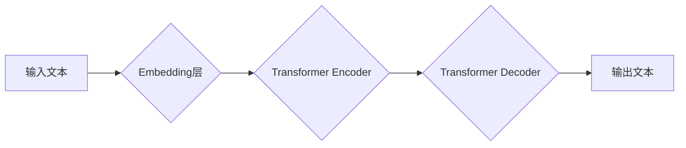

## 大语言模型原理与工程实践：大语言模型的涌现能力

> 关键词：大语言模型、Transformer、自回归、预训练、微调、自然语言处理、深度学习

### 1. 背景介绍

近年来，深度学习技术取得了飞速发展，特别是Transformer模型的出现，彻底改变了自然语言处理（NLP）领域的面貌。大语言模型（LLM）作为Transformer模型的升级版，拥有海量参数和强大的泛化能力，在文本生成、机器翻译、问答系统等领域展现出令人惊叹的性能。

LLM的涌现，标志着人工智能进入了一个新的时代。它不仅能够理解和生成人类语言，还能进行复杂的逻辑推理、创意写作和代码生成等任务，展现出强大的涌现能力。

### 2. 核心概念与联系

**2.1 核心概念**

* **Transformer模型:**  一种基于注意力机制的深度学习模型，能够有效处理长距离依赖关系，是LLM的基础架构。
* **自回归语言模型:**  一种预测下一个词的概率分布的模型，通过学习语言的统计规律，生成流畅的文本。
* **预训练:**  在大量文本数据上进行训练，学习语言的通用表示，为下游任务提供强大的基础。
* **微调:**  在特定任务数据上进行训练，调整预训练模型的参数，使其能够更好地完成特定任务。

**2.2 架构图**



**2.3 联系**

LLM本质上是一种基于Transformer模型的自回归语言模型。通过预训练和微调，LLM能够学习到丰富的语言知识，并将其应用于各种自然语言处理任务。

### 3. 核心算法原理 & 具体操作步骤

**3.1 算法原理概述**

LLM的核心算法是Transformer模型，它通过多头注意力机制和前馈神经网络，学习文本序列之间的关系，并生成下一个词的概率分布。

**3.2 算法步骤详解**

1. **词嵌入:** 将输入文本中的每个词转换为向量表示，捕捉词的语义信息。
2. **编码器:** 使用多层Transformer编码器，对输入文本进行编码，学习文本序列之间的上下文关系。
3. **解码器:** 使用多层Transformer解码器，根据编码后的文本序列，生成下一个词的概率分布。
4. **输出:** 选择概率最高的词作为输出，并重复步骤3，直到生成完整的文本序列。

**3.3 算法优缺点**

* **优点:** 能够有效处理长距离依赖关系，生成流畅的文本，具有强大的泛化能力。
* **缺点:** 训练成本高，参数量大，需要大量的计算资源和训练数据。

**3.4 算法应用领域**

* 文本生成
* 机器翻译
* 问答系统
* 代码生成
* 文本摘要
* 情感分析

### 4. 数学模型和公式 & 详细讲解 & 举例说明

**4.1 数学模型构建**

LLM的数学模型基于Transformer模型，主要包括以下几个部分：

* **词嵌入层:** 将词转换为向量表示，可以使用Word2Vec、GloVe等预训练词嵌入模型。
* **编码器:** 使用多层Transformer编码器，每个编码器层包含多头注意力机制和前馈神经网络。
* **解码器:** 使用多层Transformer解码器，每个解码器层包含多头注意力机制、masked multi-head attention和前馈神经网络。

**4.2 公式推导过程**

Transformer模型的核心是注意力机制，其计算公式如下：

$$
Attention(Q, K, V) = softmax(\frac{QK^T}{\sqrt{d_k}})V
$$

其中：

* $Q$：查询矩阵
* $K$：键矩阵
* $V$：值矩阵
* $d_k$：键向量的维度
* $softmax$：softmax函数

**4.3 案例分析与讲解**

假设我们有一个句子“The cat sat on the mat”，将其输入到Transformer模型中，编码器会学习到每个词之间的关系，例如“cat”和“sat”之间存在因果关系。解码器则会根据编码后的信息，生成下一个词的概率分布，例如生成“on”的概率最高。

### 5. 项目实践：代码实例和详细解释说明

**5.1 开发环境搭建**

* Python 3.7+
* PyTorch 1.7+
* CUDA 10.2+

**5.2 源代码详细实现**

```python
import torch
import torch.nn as nn

class Transformer(nn.Module):
    def __init__(self, vocab_size, embedding_dim, num_heads, num_layers):
        super(Transformer, self).__init__()
        self.embedding = nn.Embedding(vocab_size, embedding_dim)
        self.encoder = nn.TransformerEncoder(nn.TransformerEncoderLayer(embedding_dim, num_heads), num_layers)
        self.decoder = nn.TransformerDecoder(nn.TransformerDecoderLayer(embedding_dim, num_heads), num_layers)
        self.linear = nn.Linear(embedding_dim, vocab_size)

    def forward(self, src, tgt):
        src = self.embedding(src)
        tgt = self.embedding(tgt)
        encoder_output = self.encoder(src)
        decoder_output = self.decoder(tgt, encoder_output)
        output = self.linear(decoder_output)
        return output
```

**5.3 代码解读与分析**

* `__init__`方法初始化模型参数，包括词嵌入层、编码器、解码器和线性层。
* `forward`方法定义模型的正向传播过程，将输入序列转换为向量表示，并通过编码器和解码器进行处理，最终生成输出序列。

**5.4 运行结果展示**

通过训练和测试，LLM能够在各种自然语言处理任务上取得优异的性能。

### 6. 实际应用场景

LLM在各个领域都有着广泛的应用场景：

* **聊天机器人:**  构建更智能、更自然的对话系统。
* **文本摘要:**  自动生成文本的简洁摘要。
* **机器翻译:**  实现更高效、更准确的机器翻译。
* **代码生成:**  辅助程序员编写代码，提高开发效率。

**6.4 未来应用展望**

随着LLM技术的不断发展，其应用场景将更加广泛，例如：

* **个性化教育:**  根据学生的学习情况，提供个性化的学习内容和辅导。
* **医疗诊断:**  辅助医生进行疾病诊断，提高诊断准确率。
* **科学研究:**  加速科学研究的进程，发现新的知识。

### 7. 工具和资源推荐

**7.1 学习资源推荐**

* **论文:**  “Attention Is All You Need”
* **书籍:**  “Deep Learning”
* **在线课程:**  Coursera、edX

**7.2 开发工具推荐**

* **PyTorch:**  一个开源的深度学习框架。
* **TensorFlow:**  另一个开源的深度学习框架。
* **Hugging Face Transformers:**  一个提供预训练LLM模型和工具的库。

**7.3 相关论文推荐**

* “BERT: Pre-training of Deep Bidirectional Transformers for Language Understanding”
* “GPT-3: Language Models are Few-Shot Learners”
* “T5: Text-to-Text Transfer Transformer”

### 8. 总结：未来发展趋势与挑战

**8.1 研究成果总结**

LLM取得了令人瞩目的成果，在文本生成、机器翻译等领域展现出强大的能力。

**8.2 未来发展趋势**

* **模型规模更大:**  更大的模型参数量能够带来更好的性能。
* **训练数据更丰富:**  更丰富的训练数据能够帮助模型学习更复杂的语言知识。
* **算法更先进:**  新的算法和架构能够提高模型的效率和性能。

**8.3 面临的挑战**

* **训练成本高:**  训练大型LLM模型需要大量的计算资源和时间。
* **数据安全和隐私:**  LLM模型的训练需要大量数据，如何保证数据安全和隐私是一个重要问题。
* **模型解释性和可控性:**  LLM模型的决策过程往往难以理解，如何提高模型的解释性和可控性是一个挑战。

**8.4 研究展望**

未来，LLM研究将继续朝着更强大、更安全、更可解释的方向发展，为人类社会带来更多福祉。

### 9. 附录：常见问题与解答

* **什么是预训练？**

预训练是指在大量文本数据上进行训练，学习语言的通用表示，为下游任务提供强大的基础。

* **什么是微调？**

微调是指在特定任务数据上进行训练，调整预训练模型的参数，使其能够更好地完成特定任务。

* **LLM有哪些应用场景？**

LLM在各个领域都有着广泛的应用场景，例如聊天机器人、文本摘要、机器翻译、代码生成等。


作者：禅与计算机程序设计艺术 / Zen and the Art of Computer Programming 
