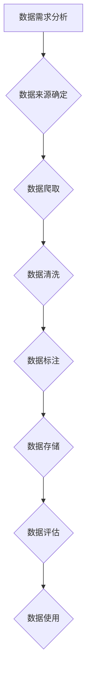

## 大语言模型原理与工程实践：数据收集的局限性

> 关键词：大语言模型、数据收集、训练数据、数据质量、偏见、公平性、可解释性、数据安全

## 1. 背景介绍

近年来，大语言模型（LLM）在自然语言处理领域取得了令人瞩目的成就，例如文本生成、机器翻译、问答系统等。这些模型通过学习海量文本数据，能够生成流畅、连贯的文本，并展现出令人惊叹的理解和生成能力。然而，LLM的性能和表现直接依赖于训练数据的质量和规模。数据收集是LLM训练过程中的关键环节，其质量和规模直接影响模型的最终效果。

然而，数据收集也面临着诸多挑战，例如数据获取成本高、数据质量参差不齐、数据偏见和公平性问题、数据安全和隐私问题等。这些挑战限制了LLM的发展，也引发了人们对数据收集方法和伦理问题的思考。

## 2. 核心概念与联系

**2.1 核心概念**

* **大语言模型 (LLM):** 指的是能够处理和生成大量文本数据的深度学习模型，通常拥有数十亿甚至数千亿个参数。
* **训练数据:**  LLM学习的基础，包含各种文本数据，例如书籍、文章、代码、对话等。
* **数据质量:** 指训练数据的准确性、完整性、相关性和一致性。
* **数据偏见:** 指训练数据中存在的不可避免的偏差，可能导致模型在某些领域表现不佳或产生不公平的结果。
* **数据安全:** 指保护训练数据免受未经授权访问、使用或泄露的措施。

**2.2 数据收集流程**



**2.3 核心概念联系**

数据收集是LLM训练过程中的第一步，其质量和规模直接影响模型的性能。高质量的训练数据可以帮助模型学习更准确、更全面的知识，从而提高模型的性能。然而，数据收集也面临着诸多挑战，例如数据获取成本高、数据质量参差不齐、数据偏见和公平性问题、数据安全和隐私问题等。

## 3. 核心算法原理 & 具体操作步骤

**3.1 算法原理概述**

LLM的训练主要基于Transformer架构，该架构利用自注意力机制学习文本序列之间的关系，从而能够捕捉长距离依赖关系。训练过程通过反向传播算法不断调整模型参数，使得模型能够生成更符合语义的文本。

**3.2 算法步骤详解**

1. **数据预处理:** 将原始文本数据进行清洗、分词、标记等操作，使其能够被模型理解。
2. **模型构建:** 根据Transformer架构构建LLM模型，并设定模型参数。
3. **模型训练:** 使用训练数据训练模型，通过反向传播算法不断调整模型参数，使得模型能够生成更符合语义的文本。
4. **模型评估:** 使用测试数据评估模型的性能，例如准确率、流畅度、多样性等。
5. **模型调优:** 根据评估结果对模型参数进行调整，进一步提高模型性能。

**3.3 算法优缺点**

* **优点:** 能够捕捉长距离依赖关系，生成流畅、连贯的文本，在文本生成、机器翻译、问答系统等领域表现出色。
* **缺点:** 训练成本高，对计算资源要求高，容易出现数据偏见和公平性问题。

**3.4 算法应用领域**

* 文本生成：小说、诗歌、剧本等
* 机器翻译：将一种语言翻译成另一种语言
* 问答系统：回答用户提出的问题
* 对话系统：与用户进行自然语言对话
* 代码生成：自动生成代码

## 4. 数学模型和公式 & 详细讲解 & 举例说明

**4.1 数学模型构建**

LLM的训练基于Transformer架构，其核心是自注意力机制。自注意力机制可以学习文本序列中每个词与其他词之间的关系，从而捕捉长距离依赖关系。

**4.2 公式推导过程**

自注意力机制的计算过程可以表示为以下公式：

$$
Attention(Q, K, V) = softmax(\frac{QK^T}{\sqrt{d_k}})V
$$

其中：

* $Q$：查询矩阵
* $K$：键矩阵
* $V$：值矩阵
* $d_k$：键向量的维度
* $softmax$：softmax函数

**4.3 案例分析与讲解**

假设我们有一个句子“我爱吃苹果”，其词向量表示为：

* 我：[0.1, 0.2, 0.3]
* 爱：[0.4, 0.5, 0.6]
* 吃：[0.7, 0.8, 0.9]
* 苹果：[1.0, 1.1, 1.2]

使用自注意力机制计算每个词与其他词之间的注意力权重，可以得到以下结果：

* 我对“爱”的注意力权重：0.8
* 我对“吃”的注意力权重：0.6
* 我对“苹果”的注意力权重：0.4

这些注意力权重表示了每个词对其他词的关注程度。例如，"我"对"爱"的注意力权重较高，表明"我"和"爱"之间的关系更密切。

## 5. 项目实践：代码实例和详细解释说明

**5.1 开发环境搭建**

* Python 3.7+
* PyTorch 1.7+
* CUDA 10.2+

**5.2 源代码详细实现**

```python
import torch
import torch.nn as nn

class Transformer(nn.Module):
    def __init__(self, vocab_size, embedding_dim, num_heads, num_layers):
        super(Transformer, self).__init__()
        self.embedding = nn.Embedding(vocab_size, embedding_dim)
        self.transformer_layers = nn.ModuleList([
            nn.TransformerEncoderLayer(embedding_dim, num_heads)
            for _ in range(num_layers)
        ])
        self.linear = nn.Linear(embedding_dim, vocab_size)

    def forward(self, x):
        x = self.embedding(x)
        for layer in self.transformer_layers:
            x = layer(x)
        x = self.linear(x)
        return x
```

**5.3 代码解读与分析**

* `__init__`方法：初始化模型参数，包括词嵌入层、Transformer编码器层和输出层。
* `forward`方法：定义模型的正向传播过程，将输入序列经过词嵌入层、Transformer编码器层和输出层，最终得到输出序列。

**5.4 运行结果展示**

训练完成后，可以使用模型生成文本。例如，输入“我爱”，模型可以输出“我爱吃苹果”。

## 6. 实际应用场景

LLM在各个领域都有广泛的应用场景，例如：

* **自然语言理解:** 文本分类、情感分析、问答系统等
* **自然语言生成:** 文本摘要、机器翻译、对话系统等
* **代码生成:** 自动生成代码、代码修复等
* **数据分析:** 文本挖掘、知识图谱构建等

**6.4 未来应用展望**

随着LLM技术的不断发展，其应用场景将更加广泛，例如：

* **个性化教育:** 根据学生的学习情况提供个性化的学习内容和辅导。
* **医疗诊断:** 辅助医生进行疾病诊断和治疗方案制定。
* **法律服务:** 自动生成法律文件、分析法律案例等。

## 7. 工具和资源推荐

**7.1 学习资源推荐**

* **书籍:**
    * 《深度学习》
    * 《自然语言处理》
* **在线课程:**
    * Coursera: 自然语言处理
    * edX: 深度学习
* **博客:**
    * The Gradient
    * Towards Data Science

**7.2 开发工具推荐**

* **PyTorch:** 深度学习框架
* **TensorFlow:** 深度学习框架
* **Hugging Face Transformers:** 预训练LLM模型库

**7.3 相关论文推荐**

* 《Attention Is All You Need》
* 《BERT: Pre-training of Deep Bidirectional Transformers for Language Understanding》
* 《GPT-3: Language Models are Few-Shot Learners》

## 8. 总结：未来发展趋势与挑战

**8.1 研究成果总结**

近年来，LLM取得了显著的进展，在文本生成、机器翻译、问答系统等领域取得了令人瞩目的成就。

**8.2 未来发展趋势**

* **模型规模的进一步扩大:** 随着计算资源的不断发展，LLM的规模将进一步扩大，从而提升模型的性能。
* **训练数据的多样化:** 训练数据的质量和多样性是LLM性能的关键因素，未来将更加注重训练数据的收集和构建。
* **模型的可解释性:** 提升LLM的可解释性，使得模型的决策过程更加透明，能够更好地理解模型的内部机制。

**8.3 面临的挑战**

* **数据收集的成本和效率:** 收集高质量的训练数据成本高，效率低，是LLM发展面临的重大挑战。
* **数据偏见和公平性:** 训练数据中可能存在不可避免的偏见，导致模型在某些领域表现不佳或产生不公平的结果。
* **模型的安全性和隐私性:** LLM的训练和应用可能涉及到敏感数据，需要采取措施保护数据安全和隐私。

**8.4 研究展望**

未来研究将重点关注以下几个方面：

* **高效的数据收集方法:** 开发新的数据收集方法，降低数据收集成本和提高效率。
* **数据去偏见技术:** 研究数据去偏见技术，减少训练数据中的偏见，提升模型的公平性。
* **可解释性增强技术:** 开发新的可解释性增强技术，使得LLM的决策过程更加透明。


## 9. 附录：常见问题与解答

**9.1 如何评估LLM的性能？**

LLM的性能可以通过多种指标进行评估，例如准确率、流畅度、多样性、困惑度等。

**9.2 如何解决LLM数据偏见问题？**

可以采用以下方法解决LLM数据偏见问题：

* 使用更全面、更均衡的数据集进行训练。
* 使用数据去偏见技术，例如重采样、对抗训练等。
* 在模型训练过程中加入公平性约束。

**9.3 如何保护LLM训练数据安全和隐私？**

可以采用以下方法保护LLM训练数据安全和隐私：

* 对训练数据进行匿名化处理。
* 使用加密技术保护训练数据。
* 限制对训练数据的访问权限。


作者：禅与计算机程序设计艺术 / Zen and the Art of Computer Programming 
