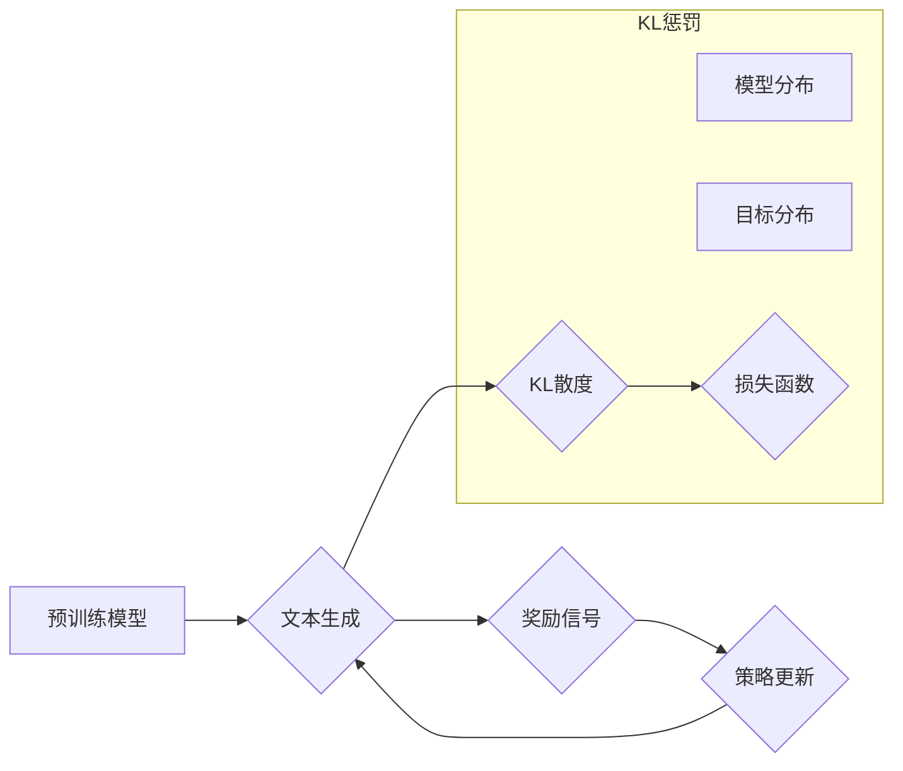

## 大语言模型原理基础与前沿 带有KL惩罚的强化学习：贝叶斯推理观点

> 关键词：大语言模型、强化学习、KL惩罚、贝叶斯推理、文本生成、自然语言处理

## 1. 背景介绍

近年来，大语言模型（Large Language Models，LLMs）在自然语言处理（Natural Language Processing，NLP）领域取得了令人瞩目的成就。从文本生成、翻译、问答到代码编写，LLMs展现出强大的能力，深刻地改变了我们与语言交互的方式。

传统的LLMs主要基于Transformer架构，通过大量的文本数据进行预训练，学习语言的语法和语义规律。然而，预训练模型的输出往往缺乏针对性，难以满足特定任务的需求。为了解决这个问题，强化学习（Reinforcement Learning，RL）逐渐成为LLMs训练的重要手段。

强化学习通过设计奖励机制，引导模型学习最优的策略，从而生成更符合用户期望的文本。然而，传统的RL方法存在一些问题，例如训练不稳定、样本效率低等。为了提高RL训练的效率和稳定性，引入KL惩罚（Kullback-Leibler Penalty）成为一种有效策略。

KL惩罚是一种正则化技术，它通过最小化模型分布与目标分布之间的KL散度，鼓励模型生成更符合目标分布的文本。在LLMs训练中，KL惩罚可以帮助模型更好地学习任务相关的知识，提高文本生成质量。

## 2. 核心概念与联系

### 2.1 强化学习

强化学习是一种机器学习方法，它通过**试错学习**的方式，让智能体在环境中采取行动，并根据环境反馈的**奖励**来调整行为策略，最终达到最大化累积奖励的目标。

强化学习的核心概念包括：

* **智能体（Agent）：** 决策者，根据环境信息采取行动。
* **环境（Environment）：** 智能体所处的外部世界，会根据智能体的行动提供反馈。
* **状态（State）：** 环境的当前状态。
* **动作（Action）：** 智能体可以采取的行动。
* **奖励（Reward）：** 环境对智能体行动的反馈，可以是正向奖励或负向惩罚。
* **策略（Policy）：** 智能体在不同状态下采取行动的概率分布。

### 2.2 KL惩罚

KL散度（Kullback-Leibler Divergence）是一种衡量两个概率分布之间差异的指标。在强化学习中，KL惩罚用于**约束模型分布**，防止模型过分偏离目标分布。

KL惩罚的原理是：

* 定义一个目标分布，例如真实数据分布。
* 计算模型分布与目标分布之间的KL散度。
* 将KL散度作为损失函数的一部分，在训练过程中最小化KL散度。

通过最小化KL散度，可以鼓励模型生成更符合目标分布的文本，从而提高文本生成质量。

### 2.3 贝叶斯推理

贝叶斯推理是一种概率推理方法，它基于贝叶斯定理，通过更新先验概率来得到后验概率。在LLMs训练中，贝叶斯推理可以用于**处理不确定性**，例如文本生成过程中存在多个可能的输出。

贝叶斯推理的优势在于：

* 可以量化不确定性。
* 可以利用先验知识。
* 可以进行概率性推理。

### 2.4 核心概念联系

**Mermaid 流程图**



## 3. 核心算法原理 & 具体操作步骤

### 3.1 算法原理概述

带有KL惩罚的强化学习算法结合了预训练模型的语言能力和强化学习的策略优化能力，通过最小化KL散度来引导模型生成更符合目标分布的文本。

具体来说，该算法流程如下：

1. 使用预训练模型生成文本候选。
2. 计算文本候选的奖励信号。
3. 使用强化学习算法更新策略，引导模型生成更高奖励的文本。
4. 在策略更新过程中，引入KL惩罚项，约束模型分布与目标分布之间的差异。

### 3.2 算法步骤详解

1. **预训练模型生成文本候选：**

   使用预训练的Transformer模型，根据输入文本生成多个文本候选。

2. **计算奖励信号：**

   根据文本生成任务的目标，设计奖励函数，计算每个文本候选的奖励值。例如，在文本摘要任务中，可以根据摘要的准确性和流畅度计算奖励值。

3. **策略更新：**

   使用强化学习算法，例如策略梯度算法，更新模型的策略参数。策略参数决定了模型在不同状态下生成不同文本的概率。

4. **KL惩罚项：**

   在策略更新过程中，引入KL惩罚项，将模型分布与目标分布之间的KL散度作为损失函数的一部分。

5. **迭代训练：**

   重复以上步骤，直到模型的性能达到预期目标。

### 3.3 算法优缺点

**优点：**

* 可以生成更符合用户期望的文本。
* 可以学习到任务相关的知识。
* 可以提高文本生成质量。

**缺点：**

* 训练过程复杂，需要大量的计算资源。
* 需要设计合适的奖励函数，否则可能会导致模型学习到错误的策略。
* KL惩罚项的设置需要谨慎，过大的惩罚可能会导致模型过拟合。

### 3.4 算法应用领域

带有KL惩罚的强化学习算法在以下领域具有广泛的应用前景：

* 文本生成：例如，新闻报道、小说创作、对话系统等。
* 机器翻译：提高翻译的准确性和流畅度。
* 问答系统：生成更准确和有针对性的答案。
* 代码生成：自动生成代码片段。

## 4. 数学模型和公式 & 详细讲解 & 举例说明

### 4.1 数学模型构建

假设我们有一个文本生成任务，目标是生成一段符合特定主题的文本。

* **状态空间 S:** 包含所有可能的文本生成状态，例如当前生成的文本片段。
* **动作空间 A:** 包含所有可能的文本生成动作，例如添加一个单词、删除一个单词等。
* **策略 π(a|s):** 模型在状态 s 下采取动作 a 的概率分布。
* **奖励函数 R(s, a):** 模型在状态 s 执行动作 a 后获得的奖励值。
* **目标分布 p(x):** 真实文本数据的分布。
* **模型分布 p_θ(x):** 模型生成文本的概率分布，其中 θ 是模型参数。

### 4.2 公式推导过程

**KL散度公式:**

$$
KL(p_θ(x) || p(x)) = \sum_x p_θ(x) \log \frac{p_θ(x)}{p(x)}
$$

**损失函数:**

$$
L = - \sum_{x} R(s, a) \pi(a|s) + \lambda KL(p_θ(x) || p(x))
$$

其中，λ 是 KL 惩罚系数，用于控制 KL 散度的影响程度。

**策略梯度更新公式:**

$$
\theta = \theta + \alpha \nabla_{\theta} \mathbb{E}_{s, a \sim \pi} [R(s, a)]
$$

其中，α 是学习率。

### 4.3 案例分析与讲解

假设我们训练一个文本摘要模型，目标是生成一篇新闻报道的摘要。

* **状态空间 S:** 包含当前生成的摘要片段。
* **动作空间 A:** 包含添加一个单词、删除一个单词等动作。
* **奖励函数 R(s, a):** 根据摘要的准确性和流畅度计算奖励值。
* **目标分布 p(x):** 真实新闻报道摘要的分布。
* **模型分布 p_θ(x):** 模型生成摘要的概率分布。

在训练过程中，模型会根据奖励信号更新策略，生成更符合目标分布的摘要。KL惩罚项则会约束模型分布与目标分布之间的差异，防止模型过分偏离真实数据分布。

## 5. 项目实践：代码实例和详细解释说明

### 5.1 开发环境搭建

* Python 3.7+
* PyTorch 1.7+
* Transformers 4.0+

### 5.2 源代码详细实现

```python
import torch
import torch.nn as nn
from transformers import GPT2LMHeadModel

class TextSummarizer(nn.Module):
    def __init__(self, model_name="gpt2"):
        super(TextSummarizer, self).__init__()
        self.model = GPT2LMHeadModel.from_pretrained(model_name)
        self.reward_model = nn.Linear(self.model.config.hidden_size, 1)

    def forward(self, input_ids, attention_mask):
        outputs = self.model(input_ids=input_ids, attention_mask=attention_mask)
        logits = outputs.logits
        return logits

    def calculate_reward(self, summary_ids):
        summary_embeddings = self.model.encoder(summary_ids)
        rewards = self.reward_model(summary_embeddings[:, 0, :])
        return rewards

#... (其他代码，例如训练循环、策略更新等)
```

### 5.3 代码解读与分析

* **TextSummarizer 类:** 定义了文本摘要模型，包含预训练的 GPT2 模型和一个奖励模型。
* **forward 方法:** 使用预训练模型生成文本摘要的logits。
* **calculate_reward 方法:** 使用奖励模型计算摘要的奖励值。
* **训练循环:** 使用强化学习算法，例如策略梯度算法，更新模型参数，并使用 KL 惩罚项约束模型分布。

### 5.4 运行结果展示

训练完成后，可以将模型应用于新的文本数据，生成摘要。

## 6. 实际应用场景

带有KL惩罚的强化学习算法在文本生成领域具有广泛的应用场景，例如：

* **新闻摘要:** 自动生成新闻报道的摘要，节省用户阅读时间。
* **小说创作:** 辅助作家创作小说，生成情节、人物对话等内容。
* **对话系统:** 训练更自然流畅的对话系统，提高用户体验。
* **代码生成:** 自动生成代码片段，提高开发效率。

### 6.4 未来应用展望

随着技术的不断发展，带有KL惩罚的强化学习算法在未来将有更广泛的应用场景，例如：

* **个性化文本生成:** 根据用户的喜好和需求生成个性化的文本内容。
* **跨语言文本生成:** 实现不同语言之间的文本生成和翻译。
* **多模态文本生成:** 将文本与图像、音频等其他模态信息结合，生成更丰富多彩的文本内容。

## 7. 工具和资源推荐

### 7.1 学习资源推荐

* **书籍:**
    * 《Reinforcement Learning: An Introduction》 by Sutton and Barto
    * 《Deep Reinforcement Learning Hands-On》 by Maxim Lapan
* **在线课程:**
    * Coursera: Reinforcement Learning Specialization
    * Udacity: Deep Reinforcement Learning Nanodegree

### 7.2 开发工具推荐

* **PyTorch:** 深度学习框架，支持强化学习算法的实现。
* **TensorFlow:** 深度学习框架，也支持强化学习算法的实现。
* **OpenAI Gym:** 强化学习环境库，提供各种标准的强化学习任务。

### 7.3 相关论文推荐

* **"Proximal Policy Optimization Algorithms"** by Schulman et al.
* **"Trust Region Policy Optimization"** by Schulman et al.
* **"Asynchronous Methods for Deep Reinforcement Learning"** by Mnih et al.

## 8. 总结：未来发展趋势与挑战

### 8.1 研究成果总结

带有KL惩罚的强化学习算法在文本生成领域取得了显著的