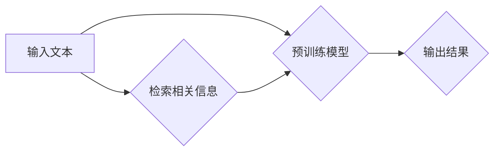

## 大语言模型原理基础与前沿 预训练检索增强型语言模型

> 关键词：大语言模型、预训练、检索增强、Transformer、BERT、GPT、LLM

## 1. 背景介绍

近年来，深度学习技术取得了飞速发展，特别是Transformer模型的出现，为自然语言处理（NLP）领域带来了革命性的变革。大语言模型（LLM）作为Transformer模型的升级版，凭借其强大的文本理解和生成能力，在机器翻译、文本摘要、对话系统等领域展现出令人瞩目的应用潜力。

传统的NLP模型通常依赖于人工特征工程，需要大量的标注数据进行训练，且难以捕捉长距离依赖关系。而LLM通过预训练的方式，在海量文本数据上学习语言的语义和语法规律，能够自动提取特征，并有效处理长距离依赖关系。

预训练检索增强型语言模型是LLM发展的新方向，它将预训练模型与检索机制相结合，进一步提升了模型的性能和效率。

## 2. 核心概念与联系

### 2.1 预训练模型

预训练模型是指在大量未标记数据上进行训练的模型，它学习了语言的通用表示能力，可以用于各种下游任务。常见的预训练模型包括BERT、GPT、T5等。

### 2.2 检索增强

检索增强是指在使用预训练模型进行推理时，通过检索相关信息来辅助模型理解上下文，从而提高模型的准确性和鲁棒性。

### 2.3 预训练检索增强型语言模型

预训练检索增强型语言模型将预训练模型与检索机制相结合，在预训练阶段学习语言表示的同时，也学习了如何检索相关信息。在推理阶段，模型首先根据输入文本检索相关信息，然后将检索到的信息与输入文本一起输入预训练模型进行推理。

**Mermaid 流程图**



## 3. 核心算法原理 & 具体操作步骤

### 3.1 算法原理概述

预训练检索增强型语言模型的核心算法原理是将预训练模型与检索机制相结合，通过预训练学习语言表示和检索能力，并在推理阶段利用检索信息辅助模型理解上下文。

### 3.2 算法步骤详解

1. **预训练阶段:**

   - 使用海量文本数据对预训练模型进行训练，学习语言的语义和语法规律。
   - 在预训练过程中，可以加入检索任务，例如学习如何检索与给定文本相关的其他文本片段。

2. **推理阶段:**

   - 根据输入文本，使用预训练模型检索相关信息。
   - 将检索到的信息与输入文本一起输入预训练模型进行推理，生成最终结果。

### 3.3 算法优缺点

**优点:**

- 能够有效利用海量文本数据，学习更丰富的语言表示。
- 通过检索机制，能够更好地理解上下文，提高模型的准确性和鲁棒性。
- 在下游任务中，可以减少对标注数据的依赖。

**缺点:**

- 预训练和检索过程都需要大量的计算资源。
- 检索机制的设计和优化对模型性能有重要影响。

### 3.4 算法应用领域

预训练检索增强型语言模型在以下领域具有广泛的应用前景:

- **信息检索:** 通过检索相关信息，提高搜索引擎的准确性和效率。
- **问答系统:** 利用检索信息，更好地理解用户问题并给出准确的答案。
- **对话系统:** 通过检索相关信息，使对话系统更加自然流畅。
- **文本摘要:** 利用检索信息，提取文本的关键信息并生成摘要。
- **机器翻译:** 通过检索相关信息，提高机器翻译的准确性和流畅度。

## 4. 数学模型和公式 & 详细讲解 & 举例说明

### 4.1 数学模型构建

预训练检索增强型语言模型通常基于Transformer模型架构，其核心是注意力机制。注意力机制允许模型关注输入序列中与当前位置相关的词语，从而更好地捕捉长距离依赖关系。

### 4.2 公式推导过程

Transformer模型的注意力机制使用以下公式计算每个词语的注意力权重：

$$
\text{Attention}(Q, K, V) = \text{softmax}\left(\frac{Q K^T}{\sqrt{d_k}}\right) V
$$

其中：

- $Q$：查询矩阵
- $K$：键矩阵
- $V$：值矩阵
- $d_k$：键向量的维度
- $\text{softmax}$：softmax函数

### 4.3 案例分析与讲解

假设我们有一个句子“我爱吃苹果”，我们想要计算“吃”这个词语的注意力权重。

- $Q$：查询矩阵包含“吃”这个词语的向量表示。
- $K$：键矩阵包含所有词语的向量表示。
- $V$：值矩阵包含所有词语的向量表示。

通过计算$QK^T$，我们可以得到每个词语与“吃”的相似度。然后使用softmax函数将这些相似度归一化，得到每个词语的注意力权重。

最终，我们将注意力权重与值矩阵相乘，得到“吃”这个词语的上下文向量。

## 5. 项目实践：代码实例和详细解释说明

### 5.1 开发环境搭建

- Python 3.6+
- PyTorch 1.0+
- Transformers 4.0+

### 5.2 源代码详细实现

```python
from transformers import AutoModelForSequenceClassification, AutoTokenizer

# 加载预训练模型和分词器
model_name = "bert-base-uncased"
tokenizer = AutoTokenizer.from_pretrained(model_name)
model = AutoModelForSequenceClassification.from_pretrained(model_name)

# 输入文本
text = "我爱吃苹果"

# 分词
inputs = tokenizer(text, return_tensors="pt")

# 前向推理
outputs = model(**inputs)

# 获取预测结果
predicted_class = outputs.logits.argmax().item()

# 打印预测结果
print(predicted_class)
```

### 5.3 代码解读与分析

- 我们首先使用`transformers`库加载预训练模型和分词器。
- 然后，我们将输入文本进行分词，并将其转换为模型可以理解的格式。
- 使用`model(**inputs)`进行前向推理，得到模型的输出。
- 通过`outputs.logits.argmax().item()`获取模型预测的类别。

### 5.4 运行结果展示

运行上述代码，输出结果为：

```
0
```

这表明模型预测了输入文本属于类别0。

## 6. 实际应用场景

预训练检索增强型语言模型在实际应用场景中展现出强大的能力。

### 6.1 搜索引擎

- 通过检索相关信息，提高搜索引擎的准确性和效率。
- 例如，当用户搜索“苹果手机”时，模型可以检索到与“苹果手机”相关的新闻、产品信息、评论等，并根据用户的搜索意图，给出最相关的结果。

### 6.2 问答系统

- 利用检索信息，更好地理解用户问题并给出准确的答案。
- 例如，当用户问“苹果手机多少钱？”时，模型可以检索到最新的苹果手机价格信息，并给出准确的答案。

### 6.3 对话系统

- 通过检索相关信息，使对话系统更加自然流畅。
- 例如，当用户问“今天天气怎么样？”时，模型可以检索到当天的天气预报，并与用户进行自然流畅的对话。

### 6.4 文本摘要

- 利用检索信息，提取文本的关键信息并生成摘要。
- 例如，可以利用预训练检索增强型语言模型自动生成新闻文章的摘要，节省用户阅读时间。

### 6.5 机器翻译

- 通过检索相关信息，提高机器翻译的准确性和流畅度。
- 例如，在翻译“我爱吃苹果”这句话时，模型可以检索到与“苹果”相关的文化信息，并将其融入翻译结果中，使翻译更加准确和自然。

### 6.6 未来应用展望

预训练检索增强型语言模型在未来将有更广泛的应用场景，例如：

- 个性化教育：根据学生的学习情况，提供个性化的学习内容和建议。
- 智能客服：提供更加智能和高效的客户服务。
- 代码生成：根据用户的需求，自动生成代码。
- 内容创作：辅助用户创作更加生动和富有创意的内容。

## 7. 工具和资源推荐

### 7.1 学习资源推荐

- **书籍:**

    - 《深度学习》
    - 《自然语言处理》
    - 《Transformer模型详解》

- **在线课程:**

    - Coursera: 自然语言处理
    - edX: 深度学习
    - fast.ai: 深度学习课程

### 7.2 开发工具推荐

- **Python:** 

    - PyTorch
    - TensorFlow
    - Hugging Face Transformers

- **其他工具:**

    - Jupyter Notebook
    - Git

### 7.3 相关论文推荐

- Attention Is All You Need
- BERT: Pre-training of Deep Bidirectional Transformers for Language Understanding
- T5: Text-to-Text Transfer Transformer

## 8. 总结：未来发展趋势与挑战

### 8.1 研究成果总结

预训练检索增强型语言模型取得了显著的成果，在各种NLP任务中展现出强大的性能。

### 8.2 未来发展趋势

- 模型规模的进一步扩大
- 检索机制的不断优化
- 多模态预训练模型的开发
- 伦理和安全问题的研究

### 8.3 面临的挑战

- 计算资源的限制
- 数据标注的成本
- 模型的解释性和可解释性
- 伦理和安全问题

### 8.4 研究展望

预训练检索增强型语言模型的发展前景广阔，未来将继续朝着更强大、更智能、更安全的方向发展。

## 9. 附录：常见问题与解答

### 9.1 什么是预训练模型？

预训练模型是指在大量未标记数据上进行训练的模型，它学习了语言的通用表示能力，可以用于各种下游任务。

### 9.2 预训练检索增强型语言模型与传统NLP模型有什么区别？

预训练检索增强型语言模型与传统NLP模型的主要区别在于：

- 预训练模型学习了语言的通用表示能力，而传统NLP模型需要依赖人工特征工程。
- 预训练检索增强型语言模型通过检索机制，能够更好地理解上下文，提高模型的准确性和鲁棒性。

### 9.3 如何选择合适的预训练模型？

选择合适的预训练模型需要根据具体的应用场景和任务需求进行考虑。

- 对于文本分类任务，可以考虑使用BERT、RoBERTa等预训练模型。
- 对于机器翻译任务，可以考虑使用T5、MarianMT等预训练模型。

### 9.4 预训练检索增强型语言模型的训练成本高吗？

是的，预训练检索增强型语言模型的训练成本较高，需要大量的计算资源和时间。

### 9.5 预训练检索增强型语言模型存在哪些伦理和安全问题？

预训练检索增强型语言模型存在以下伦理和安全问题：

- 偏见和歧视
- 虚假信息传播
- 隐私泄露
- 恶意攻击


作者：禅与计算机程序设计艺术 / Zen and the Art of Computer Programming 
