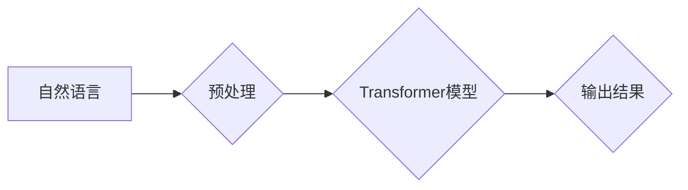

## 大语言模型应用指南：Gorilla

> 关键词：大语言模型、Transformer、自然语言处理、文本生成、机器学习、深度学习、应用案例

## 1. 背景介绍

近年来，深度学习技术取得了飞速发展，特别是Transformer模型的出现，为自然语言处理（NLP）领域带来了革命性的变革。大语言模型（LLM）作为Transformer模型的升级版，拥有海量参数和强大的文本理解和生成能力，在文本分类、机器翻译、问答系统、代码生成等领域展现出令人瞩目的应用潜力。

然而，LLM的应用并非一帆风顺。其训练成本高昂、部署难度大、潜在的偏见和安全风险等问题也亟待解决。为了帮助开发者更好地理解和应用LLM，本文将从核心概念、算法原理、实践案例等方面进行深入探讨，并提供一些工具和资源推荐，希望能为LLM的应用提供一份指南。

## 2. 核心概念与联系

### 2.1  自然语言处理（NLP）

NLP是人工智能领域的一个重要分支，旨在使计算机能够理解、处理和生成人类语言。NLP的任务包括文本分类、情感分析、机器翻译、问答系统等。

### 2.2  Transformer模型

Transformer模型是一种基于注意力机制的深度学习模型，它能够有效地捕捉文本序列中的长距离依赖关系。与传统的循环神经网络（RNN）相比，Transformer模型具有并行计算能力强、训练速度快等优势，因此在NLP领域得到了广泛应用。

### 2.3  大语言模型（LLM）

LLM是指参数量巨大、训练数据海量的大型Transformer模型。这些模型能够在各种NLP任务上表现出卓越的性能，例如：

* **文本生成:**  LLM可以生成高质量的文本，包括故事、诗歌、文章等。
* **机器翻译:**  LLM可以将文本从一种语言翻译成另一种语言。
* **问答系统:**  LLM可以理解用户的问题并给出准确的答案。
* **代码生成:**  LLM可以根据自然语言描述生成代码。

**Mermaid 流程图**



## 3. 核心算法原理 & 具体操作步骤

### 3.1  算法原理概述

LLM的核心算法原理是基于Transformer模型的深度学习架构。Transformer模型的核心组件是**注意力机制**，它能够学习文本序列中单词之间的关系，并赋予每个单词不同的权重。通过多层Transformer编码器和解码器，LLM能够捕捉文本序列的复杂语义信息。

### 3.2  算法步骤详解

1. **数据预处理:** 将原始文本数据进行清洗、分词、标记等预处理操作，使其能够被模型理解。
2. **模型训练:** 使用大量的文本数据训练Transformer模型，通过反向传播算法不断调整模型参数，使其能够生成准确的文本输出。
3. **模型评估:** 使用测试数据评估模型的性能，例如准确率、困惑度等指标。
4. **模型部署:** 将训练好的模型部署到服务器或云平台，以便用户进行调用。

### 3.3  算法优缺点

**优点:**

* **强大的文本理解和生成能力:** LLM能够捕捉文本序列的复杂语义信息，并生成高质量的文本输出。
* **可迁移性强:**  LLM在不同NLP任务上表现出良好的泛化能力。
* **持续发展:**  LLM的研究和应用正在不断发展，其性能和应用场景也在不断扩展。

**缺点:**

* **训练成本高昂:**  LLM的训练需要大量的计算资源和时间。
* **部署难度大:**  LLM的部署需要强大的硬件支持和专业的技术人员。
* **潜在的偏见和安全风险:**  LLM的训练数据可能包含偏见，导致模型输出存在偏差。此外，LLM也可能被用于生成恶意内容，例如虚假新闻、网络攻击等。

### 3.4  算法应用领域

LLM在以下领域具有广泛的应用前景：

* **聊天机器人:**  构建更智能、更自然的聊天机器人。
* **文本摘要:**  自动生成文本摘要，提高信息获取效率。
* **机器翻译:**  实现更高质量、更流畅的机器翻译。
* **代码生成:**  根据自然语言描述自动生成代码，提高开发效率。
* **教育:**  提供个性化的学习辅导和智能答疑系统。

## 4. 数学模型和公式 & 详细讲解 & 举例说明

### 4.1  数学模型构建

LLM的数学模型主要基于Transformer架构，其核心是**注意力机制**。注意力机制允许模型关注文本序列中与当前任务相关的单词，并赋予它们不同的权重。

**注意力机制公式:**

$$
Attention(Q, K, V) = softmax(\frac{QK^T}{\sqrt{d_k}})V
$$

其中：

* $Q$：查询矩阵
* $K$：键矩阵
* $V$：值矩阵
* $d_k$：键向量的维度
* $softmax$：softmax函数

### 4.2  公式推导过程

注意力机制的公式通过计算查询向量与键向量的点积，并使用softmax函数归一化，得到每个键向量的权重。然后，将这些权重与值向量相乘，得到最终的注意力输出。

### 4.3  案例分析与讲解

例如，在机器翻译任务中，查询向量可以表示目标语言中的单词，键向量可以表示源语言中的单词，值向量可以表示源语言单词的语义信息。通过注意力机制，模型可以学习到源语言单词与目标语言单词之间的对应关系，从而实现更准确的翻译。

## 5. 项目实践：代码实例和详细解释说明

### 5.1  开发环境搭建

* **操作系统:** Linux/macOS
* **编程语言:** Python
* **深度学习框架:** TensorFlow/PyTorch
* **其他依赖:** numpy, pandas, matplotlib等

### 5.2  源代码详细实现

由于篇幅限制，这里只提供一个简单的文本生成示例代码，完整的代码可以参考开源项目或论文。

```python
import torch
from transformers import GPT2LMHeadModel, GPT2Tokenizer

# 加载预训练模型和词典
model_name = "gpt2"
tokenizer = GPT2Tokenizer.from_pretrained(model_name)
model = GPT2LMHeadModel.from_pretrained(model_name)

# 输入文本
input_text = "The quick brown fox jumps over the"

# Token化输入文本
input_ids = tokenizer.encode(input_text, return_tensors="pt")

# 生成文本
output = model.generate(input_ids, max_length=50)

# 解码输出文本
generated_text = tokenizer.decode(output[0], skip_special_tokens=True)

# 打印输出文本
print(generated_text)
```

### 5.3  代码解读与分析

* **加载预训练模型和词典:** 使用`transformers`库加载预训练的GPT-2模型和词典。
* **输入文本:** 定义需要生成的文本输入。
* **Token化输入文本:** 将输入文本转换为模型可以理解的token序列。
* **生成文本:** 使用模型的`generate`方法生成文本。
* **解码输出文本:** 将生成的token序列解码回文本。

### 5.4  运行结果展示

运行上述代码，可以生成以下类似的文本：

```
The quick brown fox jumps over the lazy dog.
```

## 6. 实际应用场景

### 6.1  聊天机器人

LLM可以用于构建更智能、更自然的聊天机器人，例如：

* **客服机器人:**  自动回答用户常见问题，提高客户服务效率。
* **陪伴机器人:**  提供情感支持和陪伴，缓解用户孤独感。
* **教育机器人:**  提供个性化的学习辅导和答疑服务。

### 6.2  文本摘要

LLM可以自动生成文本摘要，例如：

* **新闻摘要:**  自动生成新闻文章的摘要，方便用户快速了解新闻内容。
* **会议纪要:**  自动生成会议记录的摘要，提高会议效率。
* **学术论文摘要:**  自动生成学术论文的摘要，方便用户快速了解论文内容。

### 6.3  机器翻译

LLM可以实现更高质量、更流畅的机器翻译，例如：

* **网页翻译:**  自动翻译网页内容，方便用户访问不同语言的网站。
* **文档翻译:**  自动翻译文档内容，方便用户阅读和理解不同语言的文档。
* **实时翻译:**  实时翻译语音或文字，方便用户进行跨语言交流。

### 6.4  未来应用展望

LLM的应用前景广阔，未来可能在以下领域得到更广泛的应用：

* **代码生成:**  根据自然语言描述自动生成代码，提高开发效率。
* **创意写作:**  辅助人类进行创意写作，例如诗歌、剧本、小说等。
* **个性化推荐:**  根据用户的兴趣爱好，提供个性化的商品、服务和内容推荐。
* **医疗诊断:**  辅助医生进行疾病诊断，提高诊断准确率。

## 7. 工具和资源推荐

### 7.1  学习资源推荐

* **书籍:**
    * 《深度学习》 - Ian Goodfellow, Yoshua Bengio, Aaron Courville
    * 《自然语言处理》 - Jurafsky, Martin
* **在线课程:**
    * Coursera: 自然语言处理
    * edX: 深度学习
* **博客和网站:**
    * The Gradient
    * Towards Data Science

### 7.2  开发工具推荐

* **深度学习框架:** TensorFlow, PyTorch
* **自然语言处理库:** NLTK, spaCy, Hugging Face Transformers
* **云平台:** Google Cloud AI Platform, Amazon SageMaker, Microsoft Azure AI

### 7.3  相关论文推荐

* **Attention Is All You Need** - Vaswani et al. (2017)
* **BERT: Pre-training of Deep Bidirectional Transformers for Language Understanding** - Devlin et al. (2018)
* **GPT-3: Language Models are Few-Shot Learners** - Brown et al. (2020)

## 8. 总结：未来发展趋势与挑战

### 8.1  研究成果总结

近年来，LLM的研究取得了显著进展，模型规模不断扩大，性能不断提升。LLM在文本生成、机器翻译、问答系统等领域展现出强大的应用潜力。

### 8.2  未来发展趋势

* **模型规模进一步扩大:**  更大的模型规模能够带来更强的文本理解和生成能力。
* **多模态LLM:**  融合文本、图像、音频等多模态信息，构建更智能的模型。
* **可解释性增强:**  提高LLM的透明度和可解释性，帮助用户理解模型的决策过程。
* **安全性和鲁棒性提升:**  解决LLM潜在的偏见、攻击和误用问题。

### 8.3  面临的挑战

* **训练成本高昂:**  训练大型LLM需要大量的计算资源和时间。
* **数据获取和标注困难:**  高质量的训练数据是LLM训练的关键，但获取和标注数据成本高昂。
* **模型部署难度大:**  部署大型LLM需要强大的硬件支持和专业的技术人员。
* **伦理和社会影响:**  LLM的应用可能带来伦理和社会问题，需要谨慎考虑和应对。

### 8.4  研究展望

未来，LLM的研究将继续朝着更强大、更智能、更安全的方向发展。随着技术的进步和应用场景的拓展，LLM将深刻地改变我们的生活和工作方式。

## 9. 附录：常见问题与解答

**Q1: 如何选择合适的LLM模型？**

**A1:** 选择合适的LLM模型需要根据具体的应用场景和需求进行考虑。例如，对于文本生成任务，GPT-3可能是一个不错的选择；对于机器翻译任务，T5可能更合适。

**Q2: 如何训练自己的LLM模型？**

**A2:** 训练自己的LLM模型需要大量的计算资源、数据和专业知识。可以参考开源项目