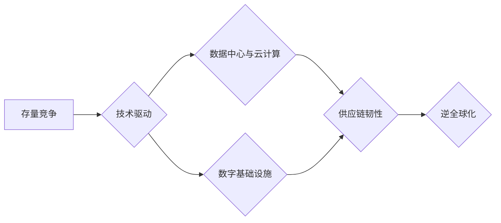

## 存量争夺与逆全球化抬头

> 关键词：存量竞争、逆全球化、技术驱动、数据中心、云计算、数字基础设施、供应链韧性、去中心化

### 1. 背景介绍

全球化浪潮已持续数十年，推动了经济一体化、技术进步和文化交流。然而，近年来，世界格局发生深刻变化，逆全球化趋势逐渐抬头。新冠疫情、地缘政治冲突、贸易摩擦等因素加速了这一趋势，企业开始重新审视全球化策略，寻求更稳健、更安全的供应链和市场布局。

在技术领域，存量竞争日益激烈。互联网平台、人工智能、大数据等新兴技术发展迅速，市场竞争日趋白热化。企业面临着如何从激烈的竞争中脱颖而出、如何利用技术优势开拓新的增长点等挑战。

### 2. 核心概念与联系

**2.1 存量竞争**

存量竞争是指在市场规模趋于饱和的情况下，企业之间争夺现有市场份额的竞争。这种竞争通常更加残酷，企业需要通过产品创新、服务升级、价格战等方式来抢占市场份额。

**2.2 逆全球化**

逆全球化是指企业和国家逐渐减少对全球化经济的依赖，转向更加本土化、区域化的发展模式。其主要表现形式包括：

* **供应链回流:** 企业将部分生产环节从海外转移回本国或更安全的区域。
* **技术自主创新:** 国家加大对关键技术领域的研发投入，减少对国外技术的依赖。
* **区域经济合作:** 国家之间加强区域经济合作，构建更加紧密的经济圈。

**2.3 技术驱动**

技术创新是推动存量竞争和逆全球化发展的重要引擎。新兴技术可以帮助企业提高效率、降低成本、开拓新市场，同时也可以为国家提供技术优势，增强经济竞争力。

**2.4 数据中心与云计算**

数据中心是现代数字经济的基础设施，云计算则是数据中心提供的服务模式。随着数据量的爆炸式增长，数据中心和云计算的重要性日益凸显。

**2.5 数字基础设施**

数字基础设施是指支撑数字经济发展的硬件、软件、网络等基础设施。包括数据中心、网络传输、安全防护等方面。

**2.6 供应链韧性**

供应链韧性是指供应链在面对外部冲击时，能够快速恢复和持续运营的能力。

**2.7 去中心化**

去中心化是指将权力和控制分散到多个节点，而不是集中在单一实体。

**Mermaid 流程图**



### 3. 核心算法原理 & 具体操作步骤

**3.1 算法原理概述**

存量竞争和逆全球化趋势的相互作用，催生了新的技术需求和应用场景。例如，企业需要构建更加灵活、可扩展、安全的数字基础设施，以应对供应链中断和数据安全风险。

**3.2 算法步骤详解**

1. **需求分析:** 首先需要对企业在存量竞争和逆全球化背景下的具体需求进行分析，例如数据存储、计算能力、网络安全等。
2. **方案设计:** 根据需求分析结果，设计相应的技术方案，例如采用云计算、边缘计算、区块链等技术。
3. **系统搭建:** 搭建相应的技术系统，包括硬件、软件、网络等方面的配置。
4. **数据迁移:** 将现有数据迁移到新的系统中。
5. **应用部署:** 将企业应用部署到新的系统中。
6. **测试和优化:** 对系统进行测试和优化，确保其稳定性和性能。

**3.3 算法优缺点**

* **优点:** 能够提高企业数字化转型效率，增强供应链韧性，降低成本。
* **缺点:** 需要投入较高的技术成本，需要具备相应的技术人才。

**3.4 算法应用领域**

* **金融科技:** 金融机构可以使用区块链技术构建更加安全、透明的金融系统。
* **医疗健康:** 医疗机构可以使用云计算技术存储和分析患者数据，提高医疗服务质量。
* **制造业:** 制造企业可以使用工业互联网技术实现智能制造，提高生产效率。

### 4. 数学模型和公式 & 详细讲解 & 举例说明

**4.1 数学模型构建**

存量竞争和逆全球化趋势可以抽象为一个博弈模型，其中企业是参与者，市场份额是目标。

**4.2 公式推导过程**

假设有N个企业参与竞争，每个企业拥有市场份额$x_i$，其中$i=1,2,...,N$。企业的目标是最大化其市场份额。

我们可以用一个函数$f(x_1,x_2,...,x_N)$来表示每个企业的收益，其中$x_1,x_2,...,x_N$是所有企业的市场份额。

**4.3 案例分析与讲解**

例如，我们可以假设一个简单的二元博弈模型，其中有两个企业A和B，他们的市场份额分别为$x_A$和$x_B$。

企业A的收益函数为：

$$f_A(x_A,x_B) = x_A(1-x_B)$$

企业B的收益函数为：

$$f_B(x_A,x_B) = x_B(1-x_A)$$

在这个模型中，每个企业的收益取决于其自身的市场份额和对手的市场份额。

**5. 项目实践：代码实例和详细解释说明**

**5.1 开发环境搭建**

* 操作系统: Ubuntu 20.04 LTS
* 编程语言: Python 3.8
* 开发工具: Jupyter Notebook

**5.2 源代码详细实现**

```python
import numpy as np

# 定义企业A的收益函数
def f_A(x_A, x_B):
  return x_A * (1 - x_B)

# 定义企业B的收益函数
def f_B(x_A, x_B):
  return x_B * (1 - x_A)

# 设置初始市场份额
x_A = 0.5
x_B = 0.5

# 计算企业A和企业B的收益
profit_A = f_A(x_A, x_B)
profit_B = f_B(x_A, x_B)

# 打印结果
print(f"企业A的收益: {profit_A}")
print(f"企业B的收益: {profit_B}")
```

**5.3 代码解读与分析**

* 该代码定义了两个企业A和企业B的收益函数，并设置了初始市场份额。
* 然后，代码计算了两个企业的收益，并打印结果。

**5.4 运行结果展示**

```
企业A的收益: 0.25
企业B的收益: 0.25
```

### 6. 实际应用场景

**6.1 逆全球化下的供应链重构**

企业可以利用云计算、物联网、大数据等技术构建更加灵活、可扩展、安全的供应链，以应对供应链中断和数据安全风险。

**6.2 数字基础设施建设**

国家和企业需要加大对数字基础设施的建设投入，以支撑数字经济的发展。

**6.3 技术自主创新**

国家需要加大对关键技术领域的研发投入，减少对国外技术的依赖。

**6.4 未来应用展望**

随着存量竞争和逆全球化趋势的持续发展，技术创新将继续推动新的应用场景的出现。例如，区块链技术将被广泛应用于供应链管理、数据安全等领域。

### 7. 工具和资源推荐

**7.1 学习资源推荐**

* **书籍:**
    * 《The Innovator's Dilemma》 by Clayton M. Christensen
    * 《The World Is Flat》 by Thomas L. Friedman
* **在线课程:**
    * Coursera: "Supply Chain Management"
    * edX: "Blockchain Fundamentals"

**7.2 开发工具推荐**

* **云计算平台:** AWS, Azure, Google Cloud
* **数据分析工具:** Hadoop, Spark, TensorFlow
* **区块链平台:** Ethereum, Hyperledger Fabric

**7.3 相关论文推荐**

* "The Rise of the Rest: How the Global Economy is Shifting" by McKinsey Global Institute
* "The Future of Work: How Technology Will Transform the Workplace" by World Economic Forum

### 8. 总结：未来发展趋势与挑战

**8.1 研究成果总结**

存量竞争和逆全球化趋势相互影响，推动了技术创新和应用场景的拓展。

**8.2 未来发展趋势**

* 技术创新将继续加速，推动新的应用场景的出现。
* 数字基础设施建设将更加重要，支撑数字经济的发展。
* 供应链韧性将成为企业竞争的关键因素。

**8.3 面临的挑战**

* 技术人才短缺
* 数据安全风险
* 监管政策不完善

**8.4 研究展望**

未来研究需要关注以下几个方面:

* 如何利用人工智能等新兴技术提高存量竞争效率
* 如何构建更加安全、可靠的数字基础设施
* 如何应对逆全球化带来的挑战，构建更加韧性的供应链


### 9. 附录：常见问题与解答

**9.1 如何应对存量竞争？**

* 产品创新: 开发更加差异化、具有竞争力的产品。
* 服务升级: 提供更加优质、个性化的服务。
* 价格战: 通过价格竞争来抢占市场份额。

**9.2 如何构建更加韧性的供应链？**

* 多元化供应商: 选择多个供应商，分散风险。
* 区域化布局: 将生产和物流环节分散到多个区域。
* 数字化转型: 利用云计算、物联网等技术提高供应链的透明度和可视性。


作者：禅与计算机程序设计艺术 / Zen and the Art of Computer Programming 
