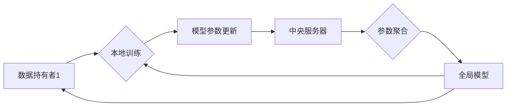

## 数据集联邦:数据孤岛治理的分布式新方案

> 关键词：数据集联邦、隐私保护、机器学习、分布式计算、数据孤岛

## 1. 背景介绍

在数据驱动时代，海量数据成为企业和研究机构的核心资产。然而，数据往往分散在不同的机构或平台，形成“数据孤岛”，难以共享和利用。这不仅限制了数据价值的挖掘，也阻碍了人工智能（AI）技术的进步。

传统的数据共享模式存在着严重的隐私泄露风险，因为数据需要集中到一个中心服务器进行处理。为了解决这个问题，数据集联邦学习（Federated Learning，FL）应运而生。FL是一种分布式机器学习方法，允许模型在各个数据源上进行训练，而无需将原始数据传输到中央服务器。

## 2. 核心概念与联系

数据集联邦学习的核心概念是将模型训练分散到多个数据持有者（例如，手机、医院、银行等）的设备上。每个数据持有者在本地训练模型，并将模型参数更新发送到一个中央服务器。中央服务器聚合所有模型参数更新，并生成一个全局模型。全局模型再被分发到各个数据持有者，用于下一轮训练。

**FL 架构流程图**



**FL 的优势:**

* **隐私保护:** 数据从未离开本地设备，有效保护用户隐私。
* **数据安全:** 数据分散存储，降低了数据泄露风险。
* **数据多样性:** 可以利用来自不同数据源的数据，提高模型泛化能力。
* **高效性:** 可以并行训练模型，加速训练速度。

**FL 的挑战:**

* **通信成本:** 模型参数更新需要频繁传输，可能会导致通信成本高昂。
* **数据不平衡:** 不同数据源的数据质量和分布可能不同，影响模型训练效果。
* **模型性能:** FL 模型的性能可能低于集中式训练模型。
* **安全性和可靠性:** 需要确保模型参数更新的安全性以及中央服务器的可靠性。

## 3. 核心算法原理 & 具体操作步骤

### 3.1  算法原理概述

数据集联邦学习的核心算法是**梯度下降**。在 FL 中，每个数据持有者使用本地数据训练模型，并计算模型参数的梯度。梯度代表了模型参数调整的方向和幅度。这些梯度被发送到中央服务器，并被聚合起来。聚合后的梯度用于更新全局模型的参数。

### 3.2  算法步骤详解

1. **初始化:** 中央服务器将一个初始模型参数分配给每个数据持有者。
2. **本地训练:** 每个数据持有者使用本地数据训练模型，并计算模型参数的梯度。
3. **参数更新:** 每个数据持有者将模型参数更新发送到中央服务器。
4. **参数聚合:** 中央服务器将所有模型参数更新聚合起来，并生成一个全局模型参数。
5. **模型更新:** 中央服务器将全局模型参数分发给每个数据持有者。
6. **重复步骤2-5:** 重复上述步骤，直到模型收敛或达到预设的训练次数。

### 3.3  算法优缺点

**优点:**

* **隐私保护:** 数据从未离开本地设备，有效保护用户隐私。
* **数据安全:** 数据分散存储，降低了数据泄露风险。
* **数据多样性:** 可以利用来自不同数据源的数据，提高模型泛化能力。

**缺点:**

* **通信成本:** 模型参数更新需要频繁传输，可能会导致通信成本高昂。
* **数据不平衡:** 不同数据源的数据质量和分布可能不同，影响模型训练效果。
* **模型性能:** FL 模型的性能可能低于集中式训练模型。

### 3.4  算法应用领域

数据集联邦学习在以下领域具有广泛的应用前景:

* **医疗保健:** 利用患者数据训练疾病诊断和治疗模型，保护患者隐私。
* **金融服务:** 利用客户数据训练欺诈检测和风险评估模型，提高金融安全。
* **物联网:** 利用设备数据训练设备故障预测和智能控制模型，提升设备效率。
* **教育:** 利用学生数据训练个性化学习模型，提高学习效果。

## 4. 数学模型和公式 & 详细讲解 & 举例说明

### 4.1  数学模型构建

假设我们有 *n* 个数据持有者，每个数据持有者拥有 *m* 个样本数据。每个样本数据 *x* 对应一个标签 *y*。我们的目标是训练一个模型 *f(x)*，能够准确预测标签 *y*。

在 FL 中，每个数据持有者 *i* 训练一个本地模型 *θ<sub>i</sub>*，并计算模型参数的梯度 *∇<sub>θ<sub>i</sub></sub> L(θ<sub>i</sub>, D<sub>i</sub>)*，其中 *L* 是损失函数，*D<sub>i</sub>* 是数据持有者 *i* 的本地数据集。

### 4.2  公式推导过程

全局模型参数更新公式如下:

$$
\theta_{global} = \theta_{global} + \frac{1}{n} \sum_{i=1}^{n} \nabla_{\theta_{i}} L(\theta_{i}, D_{i})
$$

其中:

* *θ<sub>global</sub>* 是全局模型参数。
* *θ<sub>i</sub>* 是数据持有者 *i* 的本地模型参数。
* *∇<sub>θ<sub>i</sub></sub> L(θ<sub>i</sub>, D<sub>i</sub>)* 是数据持有者 *i* 的本地模型参数梯度。

### 4.3  案例分析与讲解

假设我们有一个医疗诊断模型，需要利用来自多个医院的患者数据进行训练。每个医院拥有自己的患者数据，但由于隐私原因，无法共享原始数据。

我们可以使用 FL 将模型训练分散到各个医院的设备上。每个医院使用本地数据训练模型，并计算模型参数的梯度。这些梯度被发送到一个中央服务器，并被聚合起来。聚合后的梯度用于更新全局模型参数。

最终，我们得到一个全局模型，能够准确预测患者的疾病风险，同时保护了患者隐私。

## 5. 项目实践：代码实例和详细解释说明

### 5.1  开发环境搭建

* Python 3.6+
* TensorFlow 或 PyTorch
* 必要的库，例如 numpy、pandas、scikit-learn 等

### 5.2  源代码详细实现

```python
# 导入必要的库
import tensorflow as tf

# 定义模型
model = tf.keras.models.Sequential([
    tf.keras.layers.Dense(128, activation='relu', input_shape=(784,)),
    tf.keras.layers.Dense(10, activation='softmax')
])

# 定义损失函数和优化器
loss_fn = tf.keras.losses.SparseCategoricalCrossentropy()
optimizer = tf.keras.optimizers.Adam()

# 定义训练函数
def train_step(images, labels):
    with tf.GradientTape() as tape:
        predictions = model(images)
        loss = loss_fn(labels, predictions)
    gradients = tape.gradient(loss, model.trainable_variables)
    optimizer.apply_gradients(zip(gradients, model.trainable_variables))
    return loss

# 数据持有者训练
for epoch in range(10):
    for batch in data_loader:
        images, labels = batch
        loss = train_step(images, labels)
        print(f'Epoch: {epoch}, Loss: {loss.numpy()}')

# 参数聚合
global_model_params = aggregate_model_params()

# 更新全局模型
update_global_model(global_model_params)
```

### 5.3  代码解读与分析

* 代码首先定义了模型、损失函数和优化器。
* 然后定义了一个训练函数 `train_step`，用于计算损失和更新模型参数。
* 数据持有者使用本地数据训练模型，并计算模型参数的梯度。
* 梯度被发送到中央服务器，并被聚合起来。
* 聚合后的梯度用于更新全局模型参数。

### 5.4  运行结果展示

运行结果展示了每个数据持有者训练的损失值，以及全局模型参数更新情况。

## 6. 实际应用场景

### 6.1  医疗保健

* **疾病诊断:** 利用患者电子病历、影像数据等训练疾病诊断模型，提高诊断准确率。
* **个性化治疗:** 利用患者基因数据、生活习惯等训练个性化治疗模型，制定更有效的治疗方案。
* **药物研发:** 利用患者数据训练药物研发模型，加速新药开发。

### 6.2  金融服务

* **欺诈检测:** 利用交易数据、用户行为等训练欺诈检测模型，降低金融风险。
* **风险评估:** 利用客户信用记录、财务状况等训练风险评估模型，提高贷款审批效率。
* **个性化金融服务:** 利用客户数据训练个性化金融服务模型，提供更精准的金融产品和服务。

### 6.3  物联网

* **设备故障预测:** 利用设备运行数据训练设备故障预测模型，提前预防设备故障。
* **智能控制:** 利用设备数据训练智能控制模型，提高设备效率和安全性。
* **数据分析:** 利用设备数据训练数据分析模型，挖掘设备运行规律和潜在问题。

### 6.4  未来应用展望

数据集联邦学习在未来将有更广泛的应用场景，例如:

* **自动驾驶:** 利用来自不同车辆的驾驶数据训练自动驾驶模型，提高自动驾驶安全性。
* **语音识别:** 利用来自不同用户的语音数据训练语音识别模型，提高语音识别准确率。
* **自然语言处理:** 利用来自不同领域的文本数据训练自然语言处理模型，提高自然语言理解能力。

## 7. 工具和资源推荐

### 7.1  学习资源推荐

* **论文:**
    * Federated Learning: Strategies for Improving Communication Efficiency
    * Communication-Efficient Learning of Deep Networks from Decentralized Data
* **博客:**
    * TensorFlow Federated Blog: https://www.tensorflow.org/federated
    * PySyft Blog: https://www.openmined.org/blog/

### 7.2  开发工具推荐

* **TensorFlow Federated:** https://www.tensorflow.org/federated
* **PySyft:** https://www.openmined.org/

### 7.3  相关论文推荐

* **Federated Learning: Collaborative Machine Learning Without Centralized Training Data**
* **Communication-Efficient Learning of Deep Networks from Decentralized Data**
* **Privacy-Preserving Machine Learning**

## 8. 总结：未来发展趋势与挑战

### 8.1  研究成果总结

数据集联邦学习在隐私保护、数据安全、数据多样性等方面取得了显著的进展。它为解决数据孤岛问题提供了新的思路和方法，并推动了人工智能技术的进步。

### 8.2  未来发展趋势

* **提高模型性能:** 研究更有效的联邦学习算法，提高模型性能。
* **降低通信成本:** 研究更有效的通信策略，降低通信成本。
* **解决数据不平衡问题:** 研究解决数据不平衡问题的方法，提高模型泛化能力。
* **增强安全性:** 研究更安全的联邦学习协议，防止模型参数被攻击。

### 8.3  面临的挑战

* **模型性能:** FL 模型的性能可能低于集中式训练模型。
* **通信成本:** 模型参数更新需要频繁传输，可能会导致通信成本高昂。
* **数据不平衡:** 不同数据源的数据质量和分布可能不同，影响模型训练效果。
* **安全性和可靠性:** 需要确保模型参数更新的安全性以及中央服务器的可靠性。

### 8.4  研究展望

数据集联邦学习是一个充满挑战和机遇的领域。未来，我们将继续研究更有效的联邦学习算法，并将其应用于更多领域，推动人工智能技术的进步。

## 9. 附录：常见问题与解答

**Q1: 数据集联邦学习和分布式机器学习有什么区别？**

**