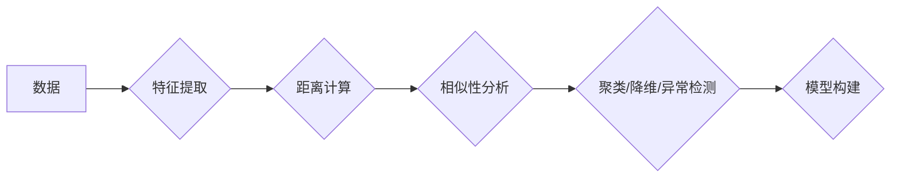

## 无监督学习(Unsupervised Learning) - 原理与代码实例讲解

> 关键词：无监督学习、聚类、降维、异常检测、自编码器、K-Means、PCA、t-SNE

## 1. 背景介绍

在机器学习领域，监督学习一直占据着主导地位。它依赖于标记数据，通过学习输入与输出之间的映射关系来进行预测。然而，现实世界中，获取大量标记数据的成本往往很高，而且并非所有问题都适合监督学习。这时，无监督学习就显得尤为重要。

无监督学习是指在没有标记数据的情况下，通过寻找数据内在的模式和结构来学习。它主要用于以下任务：

* **聚类:** 将数据点根据相似性分组。
* **降维:** 将高维数据映射到低维空间，同时保留其重要信息。
* **异常检测:** 识别与正常数据明显不同的数据点。
* **关联规则挖掘:** 发现数据中隐藏的关联关系。

无监督学习在数据挖掘、模式识别、图像处理、自然语言处理等领域有着广泛的应用。

## 2. 核心概念与联系

无监督学习的核心是寻找数据中的潜在结构和规律。它通过分析数据之间的相似性、距离、依赖关系等来构建数据模型。

**Mermaid 流程图:**



**核心概念:**

* **特征提取:** 将原始数据转换为更适合模型学习的特征向量。
* **距离计算:** 衡量数据点之间的相似性或差异。常用的距离度量包括欧氏距离、曼哈顿距离、余弦相似度等。
* **相似性分析:** 根据距离计算结果，判断数据点之间的相似程度。
* **聚类/降维/异常检测:** 根据相似性分析结果，进行相应的无监督学习任务。

## 3. 核心算法原理 & 具体操作步骤

### 3.1  算法原理概述

本节将介绍两种常用的无监督学习算法：K-Means聚类和主成分分析(PCA)降维。

**K-Means聚类:**

K-Means是一种基于距离的聚类算法，它将数据点划分为K个簇，每个簇都由一个中心点(centroid)代表。算法的目标是将每个数据点分配到与其最近的中心点所在的簇中。

**PCA降维:**

PCA是一种线性降维技术，它通过寻找数据中方差最大的方向来降低数据维度。PCA将数据投影到这些方向上，从而保留数据的最大信息量。

### 3.2  算法步骤详解

**K-Means聚类:**

1. **初始化:** 随机选择K个数据点作为初始中心点。
2. **分配:** 将每个数据点分配到与其最近的中心点所在的簇中。
3. **更新:** 计算每个簇的中心点，并更新中心点的位置。
4. **重复:** 重复步骤2和3，直到中心点不再发生变化或达到最大迭代次数。

**PCA降维:**

1. **数据标准化:** 将数据标准化到均值为0，标准差为1。
2. **协方差矩阵计算:** 计算数据的协方差矩阵。
3. **特征值分解:** 对协方差矩阵进行特征值分解，得到特征向量和特征值。
4. **特征向量排序:** 根据特征值的大小对特征向量进行排序。
5. **降维:** 选择前k个特征向量，将数据投影到这些特征向量空间上，从而实现降维。

### 3.3  算法优缺点

**K-Means聚类:**

* **优点:** 简单易实现，计算效率高。
* **缺点:** 容易受到初始中心点的选择影响，对噪声数据敏感。

**PCA降维:**

* **优点:** 可以有效地降低数据维度，保留数据的最大信息量。
* **缺点:** 只能处理线性关系的数据，对非线性关系的数据效果较差。

### 3.4  算法应用领域

**K-Means聚类:**

* **客户细分:** 将客户根据消费习惯、购买历史等特征进行分类。
* **图像分割:** 将图像分割成不同的区域，例如前景和背景。
* **异常检测:** 识别与正常数据明显不同的数据点。

**PCA降维:**

* **图像压缩:** 将图像降维后存储，从而节省存储空间。
* **特征提取:** 将高维数据降维后作为其他机器学习算法的输入特征。
* **数据可视化:** 将高维数据降维后进行可视化，以便更好地理解数据结构。

## 4. 数学模型和公式 & 详细讲解 & 举例说明

### 4.1  数学模型构建

**K-Means聚类:**

* **目标函数:** 
$$
J = \sum_{i=1}^{K} \sum_{x \in C_i} ||x - \mu_i||^2
$$
其中，$J$ 是目标函数，$K$ 是簇的数量，$C_i$ 是第 $i$ 个簇，$x$ 是数据点，$\mu_i$ 是第 $i$ 个簇的中心点。

* **优化目标:** 找到最优的中心点，使得目标函数最小。

**PCA降维:**

* **协方差矩阵:** 
$$
\Sigma = \frac{1}{n-1} \sum_{i=1}^{n} (x_i - \bar{x})(x_i - \bar{x})^T
$$
其中，$\Sigma$ 是协方差矩阵，$n$ 是数据点的数量，$x_i$ 是第 $i$ 个数据点，$\bar{x}$ 是数据的均值向量。

* **特征值分解:** 
$$
\Sigma v_i = \lambda_i v_i
$$
其中，$v_i$ 是第 $i$ 个特征向量，$\lambda_i$ 是第 $i$ 个特征值。

### 4.2  公式推导过程

**K-Means聚类:**

目标函数的最小化可以通过迭代更新中心点的位置来实现。具体步骤如下：

1. 随机选择K个数据点作为初始中心点。
2. 将每个数据点分配到与其最近的中心点所在的簇中。
3. 计算每个簇的中心点，即所有数据点的平均值。
4. 更新中心点的位置。
5. 重复步骤2-4，直到中心点不再发生变化或达到最大迭代次数。

**PCA降维:**

特征值分解可以将协方差矩阵分解成特征向量和特征值。特征向量代表数据的主要方向，特征值代表每个方向上的方差。选择前k个特征向量，可以将数据投影到这些方向上，从而实现降维。

### 4.3  案例分析与讲解

**K-Means聚类:**

假设我们有一组客户数据，包含他们的年龄、收入和消费金额等特征。我们可以使用K-Means聚类将客户分为不同的消费群体。例如，我们可以将客户分为高收入、中收入和低收入三个群体。

**PCA降维:**

假设我们有一组图像数据，每个图像都包含大量的像素值。我们可以使用PCA降维将图像数据降维到较低的维度，例如100维或200维。这样可以节省存储空间，并提高图像处理的速度。

## 5. 项目实践：代码实例和详细解释说明

### 5.1  开发环境搭建

本项目使用Python语言进行开发，需要安装以下库：

* NumPy
* Scikit-learn
* Matplotlib

可以使用pip命令安装这些库：

```bash
pip install numpy scikit-learn matplotlib
```

### 5.2  源代码详细实现

**K-Means聚类:**

```python
import numpy as np
from sklearn.cluster import KMeans
import matplotlib.pyplot as plt

# 生成随机数据
X = np.random.rand(100, 2)

# 使用K-Means聚类
kmeans = KMeans(n_clusters=3)
kmeans.fit(X)

# 获取聚类结果
labels = kmeans.labels_

# 可视化聚类结果
plt.scatter(X[:, 0], X[:, 1], c=labels)
plt.show()
```

**PCA降维:**

```python
import numpy as np
from sklearn.decomposition import PCA
import matplotlib.pyplot as plt

# 生成随机数据
X = np.random.rand(100, 10)

# 使用PCA降维
pca = PCA(n_components=2)
X_reduced = pca.fit_transform(X)

# 可视化降维结果
plt.scatter(X_reduced[:, 0], X_reduced[:, 1])
plt.show()
```

### 5.3  代码解读与分析

**K-Means聚类:**

* `KMeans(n_clusters=3)`: 创建K-Means聚类模型，指定簇的数量为3。
* `kmeans.fit(X)`: 将数据X进行聚类，并训练模型。
* `kmeans.labels_`: 获取每个数据点的所属簇标签。
* `plt.scatter(X[:, 0], X[:, 1], c=labels)`: 使用不同的颜色表示不同簇的数据点。

**PCA降维:**

* `PCA(n_components=2)`: 创建PCA降维模型，指定降维后的维度为2。
* `pca.fit_transform(X)`: 将数据X进行降维，并返回降维后的数据。
* `plt.scatter(X_reduced[:, 0], X_reduced[:, 1])`: 可视化降维后的数据。

### 5.4  运行结果展示

运行以上代码，将会生成两个可视化结果：

* K-Means聚类结果：将数据点根据相似性分为3个簇，每个簇用不同的颜色表示。
* PCA降维结果：将数据点从高维空间降维到二维空间，保留数据的最大信息量。

## 6. 实际应用场景

### 6.1  客户细分

电商平台可以利用K-Means聚类将用户根据购买习惯、浏览历史等特征进行细分，从而提供个性化的商品推荐和营销策略。

### 6.2  图像识别

PCA降维可以用于图像压缩和特征提取。在图像识别任务中，PCA可以将图像数据降维到较低的维度，从而提高识别速度和准确率。

### 6.3  异常检测

K-Means聚类可以用于异常检测。将数据点聚类后，那些与其他数据点距离较远的点可能代表异常数据。

### 6.4  未来应用展望

无监督学习在未来将有更广泛的应用，例如：

* **自动驾驶:** 无监督学习可以用于从大量驾驶数据中学习驾驶规则和模式，从而提高自动驾驶系统的安全性。
* **医疗诊断:** 无监督学习可以用于分析医疗图像和数据，辅助医生进行诊断。
* **金融风险管理:** 无监督学习可以用于识别金融市场中的异常交易和风险。

## 7. 工具和资源推荐

### 7.1  学习资源推荐

* **书籍:**
    * "The Elements of Statistical Learning" by Trevor Hastie, Robert Tibshirani, and Jerome Friedman
    * "Pattern Recognition and Machine Learning" by Christopher M. Bishop
* **在线课程:**
    * Coursera: "Machine Learning" by Andrew Ng
    * edX: "Introduction to Machine Learning" by Columbia University

### 7.2  开发工具推荐

* **Python:** 
    * Scikit-learn: 提供了丰富的机器学习算法和工具。
    * TensorFlow: 深度学习框架。
    * PyTorch: 深度学习框架。

### 7.3  相关论文推荐

* "K-Means Clustering" by Stuart Lloyd
* "Principal Component Analysis" by Jolliffe

