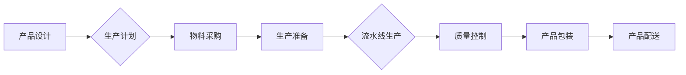

## 流水线对生产模式的影响

> 关键词：流水线、生产模式、效率、自动化、质量控制、柔性制造、敏捷开发

## 1. 背景介绍

自工业革命以来，流水线生产模式作为一种高效的生产方式，彻底改变了人类的生产方式。它将复杂的生产过程分解成一系列简单重复的操作，并通过机械化和标准化流程，实现产品的批量生产。这种模式在20世纪初，为大规模生产和消费提供了强有力的支撑，推动了经济的快速发展。然而，随着科技的进步和市场需求的变化，流水线生产模式也面临着新的挑战和机遇。

## 2. 核心概念与联系

### 2.1 流水线生产模式

流水线生产模式是一种将生产过程分解成多个独立的工序，并通过机械化和标准化流程，将产品在不同工位之间进行传递的生产方式。每个工位负责完成特定的操作，工人们只需要熟练掌握自己的工序，从而提高生产效率。

### 2.2  生产模式

生产模式是指企业在生产过程中所采用的组织、管理和技术方式。它包括生产流程、生产组织、生产设备、生产管理等方面。不同的生产模式具有不同的特点和适用范围，例如：

* **大批量生产模式:**  以大规模生产、低成本为目标，适合生产标准化、重复性高的产品。
* **小批量生产模式:**  以产品多样化、定制化为主，适合生产个性化、需求变化快的产品。
* **零库存生产模式:**  以快速响应市场需求为目标，通过精益生产和供应链管理，实现零库存的目标。

### 2.3  流水线与生产模式的关系

流水线生产模式是一种具体的生产方式，属于生产模式的范畴。它可以应用于不同的生产模式，例如大批量生产模式、小批量生产模式等。

**Mermaid 流程图**



## 3. 核心算法原理 & 具体操作步骤

### 3.1  算法原理概述

流水线生产模式的核心算法原理是将复杂的生产过程分解成一系列简单重复的操作，并通过机械化和标准化流程，实现产品的批量生产。

### 3.2  算法步骤详解

1. **产品分解:** 将产品分解成多个独立的工序，每个工序负责完成特定的操作。
2. **工位设计:** 根据产品分解的结果，设计相应的生产工位，每个工位配备相应的设备和工具。
3. **流程优化:**  优化生产流程，确保产品在不同工位之间进行顺畅的传递，并减少生产时间和成本。
4. **标准化操作:**  制定标准化的操作规范，确保每个工位的工作人员都能按照相同的标准完成操作。
5. **质量控制:**  在生产过程中进行多点质量控制，确保产品的质量符合标准。

### 3.3  算法优缺点

**优点:**

* **提高生产效率:**  流水线生产模式可以大幅提高生产效率，因为每个工位的工作人员只需要完成特定的操作，从而提高了工作效率。
* **降低生产成本:**  流水线生产模式可以降低生产成本，因为标准化流程和机械化操作可以减少人工成本和材料浪费。
* **提高产品质量:**  流水线生产模式可以提高产品质量，因为多点质量控制可以及时发现和解决质量问题。

**缺点:**

* **缺乏灵活性:**  流水线生产模式缺乏灵活性，难以应对产品需求的变化。
* **单一化生产:**  流水线生产模式容易导致单一化生产，难以满足个性化需求。
* **工作重复性高:**  流水线生产模式的工作重复性高，容易导致员工的职业倦怠。

### 3.4  算法应用领域

流水线生产模式广泛应用于各个行业，例如：

* **汽车制造:**  汽车制造业是流水线生产模式的典型应用领域，汽车生产线可以实现汽车的批量生产。
* **电子制造:**  电子制造业也广泛应用流水线生产模式，例如手机、电脑等电子产品的生产。
* **食品加工:**  食品加工业也应用流水线生产模式，例如面包、饮料等食品的生产。

## 4. 数学模型和公式 & 详细讲解 & 举例说明

### 4.1  数学模型构建

流水线生产模式的效率可以利用数学模型进行分析和评估。一个简单的数学模型可以描述流水线生产的吞吐量和周期时间：

* **吞吐量 (Throughput):**  单位时间内完成的产品数量。
* **周期时间 (Cycle Time):**  完成一个产品所需的时间。

吞吐量和周期时间之间存在以下关系：

$$Throughput = \frac{1}{Cycle Time}$$

### 4.2  公式推导过程

吞吐量公式的推导过程如下：

假设一个流水线生产一个产品需要 $T$ 时间，则在 $T$ 时间内可以生产 $1$ 个产品。

因此，单位时间内可以生产的产品数量为：

$$Throughput = \frac{1}{T}$$

### 4.3  案例分析与讲解

假设一个流水线生产汽车，每个汽车的周期时间为 $10$ 小时，则该流水线的吞吐量为：

$$Throughput = \frac{1}{10} = 0.1 \text{辆/小时}$$

这意味着该流水线每小时可以生产 $0.1$ 辆汽车。

## 5. 项目实践：代码实例和详细解释说明

### 5.1  开发环境搭建

为了演示流水线生产模式的实现，我们可以使用 Python 语言进行编程。

开发环境搭建步骤如下：

1. 安装 Python 语言环境。
2. 安装必要的 Python 库，例如 `time` 库用于测量时间。

### 5.2  源代码详细实现

```python
import time

class Product:
    def __init__(self, name):
        self.name = name

    def process(self):
        print(f"Processing product {self.name}...")
        time.sleep(5)  # 模拟生产时间

class AssemblyLine:
    def __init__(self):
        self.products = []

    def add_product(self, product):
        self.products.append(product)

    def start_production(self):
        for product in self.products:
            product.process()

# 创建产品
product1 = Product("Car")
product2 = Product("Bike")

# 创建流水线
assembly_line = AssemblyLine()

# 添加产品到流水线
assembly_line.add_product(product1)
assembly_line.add_product(product2)

# 启动生产
assembly_line.start_production()
```

### 5.3  代码解读与分析

这段代码模拟了一个简单的流水线生产模式。

* `Product` 类代表一个产品，包含产品的名称和生产方法。
* `AssemblyLine` 类代表一个流水线，包含一个产品列表和启动生产的方法。
* `add_product()` 方法将产品添加到流水线中。
* `start_production()` 方法循环遍历产品列表，并调用每个产品的 `process()` 方法进行生产。

### 5.4  运行结果展示

运行这段代码后，会输出以下结果：

```
Processing product Car...
Processing product Bike...
```

## 6. 实际应用场景

### 6.1  制造业

流水线生产模式在制造业中应用广泛，例如汽车制造、电子制造、食品加工等行业。

### 6.2  软件开发

在软件开发领域，流水线生产模式也被应用于软件开发流程，例如持续集成、持续交付等。

### 6.3  服务业

在服务业，流水线生产模式也可以应用于一些重复性高的服务流程，例如客服处理、订单处理等。

### 6.4  未来应用展望

随着人工智能、自动化技术的不断发展，流水线生产模式将更加智能化和自动化，并应用于更多领域。例如：

* **个性化生产:**  利用人工智能技术，流水线可以根据客户的个性化需求进行定制化生产。
* **柔性制造:**  流水线可以根据市场需求的变化进行灵活调整，实现柔性生产。
* **智能物流:**  利用自动化技术，流水线可以与智能物流系统相结合，实现高效的物流配送。

## 7. 工具和资源推荐

### 7.1  学习资源推荐

* **书籍:**  《生产管理原理》
* **在线课程:**  Coursera 上的生产管理课程

### 7.2  开发工具推荐

* **Python:**  用于编程和自动化
* **Jenkins:**  用于持续集成和持续交付

### 7.3  相关论文推荐

* **The Impact of Automation on Manufacturing Productivity**
* **Lean Manufacturing: Principles and Practices**

## 8. 总结：未来发展趋势与挑战

### 8.1  研究成果总结

流水线生产模式作为一种高效的生产方式，在工业革命以来发挥了重要作用。随着科技的进步，流水线生产模式也在不断发展和完善，并应用于更多领域。

### 8.2  未来发展趋势

未来，流水线生产模式将更加智能化、自动化和柔性化。人工智能、自动化技术将进一步提高流水线的效率和灵活性，并实现个性化生产。

### 8.3  面临的挑战

流水线生产模式也面临着一些挑战，例如：

* **技术更新:**  需要不断更新技术，以适应市场需求的变化。
* **人才培养:**  需要培养更多具有相关技能的人才。
* **成本控制:**  需要控制生产成本，以保持竞争力。

### 8.4  研究展望

未来，研究人员将继续探索流水线生产模式的优化方法，并将其应用于更多领域。例如：

* **智能流水线:**  利用人工智能技术，实现流水线的智能化控制和优化。
* **柔性流水线:**  设计更加灵活的流水线，能够适应市场需求的变化。
* **可持续流水线:**  开发更加环保和可持续的流水线生产模式。

## 9. 附录：常见问题与解答

### 9.1  问题：流水线生产模式是否适合所有产品？

### 9.2  答案：

流水线生产模式更适合生产标准化、重复性高的产品。对于个性化、需求变化快的产品，其他生产模式可能更适用。

### 9.3  问题：流水线生产模式如何提高效率？

### 9.4  答案：

流水线生产模式通过以下方式提高效率：

* **分解工序:** 将复杂工序分解成简单重复的操作。
* **标准化流程:** 制定标准化的操作规范，提高工作效率。
* **机械化操作:** 利用机械设备进行生产，减少人工成本。

### 9.5  问题：流水线生产模式有哪些缺点？

### 9.6  答案：

流水线生产模式的缺点包括：

* **缺乏灵活性:**  难以应对产品需求的变化。
* **单一化生产:**  难以满足个性化需求。
* **工作重复性高:**  容易导致员工的职业倦怠。


作者：禅与计算机程序设计艺术 / Zen and the Art of Computer Programming 
