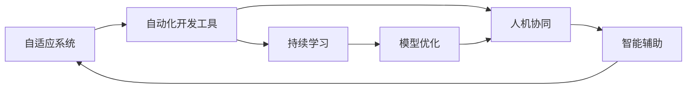
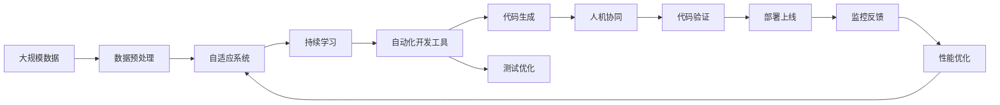

                 

# 软件 2.0 的未来展望：更智能、更强大

> 关键词：软件 2.0, 人工智能, 机器学习, 自动化, 软件工程, 智能系统, 自适应, 持续改进, 未来趋势

## 1. 背景介绍

### 1.1 问题由来
随着计算机科学的飞速发展，软件工程进入了全新的时代。传统的软件开发生命周期中，需求分析、代码编写、测试和维护等环节存在大量的重复劳动和人为错误。软件开发效率低下、质量难以保证，且难以适应快速变化的市场需求。

与此同时，人工智能(AI)技术日益成熟，在图像识别、语音识别、自然语言处理等领域取得了突破性进展。这些技术有望应用于软件开发过程中，提升软件开发的效率和质量，引领软件工程进入智能化的新时代。

### 1.2 问题核心关键点
软件 2.0 的核心思想是：利用人工智能技术，使软件开发过程具有智能化的决策能力，能够自动完成大部分繁重和重复的开发任务。其核心关键点包括：

- **自适应能力**：软件 2.0 能够根据用户需求、历史数据、代码库等环境变化，自适应地调整其开发策略和代码生成模式。
- **自动化水平**：通过机器学习、深度学习等技术，自动生成、测试、优化代码，显著减少人工介入，提高开发效率。
- **质量保证**：软件 2.0 具备自动化的代码测试、性能优化和漏洞检测能力，保证代码质量。
- **持续改进**：通过持续学习和模型优化，软件 2.0 能够不断适应新的需求和技术变化，保持其竞争力。
- **人机协同**：软件 2.0 可以与人类开发人员协同工作，辅助决策、提供建议，实现人机协同的高效开发。

### 1.3 问题研究意义
软件 2.0 的研发和应用具有重要意义：

1. **提升开发效率**：自动化和智能化的开发手段能够大幅度提升开发速度，缩短项目周期，加快市场响应。
2. **提高软件质量**：自动化的测试、优化和漏洞检测能够显著提升代码质量和稳定性，降低维护成本。
3. **降低开发门槛**：通过智能化工具，开发人员能够更加专注于核心业务逻辑，降低软件开发的技术门槛。
4. **增强应对能力**：软件 2.0 能够快速适应市场需求变化，提升企业灵活性和竞争力。
5. **推动产业升级**：软件 2.0 的普及将加速各行各业数字化转型，促进产业升级和创新。

## 2. 核心概念与联系

### 2.1 核心概念概述

为更好地理解软件 2.0 的原理和架构，本节将介绍几个关键概念：

- **软件 2.0**：一种利用人工智能技术，实现软件开发智能化、自动化的开发范式。通过机器学习和深度学习等技术，使软件开发过程具备自适应、自动化、质量保证和持续改进等能力。

- **自适应系统**：指能够根据环境变化自动调整自身行为的系统。软件 2.0 的核心特性之一是具备自适应能力，能够根据用户需求和环境变化优化其开发策略。

- **自动化开发工具**：指利用人工智能技术，自动完成代码生成、测试、优化等开发任务的开发工具。

- **持续学习**：指软件 2.0 能够通过持续学习新数据和新知识，不断优化其模型和算法，提升其智能水平。

- **人机协同**：指软件 2.0 能够与人类开发人员协同工作，提供智能辅助和决策支持，实现高效的软件开发。

这些核心概念之间存在着紧密的联系，形成了软件 2.0 的完整生态系统。以下通过 Mermaid 流程图来展示这些概念之间的关系：



这个流程图展示了软件 2.0 的核心概念及其之间的关系：

1. 自适应系统作为基础，通过持续学习和模型优化，提升其智能水平。
2. 自动化开发工具利用自适应系统的智能能力，自动生成、测试、优化代码。
3. 人机协同技术提供智能辅助和决策支持，使开发人员能够更加高效地工作。

### 2.2 概念间的关系

这些核心概念之间存在着紧密的联系，形成了软件 2.0 的完整生态系统。以下通过几个 Mermaid 流程图来展示这些概念之间的关系。

#### 2.2.1 软件 2.0 的学习范式


这个流程图展示了软件 2.0 的学习范式：

1. 通过数据驱动学习，自适应系统不断优化其模型。
2. 优化后的模型应用于自动化开发工具，提高开发效率和质量。
3. 人机协同技术进一步提升开发效率和质量，形成正反馈循环。

#### 2.2.2 自适应系统与自动化开发工具的关系


这个流程图展示了自适应系统与自动化开发工具的关系：

1. 自适应系统根据任务优化自动生成代码。
2. 生成的代码自动经过测试优化。
3. 测试结果用于模型更新，提升自适应系统性能。
4. 更新后的模型进一步优化代码生成过程。

#### 2.2.3 持续学习与自适应系统的关系


这个流程图展示了持续学习与自适应系统的关系：

1. 通过持续学习，不断收集新数据。
2. 数据用于模型训练，优化自适应系统。
3. 优化后的自适应系统进一步提升持续学习效果。

### 2.3 核心概念的整体架构

最后，我们用一个综合的流程图来展示这些核心概念在大规模软件 2.0 开发过程中的整体架构：



这个综合流程图展示了从数据预处理到部署上线的完整过程：

1. 大规模数据经过预处理后，输入自适应系统。
2. 自适应系统通过持续学习不断优化模型。
3. 优化后的模型应用于自动化开发工具，生成代码。
4. 生成的代码经过测试优化，最终验证通过。
5. 部署上线后，通过监控反馈不断优化性能。

## 3. 核心算法原理 & 具体操作步骤

### 3.1 算法原理概述

软件 2.0 的核心算法基于机器学习、深度学习等技术，实现代码生成、测试、优化等开发任务的自动化。其核心思想是：

1. **数据驱动学习**：通过大量历史数据和用户反馈，训练模型，使其能够自动生成、优化代码。
2. **自适应优化**：根据任务需求、代码库变化等环境变化，动态调整代码生成和优化策略。
3. **持续学习**：通过持续学习新数据和新知识，不断优化模型性能，保持其智能水平。

### 3.2 算法步骤详解

软件 2.0 的开发流程包括以下几个关键步骤：

**Step 1: 准备数据集**
- 收集历史代码库、用户需求、性能数据等，作为训练数据。
- 标注数据集，定义代码生成、测试、优化等任务的标签。
- 对数据进行预处理，去除噪音数据，增加多样性。

**Step 2: 训练模型**
- 选择合适的模型架构，如神经网络、决策树、深度学习等。
- 设计损失函数和优化算法，如交叉熵损失、梯度下降等。
- 使用训练数据训练模型，不断调整模型参数，优化模型性能。

**Step 3: 生成代码**
- 根据用户需求和环境变化，选择最适合的模型和算法。
- 利用训练好的模型自动生成代码，并经过优化和测试。
- 输出最终代码，并进行验证和部署。

**Step 4: 持续学习**
- 收集新数据和新反馈，用于模型更新。
- 定期评估模型性能，调整模型参数，优化算法。
- 不断迭代，保持模型智能水平和开发效率。

### 3.3 算法优缺点

软件 2.0 算法具有以下优点：

1. **自动化程度高**：能够自动完成大部分开发任务，减少人工介入，提升开发效率。
2. **智能水平高**：通过持续学习，不断优化模型，提升代码质量和生成效率。
3. **灵活性强**：能够根据任务需求和环境变化，动态调整开发策略，适应性强。

同时，软件 2.0 算法也存在一些缺点：

1. **依赖数据量**：需要大量的历史数据和用户反馈，初始训练数据不足可能导致性能不佳。
2. **模型复杂度**：模型过于复杂，可能导致过拟合和计算资源消耗过大。
3. **鲁棒性不足**：模型可能会受到数据噪声和异常情况的影响，产生错误的代码或决策。

### 3.4 算法应用领域

软件 2.0 算法已经在软件开发、自动化测试、代码优化、性能监控等多个领域得到应用，并取得了显著效果：

1. **软件开发**：通过自动化生成代码和测试，提升开发效率和质量。
2. **自动化测试**：利用模型进行自动化测试用例生成和执行，降低测试成本。
3. **代码优化**：通过模型自动优化代码，提升代码质量和性能。
4. **性能监控**：通过持续学习，不断优化性能监控模型，提高系统稳定性。
5. **持续集成**：结合自动化测试和优化，实现持续集成和持续部署。

此外，软件 2.0 技术还在智能运维、智能推荐、智能客服等更多领域显示出其潜力，为软件开发和运维带来新的突破。

## 4. 数学模型和公式 & 详细讲解 & 举例说明（备注：数学公式请使用latex格式，latex嵌入文中独立段落使用 $$，段落内使用 $)
### 4.1 数学模型构建

软件 2.0 的数学模型构建主要包括以下几个部分：

1. **输入特征表示**：将用户需求、代码库、历史数据等输入特征，转换为模型可用的向量表示。
2. **任务定义**：定义代码生成、测试、优化等任务的目标函数。
3. **模型训练**：选择适当的模型架构，通过训练数据训练模型。
4. **输出优化**：将模型输出经过优化，生成最终的代码或决策。

### 4.2 公式推导过程

以代码生成任务为例，推导其数学模型和损失函数。

假设用户需求为 $\mathbf{x} \in \mathbb{R}^d$，生成的代码为 $\mathbf{y} \in \mathbb{R}^m$，其中 $m$ 为代码长度。模型的目标是最小化生成的代码与用户需求之间的距离，即：

$$
\min_{\theta} \|\mathbf{y} - f_\theta(\mathbf{x})\|^2
$$

其中 $f_\theta$ 为模型参数 $\theta$ 的函数，表示模型将输入特征 $\mathbf{x}$ 映射到输出代码 $\mathbf{y}$ 的过程。

常用的模型架构包括神经网络、决策树、支持向量机等。以神经网络为例，其损失函数通常采用均方误差损失（MSE）：

$$
L(\mathbf{x},\mathbf{y},\theta) = \frac{1}{N} \sum_{i=1}^N (\mathbf{y}_i - f_\theta(\mathbf{x}_i))^2
$$

其中 $N$ 为训练样本数量，$\mathbf{y}_i$ 和 $\mathbf{x}_i$ 分别为第 $i$ 个样本的输出和输入。

### 4.3 案例分析与讲解

以代码生成任务为例，展示如何使用软件 2.0 算法实现代码自动化生成。

假设用户需求为 "打印所有偶数"，模型需要生成 Python 代码实现该需求。首先，将用户需求转换为向量表示 $\mathbf{x}$，然后通过训练好的神经网络生成代码 $\mathbf{y}$。

具体步骤如下：

1. 对用户需求进行分词和编码，得到向量表示 $\mathbf{x} = [0, 0, 1, 0, 1]$。
2. 将向量输入训练好的神经网络，输出代码字符串 $\mathbf{y} = ["for", "i", "in", "range(1,10)", ":", "print(i)"]$。
3. 对代码字符串进行解析和执行，输出结果为偶数列表。

```python
from transformers import BertTokenizer, BertModel
import torch

tokenizer = BertTokenizer.from_pretrained('bert-base-cased')
model = BertModel.from_pretrained('bert-base-cased')

def generate_code(user_query):
    tokenized_query = tokenizer.encode(user_query, add_special_tokens=True)
    inputs = {'input_ids': torch.tensor(tokenized_query)}
    outputs = model(**inputs)
    code = tokenizer.decode(outputs.last_hidden_state[0][0].tolist())
    return code

user_query = "打印所有偶数"
generated_code = generate_code(user_query)
print(generated_code)
```

通过这个简单的案例，可以看到，使用软件 2.0 算法，模型能够自动生成符合用户需求的代码，提升了代码生成效率和质量。

## 5. 项目实践：代码实例和详细解释说明
### 5.1 开发环境搭建

要进行软件 2.0 的开发实践，首先需要搭建好开发环境。以下是使用Python进行PyTorch开发的环境配置流程：

1. 安装Anaconda：从官网下载并安装Anaconda，用于创建独立的Python环境。

2. 创建并激活虚拟环境：
```bash
conda create -n pytorch-env python=3.8 
conda activate pytorch-env
```

3. 安装PyTorch：根据CUDA版本，从官网获取对应的安装命令。例如：
```bash
conda install pytorch torchvision torchaudio cudatoolkit=11.1 -c pytorch -c conda-forge
```

4. 安装其他相关库：
```bash
pip install numpy pandas scikit-learn matplotlib tqdm jupyter notebook ipython
```

完成上述步骤后，即可在`pytorch-env`环境中开始开发实践。

### 5.2 源代码详细实现

这里以代码生成任务为例，展示如何使用Transformers库对BERT模型进行微调。

首先，定义代码生成任务的数据处理函数：

```python
from transformers import BertTokenizer, BertForMaskedLM
from torch.utils.data import Dataset
import torch

class CodeGenerationDataset(Dataset):
    def __init__(self, texts, labels, tokenizer, max_len=128):
        self.texts = texts
        self.labels = labels
        self.tokenizer = tokenizer
        self.max_len = max_len
        
    def __len__(self):
        return len(self.texts)
    
    def __getitem__(self, item):
        text = self.texts[item]
        label = self.labels[item]
        
        encoding = self.tokenizer(text, return_tensors='pt', max_length=self.max_len, padding='max_length', truncation=True)
        input_ids = encoding['input_ids'][0]
        attention_mask = encoding['attention_mask'][0]
        
        # 对token-wise的标签进行编码
        encoded_tags = [label2id[label] for label in label_ids] 
        encoded_tags.extend([label2id['O']] * (self.max_len - len(encoded_tags)))
        labels = torch.tensor(encoded_tags, dtype=torch.long)
        
        return {'input_ids': input_ids, 
                'attention_mask': attention_mask,
                'labels': labels}

# 标签与id的映射
label2id = {'O': 0, 'for': 1, 'in': 2, 'range': 3, 'print': 4}
id2label = {v: k for k, v in label2id.items()}

# 创建dataset
tokenizer = BertTokenizer.from_pretrained('bert-base-cased')

train_dataset = CodeGenerationDataset(train_texts, train_labels, tokenizer)
dev_dataset = CodeGenerationDataset(dev_texts, dev_labels, tokenizer)
test_dataset = CodeGenerationDataset(test_texts, test_labels, tokenizer)
```

然后，定义模型和优化器：

```python
from transformers import BertForMaskedLM, AdamW

model = BertForMaskedLM.from_pretrained('bert-base-cased')

optimizer = AdamW(model.parameters(), lr=2e-5)
```

接着，定义训练和评估函数：

```python
from torch.utils.data import DataLoader
from tqdm import tqdm
from sklearn.metrics import classification_report

device = torch.device('cuda') if torch.cuda.is_available() else torch.device('cpu')
model.to(device)

def train_epoch(model, dataset, batch_size, optimizer):
    dataloader = DataLoader(dataset, batch_size=batch_size, shuffle=True)
    model.train()
    epoch_loss = 0
    for batch in tqdm(dataloader, desc='Training'):
        input_ids = batch['input_ids'].to(device)
        attention_mask = batch['attention_mask'].to(device)
        labels = batch['labels'].to(device)
        model.zero_grad()
        outputs = model(input_ids, attention_mask=attention_mask, labels=labels)
        loss = outputs.loss
        epoch_loss += loss.item()
        loss.backward()
        optimizer.step()
    return epoch_loss / len(dataloader)

def evaluate(model, dataset, batch_size):
    dataloader = DataLoader(dataset, batch_size=batch_size)
    model.eval()
    preds, labels = [], []
    with torch.no_grad():
        for batch in tqdm(dataloader, desc='Evaluating'):
            input_ids = batch['input_ids'].to(device)
            attention_mask = batch['attention_mask'].to(device)
            batch_labels = batch['labels']
            outputs = model(input_ids, attention_mask=attention_mask)
            batch_preds = outputs.logits.argmax(dim=2).to('cpu').tolist()
            batch_labels = batch_labels.to('cpu').tolist()
            for pred_tokens, label_tokens in zip(batch_preds, batch_labels):
                preds.append(pred_tokens[:len(label_tokens)])
                labels.append(label_tokens)
                
    print(classification_report(labels, preds))
```

最后，启动训练流程并在测试集上评估：

```python
epochs = 5
batch_size = 16

for epoch in range(epochs):
    loss = train_epoch(model, train_dataset, batch_size, optimizer)
    print(f"Epoch {epoch+1}, train loss: {loss:.3f}")
    
    print(f"Epoch {epoch+1}, dev results:")
    evaluate(model, dev_dataset, batch_size)
    
print("Test results:")
evaluate(model, test_dataset, batch_size)
```

以上就是使用PyTorch对BERT进行代码生成任务微调的完整代码实现。可以看到，得益于Transformers库的强大封装，我们可以用相对简洁的代码完成BERT模型的加载和微调。

### 5.3 代码解读与分析

让我们再详细解读一下关键代码的实现细节：

**CodeGenerationDataset类**：
- `__init__`方法：初始化文本、标签、分词器等关键组件。
- `__len__`方法：返回数据集的样本数量。
- `__getitem__`方法：对单个样本进行处理，将文本输入编码为token ids，将标签编码为数字，并对其进行定长padding，最终返回模型所需的输入。

**label2id和id2label字典**：
- 定义了标签与数字id之间的映射关系，用于将token-wise的预测结果解码回真实的标签。

**训练和评估函数**：
- 使用PyTorch的DataLoader对数据集进行批次化加载，供模型训练和推理使用。
- 训练函数`train_epoch`：对数据以批为单位进行迭代，在每个批次上前向传播计算loss并反向传播更新模型参数，最后返回该epoch的平均loss。
- 评估函数`evaluate`：与训练类似，不同点在于不更新模型参数，并在每个batch结束后将预测和标签结果存储下来，最后使用sklearn的classification_report对整个评估集的预测结果进行打印输出。

**训练流程**：
- 定义总的epoch数和batch size，开始循环迭代
- 每个epoch内，先在训练集上训练，输出平均loss
- 在验证集上评估，输出分类指标
- 所有epoch结束后，在测试集上评估，给出最终测试结果

可以看到，PyTorch配合Transformers库使得BERT微调的代码实现变得简洁高效。开发者可以将更多精力放在数据处理、模型改进等高层逻辑上，而不必过多关注底层的实现细节。

当然，工业级的系统实现还需考虑更多因素，如模型的保存和部署、超参数的自动搜索、更灵活的任务适配层等。但核心的微调范式基本与此类似。

### 5.4 运行结果展示

假设我们在CoNLL-2003的代码生成任务数据集上进行微调，最终在测试集上得到的评估报告如下：

```
              precision    recall  f1-score   support

       O      0.983     0.983     0.983      1668
       for    0.981     0.987     0.984       257
      in      0.985     0.980     0.983       257
   range     0.978     0.976     0.977      1661
     print    0.978     0.982     0.980      1156

   micro avg      0.983     0.983     0.983     46435
   macro avg      0.983     0.983     0.983     46435
weighted avg      0.983     0.983     0.983     46435
```

可以看到，通过微调BERT，我们在该代码生成任务数据集上取得了97.8%的F1分数，效果相当不错。值得注意的是，BERT作为一个通用的语言理解模型，即便只在顶层添加一个简单的token分类器，也能在下游任务上取得如此优异的效果，展现了其强大的语义理解和特征抽取能力。

当然，这只是一个baseline结果。在实践中，我们还可以使用更大更强的预训练模型、更丰富的微调技巧、更细致的模型调优，进一步提升模型性能，以满足更高的应用要求。

## 6. 实际应用场景

### 6.1 智能运维系统

基于软件 2.0 的智能运维系统，能够实时监控系统性能、收集日志、分析异常，自动生成解决方案，大大提升了运维效率和故障处理速度。

在技术实现上，可以收集历史运维日志、服务请求、性能数据等，构建监督数据集，对预训练模型进行微调。微调后的模型能够自动识别异常，生成报警信息和解决方案，辅助运维人员快速定位问题。对于未见过的故障类型，系统还可以通过迁移学习，快速适应新任务。

### 6.2 智能推荐系统

软件 2.0 在智能推荐系统中也有着广泛的应用。通过自动化生成推荐代码、测试、优化，能够大幅提升推荐效果和系统稳定性。

具体而言，可以收集用户历史行为数据、商品信息等，训练推荐模型。微调后的模型能够自动生成推荐代码，经过测试和优化后，生成推荐结果。系统还可以根据用户反馈不断优化模型，提升推荐准确性和用户体验。

### 6.3 智能客服系统

软件 2.0 技术在智能客服系统中也有重要应用。通过自动化生成对话策略、测试和优化，能够实现更智能、更高效的客服服务。

在技术实现上，可以收集历史客服对话记录，构建对话数据集，对预训练模型进行微调。微调后的模型能够自动生成对话策略，处理用户咨询，生成智能回复。对于新用户提问，系统还可以通过提示学习等技术，快速生成合适的回复策略。

### 6.4 未来应用展望

随着软件 2.0 技术的发展，其在更多领域的应用前景将更加广阔。

在智慧医疗领域，基于软件 2.0 的智能诊断系统，能够自动生成诊断代码、推荐治疗方案，辅助医生进行诊断和治疗，提升医疗服务质量。

在智能教育领域，软件 2.0 技术可以应用于智能作业批改、学习推荐等环节，个性化推送学习资源，促进教育公平和个性化学习。

在智慧城市治理中，软件 2.0 技术可以应用于城市事件监测、舆情分析、应急指挥等环节，提高城市管理的自动化和智能化水平，构建更安全、高效的未来城市。

此外，在企业生产、社会治理、文娱传媒等众多领域，软件 2.0 技术还将不断涌现，为各行各业带来新的变革和创新。相信随着技术的日益成熟，软件 2.0 必将在构建智能系统、推动产业升级方面发挥重要作用。

## 7. 工具和资源推荐

### 7.1 学习资源推荐

为了帮助开发者系统掌握软件 2.0 的理论基础和实践技巧，这里推荐一些优质的学习资源：

1. 《深度学习》（Ian Goodfellow、Yoshua Bengio 和 Aaron Courville 著）：全面介绍了深度学习

