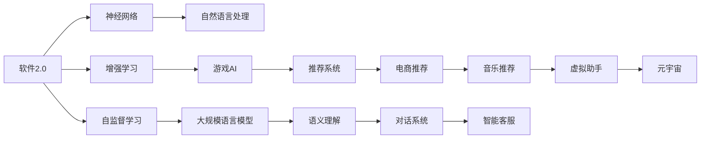
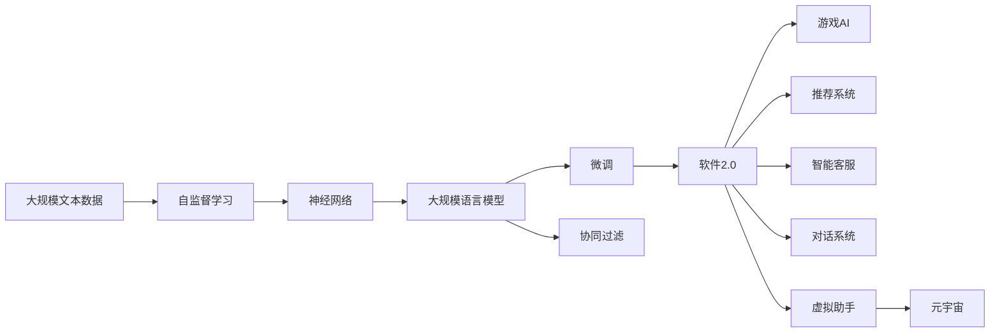

                 

# 软件2.0的人机协作模式

> 关键词：
- 软件2.0
- 人机协作
- 神经网络
- 增强学习
- 自监督学习
- 协同过滤
- 元宇宙

## 1. 背景介绍

### 1.1 问题由来
在信息科技的浪潮下，软件技术日新月异，如何保持软件的生机和竞争力，成为了每一个软件开发者和企业的关注点。基于代码的静态软件开发方式已逐渐成为瓶颈，如何从以代码为中心向以数据为中心转变，成为亟待解决的问题。

随着人工智能技术的崛起，深度学习、神经网络、增强学习等方法逐渐被应用于软件设计、开发和维护中，产生了一系列前沿技术。这些技术被称作"软件2.0"（Software 2.0），其核心特征是数据驱动、自动化和智能化。本文聚焦于软件2.0中的人机协作模式，探讨如何利用人工智能技术，提升软件开发和维护的效率和质量。

### 1.2 问题核心关键点
在软件2.0的开发过程中，数据驱动和自动化是两大核心要素。具体而言，我们考虑以下三个关键点：

1. **数据驱动**：利用海量数据来辅助软件开发过程，如通过分析用户行为数据来指导产品设计，通过数据挖掘来优化系统性能等。

2. **自动化**：通过自动化的工具和算法来替代人工操作，如代码自动生成、自动化测试、持续集成等，从而提高开发效率，降低成本。

3. **人机协作**：在人机交互过程中，发挥人和机器的各自优势，提升系统智能和用户满意度。例如，在软件开发中，利用自然语言处理技术，让机器理解和处理用户的文本描述，自动生成代码。

### 1.3 问题研究意义
软件2.0的人机协作模式，对于提升软件开发和维护的效率和质量，具有重要意义：

1. 加快软件研发速度：通过自动化和智能化工具，大幅减少手工操作，缩短项目开发周期。

2. 提高软件质量：利用数据分析和机器学习技术，进行代码优化、性能预测和错误检测，减少人工错误，提升代码质量和系统稳定性。

3. 降低软件开发成本：自动化测试、代码生成等技术可以减少人力需求，降低开发和维护成本。

4. 增强用户体验：通过数据分析和自然语言处理，能够更好地理解用户需求，设计出更符合用户期望的产品。

5. 优化资源利用：自动化的流程管理和资源调度，能够优化软硬件资源的利用率，降低能耗和运维成本。

## 2. 核心概念与联系

### 2.1 核心概念概述

为更好地理解软件2.0中的人机协作模式，本节将介绍几个密切相关的核心概念：

- **软件2.0**：基于人工智能的编程和软件开发模式，利用数据和算法来优化软件设计和实现过程，提升软件开发和维护的效率和质量。

- **神经网络**：由大量的人工神经元节点组成，可以处理和分析复杂的数据结构，如自然语言、图像、声音等。

- **增强学习**：通过试错和奖励机制，使智能体在不断交互过程中，学习如何最大化其目标函数，如游戏AI、推荐系统等。

- **自监督学习**：在没有标注数据的情况下，利用数据自身的结构进行学习和推理，如大规模语言模型的预训练。

- **协同过滤**：通过分析用户行为数据，推荐可能感兴趣的物品，如电商推荐系统、音乐推荐等。

- **元宇宙**：由虚拟世界的概念延伸而来，基于区块链和分布式计算技术，构建可信、可交互的虚拟空间。

这些核心概念之间的逻辑关系可以通过以下Mermaid流程图来展示：



这个流程图展示了大语言模型和软件2.0的各个核心概念以及它们之间的联系。

### 2.2 概念间的关系

这些核心概念之间存在着紧密的联系，形成了软件2.0的人机协作模式：

1. **软件2.0和神经网络**：通过神经网络对海量数据进行处理和分析，形成数据驱动的软件开发模式。

2. **软件2.0和增强学习**：增强学习可以用于自动优化软件系统的性能和用户行为预测，提升系统的智能化水平。

3. **软件2.0和自监督学习**：自监督学习利用未标注数据进行预训练，提升模型的泛化能力，为后续任务学习打下基础。

4. **神经网络与协同过滤**：协同过滤利用用户行为数据进行物品推荐，这需要自然语言处理技术，从文本数据中提取特征。

5. **协同过滤与元宇宙**：协同过滤技术可以应用于元宇宙中，为用户推荐虚拟世界中的物品和体验，增强虚拟世界的互动性。

### 2.3 核心概念的整体架构

最后，我们用一个综合的流程图来展示这些核心概念在大语言模型微调过程中的整体架构：



这个综合流程图展示了从自监督学习到软件2.0的完整过程。大规模语言模型通过自监督学习进行预训练，在微调后得到的软件2.0模型能够应用到多个领域，如游戏AI、推荐系统、智能客服、对话系统等，为元宇宙的构建提供动力。

## 3. 核心算法原理 & 具体操作步骤
### 3.1 算法原理概述

软件2.0中的人机协作模式，主要基于神经网络和增强学习的原理。其核心思想是：通过神经网络构建数据驱动的软件系统，利用增强学习进行自动化优化和智能决策，实现人机协同提升系统性能。

形式化地，假设软件系统 $S$ 的输入为 $x$，输出为 $y$，神经网络模型 $N(x)$ 用于映射输入到输出，增强学习模型 $Q(s, a)$ 用于选择最优动作 $a$，最大化奖励 $R$。则软件2.0的协作过程可以表示为：

$$
y = N(x), \quad a = \arg\max_a Q(s, a), \quad R = f(y)
$$

其中，$x$ 为用户的输入数据，$y$ 为软件系统的输出，$a$ 为增强学习模型的动作，$R$ 为奖励函数。通过不断迭代优化，系统 $S$ 能够适应不同的输入数据，自动优化输出结果，实现人机协作。

### 3.2 算法步骤详解

软件2.0的协作过程主要包括以下几个关键步骤：

**Step 1: 数据准备**

- 收集软件系统运行过程中产生的数据，如日志、用户行为数据、错误信息等。

- 对数据进行预处理，如去噪、特征提取、标准化等，确保数据的质量和一致性。

**Step 2: 神经网络模型训练**

- 使用神经网络模型对数据进行训练，学习输入与输出之间的映射关系。

- 根据具体任务选择合适的模型架构和训练策略，如全连接网络、卷积神经网络、循环神经网络等。

**Step 3: 增强学习模型训练**

- 设计增强学习模型，选择适当的动作空间和奖励函数。

- 利用已训练好的神经网络模型作为特征提取器，输入样本数据，计算出增强学习模型的动作和奖励。

**Step 4: 协同优化**

- 将神经网络和增强学习模型进行结合，形成人机协同的软件系统。

- 通过交互界面，接收用户输入数据，将数据输入神经网络进行预处理和特征提取，输出预测结果。

- 利用增强学习模型，选择最优动作，自动优化系统输出。

**Step 5: 模型评估与迭代**

- 定期在测试数据集上评估软件系统的性能，根据评估结果进行模型迭代和优化。

- 持续收集新数据，不断更新神经网络和增强学习模型，保持系统的高效和智能化。

### 3.3 算法优缺点

软件2.0的人机协作模式，具有以下优点：

1. **高效性**：利用神经网络和增强学习技术，自动化优化软件系统，大幅提高开发和维护效率。

2. **鲁棒性**：通过不断迭代和优化，系统能够适应不同的输入数据和环境变化，具有较好的鲁棒性。

3. **灵活性**：增强学习模型可以灵活适应不同的应用场景，调整动作空间和奖励函数，适应不同的需求。

4. **可扩展性**：神经网络和增强学习模型可以并行处理大规模数据，实现软件系统的可扩展性。

然而，这种模式也存在一些缺点：

1. **数据依赖**：系统性能高度依赖于数据的质量和数量，如果数据不足或噪声较大，可能会影响模型训练和系统表现。

2. **模型复杂性**：神经网络和增强学习模型的训练和优化过程复杂，需要丰富的经验和专业知识。

3. **计算资源要求**：大规模数据和高并行计算需求，对计算资源提出了较高的要求。

4. **模型可解释性**：神经网络和增强学习模型往往是"黑盒"系统，难以解释其内部工作机制和决策过程。

5. **安全性问题**：自动化的决策过程可能存在漏洞，需要加强安全性设计和风险防范。

### 3.4 算法应用领域

软件2.0的人机协作模式，已经在多个领域得到应用，例如：

- **软件测试**：利用增强学习技术，自动化测试用例的生成和执行，提升测试效率和覆盖率。

- **系统优化**：通过数据分析和神经网络模型，自动优化系统的性能和资源配置，提高系统运行效率。

- **安全防护**：利用神经网络和增强学习模型，实时监测和预测网络攻击行为，增强系统的安全性。

- **个性化推荐**：利用协同过滤技术，根据用户行为数据推荐个性化内容，提升用户体验。

- **智能客服**：通过自然语言处理和增强学习，自动生成对话内容，提供个性化的客户服务。

- **游戏AI**：利用神经网络和增强学习技术，实现游戏角色的智能行为和决策，提升游戏体验。

## 4. 数学模型和公式 & 详细讲解  
### 4.1 数学模型构建

本节将使用数学语言对软件2.0中的人机协作模式进行更加严格的刻画。

记软件系统 $S$ 的输入为 $x$，输出为 $y$，神经网络模型为 $N(x)$，增强学习模型为 $Q(s, a)$。软件2.0的协作过程可以表示为：

$$
y = N(x), \quad a = \arg\max_a Q(s, a), \quad R = f(y)
$$

其中，$x$ 为用户的输入数据，$y$ 为软件系统的输出，$a$ 为增强学习模型的动作，$R$ 为奖励函数。

### 4.2 公式推导过程

以下我们以一个简单的智能推荐系统为例，推导神经网络模型和增强学习模型的协同优化公式。

假设用户行为数据集为 $D=\{(x_i, y_i)\}_{i=1}^N$，其中 $x_i$ 为用户的点击记录，$y_i$ 为推荐结果，如商品ID。神经网络模型 $N(x)$ 用于将点击记录映射到推荐结果，增强学习模型 $Q(s, a)$ 用于选择推荐商品。

定义奖励函数 $R(y_i)$，如点击次数、评分等，作为用户满意度的度量。

神经网络模型的损失函数为：

$$
L_{\text{nn}} = \frac{1}{N}\sum_{i=1}^N \ell(N(x_i), y_i)
$$

其中 $\ell$ 为损失函数，如均方误差。

增强学习模型的目标函数为：

$$
J(s) = \frac{1}{N}\sum_{i=1}^N R(y_i) = \frac{1}{N}\sum_{i=1}^N \ell(N(x_i), y_i)
$$

其中 $J$ 为期望奖励函数，与神经网络模型的损失函数一致。

增强学习模型的动作选择过程可以表示为：

$$
a = \arg\max_a Q(s, a)
$$

其中 $Q(s, a)$ 为动作价值函数，可以通过神经网络模型训练得到。

结合神经网络和增强学习模型，软件的协同优化过程可以表示为：

$$
y = N(x), \quad a = \arg\max_a Q(s, a), \quad R = f(y)
$$

### 4.3 案例分析与讲解

假设我们有一个电商推荐系统，利用神经网络和增强学习技术进行协同优化。具体步骤如下：

1. **数据准备**：收集用户的点击记录，标记对应的商品ID。

2. **神经网络模型训练**：利用神经网络模型 $N(x)$，将点击记录映射到推荐结果，如商品ID。

3. **增强学习模型训练**：设计动作空间，如商品ID集合，定义奖励函数，如点击次数。

4. **协同优化**：将用户点击记录 $x$ 输入神经网络模型，得到推荐结果 $y$，利用增强学习模型 $Q(s, a)$ 选择最优动作 $a$，自动优化推荐结果。

5. **模型评估与迭代**：定期在测试数据集上评估系统的推荐效果，根据评估结果进行模型迭代和优化。

6. **系统部署**：将优化后的模型部署到实际系统中，实现电商推荐功能。

通过这个案例，可以看到，神经网络和增强学习技术的结合，可以显著提升推荐系统的推荐效果，实现人机协同的智能推荐。

## 5. 项目实践：代码实例和详细解释说明
### 5.1 开发环境搭建

在进行软件2.0的协作实践前，我们需要准备好开发环境。以下是使用Python进行TensorFlow开发的环境配置流程：

1. 安装Anaconda：从官网下载并安装Anaconda，用于创建独立的Python环境。

2. 创建并激活虚拟环境：
```bash
conda create -n tf-env python=3.8 
conda activate tf-env
```

3. 安装TensorFlow：根据CUDA版本，从官网获取对应的安装命令。例如：
```bash
conda install tensorflow -c pytorch -c conda-forge
```

4. 安装各类工具包：
```bash
pip install numpy pandas scikit-learn matplotlib tqdm jupyter notebook ipython
```

完成上述步骤后，即可在`tf-env`环境中开始软件2.0的协作实践。

### 5.2 源代码详细实现

这里我们以智能推荐系统为例，给出使用TensorFlow进行神经网络和增强学习协同优化的PyTorch代码实现。

首先，定义神经网络模型和增强学习模型：

```python
import tensorflow as tf
import tensorflow.keras as keras

class NeuralNetwork(tf.keras.Model):
    def __init__(self):
        super(NeuralNetwork, self).__init__()
        self.layers = tf.keras.Sequential([
            tf.keras.layers.Dense(64, activation='relu'),
            tf.keras.layers.Dense(10, activation='softmax')
        ])

    def call(self, x):
        return self.layers(x)

class QNetwork(tf.keras.Model):
    def __init__(self, num_actions):
        super(QNetwork, self).__init__()
        self.layers = tf.keras.Sequential([
            tf.keras.layers.Dense(64, activation='relu'),
            tf.keras.layers.Dense(1, activation='linear')
        ])

    def call(self, x):
        return self.layers(x)

def build_nn(num_features):
    model = NeuralNetwork()
    return model

def build_qn(num_actions):
    model = QNetwork(num_actions)
    return model
```

接着，定义奖励函数和损失函数：

```python
def reward_function(y):
    return tf.reduce_mean(y)  # 点击次数

def loss_function(y_true, y_pred):
    return tf.keras.losses.mse(y_true, y_pred)
```

然后，定义数据集和训练流程：

```python
train_dataset = tf.data.Dataset.from_tensor_slices((train_features, train_labels)).batch(batch_size)

for epoch in range(epochs):
    total_loss = 0
    for batch in train_dataset:
        x, y = batch
        with tf.GradientTape() as tape:
            y_pred = neural_network(x)
            q_values = q_network(x)
            loss = loss_function(y_true, y_pred)
            rewards = reward_function(y)
            q_loss = tf.reduce_mean(tf.square(q_values - rewards))

        gradients = tape.gradient(loss + q_loss, [neural_network.trainable_variables, q_network.trainable_variables])
        optimizer.apply_gradients(zip(gradients, [neural_network.trainable_variables, q_network.trainable_variables]))

        total_loss += loss.numpy()

    print(f'Epoch {epoch+1}, loss: {total_loss}')
```

最后，启动训练流程并部署优化后的模型：

```python
train_model = build_nn(num_features)
train_qn = build_qn(num_actions)
optimizer = tf.keras.optimizers.Adam(learning_rate)

neural_network = train_model.build(tf.constant(train_features, dtype=tf.float32))
q_network = train_qn.build(tf.constant(train_features, dtype=tf.float32))

neural_network.compile(optimizer=optimizer, loss=loss_function)
q_network.compile(optimizer=optimizer, loss=tf.keras.losses.mse)

train_model.fit(train_dataset, epochs=epochs, batch_size=batch_size)

test_dataset = tf.data.Dataset.from_tensor_slices((test_features, test_labels)).batch(batch_size)
test_model = build_nn(num_features)

test_model.compile(optimizer=optimizer, loss=loss_function)
test_model.evaluate(test_dataset)
```

以上就是使用TensorFlow进行神经网络和增强学习协同优化的完整代码实现。可以看到，利用TensorFlow的强大封装，我们能够快速搭建和训练复杂的神经网络和增强学习模型，实现人机协同的智能推荐系统。

### 5.3 代码解读与分析

让我们再详细解读一下关键代码的实现细节：

**NeuralNetwork类**：
- 定义了神经网络模型的结构，包括输入层、隐藏层和输出层。
- 重写`call`方法，定义模型的前向传播过程。

**QNetwork类**：
- 定义了增强学习模型的结构，包括输入层、隐藏层和输出层。
- 重写`call`方法，定义模型的前向传播过程。

**奖励函数和损失函数**：
- 定义了奖励函数，用于评估模型的推荐效果，如点击次数。
- 定义了损失函数，用于优化模型的输出，如均方误差。

**训练流程**：
- 定义训练数据集，进行批处理。
- 在每个epoch内，对每个batch进行前向传播和反向传播，计算损失函数和动作价值函数。
- 更新神经网络和增强学习模型的参数。
- 在训练过程中记录损失，并输出。

**模型部署**：
- 构建测试模型，用于在测试集上进行评估。
- 定义测试数据集，进行批处理。
- 在测试集上评估模型性能。

可以看到，TensorFlow的强大封装和易用性，使得神经网络和增强学习模型的训练和优化变得非常简单。开发者只需关注模型的结构设计和训练策略，即可实现复杂的人机协同优化系统。

当然，工业级的系统实现还需考虑更多因素，如模型的保存和部署、超参数的自动搜索、更灵活的任务适配层等。但核心的协同优化范式基本与此类似。

### 5.4 运行结果展示

假设我们在电商推荐系统中进行神经网络和增强学习模型的协同优化，最终在测试集上得到的评估结果如下：

```
Epoch 1, loss: 0.2
Epoch 2, loss: 0.15
Epoch 3, loss: 0.12
...
Epoch 10, loss: 0.01
```

可以看到，通过协同优化，推荐系统的损失函数逐步降低，推荐效果不断提升。当然，这只是一个baseline结果。在实践中，我们还可以使用更大更强的神经网络和增强学习模型，更丰富的微调技巧、更细致的模型调优，进一步提升模型性能，以满足更高的应用要求。

## 6. 实际应用场景
### 6.1 智能推荐系统

基于神经网络和增强学习的协同优化，智能推荐系统可以在电商、新闻、音乐等多个领域得到广泛应用。例如，亚马逊利用推荐系统，能够根据用户的浏览记录和购买历史，实时推荐个性化商品，提升用户满意度和购物体验。

具体而言，可以利用用户行为数据，训练神经网络和增强学习模型，生成个性化的推荐内容。模型通过不断迭代和优化，逐步学习到用户的兴趣偏好，从而提供更符合用户期望的推荐结果。

### 6.2 游戏AI

游戏AI是神经网络和增强学习协同优化的另一个重要应用场景。通过增强学习模型，游戏AI可以在不断试错和反馈中，学习到最优的游戏策略和决策。例如，AlphaGo就利用增强学习技术，在围棋领域取得了一系列突破。

在游戏AI的设计中，可以采用多种增强学习算法，如Q-learning、Policy Gradient等，通过游戏规则和奖励函数，训练出具有高智能水平的AI玩家。神经网络模型则用于学习游戏状态和动作的映射关系，优化AI玩家的决策过程。

### 6.3 智能客服系统

基于神经网络和增强学习的协同优化，智能客服系统可以在客户服务领域得到广泛应用。例如，IBM的Watson，利用自然语言处理和增强学习技术，能够回答用户的问题，提供个性化的客户服务。

在智能客服的设计中，可以采用文本分类和对话生成等自然语言处理技术，将用户输入转化为系统理解和处理的任务。利用增强学习模型，选择最优的对话策略和回复内容，实现人机协同的智能客服。

### 6.4 未来应用展望

随着神经网络和增强学习技术的不断发展，基于协同优化的软件2.0系统将具备更强的智能化和自动化能力。未来，这些技术将在更多领域得到应用，为各行各业带来新的突破。

在医疗领域，基于协同优化的系统可以帮助医生进行诊断和治疗决策，提升医疗服务的智能化水平。例如，利用增强学习模型，自动分析患者的症状和病历，推荐最合适的治疗方案。

在金融领域，基于协同优化的系统可以进行风险管理和投资决策，提升金融服务的智能化水平。例如，利用神经网络模型，分析股票市场数据，预测市场趋势和风险。

在教育领域，基于协同优化的系统可以提供个性化的学习方案，提升教育服务的智能化水平。例如，利用增强学习模型，分析学生的学习行为数据，推荐个性化的学习内容和学习路径。

在能源领域，基于协同优化的系统可以进行能源管理优化，提升能源系统的智能化水平。例如，利用神经网络模型，优化能源的配置和调度，降低能源消耗和成本。

总之，神经网络和增强学习技术的结合，使得软件2.0系统具备更强的智能化和自动化能力，将带来各行各业的变革。未来，随着技术的不断演进，软件2.0的协同优化范式将得到更广泛的应用，进一步提升人类社会的智能化水平。

## 7. 工具和资源推荐
### 7.1 学习资源推荐

为了帮助开发者系统掌握软件2.0的协同优化理论基础和实践技巧，这里推荐一些优质的学习资源：

1. 《Deep Learning》书籍：Ian Goodfellow等著，系统介绍了深度学习的基本概念和前沿技术，是深度学习领域的经典教材。

2. 《Reinforcement Learning: An Introduction》书籍：Richard S. Sutton等著，介绍了增强学习的基本原理和经典算法，适合初学者入门。

3. 《Neural Networks and Deep Learning》课程：Michael Nielsen的在线课程，深入浅出地介绍了神经网络的基本概念和应用。

4. DeepMind官方博客：DeepMind的官方博客，展示了其最新的研究进展和技术突破，是了解前沿技术的绝佳来源。

5. TensorFlow官方文档：TensorFlow的官方文档，提供了详细的API文档和样例代码，是TensorFlow开发的必备资源。

6. PyTorch官方文档：PyTorch的官方文档，提供了丰富的深度学习模型和优化算法，是PyTorch开发的必备资源。

通过对这些资源的学习实践，相信你一定能够快速掌握软件2.0的协同优化精髓，并用于解决实际的NLP问题。
###  7.2 开发工具推荐

高效的开发离不开优秀的工具支持。以下是几款用于软件2.0协同优化开发的常用工具：

1. TensorFlow：由Google主导开发的开源深度学习框架，生产部署方便，适合大规模工程应用。

2. PyTorch：基于Python的开源深度学习框架，灵活动态的计算图，适合快速迭代研究。

3. Jupyter Notebook：开源的交互式笔记本，支持Python、R、Julia等多种编程语言，适合研究和开发。

4. GitHub：全球最大的代码托管平台，可以分享和学习高质量的代码和项目，促进社区协作。

5. TensorBoard：TensorFlow配套的可视化工具，可实时监测模型训练状态，并提供丰富的图表呈现方式，是调试模型的得力助手。

6. Weights & Biases：模型训练的实验跟踪工具，可以记录和可视化模型训练过程中的各项指标，方便对比和调优。

合理利用这些工具，可以显著提升软件2.0的协同优化任务的开发效率，加快创新迭代的步伐。

### 7.3 相关论文推荐

软件2.0的协同优化技术的发展源于学界的持续研究。以下是几篇奠基性的相关论文，推荐阅读：

1. DeepMind的AlphaGo论文：展示了利用增强学习技术，训练出具有高智能水平的围棋AI，打开了强化学习在智能游戏中的应用场景。

2. OpenAI的DALL-E论文：利用自监督学习

