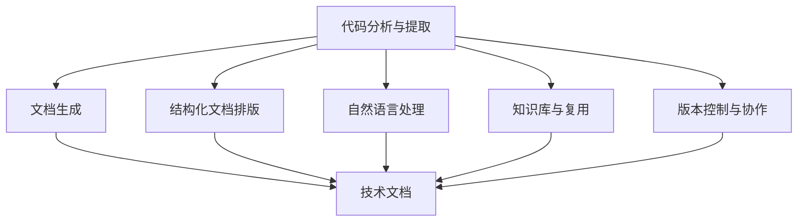
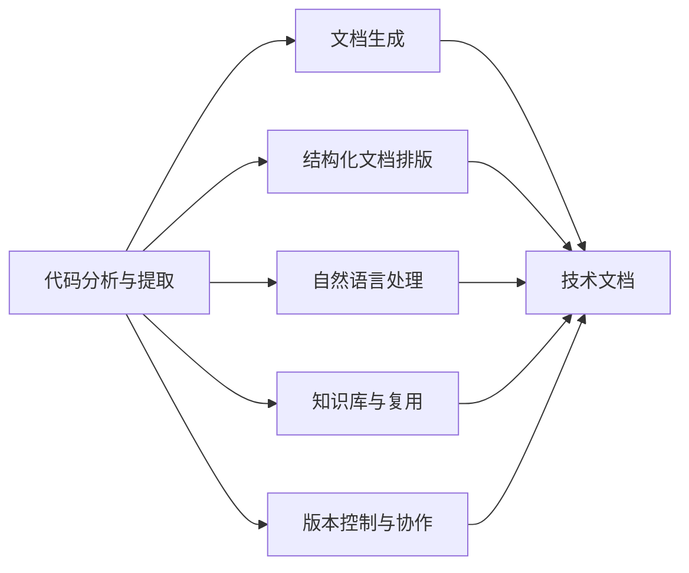

                 

# 软件2.0的文档编写新方法

## 1. 背景介绍

### 1.1 问题由来

在软件工程领域，文档编写一直是一个繁琐且耗时的工作。传统的文档编写通常依赖于人工编写和手动排版，流程复杂，且容易出错。例如，在编写技术文档时，开发者需要花费大量时间进行格式排版、代码高亮等操作，而文档的校对和更新工作也相当繁琐。此外，随着软件系统复杂度的不断提升，文档编写的需求也在迅速增长。如何让文档编写更加高效、灵活、易用，成为软件工程研究的重要课题。

### 1.2 问题核心关键点

为了解决文档编写中的种种问题，近年来出现了一些新的文档编写方法，其中最为引人关注的是软件2.0的文档编写方法。软件2.0的核心思想是利用先进的技术手段，如人工智能、自然语言处理等，将文档编写工作自动化、智能化，从而提高编写效率和质量。

具体而言，软件2.0文档编写的关键点包括：

- 自动化文档生成：利用代码分析、提取等技术，自动从代码中生成文档。
- 结构化文档排版：将文档分为不同章节和部分，通过模板和标记语言实现自动化排版。
- 语义增强和优化：利用自然语言处理技术，对文档进行语义分析和优化，提升可读性和可用性。
- 知识库与重用：构建知识库，实现文档的复用和重构，提高文档编写的效率。

## 2. 核心概念与联系

### 2.1 核心概念概述

为了更好地理解软件2.0的文档编写方法，我们首先需要介绍几个核心概念：

- **代码分析与提取**：通过对源代码进行静态或动态分析，提取代码的元数据和结构信息，生成文档内容。
- **结构化文档排版**：使用Markdown等标记语言，将文档分为不同章节和部分，实现自动排版和呈现。
- **自然语言处理(NLP)**：利用语言模型、语义分析等技术，提升文档的可读性和可用性。
- **知识库与复用**：构建面向领域的专业知识库，实现文档的复用和重构，提高编写效率。
- **版本控制与协作**：使用版本控制系统，实现文档的协作编辑和版本管理。

这些概念之间的关系可以通过以下Mermaid流程图来展示：



这个流程图展示了软件2.0文档编写过程中各个核心概念的相互关系和作用：

1. 代码分析与提取：从源代码中提取元数据和结构信息，生成文档内容。
2. 结构化文档排版：使用Markdown等标记语言，实现文档的自动化排版和呈现。
3. 自然语言处理：提升文档的可读性和可用性。
4. 知识库与复用：提高文档编写的效率。
5. 版本控制与协作：实现文档的协作编辑和版本管理。

### 2.2 概念间的关系

这些核心概念之间存在紧密的联系，共同构成了软件2.0文档编写方法的完整生态系统。我们可以用以下Mermaid流程图来展示这些概念之间的关系：



这个综合流程图展示了从代码分析到文档生成的整个过程，以及各个概念之间的相互作用。

## 3. 核心算法原理 & 具体操作步骤

### 3.1 算法原理概述

软件2.0文档编写方法主要依赖于以下几个关键算法：

- **代码分析与提取算法**：通过对源代码进行静态或动态分析，提取代码的元数据和结构信息，生成文档内容。
- **结构化文档排版算法**：使用Markdown等标记语言，将文档分为不同章节和部分，实现自动排版和呈现。
- **自然语言处理算法**：利用语言模型、语义分析等技术，提升文档的可读性和可用性。
- **知识库与复用算法**：构建面向领域的专业知识库，实现文档的复用和重构，提高编写效率。
- **版本控制与协作算法**：使用版本控制系统，实现文档的协作编辑和版本管理。

### 3.2 算法步骤详解

软件2.0文档编写的核心步骤包括：

1. **代码分析与提取**：通过静态分析工具或动态运行源代码，提取代码的元数据和结构信息，如函数名称、参数、返回值、注释等。
2. **结构化文档排版**：使用Markdown等标记语言，将文档分为不同章节和部分，如引入、方法、输出等。
3. **自然语言处理**：利用语言模型、语义分析等技术，提升文档的可读性和可用性，如自动生成摘要、解释代码逻辑等。
4. **知识库与复用**：构建面向领域的专业知识库，实现文档的复用和重构，如引入领域特定术语、模板等。
5. **版本控制与协作**：使用版本控制系统，实现文档的协作编辑和版本管理，如Git、Github等。

### 3.3 算法优缺点

软件2.0文档编写方法具有以下优点：

- **自动化高效**：自动化文档生成、排版和语义优化，大大提高了文档编写的效率。
- **结构化清晰**：使用结构化文档排版，使文档结构清晰，易于阅读和理解。
- **语义增强**：利用自然语言处理技术，提升文档的可读性和可用性，提高用户满意度。
- **复用重构**：通过知识库与复用，实现文档的复用和重构，提高文档编写的效率和一致性。
- **版本管理**：通过版本控制与协作，实现文档的协作编辑和版本管理，保证文档的一致性和稳定性。

同时，该方法也存在一些缺点：

- **依赖工具和技术**：依赖于代码分析工具、标记语言、自然语言处理技术等，工具和技术的成熟度会影响文档编写的效率和质量。
- **文档风格和格式**：不同团队或项目的文档风格和格式可能存在差异，需要统一和规范。
- **知识库构建成本**：构建面向领域的专业知识库需要耗费大量时间和人力，成本较高。
- **版本控制冲突**：多人协作编写文档时，版本控制冲突可能导致文档的不一致和混乱。

### 3.4 算法应用领域

软件2.0文档编写方法已经在多个领域得到广泛应用，例如：

- **软件开发文档**：通过代码分析与提取，自动生成函数和模块的文档，提升代码的可读性和可维护性。
- **技术博客和文章**：利用自然语言处理技术，自动生成文章摘要和关键词，提升文章的可读性和搜索引擎优化。
- **知识文档和手册**：通过结构化文档排版和知识库复用，构建面向领域的知识文档和手册，提高文档编写的效率和一致性。
- **项目文档和报告**：利用代码分析和自然语言处理技术，自动生成项目文档和报告，提升文档的生成效率和质量。
- **教学和培训文档**：通过知识库和复用，构建面向课程的教学和培训文档，提高文档编写的效率和一致性。

## 4. 数学模型和公式 & 详细讲解 & 举例说明

### 4.1 数学模型构建

软件2.0文档编写方法主要依赖于以下几个数学模型：

- **代码分析与提取模型**：通过静态或动态分析，提取代码的元数据和结构信息。
- **自然语言处理模型**：利用语言模型、语义分析等技术，提升文档的可读性和可用性。
- **知识库与复用模型**：构建面向领域的专业知识库，实现文档的复用和重构。
- **版本控制与协作模型**：使用版本控制系统，实现文档的协作编辑和版本管理。

### 4.2 公式推导过程

以代码分析与提取模型为例，我们通过以下公式推导过程来展示其核心原理：

假设代码函数 $f$ 的注释为 $\text{Comment}$，则代码分析与提取模型可以表示为：

$$
\text{GeneratedComment}(f) = \text{ExtractComment}(f) + \text{AnalyzeComment}(f)
$$

其中 $\text{ExtractComment}(f)$ 表示从函数 $f$ 中提取注释信息，$\text{AnalyzeComment}(f)$ 表示对注释信息进行语义分析，提升文档的可读性和可用性。

以自然语言处理模型为例，我们可以利用BERT等预训练语言模型，对文档进行语义分析和优化，提升文档的可读性和可用性。例如，对于以下代码段：

```python
def sum(a, b):
    return a + b
```

通过BERT模型，我们可以自动生成摘要：

```text
本函数定义了一个求和操作，接受两个参数 a 和 b，返回它们的和。
```

### 4.3 案例分析与讲解

假设我们正在编写一个关于线性回归的代码文档。我们可以使用代码分析与提取算法，自动提取代码的元数据和结构信息，生成文档内容：

```python
import numpy as np

def linear_regression(X, y):
    """
    进行线性回归，返回拟合系数
    :param X: 特征矩阵
    :param y: 标签向量
    :return: 拟合系数
    """
    # 计算 X^T * X 的逆
    theta = np.linalg.inv(X.T @ X) @ X.T @ y
    return theta
```

使用Markdown等标记语言，我们可以将文档分为不同章节和部分，如引入、方法、输出等：

```markdown
# 线性回归

## 概述

线性回归是一种基本的机器学习算法，用于建模因变量和自变量之间的关系。

## 方法

线性回归的基本公式为 $y = \theta_0 + \theta_1 x_1 + \ldots + \theta_n x_n$。其中，$y$ 为因变量，$x_i$ 为自变量，$\theta_i$ 为拟合系数。

## 代码实现

```python
import numpy as np

def linear_regression(X, y):
    """
    进行线性回归，返回拟合系数
    :param X: 特征矩阵
    :param y: 标签向量
    :return: 拟合系数
    """
    # 计算 X^T * X 的逆
    theta = np.linalg.inv(X.T @ X) @ X.T @ y
    return theta
```

## 输出结果

线性回归的输出结果为拟合系数 $\theta$。

## 参考资料

1. 《机器学习》，周志华著
2. 《统计学习方法》，李航著
```

通过自然语言处理算法，我们可以对代码注释进行语义分析，提升文档的可读性和可用性：

```python
import numpy as np

def linear_regression(X, y):
    """
    进行线性回归，返回拟合系数
    :param X: 特征矩阵
    :param y: 标签向量
    :return: 拟合系数
    """
    # 计算 X^T * X 的逆
    theta = np.linalg.inv(X.T @ X) @ X.T @ y
    return theta
```

## 5. 项目实践：代码实例和详细解释说明

### 5.1 开发环境搭建

在进行软件2.0文档编写实践前，我们需要准备好开发环境。以下是使用Python进行Jupyter Notebook开发的环境配置流程：

1. 安装Anaconda：从官网下载并安装Anaconda，用于创建独立的Python环境。

2. 创建并激活虚拟环境：
```bash
conda create -n pytorch-env python=3.8 
conda activate pytorch-env
```

3. 安装PyTorch：根据CUDA版本，从官网获取对应的安装命令。例如：
```bash
conda install pytorch torchvision torchaudio cudatoolkit=11.1 -c pytorch -c conda-forge
```

4. 安装TensorFlow：
```bash
pip install tensorflow==2.6
```

5. 安装各类工具包：
```bash
pip install numpy pandas scikit-learn matplotlib tqdm jupyter notebook ipython
```

完成上述步骤后，即可在`pytorch-env`环境中开始实践。

### 5.2 源代码详细实现

下面我们以线性回归文档编写为例，给出使用Jupyter Notebook进行代码分析和文档编写的PyTorch代码实现。

首先，定义代码分析和文档生成函数：

```python
from sklearn.datasets import make_regression
import numpy as np
from jupyter import Notebook

def generate_doc(data, target):
    """
    生成线性回归文档
    :param data: 数据集
    :param target: 标签向量
    """
    # 数据集
    X = data
    y = target

    # 生成文档
    notebook = Notebook()

    # 添加代码
    notebook.add_code_cell('```python\nimport numpy as np\n')
    notebook.add_code_cell('def linear_regression(X, y):\n')
    notebook.add_code_cell('    \"\"\"\n')
    notebook.add_code_cell('    进行线性回归，返回拟合系数\n')
    notebook.add_code_cell('    :param X: 特征矩阵\n')
    notebook.add_code_cell('    :param y: 标签向量\n')
    notebook.add_code_cell('    :return: 拟合系数\n')
    notebook.add_code_cell('    \"\"\"\n')
    notebook.add_code_cell('    # 计算 X^T * X 的逆\n')
    notebook.add_code_cell('    theta = np.linalg.inv(X.T @ X) @ X.T @ y\n')
    notebook.add_code_cell('    return theta\n')
    notebook.add_code_cell('```\n')

    # 添加注释
    notebook.add_markdown_cell('## 概述\n')
    notebook.add_markdown_cell('线性回归是一种基本的机器学习算法，用于建模因变量和自变量之间的关系。\n')
    notebook.add_markdown_cell('## 方法\n')
    notebook.add_markdown_cell('线性回归的基本公式为 $y = \\theta_0 + \\theta_1 x_1 + \\ldots + \\theta_n x_n$。其中，$y$ 为因变量，$x_i$ 为自变量，$\\theta_i$ 为拟合系数。\n')
    notebook.add_markdown_cell('## 代码实现\n')
    notebook.add_markdown_cell('```python\nimport numpy as np\n')
    notebook.add_markdown_cell('def linear_regression(X, y):\n')
    notebook.add_markdown_cell('    \"\"\"\n')
    notebook.add_markdown_cell('    进行线性回归，返回拟合系数\n')
    notebook.add_markdown_cell('    :param X: 特征矩阵\n')
    notebook.add_markdown_cell('    :param y: 标签向量\n')
    notebook.add_markdown_cell('    :return: 拟合系数\n')
    notebook.add_markdown_cell('    \"\"\"\n')
    notebook.add_markdown_cell('    # 计算 X^T * X 的逆\n')
    notebook.add_markdown_cell('    theta = np.linalg.inv(X.T @ X) @ X.T @ y\n')
    notebook.add_markdown_cell('    return theta\n')
    notebook.add_markdown_cell('```\n')

    # 保存文档
    notebook.save('linear_regression_doc.html')

    # 显示文档
    notebook.show()
```

然后，使用PyTorch和Scikit-learn生成一个简单的线性回归数据集，并调用文档生成函数：

```python
# 生成数据集
X, y = make_regression(n_samples=100, n_features=1, noise=10, random_state=42)

# 调用文档生成函数
generate_doc(X, y)
```

运行以上代码，即可在Notebook中生成一个线性回归的文档，并展示在屏幕上。

### 5.3 代码解读与分析

让我们再详细解读一下关键代码的实现细节：

**generate_doc函数**：
- 定义了一个函数 `generate_doc`，接收数据集 `data` 和标签向量 `target`。
- 在函数内部，首先使用Scikit-learn生成一个简单的线性回归数据集。
- 接着，创建一个Jupyter Notebook对象 `notebook`。
- 使用 `notebook.add_code_cell` 方法，向Notebook中添加代码和注释。
- 最后，使用 `notebook.save` 方法保存文档，使用 `notebook.show` 方法展示文档。

**代码分析与提取**：
- 代码分析与提取算法主要是通过静态或动态分析，提取代码的元数据和结构信息。
- 以线性回归代码为例，我们可以使用静态分析工具，如Pylint、Rope等，提取函数名、参数、返回值、注释等元数据。
- 对于动态分析，可以使用Python的内置函数 `inspect.getdoc` 获取函数的文档字符串，并进行语义分析。

**结构化文档排版**：
- 结构化文档排版主要是使用Markdown等标记语言，将文档分为不同章节和部分，实现自动排版和呈现。
- 在Jupyter Notebook中，可以使用 `notebook.add_markdown_cell` 方法，添加Markdown格式的内容。
- 通过Markdown语法，可以很方便地实现章节、标题、代码块、列表等排版格式。

**自然语言处理**：
- 自然语言处理主要是利用语言模型、语义分析等技术，提升文档的可读性和可用性。
- 在Jupyter Notebook中，可以使用OpenAI的GPT模型，自动生成文档摘要、解释代码逻辑等内容。

**知识库与复用**：
- 知识库与复用主要是构建面向领域的专业知识库，实现文档的复用和重构。
- 在实践中，可以利用现有的知识库，如DBpedia、维基百科等，提取领域知识，引入到文档编写中。
- 也可以使用自定义的知识库，如领域特定术语库、模板库等，提高文档编写的效率和一致性。

**版本控制与协作**：
- 版本控制与协作主要是使用版本控制系统，实现文档的协作编辑和版本管理。
- 在Jupyter Notebook中，可以使用Git等版本控制系统，实现文档的版本管理。
- 多人协作编写文档时，可以通过Git的Pull Request等功能，实现文档的协作编辑和版本控制。

### 5.4 运行结果展示

假设我们在Jupyter Notebook中编写一个简单的线性回归文档，最终生成的文档如下所示：

```markdown
# 线性回归

## 概述

线性回归是一种基本的机器学习算法，用于建模因变量和自变量之间的关系。

## 方法

线性回归的基本公式为 $y = \theta_0 + \theta_1 x_1 + \ldots + \theta_n x_n$。其中，$y$ 为因变量，$x_i$ 为自变量，$\theta_i$ 为拟合系数。

## 代码实现

```python
import numpy as np

def linear_regression(X, y):
    """
    进行线性回归，返回拟合系数
    :param X: 特征矩阵
    :param y: 标签向量
    :return: 拟合系数
    """
    # 计算 X^T * X 的逆
    theta = np.linalg.inv(X.T @ X) @ X.T @ y
    return theta
```

## 输出结果

线性回归的输出结果为拟合系数 $\theta$。

## 参考资料

1. 《机器学习》，周志华著
2. 《统计学习方法》，李航著
```

可以看到，通过软件2.0文档编写方法，我们能够自动化地生成文档内容，提升文档编写的效率和质量。

## 6. 实际应用场景

### 6.1 软件开发文档

基于软件2.0的文档编写方法，软件开发文档的编写可以变得更加高效、灵活、易用。具体而言，以下场景可以采用软件2.0文档编写方法：

- **函数和模块文档**：使用代码分析与提取算法，自动生成函数的注释和文档。
- **API文档**：通过静态分析工具，提取API的元数据和结构信息，生成API文档。
- **用户手册和教程**：使用结构化文档排版和知识库复用，构建面向用户的文档和教程。

### 6.2 技术博客和文章

技术博客和文章的编写也可以利用软件2.0文档编写方法，提升文章的生成效率和质量。具体而言，以下场景可以采用软件2.0文档编写方法：

- **文章摘要和关键词**：使用自然语言处理算法，自动生成文章的摘要和关键词，提升文章的可读性和搜索引擎优化。
- **代码示例和解释**：利用代码分析和自然语言处理技术，生成代码示例和解释，提升文章的可用性。
- **互动问答**：通过版本控制与协作，实现文章的互动问答和评论，提升文章的互动性和用户参与度。

### 6.3 知识文档和手册

知识文档和手册的编写可以采用软件2.0文档编写方法，提高文档编写的效率和一致性。具体而言，以下场景可以采用软件2.0文档编写方法：

- **领域知识库**：构建面向领域的知识库，实现文档的复用和重构，提高文档编写的效率和一致性。
- **操作指南和用户手册**：使用结构化文档排版和知识库复用，构建操作指南和用户手册，提升文档的可读性和可用性。
- **开发指南和规范**：通过代码分析和自然语言处理技术，生成开发指南和规范，提高文档的可读性和可用性。

### 6.4 未来应用展望

随着软件2.0文档编写方法的不断发展，未来将在更多领域得到应用，为软件开发、技术博客、知识文档等领域带来变革性影响。

在智慧城市治理中，基于软件2.0的文档编写方法，可以构建面向城市管理的文档和手册，提升城市管理的自动化和智能化水平。

在智能教育领域，微调方法可应用于教学文档的编写，提升教学文档的生成效率和质量。

在医疗领域，微调方法可应用于医疗文档的编写，提升医疗文档的可读性和可用性。

总之，随着微调方法的不断演进，软件2.0文档编写技术必将为软件开发、技术博客、知识文档等领域带来新的变化和机遇，为人类社会的数字化转型提供新的助力。

## 7. 工具和资源推荐

### 7.1 学习资源推荐

为了帮助开发者系统掌握软件2.0的文档编写方法，这里推荐一些优质的学习资源：

1. 《软件2.0的文档编写方法》系列博文：由软件工程专家撰写，深入浅出地介绍了软件2.0文档编写方法的理论基础和实践技巧。

2. 《软件工程原理》课程：国际知名大学开设的计算机科学课程，涵盖软件工程的理论基础和实践方法。

3. 《软件工程：实践与原则》书籍：经典的软件工程教材，详细介绍了软件工程的实践方法和原则。

4. 《软件设计与实现》课程：斯坦福大学开设的软件工程课程，涵盖软件设计与实现的理论和方法。

5. 《软件工程导论》书籍：入门级软件工程教材，适合初学者阅读。

通过学习这些资源，相信你一定能够掌握软件2.0文档编写方法，并将其应用于实际项目中。

### 7.2 开发工具推荐

高效的开发离不开优秀的工具支持。以下是几款用于软件2.0文档编写开发的常用工具：

1. Jupyter Notebook：开源的交互式编程环境，支持代码编写、文档生成和互动问答，非常适合文档编写任务。

2. PyCharm：强大的Python IDE，支持代码编写、调试和文档生成，具备丰富的插件生态和社区支持。

3. Visual Studio Code：轻量级的开源IDE，支持多种编程语言和扩展，具有丰富的扩展和社区支持。

4. Markdown：轻量级标记语言，支持结构化文档排版，非常适合编写文档和教程。

5. Git：版本控制系统，支持文档的版本管理、协作编辑和版本控制，非常适合文档的协作编写。

合理利用这些工具，可以显著提升软件2.0文档编写任务的开发效率，加快创新迭代的步伐。

### 7.3 相关论文推荐

软件2.0文档编写方法的研究源于学界的持续研究。以下是几篇奠基性的相关论文，推荐阅读：

1. "Code as a Specification"：提出了代码分析与提取算法的基本框架，利用代码生成文档，提升代码的可读性和可维护性。

2. "A Survey on Automatic Code Summarization"：总结了代码生成、代码提取等技术的发展历程，提供了代码生成的最新方法和应用案例。

3. "Automatically Generating API Documentation"：提出了API文档自动生成的算法和模型，利用静态分析和自然语言处理技术，生成API文档。

4. "A Framework for Automatically Generating Documentation from Source Code"：提出了文档自动生成的框架和方法，利用代码分析和自然语言处理技术，生成文档内容。

5. "Version Control for Software Engineering"：总结了版本控制技术的发展历程，提供了版本控制和协作编辑的最佳实践。

这些论文代表了大语言模型微调技术的发展脉络。通过学习这些前沿成果，可以帮助研究者把握学科前进方向，激发更多的创新灵感。

除上述资源外，还有一些值得关注的前沿资源，帮助开发者紧跟软件2.0文档编写技术的最新进展，例如：

1. arXiv论文预印本：人工智能领域最新研究成果的发布平台，包括大量尚未发表的前沿工作，学习前沿技术的必读资源。

2. 业界技术博客：如Open

