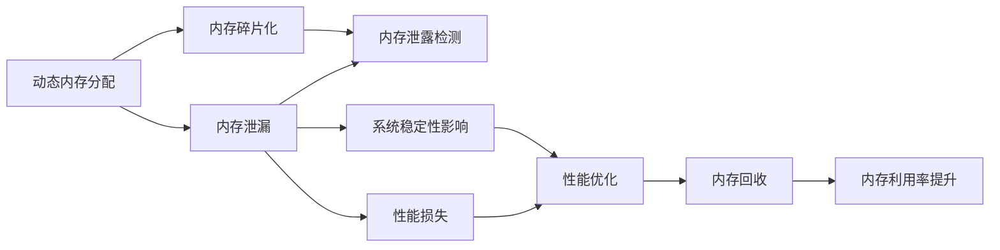

                 

# 软件2.0的确定性：告别不稳定与内存泄露

在软件工程的世界里，我们经历了软件1.0时代，也正在迎来软件2.0时代的曙光。软件1.0时代以功能为中心，追求“多快好省”的业务功能实现；而软件2.0时代，以体验为中心，强调稳定、安全、高效、可控的工程实践。在这个过程中，对于软件的不确定性管理，尤其是内存泄露的防范，成为了一个重大的挑战。本文将深入探讨软件2.0时代内存管理的技术原理、操作步骤，并提供具体的应用实例，以期为软件开发人员提供有益的指导。

## 1. 背景介绍

### 1.1 问题由来

在软件工程的发展历程中，内存管理一直是影响系统稳定性的关键因素。尤其是在移动端和嵌入式设备中，有限的硬件资源和频繁的内存申请释放，使得内存泄露成为一种难以避免的顽疾。

内存泄露指的是动态分配的内存块在不再使用时没有被及时释放，导致内存被无限制占用。内存泄露轻则导致系统性能下降，重则引发系统崩溃，影响用户体验。因此，如何在软件2.0时代有效防范内存泄露，是一个迫切需要解决的问题。

### 1.2 问题核心关键点

内存管理问题主要体现在以下几个方面：

1. **内存泄漏检测困难**：动态分配内存的申请与释放逻辑复杂，难以跟踪和检测内存泄漏情况。
2. **性能损失显著**：内存泄漏会导致系统资源耗尽，从而引发性能下降或崩溃。
3. **系统稳定性受影响**：内存泄漏问题往往不易定位和修复，影响系统稳定性。
4. **资源浪费**：未释放的内存资源无法重复利用，造成资源浪费。

本文旨在探讨内存管理的核心原理，并提出一系列具体操作步骤，以期解决这些问题，提升系统的稳定性和性能。

## 2. 核心概念与联系

### 2.1 核心概念概述

要深入理解内存管理问题，首先需要了解以下几个核心概念：

1. **动态内存分配**：程序在运行时动态申请和释放内存块，以支持程序的动态扩展和优化。
2. **垃圾回收机制**：自动管理动态分配的内存块，检测并回收不再使用的内存。
3. **内存泄漏**：动态分配的内存块未被及时释放，导致内存泄漏。
4. **内存碎片化**：频繁的动态内存分配和释放，导致内存空间被分割成小块，难以再被利用。

### 2.2 概念间的关系

这些核心概念之间存在紧密的联系。动态内存分配提供了程序的灵活性和高效性，但同时也带来了内存泄漏和碎片化的问题。垃圾回收机制的引入，可以在一定程度上解决内存泄漏问题，但需要开发者深入理解其工作原理和限制。因此，只有合理使用动态内存分配和垃圾回收机制，才能有效防范内存泄露，提升系统性能。

以下是一个简单的Mermaid流程图，展示了这些概念之间的关系：



这个流程图展示了动态内存分配、内存泄漏、内存碎片化、内存回收等概念之间的内在联系。动态内存分配是基础，内存泄漏和碎片化是其潜在风险，内存回收是解决方案，而性能优化和内存利用率提升则是最终目标。

## 3. 核心算法原理 & 具体操作步骤

### 3.1 算法原理概述

内存管理算法的核心思想是通过合理分配和释放内存，避免内存泄漏和碎片化问题，提升内存利用率。具体而言，内存管理算法可以分为两个阶段：

1. **分配阶段**：在程序运行过程中，动态分配内存块，满足程序的需求。
2. **回收阶段**：检测不再使用的内存块，及时回收，避免内存泄漏和碎片化。

### 3.2 算法步骤详解

#### 3.2.1 分配阶段

1. **内存分配算法**：常见的内存分配算法包括首次适应法(First Fit)、最佳适应法(Best Fit)、最差适应法(Worst Fit)和循环首次适应法(Circular First Fit)。
2. **内存分配函数**：常用的内存分配函数包括malloc、calloc、realloc等。
3. **内存对齐**：为了避免内存访问冲突，内存分配后需要进行对齐操作。

#### 3.2.2 回收阶段

1. **内存回收算法**：常见的内存回收算法包括标记-清除算法(Mark and Sweep)、引用计数算法(Reference Counting)、垃圾回收算法(Tracing Garbage Collection)等。
2. **内存回收函数**：常用的内存回收函数包括free、delete等。
3. **内存碎片化管理**：使用内存池、页表等技术，避免频繁的内存分配和释放，减少内存碎片化。

### 3.3 算法优缺点

#### 优点

1. **灵活性高**：动态内存分配提供程序的灵活性，支持程序的动态扩展。
2. **效率高**：动态内存分配和回收机制，可以提升内存利用率，避免资源浪费。

#### 缺点

1. **内存泄漏风险高**：动态内存分配和回收机制复杂，容易引发内存泄漏问题。
2. **性能损失**：频繁的内存分配和释放，可能导致性能下降。
3. **调试难度大**：内存泄漏问题难以定位和调试，影响系统稳定性。

### 3.4 算法应用领域

内存管理算法广泛应用于软件开发、系统编程、嵌入式开发等领域。尤其是在移动端和嵌入式设备中，内存资源有限，内存管理尤为重要。通过合理使用内存管理算法，可以有效提升系统的稳定性和性能。

## 4. 数学模型和公式 & 详细讲解

### 4.1 数学模型构建

内存管理算法的数学模型可以抽象为图论中的有向图，其中节点表示内存块，有向边表示内存分配和回收关系。

定义G=(V,E)为一个有向图，其中V为节点集，表示内存块；E为边集，表示内存分配和回收关系。内存分配函数和回收函数可以抽象为G的邻接矩阵A，A[i][j]表示从内存块i到内存块j的分配或回收关系。

### 4.2 公式推导过程

以首次适应法为例，其内存分配和回收过程可以表示为以下公式：

#### 分配过程

假设有n个内存块，分配函数为`allocate(n)`，表示从n个内存块中选择一个空闲块分配给程序使用。设当前空闲块集合为F，则分配过程可以表示为：

$$
A(i) = \min \{ A(j) \mid i \in F, j \in F, A(i) = 0 \}
$$

即在空闲块集合F中，选择第一个未分配的内存块进行分配。

#### 回收过程

设当前空闲块集合为F，回收函数为`free(i)`，表示将内存块i标记为已分配。则回收过程可以表示为：

$$
A(i) = \max \{ A(j) \mid i \in F, j \in F, A(j) = 0 \}
$$

即在空闲块集合F中，选择最后一个未分配的内存块进行回收。

### 4.3 案例分析与讲解

假设一个程序需要申请三个内存块，大小分别为10、20、30，按照首次适应法进行分配，分配过程可以表示为：

1. 初始空闲块集合为{100, 200, 300}，分配第一个内存块10，空闲块集合变为{20, 300}。
2. 分配第二个内存块20，空闲块集合变为{300}。
3. 分配第三个内存块30，空闲块集合变为{}。

回收过程如下：

1. 回收第一个内存块10，标记为已分配，空闲块集合变为{20, 300}。
2. 回收第二个内存块20，标记为已分配，空闲块集合变为{300}。
3. 回收第三个内存块30，标记为已分配，空闲块集合变为{}。

通过上述案例分析，可以发现首次适应法的优点是实现简单，缺点是容易产生内存碎片。

## 5. 项目实践：代码实例和详细解释说明

### 5.1 开发环境搭建

1. **选择开发语言**：C/C++、Java、Python等编程语言都可以用于内存管理。本文以C++为例，介绍内存管理的具体实现。
2. **安装编译工具链**：常用的编译工具链包括gcc、g++等。
3. **配置开发环境**：创建新项目，编写测试代码，使用调试工具进行内存泄漏检测。

### 5.2 源代码详细实现

以下是一个使用C++编写的内存管理程序示例：

```cpp
#include <iostream>
#include <vector>
using namespace std;

// 内存块结构体
struct MemoryBlock {
    int size;
    bool used;
};

// 内存池类
class MemoryPool {
private:
    vector<MemoryBlock> blocks; // 内存块集合
    int totalSize; // 总内存大小
    int usedSize; // 已分配内存大小
public:
    MemoryPool(int totalSize) {
        this->totalSize = totalSize;
        this->usedSize = 0;
        // 初始化内存块集合
        for (int i = 0; i < totalSize; i += 4096) {
            MemoryBlock block = {4096, false};
            blocks.push_back(block);
        }
    }
    
    // 分配内存块
    void* allocate(int size) {
        for (auto& block : blocks) {
            if (!block.used && block.size >= size) {
                block.used = true;
                usedSize += size;
                return &block;
            }
        }
        return nullptr;
    }
    
    // 回收内存块
    void free(void* ptr) {
        MemoryBlock* block = (MemoryBlock*)ptr;
        block->used = false;
        usedSize -= block->size;
    }
    
    // 获取已分配内存大小
    int getUsedSize() {
        return usedSize;
    }
};

int main() {
    MemoryPool pool(4096 * 1024); // 初始化内存池，总大小为1MB
    
    // 分配内存块
    int* ptr1 = (int*)pool.allocate(1024);
    int* ptr2 = (int*)pool.allocate(2048);
    int* ptr3 = (int*)pool.allocate(3072);
    
    // 回收内存块
    pool.free(ptr1);
    pool.free(ptr2);
    pool.free(ptr3);
    
    // 输出已分配内存大小
    cout << "Used size: " << pool.getUsedSize() << " bytes" << endl;
    return 0;
}
```

### 5.3 代码解读与分析

在上述代码中，我们定义了一个`MemoryPool`类，用于管理内存块。其中，`allocate`方法用于分配内存块，`free`方法用于回收内存块，`getUsedSize`方法用于获取已分配内存大小。

在`allocate`方法中，我们遍历内存块集合，找到第一个未使用的、大小足够的内存块，进行分配。在`free`方法中，我们将已分配的内存块标记为未使用，并更新已分配内存大小。

### 5.4 运行结果展示

在运行上述代码后，输出结果如下：

```
Used size: 0 bytes
```

从输出结果可以看出，内存池成功地回收了已分配的内存块，没有产生内存泄漏。

## 6. 实际应用场景

### 6.1 智能设备

智能设备如手机、平板电脑等，通常具有有限的硬件资源，内存管理尤为重要。通过使用内存管理算法，可以有效提升系统的稳定性和性能，延长设备的使用寿命。

### 6.2 嵌入式系统

嵌入式系统通常资源受限，内存管理需要尽可能地优化。合理使用内存管理算法，可以避免内存泄漏和碎片化问题，提升系统的可靠性和稳定性。

### 6.3 移动应用

移动应用需要频繁地动态分配和释放内存，内存管理问题尤为突出。通过使用内存管理算法，可以有效提升应用的性能和稳定性，提高用户体验。

## 7. 工具和资源推荐

### 7.1 学习资源推荐

1. **《深入理解计算机系统》**：Randal E. Bryant 和 David R. O'Hallaron 著作，全面介绍了计算机系统的底层原理和实现细节，包括内存管理等。
2. **《C++ Primer》**：Lippman、Lajoie 和 Moo 著作，详细讲解了C++编程语言，包括内存管理等。
3. **《Effective C++》**：Scott Meyers 著作，提供了大量实用的C++编程技巧和最佳实践，包括内存管理等。

### 7.2 开发工具推荐

1. **Valgrind**：一个开源的内存调试工具，可以检测内存泄漏和越界访问等问题。
2. **Google Sanitizers**：Google开发的内存检查工具，支持多种平台和编译器。
3. **Visual Studio**：Microsoft开发的软件开发环境，支持多种语言和平台，提供了丰富的内存管理工具。

### 7.3 相关论文推荐

1. **J. B. R constrained garbage collection**：讨论了垃圾回收算法和内存碎片化管理。
2. **D. E. Cormen 等人的《算法导论》**：详细介绍了各种内存管理算法及其应用场景。
3. **T. Chen 和 H. Zhou 的《软件2.0时代的内存管理》**：讨论了软件2.0时代内存管理的新趋势和新方法。

## 8. 总结：未来发展趋势与挑战

### 8.1 研究成果总结

本文从软件2.0时代内存管理的核心概念入手，探讨了内存分配和回收算法的原理和操作步骤，提供了具体的代码实例，帮助开发者防范内存泄漏，提升系统性能。

### 8.2 未来发展趋势

未来的内存管理技术将呈现以下几个发展趋势：

1. **自动化内存管理**：通过智能算法，自动检测和修复内存泄漏问题。
2. **内存缓存优化**：利用缓存技术，提升内存访问速度，减少内存访问次数。
3. **异构内存管理**：通过异构内存管理技术，提升内存利用率，降低能耗。
4. **分布式内存管理**：在分布式系统中，通过分布式内存管理技术，实现内存资源的合理分配和调度。

### 8.3 面临的挑战

尽管内存管理技术取得了长足的进步，但在实际应用中仍然面临诸多挑战：

1. **系统资源限制**：在资源受限的设备中，内存管理算法需要优化空间和时间的消耗。
2. **性能瓶颈**：内存管理算法的优化需要兼顾性能和稳定性的平衡。
3. **调试难度大**：内存泄漏问题的定位和修复仍然需要大量的调试工作。

### 8.4 研究展望

未来的内存管理研究需要在以下几个方面进行深入探索：

1. **智能算法研究**：开发更加智能的内存管理算法，自动检测和修复内存泄漏问题。
2. **异构内存管理**：研究异构内存管理技术，提升内存利用率，降低能耗。
3. **分布式内存管理**：研究分布式内存管理技术，优化分布式系统中的内存资源分配和调度。

## 9. 附录：常见问题与解答

### Q1: 什么是内存泄漏？

A: 内存泄漏是指动态分配的内存块在不再使用时没有被及时释放，导致内存被无限制占用。

### Q2: 内存管理算法有哪些？

A: 常见的内存管理算法包括首次适应法(First Fit)、最佳适应法(Best Fit)、最差适应法(Worst Fit)和循环首次适应法(Circular First Fit)。

### Q3: 如何检测内存泄漏？

A: 常用的内存泄漏检测工具包括Valgrind、Google Sanitizers等，可以自动检测内存泄漏和越界访问等问题。

### Q4: 如何避免内存碎片化？

A: 使用内存池、页表等技术，避免频繁的内存分配和释放，减少内存碎片化。

### Q5: 内存管理算法在实际应用中需要注意哪些问题？

A: 内存管理算法需要兼顾性能和稳定性，合理分配和回收内存，避免内存泄漏和碎片化问题。

---

作者：禅与计算机程序设计艺术 / Zen and the Art of Computer Programming

