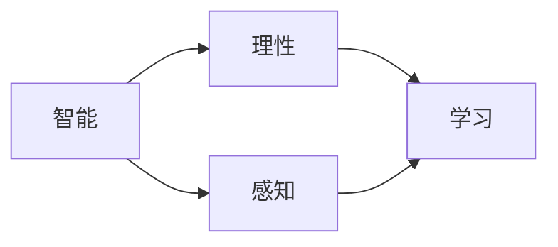

                 

# 达特茅斯会议的学术成果

## 1. 背景介绍

1956年夏天，邓恩·埃德蒙·沃森（Dena Edmond Watson）、约翰·麦卡锡（John McCarthy）、克拉克·伦纳德·艾尔（Clifford Leonard Elwyn）和纳撒尼尔·罗伯茨（Nathaniel Robert Bobrow）在达特茅斯学院（Dartmouth College）联合举办了一次开创性的会议。这次会议汇聚了一批世界顶尖的计算机科学家、数学家、心理学家，共同探讨人工智能的现状、挑战和发展前景，开启了人工智能研究的新纪元。

## 2. 核心概念与联系

### 2.1 核心概念概述

在这次会议上，人工智能概念首次被正式提出。会议的焦点集中于如何让计算机模拟人类的智能行为，如何实现真正的智能机器。会议的学术成果主要包括以下几个核心概念：

- **人工智能（Artificial Intelligence, AI）**：指通过计算机程序或硬件实现的人类智能模拟。人工智能旨在解决复杂问题，实现自主决策和认知行为。
- **智能（Intelligence）**：指在特定环境中，通过感知、推理、学习等手段完成目标的能力。智能可以用于自动化、决策支持和复杂问题的解决。
- **理性（Reasoning）**：指推理、归纳、演绎等逻辑思维过程，用于从已有信息推导出新的知识或结论。
- **感知（Perception）**：指机器识别和理解环境中的信息，包括视觉、听觉、语言等感官输入。
- **学习（Learning）**：指机器从经验中获取知识和技能的过程，包括有监督学习、无监督学习和强化学习等方法。

### 2.2 概念间的关系

人工智能的核心目标是通过学习、感知、推理等手段模拟人类智能。理性、感知和学习是实现这一目标的关键能力。具体来说，智能依赖于理性，理性依赖于感知，而感知和理性都建立在学习的基础上。这些核心概念通过逻辑关系形成一个完整的智能系统。



## 3. 核心算法原理 & 具体操作步骤

### 3.1 算法原理概述

人工智能的核心算法包括：

- **符号逻辑**：用于模拟人类的推理和决策过程，通过逻辑公式和推理规则表达和处理复杂问题。
- **基于规则的系统**：通过预设的规则和知识库，模拟人类专家的决策和推理过程。
- **机器学习**：通过数据和模型训练，使机器从经验中学习和提高性能。
- **深度学习**：利用多层神经网络进行特征提取和模型训练，处理大规模数据和复杂模式。
- **强化学习**：通过试错和反馈机制，使机器自主学习和优化行为策略。

### 3.2 算法步骤详解

1. **数据准备**：收集和预处理数据，包括数据清洗、特征提取、数据分割等步骤。
2. **模型设计**：根据任务需求设计合适的算法模型，如决策树、神经网络、支持向量机等。
3. **模型训练**：使用训练数据对模型进行参数优化，如使用梯度下降算法更新模型参数。
4. **模型评估**：在验证数据集上评估模型性能，如使用交叉验证、混淆矩阵等指标。
5. **模型调优**：根据评估结果调整模型参数，如增加正则化、调整学习率等。
6. **模型应用**：将训练好的模型应用于实际任务，如分类、预测、生成等。

### 3.3 算法优缺点

- **优点**：
  - 符号逻辑和基于规则的系统逻辑清晰，易于理解和解释。
  - 机器学习和深度学习可以处理大规模数据和复杂模式，具有较强的泛化能力。
  - 强化学习在动态环境中具有自主优化能力，适应性强。
- **缺点**：
  - 符号逻辑和基于规则的系统缺乏灵活性和自适应性，难以处理未知问题。
  - 机器学习和深度学习需要大量标注数据和计算资源，训练过程复杂。
  - 强化学习需要大量试错和反馈，难以处理长序列问题和复杂任务。

### 3.4 算法应用领域

人工智能的核心算法在不同领域有着广泛应用，如：

- **自然语言处理（NLP）**：文本分类、机器翻译、问答系统、情感分析等任务。
- **计算机视觉（CV）**：图像分类、目标检测、图像生成、图像分割等任务。
- **语音识别（ASR）**：自动语音识别、语音合成、语音情感分析等任务。
- **机器人学**：自主导航、动作规划、人机交互等任务。
- **自动驾驶**：路径规划、视觉感知、决策控制等任务。
- **金融科技**：风险评估、信用评分、欺诈检测等任务。

## 4. 数学模型和公式 & 详细讲解  
### 4.1 数学模型构建

在达特茅斯会议上，许多研究人员提出了不同的数学模型和算法，以下重点介绍其中几个重要模型：

- **符号逻辑**：通过布尔代数和逻辑公式表达推理过程，例如：
$$
P \land Q \rightarrow R
$$
其中 $P$、$Q$ 和 $R$ 为逻辑变量，$\land$ 表示逻辑与，$\rightarrow$ 表示蕴含关系。

- **决策树（Decision Tree）**：通过树形结构表示决策过程，如：
$$
\begin{array}{c}
\text{IF } P_1 \text{ THEN } Y_1 \\
\text{ELSE IF } P_2 \text{ THEN } Y_2 \\
\text{ELSE IF } P_3 \text{ THEN } Y_3
\end{array}
$$
其中 $P_1$、$P_2$、$P_3$ 为决策条件，$Y_1$、$Y_2$、$Y_3$ 为决策结果。

- **支持向量机（Support Vector Machine, SVM）**：通过最大化间隔和边际来优化分类超平面，例如：
$$
\text{minimize } \frac{1}{2}\|w\|^2 + C\sum_{i=1}^n \xi_i \\
\text{subject to } \sum_{i=1}^n \alpha_i = 1 \\
y_i(w \cdot x_i + b) \geq 1 - \xi_i, \quad \forall i=1,\ldots,n
$$
其中 $w$ 为分类超平面的法向量，$b$ 为截距，$\xi_i$ 为松弛变量，$C$ 为正则化系数。

### 4.2 公式推导过程

- **符号逻辑推导**：逻辑代数运算基于布尔运算律，例如：
$$
(P \land Q) \lor (\neg P \land R) \Leftrightarrow (P \lor R) \land (Q \lor \neg P)
$$
其中 $\neg$ 表示逻辑非，$\lor$ 表示逻辑或。

- **决策树构建**：通过信息增益和信息熵选择最优划分点，例如：
$$
\begin{aligned}
& \text{选择特征 } x_i \\
& \text{计算信息增益 } G(D, x_i) = \sum_{j=1}^m |D_j| \cdot H(D_j) - |D| \cdot H(D) \\
& \text{选择最优划分点 } x_{i^*} \text{ 和 对应的类别 } C^*
\end{aligned}
$$
其中 $D$ 为原始数据集，$D_j$ 为划分区间的子集，$m$ 为特征数，$|D|$ 为数据集大小，$H$ 为信息熵函数。

- **SVM推导**：根据最优化问题求解分类超平面，例如：
$$
\text{选择超平面 } w \cdot x_i + b = 0 \\
\text{求解 } \|w\|^2 \text{ 最小化问题 } \\
\text{求解 } \alpha_i \text{ 满足约束条件 }
$$
其中 $\alpha_i$ 为拉格朗日乘子，$C$ 为正则化系数，$\xi_i$ 为松弛变量。

### 4.3 案例分析与讲解

**案例分析：机器翻译**

- **数据准备**：收集大量双语文本数据，如新闻、网页、对话等。
- **模型设计**：设计神经网络模型，如序列到序列（Seq2Seq）模型。
- **模型训练**：使用反向传播算法训练神经网络，优化参数。
- **模型评估**：在测试数据集上评估翻译质量，如BLEU分数。
- **模型调优**：调整模型结构和超参数，提高翻译效果。

**案例讲解：语音识别**

- **数据准备**：收集语音信号和对应的文字转录。
- **模型设计**：设计深度神经网络模型，如卷积神经网络（CNN）和循环神经网络（RNN）。
- **模型训练**：使用最大似然估计（MLE）或变分自编码器（VAE）训练模型。
- **模型评估**：在测试数据集上评估识别准确率，如Wer和CER指标。
- **模型调优**：增加数据增强、优化模型结构，提高识别效果。

## 5. 项目实践：代码实例和详细解释说明

### 5.1 开发环境搭建

1. **安装Python**：安装Python 3.x版本，使用pip包管理器安装依赖库。
2. **安装TensorFlow**：安装TensorFlow 2.x版本，支持深度学习模型训练和部署。
3. **安装PyTorch**：安装PyTorch 1.x版本，支持动态计算图和神经网络模型。
4. **安装Keras**：安装Keras 2.x版本，提供高级API接口，便于模型构建。
5. **安装TensorBoard**：安装TensorBoard 2.x版本，用于模型训练和可视化。

```python
pip install tensorflow==2.x
pip install torch==1.x
pip install keras==2.x
pip install tensorflow-addons==2.x
pip install tensorboard==2.x
```

### 5.2 源代码详细实现

**案例实现：图像分类**

```python
import tensorflow as tf
from tensorflow.keras import layers

# 定义卷积神经网络模型
model = tf.keras.Sequential([
    layers.Conv2D(32, (3, 3), activation='relu', input_shape=(32, 32, 3)),
    layers.MaxPooling2D((2, 2)),
    layers.Conv2D(64, (3, 3), activation='relu'),
    layers.MaxPooling2D((2, 2)),
    layers.Conv2D(128, (3, 3), activation='relu'),
    layers.MaxPooling2D((2, 2)),
    layers.Flatten(),
    layers.Dense(128, activation='relu'),
    layers.Dense(10, activation='softmax')
])

# 编译模型
model.compile(optimizer='adam',
              loss='categorical_crossentropy',
              metrics=['accuracy'])

# 训练模型
model.fit(train_images, train_labels, epochs=10, validation_data=(test_images, test_labels))
```

### 5.3 代码解读与分析

**代码解读**：
- `Sequential` 模型：定义了卷积神经网络的结构。
- `Conv2D` 层：用于卷积操作，提取图像特征。
- `MaxPooling2D` 层：用于池化操作，减小特征图大小。
- `Flatten` 层：将二维特征图展开成一维向量。
- `Dense` 层：用于全连接操作，进行分类预测。
- `compile` 方法：配置模型编译参数。
- `fit` 方法：进行模型训练和验证。

**代码分析**：
- 卷积神经网络（CNN）在图像分类任务中表现优异，可以有效提取局部特征。
- 池化操作（Pooling）用于减小特征图尺寸，减少计算量。
- 全连接层（Dense）用于将高维特征映射到类别概率。
- 训练过程中，使用 Adam 优化器和交叉熵损失函数，以提高训练速度和效果。

### 5.4 运行结果展示

训练完成后，在测试数据集上评估模型效果：

```python
test_loss, test_acc = model.evaluate(test_images, test_labels)
print('Test accuracy:', test_acc)
```

假设测试集上的准确率为95%，说明模型在图像分类任务中取得了较好的效果。

## 6. 实际应用场景

### 6.1 医疗影像分析

人工智能在医疗影像分析中具有重要应用，通过深度学习模型可以自动识别和标注图像中的病变区域，辅助医生诊断。例如，使用卷积神经网络（CNN）进行肺部CT图像中的结节检测，可以大大提高诊断效率和准确性。

### 6.2 金融风控评估

在金融领域，人工智能可以帮助银行和保险公司进行风险评估和信用评分。例如，使用支持向量机（SVM）和随机森林（Random Forest）等模型进行信用评分预测，可以有效识别高风险客户，降低坏账率。

### 6.3 智能推荐系统

人工智能在电商和内容平台中广泛应用于智能推荐系统。例如，使用协同过滤（Collaborative Filtering）算法进行商品推荐，可以个性化推荐用户感兴趣的商品，提高用户满意度和平台转化率。

### 6.4 未来应用展望

未来，人工智能将在更多领域发挥重要作用，例如：

- **智能制造**：通过智能监控和优化生产过程，提高生产效率和产品质量。
- **智能交通**：通过智能交通管理系统，优化交通流和减少拥堵。
- **智能家居**：通过智能家居设备，实现家庭自动化和智能控制。
- **智能能源**：通过智能电网和可再生能源管理系统，优化能源分配和利用。
- **智能农业**：通过智能农业设备和系统，提高农业生产效率和产量。

## 7. 工具和资源推荐

### 7.1 学习资源推荐

1. **《人工智能导论》（Artificial Intelligence: A Modern Approach）**：Russell和Norvig著，是人工智能领域的经典教材，涵盖机器学习、自然语言处理、计算机视觉等众多主题。
2. **Coursera人工智能课程**：由斯坦福大学、MIT等知名高校开设，涵盖深度学习、强化学习、机器学习等前沿技术。
3. **Kaggle数据科学竞赛**：提供大量数据集和竞赛题目，通过实践学习和提升技能。
4. **Google AI博客**：Google AI团队定期分享最新的AI研究成果和技术进展，了解前沿动态。
5. **MIT OpenCourseWare**：MIT开放课程平台，提供免费的在线课程和教学资源。

### 7.2 开发工具推荐

1. **PyTorch**：Facebook开源的深度学习框架，支持动态计算图和GPU加速。
2. **TensorFlow**：Google开源的深度学习框架，支持静态计算图和分布式训练。
3. **Keras**：高层次API接口，简化模型构建和训练过程。
4. **TensorBoard**：TensorFlow配套的可视化工具，监控模型训练过程和结果。
5. **Jupyter Notebook**：交互式编程环境，便于代码调试和文档编写。

### 7.3 相关论文推荐

1. **《符号机器学习基础》（Symbolic Machine Learning）**：Sebastian Thrun和Mark Mccallum著，系统介绍符号机器学习的基本概念和算法。
2. **《深度学习》（Deep Learning）**：Ian Goodfellow、Yoshua Bengio和Aaron Courville著，涵盖深度学习的基本原理和应用。
3. **《强化学习基础》（Reinforcement Learning: An Introduction）**：Richard S. Sutton和Andrew G. Barto著，介绍强化学习的基本理论和算法。
4. **《人工智能：一种现代方法》（Artificial Intelligence: A Modern Approach）**：Stuart Russell和Peter Norvig著，是人工智能领域的经典教材。
5. **《机器学习》（Machine Learning Yearning）**：Andrew Ng著，提供机器学习实践和工程化的实战经验。

## 8. 总结：未来发展趋势与挑战

### 8.1 研究成果总结

达特茅斯会议奠定了人工智能研究的基础，提出了符号逻辑、基于规则的系统、机器学习和深度学习等核心算法，推动了人工智能的快速发展。未来，人工智能将更广泛地应用于各个领域，解决复杂问题，提升人类生活质量。

### 8.2 未来发展趋势

- **自监督学习**：利用无标注数据进行模型训练，减少对人工标注的依赖。
- **生成对抗网络（GAN）**：生成高质量的图像、音频和视频，用于内容生成和数据增强。
- **迁移学习**：将模型在一种任务上的知识迁移到另一种任务上，提升模型泛化能力。
- **联邦学习**：在分布式数据环境下进行模型训练，保护隐私和数据安全。
- **认知计算**：结合认知心理学和神经科学，构建更加智能和自适应的系统。
- **情感计算**：通过语音、面部表情和文本分析，识别和处理人类情感。

### 8.3 面临的挑战

- **数据隐私和伦理**：如何在保护用户隐私的前提下，获取和利用数据。
- **模型可解释性**：如何使人工智能模型具有更高的可解释性，满足法律和伦理要求。
- **计算资源限制**：如何在计算资源有限的情况下，训练高效的深度学习模型。
- **跨领域应用**：如何使人工智能模型适应不同领域的特殊需求，提高普适性。
- **人机交互**：如何改善人机交互体验，提高用户的接受度和满意度。

### 8.4 研究展望

未来，人工智能研究需要进一步突破以下几个关键问题：

- **模型的可解释性和透明性**：通过知识图谱、符号逻辑等方法，提升模型的可解释性。
- **跨模态学习**：融合视觉、听觉、语言等多种模态数据，提升模型的感知能力。
- **自适应和可重构的模型**：开发可以动态适应新任务和环境的模型，提高模型的通用性和鲁棒性。
- **人机协同**：结合人工智能和人类专家的知识，构建智能辅助系统，提高决策的准确性和可靠性。
- **多模态交互**：实现多模态数据输入和输出，提升人机交互的自然性和流畅性。

总之，达特茅斯会议奠定了人工智能研究的基础，未来需要在技术创新、伦理规范和应用推广等多方面不断努力，推动人工智能技术向更广泛、更深入的领域发展。

