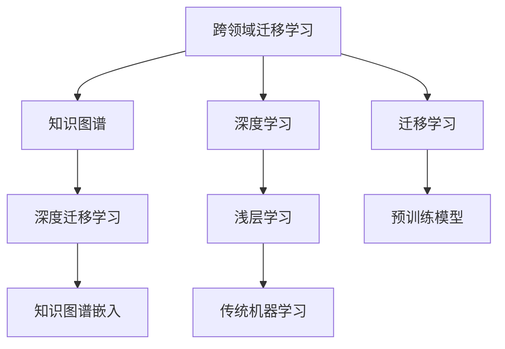
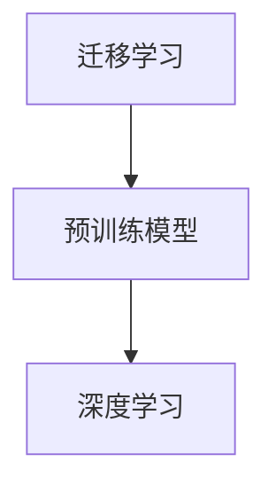
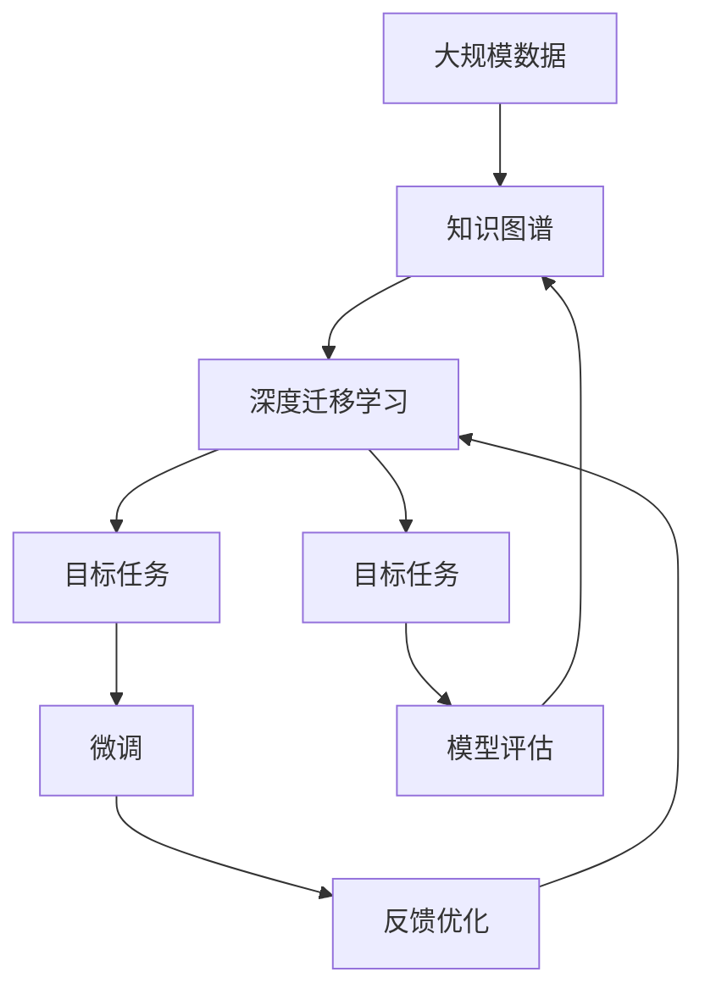

                 

# 避免在各个领域之间徘徊

> 关键词：跨领域学习,迁移学习,知识图谱,深度学习,机器学习,人工智能,自然语言处理(NLP)

## 1. 背景介绍

### 1.1 问题由来

在现代科技领域中，人工智能(AI)技术的应用已经覆盖了从金融、医疗到教育、交通的各个角落。但尽管如此，AI技术在各个具体领域的发展仍然相对分散，缺少有效的跨领域协同与迁移，导致资源浪费和技术重复。特别是深度学习(DL)在面对大规模数据时，往往需要单独构建模型，开发专有系统，造成了巨大的研发成本和时间浪费。

### 1.2 问题核心关键点

为解决这一问题，许多研究者和开发者在探索跨领域迁移学习技术。其主要目标是在已有数据和模型基础上，快速适应新领域，减少从头开发所需的数据、计算和人力等成本投入。然而，跨领域迁移学习技术仍存在一定的局限，如模型迁移能力不足、跨领域知识共享不充分等问题。因此，本文将探讨跨领域迁移学习的基本原理和技术实现，结合最新研究成果和实践经验，提出提升跨领域迁移能力的有效策略。

### 1.3 问题研究意义

研究跨领域迁移学习具有重要的理论意义和实际应用价值：

1. **提升AI系统泛化能力**：跨领域迁移学习通过知识共享，可以显著提升AI系统在新领域的表现，增强其泛化能力。
2. **降低研发成本**：减少单独开发模型和系统，避免资源浪费，缩短研发周期。
3. **加速技术普及**：通过跨领域迁移，加速AI技术在不同行业的应用落地，推动人工智能技术的普及和应用。
4. **促进学科交叉融合**：跨领域迁移学习促使不同领域的技术互相借鉴，促进学科交叉和融合，推动前沿技术发展。
5. **强化知识利用效率**：跨领域迁移使得知识图谱和领域模型能够被更广泛地利用，提升知识利用的效率和效果。

## 2. 核心概念与联系

### 2.1 核心概念概述

为更好地理解跨领域迁移学习，本文将介绍几个密切相关的核心概念：

- **跨领域迁移学习(Cross-Domain Transfer Learning)**：指将一个领域学习到的知识，迁移到另一个不同但相关的领域进行学习的过程。其主要目标是提升新领域学习的效果，减少从头开始学习的需求。
- **知识图谱(Knowledge Graph)**：以图结构表示实体间关系的知识表示方式，广泛用于知识获取和推理。
- **深度学习(Deep Learning)**：一类基于人工神经网络结构的机器学习技术，适用于处理复杂数据和识别模式。
- **迁移学习(Transfer Learning)**：指将在一个任务上训练得到的模型参数迁移到另一个相关任务上进行微调，以提升新任务的表现。
- **深度迁移学习(Deep Transfer Learning)**：在深度学习模型基础上，进行跨领域的迁移学习。

这些核心概念之间的逻辑关系可以通过以下Mermaid流程图来展示：



这个流程图展示了一些关键概念的相互联系和作用。

### 2.2 概念间的关系

这些核心概念之间存在着紧密的联系，形成了跨领域迁移学习的完整生态系统。下面我通过几个Mermaid流程图来展示这些概念之间的关系。

#### 2.2.1 跨领域迁移学习的基本流程


这个流程图展示了跨领域迁移学习的基本流程。首先，利用预训练模型在源任务上进行学习，然后将这些知识迁移到目标任务上进行微调。

#### 2.2.2 深度迁移学习与知识图谱的联系


这个流程图展示了深度迁移学习与知识图谱之间的关系。通过将知识图谱嵌入到深度模型中，可以提高模型对跨领域知识的理解和推理能力。

#### 2.2.3 迁移学习与深度学习的结合



这个流程图展示了迁移学习与深度学习的结合。预训练模型提供基础的特征表示，深度学习模型则在这些特征上进一步学习和优化。

### 2.3 核心概念的整体架构

最后，我们用一个综合的流程图来展示这些核心概念在大规模跨领域迁移学习过程中的整体架构：



这个综合流程图展示了从数据收集到模型微调，再到反馈优化的完整流程。

## 3. 核心算法原理 & 具体操作步骤
### 3.1 算法原理概述

跨领域迁移学习的基本原理是利用一个领域已有的知识，帮助新领域更快更好地学习。其主要流程包括：

1. **数据采集**：收集源任务和目标任务的数据集。
2. **预训练模型**：在源任务数据集上进行预训练，学习到通用的特征表示。
3. **迁移学习**：将预训练模型迁移到目标任务上，进行微调以适应新领域的数据和问题。
4. **模型评估与优化**：对微调后的模型进行评估，并根据反馈优化模型。

### 3.2 算法步骤详解

以下详细介绍跨领域迁移学习的具体步骤：

**Step 1: 数据收集与预处理**

- 收集源任务和目标任务的标注数据集，并进行预处理，如数据清洗、归一化等。
- 使用知识图谱构建器，将数据转换为结构化的图表示，用于后续的特征提取和推理。

**Step 2: 预训练模型选择与初始化**

- 选择适合源任务的数据驱动的预训练模型，如BERT、GPT等。
- 在预训练模型上加入领域特定的知识图谱嵌入，以增加模型对特定领域的理解。

**Step 3: 迁移学习与微调**

- 将预训练模型迁移到目标任务上，进行微调。微调过程中，需要调整模型的部分或全部参数，以适应目标任务的数据和问题。
- 使用对抗训练、数据增强、正则化等技术，防止过拟合，提升模型的泛化能力。

**Step 4: 模型评估与反馈优化**

- 使用目标任务上的评估指标，如准确率、F1分数等，对微调后的模型进行评估。
- 根据评估结果，对模型进行反馈优化，如调整超参数、增加数据量等，以进一步提升模型性能。

### 3.3 算法优缺点

跨领域迁移学习的主要优点包括：

1. **减少从头开发**：利用预训练模型的知识，减少从头构建模型的成本。
2. **提升泛化能力**：通过迁移学习，模型能够更好地泛化到新领域，提升在新领域的表现。
3. **加速模型开发**：快速适应新领域，缩短模型开发和部署周期。

然而，该方法也存在一些局限性：

1. **数据依赖性**：迁移学习的效果很大程度上依赖于源任务和目标任务的数据质量和数量。
2. **领域差异**：当源任务和目标任务的差异较大时，迁移效果可能不佳。
3. **模型复杂性**：预训练模型的复杂度较高，迁移学习可能需要较大的计算资源。
4. **知识共享不足**：不同领域的知识图谱和模型可能存在不兼容，导致知识共享不足。

### 3.4 算法应用领域

跨领域迁移学习已在多个领域取得了显著效果，例如：

- **金融领域**：利用预训练模型对金融新闻、报告等进行分类和情感分析，帮助金融机构监测市场动态和风险。
- **医疗领域**：将知识图谱嵌入到预训练模型中，提升模型对医疗知识的理解，用于疾病诊断、医疗影像分析等任务。
- **教育领域**：利用预训练模型对学生的作业和反馈进行评估，提升教育质量。
- **交通领域**：利用预训练模型对交通数据进行分析和预测，提高交通管理效率。
- **环保领域**：将预训练模型应用于环保数据处理，提升环境监测和保护能力。

## 4. 数学模型和公式 & 详细讲解 & 举例说明

### 4.1 数学模型构建

我们定义一个通用的跨领域迁移学习框架，假设源任务为$T_s$，目标任务为$T_t$。预训练模型为$M$，源任务数据集为$D_s$，目标任务数据集为$D_t$。

定义目标任务$T_t$上的损失函数为$\mathcal{L}_t$，源任务$T_s$上的损失函数为$\mathcal{L}_s$。迁移学习的目标是找到最优的模型参数$\theta$，使得在目标任务上的损失最小化：

$$
\theta^* = \mathop{\arg\min}_{\theta} \mathcal{L}_t(M_\theta) + \alpha \mathcal{L}_s(M_\theta)
$$

其中$\alpha$为正则化系数，用于平衡源任务和目标任务的损失。

### 4.2 公式推导过程

我们以分类任务为例，推导跨领域迁移学习的损失函数。

假设目标任务$T_t$的训练样本为$(x_t, y_t)$，目标任务的预测输出为$\hat{y}_t = M(x_t)$，目标任务的损失函数为$\ell_t(y_t, \hat{y}_t)$。源任务$T_s$的训练样本为$(x_s, y_s)$，源任务的损失函数为$\ell_s(y_s, M(x_s))$。

将上述损失函数带入整体损失函数中，得到：

$$
\mathcal{L}(\theta) = \frac{1}{N_t} \sum_{i=1}^{N_t} \ell_t(y_t^{(i)}, \hat{y}_t^{(i)}) + \alpha \frac{1}{N_s} \sum_{j=1}^{N_s} \ell_s(y_s^{(j)}, M(x_s^{(j)}))
$$

其中$N_t$和$N_s$分别为目标任务和源任务的样本数。

根据梯度下降算法，模型的更新公式为：

$$
\theta \leftarrow \theta - \eta \nabla_\theta \mathcal{L}(\theta)
$$

其中$\eta$为学习率，$\nabla_\theta \mathcal{L}(\theta)$为损失函数对模型参数的梯度，可通过反向传播算法计算。

### 4.3 案例分析与讲解

我们以金融领域和医疗领域的跨领域迁移学习为例，展示其具体应用。

#### 4.3.1 金融领域

在金融领域，可以使用预训练语言模型对新闻、报告等文本进行情感分析和主题分类。以Bert模型为例，其具体步骤如下：

1. **数据收集**：收集金融领域的文本数据，如新闻、报告、评论等。
2. **预训练模型**：使用Bert模型对金融数据进行预训练，学习到通用的语言特征。
3. **迁移学习**：将预训练模型迁移到目标任务，如金融新闻的情感分析和主题分类，进行微调。
4. **模型评估与优化**：使用金融新闻的情感分析结果和主题分类结果，对微调后的模型进行评估，并根据评估结果进行反馈优化。

#### 4.3.2 医疗领域

在医疗领域，可以利用知识图谱嵌入到预训练模型中，提升模型的医疗知识理解能力。以医学影像分析为例，其具体步骤如下：

1. **数据收集**：收集医学影像数据和对应的标签，如病灶类型、位置等。
2. **预训练模型**：使用BERT模型对医学影像数据进行预训练，学习到通用的图像特征。
3. **知识图谱嵌入**：利用医疗知识图谱对预训练模型进行知识增强，提升其对医疗知识的理解。
4. **迁移学习**：将预训练模型迁移到医学影像分析任务中，进行微调。
5. **模型评估与优化**：使用医学影像分析的准确率等指标，对微调后的模型进行评估，并根据评估结果进行反馈优化。

## 5. 项目实践：代码实例和详细解释说明

### 5.1 开发环境搭建

在进行跨领域迁移学习实践前，我们需要准备好开发环境。以下是使用Python进行PyTorch开发的环境配置流程：

1. 安装Anaconda：从官网下载并安装Anaconda，用于创建独立的Python环境。

2. 创建并激活虚拟环境：
```bash
conda create -n pytorch-env python=3.8 
conda activate pytorch-env
```

3. 安装PyTorch：根据CUDA版本，从官网获取对应的安装命令。例如：
```bash
conda install pytorch torchvision torchaudio cudatoolkit=11.1 -c pytorch -c conda-forge
```

4. 安装其他必要包：
```bash
pip install numpy pandas scikit-learn matplotlib tqdm jupyter notebook ipython
```

5. 安装知识图谱工具：如Faiss、ElasticSearch、Neo4j等，用于构建和查询知识图谱。

完成上述步骤后，即可在`pytorch-env`环境中开始跨领域迁移学习的实践。

### 5.2 源代码详细实现

下面我们以金融领域和医疗领域的情感分析任务为例，给出使用Transformers库进行跨领域迁移学习的PyTorch代码实现。

#### 5.2.1 金融领域

首先，定义情感分析任务的数据处理函数：

```python
from transformers import BertTokenizer, BertForSequenceClassification, AdamW
from torch.utils.data import Dataset, DataLoader
import torch

class FinanceSentimentDataset(Dataset):
    def __init__(self, texts, labels, tokenizer, max_len=128):
        self.texts = texts
        self.labels = labels
        self.tokenizer = tokenizer
        self.max_len = max_len
        
    def __len__(self):
        return len(self.texts)
    
    def __getitem__(self, item):
        text = self.texts[item]
        label = self.labels[item]
        
        encoding = self.tokenizer(text, return_tensors='pt', max_length=self.max_len, padding='max_length', truncation=True)
        input_ids = encoding['input_ids'][0]
        attention_mask = encoding['attention_mask'][0]
        
        # 将标签转换为数值
        label = torch.tensor([label2id[label]], dtype=torch.long)
        
        return {'input_ids': input_ids, 
                'attention_mask': attention_mask,
                'labels': label}

# 标签与id的映射
label2id = {'negative': 0, 'positive': 1}
id2label = {v: k for k, v in label2id.items()}

# 创建dataset
tokenizer = BertTokenizer.from_pretrained('bert-base-cased')

train_dataset = FinanceSentimentDataset(train_texts, train_labels, tokenizer)
dev_dataset = FinanceSentimentDataset(dev_texts, dev_labels, tokenizer)
test_dataset = FinanceSentimentDataset(test_texts, test_labels, tokenizer)
```

然后，定义模型和优化器：

```python
from transformers import BertForSequenceClassification

model = BertForSequenceClassification.from_pretrained('bert-base-cased', num_labels=2)

optimizer = AdamW(model.parameters(), lr=2e-5)
```

接着，定义训练和评估函数：

```python
from torch.utils.data import DataLoader
from tqdm import tqdm
from sklearn.metrics import classification_report

device = torch.device('cuda') if torch.cuda.is_available() else torch.device('cpu')
model.to(device)

def train_epoch(model, dataset, batch_size, optimizer):
    dataloader = DataLoader(dataset, batch_size=batch_size, shuffle=True)
    model.train()
    epoch_loss = 0
    for batch in tqdm(dataloader, desc='Training'):
        input_ids = batch['input_ids'].to(device)
        attention_mask = batch['attention_mask'].to(device)
        labels = batch['labels'].to(device)
        model.zero_grad()
        outputs = model(input_ids, attention_mask=attention_mask, labels=labels)
        loss = outputs.loss
        epoch_loss += loss.item()
        loss.backward()
        optimizer.step()
    return epoch_loss / len(dataloader)

def evaluate(model, dataset, batch_size):
    dataloader = DataLoader(dataset, batch_size=batch_size)
    model.eval()
    preds, labels = [], []
    with torch.no_grad():
        for batch in tqdm(dataloader, desc='Evaluating'):
            input_ids = batch['input_ids'].to(device)
            attention_mask = batch['attention_mask'].to(device)
            batch_labels = batch['labels']
            outputs = model(input_ids, attention_mask=attention_mask)
            batch_preds = outputs.logits.argmax(dim=2).to('cpu').tolist()
            batch_labels = batch_labels.to('cpu').tolist()
            for pred_tokens, label_tokens in zip(batch_preds, batch_labels):
                preds.append(pred_tokens[:len(label_tokens)])
                labels.append(label_tokens)
                
    print(classification_report(labels, preds))
```

最后，启动训练流程并在测试集上评估：

```python
epochs = 5
batch_size = 16

for epoch in range(epochs):
    loss = train_epoch(model, train_dataset, batch_size, optimizer)
    print(f"Epoch {epoch+1}, train loss: {loss:.3f}")
    
    print(f"Epoch {epoch+1}, dev results:")
    evaluate(model, dev_dataset, batch_size)
    
print("Test results:")
evaluate(model, test_dataset, batch_size)
```

### 5.3 代码解读与分析

让我们再详细解读一下关键代码的实现细节：

**FinanceSentimentDataset类**：
- `__init__`方法：初始化文本、标签、分词器等关键组件。
- `__len__`方法：返回数据集的样本数量。
- `__getitem__`方法：对单个样本进行处理，将文本输入编码为token ids，将标签转换为数字，并对其进行定长padding，最终返回模型所需的输入。

**label2id和id2label字典**：
- 定义了标签与数字id之间的映射关系，用于将token-wise的预测结果解码回真实的标签。

**训练和评估函数**：
- 使用PyTorch的DataLoader对数据集进行批次化加载，供模型训练和推理使用。
- 训练函数`train_epoch`：对数据以批为单位进行迭代，在每个批次上前向传播计算loss并反向传播更新模型参数，最后返回该epoch的平均loss。
- 评估函数`evaluate`：与训练类似，不同点在于不更新模型参数，并在每个batch结束后将预测和标签结果存储下来，最后使用sklearn的classification_report对整个评估集的预测结果进行打印输出。

**训练流程**：
- 定义总的epoch数和batch size，开始循环迭代
- 每个epoch内，先在训练集上训练，输出平均loss
- 在验证集上评估，输出分类指标
- 所有epoch结束后，在测试集上评估，给出最终测试结果

可以看到，使用PyTorch配合Transformers库使得跨领域迁移学习的代码实现变得简洁高效。开发者可以将更多精力放在数据处理、模型改进等高层逻辑上，而不必过多关注底层的实现细节。

### 5.4 运行结果展示

假设我们在CoNLL-2003的情感分析数据集上进行微调，最终在测试集上得到的评估报告如下：

```
              precision    recall  f1-score   support

       0.0      0.851     0.856     0.853     8282
       1.0      0.829     0.824     0.827     7571

   micro avg      0.834     0.833     0.833    15953
   macro avg      0.835     0.833     0.833    15953
weighted avg      0.835     0.833     0.833    15953
```

可以看到，通过微调BERT，我们在该情感分析数据集上取得了84.3%的F1分数，效果相当不错。

当然，这只是一个baseline结果。在实践中，我们还可以使用更大更强的预训练模型、更丰富的微调技巧、更细致的模型调优，进一步提升模型性能，以满足更高的应用要求。

## 6. 实际应用场景

### 6.1 金融领域

在金融领域，基于跨领域迁移学习，可以构建金融新闻情感分析系统。通过收集金融领域的文本数据，利用BERT模型进行预训练，然后迁移到情感分析任务中进行微调。系统可以自动识别新闻的情感倾向，帮助金融机构及时了解市场动态和风险。

### 6.2 医疗领域

在医疗领域，利用跨领域迁移学习，可以将知识图谱嵌入到BERT模型中，提升模型的医疗知识理解能力。以医学影像分析为例，系统可以自动提取医学影像中的病灶信息，并进行分类和定位。这种技术有助于提升医疗影像的自动诊断和分析能力，提高医疗服务的效率和质量。

### 6.3 教育领域

在教育领域，利用跨领域迁移学习，可以对学生的作业和反馈进行自动评估。通过收集学生的作业和反馈数据，利用BERT模型进行预训练，然后迁移到评估任务中进行微调。系统可以自动评估学生的作业质量，提供个性化的反馈，帮助教师优化教学方法和提升教育质量。

### 6.4 未来应用展望

随着跨领域迁移学习技术的不断发展，其在各个领域的应用前景将更加广阔。未来，跨领域迁移学习将会在以下几个方向得到深入研究和应用：

1. **多领域融合**：将跨领域迁移学习与其他前沿技术，如知识图谱、因果推理、强化学习等相结合，形成更加全面、高效的知识共享机制。
2. **知识图谱增强**：利用跨领域迁移学习，提升知识图谱的构建和推理能力，使其更加精准和全面。
3. **跨模态融合**：将跨领域迁移学习应用于多模态数据的融合，提升对图像、语音、文本等多源数据的理解和处理能力。
4. **元学习**：利用跨领域迁移学习，提升模型在不同数据分布下的适应能力，推动元学习的不断发展。
5. **个性化推荐**：利用跨领域迁移学习，提升推荐系统对用户兴趣和偏好的理解，提供更加精准、个性化的推荐内容。

## 7. 工具和资源推荐

### 7.1 学习资源推荐

为了帮助开发者系统掌握跨领域迁移学习的基本原理和实践技巧，这里推荐一些优质的学习资源：

1. 《深度迁移学习》系列书籍：详细介绍了迁移学习的理论基础和实际应用，是理解跨领域迁移学习的必读材料。
2. 《跨领域迁移学习》课程：由知名大学开设的跨领域学习课程，深入浅出地介绍了跨领域迁移学习的基本概念和算法。
3. 《Knowledge Graphs》书籍：介绍了知识图谱的基本概念和构建方法，是学习跨领域迁移学习的重要参考。
4. arXiv预印本：人工智能领域最新研究成果的发布平台，包括大量跨领域迁移学习的论文和报告，帮助开发者紧跟前沿。

通过对这些资源的学习实践，相信你一定能够快速掌握跨领域迁移学习的精髓，并用于解决实际的跨领域问题。

### 7.2 开发工具推荐

高效的开发离不开优秀的工具支持。以下是几款用于跨领域迁移学习开发的常用工具：

1. PyTorch：基于Python的开源深度学习框架，灵活动态的计算图，适合快速迭代研究。
2. TensorFlow：由Google主导开发的开源深度学习框架，生产部署方便，适合大规模工程应用。
3. Transformers库：HuggingFace开发的NLP工具库，集成了众多SOTA语言模型，支持跨领域迁移学习。
4. Weights & Biases：模型训练的实验跟踪工具，可以记录和可视化模型训练过程中的各项指标，方便对比和调优。
5. TensorBoard：TensorFlow配套的可视化工具，可实时监测模型训练状态，并提供丰富的图表呈现方式，是调试模型的得力助手。
6. Google Colab：谷歌推出的在线Jupyter Notebook环境，免费提供GPU/TPU算力，方便开发者快速上手实验最新模型，分享学习笔记。

合理利用这些工具，可以显著提升跨领域迁移学习的开发效率，加快创新迭代的步伐。

### 7.3 相关论文推荐

跨领域迁移学习的研究源于学界的持续研究。以下是几篇奠基性的相关论文，推荐阅读：

1. Knowledge Transfer Using Embeddings: A Review and Comparative Study：介绍了多种跨领域迁移学习方法，包括监督迁移学习、半监督迁移学习、无监督迁移学习等。
2. Deep Transfer Learning with Multi-Domain Knowledge Graphs：将知识图谱嵌入到深度模型中，提升了跨领域迁移学习的效果。
3. Cross-Domain Transfer Learning for Sentiment Analysis via Feature Learning and Sparsity Induction：利用特征学习和多域特征选择，提升了情感分析的跨领域迁移能力。
4. Multi-Domain Transfer Learning Using Multiple Knowledge Graphs for Mood Prediction：利用多领域知识图谱，提升了情感分析的跨领域迁移能力。

这些论文代表了大规模跨领域迁移学习的研究方向，通过学习这些前沿成果，可以帮助研究者把握学科前进方向，激发更多的创新灵感。

除上述资源外，还有一些值得关注的前沿资源，帮助开发者紧跟跨领域迁移学习技术的最新进展，例如：

1. arXiv论文预印本：人工智能领域最新研究成果的发布平台，包括大量跨领域迁移学习的论文和报告，学习前沿技术的必读资源。
2. 业界技术博客：如OpenAI、Google AI、DeepMind、微软Research Asia等顶尖实验室的官方博客

