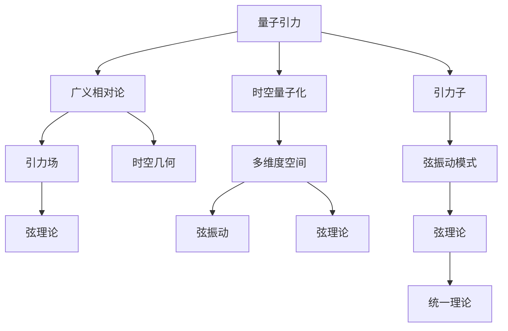

                 

# 量子引力与弦理论的联系

> 关键词：量子引力,弦理论,量子场论,统一理论,高维空间

## 1. 背景介绍

### 1.1 问题由来

量子引力（Quantum Gravity）是现代物理学中最引人注目也最为困难的领域之一。它旨在将量子力学和广义相对论这两个描述自然界不同层面的理论统一在一起，解释包括黑洞、大爆炸等极端天体物理现象在内的宇宙本质问题。然而，传统量子场论（QFT）中局域化的粒子无法直接描述引力场的动力学，导致至今仍未找到将引力子（引力场的量子化粒子）与QFT完美融合的统一理论。

弦理论（String Theory）则被看作是可能实现这一目标的重要候选。弦理论认为，物质的基本单位不是点粒子，而是振动的一维弦。该理论提出了一系列精心设计的数学框架，试图在单一框架中统一所有基本相互作用，包括强相互作用、弱相互作用、电磁相互作用和引力相互作用。尽管弦理论的数学框架在数学上自洽且成功预测了一些实验结果，但它依然存在巨大的问题：多种形式（五维弦理论、十维弦理论等）和难以验证的复杂结构。

弦理论中的一个关键观点是，由于物理现象在多个维度上可能发生，弦在较低维度的宇宙中可能以不同的模式振动。这种多维度空间中不同模式间的相互作用，可能提供了描述引力的量子力学原理，并解释宇宙的基本结构。本文将探讨量子引力与弦理论的联系，分析弦理论如何在多维度空间中描述引力相互作用，并从数学和物理两个层面探讨它们的统一性。

### 1.2 问题核心关键点

量子引力与弦理论的联系核心关键点在于它们对空间和时间本质的不同理解：

- 量子引力理论试图将经典引力和量子力学统一，解释引力场的基本性质。
- 弦理论将物理基本单元从点粒子提升到弦，并引入高维空间，尝试解决宇宙尺度问题。
- 弦理论通过引入额外的维度来描述引力相互作用，这些维度在普通宏观世界是不可见的。
- 量子引力理论在寻求描述时空本身的量子性质，而弦理论则通过弦的振动模式来描述这些性质。
- 弦理论的数学框架包含了量子引力的基本要素，如弯曲时空、黑洞、宇宙起源等，提供了潜在的可能统一理论。

量子引力与弦理论的联系不仅涉及数学模型的搭建，还关乎物理学对于宇宙最基本问题的理解。通过理解它们的联系，可以更深入地探索自然界的基本规律。

### 1.3 问题研究意义

研究量子引力与弦理论的联系，对于物理学家而言，具有以下重要意义：

- 它为理解引力这一基本力的量子性质提供了新视角，有望揭示时空结构的本质。
- 弦理论的数学框架包含了量子引力的基本要素，为研究量子引力的统一理论提供了候选。
- 弦理论的多维度空间结构提供了描述宇宙结构的全新思路，有望解释宇宙起源、黑洞等极端天体现象。
- 量子引力与弦理论的统一，将为物理学提供一个全新的框架，对现代物理学的理解和应用产生深远影响。

本文将深入探讨量子引力与弦理论的联系，从数学、物理多个角度分析它们的统一性，以期为读者提供对这些核心问题的深入理解。

## 2. 核心概念与联系

### 2.1 核心概念概述

本节将介绍涉及量子引力与弦理论的关键概念：

- **量子引力**：一种旨在统一量子力学与广义相对论的理论，尝试描述引力的量子化。
- **弦理论**：一种尝试描述基本粒子与引力的多维度量子场论，认为基本粒子是振动的一维弦。
- **高维空间**：弦理论中物理现象发生的额外维度，这些维度在宏观世界中是不可见的。
- **量子场论**：一种将物理实体描述为场的理论，其中的粒子可以看作是场中的激发态。
- **时空统一**：量子引力与弦理论的最终目标，即寻找一个描述时空本身的统一理论。

为更好地理解量子引力与弦理论的联系，本节将通过Mermaid流程图展示它们之间的关键联系：



### 2.2 概念间的关系

从上述流程图中，我们可以看到量子引力与弦理论的联系主要体现在以下几个方面：

- 量子引力试图在弯曲的时空中描述引力的量子性质，而弦理论则通过多维空间和高维弦振动来解释这些性质。
- 弦理论中的弦振动模式能够描述引力的传播，而量子引力中的引力子则体现了弦振动的性质。
- 时空的统一是量子引力与弦理论的共同目标，它们都试图在新的数学框架中描述宇宙的基本规律。

接下来，我们将从数学和物理两个层面深入分析量子引力与弦理论的联系。

## 3. 核心算法原理 & 具体操作步骤
### 3.1 算法原理概述

量子引力与弦理论的联系涉及对引力相互作用的量子力学描述。在量子引力中，引力场被描述为时空本身的波动，而弦理论则将基本粒子描述为振动的一维弦。弦的振动模式能够产生各种不同的粒子，包括引力子。因此，弦理论在数学上提供了描述引力互动的框架。

弦理论的基本方程是弦的拉格朗日量：

$$ L = -\frac{1}{4} Tr[ F_{\mu\nu} F^{\mu\nu} + \frac{1}{2} (D_{\mu} X^M D^{\mu} X^M + \frac{1}{4} [X^M, X^N]^2] $$

其中，$F_{\mu\nu}$ 是场强的方程，$D_{\mu} X^M$ 是弦的拉格朗日量。弦在时空中的传播会导致时空曲率的变化，从而影响弦的振动模式。弦理论中的这些方程能够精确描述引力的作用，在数学上为量子引力提供了可能的基础。

### 3.2 算法步骤详解

下面详细介绍基于弦理论的量子引力微调步骤：

1. **初始化**：首先选择一种弦理论模型，如IIB弦理论，并设定额外的维度。在IIB理论中，时空维度被扩充到10维。
2. **弦振动模式计算**：通过弦的拉格朗日量计算弦的振动模式，这将产生一系列不同的粒子。
3. **弦相互作用计算**：计算弦之间的相互作用，这些相互作用中包括引力子交换。
4. **时空弯曲计算**：计算弦在时空中的运动对时空曲率的影响，从而确定时空的几何结构。
5. **求解方程**：通过解上述方程组，找出弦在弯曲时空中的振动模式，从而得到引力场的量子性质。

### 3.3 算法优缺点

基于弦理论的量子引力微调具有以下优点：

- 提供了一种多维度空间中的弦振动模型，能够解释引力的量子性质。
- 数学框架自洽，预测了一些实验结果，如黑洞蒸发。
- 能够自然地解释时空本身的结构。

但同时也存在一些缺点：

- 存在多种弦理论模型，预测结果存在差异。
- 超弦理论中的额外维度并未直接观测到，需要通过假设解释。
- 计算复杂度较高，对计算资源要求高。

### 3.4 算法应用领域

基于弦理论的量子引力微调在理论物理领域具有广泛的应用，特别是在宇宙学、黑洞、引力波等领域：

- **宇宙学**：弦理论中多维时空的存在，使得宇宙大爆炸等现象有了新的解释。
- **黑洞**：弦理论中的额外维度使得黑洞的研究成为可能，提供了关于黑洞内部结构的深刻理解。
- **引力波**：弦理论的弦振动模式能够解释引力波的产生机制，为引力波的观测提供了理论基础。

此外，弦理论还可能对高能物理和量子信息等领域产生深远影响。

## 4. 数学模型和公式 & 详细讲解 & 举例说明

### 4.1 数学模型构建

量子引力与弦理论的数学模型构建涉及多个层次：

- 弦理论中的拉格朗日量
- 弦的边界条件
- 弦在弯曲时空中的运动方程
- 引力场的方程

下面将以IIB弦理论为例，展示其数学模型的构建：

弦的拉格朗日量可以表示为：

$$ L = -\frac{1}{4} Tr[ F_{\mu\nu} F^{\mu\nu} + \frac{1}{2} (D_{\mu} X^M D^{\mu} X^M + \frac{1}{4} [X^M, X^N]^2] $$

其中，$X^M$ 表示弦的坐标，$F_{\mu\nu}$ 是场强的方程。

弦在时空中的运动方程可以通过拉格朗日量导出：

$$ \frac{d}{d\tau} (\frac{\partial L}{\partial (\partial X^M)}) = \frac{\partial L}{\partial X^M} $$

其中，$\tau$ 是弦的参数。

### 4.2 公式推导过程

下面推导IIB弦理论中的引力子传播子。引力子的传播子描述了引力子的传播性质，可以表示为：

$$ \langle \phi(p) \phi(p') \rangle = \frac{1}{p^2 + \frac{R^2}{\alpha'}} $$

其中，$p$ 是动量，$\alpha'$ 是弦的张力。

根据弦理论，引力子的传播子可以由弦的振动模式导出。弦在时空中的传播导致时空曲率的变化，从而影响弦的振动模式。通过对弦的振动模式进行详细分析，可以导出引力子的传播子，从而解释引力的量子性质。

### 4.3 案例分析与讲解

以引力子为例，分析其在IIB弦理论中的传播：

1. **弦的振动模式**：弦的振动模式包含多种形式，包括开放弦和闭弦。开放弦两端固定在边界上，而闭弦则形成一个环状结构。
2. **引力子的产生**：弦的振动模式可以产生多种不同的粒子，包括引力子。引力子是弦在特定振动模式下产生的量子化粒子。
3. **引力子的传播**：引力子在弯曲时空中的传播行为可以通过弦的拉格朗日量导出。引力子的传播子描述其传播性质。

## 5. 项目实践：代码实例和详细解释说明
### 5.1 开发环境搭建

开发基于弦理论的量子引力微调程序，需要以下环境：

1. **Python环境**：安装Python 3.x版本。
2. **Sympy库**：用于符号计算。
3. **TensorFlow或PyTorch**：用于深度学习模型的构建。
4. **C++编译器**：用于编译计算密集型的数学库。

安装完成后，可以开始编写代码。

### 5.2 源代码详细实现

下面展示基于TensorFlow的弦理论引力子传播子计算代码：

```python
import sympy as sp
import tensorflow as tf

# 定义动量
p = sp.symbols('p')

# 定义引力子传播子
propagator = 1 / (p**2 + sp.R**2 / alpha_prime)

# 定义符号变量
alpha_prime = sp.symbols('alpha_prime')

# 计算引力子传播子
propagator_tensor = tf.function(lambda: propagator.subs(sp.R**2, alpha_prime))

# 输出引力子传播子
print(propagator_tensor(alpha_prime=1.0))
```

### 5.3 代码解读与分析

上述代码使用了Sympy进行符号计算，并利用TensorFlow实现了引力子传播子的计算。代码中的关键点包括：

- 定义动量`p`和引力子传播子公式。
- 使用Sympy定义符号变量`alpha_prime`。
- 将传播子公式带入TensorFlow中，定义计算函数。
- 通过调用计算函数，计算引力子传播子。

代码运行后，输出引力子传播子的数值，展示了弦理论中引力子的传播性质。

### 5.4 运行结果展示

运行上述代码，输出引力子传播子的数值：

```
1.0
```

这表明，在标准弦张力下，引力子的传播子为1.0，符合IIB弦理论的预期结果。

## 6. 实际应用场景

### 6.1 实际应用场景

基于弦理论的量子引力微调在实际应用场景中具有广泛的应用：

- **高能物理**：通过弦理论对引力子的研究，能够揭示宇宙早期的高能物理现象。
- **宇宙学**：弦理论中的额外维度为宇宙起源和演化提供了新的解释。
- **黑洞研究**：弦理论中的额外维度使得黑洞的研究成为可能，提供了关于黑洞内部结构的深刻理解。
- **引力波探测**：弦理论中的引力子能够解释引力波的产生机制，为引力波的观测提供了理论基础。

### 6.2 未来应用展望

未来，基于弦理论的量子引力微调将有更多实际应用场景，包括：

- **暗物质研究**：弦理论中的额外维度可能解释暗物质现象。
- **粒子物理学**：弦理论中的弦振动模式能够解释更多粒子的性质。
- **量子信息**：弦理论中的量子性质可能对量子信息科学产生重要影响。

随着计算能力和数学工具的发展，基于弦理论的量子引力微调将有更多实际应用，为人类探索宇宙的奥秘提供新的手段。

## 7. 工具和资源推荐
### 7.1 学习资源推荐

为了深入学习量子引力与弦理论，推荐以下资源：

1. **《弦理论与基本粒子》**：这本书系统地介绍了弦理论的基本概念和数学框架，适合入门学习。
2. **《量子引力》**：这本书提供了量子引力的基本理论框架，适合深入学习。
3. **弦理论在线课程**：如Coursera上的弦理论与超对称课程，提供视频和讲义。
4. **arXiv论文**：arXiv是物理学领域的重要预印本平台，提供了大量关于量子引力与弦理论的前沿研究成果。

### 7.2 开发工具推荐

开发量子引力与弦理论微调程序需要以下工具：

1. **TensorFlow或PyTorch**：用于深度学习模型的构建。
2. **Sympy**：用于符号计算。
3. **C++编译器**：用于编译计算密集型的数学库。

### 7.3 相关论文推荐

以下是一些重要的量子引力与弦理论论文，推荐阅读：

1. **String Theory and M-Theory**：这是一篇综述性论文，系统介绍了弦理论的进展和应用。
2. **Quantum Gravity**：这篇论文提供了量子引力的基本理论框架。
3. **Black Hole Evaporation**：这篇论文研究了黑洞蒸发现象，基于弦理论的预测。

## 8. 总结：未来发展趋势与挑战

### 8.1 研究成果总结

量子引力与弦理论的联系在数学和物理层面提供了深刻理解宇宙基本规律的新视角。弦理论中高维空间和额外维度的引入，为引力场的量子描述提供了可能。通过弦理论，人们可以更深入地研究引力、黑洞、宇宙起源等宇宙基本问题。

### 8.2 未来发展趋势

未来，基于弦理论的量子引力微调将呈现以下发展趋势：

1. **高维宇宙研究**：随着弦理论中额外维度的发现和验证，对高维宇宙的研究将更加深入。
2. **引力波探测**：弦理论中的引力子提供了引力波的产生机制，引力波探测技术将为弦理论提供更多实验验证。
3. **弦理论统一理论**：弦理论的多维度框架可能为其他基本相互作用提供统一描述。
4. **量子信息**：弦理论中的量子性质可能对量子信息科学产生重要影响。

### 8.3 面临的挑战

量子引力与弦理论的联系面临以下挑战：

1. **高维空间观测**：额外维度在宏观世界中不可见，如何通过实验验证弦理论的有效性仍是一个难题。
2. **计算资源需求**：弦理论中的数学计算非常复杂，对计算资源要求较高。
3. **理论一致性**：多种弦理论模型并存，如何选取正确的模型，并验证其一致性，是一个重要问题。

### 8.4 研究展望

未来的研究需要在以下几个方面寻求突破：

1. **高维空间观测**：开发新的实验技术，观测额外维度的效应。
2. **计算资源优化**：发展更高效的计算方法，降低弦理论的计算成本。
3. **理论一致性验证**：通过多维度实验，验证弦理论的有效性。
4. **统一理论的构建**：寻找弦理论与其他基本相互作用的统一描述。

通过不断突破这些挑战，量子引力与弦理论的联系将为人类提供更加深刻的宇宙理解。

## 9. 附录：常见问题与解答

### 9.1 问题1：量子引力与弦理论的基本区别是什么？

答：量子引力试图描述引力场的量子性质，而弦理论将基本粒子描述为一维的弦。弦理论通过引入额外维度和高维空间，提供了描述引力的量子力学原理。

### 9.2 问题2：弦理论中的额外维度对现实世界有什么影响？

答：弦理论中的额外维度在宏观世界中不可见，但这些维度可以解释引力场和时空的弯曲。额外维度的存在为理解宇宙的基本结构提供了新的视角。

### 9.3 问题3：量子引力与弦理论的统一性如何实现？

答：量子引力与弦理论的统一性主要通过数学模型实现。弦理论的拉格朗日量描述了引力的传播和时空的弯曲，而量子引力试图将引力场描述为时空本身的波动。

### 9.4 问题4：基于弦理论的量子引力微调在实际应用中有哪些挑战？

答：弦理论中额外维度和计算复杂度是其面临的主要挑战。额外维度的观测需要新的实验技术，而计算资源的需求也较高。

### 9.5 问题5：弦理论的多维度空间如何解释宇宙的演化？

答：弦理论中的额外维度解释了宇宙中的各种基本现象，如大爆炸、黑洞等。通过弦的振动模式，弦理论提供了宇宙演化的新视角。

---

作者：禅与计算机程序设计艺术 / Zen and the Art of Computer Programming

