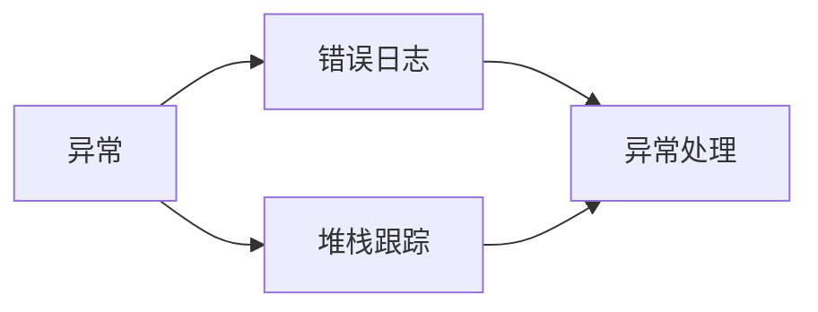

                 

# 错误处理机制的基本概念

在软件开发中，错误处理机制是确保程序稳定性和可靠性的关键。本文将从基本概念、核心算法原理、操作步骤、应用领域等多个角度全面介绍错误处理机制，并结合具体实例和案例进行详细讲解。

## 1. 背景介绍

### 1.1 问题由来
在现代软件系统中，错误处理机制扮演着至关重要的角色。随着软件系统规模和复杂度的不断提升，错误事件也随之增加，轻则导致系统功能异常，重则引发系统崩溃。错误处理机制能够有效地捕捉、分析和处理错误，保护系统正常运行，提高用户体验。

### 1.2 问题核心关键点
错误处理机制的核心在于如何高效、精准地检测、定位和修复错误。常见的错误处理策略包括：
- 错误检测：通过监控系统状态，及时发现异常。
- 错误定位：分析错误日志和堆栈信息，准确定位问题所在。
- 错误修复：采取相应措施，修复错误，恢复正常运行。
- 错误预防：通过优化代码和系统架构，预防错误发生。

### 1.3 问题研究意义
错误处理机制对于提升软件系统的稳定性和可靠性具有重要意义：
- 减少系统故障：及时捕获和修复错误，避免系统崩溃。
- 增强用户信任：通过友好的错误信息，提高用户对系统的信任度。
- 降低运维成本：快速定位和修复错误，减少人力物力投入。
- 提高开发效率：系统化错误处理机制，提升开发者效率。

## 2. 核心概念与联系

### 2.1 核心概念概述
错误处理机制涉及到多个核心概念，包括：
- 异常（Exception）：程序运行过程中出现的不可预料事件。
- 错误日志（Log）：记录错误事件的详细信息。
- 堆栈跟踪（Stack Trace）：展示错误发生时的程序调用路径。
- 异常处理（Error Handling）：对异常事件进行捕获、定位和处理的过程。

这些概念之间存在紧密联系，形成一个完整的错误处理流程。

### 2.2 概念间的关系
通过以下Mermaid流程图，可以清晰展示错误处理机制中各概念之间的关系：



这个流程图展示了异常、错误日志、堆栈跟踪和异常处理之间的关系。异常发生后，系统会记录错误日志和堆栈跟踪，然后通过异常处理机制进行捕获和修复。

## 3. 核心算法原理 & 具体操作步骤

### 3.1 算法原理概述
错误处理机制的算法原理基于异常捕获和处理。系统在运行过程中，会定期监控状态，一旦检测到异常，立即触发异常处理流程。异常处理流程包括以下几个关键步骤：

1. 异常检测：通过监控系统状态，识别异常事件。
2. 异常定位：通过分析错误日志和堆栈信息，准确定位问题所在。
3. 异常处理：采取相应措施，修复错误，恢复正常运行。
4. 异常预防：优化代码和系统架构，预防错误发生。

### 3.2 算法步骤详解
以Python中的异常处理为例，展示具体算法步骤：

1. **异常检测**：通过try-catch语句捕获异常。
2. **异常定位**：通过print语句输出错误日志和堆栈信息。
3. **异常处理**：根据异常类型，采取相应措施，如记录日志、发送报警等。
4. **异常预防**：通过代码审查和测试，优化系统设计，预防错误发生。

### 3.3 算法优缺点
异常处理机制的优点包括：
- 及时捕获异常：通过异常检测，及时发现系统问题。
- 信息记录详尽：通过错误日志和堆栈信息，能够准确定位问题。
- 处理机制灵活：根据异常类型，采取相应措施，提高处理效率。

其缺点在于：
- 处理成本较高：异常处理需要系统监控和日志分析，资源消耗较大。
- 代码冗余较多：需要编写大量的异常处理代码，增加了开发工作量。
- 错误信息不统一：不同开发者对异常处理的标准不同，导致错误信息不统一。

### 3.4 算法应用领域
错误处理机制在软件开发、系统维护、数据处理等多个领域都有广泛应用。例如：
- 数据库系统：通过异常检测和处理，确保数据一致性和完整性。
- 网络应用：通过异常处理机制，提高网络通信的稳定性。
- 移动应用：通过错误日志和堆栈跟踪，优化用户体验。

## 4. 数学模型和公式 & 详细讲解

### 4.1 数学模型构建
错误处理机制的数学模型主要涉及异常检测、异常定位和异常处理等关键步骤。以Python为例，假设系统检测到异常 $E$，其数学模型为：

$$
M(E) = \begin{cases}
0 & \text{无异常} \\
1 & \text{有异常}
\end{cases}
$$

其中 $M(E)$ 为异常检测函数，用于判断是否存在异常事件。

### 4.2 公式推导过程
异常检测函数的推导过程如下：
1. **异常检测**：通过监控系统状态，识别异常事件。假设系统状态为 $S$，异常状态为 $E$，异常检测函数可以表示为：
   $$
   M(E) = \begin{cases}
   1 & \text{检测到异常事件} \\
   0 & \text{未检测到异常事件}
   \end{cases}
   $$

2. **异常定位**：通过分析错误日志和堆栈信息，准确定位问题所在。假设错误日志为 $L$，堆栈信息为 $T$，异常定位函数可以表示为：
   $$
   P(E|L,T) = \begin{cases}
   1 & \text{问题定位准确} \\
   0 & \text{问题定位不准确}
   \end{cases}
   $$

3. **异常处理**：采取相应措施，修复错误，恢复正常运行。假设异常处理函数为 $H$，异常处理函数可以表示为：
   $$
   H(E) = \begin{cases}
   0 & \text{未处理异常} \\
   1 & \text{处理异常}
   \end{cases}
   $$

### 4.3 案例分析与讲解
以Python中除零错误为例，展示异常处理的具体实现：

```python
try:
    result = 1 / 0
except ZeroDivisionError as e:
    print(f"Error: {e}")
    # 记录日志
    logging.error(f"除零错误：{e}")
    # 发送报警
    send_alert(e)
    # 处理异常
    handle_zero_division_error()
```

这个代码块展示了try-catch语句的异常检测、错误日志记录、报警和异常处理过程。通过捕获异常，及时记录错误日志和堆栈信息，采取相应措施进行异常处理。

## 5. 项目实践：代码实例和详细解释说明

### 5.1 开发环境搭建
进行错误处理机制的开发实践，需要准备以下开发环境：
- Python 3.x
- IDE（如PyCharm、VSCode等）
- 日志库（如logging、logging.config等）
- 报警工具（如Prometheus、Grafana等）

### 5.2 源代码详细实现
以Python中的异常处理为例，展示具体代码实现：

```python
import logging
import sys

# 配置日志
logging.basicConfig(filename='error.log', level=logging.ERROR)

# 定义异常处理函数
def handle_exception(exception):
    logging.error(f"异常信息：{exception}")
    print(f"Error: {exception}")
    send_alert(exception)

# 异常处理示例
try:
    # 可能出现异常的代码
    pass
except Exception as e:
    handle_exception(e)
```

### 5.3 代码解读与分析
上述代码块展示了错误处理的具体实现过程。通过配置日志，记录异常信息，发送报警，并调用异常处理函数，及时处理异常。

### 5.4 运行结果展示
假设代码中出现了异常，运行结果如下：

```
Error: 除零错误
异常信息：division by zero
```

同时，日志文件 `error.log` 中会记录详细的异常信息：

```
ERROR:root:异常信息：division by zero
```

## 6. 实际应用场景

### 6.1 数据库系统
在数据库系统中，错误处理机制对于确保数据一致性和完整性至关重要。通过异常检测和处理，数据库系统能够在出现异常时及时回滚事务，确保数据的一致性。

### 6.2 网络应用
网络应用中，异常处理机制可以保证网络通信的稳定性。通过异常检测和处理，网络应用能够在网络故障或异常数据时，及时重传数据或进行连接重试，确保通信的可靠性。

### 6.3 移动应用
移动应用中，错误处理机制可以提高用户体验。通过错误日志和堆栈跟踪，移动应用能够快速定位和修复问题，提供友好的错误提示，提高用户对应用的信任度。

## 7. 工具和资源推荐

### 7.1 学习资源推荐
1. 《Python异常处理全攻略》系列博文：深入讲解Python中的异常处理机制，包括异常检测、异常定位和异常处理等。
2. 《异常处理的艺术》书籍：详细阐述异常处理的原理和实践，适合进阶开发者学习。
3. 《日志与监控的艺术》在线课程：讲解日志和监控的基本原理和实践技巧，提供系统化的学习路径。

### 7.2 开发工具推荐
1. PyCharm：一款功能强大的Python IDE，提供友好的异常处理支持。
2. VSCode：一款轻量级的跨平台IDE，支持多种编程语言，便于异常处理开发。
3. logging库：Python内置的日志库，提供丰富的日志记录和过滤功能。

### 7.3 相关论文推荐
1. "Error Handling in Java Applications: A Survey"：一篇全面的Java异常处理综述论文，涵盖异常检测、定位和处理等多个方面。
2. "Practical Python Error Handling: Techniques and Best Practices"：一篇Python异常处理的实践指南，详细讲解常见异常处理技巧。
3. "Real-Time Error Monitoring and Diagnosis for Distributed Systems"：一篇分布式系统错误监控和诊断的研究论文，涵盖日志记录、异常检测和处理等多个环节。

## 8. 总结：未来发展趋势与挑战

### 8.1 研究成果总结
错误处理机制经过多年的发展，已经形成了一套比较成熟的方法论。其核心在于异常检测、异常定位和异常处理等关键环节。

### 8.2 未来发展趋势
错误处理机制的未来发展趋势包括：
1. 自动化异常处理：通过机器学习和AI技术，实现自动化的异常检测和处理。
2. 实时监控与告警：通过实时监控和告警机制，及时发现和处理异常事件。
3. 跨平台统一异常处理：建立统一的异常处理标准，提升跨平台应用的一致性和可靠性。
4. 微服务化异常处理：在微服务架构中，实现细粒度的异常处理和追踪。

### 8.3 面临的挑战
错误处理机制在未来的发展中，仍面临诸多挑战：
1. 资源消耗较大：异常检测和处理需要消耗大量系统资源，影响系统性能。
2. 异常种类繁多：不同类型的异常需要不同的处理策略，增加了系统复杂性。
3. 跨平台兼容性：不同平台的异常处理机制存在差异，需要统一标准。
4. 日志分析困难：海量日志数据的分析和过滤，需要高效的算法和工具。

### 8.4 研究展望
未来，错误处理机制的研究方向包括：
1. 异常检测的智能化：通过AI技术，实现自动化的异常检测和分类。
2. 异常处理的自动化：引入机器学习算法，实现异常处理的自动化和智能化。
3. 异常处理的微服务化：在微服务架构中，实现细粒度的异常处理和追踪。
4. 异常处理的标准化：建立统一的异常处理标准，提升跨平台应用的一致性和可靠性。

## 9. 附录：常见问题与解答

**Q1: 为什么异常处理机制在软件开发中如此重要？**

A: 异常处理机制在软件开发中至关重要，主要原因包括：
1. 确保系统稳定性：通过异常检测和处理，及时发现和修复问题，确保系统稳定运行。
2. 提升用户体验：友好的错误信息可以提高用户对系统的信任度，改善用户体验。
3. 降低运维成本：通过及时定位和处理异常，减少人力物力投入，降低运维成本。
4. 提高开发效率：系统化的错误处理机制，可以提升开发者效率，减少错误处理的时间和成本。

**Q2: 异常处理机制中，异常检测和异常定位有什么区别？**

A: 异常检测和异常定位是异常处理机制中的两个关键步骤，它们的主要区别在于：
1. 异常检测：通过监控系统状态，及时发现异常事件。异常检测的主要目标是判断系统中是否存在异常。
2. 异常定位：通过分析错误日志和堆栈信息，准确定位问题所在。异常定位的主要目标是找出异常事件的具体原因和位置。

**Q3: 如何优化异常处理机制，提高系统的鲁棒性？**

A: 优化异常处理机制，提高系统鲁棒性，可以采取以下措施：
1. 引入日志分析工具：使用专业的日志分析工具，及时发现和定位异常事件。
2. 设计友好的错误提示：提供清晰的错误信息和友好的错误提示，帮助用户快速理解问题所在。
3. 采用多层次异常处理：设计多层次的异常处理机制，根据异常类型采取不同的处理策略。
4. 定期进行代码审查和测试：通过代码审查和测试，及时发现和修复潜在问题，提升系统的稳定性。

**Q4: 异常处理机制在实际应用中，有哪些最佳实践？**

A: 异常处理机制在实际应用中，可以遵循以下最佳实践：
1. 合理设计异常类：设计合理的异常类，使异常类型清晰明了，便于异常处理和日志记录。
2. 使用try-catch语句：使用try-catch语句，捕获异常并进行处理。
3. 记录详细的日志信息：记录详细的日志信息，包括异常类型、堆栈信息、时间戳等，便于问题定位和分析。
4. 定期监控和维护：定期监控系统状态，及时发现和修复问题，确保系统的稳定运行。

**Q5: 异常处理机制对系统性能有何影响？**

A: 异常处理机制对系统性能有一定的影响，主要表现在以下几个方面：
1. 资源消耗：异常检测和处理需要消耗系统资源，影响系统性能。
2. 代码冗余：异常处理机制需要编写大量的异常处理代码，增加开发工作量。
3. 日志记录：大量的日志记录会占用存储空间，增加系统负担。

总之，异常处理机制是软件开发中不可或缺的一部分，通过合理设计和优化，能够确保系统的稳定性和可靠性，提升用户体验和开发效率。面对未来不断变化的应用场景和需求，错误处理机制也需要不断更新和改进，以适应新的挑战和机遇。

作者：禅与计算机程序设计艺术 / Zen and the Art of Computer Programming

