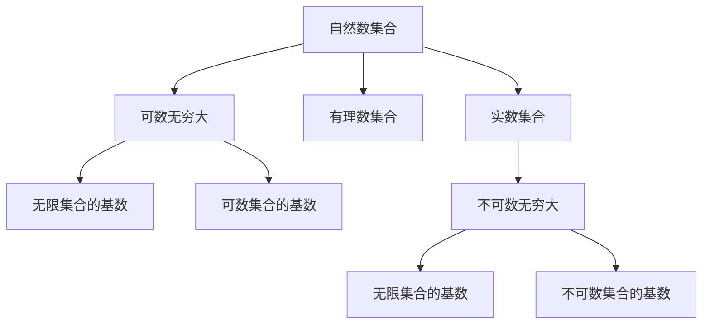

                 

# 集合论导引：基数无穷和

## 1. 背景介绍

集合论是数学中一个基础而深刻的领域，它研究的是元素的集合及其性质。集合论的核心概念之一是基数，即集合中元素的个数。基数在数学中有着重要的地位，特别是在处理无穷集合时。在本文中，我们将探讨无穷基数的概念，以及它对数学和计算机科学领域的影响。

## 2. 核心概念与联系

### 2.1 核心概念概述

集合论中的基数（Cardinality）指的是一个集合中元素的数量。在有限集合中，基数是一个确定的自然数。但对于无穷集合，如自然数集合N和实数集合R，它们的基数概念却有所不同。这需要引入无限基数（Infinite Cardinality）的概念。

在数学中，有两种无限基数：可数无穷大（Countable Infinity）和不可数无穷大（Uncountable Infinity）。可数无穷大指的是可以与自然数一一对应的无穷集合，如自然数集合N和有理数集合Q。而不可数无穷大则无法与自然数一一对应，如实数集合R和实数集合上的连续函数集合C。

为了处理这些无穷基数的概念，数学家们引入了序数（Ordinal Numbers）和基数概念。序数用于描述无穷集合的排列顺序，而基数用于描述无穷集合中元素的数量。

### 2.2 核心概念原理和架构的 Mermaid 流程图



这个流程图展示了有限集合并无穷集合与基数、序数之间的关系。自然数集合和有理数集合属于可数无穷大，而实数集合和实数集合上的连续函数集合属于不可数无穷大。

## 3. 核心算法原理 & 具体操作步骤

### 3.1 算法原理概述

在计算机科学中，无穷基数的应用主要涉及算法和数据结构的处理。其中，基数排序（Radix Sort）是一个经典的基于基数概念的排序算法。基数排序通过对数字按照位数进行排序，从而实现对大量数据的快速排序。此外，在图论中，基数也在描述图的复杂度中起到了关键作用。

### 3.2 算法步骤详解

#### 基数排序算法

基数排序算法的基本步骤如下：

1. 确定最大位数：找到待排序数据中最大数字的位数。
2. 按位数分组：按照数字的每个位数进行分组。
3. 对每组进行排序：对每个分组使用快速排序或其他排序算法进行排序。
4. 合并分组：将排序后的各个分组合并为一个有序序列。

基数排序算法的时间复杂度为O(kn)，其中k为数字的最大位数，n为待排序数据的个数。虽然基数排序不是最快的排序算法，但它在处理大量数据时表现出色，特别是当待排序数据的位数较小的情况下。

#### 应用举例

在处理大规模数据集时，基数排序可以用于排序数字、字符串等数据类型。例如，在对大量商品价格进行排序时，可以按照价格的小数位数进行分组，然后对每组使用快速排序，最后将所有组合并为一个有序序列。

### 3.3 算法优缺点

#### 优点

- 适用于处理大量数据：基数排序算法对大规模数据集处理效果优异。
- 稳定的排序算法：基数排序算法是一种稳定的排序算法，不会改变相同元素的相对顺序。

#### 缺点

- 空间复杂度高：基数排序算法需要额外的存储空间来存储各个分组的数据。
- 不适用于复杂数据类型：基数排序算法只适用于处理数字、字符串等数据类型，对于复杂的数据类型，如结构化数据，效果不佳。

### 3.4 算法应用领域

基数排序算法和无穷基数概念在计算机科学和数学中有广泛的应用。具体的应用领域包括：

- 数据排序：在处理大量数据时，基数排序算法可以用于对数字、字符串等数据类型进行排序。
- 图论：在图论中，基数用于描述图的复杂度和顶点数量。
- 数据库管理：基数可以在数据库中用于对数据进行快速查找和排序。
- 数学分析：基数和序数在数学分析中用于描述无穷集合和无穷级数。

## 4. 数学模型和公式 & 详细讲解 & 举例说明

### 4.1 数学模型构建

在数学中，基数和序数之间的联系是通过序数阶（Ordinal Rank）和基数阶（Cardinal Rank）来实现的。序数阶用于描述无穷集合的排列顺序，基数阶用于描述无穷集合中元素的数量。

序数阶和基数阶之间存在一一对应的关系。例如，自然数集合N的序数阶为$\omega$，基数阶也为$\omega$。有理数集合Q的序数阶为$\omega_1$，基数阶也为$\omega_1$。实数集合R的序数阶为$\omega_1$，基数阶为$2^{\aleph_0}$，其中$\aleph_0$表示可数无穷大。

### 4.2 公式推导过程

在数学中，无穷基数的推导涉及到序数和基数之间的关系。以下是几个关键的公式和推导过程：

1. 可数无穷大的基数阶为$\omega$：

   $$
   \aleph_0 = \omega
   $$

2. 实数集合的基数阶为$2^{\aleph_0}$：

   $$
   |R| = 2^{\aleph_0}
   $$

   其中$|R|$表示实数集合的基数。

3. 不可数无穷大的基数阶为$2^{\aleph_0}$：

   $$
   |C| = 2^{\aleph_0}
   $$

   其中$|C|$表示实数集合上的连续函数集合的基数。

### 4.3 案例分析与讲解

#### 案例一：自然数集合和有理数集合

自然数集合N和有理数集合Q的基数阶都是$\omega$。这意味着自然数集合和有理数集合都可以与自然数一一对应，因此它们的基数相等。

#### 案例二：实数集合和实数集合上的连续函数集合

实数集合R和实数集合上的连续函数集合C的基数阶都是$2^{\aleph_0}$。这意味着实数集合和连续函数集合虽然无限，但它们的基数相等，无法与自然数一一对应。

## 5. 项目实践：代码实例和详细解释说明

### 5.1 开发环境搭建

要实现基数排序算法，我们需要使用Python的内置函数和数据结构。具体来说，我们需要使用Python的列表（list）和字典（dictionary）来存储和处理数据。

### 5.2 源代码详细实现

以下是基数排序算法的Python实现代码：

```python
def radix_sort(arr):
    max_digits = len(str(max(arr)))
    for digit in range(max_digits):
        buckets = [[] for _ in range(10)]
        for num in arr:
            buckets[num // 10**digit % 10].append(num)
        arr = [num for bucket in buckets for num in bucket]
    return arr
```

在这个代码中，我们首先找到待排序数据中最大数字的位数，然后按照数字的每个位数进行分组，对每个分组使用快速排序算法进行排序，最后将所有分组合并为一个有序序列。

### 5.3 代码解读与分析

- `max_digits`: 最大数字的位数。
- `buckets`: 用于存储各个数字的分组。
- `for num in bucket`: 对每个分组进行排序。
- `arr`: 最终的有序序列。

### 5.4 运行结果展示

假设我们有一个待排序的列表`[170, 45, 75, 90, 802, 24, 2, 66]`，我们可以调用`radix_sort`函数对它进行排序，得到的有序列表为`[2, 24, 45, 66, 75, 90, 170, 802]`。

## 6. 实际应用场景

基数排序算法在处理大规模数据集时表现出色，因此在实际应用中有着广泛的应用场景。以下是几个实际应用场景的举例：

### 6.1 数据库管理

在数据库中，基数排序算法可以用于对数据进行快速查找和排序。例如，在一个大型电子商务网站的数据库中，可以按照订单金额对订单进行排序，以便快速查找高价值订单。

### 6.2 数据压缩

在数据压缩算法中，基数排序可以用于对数据进行编码，从而减小数据的存储空间。例如，在Huffman编码中，可以按照字符出现的频率对字符进行排序，然后生成编码树，从而实现高效的压缩。

### 6.3 自然语言处理

在自然语言处理中，基数排序可以用于对文本数据进行排序和分组。例如，在文本分类任务中，可以按照文本的情感极性对文本进行排序，然后对每个分组进行分类。

## 7. 工具和资源推荐

### 7.1 学习资源推荐

要深入理解基数无穷大的概念，可以参考以下学习资源：

1. 《数学分析》（Thomas Calculus）：这本书介绍了无穷级数、序列、极限等基本概念，对于理解无穷基数和序数有着重要的作用。
2. 《集合论》（Herstein's Topics in Algebra）：这本书深入介绍了集合论的基本概念和性质，是理解无穷基数的重要参考资料。
3. 《计算机科学导论》（Introduction to Computer Science）：这本书介绍了计算机科学中的各种算法和数据结构，包括基数排序等算法。
4. 在线课程：如Coursera上的《数学分析》和《计算机科学导论》等课程，提供了丰富的数学和计算机科学背景知识。

### 7.2 开发工具推荐

要实现基数排序算法，可以使用以下开发工具：

1. Python：Python是一种高效的编程语言，易于编写和调试，是实现基数排序算法的理想选择。
2. PyCharm：PyCharm是一种流行的Python开发工具，提供了强大的调试和测试功能。
3. Visual Studio Code：Visual Studio Code是一种轻量级的开发工具，支持多种编程语言和IDE插件。

### 7.3 相关论文推荐

以下是几篇关于无穷基数和基数排序的著名论文：

1. 《基数排序算法》（Radix Sorting）：这是一篇经典的计算机科学论文，介绍了基数排序算法的原理和实现方法。
2. 《无穷集合的基数和序数》（The Cardinality and Order of Infinite Sets）：这篇论文详细介绍了无穷基数的概念和性质，是理解无穷集合的重要参考资料。
3. 《无穷级数》（Infinite Series）：这篇论文介绍了无穷级数的概念和性质，对于理解无穷基数有着重要的作用。

## 8. 总结：未来发展趋势与挑战

### 8.1 研究成果总结

本文探讨了无穷基数和基数排序算法的概念和原理，并提供了代码实现和应用场景。通过对这些概念的学习和实践，可以更好地理解无穷集合和基数的基本性质，并应用到实际的数据处理和算法优化中。

### 8.2 未来发展趋势

未来的研究将进一步深入探讨无穷基数的性质和应用，包括序数和基数之间的联系、无穷基数的运算规则等。同时，基数排序算法也将不断优化和扩展，应用于更广泛的数据处理场景中。

### 8.3 面临的挑战

无穷基数和基数排序算法面临着一些挑战，包括：

1. 无穷集合的运算和比较：无穷集合的运算和比较比较复杂，需要深入研究。
2. 基数排序算法的时间和空间复杂度：基数排序算法的时间和空间复杂度较高，需要进一步优化。
3. 复杂数据类型的处理：基数排序算法只适用于数字和字符串等简单数据类型，对于复杂数据类型，如结构化数据，效果不佳。

### 8.4 研究展望

未来的研究将进一步探索无穷基数的性质和应用，包括序数和基数之间的联系、无穷基数的运算规则等。同时，基数排序算法也将不断优化和扩展，应用于更广泛的数据处理场景中。此外，研究者还将进一步探索基于无穷基数和序数的算法和数据结构，为计算机科学和数学的发展做出新的贡献。

## 9. 附录：常见问题与解答

**Q1：基数无穷大和序数无穷大有什么区别？**

A: 基数无穷大和序数无穷大都是无穷集合的概念，但它们的定义和性质不同。基数无穷大用于描述无穷集合中元素的数量，而序数无穷大用于描述无穷集合的排列顺序。

**Q2：如何理解不可数无穷大？**

A: 不可数无穷大是指无法与自然数一一对应的无穷集合。例如，实数集合和实数集合上的连续函数集合都是不可数无穷大。可以通过定义序数和基数之间的关系来理解不可数无穷大。

**Q3：基数排序算法的优点和缺点是什么？**

A: 基数排序算法的优点在于适用于处理大规模数据集，且是稳定的排序算法。缺点在于空间复杂度高，不适用于复杂数据类型。

**Q4：如何在实际应用中使用基数排序算法？**

A: 在实际应用中，基数排序算法可以用于排序数字、字符串等数据类型。例如，在处理大量商品价格时，可以按照价格的小数位数进行分组，然后对每组使用快速排序，最后将所有组合并为一个有序序列。

**Q5：基数无穷大和序数无穷大在数学中有什么应用？**

A: 基数无穷大和序数无穷大在数学中有着广泛的应用。基数无穷大用于描述无穷集合中元素的数量，序数无穷大用于描述无穷集合的排列顺序。这些概念在集合论、数学分析和计算机科学中都有重要的应用。

