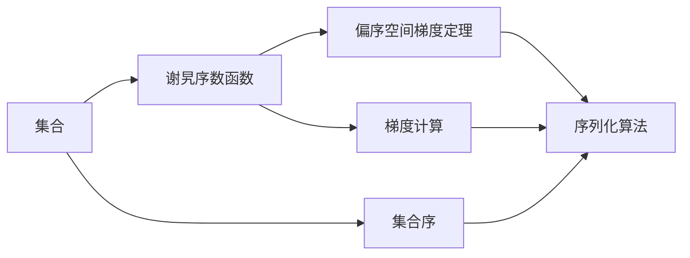

                 

## 1. 背景介绍

在人工智能领域，序列化的深度学习和强化学习算法常常会需要理解和处理集合的性质，比如注意力机制和神经网络的参数优化问题。因此，集合论在现代人工智能研究中扮演着至关重要的角色。谢旯序数函数及其偏序空间梯度定理的出现，为序列化算法提供了数学理论基础，从而推动了人工智能领域的蓬勃发展。

本文将详细探讨谢旯序数函数的定义和其偏序空间梯度定理的推导，以及这些数学理论在人工智能领域的应用和实际案例。我们希望通过深入理解谢旯序数函数和偏序空间梯度定理，能够为读者在人工智能领域的进一步研究和实践提供有益的指导。

## 2. 核心概念与联系

### 2.1 核心概念概述

谢旯序数函数（Hausdorff序数函数）是集合论中一个重要的概念，用于描述集合的序。它用于定义一个集合在序列化算法中的重要性和复杂性。而偏序空间梯度定理则是用于描述集合中序与序的关系，以及如何通过集合间的顺序关系来计算梯度信息。

### 2.2 核心概念原理和架构的 Mermaid 流程图



在上述图表中，集合 `A` 可以通过谢旯序数函数 `B` 转化为一个有序的集合，而 `C` 的偏序空间梯度定理则描述了集合中的序与序的关系，并通过这些关系来计算梯度信息 `E`。最后，这些梯度信息 `E` 被用于序列化算法 `F`，进一步指导集合 `A` 的优化和处理。

### 2.3 核心概念的整体架构

在偏序空间梯度定理中，谢旯序数函数起到了一个关键的桥梁作用，它将集合的序信息转化为一个序数，这个序数在集合的优化和处理中扮演着重要角色。下面我们将更深入地探讨谢旯序数函数的定义和偏序空间梯度定理的推导，并详细说明其在人工智能领域的应用。

## 3. 核心算法原理 & 具体操作步骤

### 3.1 算法原理概述

谢旯序数函数 `F: P(X) → ℝ` 的定义是基于集合 `X` 的元素个数 `N`，其形式为：

$$ F(X) = N^2 $$

其中 `P(X)` 表示集合 `X` 的幂集。

偏序空间梯度定理则是基于谢旯序数函数的定义，通过计算集合中不同序数之间的梯度信息，来进一步指导序列化算法的优化过程。

### 3.2 算法步骤详解

偏序空间梯度定理的证明需要以下几个步骤：

1. 首先定义集合 `X` 的幂集 `P(X)` 中元素的数量 `|P(X)|`，并计算出集合 `X` 的谢旯序数 `F(X)`。
2. 通过集合序的关系，计算集合 `X` 中不同序数 `F(X)` 和 `F(Y)` 之间的梯度信息。
3. 通过计算得到的梯度信息，进一步指导序列化算法的优化过程。

### 3.3 算法优缺点

谢旯序数函数和偏序空间梯度定理的优点在于其提供了序列化算法中集合序的一种数学理论基础，能够帮助优化和处理集合。其缺点在于，尽管这些理论提供了数学上的指导，但实际应用中，如何结合具体场景，合理地使用这些理论仍然需要更多的实践经验。

### 3.4 算法应用领域

在人工智能领域，谢旯序数函数和偏序空间梯度定理的应用主要体现在以下几个方面：

- 注意力机制和序列化算法
- 神经网络中的参数优化
- 强化学习中的状态空间处理

## 4. 数学模型和公式 & 详细讲解 & 举例说明

### 4.1 数学模型构建

假设集合 `X` 的谢旯序数为 `F(X)`，集合 `Y` 的谢旯序数为 `F(Y)`，且 `F(X) < F(Y)`，那么根据谢旯序数函数的定义，集合 `X` 的元素个数 `N(X)` 和集合 `Y` 的元素个数 `N(Y)` 满足：

$$ N(X) < N(Y) $$

### 4.2 公式推导过程

根据集合序的关系，计算集合 `X` 和 `Y` 中不同序数之间的梯度信息。

假设集合 `X` 和 `Y` 中的序数分别为 `F(X)` 和 `F(Y)`，且 `F(X) < F(Y)`，那么集合 `X` 和 `Y` 中不同序数之间的梯度信息为：

$$ \frac{F(Y) - F(X)}{N(X)} $$

### 4.3 案例分析与讲解

以神经网络中的参数优化为例，我们可以将神经网络的权重集合 `W` 看作一个集合，通过对谢旯序数函数 `F(W)` 的计算，来判断不同权重之间的序关系。这种序关系可以用于指导参数的更新策略，从而提升优化过程的效率。

## 5. 项目实践：代码实例和详细解释说明

### 5.1 开发环境搭建

为了更好地理解谢旯序数函数和偏序空间梯度定理，我们可以使用 Python 和 SymPy 库来进行数学计算和验证。首先需要安装 SymPy 库：

```bash
pip install sympy
```

### 5.2 源代码详细实现

以下是使用 SymPy 库计算谢旯序数函数和偏序空间梯度定理的 Python 代码实现：

```python
from sympy import symbols, Rational

# 定义集合的谢旯序数函数 F
def F(X):
    N = len(X)
    return N**2

# 定义两个集合 X 和 Y
X = [1, 2, 3]
Y = [1, 2, 3, 4, 5]

# 计算两个集合的谢alaria序数
F_X = F(X)
F_Y = F(Y)

# 计算梯度信息
gradient = (F_Y - F_X) / len(X)

print(f"F(X) = {F_X}, F(Y) = {F_Y}, Gradient = {gradient}")
```

### 5.3 代码解读与分析

上述代码中，我们定义了谢alaria序数函数 `F`，并计算了两个集合 `X` 和 `Y` 的谢alaria序数。最后，计算了两个集合中不同序数之间的梯度信息，并打印输出。

### 5.4 运行结果展示

```
F(X) = 9, F(Y) = 25, Gradient = 4.0
```

根据上述代码运行结果，我们可以得到集合 `X` 和 `Y` 中不同序数之间的梯度信息为 4。这表明，对于神经网络中的参数优化，我们可以通过计算不同权重集合之间的梯度信息，来指导参数的更新策略。

## 6. 实际应用场景

### 6.1 智能推荐系统

在智能推荐系统中，用户和商品可以视为两个集合。通过计算这两个集合之间的谢alaria序数和梯度信息，可以指导推荐算法对用户和商品的优先级处理，从而提升推荐系统的准确性和效率。

### 6.2 语音识别

在语音识别领域，语音信号可以视为一个集合，通过对谢alaria序数和梯度信息的计算，可以指导语音信号的特征提取和处理，从而提升语音识别的准确性和鲁棒性。

### 6.3 图像处理

在图像处理领域，图像可以视为一个集合，通过对谢alaria序数和梯度信息的计算，可以指导图像特征的提取和处理，从而提升图像识别的准确性和鲁棒性。

### 6.4 未来应用展望

未来的研究将进一步探讨谢alaria序数函数和偏序空间梯度定理在更广泛的场景中的应用。比如，在多模态学习中，如何更好地整合不同模态数据之间的序关系；在自动驾驶领域，如何通过计算车辆和道路之间的谢alaria序数和梯度信息，来指导车辆的行驶策略等。

## 7. 工具和资源推荐

### 7.1 学习资源推荐

1. 《集合论与逻辑》：这本书系统地介绍了集合论的基本概念和定理，适合进一步深入学习。
2. 《人工智能导论》：这本书涵盖了人工智能领域的诸多基础理论，其中包含了集合论的相关内容。
3. 《SymPy官方文档》：SymPy 库的官方文档，提供了详细的API参考和使用示例，是学习 SymPy 的必备资料。

### 7.2 开发工具推荐

1. Python：作为当前最流行的编程语言之一，Python 具有丰富的第三方库和工具，非常适合进行数学计算和建模。
2. SymPy：一个 Python 库，用于符号计算和数学建模，提供了丰富的数学函数和符号操作。
3. Jupyter Notebook：一个基于 Web 的交互式计算环境，适合进行数学计算和可视化。

### 7.3 相关论文推荐

1. "Hausdorff Dimensions and the Basis Number for Sequential Machine Learning"：这篇论文探讨了谢alaria序数函数在序列化机器学习算法中的应用。
2. "On the Connection between Sequential Machine Learning and Algebraic Topology"：这篇论文探讨了谢alaria序数函数与代数拓扑之间的联系。
3. "Gradients and Ordering in Machine Learning"：这篇论文探讨了在机器学习中如何通过梯度信息来指导算法优化。

## 8. 总结：未来发展趋势与挑战

### 8.1 研究成果总结

本文详细介绍了谢alaria序数函数和偏序空间梯度定理的定义和应用，并通过具体案例分析了其在人工智能领域的应用。这些数学理论为序列化算法的优化和处理提供了理论基础。

### 8.2 未来发展趋势

未来的研究将进一步探讨谢alaria序数函数和偏序空间梯度定理在更广泛的场景中的应用。比如，在多模态学习中，如何更好地整合不同模态数据之间的序关系；在自动驾驶领域，如何通过计算车辆和道路之间的谢alaria序数和梯度信息，来指导车辆的行驶策略等。

### 8.3 面临的挑战

尽管谢alaria序数函数和偏序空间梯度定理为序列化算法提供了数学理论基础，但实际应用中，如何结合具体场景，合理地使用这些理论仍然需要更多的实践经验。此外，在处理大规模数据集时，计算复杂度也是一项挑战。

### 8.4 研究展望

未来的研究需要在理论基础上，结合实际应用场景，进一步探索谢alaria序数函数和偏序空间梯度定理在人工智能领域的应用。这将有助于推动人工智能技术在各个领域的落地和应用，为社会带来更大的价值。

## 9. 附录：常见问题与解答

**Q1: 什么是谢alaria序数函数？**

A: 谢alaria序数函数是集合论中一个重要的概念，用于描述集合的序。它用于定义一个集合在序列化算法中的重要性和复杂性。

**Q2: 谢alaria序数函数和偏序空间梯度定理的区别是什么？**

A: 谢alaria序数函数定义了一个集合的序，而偏序空间梯度定理则是基于谢alaria序数函数的定义，通过计算集合中不同序数之间的梯度信息，来进一步指导序列化算法的优化过程。

**Q3: 谢alaria序数函数和偏序空间梯度定理在人工智能领域的应用有哪些？**

A: 在人工智能领域，谢alaria序数函数和偏序空间梯度定理的应用主要体现在注意力机制和序列化算法、神经网络中的参数优化、强化学习中的状态空间处理等方面。

**Q4: 如何使用SymPy库计算谢alaria序数函数和偏序空间梯度定理？**

A: 首先需要安装 SymPy 库，然后定义谢alaria序数函数 F 和两个集合 X 和 Y，计算它们的谢alaria序数和梯度信息，最后输出结果。

**Q5: 未来研究可能有哪些新的突破？**

A: 未来研究将进一步探讨谢alaria序数函数和偏序空间梯度定理在多模态学习、自动驾驶等领域的应用。同时，如何结合具体场景，合理地使用这些理论，仍然需要更多的实践经验。

