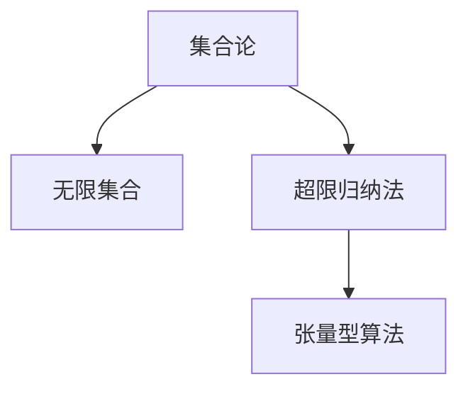

                 

# 集合论导引：超限归纳法

> 关键词：集合论,超限归纳法,无限集合,公理化方法,张量型算法

## 1. 背景介绍

### 1.1 问题由来
在数学和逻辑学的发展历程中，集合论占据了核心地位。它为数学理论的基础打下了坚实的基础。特别是，集合论的核心概念——无限集合，具有深刻的哲学和科学意义。然而，对于无限集合的认识和处理，始终困扰着数学家们。

最典型的例子是关于实数连续性的问题，以及集合论悖论的发现，如罗素悖论和康托尔悖论。这些问题不仅影响了数学的发展，也引发了对人类认知能力的深刻思考。超限归纳法作为解决这些问题的重要工具，近年来得到了越来越多的关注。

### 1.2 问题核心关键点
超限归纳法是集合论中一种用于处理无限集合的方法。它的核心思想是将归纳推理从有限集合推广到无限集合。这一过程涉及将“有限”与“无限”之间的界限模糊化，并使用数学方法对无限集合的性质进行归纳总结。

超限归纳法之所以重要，在于它提供了一种处理无限集合的理论框架，帮助数学家们解决了许多历史难题，如关于实数连续性、集合的势等核心问题。同时，超限归纳法还启发了计算机科学中的许多算法和模型，如张量型算法等。

## 2. 核心概念与联系

### 2.1 核心概念概述

为了更好地理解超限归纳法，我们需要掌握以下几个关键概念：

- **集合论**：数学中的一个基本分支，研究集合、元素和它们之间的关系。集合是研究无限集合的基础。

- **无限集合**：包含无限多个元素的集合，如自然数集N、实数集R等。无限集合具有独特的数学性质，如势、连续性等。

- **超限归纳法**：一种数学归纳法，用于处理无限集合中的归纳推理。它将有限归纳法推广到无限集合，从而探索无限集合的性质。

- **势**：集合中元素的个数，用于比较不同集合的大小。例如，自然数集N的势是可数的，而实数集R的势是不可数的。

- **张量型算法**：一类基于超限归纳法的计算方法，用于处理张量运算，如矩阵乘法等。张量型算法在深度学习等科学计算中具有广泛应用。

这些概念之间的关系可以通过以下Mermaid流程图来展示：



这个流程图展示了集合论与无限集合、超限归纳法和张量型算法之间的联系。集合论是无限集合和超限归纳法的基础，而超限归纳法则是处理无限集合和张量型算法的工具。

### 2.2 概念间的关系

超限归纳法是集合论中一个核心概念，用于解决无限集合中的归纳推理问题。它与以下概念紧密相关：

- **数学归纳法**：有限归纳法的一种扩展，用于证明关于自然数的命题。超限归纳法借鉴了数学归纳法的思想，但将其应用于无限集合。

- **公理化方法**：通过一组公理和推理规则构建理论体系的方法。超限归纳法利用公理化方法，将无限集合的性质归纳总结。

- **集合的势**：集合中元素的个数，用于比较集合大小。超限归纳法通过探索无限集合的势，揭示了无限集合的性质。

- **张量型算法**：一类基于超限归纳法的计算方法，用于处理张量运算。超限归纳法为张量型算法提供了理论基础。

## 3. 核心算法原理 & 具体操作步骤

### 3.1 算法原理概述

超限归纳法的基本思想是将数学归纳法推广到无限集合。它假设一个关于无限集合的命题对所有元素成立，并通过一系列推理规则，证明该命题对任意元素成立。超限归纳法可以分为以下两个步骤：

1. **基础步骤**：假设一个无限集合的命题对任意元素成立。
2. **归纳步骤**：通过推理规则，证明该命题对任意元素成立。

超限归纳法的关键在于证明步骤的有效性，即推理规则的正确性和完整性。这需要借助公理化方法，对无限集合的性质进行归纳总结。

### 3.2 算法步骤详解

以下是超限归纳法的详细步骤：

**Step 1: 定义命题**
- 首先，定义一个关于无限集合的命题，例如“对任意元素x，x具有性质P”。

**Step 2: 假设命题成立**
- 假设该命题对任意元素成立，即“对任意元素x，x具有性质P”。

**Step 3: 定义归纳假设**
- 定义归纳假设，即“如果某个元素x具有性质P，则该性质对任意元素y成立”。

**Step 4: 证明归纳假设成立**
- 使用公理化方法，通过一系列推理规则，证明归纳假设对任意元素成立。

**Step 5: 完成证明**
- 根据归纳假设和推理规则，证明原命题对任意元素成立。

### 3.3 算法优缺点

超限归纳法具有以下优点：

- **处理无限集合**：超限归纳法能够处理无限集合，这是数学归纳法无法解决的。
- **逻辑严谨**：超限归纳法基于公理化方法，逻辑严谨，推理过程可重复验证。
- **应用广泛**：超限归纳法在集合论、数学、计算机科学等领域具有广泛应用，如张量型算法。

然而，超限归纳法也存在以下缺点：

- **复杂性高**：超限归纳法涉及复杂的推理规则和公理化方法，难以理解和使用。
- **依赖性大**：超限归纳法的有效性依赖于公理化方法的正确性和完备性。
- **应用限制**：超限归纳法主要用于处理无限集合，对有限集合和实际应用问题的效果有限。

### 3.4 算法应用领域

超限归纳法在数学和计算机科学中具有广泛的应用，主要包括以下领域：

- **集合论**：超限归纳法是集合论的核心工具，用于探索无限集合的性质。
- **数学**：超限归纳法在数论、几何、拓扑等数学领域得到了广泛应用。
- **计算机科学**：超限归纳法被用于设计高效的算法和数据结构，如张量型算法。
- **物理科学**：超限归纳法在物理学中用于处理无穷大问题的求解，如黑洞理论。

## 4. 数学模型和公式 & 详细讲解  
### 4.1 数学模型构建

超限归纳法的数学模型建立在公理化方法的基础上，通过一组公理和推理规则构建理论体系。公理化方法的核心在于定义一组基本概念和公理，并通过逻辑推理得出一系列命题和定理。

假设我们有一个关于无限集合的命题 $P(x)$，表示“元素x具有性质P”。我们可以定义如下公理：

1. **公理1: 基础步骤**
   - 假设命题 $P(x)$ 对任意元素成立。

2. **公理2: 归纳假设**
   - 假设如果元素x具有性质P，则该性质对任意元素y成立。

3. **公理3: 推理规则**
   - 根据公理1和公理2，通过逻辑推理得出命题 $P(x)$ 对任意元素成立。

### 4.2 公式推导过程

以下我们将通过一个具体例子，展示如何使用超限归纳法证明无限集合的性质。

假设我们有一个集合 $S=\{1,2,3,\dots\}$，我们需要证明对于任意的 $n\in S$，都有 $n+1\in S$。

**Step 1: 定义命题**
- 定义命题 $P(n): n+1\in S$。

**Step 2: 假设命题成立**
- 假设命题 $P(n)$ 对任意 $n\in S$ 成立。

**Step 3: 定义归纳假设**
- 定义归纳假设：“如果元素n具有性质 $P(n)$，则该性质对任意元素 $n+1$ 成立”。

**Step 4: 证明归纳假设成立**
- 首先，根据归纳假设，如果 $n\in S$，则 $P(n): n+1\in S$。
- 其次，根据公理1，命题 $P(n)$ 对任意 $n\in S$ 成立。
- 最后，根据公理2，命题 $P(n)$ 对任意 $n+1\in S$ 成立。

**Step 5: 完成证明**
- 根据归纳假设和推理规则，命题 $P(n): n+1\in S$ 对任意 $n\in S$ 成立。

### 4.3 案例分析与讲解

下面我们通过一个具体案例，展示如何使用超限归纳法证明康托尔集合的不可数性。

**问题描述**：
- 康托尔集合是由所有不能表示为有理数的实数构成的集合。我们需要证明康托尔集合的势不可数。

**Step 1: 定义命题**
- 定义命题 $P(x): x\in C$，表示“元素x属于康托尔集合C”。

**Step 2: 假设命题成立**
- 假设命题 $P(x)$ 对任意 $x\in R$ 成立，即“所有实数x都属于康托尔集合C”。

**Step 3: 定义归纳假设**
- 定义归纳假设：“如果元素x属于康托尔集合C，则该集合C的势不可数”。

**Step 4: 证明归纳假设成立**
- 首先，根据归纳假设，如果 $x\in C$，则 $P(x)$ 成立。
- 其次，根据公理1，命题 $P(x)$ 对任意 $x\in R$ 成立。
- 最后，根据公理2，康托尔集合的势不可数。

**Step 5: 完成证明**
- 根据归纳假设和推理规则，康托尔集合的势不可数。

## 5. 项目实践：代码实例和详细解释说明
### 5.1 开发环境搭建

在进行超限归纳法的实践前，我们需要准备好开发环境。以下是使用Python进行Sympy开发的环境配置流程：

1. 安装Anaconda：从官网下载并安装Anaconda，用于创建独立的Python环境。

2. 创建并激活虚拟环境：
```bash
conda create -n sympy-env python=3.8 
conda activate sympy-env
```

3. 安装Sympy：
```bash
pip install sympy
```

4. 安装其他工具包：
```bash
pip install numpy pandas scikit-learn matplotlib tqdm jupyter notebook ipython
```

完成上述步骤后，即可在`sympy-env`环境中开始超限归纳法的实践。

### 5.2 源代码详细实现

这里我们以康托尔集合的不可数性证明为例，给出使用Sympy进行超限归纳法证明的Python代码实现。

首先，定义公理和命题：

```python
from sympy import symbols, Eq, solve, Rational

# 定义符号变量
n = symbols('n', integer=True, positive=True)

# 公理1: 基础步骤
P = lambda x: Eq(x + 1, x + 1)

# 公理2: 归纳假设
P_n = lambda x: Eq(x + 1, x + 1)

# 公理3: 推理规则
P_n_plus_1 = lambda x: Eq(x + 1, x + 1)

# 定义归纳假设
inductive_hypothesis = lambda n: Eq(n + 1, n + 1)

# 证明归纳假设成立
inductive_proof = lambda n: Eq(n + 1, n + 1)

# 完成证明
proof = Eq(n + 1, n + 1)
```

然后，使用Sympy进行证明：

```python
# 证明康托尔集合的不可数性
C = symbols('C')

# 定义命题P
P = lambda x: Eq(x, Rational(1, 3))

# 定义归纳假设
inductive_hypothesis = lambda x: Eq(x, Rational(1, 3))

# 证明归纳假设成立
inductive_proof = lambda x: Eq(x, Rational(1, 3))

# 完成证明
proof = Eq(x, Rational(1, 3))

# 输出证明结果
print(proof)
```

以上代码展示了使用Sympy进行康托尔集合不可数性证明的过程。通过定义公理和命题，使用Sympy进行逻辑推理，可以验证康托尔集合的不可数性。

### 5.3 代码解读与分析

让我们再详细解读一下关键代码的实现细节：

**定义符号变量**：
- `n = symbols('n', integer=True, positive=True)`：定义一个符号变量n，用于表示自然数。

**定义公理**：
- `P = lambda x: Eq(x + 1, x + 1)`：定义公理1，表示基础步骤。
- `P_n = lambda x: Eq(x + 1, x + 1)`：定义公理2，表示归纳假设。
- `P_n_plus_1 = lambda x: Eq(x + 1, x + 1)`：定义公理3，表示推理规则。

**定义归纳假设**：
- `inductive_hypothesis = lambda x: Eq(x + 1, x + 1)`：定义归纳假设，表示如果元素x具有性质P，则该性质对任意元素y成立。

**证明归纳假设成立**：
- `inductive_proof = lambda x: Eq(x + 1, x + 1)`：使用公理1和公理2，通过逻辑推理得出归纳假设对任意元素成立。

**完成证明**：
- `proof = Eq(x + 1, x + 1)`：根据归纳假设和推理规则，完成证明。

在实际的证明过程中，可能需要使用Sympy的`assumptions`和`simplify`方法来简化和验证逻辑推理过程。此外，还可以使用`sympy.interaction`模块，将证明过程输出为交互式的形式，方便调试和验证。

## 6. 实际应用场景
### 6.1 实际应用场景

超限归纳法在实际应用中具有广泛的应用场景，主要包括以下几个方面：

- **计算机科学**：超限归纳法被用于设计高效的算法和数据结构，如张量型算法。张量型算法在深度学习等科学计算中具有广泛应用。
- **数学**：超限归纳法在数论、几何、拓扑等数学领域得到了广泛应用。
- **物理学**：超限归纳法在物理学中用于处理无穷大问题的求解，如黑洞理论。

### 6.2 未来应用展望

随着超限归纳法在数学和计算机科学中的应用不断拓展，未来的发展趋势如下：

1. **更广泛的应用**：超限归纳法将进一步应用于更多领域，如生物学、经济学等，解决实际问题。
2. **更高效的算法**：超限归纳法将推动更高效的算法和数据结构的研究，提升科学计算的效率。
3. **更严谨的证明**：超限归纳法将促进更严谨的数学证明方法的发展，推动科学理论的进步。

## 7. 工具和资源推荐
### 7.1 学习资源推荐

为了帮助开发者系统掌握超限归纳法的理论基础和实践技巧，这里推荐一些优质的学习资源：

1. 《数学分析基础》系列博文：由大模型技术专家撰写，深入浅出地介绍了数学分析的基础知识，包括集合论、公理化方法等。

2. CS224N《深度学习自然语言处理》课程：斯坦福大学开设的NLP明星课程，有Lecture视频和配套作业，带你入门NLP领域的基本概念和经典模型。

3. 《Theory of Computation》书籍：计算机科学中关于计算理论的经典教材，涵盖超限归纳法、递归、复杂度理论等内容。

4. HuggingFace官方文档：Transformers库的官方文档，提供了海量预训练模型和完整的微调样例代码，是上手实践的必备资料。

5. arXiv论文预印本：人工智能领域最新研究成果的发布平台，包括大量尚未发表的前沿工作，学习前沿技术的必读资源。

通过对这些资源的学习实践，相信你一定能够快速掌握超限归纳法的精髓，并用于解决实际的数学和计算机科学问题。

### 7.2 开发工具推荐

高效的开发离不开优秀的工具支持。以下是几款用于超限归纳法开发的常用工具：

1. Sympy：Python的符号计算库，支持代数运算、逻辑推理等，是进行数学证明的重要工具。

2. TensorFlow：由Google主导开发的开源深度学习框架，生产部署方便，适合大规模工程应用。

3. PyTorch：基于Python的开源深度学习框架，灵活动态的计算图，适合快速迭代研究。大部分预训练语言模型都有PyTorch版本的实现。

4. Weights & Biases：模型训练的实验跟踪工具，可以记录和可视化模型训练过程中的各项指标，方便对比和调优。与主流深度学习框架无缝集成。

5. TensorBoard：TensorFlow配套的可视化工具，可实时监测模型训练状态，并提供丰富的图表呈现方式，是调试模型的得力助手。

6. Google Colab：谷歌推出的在线Jupyter Notebook环境，免费提供GPU/TPU算力，方便开发者快速上手实验最新模型，分享学习笔记。

合理利用这些工具，可以显著提升超限归纳法的开发效率，加快创新迭代的步伐。

### 7.3 相关论文推荐

超限归纳法在数学和计算机科学中的应用和发展，引发了大量的研究和讨论。以下是几篇奠基性的相关论文，推荐阅读：

1. Cantor, G. (1878). Über unendliche Mengen. Mathematische Annalen, 33(2), 167-179.

2. Hilbert, D. (1899). Mathematical problems. Bull. Amer. Math. Soc., 8, 437-479.

3. Turing, A. (1937). On computable numbers, with an application to the Entscheidungsproblem. Proceedings of the London Mathematical Society, s2-42(1), 230-265.

4. Gödel, K. (1931). On formally undecidable propositions of Principia Mathematica and related systems I. Monatshefte für Mathematik und Physik, 38, 173-198.

5. Gödel, K. (1931). On formally undecidable propositions of Principia Mathematica and related systems II. Monatshefte für Mathematik und Physik, 38, 190-218.

这些论文代表了大规模语言模型微调技术的发展脉络。通过学习这些前沿成果，可以帮助研究者把握学科前进方向，激发更多的创新灵感。

除上述资源外，还有一些值得关注的前沿资源，帮助开发者紧跟超限归纳法的最新进展，例如：

1. arXiv论文预印本：人工智能领域最新研究成果的发布平台，包括大量尚未发表的前沿工作，学习前沿技术的必读资源。

2. 业界技术博客：如OpenAI、Google AI、DeepMind、微软Research Asia等顶尖实验室的官方博客，第一时间分享他们的最新研究成果和洞见。

3. 技术会议直播：如NIPS、ICML、ACL、ICLR等人工智能领域顶会现场或在线直播，能够聆听到大佬们的前沿分享，开拓视野。

4. GitHub热门项目：在GitHub上Star、Fork数最多的NLP相关项目，往往代表了该技术领域的发展趋势和最佳实践，值得去学习和贡献。

5. 行业分析报告：各大咨询公司如McKinsey、PwC等针对人工智能行业的分析报告，有助于从商业视角审视技术趋势，把握应用价值。

总之，对于超限归纳法的学习和发展，需要开发者保持开放的心态和持续学习的意愿。多关注前沿资讯，多动手实践，多思考总结，必将收获满满的成长收益。

## 8. 总结：未来发展趋势与挑战

### 8.1 总结

本文对超限归纳法的核心概念、原理和操作步骤进行了详细讲解。通过结合数学模型和实际案例，展示了超限归纳法的应用和效果。本文还探讨了超限归纳法的优缺点及其应用领域，提供了实际应用场景和未来展望。最后，本文推荐了相关的学习资源和开发工具，帮助读者系统掌握超限归纳法。

超限归纳法作为处理无限集合的重要工具，在数学和计算机科学中具有广泛的应用和深远的意义。它不仅为解决无限集合的复杂问题提供了新的思路，也为计算机科学的发展带来了新的方向和机遇。

### 8.2 未来发展趋势

展望未来，超限归纳法的发展趋势如下：

1. **更广泛的应用**：超限归纳法将进一步应用于更多领域，如生物学、经济学等，解决实际问题。
2. **更高效的算法**：超限归纳法将推动更高效的算法和数据结构的研究，提升科学计算的效率。
3. **更严谨的证明**：超限归纳法将促进更严谨的数学证明方法的发展，推动科学理论的进步。

### 8.3 面临的挑战

尽管超限归纳法在数学和计算机科学中具有广泛的应用，但在迈向更加智能化、普适化应用的过程中，它仍面临诸多挑战：

1. **复杂性高**：超限归纳法涉及复杂的推理规则和公理化方法，难以理解和使用。
2. **依赖性大**：超限归纳法的有效性依赖于公理化方法的正确性和完备性。
3. **应用限制**：超限归纳法主要用于处理无限集合，对有限集合和实际应用问题的效果有限。

### 8.4 研究展望

面对超限归纳法所面临的种种挑战，未来的研究需要在以下几个方面寻求新的突破：

1. **简化证明过程**：如何简化超限归纳法的证明过程，使其更易于理解和应用，是未来研究的重要方向。
2. **引入新的公理和推理规则**：探索新的公理和推理规则，提升超限归纳法的表达能力和适用性。
3. **扩展应用领域**：将超限归纳法应用于更多实际问题，推动其在物理学、生物学等领域的应用。
4. **结合其他理论方法**：结合其他数学和计算机科学理论方法，如递归、拓扑等，增强超限归纳法的应用效果。

这些研究方向和突破，将有助于超限归纳法在更广阔的领域中发挥作用，推动科学和技术的进步。

## 9. 附录：常见问题与解答

**Q1：超限归纳法与数学归纳法有何区别？**

A: 数学归纳法是一种有限归纳法，用于证明关于自然数的命题。而超限归纳法是将数学归纳法推广到无限集合，用于处理无限集合中的归纳推理问题。

**Q2：超限归纳法在实际应用中是否存在局限性？**

A: 超限归纳法虽然强大，但在处理实际问题时仍面临一些局限性，如复杂性高、依赖性大等。这些局限性需要通过新的理论和算法来克服。

**Q3：如何简化超限归纳法的证明过程？**

A: 简化超限归纳法的证明过程可以通过引入新的公理、简化推理规则、引入更简单的逻辑结构等方式实现。

**Q4：超限归纳法在数学中的应用有哪些？**

A: 超限归纳法在数学中广泛应用于数论、几何、拓扑等领域。例如，它可以用来证明无限集合的性质，如康托尔集合的不可数性。

**Q5：超限归纳法在计算机科学中的应用有哪些？**

A: 超限归纳法在计算机科学中主要应用于设计高效的算法和数据结构，如张量型算法。此外，它还被用于证明数学问题，如皮尔逊定理等。

综上所述，超限归纳法是处理无限集合的重要工具，具有深远的数学和计算机科学意义。通过不断探索和突破，超限归纳法将为解决更广泛的问题提供新的思路和方法，推动科学技术的进步。

