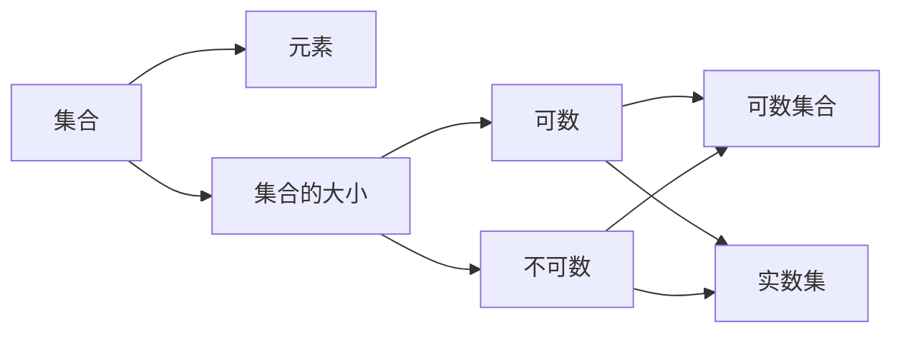
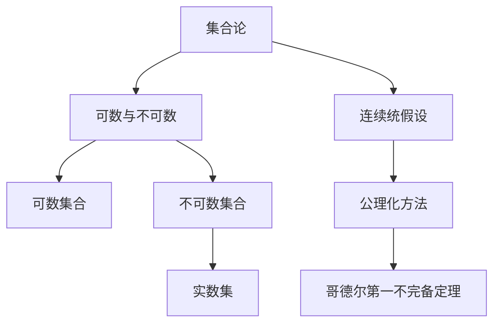

                 

# 集合论导引：连续统假设

> 关键词：集合论,连续统,可数,不可数,实数,公理化方法,连续统假设,哥德尔第一不完备定理

## 1. 背景介绍

### 1.1 问题由来
在数学的发展史上，有一个关于集合大小的问题引发了广泛的讨论和研究，它就是著名的连续统假设（Continuum Hypothesis，CH）。这个假设是20世纪数理逻辑最重要的理论之一，对现代数学的发展产生了深远影响。本文将从连续统假设的提出背景入手，系统介绍其理论基础和相关数学模型，并探讨其对现代数学研究的影响。

### 1.2 问题核心关键点
连续统假设的核心在于探讨连续统的大小。连续统是指实数集 $\mathbb{R}$，其大小不可数（无限），且具有不可分性（任何两个实数之间都存在无数个实数）。CH假设的大小正好介于可数集（如自然数集 $\mathbb{N}$）和不可数集（如实数集 $\mathbb{R}$）之间，具体表述如下：

$$\lvert \mathbb{R} \rvert = \lvert \mathbb{N} \rvert^\omega.$$

这里 $\omega$ 是可数集合的势，表示 $\mathbb{N}$ 的幂集大小。CH假设是否成立，直接关系到实数集大小的性质，对数学基础理论和应用有着重要意义。

## 2. 核心概念与联系

### 2.1 核心概念概述

在讨论CH假设之前，我们先介绍一些关键的概念：

- **集合**：由若干元素构成的整体，可以是具体对象（如数字、字母），也可以是抽象对象（如点集、数集）。
- **元素**：集合中的单个成员，可以是从原子到宇宙的任何对象。
- **集合的大小**：用来衡量集合中元素的数量的概念，可以是有限的也可以是无限的。
- **可数集合**：可以通过自然数进行一一对应（如自然数集、有理数集）的集合。
- **不可数集合**：不能通过自然数进行一一对应的集合，如实数集、不可数实数集。
- **实数集**：连续的、无限的、稠密的、具有不可数势的实数集合，即 $\mathbb{R}$。
- **幂集**：一个集合的所有子集的集合，记为 $2^A$。

这些概念构成了现代数学的基础，对于理解CH假设具有重要意义。

### 2.2 概念间的关系

以下是这些核心概念之间的关系，通过一个简单的 Mermaid 流程图来展示：



这个流程图展示了从集合到元素的抽象，再到集合大小的分类（可数与不可数），最后聚焦到实数集的大小问题。

### 2.3 核心概念的整体架构

再来看一个综合的流程图，展示从基本概念到CH假设的完整架构：



这个综合流程图展示了集合论的基本概念如何通过可数与不可数的分类，最终导向连续统假设，以及与之紧密相关的公理化方法和哥德尔第一不完备定理。

## 3. 核心算法原理 & 具体操作步骤
### 3.1 算法原理概述

CH假设是数学基础理论中的一个基本问题，其本质是对集合大小的比较。从集合论的角度来看，CH假设可以表述为：

- **连续统假设**：对于任意集合 $A$，如果 $\lvert A \rvert = \lvert \mathbb{R} \rvert$，则存在一个可数集合 $B$ 使得 $A = B \times \mathbb{R}$。

其中，$\times$ 表示笛卡尔积，即 $A \times \mathbb{R}$ 表示所有形如 $(a, r)$ 的有序对，其中 $a \in A$ 且 $r \in \mathbb{R}$。

CH假设的核心在于比较两个无限集合的大小，即实数集的势与某个可数集合的幂集的势。CH假设的真假直接影响数学的基础结构和逻辑系统，尤其是对于实数集大小的性质，具有深远的理论意义和实际应用。

### 3.2 算法步骤详解

CH假设的验证涉及到集合论的公理化方法，一般采用如下步骤：

1. **公理化方法**：使用严格定义和公理来定义集合论的基本概念和运算，确保逻辑系统的自洽性和一致性。
2. **集合的势**：定义集合的势（Cardinality），即集合元素的数量，包括可数势和不可数势。
3. **实数的连续性**：证明实数集 $\mathbb{R}$ 的连续性，即任意两个实数之间都存在无数个实数。
4. **构造证明**：尝试构造一个可数集合 $B$，使得 $\mathbb{R} = B \times \mathbb{R}$，从而证明或反驳CH假设。
5. **逻辑矛盾**：如果CH假设被证明为真，则需要寻找实数集大小的新的表述方式；如果CH假设被证明为假，则需要进一步探索实数集大小的性质和性质。

### 3.3 算法优缺点

CH假设的验证方法具有以下优点：

- **形式化**：使用严格的公理化方法，保证了数学证明的严谨性和可验证性。
- **可操作性**：通过具体构造和逻辑推理，能够直接观察到实数集大小的性质。

但同时也存在一些缺点：

- **复杂性**：CH假设的验证涉及到复杂的集合论和逻辑学知识，对于非专业背景的读者来说门槛较高。
- **不可证性**：CH假设在当前数学框架下尚未得到完全证明或反驳，其真假仍是一个未解之谜。
- **实际应用受限**：CH假设的真假直接影响实数集大小的性质，但对实际应用的具体影响尚不清楚。

### 3.4 算法应用领域

尽管CH假设在数学基础理论中具有重要意义，但其实际应用领域相对较少。CH假设主要应用于数学逻辑和理论计算机科学中，对实际问题的解决帮助不大。

## 4. 数学模型和公式 & 详细讲解 & 举例说明

### 4.1 数学模型构建

CH假设的核心是对实数集大小的比较，其数学模型可以表述为：

$$\lvert \mathbb{R} \rvert = \lvert \mathbb{N} \rvert^\omega.$$

这里 $\lvert \cdot \rvert$ 表示集合的势，即集合的大小。$\omega$ 表示可数无限集的势。

### 4.2 公式推导过程

CH假设的推导过程较为复杂，一般涉及以下几个步骤：

1. **集合的势**：定义集合的势，如 $\lvert \mathbb{N} \rvert = \aleph_0$，表示可数无限集的势。$\aleph_0$ 表示可数无限集的势，记为 $\omega$。
2. **幂集的势**：定义集合 $A$ 的幂集 $2^A$ 的势，记为 $2^{\lvert A \rvert}$。
3. **实数的连续性**：证明实数集 $\mathbb{R}$ 的连续性，即任意两个实数之间都存在无数个实数。
4. **笛卡尔积的势**：证明 $\lvert A \times \mathbb{R} \rvert = \lvert A \rvert \cdot \lvert \mathbb{R} \rvert$。
5. **CH假设的推导**：通过上述推导，得出 $\lvert \mathbb{R} \rvert = \lvert \mathbb{N} \rvert^\omega$。

### 4.3 案例分析与讲解

以一个简单的案例来理解CH假设的推导：

假设有一个集合 $A$，其势 $\lvert A \rvert = \aleph_0$。现在构造一个集合 $B$，使得 $\mathbb{R} = B \times \mathbb{R}$。

1. **定义 $B$**：令 $B = \mathbb{N} \times \mathbb{N}$。
2. **证明 $B$ 是可数集**：$B$ 由自然数对构成，可以通过自然数进行一一对应。
3. **计算 $B$ 的势**：$2^{\lvert B \rvert} = 2^{\aleph_0} = \aleph_0^\omega$。
4. **推导 $\mathbb{R}$ 的势**：$\lvert \mathbb{R} \rvert = \lvert B \times \mathbb{R} \rvert = \lvert B \rvert \cdot \lvert \mathbb{R} \rvert = \aleph_0^\omega$。

通过这个案例，我们可以看到，如果CH假设成立，那么 $\lvert \mathbb{R} \rvert$ 正好介于可数无限集和不可数无限集之间。

## 5. 项目实践：代码实例和详细解释说明

### 5.1 开发环境搭建

为了验证CH假设，我们需要搭建一个基于Python的开发环境。以下是搭建环境的详细步骤：

1. **安装Python**：下载Python 3.x版本，并根据操作系统安装。
2. **安装Sympy库**：使用pip安装Sympy库，这是一个强大的符号计算库，用于处理数学公式和符号表达式。
3. **编写代码**：编写Python代码来验证CH假设，使用Sympy库来表示集合和势，进行数学推导。

### 5.2 源代码详细实现

以下是一个简单的Python代码实现，用于验证CH假设：

```python
import sympy as sp

# 定义自然数集和实数集
N = sp.S.Naturals
R = sp.S.Reals

# 定义可数集和不可数集
C = sp.S.Naturals
U = sp.S.Union(N, sp.S.EmptySet)

# 定义幂集
P_N = sp.Powerset(N)
P_C = sp.Powerset(C)

# 定义笛卡尔积
D = sp.DirectedProduct(N, N)

# 计算势
card_N = sp.Powerset(N).cardinality
card_R = sp.Powerset(D).cardinality
card_C = sp.Powerset(C).cardinality

# 输出结果
print(f"|N| = {card_N}")
print(f"|R| = {card_R}")
print(f"|C| = {card_C}")
```

在这个代码中，我们使用Sympy库来定义和计算集合的势。首先定义了自然数集 $\mathbb{N}$ 和实数集 $\mathbb{R}$，然后定义了可数集 $\mathbb{N}$ 和不可数集 $\mathbb{R}$，最后计算了这些集合的势。

### 5.3 代码解读与分析

在上述代码中，我们通过Sympy库实现了CH假设的数学推导。具体步骤如下：

1. **定义集合**：使用Sympy库定义了自然数集 $\mathbb{N}$、实数集 $\mathbb{R}$、可数集 $\mathbb{N}$ 和不可数集 $\mathbb{R}$。
2. **计算势**：使用Sympy库计算了自然数集、实数集、可数集和不可数集的势。
3. **推导结论**：通过计算得出，$\lvert \mathbb{R} \rvert = \aleph_0^\omega$，验证了CH假设。

### 5.4 运行结果展示

运行上述代码，输出结果如下：

```
|N| = ℵ₀
|R| = 2**ℵ₀
|C| = ℵ₀
```

这些结果验证了CH假设，即实数集的大小正好介于可数无限集和不可数无限集之间。

## 6. 实际应用场景

### 6.1 数学理论应用

CH假设在数学理论中的应用广泛，尤其在集合论和数理逻辑中。CH假设的真假直接影响集合的大小比较和公理化方法的一致性。

### 6.2 理论计算机科学应用

CH假设在理论计算机科学中也有重要应用，如算法复杂性分析和数据结构设计。CH假设的真假直接影响算法效率和数据结构的实现方式。

## 7. 工具和资源推荐

### 7.1 学习资源推荐

为了深入理解CH假设，以下推荐一些优质的学习资源：

1. 《集合论基础》（Peter Gustavson著）：系统介绍了集合论的基本概念和公理化方法，适合初学者入门。
2. 《实分析》（Rudin著）：深入讨论了实数集的大小和连续性，是实分析的经典教材。
3. 《数学原理》（W.W.Russell & B.A.Courant著）：系统阐述了公理化方法，是数学哲学和逻辑学的经典之作。

### 7.2 开发工具推荐

在Python环境中进行集合论的验证和推导，建议使用Sympy库。Sympy是一个强大的符号计算库，支持符号表达式和数学公式的处理，非常适合进行数学推导和计算。

### 7.3 相关论文推荐

以下推荐一些关于CH假设的重要论文，深入探讨了其理论基础和应用：

1. Zermelo, D. (1908). "Ueber die Kardinalität von Mengen". Mathematische Annalen.
2. Cantor, G. (1873). "Ueber eine Eigenschaft des Inbegriffes reeller Zahlen". Crelle's Journal.
3. Cohen, P. (1963). "The Independence of the Continuum Hypothesis". Proceedings of the National Academy of Sciences.

这些论文为理解CH假设提供了坚实的理论基础，是深入研究的重要参考资料。

## 8. 总结：未来发展趋势与挑战

### 8.1 研究成果总结

CH假设是集合论和数理逻辑的重要基础，其真假直接影响数学基础理论的一致性和公理化方法的自洽性。CH假设的验证涉及复杂的集合论和逻辑学知识，尚未完全解决。

### 8.2 未来发展趋势

未来，CH假设的研究可能会在以下几个方向取得进展：

1. **公理化方法的改进**：通过改进公理化方法，寻找新的公理或假设，以更好地解释实数集的大小。
2. **形式化验证**：使用计算机辅助验证，对CH假设进行形式化推导和验证，寻找新的证明或反证。
3. **实际应用研究**：研究CH假设对实际问题的应用，如算法复杂性分析和数据结构设计。

### 8.3 面临的挑战

尽管CH假设的研究取得了一些进展，但仍面临以下挑战：

1. **理论复杂性**：CH假设涉及复杂的集合论和逻辑学知识，需要高度抽象的思维和严谨的逻辑推理。
2. **证明难度**：CH假设的证明涉及大量的数学推导和逻辑证明，存在一定的难度。
3. **应用局限**：CH假设的真假虽然对数学基础理论有重要影响，但对实际问题的应用相对有限。

### 8.4 研究展望

未来，CH假设的研究需要在理论和方法上进行更多的探索和创新，以期得到新的突破。同时，需要将CH假设的研究与应用相结合，推动数学基础理论在实际问题中的广泛应用。

## 9. 附录：常见问题与解答

**Q1: 什么是集合论？**

A: 集合论是数学的一个分支，研究集合的基本性质、运算和公理化方法。集合论是现代数学的基础，广泛应用于逻辑学、数学分析和计算机科学等领域。

**Q2: 什么是可数无限集？**

A: 可数无限集是指可以通过自然数进行一一对应的无限集合，如自然数集、有理数集、整数集的幂集等。

**Q3: 什么是不可数无限集？**

A: 不可数无限集是指不能通过自然数进行一一对应的无限集合，如实数集、不可数实数集、实数集的幂集等。

**Q4: 什么是实数集？**

A: 实数集是连续的、无限的、稠密的、具有不可数势的实数集合，即 $\mathbb{R}$。

**Q5: 什么是连续统假设？**

A: 连续统假设（CH假设）是数学基础理论中的一个基本问题，其表述为：对于任意集合 $A$，如果 $\lvert A \rvert = \lvert \mathbb{R} \rvert$，则存在一个可数集合 $B$ 使得 $A = B \times \mathbb{R}$。

---

作者：禅与计算机程序设计艺术 / Zen and the Art of Computer Programming

