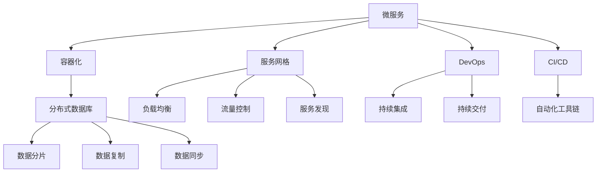

                 

## 1. 背景介绍

在现代社会，信息化的浪潮推动了各行各业的数字化转型。高效、稳定、安全的信息系统成为企业核心竞争力之一。为了应对复杂多变的业务需求，企业不断追求系统的高扩展性。这不仅是技术上的挑战，更是一个多学科融合的系统工程。本文将通过一个实际案例，深入剖析高扩展性系统设计的核心技术和关键点，帮助读者理解如何构建具备高性能、高可靠性和高安全性的高扩展性系统。

### 1.1 系统背景与挑战

一家大型电子商务平台面临着大规模订单处理、库存管理、支付清算等高并发、高吞吐量的业务场景。随着用户基数和订单量的快速增长，系统架构和性能瓶颈逐渐显现。传统单体应用架构无法满足业务需求，需要进行升级和重构。

具体来说，该平台面临以下挑战：

1. **性能瓶颈**：单体应用难以承载大规模并发请求，响应时间较长，用户体验不佳。
2. **资源消耗**：随着用户数的增加，系统资源消耗快速上升，运行成本高昂。
3. **故障容忍度低**：单体应用架构缺乏冗余，一旦系统故障，将导致全站服务中断。
4. **系统耦合度高**：模块之间的依赖关系复杂，难以进行模块化设计和独立扩展。

为了解决上述挑战，平台决定采用微服务架构进行架构升级，实现系统的高扩展性、高可用性和高可靠性。

## 2. 核心概念与联系

### 2.1 核心概念概述

高扩展性系统设计涉及多个关键概念和技术，包括微服务、容器化、服务网格、DevOps、CI/CD、分布式数据库等。这些概念和技术相互关联，共同构建了一个高扩展性、高可靠性的系统架构。

- **微服务**：将单体应用拆分为多个独立服务，每个服务独立部署、独立扩展，提升系统的灵活性和扩展性。
- **容器化**：通过Docker等容器技术，实现服务的快速部署、移植和扩展，提高系统的运行效率和稳定性。
- **服务网格**：如Istio，通过服务注册、负载均衡、流量控制、监控等机制，实现服务的精细管理，提高系统的可用性和可维护性。
- **DevOps**：通过持续集成(CI)和持续交付(CD)，实现快速开发、测试和部署，提升开发效率和发布频率。
- **CI/CD**：通过自动化工具链，如Jenkins、GitLab CI等，实现代码的自动化构建、测试和部署，加速软件开发和交付。
- **分布式数据库**：如MySQL Cluster、Cassandra等，通过数据分片、复制、同步等技术，实现数据的高可用性和高扩展性。

这些概念和技术共同构成了一个高扩展性系统设计的基础架构，通过合理的集成和应用，可以构建出高效、稳定、安全的高扩展性系统。

### 2.2 核心概念间的关系

这些概念和技术之间存在紧密的联系，通过以下Mermaid流程图展示它们之间的关联关系：



该图展示了微服务架构下的各个技术组件及其相互关系。微服务是基础架构的核心，通过容器化、服务网格、DevOps、CI/CD等技术支持，最终实现系统的分布式数据库和数据管理。

## 3. 核心算法原理 & 具体操作步骤

### 3.1 算法原理概述

高扩展性系统设计的核心算法原理主要包括服务拆分、负载均衡、故障容忍、自动化部署等。这些算法原理通过合理的集成和应用，实现系统的可扩展性和高可用性。

### 3.2 算法步骤详解

#### 3.2.1 服务拆分

微服务架构的核心是将单体应用拆分为多个独立的服务。服务拆分的原则是保证服务的独立性和可复用性。具体步骤包括：

1. **功能拆分**：根据业务功能和模块进行拆分，形成独立的服务模块。例如，订单处理服务、库存管理服务、支付清算服务等。
2. **接口定义**：为每个服务定义清晰、统一的接口，确保服务的交互性。
3. **数据拆分**：对数据进行拆分，确保每个服务独立的数据访问和管理。

#### 3.2.2 负载均衡

负载均衡是提升系统高扩展性的重要手段。负载均衡的算法原理包括基于轮询、基于IP散列、基于响应时间等多种负载均衡策略。具体步骤包括：

1. **选择负载均衡算法**：根据系统特点选择合适的负载均衡算法，如轮询、IP散列等。
2. **实现负载均衡器**：通过编写负载均衡器代码或使用现有开源工具，实现负载均衡功能。
3. **监控和优化**：对负载均衡器的性能进行监控和优化，确保系统在高并发情况下依然高效运行。

#### 3.2.3 故障容忍

故障容忍是保障系统高可用性的关键。故障容忍的算法原理包括冗余设计、自动故障转移、故障检测等。具体步骤包括：

1. **冗余设计**：通过多节点部署，确保系统的高可用性和故障容忍度。
2. **自动故障转移**：设计自动故障转移机制，确保服务在高故障情况下依然可以稳定运行。
3. **故障检测**：通过心跳检测、日志监控等手段，及时发现系统故障并进行处理。

#### 3.2.4 自动化部署

自动化部署是提升系统开发和交付效率的关键。自动化部署的算法原理包括持续集成、持续交付、自动化工具链等。具体步骤包括：

1. **选择自动化工具**：根据系统特点选择合适的自动化工具链，如Jenkins、GitLab CI等。
2. **自动化构建**：通过自动化工具链实现代码的自动化构建和测试，确保代码质量。
3. **自动化部署**：通过自动化工具链实现服务的自动化部署和发布，提升部署效率。

### 3.3 算法优缺点

#### 3.3.1 优点

高扩展性系统设计的优点包括：

1. **灵活性**：通过微服务架构和容器化技术，实现服务的独立部署和灵活扩展。
2. **高可用性**：通过负载均衡、故障容忍等技术，提升系统的可用性和稳定性。
3. **高扩展性**：通过自动化部署和持续交付等技术，提升系统的开发和部署效率。

#### 3.3.2 缺点

高扩展性系统设计的缺点包括：

1. **复杂度**：系统架构和部署过程复杂，需要较高的技术门槛。
2. **性能损耗**：服务之间的通信和数据同步可能导致性能损耗。
3. **管理成本**：系统管理和维护成本较高，需要专业的运维团队。

### 3.4 算法应用领域

高扩展性系统设计在多个领域都有广泛应用，包括金融、电商、医疗、物流等。

## 4. 数学模型和公式 & 详细讲解

### 4.1 数学模型构建

高扩展性系统设计的数学模型主要涉及性能分析、资源调度、故障容忍等。以下构建一个简单的高扩展性系统模型。

假设系统有$n$个服务，每个服务的负载为$w_i$，系统总负载为$W$，系统的负载均衡算法为轮询。则每个服务接收的负载为$W/n$。

定义系统的吞吐量为$T$，每个服务的响应时间为$t_i$。则系统的总响应时间为$T=\sum_{i=1}^n t_i$。

### 4.2 公式推导过程

根据上述模型，可以推导出系统的吞吐量公式：

$$
T = \frac{W}{n} \sum_{i=1}^n \frac{1}{t_i}
$$

通过最小化系统总响应时间$T$，可以找到最优的服务数量$n$。

### 4.3 案例分析与讲解

以一个电商平台的订单处理服务为例，分析如何通过优化服务拆分和负载均衡，提升系统的扩展性和可用性。

1. **服务拆分**：将订单处理服务拆分为订单接收服务、订单存储服务、订单处理服务等。每个服务独立部署，实现独立扩展。
2. **负载均衡**：通过Istio等服务网格工具，实现基于轮询的负载均衡，确保每个服务接收均衡的负载。
3. **故障容忍**：通过多节点部署和自动故障转移，提升系统的故障容忍度。
4. **性能优化**：通过数据分片、数据缓存等技术，提升系统的性能和吞吐量。

## 5. 项目实践：代码实例和详细解释说明

### 5.1 开发环境搭建

#### 5.1.1 安装Docker

1. 安装Docker：从官网下载并安装Docker CE或Docker Enterprise。
2. 创建Docker用户：通过`sudo usermod -aG docker $USER`命令将当前用户添加到Docker组。

#### 5.1.2 安装Kubernetes

1. 安装Kubernetes：从官网下载并安装Kubernetes。
2. 安装kubectl：通过`kubectl version`命令检查kubectl版本。

### 5.2 源代码详细实现

#### 5.2.1 容器化

通过Dockerfile定义容器镜像，并进行构建和部署。

```Dockerfile
FROM ubuntu:18.04

# 安装依赖
RUN apt-get update && apt-get install -y curl nginx

# 安装Nginx
RUN curl -o /etc/nginx/nginx.conf.deb https://nginx.org/download/nginx-1.17.8.deb
RUN dpkg -i /etc/nginx/nginx.conf.deb
RUN systemctl start nginx
```

#### 5.2.2 服务网格

通过Istio等工具实现服务网格功能。

```bash
kubectl apply -f <istio-config.yaml>
```

### 5.3 代码解读与分析

#### 5.3.1 容器化

通过Dockerfile实现服务的容器化，Docker容器化可以将应用和其依赖打包到一个独立的镜像中，确保服务的稳定性和可移植性。

#### 5.3.2 服务网格

Istio是一个开源的服务网格，通过服务注册、负载均衡、流量控制等机制，实现服务的精细管理。通过部署Istio，可以实现服务的自动故障转移和负载均衡。

### 5.4 运行结果展示

#### 5.4.1 容器化

通过`docker run`命令运行容器化服务，并查看服务状态。

```bash
docker run --name my-service -d -p 8080:80 my-image
```

#### 5.4.2 服务网格

通过Istio仪表板查看服务状态和流量控制。

```bash
kubectl get svc
kubectl get pod
```

## 6. 实际应用场景

### 6.1 电商订单系统

电商平台面临高并发、高吞吐量的订单处理需求，通过微服务架构和容器化技术，实现系统的可扩展性和高可用性。具体应用场景包括：

1. **订单接收服务**：接收用户订单请求，并进行初步处理。
2. **订单存储服务**：存储订单数据，并提供持久化服务。
3. **订单处理服务**：处理订单详情、支付清算等复杂逻辑。
4. **库存管理服务**：管理库存数据，确保订单的准确性和及时性。

### 6.2 金融交易系统

金融交易系统面临高并发、高吞吐量的交易请求，通过微服务架构和容器化技术，提升系统的扩展性和可用性。具体应用场景包括：

1. **交易服务**：处理交易请求，进行交易记录和清算。
2. **账户服务**：管理用户账户信息，确保交易安全。
3. **风控服务**：进行风险评估和控制，防止欺诈行为。
4. **结算服务**：处理交易结算，确保资金安全。

## 7. 工具和资源推荐

### 7.1 学习资源推荐

1. **《高扩展性系统设计》书籍**：系统介绍高扩展性系统设计的理论基础和实践方法，适合初学者和进阶者阅读。
2. **Kubernetes官方文档**：提供详细的Kubernetes文档和示例代码，帮助开发者快速上手容器化和部署。
3. **Istio官方文档**：提供详细的Istio文档和示例代码，帮助开发者实现服务网格功能。
4. **Docker官方文档**：提供详细的Docker文档和示例代码，帮助开发者实现容器化和容器编排。
5. **DevOps和CI/CD培训课程**：通过在线课程和培训，学习DevOps和CI/CD技术，提升开发和交付效率。

### 7.2 开发工具推荐

1. **Docker**：用于容器化和部署。
2. **Kubernetes**：用于容器编排和调度。
3. **Istio**：用于服务网格和负载均衡。
4. **Jenkins**：用于持续集成和持续交付。
5. **GitLab**：用于代码管理和自动化部署。

### 7.3 相关论文推荐

1. **《微服务架构的挑战与解决方案》**：系统介绍微服务架构的挑战和解决方案。
2. **《高扩展性系统设计》**：介绍高扩展性系统设计的理论和实践。
3. **《DevOps：持续集成和持续交付》**：介绍DevOps和CI/CD技术。
4. **《服务网格：高扩展性系统设计的新范式》**：介绍服务网格和负载均衡技术。
5. **《容器化和分布式系统设计》**：介绍容器化和分布式系统设计。

## 8. 总结：未来发展趋势与挑战

### 8.1 研究成果总结

高扩展性系统设计在高并发、高吞吐量的业务场景中具有广泛应用。通过微服务架构、容器化、服务网格、DevOps、CI/CD等技术的合理集成和应用，可以构建高效、稳定、安全的高扩展性系统。

### 8.2 未来发展趋势

未来，高扩展性系统设计将呈现以下几个发展趋势：

1. **云计算和边缘计算结合**：通过云原生技术和边缘计算，实现更灵活、更高效的系统部署。
2. **自动化和智能化**：通过机器学习和自动化技术，提升系统自动化和智能化水平。
3. **分布式和去中心化**：通过区块链和去中心化技术，实现更安全、更公平的系统架构。
4. **开源和社区化**：通过开源和社区化技术，提升系统开发和部署的灵活性和可扩展性。
5. **生态系统和标准规范**：通过构建良好的生态系统和标准规范，促进系统的互操作性和可维护性。

### 8.3 面临的挑战

尽管高扩展性系统设计取得了显著成果，但在实际应用中仍面临诸多挑战：

1. **复杂度**：系统架构和部署过程复杂，需要较高的技术门槛。
2. **性能损耗**：服务之间的通信和数据同步可能导致性能损耗。
3. **管理成本**：系统管理和维护成本较高，需要专业的运维团队。
4. **安全性**：服务网格和容器化可能导致系统安全性问题。
5. **成本问题**：容器化和云原生技术可能需要较高的初期投资和运维成本。

### 8.4 研究展望

未来，高扩展性系统设计需要在以下几个方面进行深入研究：

1. **可观察性和可视化**：通过可观察性和可视化技术，提升系统的可视化和监控能力。
2. **自动化和智能化**：通过机器学习和自动化技术，提升系统的自动化和智能化水平。
3. **安全性和隐私保护**：通过加密和匿名化技术，提升系统的安全性和隐私保护能力。
4. **分布式和去中心化**：通过区块链和去中心化技术，实现更安全、更公平的系统架构。
5. **开源和社区化**：通过开源和社区化技术，提升系统开发和部署的灵活性和可扩展性。

## 9. 附录：常见问题与解答

### 9.1 Q1: 高扩展性系统设计的核心技术是什么？

A: 高扩展性系统设计的核心技术包括微服务、容器化、服务网格、DevOps、CI/CD等。通过这些技术的合理集成和应用，可以实现系统的可扩展性和高可用性。

### 9.2 Q2: 高扩展性系统设计在实际应用中需要注意哪些问题？

A: 高扩展性系统设计在实际应用中需要注意以下几个问题：

1. **复杂度**：系统架构和部署过程复杂，需要较高的技术门槛。
2. **性能损耗**：服务之间的通信和数据同步可能导致性能损耗。
3. **管理成本**：系统管理和维护成本较高，需要专业的运维团队。
4. **安全性**：服务网格和容器化可能导致系统安全性问题。
5. **成本问题**：容器化和云原生技术可能需要较高的初期投资和运维成本。

### 9.3 Q3: 如何提升高扩展性系统设计的性能？

A: 提升高扩展性系统设计的性能可以从以下几个方面入手：

1. **服务拆分**：通过合理的拆分服务，提高系统的并行处理能力。
2. **负载均衡**：通过合理的负载均衡策略，确保服务的均衡负载。
3. **数据优化**：通过数据缓存、数据分片等技术，优化数据访问和处理。
4. **网络优化**：通过网络优化技术，提升服务的通信效率。
5. **资源优化**：通过资源优化技术，减少服务之间的资源竞争。

### 9.4 Q4: 如何保证高扩展性系统设计的安全性和可靠性？

A: 保证高扩展性系统设计的安全性和可靠性可以从以下几个方面入手：

1. **数据加密**：通过数据加密技术，保护数据的机密性和完整性。
2. **访问控制**：通过访问控制技术，限制数据的访问权限。
3. **异常检测**：通过异常检测技术，及时发现和处理异常行为。
4. **故障容忍**：通过冗余设计和自动故障转移，确保系统的可用性和稳定性。
5. **审计和监控**：通过审计和监控技术，记录和分析系统行为，及时发现和处理问题。

---

作者：禅与计算机程序设计艺术 / Zen and the Art of Computer Programming

