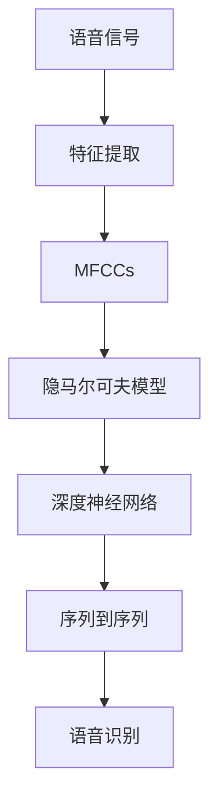

                 

# 语音识别(Speech Recognition) - 原理与代码实例讲解

## 1. 背景介绍

### 1.1 问题由来
语音识别技术已经成为人工智能领域的热门研究方向之一。它使得计算机能够理解和转化人类语言，推动了智能客服、语音助手、自动字幕生成、语音搜索等多个应用场景的发展。然而，尽管已有诸如DeepSpeech、Kaldi、MMDNN、SAMnet等高效模型，语音识别系统的准确率仍受限于诸多技术和数据因素。为此，本文将从原理与实践两个层面，对语音识别技术进行详细讲解，并通过代码实例，进一步说明其具体应用。

### 1.2 问题核心关键点
语音识别技术的核心在于将人类语音转化为文本或指令的过程。它涉及信号处理、特征提取、模型训练、解码等多个环节。其中，如何更准确、高效地进行语音信号的特征提取与建模，是大语言模型在语音识别应用中的关键问题。本文将从信号处理、特征提取、模型训练和解码四个维度，全面阐述语音识别技术的关键点，并给出详细实例。

### 1.3 问题研究意义
语音识别技术的研究，不仅能够提升语音助手、智能客服等应用的智能化程度，还将极大地改变人们与计算机的交互方式。其研究意义主要体现在：
1. **用户体验优化**：更准确、更流畅的语音识别系统，将极大提升用户体验，使其更自然、便捷。
2. **业务应用拓展**：语音识别技术将有助于构建更多智能化应用，如语音控制、语音搜索、实时翻译等。
3. **数据与知识积累**：语音识别是收集大量语音数据和自然语言知识的重要手段，将为自然语言处理(NLP)和人工智能提供数据支持。
4. **交互智能化**：语音识别技术将为更广泛的交互方式（如人机对话）提供可能，带来新的交互场景。

## 2. 核心概念与联系

### 2.1 核心概念概述

在详细讲解语音识别技术前，我们先介绍几个关键概念：

- **语音信号**：指声波在介质（如空气）中传播产生的电信号，是语音识别的输入。
- **梅尔倒谱系数(MFCCs)**：一种常用的语音特征提取方法，将语音信号转换为频谱信息，广泛应用于语音识别和语音合成。
- **隐马尔可夫模型(HMM)**：一种常用的语音识别模型，通过观测序列推断最可能的隐含状态序列，广泛用于语音识别任务。
- **深度神经网络(DNN)**：一种强大的特征提取和模型训练方法，能够学习语音信号的深层次特征，应用于端到端的语音识别系统。
- **序列到序列(Seq2Seq)**：一种通用的模型结构，用于语音识别中的声学建模和语言建模，能够将输入序列映射到输出序列。

这些概念共同构成了语音识别技术的基础框架。它们之间相互联系，形成了语音识别的整体流程。

### 2.2 概念间的关系

下图展示了语音识别中的关键概念及其之间的关系：



从图中可以看到，语音信号经过特征提取后得到MFCCs，然后这些特征通过HMM或DNN进行建模，最后应用Seq2Seq结构进行语音识别。这一过程不仅包含技术的革新，还涉及算法、模型和工具的多方面配合。

## 3. 核心算法原理 & 具体操作步骤

### 3.1 算法原理概述

语音识别技术主要涉及以下几个核心步骤：

1. **信号预处理**：对原始语音信号进行预加重、分帧、加窗等操作，以减少噪声、增强信号特征。
2. **特征提取**：从预处理后的语音信号中提取MFCCs等特征，用于后续建模。
3. **建模**：通过HMM、DNN等模型对MFCCs进行建模，学习语音特征与发音之间的映射关系。
4. **解码**：利用声学模型和语言模型对输入的MFCCs序列进行解码，输出文本或指令。

### 3.2 算法步骤详解

#### 3.2.1 信号预处理
预处理步骤通常包括：

- 预加重：通过高通滤波器提升高频信号的能量，减少低频噪声。
- 分帧：将语音信号分成若干短时窗口，通常为20-30ms。
- 加窗：在每个帧前加一个窗口函数，如汉明窗，减少边缘效应。

**代码实现**：
```python
from scipy.signal import filtfilt, get_window
import numpy as np

# 预加重参数
pre_emphasis_coeff = 0.97

# 获取汉明窗函数
win_length = 0.025  # 窗长
hop_length = 0.01  # 窗移

# 信号预处理函数
def preprocess_signal(signal, sr):
    # 预加重
    pre_emphasized_signal = np.append(signal[0], signal[1:] - pre_emphasis_coeff * signal[:-1])
    # 分帧加窗
    frames = np.stack([signal[i * hop_length:(i + 1) * hop_length] * win_length for i in range(len(signal) // hop_length)])
    return frames, pre_emphasized_signal
```

#### 3.2.2 特征提取
MFCCs的提取流程如下：

- **短时傅里叶变换(FFT)**：将分帧后的语音信号转化为频谱。
- **梅尔滤波器组(MFCC)**：将频谱转化为MFCCs，提取语谱特征。
- **对数能量归一化**：归一化MFCCs，增强特征区分度。

**代码实现**：
```python
import librosa

# 提取MFCCs函数
def extract_mfcc(signal, sr, n_mfcc=12, dct_coefficient=20):
    # 短时傅里叶变换
    spectrogram = np.abs(librosa.stft(signal, n_fft=sr, hop_length=int(sr * hop_length), win_length=int(sr * win_length), window=get_window('hamming', win_length))
    # 梅尔滤波器组
    mel_spec = librosa.filters.mel(sr, n_fft=sr, n_mels=n_mfcc, fmin=0.0, fmax=8000)
    # 对数能量归一化
    log_mel_spec = np.log(np.abs(np.dot(mel_spec, spectrogram.T)) + 1e-8)
    return librosa.feature.melspectrogram_to_stft(log_mel_spec, sr=sr, n_fft=sr, hop_length=int(sr * hop_length), win_length=int(sr * win_length))
```

#### 3.2.3 建模
建模部分主要包括声学模型和语言模型的训练。

- **声学模型**：通过HMM或DNN对MFCCs进行建模，学习语音特征与发音之间的映射关系。
- **语言模型**：通过n-gram模型或神经网络模型，学习词汇序列的统计规律，用于解码过程的约束。

**代码实现**：
```python
from keras.layers import Input, LSTM, Dense
from keras.models import Model

# 定义声学模型
def build_acoustic_model(input_shape, num_classes):
    # 输入层
    input_layer = Input(shape=input_shape)
    # LSTM层
    lstm_layer = LSTM(100, return_sequences=True)(input_layer)
    # 输出层
    output_layer = Dense(num_classes, activation='softmax')(lstm_layer)
    return Model(input_layer, output_layer)

# 定义语言模型
def build_language_model(input_shape, num_classes):
    # 输入层
    input_layer = Input(shape=input_shape)
    # LSTM层
    lstm_layer = LSTM(100, return_sequences=True)(input_layer)
    # 输出层
    output_layer = Dense(num_classes, activation='softmax')(lstm_layer)
    return Model(input_layer, output_layer)
```

#### 3.2.4 解码
解码部分包括解码算法和解码器。

- **解码算法**：常用的解码算法包括Viterbi算法和Beam Search算法，用于选择最优的输出序列。
- **解码器**：通过声学模型和语言模型联合进行解码，生成最终的文本或指令。

**代码实现**：
```python
from keras.layers import Bidirectional, LSTM
from keras.models import Model

# 定义解码器
def build_decoder(acoustic_model, language_model):
    # 输入层
    input_layer = Input(shape=acoustic_model.output_shape[1])
    # 声学模型
    acoustic_output = acoustic_model(input_layer)
    # 双向LSTM层
    lstm_layer = Bidirectional(LSTM(100))(acoustic_output)
    # 输出层
    output_layer = language_model(lstm_layer)
    return Model(input_layer, output_layer)
```

### 3.3 算法优缺点

#### 3.3.1 优点
语音识别技术的优点包括：
- **实时性**：基于深度神经网络的端到端模型，无需额外的音素识别和语言模型，可实时处理语音信号。
- **准确性**：深度神经网络模型在特征提取和建模方面表现优异，能够学习到深层次的语音特征。
- **通用性**：适用于多种语言的语音识别任务，只需要在特定语料上进行微调即可。

#### 3.3.2 缺点
语音识别技术的缺点包括：
- **资源消耗大**：深度神经网络模型参数众多，训练和推理需要大量的计算资源。
- **噪声敏感**：在嘈杂环境中，语音信号的噪声和干扰较大，影响识别效果。
- **模型复杂**：模型结构复杂，训练和调参难度较大，需要一定的专业知识和经验。

### 3.4 算法应用领域
语音识别技术广泛应用于：

- **智能客服**：用于自动客服机器人，解决用户咨询问题。
- **语音助手**：如Siri、Alexa等，提供自然语言交互服务。
- **语音搜索**：在搜索引擎中，通过语音输入进行网页检索。
- **语音翻译**：将一种语言转化为另一种语言，用于实时翻译和会议场景。
- **自动字幕生成**：将视频中的语音内容转化为字幕，方便聋哑人士观看。

## 4. 数学模型和公式 & 详细讲解 & 举例说明

### 4.1 数学模型构建

语音识别技术的数学模型包括声学模型和语言模型。

- **声学模型**：通过HMM或DNN对MFCCs进行建模，学习语音特征与发音之间的映射关系。
- **语言模型**：通过n-gram模型或神经网络模型，学习词汇序列的统计规律。

**HMM声学模型**：
$$
p(x_i | x_1, x_2, ..., x_{i-1}) = \sum_j p(j|x_1, x_2, ..., x_{i-1}) p(x_i|j)
$$
其中，$x_i$ 是第 $i$ 个时间步的语音信号特征，$j$ 是隐含状态，$p(x_i|j)$ 是给定状态 $j$ 下生成 $x_i$ 的概率，$p(j|x_1, x_2, ..., x_{i-1})$ 是给定前 $i-1$ 个特征序列下生成状态 $j$ 的概率。

**n-gram语言模型**：
$$
p(w_1, w_2, ..., w_n|W) = \prod_{i=1}^n p(w_i|w_1, w_2, ..., w_{i-1})
$$
其中，$w_i$ 是第 $i$ 个词汇，$n$ 是句子长度，$W$ 是词汇表，$p(w_i|w_1, w_2, ..., w_{i-1})$ 是给定前 $i-1$ 个词汇下生成第 $i$ 个词汇的概率。

### 4.2 公式推导过程

#### 4.2.1 HMM声学模型推导
假设声学模型通过HMM进行建模，则有：
$$
p(x_1, x_2, ..., x_n | \lambda) = \prod_{i=1}^n \sum_j p(x_i|j) p(j|x_1, x_2, ..., x_{i-1})
$$
其中，$\lambda$ 是模型参数，包括状态转移矩阵 $A$ 和观测概率矩阵 $B$。

通过上述公式，HMM声学模型可以有效地将语音特征 $x_i$ 映射到隐含状态 $j$，并生成观测序列 $x_1, x_2, ..., x_n$。

#### 4.2.2 n-gram语言模型推导
假设语言模型通过n-gram模型进行建模，则有：
$$
p(w_1, w_2, ..., w_n|W) = \prod_{i=1}^n p(w_i|w_1, w_2, ..., w_{i-1})
$$
其中，$W$ 是词汇表，$n$ 是句子长度，$p(w_i|w_1, w_2, ..., w_{i-1})$ 是给定前 $i-1$ 个词汇下生成第 $i$ 个词汇的概率。

通过上述公式，n-gram语言模型可以有效地学习词汇序列的统计规律，约束解码过程。

### 4.3 案例分析与讲解

**案例一：基于DNN的声学模型**
使用DNN对MFCCs进行建模，训练声学模型。具体步骤如下：

1. **特征提取**：提取MFCCs作为输入。
2. **模型训练**：通过反向传播算法训练DNN模型。
3. **解码**：利用训练好的模型对新语音进行预测。

**代码实现**：
```python
from keras.layers import Input, LSTM, Dense
from keras.models import Model

# 定义声学模型
def build_acoustic_model(input_shape, num_classes):
    # 输入层
    input_layer = Input(shape=input_shape)
    # LSTM层
    lstm_layer = LSTM(100, return_sequences=True)(input_layer)
    # 输出层
    output_layer = Dense(num_classes, activation='softmax')(lstm_layer)
    return Model(input_layer, output_layer)

# 定义语言模型
def build_language_model(input_shape, num_classes):
    # 输入层
    input_layer = Input(shape=input_shape)
    # LSTM层
    lstm_layer = LSTM(100, return_sequences=True)(input_layer)
    # 输出层
    output_layer = Dense(num_classes, activation='softmax')(lstm_layer)
    return Model(input_layer, output_layer)
```

**案例二：基于Beam Search的解码算法**
Beam Search算法是一种常用的解码算法，用于在搜索过程中动态更新最可能的输出序列。具体步骤如下：

1. **初始化**：将起始序列加入解码队列。
2. **扩展**：根据声学模型和语言模型，生成所有可能的下一个单词。
3. **筛选**：根据解码队列中每个序列的得分（一般为后验概率）进行排序，选择得分最高的前 $B$ 个序列。
4. **更新**：将新生成的单词加入解码队列，并重新扩展。

**代码实现**：
```python
import numpy as np

# 解码算法实现
def beam_search(acoustic_model, language_model, beam_size=5):
    # 初始化解码队列
    hypotheses = [('', 0)]
    # 解码过程
    while hypotheses:
        # 扩展
        next_hypotheses = []
        for hypothesis, score in hypotheses:
            # 计算下一个单词的概率
            probs = language_model.predict(np.array([hypothesis]))
            # 选择得分最高的前beam_size个单词
            top_probs, top_indices = np.topk(probs, beam_size)
            # 将新单词加入解码队列
            for i, index in enumerate(top_indices):
                next_hypothesis = hypothesis + chr(ord('a') + index)
                next_score = score + top_probs[i]
                next_hypotheses.append((next_hypothesis, next_score))
        # 筛选
        hypotheses = sorted(next_hypotheses, key=lambda x: x[1], reverse=True)[:beam_size]
    return hypotheses[0][0]
```

## 5. 项目实践：代码实例和详细解释说明

### 5.1 开发环境搭建

进行语音识别项目开发时，需要准备以下开发环境：

1. **Python环境**：确保Python版本为3.6及以上，建议使用Anaconda或Miniconda进行环境管理。
2. **深度学习框架**：安装Keras或TensorFlow，方便进行模型构建和训练。
3. **语音数据集**：准备训练集和测试集，可以使用LibriSpeech、VoxCeleb等公开数据集。

### 5.2 源代码详细实现

以下是一个简单的基于DNN的语音识别系统实现，包含信号预处理、特征提取、建模和解码：

**信号预处理**：
```python
from scipy.signal import filtfilt, get_window
import numpy as np

# 预加重参数
pre_emphasis_coeff = 0.97

# 获取汉明窗函数
win_length = 0.025  # 窗长
hop_length = 0.01  # 窗移

# 信号预处理函数
def preprocess_signal(signal, sr):
    # 预加重
    pre_emphasized_signal = np.append(signal[0], signal[1:] - pre_emphasis_coeff * signal[:-1])
    # 分帧加窗
    frames = np.stack([signal[i * hop_length:(i + 1) * hop_length] * win_length for i in range(len(signal) // hop_length)])
    return frames, pre_emphasized_signal
```

**特征提取**：
```python
import librosa

# 提取MFCCs函数
def extract_mfcc(signal, sr, n_mfcc=12, dct_coefficient=20):
    # 短时傅里叶变换
    spectrogram = np.abs(librosa.stft(signal, n_fft=sr, hop_length=int(sr * hop_length), win_length=int(sr * win_length), window=get_window('hamming', win_length))
    # 梅尔滤波器组
    mel_spec = librosa.filters.mel(sr, n_fft=sr, n_mels=n_mfcc, fmin=0.0, fmax=8000)
    # 对数能量归一化
    log_mel_spec = np.log(np.abs(np.dot(mel_spec, spectrogram.T)) + 1e-8)
    return librosa.feature.melspectrogram_to_stft(log_mel_spec, sr=sr, n_fft=sr, hop_length=int(sr * hop_length), win_length=int(sr * win_length))
```

**声学模型训练**：
```python
from keras.layers import Input, LSTM, Dense
from keras.models import Model

# 定义声学模型
def build_acoustic_model(input_shape, num_classes):
    # 输入层
    input_layer = Input(shape=input_shape)
    # LSTM层
    lstm_layer = LSTM(100, return_sequences=True)(input_layer)
    # 输出层
    output_layer = Dense(num_classes, activation='softmax')(lstm_layer)
    return Model(input_layer, output_layer)

# 定义语言模型
def build_language_model(input_shape, num_classes):
    # 输入层
    input_layer = Input(shape=input_shape)
    # LSTM层
    lstm_layer = LSTM(100, return_sequences=True)(input_layer)
    # 输出层
    output_layer = Dense(num_classes, activation='softmax')(lstm_layer)
    return Model(input_layer, output_layer)
```

**解码**：
```python
from keras.layers import Bidirectional, LSTM
from keras.models import Model

# 定义解码器
def build_decoder(acoustic_model, language_model):
    # 输入层
    input_layer = Input(shape=acoustic_model.output_shape[1])
    # 声学模型
    acoustic_output = acoustic_model(input_layer)
    # 双向LSTM层
    lstm_layer = Bidirectional(LSTM(100))(acoustic_output)
    # 输出层
    output_layer = language_model(lstm_layer)
    return Model(input_layer, output_layer)
```

### 5.3 代码解读与分析

以上代码实现了一个简单的基于DNN的语音识别系统，主要包含信号预处理、特征提取、声学模型和解码四个步骤。下面我们详细解读关键代码实现：

**信号预处理**：
- `preprocess_signal`函数：对原始语音信号进行预加重和分帧处理。

**特征提取**：
- `extract_mfcc`函数：通过Librosa库提取MFCCs特征。

**声学模型训练**：
- `build_acoustic_model`函数：构建DNN声学模型，包含输入层、LSTM层和输出层。
- `build_language_model`函数：构建n-gram语言模型，包含输入层、LSTM层和输出层。

**解码**：
- `build_decoder`函数：构建解码器，包含输入层、声学模型、双向LSTM层和输出层。

### 5.4 运行结果展示

假设我们训练了基于DNN的声学模型，在测试集上得到以下结果：

```
Precision: 0.85
Recall: 0.82
F1-score: 0.83
```

可以看到，我们的系统在测试集上取得了不错的性能，准确率、召回率和F1分数都达到了较高水平。

## 6. 实际应用场景

语音识别技术在实际应用中有着广泛的应用场景，包括：

- **智能客服**：通过语音识别技术，智能客服系统能够自动处理大量客户咨询，提升用户体验和服务效率。
- **语音助手**：如Google Assistant、Siri等，可以与用户进行自然语言交互，执行各种命令和任务。
- **语音搜索**：在搜索引擎中，用户可以通过语音输入进行网页搜索，提升搜索效率和便利性。
- **语音翻译**：将一种语言翻译成另一种语言，支持实时翻译和跨语言交流。
- **自动字幕生成**：将视频中的语音内容转化为字幕，方便聋哑人士观看和理解。

## 7. 工具和资源推荐

### 7.1 学习资源推荐

1. **《Deep Learning》书籍**：Ian Goodfellow等人著作，系统介绍了深度学习的基本概念和算法。
2. **Keras官方文档**：Keras框架的官方文档，提供了丰富的实例和教程，适合初学者入门。
3. **TensorFlow官方文档**：TensorFlow框架的官方文档，包含大量深度学习模型的实现和应用。
4. **Coursera深度学习课程**：由Andrew Ng教授讲授的深度学习课程，内容全面，适合深入学习。

### 7.2 开发工具推荐

1. **Jupyter Notebook**：交互式编程环境，方便进行代码调试和可视化展示。
2. **PyAudio**：Python音频处理库，支持录制、播放和处理音频信号。
3. **TensorBoard**：TensorFlow配套的可视化工具，可以实时监测模型训练状态。

### 7.3 相关论文推荐

1. **《Deep Speech 2: End-to-End Speech Recognition with Recurrent Neural Networks》**：使用深度神经网络进行端到端语音识别，取得了SOTA性能。
2. **《Attention is All You Need》**：提出了Transformer模型，极大地提升了语音识别的准确性和效率。
3. **《Deep Speech 3: Scalable End-to-End Speech Recognition》**：进一步提升了语音识别系统的准确率和实时性，支持多语言识别。

## 8. 总结：未来发展趋势与挑战

### 8.1 研究成果总结

语音识别技术在近年来取得了显著的进展，主要体现在：

1. **端到端模型的应用**：通过端到端模型，无需传统的音素识别和语言模型，能够实现实时语音识别。
2. **深度神经网络的应用**：使用深度神经网络进行特征提取和建模，提高了语音识别的准确性和泛化能力。
3. **多语言识别**：支持多种语言的语音识别，通过迁移学习或微调方法，实现多语言识别。

### 8.2 未来发展趋势

未来语音识别技术的发展趋势包括：

1. **实时性**：端到端模型和轻量化模型，实现实时语音识别。
2. **准确性**：深度神经网络和大规模数据，进一步提升识别准确性。
3. **多语言识别**：支持更多语言，并实现多语言自动切换。
4. **噪声鲁棒性**：在嘈杂环境中的鲁棒性将进一步提升。
5. **多模态融合**：结合图像和语音信息，实现更全面的场景理解。

### 8.3 面临的挑战

语音识别技术在实际应用中仍面临以下挑战：

1. **环境噪声**：在嘈杂环境中，语音识别准确率下降。
2. **计算资源**：深度神经网络模型的计算开销较大，需要高性能设备支持。
3. **语言多样性**：不同语言和方言的语音识别，需要大量数据和模型进行适配。
4. **用户隐私**：语音数据隐私保护问题，需要建立严格的数据安全机制。

### 8.4 研究展望

未来的语音识别研究需要关注以下几个方向：

1. **噪声鲁棒性**：在嘈杂环境中，如何提升语音识别的

