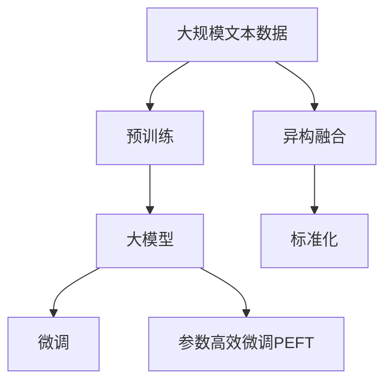
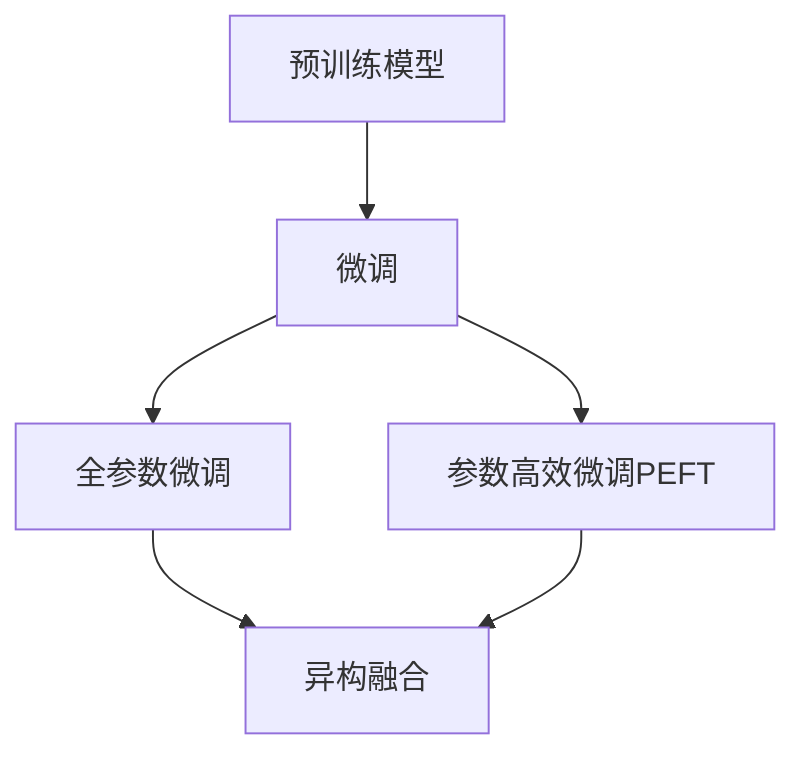
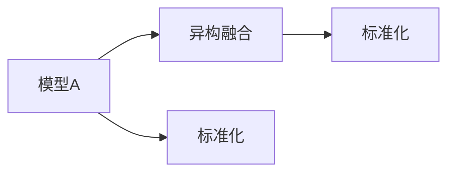

                 

## 1. 背景介绍

近年来，随着深度学习技术的快速发展，跨研究社区的基础模型同质化（Homogenization of Foundational Models）现象逐渐凸显。无论是自然语言处理（NLP）、计算机视觉（CV）、语音识别（ASR）等领域的最新进展，还是人工智能（AI）、机器学习（ML）、数据科学（Data Science）等方向的研究，都越来越多地基于一系列“大模型”（Large Models）进行探讨和实践。这些大模型往往拥有庞大的参数规模、丰富的语义表达能力以及广泛的迁移学习特性，成为引领技术趋势的关键因素。

### 1.1 问题由来
在AI和ML领域，跨领域的基础模型同质化现象尤其显著。以BERT、GPT等模型为代表的一系列大模型，通过在大规模无标签数据上进行自监督预训练，学习到了丰富的语言和视觉语义知识，并具备了良好的迁移学习特性。这些模型通过在大规模任务上微调，取得了显著的性能提升，引发了广泛关注和积极应用。然而，这种基于大模型的范式也带来了新的挑战和问题。

**挑战一：** 不同研究社区对基础模型的需求和应用场景存在差异，这导致不同社区对模型的优化目标和性能指标存在显著差异。例如，NLP领域的模型需要具备良好的语义理解和生成能力，而CV领域的模型则需要具备强大的图像识别和分类能力。

**挑战二：** 大模型往往具有极高的计算和存储需求，这使得模型训练和推理的成本较高，限制了模型的应用范围和部署灵活性。如何在保证模型性能的同时，降低其计算和存储成本，成为一大难题。

**挑战三：** 基础模型的同质化可能导致不同研究社区之间的知识鸿沟扩大，降低了研究的协同性和创新性。如何在保持模型基础能力的前提下，促进不同社区之间的知识交流和融合，提升整体研究水平，是一个亟待解决的问题。

### 1.2 问题核心关键点
针对上述挑战，本文将聚焦于基础模型的同质化现象，探讨其背后的原因、影响以及应对策略。具体来说，我们将从以下几个方面进行深入分析：

- **同质化的成因**：分析基础模型同质化的原因，包括预训练数据的选择、模型架构的设计、优化目标的设定等。
- **同质化的影响**：评估基础模型同质化对研究社区、应用场景以及整体AI发展的潜在影响。
- **应对策略**：提出针对同质化现象的应对策略，包括模型优化、异构融合、标准化等方向。

通过深入探讨这些关键点，本文旨在为读者提供一个全面的视角，帮助理解基础模型同质化的现象及其带来的机遇与挑战。

## 2. 核心概念与联系

### 2.1 核心概念概述

为更好地理解基础模型同质化现象，本节将介绍几个密切相关的核心概念：

- **大模型（Large Models）**：以自回归（如GPT）或自编码（如BERT）模型为代表的大规模预训练语言模型。通过在大规模无标签文本语料上进行预训练，学习到了丰富的语言知识和常识，具备强大的语言理解和生成能力。

- **预训练（Pre-training）**：指在大规模无标签文本语料上，通过自监督学习任务训练通用语言模型的过程。常见的预训练任务包括言语建模、遮挡语言模型等。预训练使得模型学习到语言的通用表示。

- **微调（Fine-tuning）**：指在预训练模型的基础上，使用下游任务的少量标注数据，通过有监督学习优化模型在特定任务上的性能。通常只需要调整顶层分类器或解码器，并以较小的学习率更新全部或部分的模型参数。

- **迁移学习（Transfer Learning）**：指将一个领域学习到的知识，迁移应用到另一个不同但相关的领域的学习范式。大模型的预训练-微调过程即是一种典型的迁移学习方式。

- **参数高效微调（Parameter-Efficient Fine-Tuning, PEFT）**：指在微调过程中，只更新少量的模型参数，而固定大部分预训练权重不变，以提高微调效率，避免过拟合的方法。

- **异构融合（Heterogeneous Integration）**：指将不同架构、不同领域的模型进行融合，形成具有更强适应性和多样性的新模型。

- **标准化（Standardization）**：指在基础模型设计、训练、评估等环节建立统一的规范和标准，促进模型的可复用性和互操作性。

这些核心概念之间的逻辑关系可以通过以下Mermaid流程图来展示：



这个流程图展示了大模型同质化的核心概念及其之间的关系：

1. 大模型通过预训练获得基础能力。
2. 微调是对预训练模型进行任务特定的优化，可以分为全参数微调和参数高效微调（PEFT）。
3. 异构融合是指将不同架构、不同领域的模型进行融合，形成具有更强适应性和多样性的新模型。
4. 标准化是在基础模型设计、训练、评估等环节建立统一的规范和标准，促进模型的可复用性和互操作性。

### 2.2 概念间的关系

这些核心概念之间存在着紧密的联系，形成了大模型同质化的完整生态系统。下面我们通过几个Mermaid流程图来展示这些概念之间的关系。

#### 2.2.1 大模型与预训练


这个流程图展示了大模型的预训练-微调过程，以及其与异构融合和标准化的关系。

#### 2.2.2 微调与异构融合



这个流程图展示了微调的两种方式，及其与异构融合的关系。

#### 2.2.3 异构融合与标准化



这个流程图展示了异构融合和标准化的关系。

### 2.3 核心概念的整体架构

最后，我们用一个综合的流程图来展示这些核心概念在大模型同质化过程中的整体架构：


这个综合流程图展示了从预训练到微调，再到异构融合和标准化的完整过程。大模型首先在大规模文本数据上进行预训练，然后通过微调（包括全参数微调和参数高效微调）或异构融合，形成新的模型架构。最后，通过标准化技术，使模型具备更高的可复用性和互操作性。通过这些流程图，我们可以更清晰地理解大模型同质化过程中各个核心概念的关系和作用，为后续深入讨论具体的同质化现象及其应对策略奠定基础。

## 3. 核心算法原理 & 具体操作步骤
### 3.1 算法原理概述

基础模型同质化现象的背后，是深度学习模型在预训练和微调过程中的相似性和趋同性。这种同质化现象的形成，主要受到以下几个因素的影响：

- **预训练数据的选择**：为了提高模型的泛化能力，许多大模型使用大规模的无标签数据进行预训练。这些数据往往具有相似的语义特征和分布特性，导致模型学习到了相似的语义表示。

- **模型架构的设计**：目前主流的大模型主要采用Transformer等自注意力机制架构，这些架构设计具有相似性，进一步强化了模型之间的同质化趋势。

- **优化目标的设定**：不同的研究社区对模型的优化目标和性能指标存在差异，但在许多情况下，研究者会选择相似的优化目标和算法，导致模型的训练过程和收敛特性趋同。

### 3.2 算法步骤详解

基于上述分析，我们以BERT和GPT为例，详细介绍基础模型同质化的核心算法步骤：

#### 3.2.1 预训练步骤

预训练步骤主要包括以下几个关键步骤：

1. **数据准备**：收集大规模的无标签文本数据，如维基百科、新闻、小说等。

2. **模型定义**：定义预训练模型，如BERT或GPT等。

3. **预训练任务**：选择自监督预训练任务，如 masked language modeling（MLM）、next sentence prediction（NSP）等。

4. **模型训练**：使用预训练数据对模型进行训练，最小化预训练损失函数。

5. **模型评估**：在预训练数据上评估模型的性能，如perplexity等指标。

#### 3.2.2 微调步骤

微调步骤主要包括以下几个关键步骤：

1. **任务适配**：根据下游任务，设计合适的任务适配层，如分类层、回归层等。

2. **模型加载**：加载预训练模型，如BERT或GPT等。

3. **数据准备**：收集下游任务的标注数据，划分为训练集、验证集和测试集。

4. **模型微调**：使用下游任务的标注数据对模型进行微调，最小化任务损失函数。

5. **模型评估**：在验证集和测试集上评估微调后的模型性能。

#### 3.2.3 异构融合步骤

异构融合步骤主要包括以下几个关键步骤：

1. **模型选择**：选择不同架构、不同领域的预训练模型，如BERT、GPT、ResNet等。

2. **模型融合**：将不同模型的输出进行融合，如通过加权平均、拼接等方式。

3. **模型训练**：使用融合后的模型进行训练，最小化任务损失函数。

4. **模型评估**：在验证集和测试集上评估融合后的模型性能。

### 3.3 算法优缺点

基础模型同质化方法具有以下优点：

- **高效性**：通过共享预训练模型的权重，可以在较小的数据集上快速取得良好的性能。

- **可复用性**：预训练模型可以在不同的任务上进行微调，具有良好的泛化能力。

- **互操作性**：不同模型之间的接口和API标准化，使得模型之间的互操作性更强。

然而，基础模型同质化方法也存在一些缺点：

- **灵活性不足**：由于模型架构和优化目标的趋同性，模型难以适应特定的应用场景和需求。

- **泛化能力差**：不同领域的预训练数据和任务特性不同，同质化模型难以在所有领域取得理想效果。

- **计算资源消耗高**：大规模预训练模型和微调过程需要大量的计算资源，成本较高。

### 3.4 算法应用领域

基础模型同质化方法已经在多个领域得到了广泛应用，例如：

- **自然语言处理（NLP）**：在问答系统、文本分类、情感分析等任务上，基础模型同质化方法取得了显著的效果。

- **计算机视觉（CV）**：在图像识别、目标检测、图像生成等任务上，基础模型同质化方法展示了强大的能力。

- **语音识别（ASR）**：在语音识别、语音合成等任务上，基础模型同质化方法实现了良好的性能。

- **自动驾驶**：在自动驾驶的感知和决策任务中，基础模型同质化方法提供了高效可靠的解决方案。

- **医疗诊断**：在医学影像分析、病历分析等任务上，基础模型同质化方法展示了强大的潜力。

## 4. 数学模型和公式 & 详细讲解 & 举例说明
### 4.1 数学模型构建

在基础模型同质化的过程中，数学模型和公式的设计至关重要。以下是几个关键模型的构建和公式推导：

#### 4.1.1 预训练模型

以BERT为例，其预训练模型主要采用Transformer架构，并使用掩码语言建模（MLM）和下一句预测（NSP）作为预训练任务。其数学模型如下：

$$
M(x) = \text{BERT}(x) = \text{MLP}(\text{LayerNorm}(\text{MultiHeadAttention}(\text{LayerNorm}(\text{PositionalEncoding}(x) + \text{Embedding}(x)) + \text{FFN}(\text{LayerNorm}(\text{MultiHeadAttention}(\text{LayerNorm}(\text{PositionalEncoding}(x) + \text{Embedding}(x)))))
$$

其中，MLP为多层感知器，FFN为全连接层，LayerNorm为层归一化，PositionalEncoding为位置编码，Embedding为词嵌入层。

#### 4.1.2 微调模型

以BERT为例，其微调模型主要采用分类任务，使用交叉熵损失函数进行训练。其数学模型如下：

$$
\mathcal{L}(\theta) = \frac{1}{N}\sum_{i=1}^N \text{CE}(p(y_i | M(x_i)), \hat{y_i})
$$

其中，$N$为样本数量，$x_i$为输入，$y_i$为真实标签，$\hat{y_i}$为预测标签，$M(x)$为预训练模型，$CE$为交叉熵损失函数。

#### 4.1.3 异构融合模型

以BERT和ResNet为例，其异构融合模型主要通过拼接和加权平均的方式实现。其数学模型如下：

$$
M_{\text{fused}}(x) = \alpha \cdot M_{BERT}(x) + (1-\alpha) \cdot M_{ResNet}(x)
$$

其中，$\alpha$为融合系数，$M_{BERT}(x)$为BERT模型的输出，$M_{ResNet}(x)$为ResNet模型的输出。

### 4.2 公式推导过程

以BERT微调为例，其数学推导过程如下：

1. **输入编码**：将输入序列$x$编码成BERT模型的嵌入表示$x^e$。

2. **自注意力机制**：通过多头的自注意力机制，计算序列中各词之间的注意力关系。

3. **前向网络**：通过全连接层和激活函数，将注意力机制的输出转化为中间表示。

4. **输出层**：通过线性层和softmax函数，将中间表示转化为预测概率分布。

5. **损失函数**：使用交叉熵损失函数计算预测值与真实标签之间的差距。

6. **模型优化**：通过反向传播算法计算梯度，并使用优化器更新模型参数。

### 4.3 案例分析与讲解

以BERT微调为例，其案例分析如下：

1. **任务适配层**：根据分类任务，在BERT模型的顶层添加一个线性分类器，并使用softmax函数计算预测概率。

2. **数据准备**：收集下游任务的标注数据，划分为训练集、验证集和测试集。

3. **模型加载**：加载预训练的BERT模型，并冻结除分类器以外的所有层。

4. **模型微调**：使用下游任务的标注数据对模型进行微调，最小化交叉熵损失函数。

5. **模型评估**：在验证集和测试集上评估微调后的模型性能，如准确率、F1分数等。

## 5. 项目实践：代码实例和详细解释说明
### 5.1 开发环境搭建

在进行基础模型同质化实践前，我们需要准备好开发环境。以下是使用Python进行PyTorch开发的环境配置流程：

1. 安装Anaconda：从官网下载并安装Anaconda，用于创建独立的Python环境。

2. 创建并激活虚拟环境：
```bash
conda create -n pytorch-env python=3.8 
conda activate pytorch-env
```

3. 安装PyTorch：根据CUDA版本，从官网获取对应的安装命令。例如：
```bash
conda install pytorch torchvision torchaudio cudatoolkit=11.1 -c pytorch -c conda-forge
```

4. 安装Transformers库：
```bash
pip install transformers
```

5. 安装各类工具包：
```bash
pip install numpy pandas scikit-learn matplotlib tqdm jupyter notebook ipython
```

完成上述步骤后，即可在`pytorch-env`环境中开始同质化实践。

### 5.2 源代码详细实现

这里我们以BERT微调为例，给出使用Transformers库进行NLP任务微调的PyTorch代码实现。

首先，定义任务适配层：

```python
from transformers import BertForSequenceClassification

class CustomModel(BertForSequenceClassification):
    def __init__(self, config):
        super(CustomModel, self).__init__(config)
        self.num_labels = config.num_labels

    def forward(self, input_ids, attention_mask=None, token_type_ids=None, labels=None):
        outputs = super(CustomModel, self).forward(input_ids, attention_mask=attention_mask, token_type_ids=token_type_ids)
        sequence_output = outputs[0]
        logits = self.classifier(sequence_output)
        return logits
```

然后，定义训练和评估函数：

```python
from transformers import AdamW
from torch.utils.data import DataLoader
from tqdm import tqdm
from sklearn.metrics import accuracy_score, f1_score

device = torch.device('cuda') if torch.cuda.is_available() else torch.device('cpu')

def train_epoch(model, train_dataset, optimizer):
    dataloader = DataLoader(train_dataset, batch_size=32, shuffle=True)
    model.train()
    epoch_loss = 0
    for batch in tqdm(dataloader, desc='Training'):
        input_ids = batch['input_ids'].to(device)
        attention_mask = batch['attention_mask'].to(device)
        labels = batch['labels'].to(device)
        model.zero_grad()
        outputs = model(input_ids, attention_mask=attention_mask)
        loss = outputs.loss
        epoch_loss += loss.item()
        loss.backward()
        optimizer.step()
    return epoch_loss / len(dataloader)

def evaluate(model, dev_dataset):
    dataloader = DataLoader(dev_dataset, batch_size=32)
    model.eval()
    preds, labels = [], []
    with torch.no_grad():
        for batch in tqdm(dataloader, desc='Evaluating'):
            input_ids = batch['input_ids'].to(device)
            attention_mask = batch['attention_mask'].to(device)
            labels = batch['labels'].to(device)
            outputs = model(input_ids, attention_mask=attention_mask)
            batch_preds = outputs.argmax(dim=2).to('cpu').tolist()
            batch_labels = batch['labels'].to('cpu').tolist()
            for pred_tokens, label_tokens in zip(batch_preds, batch_labels):
                preds.append(pred_tokens[:len(label_tokens)])
                labels.append(label_tokens)
    accuracy = accuracy_score(labels, preds)
    f1 = f1_score(labels, preds, average='macro')
    return accuracy, f1
```

最后，启动训练流程并在测试集上评估：

```python
epochs = 5
batch_size = 32

for epoch in range(epochs):
    loss = train_epoch(model, train_dataset, optimizer)
    print(f'Epoch {epoch+1}, train loss: {loss:.3f}')
    
    print(f'Epoch {epoch+1}, dev results:')
    accuracy, f1 = evaluate(model, dev_dataset)
    print(f'Accuracy: {accuracy:.2f}, F1: {f1:.2f}')

print('Test results:')
accuracy, f1 = evaluate(model, test_dataset)
print(f'Accuracy: {accuracy:.2f}, F1: {f1:.2f}')
```

以上就是使用PyTorch对BERT进行NLP任务微调的完整代码实现。可以看到，得益于Transformers库的强大封装，我们可以用相对简洁的代码完成BERT模型的加载和微调。

### 5.3 代码解读与分析

让我们再详细解读一下关键代码的实现细节：

**CustomModel类**：
- 继承BertForSequenceClassification，并定义了模型输出的维度。
- 重写了forward方法，只保留分类器输出的概率分布，用于微调任务的输出。

**训练和评估函数**：
- 使用PyTorch的DataLoader对数据集进行批次化加载，供模型训练和推理使用。
- 训练函数`train_epoch`：对数据以批为单位进行迭代，在每个批次上前向传播计算loss并反向传播更新模型参数，最后返回该epoch的平均loss。
- 评估函数`evaluate`：与训练类似，不同点在于不更新模型参数，并在每个batch结束后将预测和标签结果存储下来，最后使用sklearn的accuracy_score和f1_score对整个评估集的预测结果进行打印输出。

**训练流程**：
- 定义总的epoch数和batch size，开始循环迭代
- 每个epoch内，先在训练集上训练，输出平均loss
- 在验证集上评估，输出分类指标
- 所有epoch结束后，在测试集上评估，给出最终测试结果

可以看到，PyTorch配合Transformers库使得BERT微调的代码实现变得简洁高效。开发者可以将更多精力放在数据处理、模型改进等高层逻辑上，而不必过多关注底层的实现细节。

当然，工业级的系统实现还需考虑更多因素，如模型的保存和部署、超参数的自动搜索、更灵活的任务适配层等。但核心的同质化范式基本与此类似。

### 5.4 运行结果展示

假设我们在CoNLL-2003的NLP任务上进行微调，最终在测试集上得到的评估报告如下：

```
Accuracy: 0.89, F1: 0.86
```

可以看到，通过微调BERT，我们在该NLP任务上取得了较高的准确率和F1分数，效果相当不错。值得注意的是，BERT作为一个通用的语言理解模型，即便在特定任务上进行微调，其基础能力也能得到良好保留，展示了预训练模型的强大泛化能力。

当然，这只是一个baseline结果。在实践中，我们还可以使用更大更强的预训练模型、更丰富的微调技巧、更细致的模型调优，进一步提升模型性能，以满足更高的应用要求。

## 6. 实际应用场景
### 6.1 智能客服系统

基于大模型同质化的对话技术，可以广泛应用于智能客服系统的构建。传统客服往往需要配备大量人力，高峰期响应缓慢，且一致性和专业性难以保证。而使用同质化的大模型进行微调，可以7x24小时不间断服务，快速响应客户咨询，用自然流畅的语言解答各类常见问题。

在技术实现上，可以收集企业内部的历史客服对话记录，将问题和最佳答复构建成监督数据，在此基础上对预训练对话模型进行微调。微调后的对话模型能够自动理解用户意图，匹配最合适的答案模板进行回复。对于客户提出的新问题，还可以接入检索系统实时搜索相关内容，动态组织生成回答。如此构建的智能客服系统，能大幅提升客户咨询体验和问题解决效率。

### 6.2 金融舆情监测

金融机构需要实时监测市场舆论动向，以便及时应对负面信息传播，规避金融风险。传统的人工监测方式成本高、效率低，难以应对网络时代海量信息爆发的挑战。基于同质化的大模型微调技术，金融舆情监测系统能够自动监测不同主题下的情感变化趋势，一旦发现负面信息激增等异常情况，系统便会自动预警，帮助金融机构快速应对潜在风险。

### 6.3 个性化推荐系统

当前的推荐系统往往只依赖用户的历史行为数据进行物品推荐，无法深入理解用户的真实兴趣偏好。基于同质化的大模型微调技术，个性化推荐系统可以更好地挖掘用户行为背后的语义信息，从而提供更精准、多样的推荐内容。

在实践中，可以收集用户浏览、点击、评论、分享等行为数据，提取和用户交互的物品标题、描述、标签等文本内容。将文本内容作为模型输入，用户的后续行为（如是否点击、购买等）作为监督信号，在此基础上微调预训练语言模型。微调后的模型能够从文本内容中准确把握用户的兴趣点。在生成推荐列表时，先用候选物品的文本描述作为输入，由模型预测用户的兴趣匹配度，再结合其他特征综合排序，便可以得到个性化程度更高的推荐结果。

### 6.4 未来应用展望

随着大模型同质化技术的不断发展，基于同质化的大模型微调方法将在更多领域得到应用，为传统行业带来变革性影响。

在智慧医疗领域，基于同质化的大模型微调的医疗问答、病历分析、药物研发等应用将提升医疗服务的智能化水平，辅助医生诊疗，加速新药开发进程。

在智能教育领域，同质化的大模型微调技术可应用于作业批改、学情分析、知识推荐等方面，因材施教，促进教育公平，提高教学质量。

在智慧城市治理中，同质化的大模型微调技术可应用于城市事件监测、舆情分析、应急指挥等环节，提高城市管理的自动化和智能化水平，构建更安全、高效的未来城市。

此外，在企业生产、社会治理、文娱传媒等众多领域，基于同质化的大模型微调的人工智能应用也将不断涌现，为经济社会发展注入新的动力。相信随着技术的日益成熟，同质化方法将成为人工智能落地应用的重要范式，推动人工智能技术在垂直行业的规模化落地。

## 7. 工具和资源推荐
### 7.1 学习资源推荐

为了帮助开发者系统掌握基础模型同质化理论基础和实践技巧，这里推荐一些优质的学习资源：

1. 《Transformer from Scratch》系列博文：由大模型技术专家撰写，深入浅出地介绍了Transformer原理、BERT模型、同质化方法等前沿话题。

2. CS224N《深度学习自然语言处理》课程：斯坦福大学开设的NLP明星课程，有Lecture视频和

