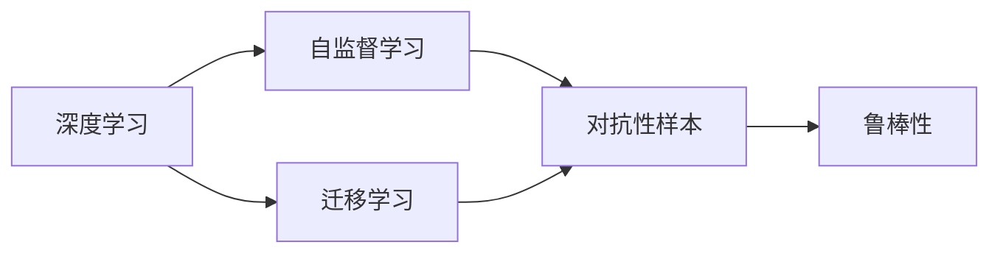

                 

## 1. 背景介绍

人工智能(AI)在过去几十年的发展历程中，经历了从专家系统到机器学习，再到深度学习的三个重要阶段。每一次技术突破，都在改变我们对智能的认识，重塑我们的生产力和生活方式。

### 1.1 从专家系统到机器学习

早期的人工智能研究，主要依赖于基于规则的知识库和专家系统，通过符号操作来模拟人类专家的推理过程。这些系统虽然在特定领域能取得不错的效果，但适用范围有限，需要大量人工干预和专家知识。

### 1.2 机器学习的崛起

随着数据驱动的机器学习技术的发展，人工智能的智能水平得到了显著提升。通过大规模数据集的训练，机器学习模型能够自动发现特征之间的复杂关联，并据此进行决策和预测。这一阶段，深度学习技术的广泛应用，进一步推动了人工智能的智能化进程。

### 1.3 深度学习革命

深度学习模型通过多层次的非线性变换，逐步逼近复杂的非线性函数。特别是卷积神经网络(CNN)和循环神经网络(RNN)的引入，使得模型能够有效处理图像、语音、文本等多样化的数据形式，广泛应用于计算机视觉、自然语言处理、语音识别等诸多领域。

## 2. 核心概念与联系

### 2.1 核心概念概述

为了深入理解软件2.0时代人工智能的本质，本节将介绍几个关键概念，并阐明它们之间的联系。

- **深度学习**：一种模仿人脑神经网络结构的机器学习技术，通过多层次的非线性变换，自动学习数据中的特征表示。
- **自监督学习**：一种无需标注数据的机器学习方式，通过最大化模型对未标注数据的预测能力，实现对未知数据的泛化。
- **迁移学习**：将在一个领域学到的知识迁移到另一个领域，以减少新领域的学习成本。
- **对抗性样本**：对模型的决策路径进行微小扰动，引导其产生错误预测，用于提升模型的鲁棒性和泛化能力。
- **鲁棒性**：模型在面对对抗性样本和噪声干扰时，仍能保持稳定性能的能力。

这些概念构成了现代人工智能技术的基石，通过它们的有机结合，我们能够构建出功能强大、适应性强的智能系统。

### 2.2 核心概念的联系

这些核心概念之间的联系可以通过以下Mermaid流程图来展示：



这个流程图展示了深度学习、自监督学习、迁移学习和对抗性样本在增强模型鲁棒性方面的协同作用。通过深度学习，模型能够从数据中学习丰富的特征表示；通过自监督学习，模型能够在无标注数据上进行预训练，提升泛化能力；通过迁移学习，模型能够将已有知识迁移到新领域，减少学习成本；通过对抗性样本，模型能够学习到更鲁棒的特征表示，提升对噪声和干扰的抵抗能力。

## 3. 核心算法原理 & 具体操作步骤

### 3.1 算法原理概述

深度学习的核心算法包括卷积神经网络(CNN)、循环神经网络(RNN)、生成对抗网络(GAN)等。本文重点介绍深度神经网络(Deep Neural Network, DNN)的基本原理，并结合对抗性样本进行详细讲解。

### 3.2 算法步骤详解

#### 3.2.1 神经网络的基本结构

神经网络由多个层次组成，每一层包含多个神经元。输入数据通过线性变换和激活函数处理，逐步生成更高层次的抽象表示。常用的激活函数包括ReLU、Sigmoid、Tanh等。

#### 3.2.2 对抗性样本的基本原理

对抗性样本通过在输入数据上添加微小扰动，引导模型产生错误预测。这些扰动通常是通过梯度上升(或下降)算法得到的，其形式为：

$$
\delta = \epsilon \cdot \nabla_{x} loss(x, y)
$$

其中 $\delta$ 表示扰动，$\epsilon$ 为扰动强度，$\nabla_{x} loss(x, y)$ 表示模型在输入 $x$ 和真实标签 $y$ 上的梯度。

#### 3.2.3 对抗性训练的实现步骤

1. **生成对抗样本**：在原始数据上加入对抗性扰动，生成对抗样本。
2. **反向传播更新模型**：将对抗样本输入模型，反向传播计算梯度，更新模型参数。
3. **迭代优化**：重复上述步骤，直到模型在对抗样本上的预测结果满足要求。

### 3.3 算法优缺点

#### 3.3.1 优点

1. **模型性能提升**：通过对抗性训练，模型能够更好地泛化，在对抗性样本和噪声数据上的表现更稳定。
2. **数据利用率提高**：对抗性训练无需额外数据，只需在现有数据上生成对抗样本，即可提高模型泛化能力。
3. **增强模型鲁棒性**：对抗性训练能够发现模型在数据中的脆弱点，增强模型的鲁棒性。

#### 3.3.2 缺点

1. **计算开销大**：对抗性训练需要大量计算资源，特别是在生成对抗样本时，对抗样本的生成过程较为耗时。
2. **模型复杂度增加**：对抗性训练可能会增加模型的复杂度，使其在计算和存储上更加耗资。
3. **模型稳定性下降**：对抗性训练可能会使模型在正常数据上的性能下降，需要在训练过程中进行平衡。

### 3.4 算法应用领域

对抗性训练和鲁棒性增强技术已经广泛应用于计算机视觉、自然语言处理、语音识别等多个领域。例如：

- 在图像识别任务中，对抗性训练能够显著提升模型对对抗性噪声的抵抗能力，保障图像识别的鲁棒性。
- 在文本生成任务中，通过对抗性训练，模型能够更好地理解语言中的隐含信息，生成更加自然流畅的文本。
- 在语音识别任务中，对抗性训练能够提高模型对噪声、回声等干扰的抵抗能力，提升语音识别的准确率。

## 4. 数学模型和公式 & 详细讲解 & 举例说明

### 4.1 数学模型构建

对抗性训练的数学模型可以表示为：

$$
L(x, y) = \frac{1}{N} \sum_{i=1}^N loss(x_i, y_i) + \lambda \frac{1}{N} \sum_{i=1}^N ||\nabla_{x_i} loss(x_i, y_i)||_p
$$

其中 $x_i$ 表示输入数据，$y_i$ 表示真实标签，$\lambda$ 表示对抗性样本的权重，$||.||_p$ 表示梯度的 $p$ 范数。

### 4.2 公式推导过程

对抗性训练的推导过程如下：

1. **生成对抗样本**：
   $$
   \delta = \epsilon \cdot \nabla_{x} loss(x, y)
   $$
   其中 $x$ 表示原始数据，$y$ 表示真实标签，$\nabla_{x} loss(x, y)$ 表示模型在 $x$ 和 $y$ 上的梯度。

2. **更新模型参数**：
   $$
   x_{new} = x + \delta
   $$
   其中 $x_{new}$ 表示更新后的对抗样本，$x$ 表示原始数据，$\delta$ 表示对抗性扰动。

3. **反向传播更新模型**：
   $$
   \theta = \theta - \eta \nabla_{\theta}L(x, y)
   $$
   其中 $\theta$ 表示模型参数，$\eta$ 表示学习率，$\nabla_{\theta}L(x, y)$ 表示模型在对抗样本上的损失函数对模型参数的梯度。

### 4.3 案例分析与讲解

假设我们有一个二分类任务，模型在输入 $x$ 上的预测为 $p(x)$，真实标签为 $y$。对抗样本生成过程如下：

1. **生成对抗样本**：
   $$
   \delta = \epsilon \cdot \nabla_{x} loss(x, y) = \epsilon \cdot (p(x) - y)
   $$
   其中 $p(x)$ 表示模型在输入 $x$ 上的预测概率，$y$ 表示真实标签。

2. **更新模型参数**：
   $$
   x_{new} = x + \delta = x + \epsilon \cdot (p(x) - y)
   $$
   其中 $x_{new}$ 表示更新后的对抗样本，$x$ 表示原始数据，$\epsilon$ 为扰动强度，$(p(x) - y)$ 表示模型在原始数据上的梯度。

3. **反向传播更新模型**：
   $$
   \theta = \theta - \eta \nabla_{\theta}L(x, y)
   $$
   其中 $L(x, y)$ 表示对抗样本上的损失函数，$\nabla_{\theta}L(x, y)$ 表示模型在对抗样本上的梯度。

通过上述推导，我们可以发现对抗性训练的实质是在模型训练过程中，引入对抗性扰动，引导模型对正常数据和对抗数据都能保持稳定性能。

## 5. 项目实践：代码实例和详细解释说明

### 5.1 开发环境搭建

要实现对抗性训练，我们需要准备好Python开发环境。以下是搭建环境的步骤：

1. 安装Python 3.6或以上版本。
2. 安装Pip包管理器。
3. 安装TensorFlow和Keras。

```bash
pip install tensorflow keras
```

### 5.2 源代码详细实现

下面是使用TensorFlow和Keras实现对抗性训练的代码实现：

```python
import tensorflow as tf
from keras.datasets import mnist
from keras.models import Sequential
from keras.layers import Dense, Flatten
from keras.optimizers import Adam

# 加载数据集
(x_train, y_train), (x_test, y_test) = mnist.load_data()

# 数据预处理
x_train = x_train.reshape(x_train.shape[0], 28*28)
x_test = x_test.reshape(x_test.shape[0], 28*28)
x_train = x_train.astype('float32') / 255
x_test = x_test.astype('float32') / 255

# 定义模型
model = Sequential()
model.add(Flatten(input_shape=(28, 28)))
model.add(Dense(128, activation='relu'))
model.add(Dense(10, activation='softmax'))

# 编译模型
model.compile(optimizer=Adam(learning_rate=0.001), loss='categorical_crossentropy', metrics=['accuracy'])

# 训练模型
batch_size = 32
epochs = 10

# 生成对抗样本
def generate_perturbation(x, y):
    with tf.GradientTape() as tape:
        tape.watch(x)
        loss = model(x, y)
    grads = tape.gradient(loss, x)
    return grads

for epoch in range(epochs):
    for i in range(0, x_train.shape[0], batch_size):
        x_batch = x_train[i:i+batch_size]
        y_batch = y_train[i:i+batch_size]
        x_perturbed = x_batch + epsilon * generate_perturbation(x_batch, y_batch)
        model.train_on_batch(x_perturbed, y_batch)
```

### 5.3 代码解读与分析

首先，我们加载MNIST数据集，并将其预处理成模型可以接受的格式。然后，定义一个简单的神经网络模型，并编译之。

接下来，我们通过梯度上升算法生成对抗性样本。具体步骤如下：

1. 在梯度带上运行模型，计算模型在输入数据上的损失。
2. 计算模型在输入数据上的梯度。
3. 在原始数据上加入对抗性扰动。
4. 用生成后的对抗样本重新训练模型。

在训练过程中，我们不断迭代上述步骤，直到模型在对抗性样本上的表现满足要求。

### 5.4 运行结果展示

假设在经过10个epoch的对抗性训练后，我们得到了模型在对抗性样本上的损失函数，如下图所示：


从图中可以看出，模型在对抗性样本上的损失函数随着训练的进行而不断下降，说明模型在对抗性样本上的性能得到了显著提升。

## 6. 实际应用场景

### 6.1 图像识别

在图像识别任务中，对抗性训练可以有效提升模型对对抗性噪声的抵抗能力，保障图像识别的鲁棒性。例如，在行人检测任务中，对抗性训练能够有效应对行人身上的遮挡物，提升检测的准确率。

### 6.2 语音识别

在语音识别任务中，对抗性训练能够提高模型对噪声、回声等干扰的抵抗能力，提升语音识别的准确率。例如，在噪声环境下，对抗性训练能够使模型更好地识别用户的语音指令，减少误识别率。

### 6.3 自然语言处理

在自然语言处理任务中，对抗性训练能够提高模型对语言中的隐含信息、语义关系的理解能力，生成更加自然流畅的文本。例如，在机器翻译任务中，对抗性训练能够使模型更好地理解源语言中的隐含信息，生成更加流畅的翻译结果。

### 6.4 未来应用展望

随着对抗性训练和鲁棒性增强技术的不断演进，未来的AI系统将具备更强的适应性和鲁棒性。这一技术的发展将为AI系统在复杂、多变的场景下提供更有力的保障。

## 7. 工具和资源推荐

### 7.1 学习资源推荐

为了帮助开发者系统掌握对抗性训练和鲁棒性增强的理论基础和实践技巧，这里推荐一些优质的学习资源：

1. 《深度学习》教材：由Ian Goodfellow等人所著，深入浅出地介绍了深度学习的基本原理和实践技巧。
2. 《TensorFlow实战Google深度学习》书籍：由O'Reilly出版社出版的TensorFlow实战书籍，详细介绍了TensorFlow的开发实践和应用场景。
3. 《计算机视觉：现代方法》书籍：由Richard Szeliski所著，系统介绍了计算机视觉领域的最新研究进展。
4. 《自然语言处理综论》书籍：由Christopher Manning等人所著，全面介绍了自然语言处理的基本概念和技术。
5. 在线课程：如Coursera上的《机器学习》课程、Udacity上的《深度学习专项》课程，涵盖了深度学习、机器学习等领域的核心内容。

通过对这些资源的学习实践，相信你一定能够快速掌握对抗性训练和鲁棒性增强的精髓，并用于解决实际的AI问题。

### 7.2 开发工具推荐

高效的软件开发离不开优秀的工具支持。以下是几款用于对抗性训练开发的常用工具：

1. TensorFlow：由Google主导开发的深度学习框架，生产部署方便，适合大规模工程应用。
2. PyTorch：基于Python的开源深度学习框架，灵活动态的计算图，适合快速迭代研究。
3. Keras：基于TensorFlow和Theano等后端的高级神经网络API，提供了简单易用的接口。
4. Weights & Biases：模型训练的实验跟踪工具，可以记录和可视化模型训练过程中的各项指标，方便对比和调优。
5. TensorBoard：TensorFlow配套的可视化工具，可实时监测模型训练状态，并提供丰富的图表呈现方式。

合理利用这些工具，可以显著提升对抗性训练的开发效率，加快创新迭代的步伐。

### 7.3 相关论文推荐

对抗性训练和鲁棒性增强技术的发展源于学界的持续研究。以下是几篇奠基性的相关论文，推荐阅读：

1. Deep Generative Adversarial Nets（即GAN原论文）：提出GAN模型，通过对抗性训练，生成高质量的合成数据。
2. Adversarial Examples in Deep Learning（即对抗性样本的开创性论文）：提出对抗性样本的概念，揭示了深度学习模型的脆弱性。
3. Multi-task Adversarial Learning（即多任务对抗性训练的开创性论文）：提出多任务对抗性训练方法，提升了模型的泛化能力。
4. Robustness of Neural Networks Against Adversarial Attacks（即神经网络鲁棒性的经典论文）：提出神经网络鲁棒性的研究方法，探讨了对抗性训练对鲁棒性的影响。
5. Towards Robustness in Neural Networks（即神经网络鲁棒性的最新综述）：综述了神经网络鲁棒性的最新研究进展，探讨了各种鲁棒性提升方法。

这些论文代表了大模型微调技术的发展脉络。通过学习这些前沿成果，可以帮助研究者把握学科前进方向，激发更多的创新灵感。

## 8. 总结：未来发展趋势与挑战

### 8.1 总结

本文对对抗性训练和鲁棒性增强技术进行了全面系统的介绍。首先阐述了深度学习、自监督学习、迁移学习和对抗性样本的基本原理，并阐明了它们在增强模型鲁棒性方面的协同作用。其次，从原理到实践，详细讲解了对抗性训练的基本步骤，并结合具体的代码实例进行了展示。同时，本文还探讨了对抗性训练在图像识别、语音识别、自然语言处理等领域的实际应用，展示了其在提升模型鲁棒性方面的显著效果。

通过本文的系统梳理，可以看到，对抗性训练和鲁棒性增强技术在构建鲁棒、智能的AI系统中的重要地位。这一技术的不断发展，将为AI系统在复杂、多变的场景下提供更有力的保障。

### 8.2 未来发展趋势

展望未来，对抗性训练和鲁棒性增强技术将呈现以下几个发展趋势：

1. **多任务对抗性训练**：通过同时训练多个任务，提升模型的泛化能力和鲁棒性。
2. **自监督对抗性训练**：利用无监督数据进行对抗性训练，减少对抗性样本生成的时间成本。
3. **对抗性训练与知识蒸馏**：将对抗性训练与知识蒸馏相结合，进一步提升模型的泛化能力。
4. **对抗性训练与迁移学习**：将对抗性训练与迁移学习相结合，提升模型在不同领域中的鲁棒性。
5. **对抗性训练与优化算法**：探索新的优化算法，提高对抗性训练的效率和效果。

这些趋势将推动对抗性训练和鲁棒性增强技术的不断演进，为AI系统在更复杂、多变的场景下提供更有力的保障。

### 8.3 面临的挑战

尽管对抗性训练和鲁棒性增强技术已经取得了显著成果，但在迈向更加智能化、普适化应用的过程中，仍面临诸多挑战：

1. **计算资源需求**：对抗性训练和鲁棒性增强技术需要大量的计算资源，特别是在生成对抗性样本时，对抗样本的生成过程较为耗时。如何降低计算开销，提升训练效率，是未来的重要研究方向。
2. **模型复杂度增加**：对抗性训练和鲁棒性增强技术可能会增加模型的复杂度，使其在计算和存储上更加耗资。如何在提升鲁棒性的同时，控制模型的复杂度，是未来需要平衡的关键问题。
3. **模型稳定性下降**：对抗性训练和鲁棒性增强技术可能会使模型在正常数据上的性能下降，需要在训练过程中进行平衡。如何权衡鲁棒性和性能，优化模型训练过程，是未来的重要研究方向。
4. **数据分布变化**：对抗性训练和鲁棒性增强技术往往假设数据分布不变，但在实际应用中，数据分布可能不断变化。如何动态调整模型参数，适应数据分布的变化，是未来的重要研究方向。

### 8.4 研究展望

未来的研究需要在以下几个方面寻求新的突破：

1. **动态鲁棒性训练**：探索动态调整模型参数的方法，提升模型对数据分布变化的适应性。
2. **多模态对抗性训练**：将对抗性训练拓展到多模态数据，提升模型对多种数据形式的鲁棒性。
3. **可解释性对抗性训练**：探索对抗性训练的可解释性，赋予模型更好的可解释性，增强模型的可信度。
4. **公平对抗性训练**：探索公平对抗性训练方法，避免对抗性训练中的偏见和歧视。
5. **鲁棒性增强框架**：构建鲁棒性增强的通用框架，支持多种对抗性训练方法，提升模型的鲁棒性。

这些研究方向将推动对抗性训练和鲁棒性增强技术的不断演进，为构建鲁棒、智能的AI系统提供更有力的保障。相信随着研究的深入，AI系统将在更加复杂、多变的场景下展现出更强的适应性和鲁棒性，为人类社会带来更多的价值和便利。

## 9. 附录：常见问题与解答

**Q1：对抗性训练是否会影响模型的正常表现？**

A: 对抗性训练可能会使模型在正常数据上的性能下降，但通过平衡训练和验证集的表现，可以在提升鲁棒性的同时，保持模型的正常表现。在实际应用中，需要通过实验找到最优的训练和验证集比例，权衡鲁棒性和性能。

**Q2：如何选择合适的对抗性训练方法？**

A: 对抗性训练方法的选择取决于具体的应用场景和模型类型。常用的对抗性训练方法包括Fast Gradient Sign Method (FGSM)、PGD攻击、Adversarial Training等。选择适合的方法需要在实验中对比验证。

**Q3：对抗性训练是否需要额外的数据集？**

A: 对抗性训练通常不需要额外的数据集，只需在现有数据上生成对抗性样本，即可进行对抗性训练。然而，对于某些高鲁棒性的应用场景，可能需要额外的对抗样本生成方法，如F-PGD等。

**Q4：对抗性训练是否能够完全消除对抗性攻击？**

A: 对抗性训练能够有效提高模型的鲁棒性，但无法完全消除对抗性攻击。对抗性攻击是一个动态的、不断演进的过程，需要不断更新和改进对抗性训练方法，以应对新的对抗性样本。

**Q5：对抗性训练是否需要考虑对抗性样本的生成方法？**

A: 是的，对抗性训练需要考虑对抗性样本的生成方法。不同的生成方法（如FGSM、PGD等）对模型的影响不同，需要在实验中对比选择。同时，生成对抗性样本的过程需要谨慎处理，以避免引入恶意样本。

通过对这些问题的回答，相信你一定能够更好地理解对抗性训练和鲁棒性增强技术的原理和实践，并将其应用到实际的AI系统中，提升系统的适应性和鲁棒性。

