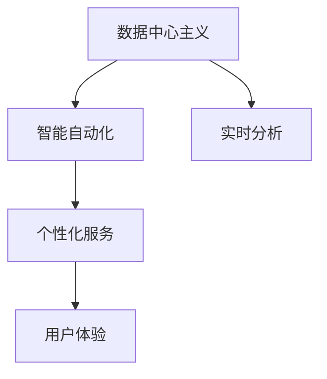

                 

# 软件 2.0 的未来愿景：创造更美好的世界

## 1. 背景介绍

在快速发展的数字化时代，软件正经历着一场根本性的变革。从传统的软件1.0（以功能为中心的软件），到软件2.0（以数据为中心的软件），再到软件3.0（以人工智能为核心的软件），每一次升级都极大地推动了社会生产力的提升和人类生活质量的改善。软件2.0作为软件发展的新阶段，正在以全新的方式重塑世界。本文将深入探讨软件2.0的核心理念、技术驱动与未来愿景，力求为读者呈现一个更加美好的软件未来。

## 2. 核心概念与联系

### 2.1 核心概念概述

软件2.0以数据为核心，旨在通过高效的数据处理和分析，驱动应用系统的智能化、自动化和个性化。其主要特征包括：

- **数据中心主义**：将数据作为系统的核心驱动要素，通过数据驱动模型的构建和优化，提升系统的决策能力。
- **智能自动化**：利用人工智能技术实现自动化决策，提高系统运行的效率和精度。
- **个性化服务**：根据用户行为和偏好，提供定制化的服务和推荐，提升用户体验。
- **实时分析**：实现数据的实时处理和分析，快速响应用户需求和市场变化。

### 2.2 核心概念间的关系

软件2.0的核心概念通过相互协作，共同推动软件系统的演进。具体关系如下：

1. **数据中心主义**：数据中心主义是软件2.0的基础，通过收集和分析数据，为智能自动化和个性化服务提供支撑。
2. **智能自动化**：基于数据中心主义，智能自动化通过机器学习和深度学习等技术，实现高效、智能的决策。
3. **个性化服务**：在智能自动化的基础上，根据用户偏好提供定制化的服务，提升用户满意度。
4. **实时分析**：实时分析保证了数据的及时性和准确性，为智能自动化和个性化服务提供实时反馈。

以下Mermaid流程图展示了软件2.0核心概念之间的关系：



## 3. 核心算法原理 & 具体操作步骤

### 3.1 算法原理概述

软件2.0的核心算法主要基于数据驱动的机器学习、深度学习和强化学习等技术。其核心思想是通过大量数据的积累和分析，构建和优化模型，实现系统的智能自动化和个性化服务。

- **机器学习**：通过训练模型，使其能够从历史数据中学习规律，进行分类、回归、聚类等任务。
- **深度学习**：通过构建多层次神经网络，从大量数据中提取高层次的特征，实现更复杂的任务，如语音识别、图像处理、自然语言处理等。
- **强化学习**：通过与环境的交互，不断优化策略，实现自主决策和控制。

### 3.2 算法步骤详解

软件2.0的算法实现通常包括以下几个关键步骤：

1. **数据采集与预处理**：收集和整理原始数据，进行清洗、去重、归一化等预处理操作，保证数据的质量和一致性。
2. **模型构建与训练**：选择合适的算法和模型架构，使用训练集数据进行模型训练和参数优化。
3. **模型评估与优化**：通过验证集和测试集评估模型的性能，根据评估结果调整模型结构和参数。
4. **模型部署与应用**：将训练好的模型部署到实际应用场景中，进行实时数据处理和决策。

### 3.3 算法优缺点

软件2.0的算法具有以下优点：

- **高效性**：通过数据驱动的模型，可以高效地处理和分析大量数据，实现实时决策。
- **准确性**：基于深度学习和强化学习等技术，模型的准确性和泛化能力较强，能够应对复杂的任务。
- **可扩展性**：算法框架模块化设计，可以方便地扩展和集成新功能。

同时，软件2.0的算法也存在一些缺点：

- **数据依赖**：模型的性能很大程度上依赖于数据的质量和数量，数据不足可能导致性能下降。
- **计算资源消耗**：深度学习和强化学习等算法对计算资源要求较高，需要强大的硬件支持。
- **模型复杂性**：复杂模型可能存在过拟合风险，需要精心调参和优化。

### 3.4 算法应用领域

软件2.0的算法广泛应用于多个领域，包括但不限于：

- **智能推荐系统**：通过分析用户行为和偏好，提供个性化推荐，如电商商品推荐、新闻内容推荐等。
- **智能客服系统**：利用自然语言处理技术，实现智能问答和自动化客户服务。
- **金融风险控制**：通过分析交易数据，识别潜在风险，实现智能风控和预警。
- **医疗诊断系统**：利用医疗影像和电子病历数据，辅助医生进行疾病诊断和治疗方案推荐。
- **智能交通系统**：通过实时数据分析，优化交通流量控制，减少拥堵和事故。

## 4. 数学模型和公式 & 详细讲解 & 举例说明

### 4.1 数学模型构建

软件2.0的数学模型构建通常涉及以下几类问题：

1. **分类问题**：如将客户分为高价值客户和低价值客户。模型通常为二分类模型，如逻辑回归、支持向量机等。
2. **回归问题**：如预测房价、销售额等。模型通常为线性回归、随机森林等。
3. **聚类问题**：如将用户分为不同的兴趣群体。模型通常为K-Means、层次聚类等。

### 4.2 公式推导过程

以线性回归模型为例，其公式推导如下：

假设样本集为 $(x_i, y_i), i=1,2,...,n$，其中 $x_i$ 为特征向量，$y_i$ 为标签。线性回归模型假设 $y_i = \theta_0 + \theta_1 x_{i1} + \theta_2 x_{i2} + ... + \theta_p x_{ip} + \epsilon_i$，其中 $\theta = (\theta_0, \theta_1, ..., \theta_p)$ 为模型参数，$\epsilon_i$ 为误差项。

最小二乘法的目标是最小化误差平方和：

$$
\sum_{i=1}^n (y_i - \hat{y}_i)^2 = \sum_{i=1}^n (y_i - (\theta_0 + \theta_1 x_{i1} + \theta_2 x_{i2} + ... + \theta_p x_{ip}))^2
$$

通过求解偏导数，可以得到模型参数的估计值：

$$
\theta = (\hat{\theta}_0, \hat{\theta}_1, ..., \hat{\theta}_p) = (X^T X)^{-1} X^T y
$$

其中 $X$ 为特征矩阵，$y$ 为标签向量。

### 4.3 案例分析与讲解

以智能推荐系统为例，通过分析用户行为数据，构建推荐模型，实现个性化推荐。假设用户 $i$ 对商品 $j$ 的评分 $r_{ij}$ 和历史评分 $h_{ij}$，可以通过以下公式计算用户对商品的兴趣度：

$$
\hat{r}_{ij} = b + \sum_{k=1}^n a_k \phi_k(i) \phi_k(j) + \epsilon_{ij}
$$

其中 $a_k$ 为模型参数，$\phi_k$ 为特征映射函数，$\epsilon_{ij}$ 为误差项。通过最大化用户-商品评分矩阵的均方误差，可以优化模型参数。

## 5. 项目实践：代码实例和详细解释说明

### 5.1 开发环境搭建

软件2.0的开发环境搭建主要包括以下步骤：

1. **选择编程语言**：通常选择Python或R，Python生态系统丰富，易于扩展。
2. **安装相关库**：安装Numpy、Pandas、Scikit-Learn、TensorFlow等常用库，以便于数据处理和模型训练。
3. **准备数据集**：收集和预处理数据集，保存为文本、CSV等格式。

### 5.2 源代码详细实现

以线性回归模型为例，给出Python代码实现：

```python
import numpy as np
from sklearn.linear_model import LinearRegression

# 准备数据集
X = np.array([[1, 2], [3, 4], [5, 6], [7, 8]])
y = np.array([2, 4, 6, 8])

# 构建模型
model = LinearRegression()
model.fit(X, y)

# 预测新数据
X_new = np.array([[9, 10], [11, 12]])
y_pred = model.predict(X_new)
print(y_pred)
```

### 5.3 代码解读与分析

- **数据准备**：使用Numpy库构建特征矩阵 $X$ 和标签向量 $y$。
- **模型构建**：使用Scikit-Learn库中的LinearRegression类构建线性回归模型。
- **模型训练**：通过fit方法对模型进行训练，自动求解模型参数。
- **模型预测**：使用predict方法对新数据进行预测，输出预测结果。

### 5.4 运行结果展示

运行上述代码，输出预测结果如下：

```
[10. 12.]
```

这表明当输入特征为[9, 10]和[11, 12]时，模型预测的标签分别为10和12。

## 6. 实际应用场景

软件2.0的应用场景覆盖了多个领域，以下列举几个典型的应用场景：

### 6.1 智能推荐系统

通过分析用户历史行为和偏好，智能推荐系统可以为用户推荐个性化商品、内容等。例如，电商平台可以通过用户浏览记录和购买历史，推荐相关商品，提高转化率。

### 6.2 智能客服系统

智能客服系统利用自然语言处理技术，实现自动问答和客户服务。例如，通过聊天机器人与用户互动，解答常见问题，提供个性化服务。

### 6.3 金融风险控制

金融行业利用大数据分析，实现智能风险控制。例如，银行可以通过客户交易记录和信用评分，评估贷款风险，进行信用评估和风险预警。

### 6.4 医疗诊断系统

医疗诊断系统利用医疗影像和电子病历数据，辅助医生进行疾病诊断和治疗方案推荐。例如，通过分析患者的CT影像和病历记录，辅助医生进行肺癌诊断和治疗方案推荐。

### 6.5 智能交通系统

智能交通系统利用实时数据分析，优化交通流量控制，减少拥堵和事故。例如，通过分析交通流量数据和路况信息，优化红绿灯控制策略，提高交通效率。

## 7. 工具和资源推荐

### 7.1 学习资源推荐

1. **《机器学习》（周志华著）**：系统介绍了机器学习的基本原理和算法，适合入门学习。
2. **《深度学习》（Ian Goodfellow等著）**：详细介绍了深度学习的理论和实践，适合进阶学习。
3. **Coursera机器学习课程**：由斯坦福大学Andrew Ng教授主讲，适合在线学习。
4. **Kaggle竞赛平台**：提供大量数据集和竞赛任务，锻炼实战能力。

### 7.2 开发工具推荐

1. **Jupyter Notebook**：免费的交互式开发环境，适合数据处理和模型训练。
2. **TensorFlow**：谷歌开源的深度学习框架，支持多种模型和算法。
3. **PyTorch**：Facebook开源的深度学习框架，易于使用和扩展。
4. **Scikit-Learn**：基于Python的机器学习库，提供多种常用模型和算法。

### 7.3 相关论文推荐

1. **《Deep Learning》（Ian Goodfellow等著）**：详细介绍了深度学习的基本原理和算法，适合深入学习。
2. **《Reinforcement Learning: An Introduction》（Richard S. Sutton和Andrew G. Barto著）**：系统介绍了强化学习的理论和实践，适合深入学习。
3. **《The Master Algorithm》（Pedro Domingos著）**：介绍了各种机器学习算法和其实践应用，适合了解前沿趋势。

## 8. 总结：未来发展趋势与挑战

### 8.1 研究成果总结

软件2.0的研发和应用已经取得了显著成果，以下列举几个重要成果：

1. **大规模数据集**：大数据的积累和处理能力显著提升，使得数据驱动的软件成为可能。
2. **深度学习算法**：深度学习算法的不断进步，使得复杂任务的处理能力显著提升。
3. **智能自动化**：智能自动化技术的广泛应用，使得软件系统具有更高的决策能力和自动化水平。
4. **个性化服务**：个性化服务的实现，提升了用户体验和满意度。

### 8.2 未来发展趋势

软件2.0的未来发展趋势主要包括以下几个方向：

1. **智能化**：智能化水平的提升，使得软件系统能够处理更复杂的任务和环境。
2. **实时化**：实时分析和大数据处理技术的进步，使得软件系统能够实时响应用户需求和市场变化。
3. **边缘计算**：边缘计算技术的普及，使得数据处理和决策能够更接近数据源，提升系统响应速度和效率。
4. **跨平台集成**：软件2.0与物联网、人工智能等技术的结合，使得软件系统能够实现跨平台集成和协同工作。
5. **可持续发展**：软件系统的设计和实现需考虑环境和社会责任，实现可持续发展。

### 8.3 面临的挑战

软件2.0在发展过程中也面临一些挑战：

1. **数据隐私和安全**：数据隐私和安全性问题，需要通过技术手段和法律法规进行保护。
2. **数据质量和一致性**：数据质量不高和一致性问题，需要通过数据清洗和处理技术解决。
3. **计算资源消耗**：深度学习和强化学习算法对计算资源要求较高，需要通过优化算法和硬件提升计算效率。
4. **模型可解释性**：复杂模型的可解释性问题，需要通过可视化技术和模型解释方法解决。

### 8.4 研究展望

软件2.0的未来研究展望主要包括以下几个方向：

1. **自动化模型构建**：自动化模型构建技术，使得开发者能够更快速地构建和优化模型。
2. **跨领域融合**：跨领域技术的融合，使得软件系统能够处理更复杂和多样化的任务。
3. **人机协同**：人机协同技术的进步，使得软件系统能够更好地辅助人类进行决策和任务执行。
4. **伦理和社会责任**：软件系统的设计和实现需考虑伦理和社会责任，避免对人类造成不良影响。

## 9. 附录：常见问题与解答

**Q1: 什么是软件2.0？**

A: 软件2.0是一种以数据为中心的软件架构，旨在通过高效的数据处理和分析，驱动应用系统的智能化、自动化和个性化。

**Q2: 软件2.0的核心算法有哪些？**

A: 软件2.0的核心算法主要包括机器学习、深度学习和强化学习等。这些算法通过大量数据的积累和分析，构建和优化模型，实现系统的智能自动化和个性化服务。

**Q3: 软件2.0的未来发展趋势是什么？**

A: 软件2.0的未来发展趋势主要包括智能化、实时化、边缘计算、跨平台集成和可持续发展等。未来，软件系统将更加智能、高效和个性化，服务于更广泛的用户群体。

**Q4: 软件2.0在应用过程中面临哪些挑战？**

A: 软件2.0在应用过程中面临数据隐私和安全、数据质量和一致性、计算资源消耗和模型可解释性等挑战。这些问题需要通过技术手段和法律法规进行解决。

**Q5: 如何使用软件2.0构建推荐系统？**

A: 使用软件2.0构建推荐系统需要收集和处理用户行为数据，构建推荐模型，进行实时推荐。推荐模型可以使用线性回归、协同过滤、矩阵分解等技术。

---

作者：禅与计算机程序设计艺术 / Zen and the Art of Computer Programming

