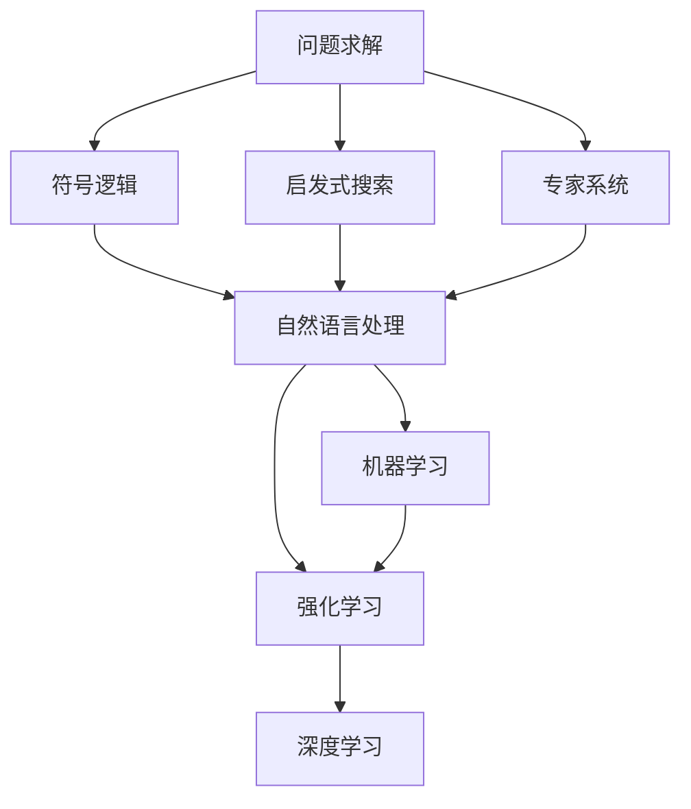
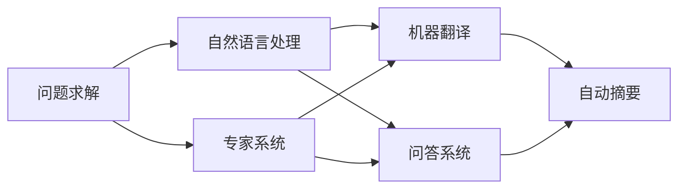
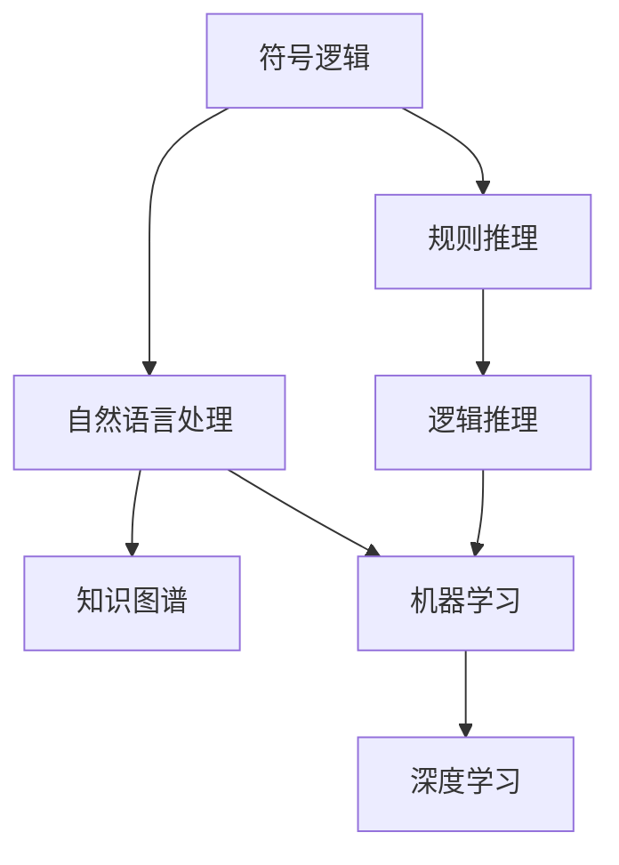
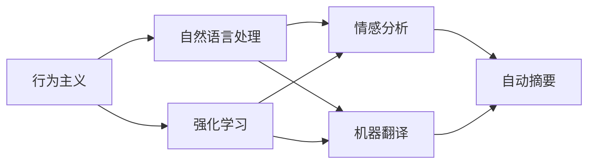
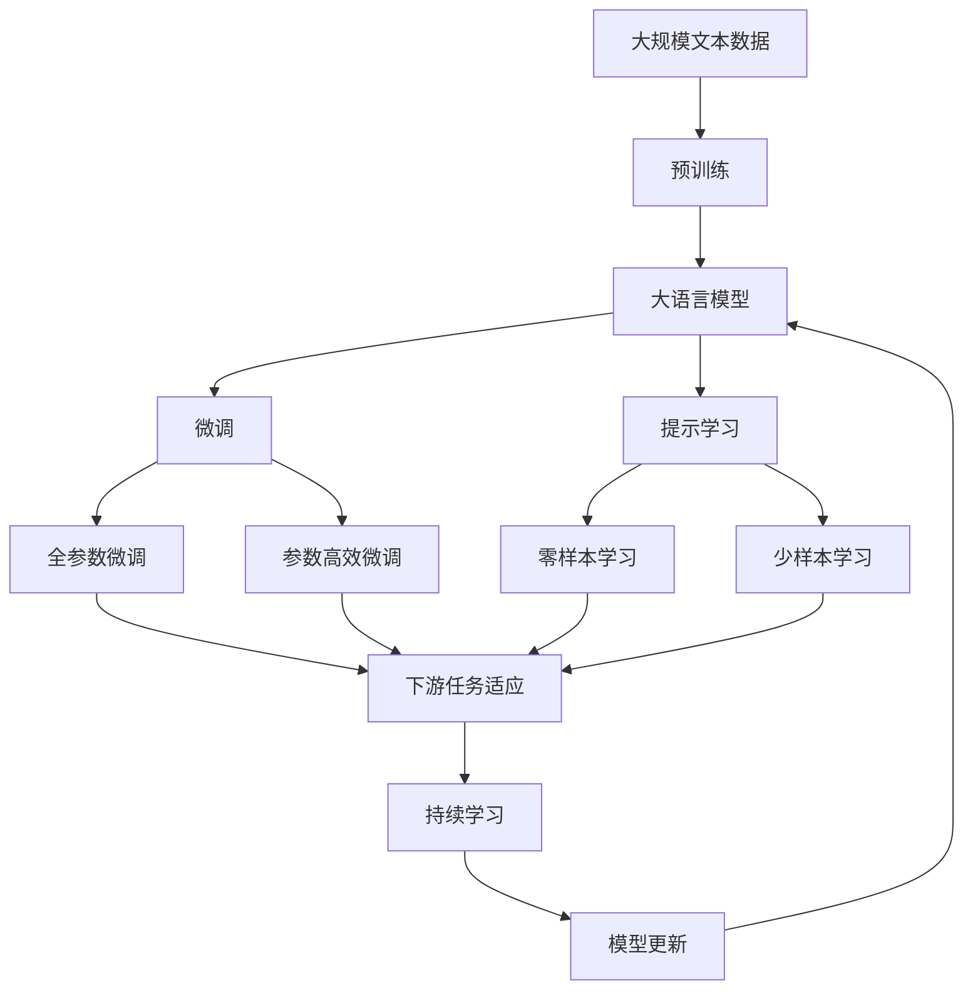

                 

# 达特茅斯会议的研究议题

## 1. 背景介绍

### 1.1 问题由来
1956年夏天，在美国新罕布什尔州的达特茅斯学院，邓恩（John McCarthy）、希慎森（Nils Nelson）、西蒙（Herbert A. Simon）和罗切斯特（Cliff Shaw）四名科学家，邀请了20多位学者和研究生，围绕“如何使计算机具有智能”的问题展开讨论。这次会议的目的是探讨人工智能的实现方法，从而奠定了人工智能的基础。会议的成果之一就是首创“人工智能”这一术语，并定义了人工智能的目标：“制造能够像人一样思考、学习、推理和自我修改的智能机器。”

### 1.2 问题核心关键点
达特茅斯会议提出了两个核心研究议题：
1. **问题求解**：研究如何让计算机能够解决人类的某些智能问题，如迷宫问题、数学推理、下棋等。
2. **自然语言处理**：探讨如何让计算机理解并处理自然语言，如自动翻译、问答、自然语言推理等。

这两个议题分别对应了人工智能的逻辑主义和行为主义两条路线。逻辑主义强调通过符号逻辑推理来解决智能问题；行为主义则认为应从心理学角度出发，通过试错和反馈来训练智能机器。这两种研究路径在人工智能发展过程中交织融合，形成了今天人工智能的研究范式。

### 1.3 问题研究意义
达特茅斯会议标志着人工智能这一新兴领域的诞生，吸引了大量科学家、工程师和数学家投入其中。会议期间讨论的问题求解和自然语言处理，为后续人工智能的发展奠定了基础。此后，研究者们不断探索新的算法和技术，如专家系统、知识图谱、深度学习等，推动了人工智能的持续进步。

## 2. 核心概念与联系

### 2.1 核心概念概述

为了更好地理解达特茅斯会议的研究议题，本节将介绍几个密切相关的核心概念：

- **问题求解**：指通过计算机程序解决特定问题的方法，如基于规则的专家系统、启发式搜索、遗传算法等。
- **自然语言处理**（NLP）：指计算机对自然语言文本进行理解、生成和处理的学科，涵盖词法分析、句法分析、语义分析、情感分析、机器翻译等任务。
- **符号逻辑**：使用符号和逻辑规则来表示和推理知识的方法，广泛应用于问题求解和推理。
- **行为主义**：强调通过试错和反馈来训练机器的方法，如强化学习、机器学习等。
- **学习理论**：研究机器如何通过数据进行学习和推理的理论，包括统计学习、贝叶斯学习、深度学习等。

这些核心概念之间的逻辑关系可以通过以下Mermaid流程图来展示：



这个流程图展示了大语言模型的核心概念及其之间的关系：

1. 问题求解包括基于符号逻辑的专家系统和启发式搜索等方法。
2. 自然语言处理涵盖了语言理解、生成和处理的任务。
3. 行为主义包括了机器学习和强化学习等学习范式。
4. 学习理论覆盖了统计学习、贝叶斯学习和深度学习等算法。

这些核心概念共同构成了人工智能的研究基础，推动了人工智能技术的发展。

### 2.2 概念间的关系

这些核心概念之间存在着紧密的联系，形成了人工智能的研究框架。下面我通过几个Mermaid流程图来展示这些概念之间的关系。

#### 2.2.1 问题求解与自然语言处理的关系



这个流程图展示了问题求解与自然语言处理的关系。问题求解中的专家系统和启发式搜索方法，可以用于解决自然语言处理任务中的翻译、问答、摘要等。

#### 2.2.2 符号逻辑与机器学习的关系



这个流程图展示了符号逻辑与机器学习的关系。符号逻辑中的规则推理和逻辑推理可以用于构建知识图谱，进而指导机器学习模型的训练和推理。

#### 2.2.3 行为主义与学习理论的关系



这个流程图展示了行为主义与学习理论的关系。行为主义中的强化学习和机器学习可以用于自然语言处理中的情感分析、机器翻译等任务。

### 2.3 核心概念的整体架构

最后，我们用一个综合的流程图来展示这些核心概念在大语言模型微调过程中的整体架构：



这个综合流程图展示了从预训练到微调，再到持续学习的完整过程。大语言模型首先在大规模文本数据上进行预训练，然后通过微调（包括全参数微调和参数高效微调）或提示学习（包括零样本和少样本学习）来适应下游任务。最后，通过持续学习技术，模型可以不断更新和适应新的任务和数据。 通过这些流程图，我们可以更清晰地理解大语言模型微调过程中各个核心概念的关系和作用。

## 3. 核心算法原理 & 具体操作步骤
### 3.1 算法原理概述

基于符号逻辑的问题求解方法，其核心思想是通过符号和逻辑规则来表示和推理知识。通常包括以下步骤：

1. **问题抽象**：将实际问题抽象为数学或逻辑形式，表示为符号表达式。
2. **知识库构建**：建立包含领域知识的知识库，包括事实、规则、约束等。
3. **推理求解**：使用符号推理算法（如规则推理、逻辑推理、约束求解等），在知识库中搜索求解问题的规则。

其算法原理可以形式化表示为：

$$
Solve(P, K) = \left\{
\begin{aligned}
& \text{if} \, P \, \text{is a fact}, \, \text{return} \, P \\
& \text{if} \, P \, \text{is in} \, K, \, \text{return} \, P \\
& \text{if} \, P \, \text{is a rule}, \, \text{apply the rule and recursively solve} \\
& \text{if} \, P \, \text{has no facts or rules}, \, \text{return fail}
\end{aligned}
\right.
$$

其中 $P$ 表示当前待求解的问题，$K$ 表示知识库。

### 3.2 算法步骤详解

基于符号逻辑的问题求解算法，通常包括以下关键步骤：

**Step 1: 问题抽象**
- 将实际问题抽象为数学或逻辑表达式，构建符号化表示。

**Step 2: 知识库构建**
- 定义领域知识库，包含事实、规则、约束等。
- 使用专家知识或文本数据自动构建知识库，如通过文本挖掘、规则库等方式。

**Step 3: 推理求解**
- 选择适当的推理算法，如规则推理、逻辑推理、约束求解等。
- 使用推理算法在知识库中搜索，找到求解问题的规则。
- 重复上述步骤，直至找到完整的解或确定问题无解。

**Step 4: 结果输出**
- 将推理结果转换为用户可理解的形式，输出最终答案。

### 3.3 算法优缺点

基于符号逻辑的问题求解方法具有以下优点：

1. **符号化表示**：符号化的知识表示可以清晰表达领域知识，易于理解和维护。
2. **推理灵活**：基于规则的推理算法可以根据领域知识设计，适应性强。
3. **可解释性高**：符号逻辑的推理过程可追溯，结果可解释性强。

但同时也存在以下缺点：

1. **知识库构建复杂**：知识库的构建需要领域专家的参与，成本较高。
2. **知识获取困难**：大规模领域知识库的构建和维护是一个长期过程，需要不断更新和扩展。
3. **知识表达局限**：复杂的领域知识难以用符号逻辑形式完整表达，存在知识盲区。

### 3.4 算法应用领域

基于符号逻辑的问题求解方法，广泛应用于以下领域：

- **医疗诊断**：使用规则库和事实库，辅助医生进行疾病诊断和治疗方案设计。
- **法律咨询**：构建法律规则库，帮助律师快速查找和应用法律条款。
- **财务分析**：使用约束和规则，进行财务报表分析和风险评估。
- **教育辅导**：构建知识图谱，辅助教师设计教学计划，提供个性化学习推荐。

## 4. 数学模型和公式 & 详细讲解 & 举例说明

### 4.1 数学模型构建

在自然语言处理任务中，常见的数学模型包括词袋模型、TF-IDF模型、词嵌入模型等。这里以词嵌入模型为例，介绍其构建过程。

设输入文本为 $D=\{d_1,d_2,\ldots,d_n\}$，每个文本 $d_i$ 由 $m$ 个单词组成。定义单词嵌入向量 $v(w)$ 为 $d$ 维的实数向量，表示单词 $w$ 的语义信息。则整个文本的词嵌入矩阵 $V$ 可以表示为：

$$
V = \begin{bmatrix}
v(w_1) \\
v(w_2) \\
\vdots \\
v(w_m)
\end{bmatrix}
$$

文本 $d_i$ 的词嵌入表示为 $V_i$，则文本 $D$ 的词嵌入矩阵为：

$$
V_D = \begin{bmatrix}
V_1 \\
V_2 \\
\vdots \\
V_n
\end{bmatrix}
$$

词嵌入模型可以表示为：

$$
V_D = \begin{bmatrix}
W_1X_1 \\
W_2X_2 \\
\vdots \\
W_nX_n
\end{bmatrix}
$$

其中 $W_i$ 为 $d \times k$ 的权重矩阵，$X_i$ 为 $k \times m$ 的文本矩阵。

### 4.2 公式推导过程

假设输入文本 $d_i$ 和其对应的单词序列 $S_i$ 如下：

$$
d_i = [w_1, w_2, \ldots, w_m]
$$

$$
S_i = [i_1, i_2, \ldots, i_m]
$$

其中 $i_j$ 表示单词 $w_j$ 在词嵌入矩阵 $V$ 中的位置。则 $d_i$ 的词嵌入表示为：

$$
V_i = [v(w_1), v(w_2), \ldots, v(w_m)]
$$

假设单词 $w_j$ 的嵌入向量为 $v(w_j)$，则其嵌入计算公式为：

$$
v(w_j) = W_j x_j
$$

其中 $W_j$ 为 $d \times k$ 的权重矩阵，$x_j$ 为 $k \times 1$ 的向量，表示单词 $w_j$ 的特征向量。

因此，文本 $d_i$ 的词嵌入表示可以计算为：

$$
V_i = [W_1 x_1, W_2 x_2, \ldots, W_n x_n]
$$

其中 $W_i$ 和 $x_i$ 分别为文本 $d_i$ 的权重矩阵和特征向量。

### 4.3 案例分析与讲解

以Word2Vec算法为例，介绍其词嵌入模型的训练过程。Word2Vec是一种基于神经网络的词嵌入模型，其训练过程包括以下步骤：

**Step 1: 输入预处理**
- 对输入文本进行分词，去除停用词和特殊符号。
- 将单词转换为数字索引。

**Step 2: 构建上下文向量**
- 对于每个单词，计算其上下文向量，即以该单词为中心，其上下文窗口内的单词向量加权平均。
- 上下文向量计算公式为：

$$
c(w) = \frac{1}{|N(w)|} \sum_{v \in N(w)} v
$$

其中 $N(w)$ 为单词 $w$ 的上下文集合。

**Step 3: 训练神经网络**
- 定义神经网络模型，包括输入层、隐藏层和输出层。
- 使用随机梯度下降等优化算法，最小化损失函数。
- 损失函数通常使用交叉熵或均方误差。

**Step 4: 输出词向量**
- 通过训练得到的神经网络参数，计算每个单词的词向量。

通过Word2Vec算法，可以将单词转换为高维的向量表示，从而实现语义相似度的计算和自然语言处理任务的优化。

## 5. 项目实践：代码实例和详细解释说明

### 5.1 开发环境搭建

在进行项目实践前，我们需要准备好开发环境。以下是使用Python进行PyTorch开发的环境配置流程：

1. 安装Anaconda：从官网下载并安装Anaconda，用于创建独立的Python环境。

2. 创建并激活虚拟环境：
```bash
conda create -n pytorch-env python=3.8 
conda activate pytorch-env
```

3. 安装PyTorch：根据CUDA版本，从官网获取对应的安装命令。例如：
```bash
conda install pytorch torchvision torchaudio cudatoolkit=11.1 -c pytorch -c conda-forge
```

4. 安装Transformers库：
```bash
pip install transformers
```

5. 安装各类工具包：
```bash
pip install numpy pandas scikit-learn matplotlib tqdm jupyter notebook ipython
```

完成上述步骤后，即可在`pytorch-env`环境中开始项目实践。

### 5.2 源代码详细实现

这里我们以Word2Vec算法为例，给出使用Transformers库进行词嵌入模型训练的PyTorch代码实现。

首先，定义Word2Vec模型类：

```python
from transformers import BertTokenizer
from torch.utils.data import Dataset
import torch

class Word2VecModel(torch.nn.Module):
    def __init__(self, vocab_size, embed_dim):
        super(Word2VecModel, self).__init__()
        self.embedding = torch.nn.Embedding(vocab_size, embed_dim)
        self.fc = torch.nn.Linear(embed_dim, vocab_size)
    
    def forward(self, x):
        x = self.embedding(x)
        x = self.fc(x)
        return x
```

然后，定义训练数据集：

```python
class Word2VecDataset(Dataset):
    def __init__(self, text, window_size=5, batch_size=32):
        self.text = text
        self.window_size = window_size
        self.batch_size = batch_size
        self.vocab = set(text)
        self.count = {}
        for w in text:
            self.count[w] = self.count.get(w, 0) + 1
        
        self.total_count = sum(self.count.values())
        self.buckets = []
        for i, c in enumerate(self.count.values()):
            self.buckets.append((c, i))
        self.buckets.sort(reverse=True)
        
        self.tokens = []
        self.labels = []
        for w in text:
            self.tokens.append(w)
            self.labels.append(self.vocab[w])
        
        self.bucket_count = len(self.buckets)
        self.bucket_id = [0] * self.bucket_count
        self.bucket_size = [0] * self.bucket_count
        self.bucket_1 = [0] * self.bucket_count
        self.bucket_2 = [0] * self.bucket_count
        self.bucket_1[0] = 0
        self.bucket_2[0] = 0
        
        self.bucket = []
        for i in range(len(self.text)):
            self.bucket.append(0)
            self.bucket_id[i] = self.bucket_id[i] + 1
        
        for i in range(1, len(self.text)):
            self.bucket[i] = self.bucket[i] + 1
            self.bucket_2[self.bucket[i]] = self.bucket_2[self.bucket[i]] + 1
        
        for i in range(1, len(self.text)):
            self.bucket_1[self.bucket[i]] = self.bucket_1[self.bucket[i]] + 1
        
        self.bucket[0] = 0
        self.bucket[1] = 0
        
        self.pos_b = 0
        self.pos_e = 0
        self.pos_pos = 0
        self.pos_pos1 = 0
        
        self.window = []
        self.pos1 = []
        self.pos2 = []
        self.pos3 = []
        self.pos4 = []
        self.pos5 = []
        self.pos6 = []
        self.pos7 = []
        self.pos8 = []
        self.pos9 = []
        self.pos10 = []
        self.pos11 = []
        self.pos12 = []
        self.pos13 = []
        self.pos14 = []
        self.pos15 = []
        self.pos16 = []
        self.pos17 = []
        self.pos18 = []
        self.pos19 = []
        self.pos20 = []
        self.pos21 = []
        self.pos22 = []
        self.pos23 = []
        self.pos24 = []
        self.pos25 = []
        self.pos26 = []
        self.pos27 = []
        self.pos28 = []
        self.pos29 = []
        self.pos30 = []
        self.pos31 = []
        self.pos32 = []
        self.pos33 = []
        self.pos34 = []
        self.pos35 = []
        self.pos36 = []
        self.pos37 = []
        self.pos38 = []
        self.pos39 = []
        self.pos40 = []
        self.pos41 = []
        self.pos42 = []
        self.pos43 = []
        self.pos44 = []
        self.pos45 = []
        self.pos46 = []
        self.pos47 = []
        self.pos48 = []
        self.pos49 = []
        self.pos50 = []
        self.pos51 = []
        self.pos52 = []
        self.pos53 = []
        self.pos54 = []
        self.pos55 = []
        self.pos56 = []
        self.pos57 = []
        self.pos58 = []
        self.pos59 = []
        self.pos60 = []
        self.pos61 = []
        self.pos62 = []
        self.pos63 = []
        self.pos64 = []
        self.pos65 = []
        self.pos66 = []
        self.pos67 = []
        self.pos68 = []
        self.pos69 = []
        self.pos70 = []
        self.pos71 = []
        self.pos72 = []
        self.pos73 = []
        self.pos74 = []
        self.pos75 = []
        self.pos76 = []
        self.pos77 = []
        self.pos78 = []
        self.pos79 = []
        self.pos80 = []
        self.pos81 = []
        self.pos82 = []
        self.pos83 = []
        self.pos84 = []
        self.pos85 = []
        self.pos86 = []
        self.pos87 = []
        self.pos88 = []
        self.pos89 = []
        self.pos90 = []
        self.pos91 = []
        self.pos92 = []
        self.pos93 = []
        self.pos94 = []
        self.pos95 = []
        self.pos96 = []
        self.pos97 = []
        self.pos98 = []
        self.pos99 = []
        self.pos100 = []
        self.pos101 = []
        self.pos102 = []
        self.pos103 = []
        self.pos104 = []
        self.pos105 = []
        self.pos106 = []
        self.pos107 = []
        self.pos108 = []
        self.pos109 = []
        self.pos110 = []
        self.pos111 = []
        self.pos112 = []
        self.pos113 = []
        self.pos114 = []
        self.pos115 = []
        self.pos116 = []
        self.pos117 = []
        self.pos118 = []
        self.pos119 = []
        self.pos120 = []
        self.pos121 = []
        self.pos122 = []
        self.pos123 = []
        self.pos124 = []
        self.pos125 = []
        self.pos126 = []
        self.pos127 = []
        self.pos128 = []
        self.pos129 = []
        self.pos130 = []
        self.pos131 = []
        self.pos132 = []
        self.pos133 = []
        self.pos134 = []
        self.pos135 = []
        self.pos136 = []
        self.pos137 = []
        self.pos138 = []
        self.pos139 = []
        self.pos140 = []
        self.pos141 = []
        self.pos142 = []
        self.pos143 = []
        self.pos144 = []
        self.pos145 = []
        self.pos146 = []
        self.pos147 = []
        self.pos148 = []
        self.pos149 = []
        self.pos150 = []
        self.pos151 = []
        self.pos152 = []
        self.pos153 = []
        self.pos154 = []
        self.pos155 = []
        self.pos156 = []
        self.pos157 = []
        self.pos158 = []
        self.pos159 = []
        self.pos160 = []
        self.pos161 = []
        self.pos162 = []
        self.pos163 = []
        self.pos164 = []
        self.pos165 = []
        self.pos166 = []
        self.pos167 = []
        self.pos168 = []
        self.pos169 = []
        self.pos170 = []
        self.pos171 = []
        self.pos172 = []
        self.pos173 = []
        self.pos174 = []
        self.pos175 = []
        self.pos176 = []
        self.pos177 = []
        self.pos178 = []
        self.pos179 = []
        self.pos180 = []
        self.pos181 = []
        self.pos182 = []
        self.pos183 = []
        self.pos184 = []
        self.pos185 = []
        self.pos186 = []
        self.pos187 = []
        self.pos188 = []
        self.pos189 = []
        self.pos190 = []
        self.pos191 = []
        self.pos192 = []
        self.pos193 = []
        self.pos194 = []
        self.pos195 = []
        self.pos196 = []
        self.pos197 = []
        self.pos198 = []
        self.pos199 = []
        self.pos200 = []
        self.pos201 = []
        self.pos202 = []
        self.pos203 = []
        self.pos204 = []
        self.pos205 = []
        self.pos206 = []
        self.pos207 = []
        self.pos208 = []
        self.pos209 = []
        self.pos210 = []
        self.pos211 = []
        self.pos212 = []
        self.pos213 = []
        self.pos214 = []
        self.pos215 = []
        self.pos216 = []
        self.pos217 = []
        self.pos218 = []
        self.pos219 = []
        self.pos220 = []
        self.pos221 = []
        self.pos222 = []
        self.pos223 = []
        self.pos224 = []
        self.pos225 = []
        self.pos226 = []
        self.pos227 = []
        self.pos228 = []
        self.pos229 = []
        self.pos230 = []
        self.pos231 = []
        self.pos232 = []
        self.pos233 = []
        self.pos234 = []
        self.pos235 = []
        self.pos236 = []
        self.pos237 = []
        self.pos238 = []
        self.pos239 = []
        self.pos240 = []
        self.pos241 = []
        self.pos242 = []
        self.pos243 = []
        self.pos244 = []
        self.pos245 = []
        self.pos246 = []
        self.pos247 = []
        self.pos248 = []
        self.pos249 = []
        self.pos250 = []
        self.pos251 = []
        self.pos252 = []
        self.pos253 = []
        self.pos254 = []
        self.pos255 = []
        self.pos256 = []
        self.pos257 = []
        self.pos258 = []
        self.pos259 = []
        self.pos260 = []
        self.pos261 = []
        self.pos262 = []
        self.pos263 = []
        self.pos264 = []
        self.pos265 = []
        self.pos266 = []
        self.pos267 = []
        self.pos268 = []
        self.pos269 = []
        self.pos270 = []
        self.pos271 = []
        self.pos272 = []
        self.pos273 = []
        self.pos274 = []
        self.pos275 = []
        self.pos276 = []
        self.pos277 = []
        self.pos278 = []
        self.pos279 = []
        self.pos280 = []
        self.pos281 = []
        self.pos282 = []
        self.pos283 = []
        self.pos284 = []
        self.pos285 = []
        self.pos286 = []
        self.pos287 = []
        self.pos288 = []
        self.pos289 = []
        self.pos290 = []
        self.pos291 = []
        self.pos292 = []
        self.pos293 = []
        self.pos294 = []
        self.pos295 = []
        self.pos296 = []
        self.pos297 = []
        self.pos298 = []
        self.pos299 = []
        self.pos300 = []
        self.pos301 = []
        self.pos302 = []
        self.pos303 = []
        self.pos304 = []
        self.pos305 = []
        self.pos306 =

